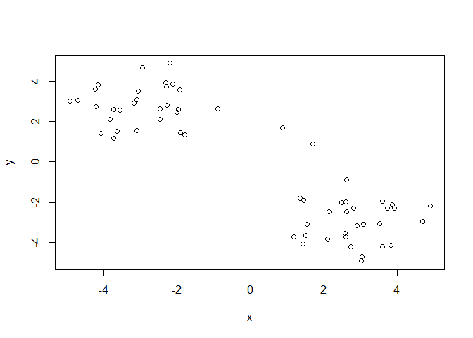
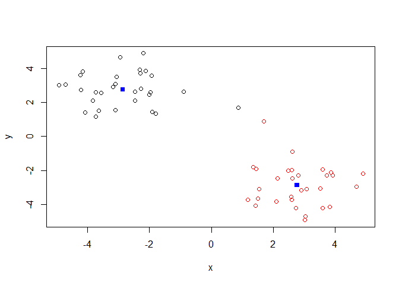
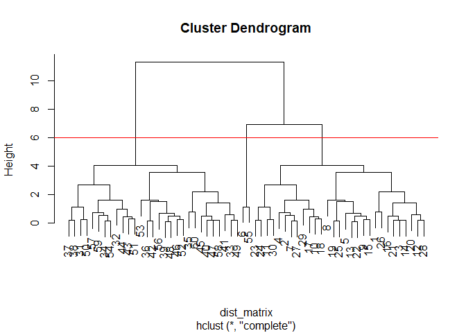
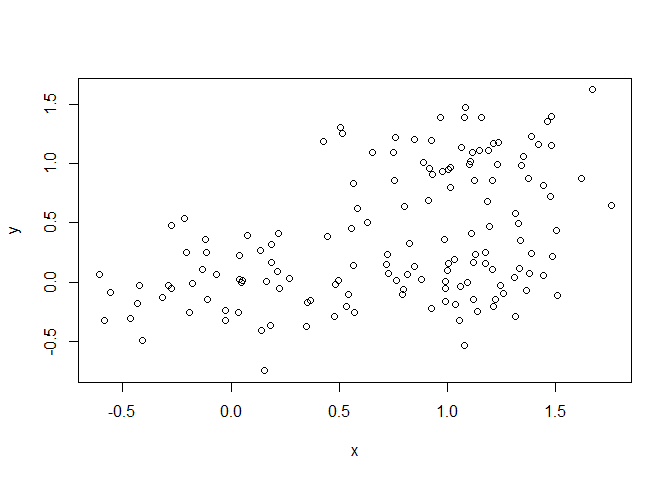
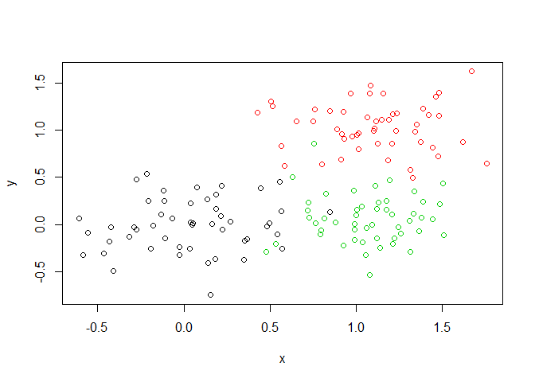
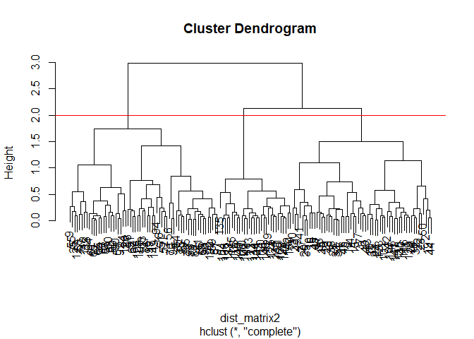
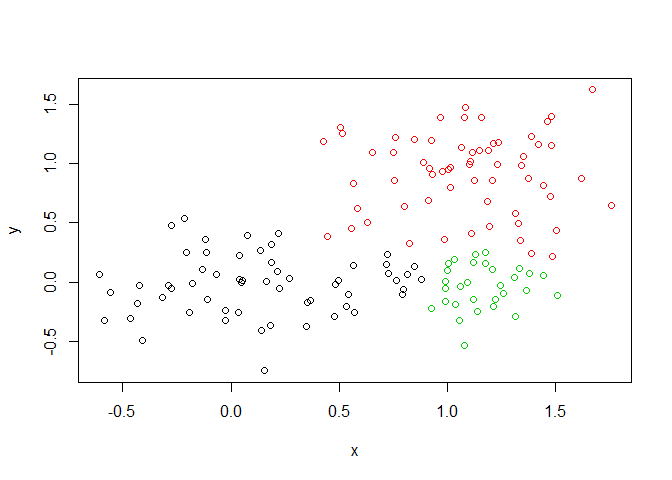

Class08
================
Tiffany
10/24/2019

``` r
# Generate some example data for clustering
tmp <- c(rnorm(30,-3), rnorm(30,3)) #takes clusters of 30 near the a value
x <- cbind(x=tmp, y=rev(tmp)) #binds the two clusters
plot(x)
```

<!-- -->

Use the kmeans() function setting k to 2 and nstart=20 Inspect/print the
results Q. How many points are in each cluster? 30 Q. What ‘component’
of your result object details - cluster size? - cluster
assignment/membership? - cluster center? Plot x colored by the kmeans
cluster assig

``` r
k<-kmeans(x, centers = 2, nstart=20)
```

print k

``` r
k
```

    ## K-means clustering with 2 clusters of sizes 30, 30
    ## 
    ## Cluster means:
    ##           x         y
    ## 1 -2.861389  2.767830
    ## 2  2.767830 -2.861389
    ## 
    ## Clustering vector:
    ##  [1] 1 1 1 1 1 1 1 1 1 1 1 1 1 1 1 1 1 1 1 1 1 1 1 1 1 1 1 1 1 1 2 2 2 2 2
    ## [36] 2 2 2 2 2 2 2 2 2 2 2 2 2 2 2 2 2 2 2 2 2 2 2 2 2
    ## 
    ## Within cluster sum of squares by cluster:
    ## [1] 71.17178 71.17178
    ##  (between_SS / total_SS =  87.0 %)
    ## 
    ## Available components:
    ## 
    ## [1] "cluster"      "centers"      "totss"        "withinss"    
    ## [5] "tot.withinss" "betweenss"    "size"         "iter"        
    ## [9] "ifault"

``` r
k$size #to access something from a list use the dollar sign
```

    ## [1] 30 30

``` r
k$cluster# this is assignment/ membership
```

    ##  [1] 1 1 1 1 1 1 1 1 1 1 1 1 1 1 1 1 1 1 1 1 1 1 1 1 1 1 1 1 1 1 2 2 2 2 2
    ## [36] 2 2 2 2 2 2 2 2 2 2 2 2 2 2 2 2 2 2 2 2 2 2 2 2 2

``` r
k$centers #the access to the centers
```

    ##           x         y
    ## 1 -2.861389  2.767830
    ## 2  2.767830 -2.861389

``` r
plot(x, col=k$cluster) #plots the clusters with two colors
points(k$centers, col="blue", pch=15) #highligts the center points of the two cluster
```

<!-- -->

\#hierarchecal cluster in R The `hclust()` fucntion requres a distance
matrix as input. You can get this from the `dist()` function

``` r
# First we need to calculate point (dis)similarity
# as the Euclidean distance between observations
dist_matrix <- dist(x)
# The hclust() function returns a hierarchical
# clustering model
hc <- hclust(d = dist_matrix)
# the print method is not so useful here
hc 
```

    ## 
    ## Call:
    ## hclust(d = dist_matrix)
    ## 
    ## Cluster method   : complete 
    ## Distance         : euclidean 
    ## Number of objects: 60

``` r
plot(hc)
abline(h=6, col="red") #whill show a red line on the dendogram where you want to cut
```

<!-- -->

``` r
cutree(hc, h=6) # Cut by height h
```

    ##  [1] 1 1 1 1 1 2 1 1 1 1 1 1 1 1 1 1 1 1 1 1 1 1 1 1 1 1 1 1 1 1 3 3 3 3 3
    ## [36] 3 3 3 3 3 3 3 3 3 3 3 3 3 3 3 3 3 3 3 2 3 3 3 3 3

``` r
#the results shows which cluster the data point belongs to (1 or 2)
```

# What do you notice?

The left side is all the \>= 30 and right side is all above 30 \# Does
the dendrogram make sense based on your knowledge of x? Yes, the smaller
branches are the values very close to each other and they the next
branch is the next closest dot to the pair and this cont.

``` r
cutree(hc, k=2) #cuts into k groups
```

    ##  [1] 1 1 1 1 1 1 1 1 1 1 1 1 1 1 1 1 1 1 1 1 1 1 1 1 1 1 1 1 1 1 2 2 2 2 2
    ## [36] 2 2 2 2 2 2 2 2 2 2 2 2 2 2 2 2 2 2 2 1 2 2 2 2 2

YOUR TURN

``` r
# Step 1. Generate some example data for clustering
x <- rbind(
 matrix(rnorm(100, mean=0, sd = 0.3), ncol = 2), # c1
 matrix(rnorm(100, mean = 1, sd = 0.3), ncol = 2), # c2
 matrix(c(rnorm(50, mean = 1, sd = 0.3), # c3
 rnorm(50, mean = 0, sd = 0.3)), ncol = 2))
colnames(x) <- c("x", "y")
# Step 2. Plot the data without clustering
plot(x)
```

<!-- -->

``` r
# Step 3. Generate colors for known clusters
# (just so we can compare to hclust results)
col <- as.factor( rep(c("c1","c2","c3"), each=50) )
plot(x, col=col)
```

<!-- -->

``` r
#clustering
dist_matrix2<- dist(x)
hc2 <- hclust(d = dist_matrix2)
#plot
plot(hc2)
abline(h=2, col="red") 
```

<!-- -->

``` r
#cut tree into cluster or groups
grps<-cutree(hc2, k=3)
grps
```

    ##   [1] 1 1 1 1 1 1 1 1 2 1 1 1 1 1 1 1 1 1 1 1 1 1 1 1 2 1 1 1 1 1 1 1 1 1 1
    ##  [36] 1 1 1 1 1 1 1 1 1 1 1 1 1 1 1 2 2 2 2 2 2 2 2 2 2 2 2 2 2 2 2 2 2 2 2
    ##  [71] 2 2 2 2 2 2 2 2 2 2 2 2 2 2 2 2 2 2 2 2 2 2 2 2 2 2 2 2 2 2 1 3 2 3 2
    ## [106] 3 1 2 3 3 3 2 3 3 3 1 2 1 3 3 3 3 1 3 3 2 2 3 3 3 3 3 3 3 3 1 2 2 1 1
    ## [141] 1 3 3 3 3 3 1 3 2 3

plotthe data with color = to clusters

``` r
plot(x, col=grps)
```

<!-- -->

How many points in each cluster?

``` r
table(grps)
```

    ## grps
    ##  1  2  3 
    ## 58 62 30

Cross tabulate ie compare our clusterign result with the known answer

``` r
table (grps,col)
```

    ##     col
    ## grps c1 c2 c3
    ##    1 48  0 10
    ##    2  2 50 10
    ##    3  0  0 30

\#Principle component analysis (PCA)

``` r
mydata <- read.csv("https://tinyurl.com/expression-CSV",
 row.names=1) 
head(mydata)
```

    ##        wt1 wt2  wt3  wt4 wt5 ko1 ko2 ko3 ko4 ko5
    ## gene1  439 458  408  429 420  90  88  86  90  93
    ## gene2  219 200  204  210 187 427 423 434 433 426
    ## gene3 1006 989 1030 1017 973 252 237 238 226 210
    ## gene4  783 792  829  856 760 849 856 835 885 894
    ## gene5  181 249  204  244 225 277 305 272 270 279
    ## gene6  460 502  491  491 493 612 594 577 618 638

How many genes are in this data sheet?

``` r
dim(mydata)
```

    ## [1] 100  10

``` r
nrow(mydata)
```

    ## [1] 100

Lets do PCA

``` r
## lets do PCA
pca<- prcomp(t(mydata), scale=TRUE) #t transposes the data

## See what is returned by the prcomp() function
attributes(pca) 
```

    ## $names
    ## [1] "sdev"     "rotation" "center"   "scale"    "x"       
    ## 
    ## $class
    ## [1] "prcomp"

\`\`\`{r}eval= FALSE \#\# lets do PCA pca \<- prcomp(t(mydata),
scale=TRUE) \#\# A basic PC1 vs PC2 2-D plot
plot(pca\(x[,1], pca\)x\[,2\]) \#\# Precent variance is often more
informative to look at pca.var \<- pca$sdev^2 pca.var.per \<-
round(pca.var/sum(pca.var)\*100, 1)

pca.var.per \[1\] 91.0 2.8

```` 


```r
pca.var <- pca$sdev^2
pca.var.per <- round(pca.var/sum(pca.var)*100, 1)

barplot(pca.var.per, main="Scree Plot",
 xlab="Principal Component", ylab="Percent Variation")
````

<!-- -->

``` r
#plot(pca$x,[1],pca$x,[2])
#blue, blue, blue, blue
```

``` r
x<-read.csv("UK_foods.csv", row.names = 1)
dim(x)
```

    ## [1] 17  4

Preview the first 6 rows

``` r
head(x)
```

    ##                England Wales Scotland N.Ireland
    ## Cheese             105   103      103        66
    ## Carcass_meat       245   227      242       267
    ## Other_meat         685   803      750       586
    ## Fish               147   160      122        93
    ## Fats_and_oils      193   235      184       209
    ## Sugars             156   175      147       139

``` r
barplot(as.matrix(x), beside=T, col=rainbow(nrow(x)))
```

<!-- -->

``` r
pairs(x, col=rainbow(10), pch=16)
```

<!-- -->

``` r
# Use the prcomp() PCA function 
pca <- prcomp( t(x) )
summary(pca)
```

    ## Importance of components:
    ##                             PC1      PC2      PC3       PC4
    ## Standard deviation     324.1502 212.7478 73.87622 4.189e-14
    ## Proportion of Variance   0.6744   0.2905  0.03503 0.000e+00
    ## Cumulative Proportion    0.6744   0.9650  1.00000 1.000e+00

``` r
plot(pca$x[,1], pca$x[,2], xlab="PC1", ylab="PC2", xlim=c(-270,500))
text(pca$x[,1], pca$x[,2], colnames(x))
```

<!-- -->
