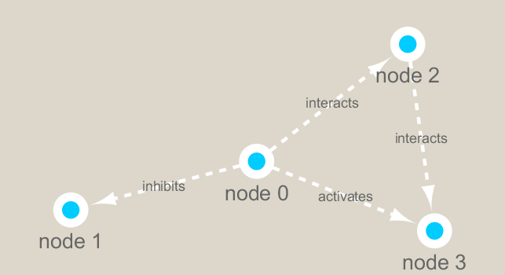

```{r setup, include=FALSE}
knitr::opts_chunk$set(echo = TRUE)
```

```{r}
library(RCy3)
library(igraph)
library(RColorBrewer)
```


```{r}, eval=FALSE
library(RCy3)

# Test the connection to Cytoscape.
cytoscapePing()
```

```{r}, eval=FALSE
# Check the version
cytoscapeVersionInfo()

```

```{r}
g <- makeSimpleIgraph()
createNetworkFromIgraph(g,"myGraph")
```


```{r}
fig <- exportImage(filename="demo", type="png", height=350)
```


```{r}
knitr::include_graphics("./demo.png")
```


```{r}
setVisualStyle("Marquee")
```


```{r}
fig <- exportImage(filename="demo_marquee", type="png", height=350)


```


```{r}
styles <- getVisualStyleNames()
styles
```

```{r}
#setVisualStyle(styles[13])
#setVisualStyle(styles[18])
```


```{r}
plot(g)
```

We will read in a species co-occurrence matrix that was calculated using Spearman Rank coefficient. (see reference Lima-Mendez et al. (2015) for details).


```{r}
## scripts for processing located in "inst/data-raw/"
prok_vir_cor <- read.delim("virus_prok_cor_abundant.tsv", stringsAsFactors = FALSE)

## Have a peak at the first 6 rows
head(prok_vir_cor)
```


```{r}
g <- graph.data.frame(prok_vir_cor, directed = FALSE)
```

```{r}
class(g)
```

#read the data
```{r}
g
```


```{r}
plot(g)
```


```{r}
plot(g, vertex.label=NA)
```

```{r}
plot(g, vertex.size=3, vertex.label=NA)
```


