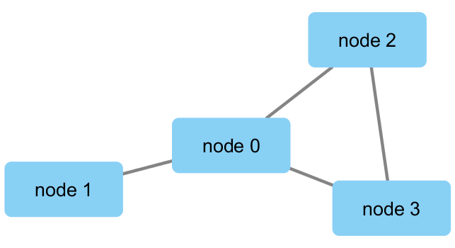

class 17
================

``` r
library(RCy3)
library(igraph)
```

    ## 
    ## Attaching package: 'igraph'

    ## The following objects are masked from 'package:stats':
    ## 
    ##     decompose, spectrum

    ## The following object is masked from 'package:base':
    ## 
    ##     union

``` r
library(RColorBrewer)
```

\`\`\`{r}, eval=FALSE library(RCy3)

# Test the connection to Cytoscape.

cytoscapePing()

```` 

```{r}, eval=FALSE
# Check the version
cytoscapeVersionInfo()
````

`{r}, eval=FALSE g <- makeSimpleIgraph()
createNetworkFromIgraph(g,"myGraph")`

`{r}, eval=FALSE fig <- exportImage(filename="demo", type="png",
height=350)`

``` r

```

<!-- -->

`{r}, eval=FALSE setVisualStyle("Marquee")`

\`\`\`{r}, eval=FALSE fig \<- exportImage(filename=“demo\_marquee”,
type=“png”, height=350)

knitr::include\_graphics(“./demo\_marquee.png”)

```` 


```{r}, eval=FALSE
styles <- getVisualStyleNames()
styles
````

`{r}, eval=FALSE #setVisualStyle(styles[13])
#setVisualStyle(styles[18])`

`{r}, eval=FALSE plot(g)`

We will read in a species co-occurrence matrix that was calculated using
Spearman Rank coefficient. (see reference Lima-Mendez et al. (2015) for
details).

\`\`\`{r}, eval=FALSE \#\# scripts for processing located in
“inst/data-raw/” prok\_vir\_cor \<-
read.delim(“virus\_prok\_cor\_abundant.tsv”, stringsAsFactors = FALSE)

## Have a peak at the first 6 rows

head(prok\_vir\_cor)

```` 


```{r}, eval=FALSE
g <- graph.data.frame(prok_vir_cor, directed = FALSE)
````

`{r}, eval=FALSE class(g)`

\#read the data `{r}, eval=FALSE g`

`{r}, eval=FALSE plot(g)`

`{r}, eval=FALSE plot(g, vertex.label=NA)`

`{r}, eval=FALSE plot(g, vertex.size=3, vertex.label=NA)`
