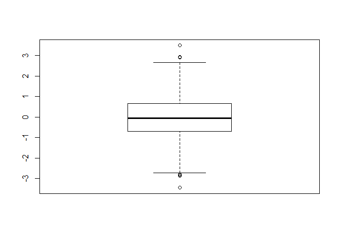
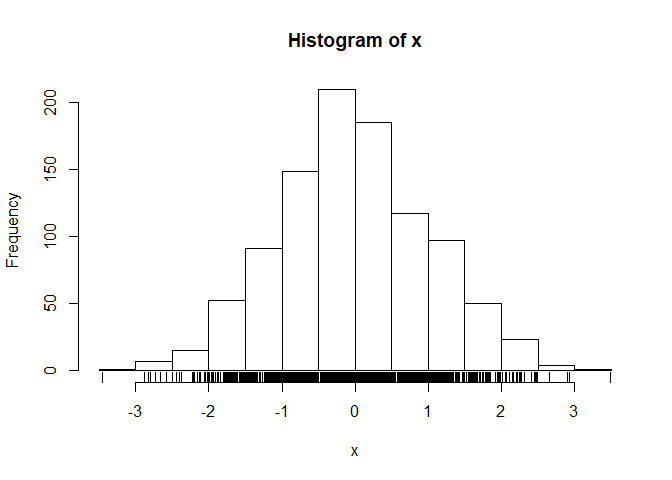
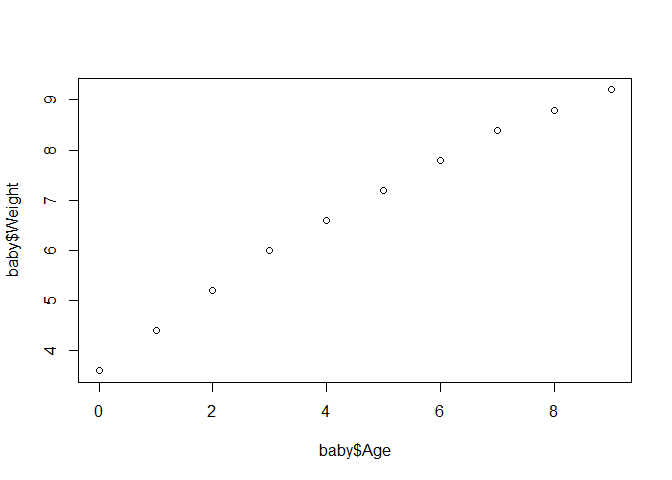
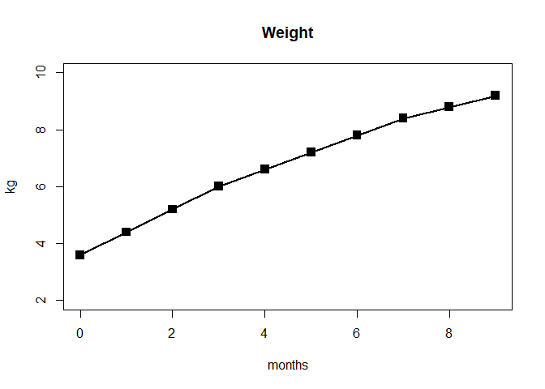
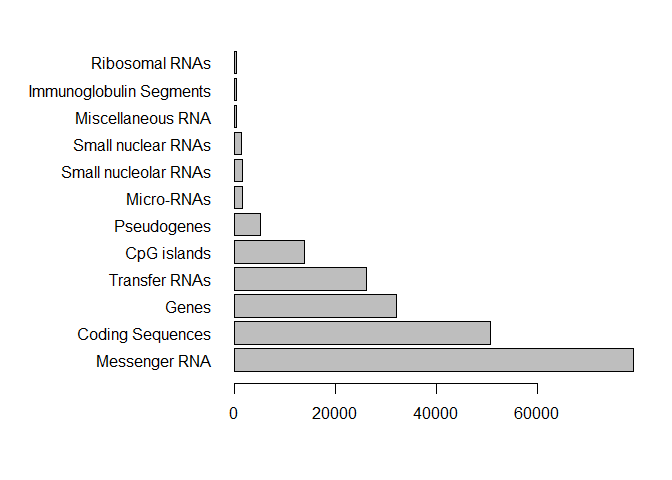
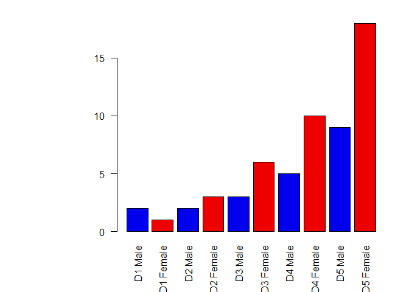

Class5: Data exploration and visualisation
================
Tiffany Tang
2019-10-31

``` r
#Class Data visualization
x <- rnorm(1000)

#some summary stats
mean(x)
```

    ## [1] -0.01305915

``` r
sd(x)
```

    ## [1] 1.037374

``` r
summary(x)#gives all the stats (min,1stqu,med,mean,3rdqu,max)
```

    ##     Min.  1st Qu.   Median     Mean  3rd Qu.     Max. 
    ## -3.45386 -0.69851 -0.05624 -0.01306  0.65577  3.49139

``` r
boxplot(x)#provides a box plot
```

<!-- -->

``` r
hist(x)#provides a histogram of the data
rug(x)#provides tallies at the bottom of the histogram
```

<!-- -->

``` r
#section 2A lineplots

baby<-read.table("bimm143_05_rstats/bimm143_05_rstats/weight_chart.txt",header = TRUE)


plot(baby$Age, baby$Weight)#baby is the access point to the data
```

<!-- -->

``` r
plot(baby$Age, baby$Weight, type="o", pch=15, cex=1.5, lwd=2, ylim=c(2,10), xlab="months",ylab = "kg", main="Weight")
```

<!-- -->

``` r
#type is gives the lines in the line plot
#pch is the dot style use (eg 15=filled squares)
#cex is the size of the dots
#lwd is the thickness of the line
#ylim=c() sets a parameter for the y axis (same concept for xlim)
#ylab= is label 
#main= is title

#Section 2B barplots
mouse<-read.table("bimm143_05_rstats/bimm143_05_rstats/feature_counts.txt", sep = "\t",header=TRUE)
par(mar=c(5,12,2,2))
barplot(mouse$Count, names.arg=mouse$Feature, horiz = TRUE, las=1)
```

<!-- -->

``` r
#Section 3A Colors
gender<-read.table("bimm143_05_rstats/bimm143_05_rstats/male_female_counts.txt", sep="\t",header=TRUE)
par(mar=c(5,10, 2, 2))
barplot(gender$Count,names.arg =gender$Sample,col=c("blue2","red2"), vertical= TRUE,las=2)
```

    ## Warning in plot.window(xlim, ylim, log = log, ...): "vertical" is not a
    ## graphical parameter

    ## Warning in axis(if (horiz) 2 else 1, at = at.l, labels = names.arg, lty =
    ## axis.lty, : "vertical" is not a graphical parameter

    ## Warning in title(main = main, sub = sub, xlab = xlab, ylab = ylab, ...):
    ## "vertical" is not a graphical parameter

    ## Warning in axis(if (horiz) 1 else 2, cex.axis = cex.axis, ...): "vertical"
    ## is not a graphical parameter

<!-- -->

``` r
#Section 3B 
updown<-read.delim("bimm143_05_rstats/bimm143_05_rstats/up_down_expression.txt")
```
