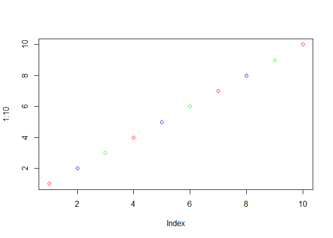

Class 7 R functions and packages
================
Tiffany
10/22/2019

## R Markdown

``` r
source("http://tinyurl.com/rescale-R")
```

``` r
rescale(1:10)
```

    ##  [1] 0.0000000 0.1111111 0.2222222 0.3333333 0.4444444 0.5555556 0.6666667
    ##  [8] 0.7777778 0.8888889 1.0000000

``` r
rescale(c(1,10,5,NA,6))
```

    ## [1] 0.0000000 1.0000000 0.4444444        NA 0.5555556

`{r},eval= FALSE rescale2(c(1:10, "barry"))`

`{r}, eval= FALSE rescale(c(1:10, "barry"))`

\#\#A new function called both\_na() Write a function to find where
there are NA elements in two input vectors.

First make some simple input where I know the answer

``` r
x <- c( 1, 2, NA, 3, NA)
y <- c(NA, 3, NA, 3, 4)
```

Looked online and found the **is.na()** function

``` r
is.na(x)
```

    ## [1] FALSE FALSE  TRUE FALSE  TRUE

``` r
which(is.na(x))
```

    ## [1] 3 5

and the **which()** function tells me where the TRUE values are

``` r
which(is.na(y))
```

    ## [1] 1 3

``` r
is.na(x)
```

    ## [1] FALSE FALSE  TRUE FALSE  TRUE

``` r
is.na(y)
```

    ## [1]  TRUE FALSE  TRUE FALSE FALSE

The AND function requires two input TRUE to give a TRUE output

``` r
is.na(x)& is.na(y)
```

    ## [1] FALSE FALSE  TRUE FALSE FALSE

Taking the **sum()** of TRUE FALSE vector will tell me how many TRUE
elements I have.This is my working snippet\!\!

``` r
sum(is.na(x)& is.na(y))
```

    ## [1] 1

``` r
sum(c(TRUE,TRUE,TRUE,FALSE))
```

    ## [1] 3

Now turn it into a function

``` r
both_na<-function(x,y) {
sum(is.na(x)& is.na(y))
}
```

``` r
both_na(x,y)
```

    ## [1] 1

``` r
x <- c(NA, NA, NA)
y1 <- c( 1, NA, NA)
y2 <- c( 1, NA, NA, NA)
```

``` r
both_na(x, y1)
```

    ## [1] 2

``` r
# What will this return?
both_na(x, y2)
```

    ## Warning in is.na(x) & is.na(y): longer object length is not a multiple of
    ## shorter object length

    ## [1] 3

``` r
x2 <-c(NA,NA)
```

``` r
both_na(x2,y2)
```

    ## [1] 3

``` r
plot(1:10, col= c("red","blue","green"))
```

<!-- -->

``` r
x<- c(1, NA, NA)
y3<- c(1, NA, NA, NA, NA, NA, NA)
both_na(x,y3)
```

    ## Warning in is.na(x) & is.na(y): longer object length is not a multiple of
    ## shorter object length

    ## [1] 4

``` r
x3<- c(1, NA, NA, 1, NA, NA, 1)
y3<- c(1, NA, NA, NA, NA, NA, NA)
both_na(x,y3)
```

    ## Warning in is.na(x) & is.na(y): longer object length is not a multiple of
    ## shorter object length

    ## [1] 4

``` r
length(x)
```

    ## [1] 3

``` r
length(y3)
```

    ## [1] 7

``` r
both_na2<-function(x,y) {
if (length(x)!=length(y)){
  stop("Inputs x and y should be the same length!")
}
sum(is.na(x)& is.na(y))
}
```

`{r}, eval= FALSE both_na2(x,y3)`

``` r
s1<-c(100,100,100,100,100,100,100,90)
s2<-c(100, NA, 90,90,90,90,97,80)
s1[-which.min(s1)]
```

    ## [1] 100 100 100 100 100 100 100

``` r
s2[-which.min(s2)]
```

    ## [1] 100  NA  90  90  90  90  97

``` r
mean(s1)
```

    ## [1] 98.75

``` r
mean(s2)
```

    ## [1] NA

This is our working snippet

``` r
s2[-which.min(s2)]
```

    ## [1] 100  NA  90  90  90  90  97

``` r
mean(s2[-which.min(s2)], na.rm=TRUE)
```

    ## [1] 92.83333

This is our working code

``` r
# there was another equation that i didn't get
```

``` r
grade<- function(x){
  if (any(is.na(x))) {
    warning("Student is missing HW")
  }
sum(x[-which.min(x)], na.rm=TRUE)/ (length=(x)-1)
}
```

``` r
grade(s2)
```

    ## Warning in grade(s2): Student is missing HW

    ## [1] 5.626263       NA 6.258427 6.258427 6.258427 6.258427 5.802083 7.050633

``` r
url<-("https://tinyurl.com/gradeinput")
hw<- read.csv(url)
```

`{r},eval= FALSE install.packages("datapasta")`

tibble::tribble( \~No., \~Location, \~Station.ID, \~Amount, 1,
“Nador-Aroui (Morocco)”, 60340, “318 mm”, 2, “Dakhla (Western
Sahara)”, 60096, “205.6 mm”, 3, “Matlapa, S.l.p. (Mexico)”, 76585,
“194 mm”, 4, “Alapuzha (India)”, 43352, “182 mm”, 5, “Cochin /
Willingdon (India)”, 43353, “166 mm”, 6, “Tampico, Tamps (Mexico)”,
76548, “160.1 mm”, 7, “Karaikal (India)”, 43346, “124.4 mm” )
