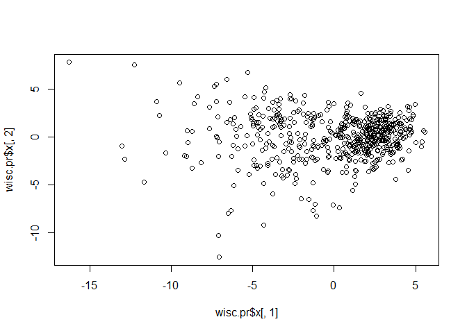
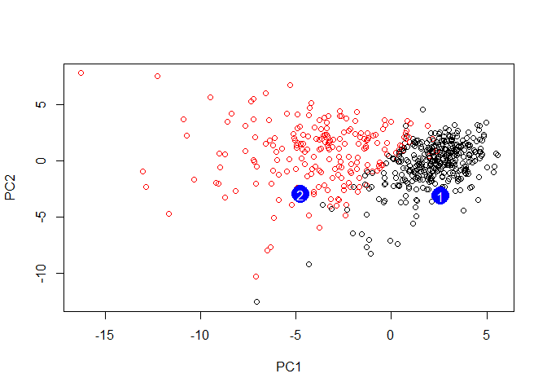

class09
================
Tiffany
10/29/2019

``` r
# Complete the following code to input the data and store as wisc.df
wisc.df <- read.csv("WisconsinCancer.csv")
head(wisc.df)
```

    ##         id diagnosis radius_mean texture_mean perimeter_mean area_mean
    ## 1   842302         M       17.99        10.38         122.80    1001.0
    ## 2   842517         M       20.57        17.77         132.90    1326.0
    ## 3 84300903         M       19.69        21.25         130.00    1203.0
    ## 4 84348301         M       11.42        20.38          77.58     386.1
    ## 5 84358402         M       20.29        14.34         135.10    1297.0
    ## 6   843786         M       12.45        15.70          82.57     477.1
    ##   smoothness_mean compactness_mean concavity_mean concave.points_mean
    ## 1         0.11840          0.27760         0.3001             0.14710
    ## 2         0.08474          0.07864         0.0869             0.07017
    ## 3         0.10960          0.15990         0.1974             0.12790
    ## 4         0.14250          0.28390         0.2414             0.10520
    ## 5         0.10030          0.13280         0.1980             0.10430
    ## 6         0.12780          0.17000         0.1578             0.08089
    ##   symmetry_mean fractal_dimension_mean radius_se texture_se perimeter_se
    ## 1        0.2419                0.07871    1.0950     0.9053        8.589
    ## 2        0.1812                0.05667    0.5435     0.7339        3.398
    ## 3        0.2069                0.05999    0.7456     0.7869        4.585
    ## 4        0.2597                0.09744    0.4956     1.1560        3.445
    ## 5        0.1809                0.05883    0.7572     0.7813        5.438
    ## 6        0.2087                0.07613    0.3345     0.8902        2.217
    ##   area_se smoothness_se compactness_se concavity_se concave.points_se
    ## 1  153.40      0.006399        0.04904      0.05373           0.01587
    ## 2   74.08      0.005225        0.01308      0.01860           0.01340
    ## 3   94.03      0.006150        0.04006      0.03832           0.02058
    ## 4   27.23      0.009110        0.07458      0.05661           0.01867
    ## 5   94.44      0.011490        0.02461      0.05688           0.01885
    ## 6   27.19      0.007510        0.03345      0.03672           0.01137
    ##   symmetry_se fractal_dimension_se radius_worst texture_worst
    ## 1     0.03003             0.006193        25.38         17.33
    ## 2     0.01389             0.003532        24.99         23.41
    ## 3     0.02250             0.004571        23.57         25.53
    ## 4     0.05963             0.009208        14.91         26.50
    ## 5     0.01756             0.005115        22.54         16.67
    ## 6     0.02165             0.005082        15.47         23.75
    ##   perimeter_worst area_worst smoothness_worst compactness_worst
    ## 1          184.60     2019.0           0.1622            0.6656
    ## 2          158.80     1956.0           0.1238            0.1866
    ## 3          152.50     1709.0           0.1444            0.4245
    ## 4           98.87      567.7           0.2098            0.8663
    ## 5          152.20     1575.0           0.1374            0.2050
    ## 6          103.40      741.6           0.1791            0.5249
    ##   concavity_worst concave.points_worst symmetry_worst
    ## 1          0.7119               0.2654         0.4601
    ## 2          0.2416               0.1860         0.2750
    ## 3          0.4504               0.2430         0.3613
    ## 4          0.6869               0.2575         0.6638
    ## 5          0.4000               0.1625         0.2364
    ## 6          0.5355               0.1741         0.3985
    ##   fractal_dimension_worst  X
    ## 1                 0.11890 NA
    ## 2                 0.08902 NA
    ## 3                 0.08758 NA
    ## 4                 0.17300 NA
    ## 5                 0.07678 NA
    ## 6                 0.12440 NA

Not that the`id` and and `dianogsis` columns will not be used formost of
the following steps

We have 569 samples in this database

``` r
nrow(wisc.df)
```

    ## [1] 569

How many benign (not cancerous) and malignant (cancerous) samples do we
have

``` r
table(wisc.df$diagnosis) #table(select data$ specify column)
```

    ## 
    ##   B   M 
    ## 357 212

# Convert the features of the data: wisc.data

``` r
wisc.data <- as.matrix( wisc.df[,3:32] )

# Set the row names of wisc.data
row.names(wisc.data) <- wisc.df$id

#head(wisc.data)
head(wisc.data)
```

    ##          radius_mean texture_mean perimeter_mean area_mean smoothness_mean
    ## 842302         17.99        10.38         122.80    1001.0         0.11840
    ## 842517         20.57        17.77         132.90    1326.0         0.08474
    ## 84300903       19.69        21.25         130.00    1203.0         0.10960
    ## 84348301       11.42        20.38          77.58     386.1         0.14250
    ## 84358402       20.29        14.34         135.10    1297.0         0.10030
    ## 843786         12.45        15.70          82.57     477.1         0.12780
    ##          compactness_mean concavity_mean concave.points_mean symmetry_mean
    ## 842302            0.27760         0.3001             0.14710        0.2419
    ## 842517            0.07864         0.0869             0.07017        0.1812
    ## 84300903          0.15990         0.1974             0.12790        0.2069
    ## 84348301          0.28390         0.2414             0.10520        0.2597
    ## 84358402          0.13280         0.1980             0.10430        0.1809
    ## 843786            0.17000         0.1578             0.08089        0.2087
    ##          fractal_dimension_mean radius_se texture_se perimeter_se area_se
    ## 842302                  0.07871    1.0950     0.9053        8.589  153.40
    ## 842517                  0.05667    0.5435     0.7339        3.398   74.08
    ## 84300903                0.05999    0.7456     0.7869        4.585   94.03
    ## 84348301                0.09744    0.4956     1.1560        3.445   27.23
    ## 84358402                0.05883    0.7572     0.7813        5.438   94.44
    ## 843786                  0.07613    0.3345     0.8902        2.217   27.19
    ##          smoothness_se compactness_se concavity_se concave.points_se
    ## 842302        0.006399        0.04904      0.05373           0.01587
    ## 842517        0.005225        0.01308      0.01860           0.01340
    ## 84300903      0.006150        0.04006      0.03832           0.02058
    ## 84348301      0.009110        0.07458      0.05661           0.01867
    ## 84358402      0.011490        0.02461      0.05688           0.01885
    ## 843786        0.007510        0.03345      0.03672           0.01137
    ##          symmetry_se fractal_dimension_se radius_worst texture_worst
    ## 842302       0.03003             0.006193        25.38         17.33
    ## 842517       0.01389             0.003532        24.99         23.41
    ## 84300903     0.02250             0.004571        23.57         25.53
    ## 84348301     0.05963             0.009208        14.91         26.50
    ## 84358402     0.01756             0.005115        22.54         16.67
    ## 843786       0.02165             0.005082        15.47         23.75
    ##          perimeter_worst area_worst smoothness_worst compactness_worst
    ## 842302            184.60     2019.0           0.1622            0.6656
    ## 842517            158.80     1956.0           0.1238            0.1866
    ## 84300903          152.50     1709.0           0.1444            0.4245
    ## 84348301           98.87      567.7           0.2098            0.8663
    ## 84358402          152.20     1575.0           0.1374            0.2050
    ## 843786            103.40      741.6           0.1791            0.5249
    ##          concavity_worst concave.points_worst symmetry_worst
    ## 842302            0.7119               0.2654         0.4601
    ## 842517            0.2416               0.1860         0.2750
    ## 84300903          0.4504               0.2430         0.3613
    ## 84348301          0.6869               0.2575         0.6638
    ## 84358402          0.4000               0.1625         0.2364
    ## 843786            0.5355               0.1741         0.3985
    ##          fractal_dimension_worst
    ## 842302                   0.11890
    ## 842517                   0.08902
    ## 84300903                 0.08758
    ## 84348301                 0.17300
    ## 84358402                 0.07678
    ## 843786                   0.12440

Store the diagnosis for reference in the future as a separate vector

``` r
dianogsis<-wisc.df$diagnosis
```

Q1. How many observations are in this dataset?

``` r
nrow(wisc.data)
```

    ## [1] 569

Q2. How many of the observations have a malignant diagnosis?

``` r
table(wisc.df$diagnosis)
```

    ## 
    ##   B   M 
    ## 357 212

Q3. How many variables/features in the data are suffixed with \_mean?

``` r
grep("_mean", colnames(wisc.df))# returns the position
```

    ##  [1]  3  4  5  6  7  8  9 10 11 12

``` r
grep("_mean", colnames(wisc.df), value = TRUE)
```

    ##  [1] "radius_mean"            "texture_mean"          
    ##  [3] "perimeter_mean"         "area_mean"             
    ##  [5] "smoothness_mean"        "compactness_mean"      
    ##  [7] "concavity_mean"         "concave.points_mean"   
    ##  [9] "symmetry_mean"          "fractal_dimension_mean"

\#by using the length function you get the number of the “means” from
the grep function

``` r
length(grep("_mean", colnames(wisc.df)))
```

    ## [1] 10

2.Principle Component Analysis \#Performing PCA The next step in your
analysis is to perform principal component analysis (PCA) on wisc.data.

It is important to check if the data need to be scaled before performing
PCA. Recall two common reasons for scaling data include:

The input variables use different units of measurement. The input
variables have significantly different variances. Check the mean and
standard deviation of the features (i.e. columns) of the wisc.data to
determine if the data should be scaled. Use the colMeans() and apply()
functions like you’ve done before.

``` r
# Check column means and standard deviations
round(colMeans(wisc.data), 3) # the round fucntion arounf the colmeans rounds the answers to 3 sigfigs as signify by the  ",3)" at the end
```

    ##             radius_mean            texture_mean          perimeter_mean 
    ##                  14.127                  19.290                  91.969 
    ##               area_mean         smoothness_mean        compactness_mean 
    ##                 654.889                   0.096                   0.104 
    ##          concavity_mean     concave.points_mean           symmetry_mean 
    ##                   0.089                   0.049                   0.181 
    ##  fractal_dimension_mean               radius_se              texture_se 
    ##                   0.063                   0.405                   1.217 
    ##            perimeter_se                 area_se           smoothness_se 
    ##                   2.866                  40.337                   0.007 
    ##          compactness_se            concavity_se       concave.points_se 
    ##                   0.025                   0.032                   0.012 
    ##             symmetry_se    fractal_dimension_se            radius_worst 
    ##                   0.021                   0.004                  16.269 
    ##           texture_worst         perimeter_worst              area_worst 
    ##                  25.677                 107.261                 880.583 
    ##        smoothness_worst       compactness_worst         concavity_worst 
    ##                   0.132                   0.254                   0.272 
    ##    concave.points_worst          symmetry_worst fractal_dimension_worst 
    ##                   0.115                   0.290                   0.084

``` r
round(apply(wisc.data,2,sd), 3)
```

    ##             radius_mean            texture_mean          perimeter_mean 
    ##                   3.524                   4.301                  24.299 
    ##               area_mean         smoothness_mean        compactness_mean 
    ##                 351.914                   0.014                   0.053 
    ##          concavity_mean     concave.points_mean           symmetry_mean 
    ##                   0.080                   0.039                   0.027 
    ##  fractal_dimension_mean               radius_se              texture_se 
    ##                   0.007                   0.277                   0.552 
    ##            perimeter_se                 area_se           smoothness_se 
    ##                   2.022                  45.491                   0.003 
    ##          compactness_se            concavity_se       concave.points_se 
    ##                   0.018                   0.030                   0.006 
    ##             symmetry_se    fractal_dimension_se            radius_worst 
    ##                   0.008                   0.003                   4.833 
    ##           texture_worst         perimeter_worst              area_worst 
    ##                   6.146                  33.603                 569.357 
    ##        smoothness_worst       compactness_worst         concavity_worst 
    ##                   0.023                   0.157                   0.209 
    ##    concave.points_worst          symmetry_worst fractal_dimension_worst 
    ##                   0.066                   0.062                   0.018

These values look very different so I will use `scale=TRUE` when I run
the PCA

``` r
# Perform PCA on wisc.data by completing the following code
wisc.pr <- prcomp(wisc.data, scale=TRUE)

# Look at summary of results
summary(wisc.pr)
```

    ## Importance of components:
    ##                           PC1    PC2     PC3     PC4     PC5     PC6
    ## Standard deviation     3.6444 2.3857 1.67867 1.40735 1.28403 1.09880
    ## Proportion of Variance 0.4427 0.1897 0.09393 0.06602 0.05496 0.04025
    ## Cumulative Proportion  0.4427 0.6324 0.72636 0.79239 0.84734 0.88759
    ##                            PC7     PC8    PC9    PC10   PC11    PC12
    ## Standard deviation     0.82172 0.69037 0.6457 0.59219 0.5421 0.51104
    ## Proportion of Variance 0.02251 0.01589 0.0139 0.01169 0.0098 0.00871
    ## Cumulative Proportion  0.91010 0.92598 0.9399 0.95157 0.9614 0.97007
    ##                           PC13    PC14    PC15    PC16    PC17    PC18
    ## Standard deviation     0.49128 0.39624 0.30681 0.28260 0.24372 0.22939
    ## Proportion of Variance 0.00805 0.00523 0.00314 0.00266 0.00198 0.00175
    ## Cumulative Proportion  0.97812 0.98335 0.98649 0.98915 0.99113 0.99288
    ##                           PC19    PC20   PC21    PC22    PC23   PC24
    ## Standard deviation     0.22244 0.17652 0.1731 0.16565 0.15602 0.1344
    ## Proportion of Variance 0.00165 0.00104 0.0010 0.00091 0.00081 0.0006
    ## Cumulative Proportion  0.99453 0.99557 0.9966 0.99749 0.99830 0.9989
    ##                           PC25    PC26    PC27    PC28    PC29    PC30
    ## Standard deviation     0.12442 0.09043 0.08307 0.03987 0.02736 0.01153
    ## Proportion of Variance 0.00052 0.00027 0.00023 0.00005 0.00002 0.00000
    ## Cumulative Proportion  0.99942 0.99969 0.99992 0.99997 1.00000 1.00000

# Q4. From your results, what proportion of the original variance is captured by the first principal components (PC1)?

the `Proportion of Variance` is how much the data capture the original
variance. For PC1 it capture 44% of the variance. PC2=19% etc.

``` r
x<-summary(wisc.pr)
x$importance["PC1"]
```

    ## [1] NA

``` r
#x$importance[,1]
```

\#Q5. How many principal components (PCs) are required to describe at
least 70% of the original variance in the data? 3 PC

``` r
x$importance[3,]> 0.7
```

    ##   PC1   PC2   PC3   PC4   PC5   PC6   PC7   PC8   PC9  PC10  PC11  PC12 
    ## FALSE FALSE  TRUE  TRUE  TRUE  TRUE  TRUE  TRUE  TRUE  TRUE  TRUE  TRUE 
    ##  PC13  PC14  PC15  PC16  PC17  PC18  PC19  PC20  PC21  PC22  PC23  PC24 
    ##  TRUE  TRUE  TRUE  TRUE  TRUE  TRUE  TRUE  TRUE  TRUE  TRUE  TRUE  TRUE 
    ##  PC25  PC26  PC27  PC28  PC29  PC30 
    ##  TRUE  TRUE  TRUE  TRUE  TRUE  TRUE

\#Q6. How many principal components (PCs) are required to describe at
least 90% of the original variance in the data?

``` r
which(x$importance[3,]> 0.9) [1]
```

    ## PC7 
    ##   7

``` r
plot(wisc.pr)
```

<!-- -->

Lets make a plot of PC1 vs PC2

``` r
plot(wisc.pr$x[,1], wisc.pr$x[,2] )
```

<!-- -->

Color by cancer/ non-cancer…

``` r
plot(wisc.pr$x[,1], wisc.pr$x[,2], col=dianogsis)
```

<!-- -->

``` r
## ggplot based graph
#install.packages("factoextra")
#to instal go to tools and type in the name of the package and press install
library(factoextra)
```

    ## Loading required package: ggplot2

    ## Welcome! Related Books: `Practical Guide To Cluster Analysis in R` at https://goo.gl/13EFCZ

``` r
fviz_eig(wisc.pr, addlabels = TRUE)
```

<!-- -->

3.  Hierarchical clustering Hierarchical clustering of case data The
    goal of this section is to do hierarchical clustering of the
    observations. Recall from our last class that this type of
    clustering does not assume in advance the number of natural groups
    that exist in the data.

As part of the preparation for hierarchical clustering, the distance
between all pairs of observations are computed. Furthermore, there are
different ways to link clusters together, with single, complete, and
average being the most common linkage methods.

Scale the wisc.data data and assign the result to data.scaled.

``` r
# Scale the wisc.data data: data.scaled
data.scaled <- scale(wisc.data)
```

Calculate the (Euclidean) distances between all pairs of observations in
the new scaled dataset and assign the result to data.dist.

``` r
data.dist <- dist(data.scaled)
```

``` r
wisc.hclust <- hclust(data.dist, method = "complete", members = NULL)
```

``` r
plot(wisc.hclust)
abline(h=19, col="red", lty=2)
```

<!-- -->

Clustering on PCA results In this final section, you will put together
several steps you used earlier and, in doing so, you will experience
some of the creativity and open endedness that is typical in
unsupervised learning.

Recall from earlier sections that the PCA model required significantly
fewer features to describe 70%, 80% and 95% of the variability of the
data. In addition to normalizing data and potentially avoiding
over-fitting, PCA also uncorrelates the variables, sometimes improving
the performance of other modeling techniques.

Let’s see if PCA improves or degrades the performance of hierarchical
clustering.

Using the minimum number of principal components required to describe at
least 90% of the variability in the data, create a hierarchical
clustering model with the linkage method=“ward.D2”. We use Ward’s
criterion here because it is based on multidimensional variance like
principal components analysis. Assign the results to wisc.pr.hclust.

``` r
hclust(dist(dist(wisc.pr$x[,1:3])))
```

    ## 
    ## Call:
    ## hclust(d = dist(dist(wisc.pr$x[, 1:3])))
    ## 
    ## Cluster method   : complete 
    ## Distance         : euclidean 
    ## Number of objects: 569

First the original data

Let’s see the if the PCA improves or `{r}, eval=FALSE
wisc.pr.hclust<-hclust(dist(wisc.pr))`

7.  Prediction We will use the predict() function that will take our PCA
    model from before and new cancer cell data and project that data
    onto our PCA space.

<!-- end list -->

``` r
#url <- "new_samples.csv"
url <- "https://tinyurl.com/new-samples-CSV"
new <- read.csv(url)
npc <- predict(wisc.pr, newdata=new)
npc
```

    ##            PC1       PC2        PC3        PC4       PC5        PC6
    ## [1,]  2.576616 -3.135913  1.3990492 -0.7631950  2.781648 -0.8150185
    ## [2,] -4.754928 -3.009033 -0.1660946 -0.6052952 -1.140698 -1.2189945
    ##             PC7        PC8       PC9       PC10      PC11      PC12
    ## [1,] -0.3959098 -0.2307350 0.1029569 -0.9272861 0.3411457  0.375921
    ## [2,]  0.8193031 -0.3307423 0.5281896 -0.4855301 0.7173233 -1.185917
    ##           PC13     PC14      PC15       PC16        PC17        PC18
    ## [1,] 0.1610764 1.187882 0.3216974 -0.1743616 -0.07875393 -0.11207028
    ## [2,] 0.5893856 0.303029 0.1299153  0.1448061 -0.40509706  0.06565549
    ##             PC19       PC20       PC21       PC22       PC23       PC24
    ## [1,] -0.08802955 -0.2495216  0.1228233 0.09358453 0.08347651  0.1223396
    ## [2,]  0.25591230 -0.4289500 -0.1224776 0.01732146 0.06316631 -0.2338618
    ##             PC25         PC26         PC27        PC28         PC29
    ## [1,]  0.02124121  0.078884581  0.220199544 -0.02946023 -0.015620933
    ## [2,] -0.20755948 -0.009833238 -0.001134152  0.09638361  0.002795349
    ##              PC30
    ## [1,]  0.005269029
    ## [2,] -0.019015820

``` r
plot(wisc.pr$x[,1:2], col=dianogsis)
points(npc[,1], npc[,2], col="blue", pch=16, cex=3)
text(npc[,1], npc[,2], label=c(1,2), col="white")
```

<!-- -->

Q17. Which of these new patients should we prioritize for follow up
based on your results? -we should prioritize patient 2 for treatment
