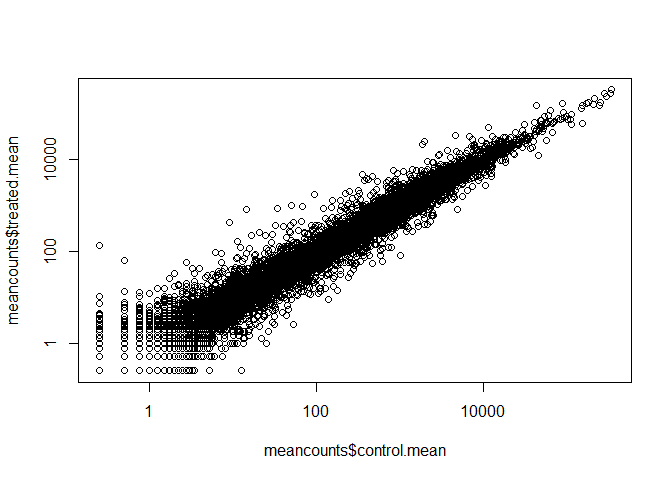

Transcriptomics and the analysis of RNA-Seq data
================

\#DESeq2 setup

We will use the DESeq2 package from bioconductor. To install this we ran
**in the CONSOLE** - note eval=FALSE option\!:

``` r
install.packages("BiocManager")
BiocManager::install()
BiocManager::install("DESeq2")
```

\#\#Input data

``` r
counts <- read.csv("airway_scaledcounts.csv", stringsAsFactors = FALSE)
metadata <-  read.csv("airway_metadata.csv", stringsAsFactors = FALSE)
```

Have a peak…

``` r
head(counts)
```

    ##           ensgene SRR1039508 SRR1039509 SRR1039512 SRR1039513 SRR1039516
    ## 1 ENSG00000000003        723        486        904        445       1170
    ## 2 ENSG00000000005          0          0          0          0          0
    ## 3 ENSG00000000419        467        523        616        371        582
    ## 4 ENSG00000000457        347        258        364        237        318
    ## 5 ENSG00000000460         96         81         73         66        118
    ## 6 ENSG00000000938          0          0          1          0          2
    ##   SRR1039517 SRR1039520 SRR1039521
    ## 1       1097        806        604
    ## 2          0          0          0
    ## 3        781        417        509
    ## 4        447        330        324
    ## 5         94        102         74
    ## 6          0          0          0

``` r
head(metadata)
```

    ##           id     dex celltype     geo_id
    ## 1 SRR1039508 control   N61311 GSM1275862
    ## 2 SRR1039509 treated   N61311 GSM1275863
    ## 3 SRR1039512 control  N052611 GSM1275866
    ## 4 SRR1039513 treated  N052611 GSM1275867
    ## 5 SRR1039516 control  N080611 GSM1275870
    ## 6 SRR1039517 treated  N080611 GSM1275871

How many genes do we have in this dataset?

``` r
nrow(counts)
```

    ## [1] 38694

How many experiments do we have

``` r
ncol(counts)
```

    ## [1] 9

``` r
nrow(metadata)
```

    ## [1] 8

3.  Toy differential gene expression we want to know if there is a
    differnece in expression values for contraol (non-drug) vs treated
    (i.e drug added to the cell lines)

First step is to find the mean value of the control and the treated and
compare them.

``` r
View(metadata)
```

We’re going to specify the “dex” using the “==”

``` r
control <- metadata[metadata[,"dex"]=="control",]
control.mean <- rowSums( counts[ ,control$id] )/4 
names(control.mean) <- counts$ensgene
```

Why did we divide by 4?

``` r
control <- metadata[metadata[,"dex"]=="control",]
control$id
```

    ## [1] "SRR1039508" "SRR1039512" "SRR1039516" "SRR1039520"

Q1. How would you make the above code more robust? It is not robust bc
the code is hard coded to divide by four. This would not be favorable if
the data set changed. What would happen if you were to add more samples.
Would the values obtained with the excat code above be correct?

How calculate the mean calues accross these control columns of
**countsdata**

``` r
control.mean<- rowSums(counts[,control$id]/length(control$id))
names(control.mean)<- counts$ensgene
control.mean
```

    ## ENSG00000000003 ENSG00000000005 ENSG00000000419 ENSG00000000457 
    ##          900.75            0.00          520.50          339.75 
    ## ENSG00000000460 ENSG00000000938 ENSG00000000971 ENSG00000001036 
    ##           97.25            0.75         5219.00         2327.00 
    ## ENSG00000001084 ENSG00000001167 ENSG00000001460 ENSG00000001461 
    ##          755.75          527.75          226.75         3169.50 
    ## ENSG00000001497 ENSG00000001561 ENSG00000001617 ENSG00000001626 
    ##          589.50          110.50          695.25           11.25 
    ## ENSG00000001629 ENSG00000001630 ENSG00000001631 ENSG00000002016 
    ##         2146.00         1117.50          936.00          251.25 
    ## ENSG00000002079 ENSG00000002330 ENSG00000002549 ENSG00000002586 
    ##            2.25          735.00         1249.25         8802.75 
    ## ENSG00000002587 ENSG00000002726 ENSG00000002745 ENSG00000002746 
    ##            1.75            1.25            9.75          125.00 
    ## ENSG00000002822 ENSG00000002834 ENSG00000002919 ENSG00000002933 
    ##          385.25         7889.00          237.50          498.75 
    ## ENSG00000003056 ENSG00000003096 ENSG00000003137 ENSG00000003147 
    ##         1962.25          581.25          149.25            9.00 
    ## ENSG00000003249 ENSG00000003393 ENSG00000003400 ENSG00000003402 
    ##          146.50          900.00          107.00         2244.25 
    ## ENSG00000003436 ENSG00000003509 ENSG00000003756 ENSG00000003987 
    ##         6153.75          338.25         3384.25           24.25 
    ## ENSG00000003989 ENSG00000004059 ENSG00000004139 ENSG00000004142 
    ##           33.75         1562.75          341.00         1498.50 
    ## ENSG00000004399 ENSG00000004455 ENSG00000004468 ENSG00000004478 
    ##         4037.50         1376.50            5.50          664.00 
    ## ENSG00000004487 ENSG00000004534 ENSG00000004660 ENSG00000004700 
    ##         1510.25         1563.50          100.00         1390.00 
    ## ENSG00000004766 ENSG00000004776 ENSG00000004777 ENSG00000004779 
    ##          550.50        13843.75          126.25          380.75 
    ## ENSG00000004799 ENSG00000004809 ENSG00000004838 ENSG00000004846 
    ##          270.50            1.50           23.00           35.75 
    ## ENSG00000004848 ENSG00000004864 ENSG00000004866 ENSG00000004897 
    ##            0.00          158.75          686.75         1894.75 
    ## ENSG00000004939 ENSG00000004948 ENSG00000004961 ENSG00000004975 
    ##           11.50            0.00          499.25         1199.75 
    ## ENSG00000005001 ENSG00000005007 ENSG00000005020 ENSG00000005022 
    ##            0.00         2255.50          779.50         1430.75 
    ## ENSG00000005059 ENSG00000005073 ENSG00000005075 ENSG00000005100 
    ##          211.25            0.75          640.25          481.50 
    ## ENSG00000005102 ENSG00000005108 ENSG00000005156 ENSG00000005175 
    ##            1.00            9.00          347.25          399.50 
    ## ENSG00000005187 ENSG00000005189 ENSG00000005194 ENSG00000005206 
    ##           31.50           96.25          476.00          711.25 
    ## ENSG00000005238 ENSG00000005243 ENSG00000005249 ENSG00000005302 
    ##          815.00         1093.75          250.50          472.25 
    ## ENSG00000005339 ENSG00000005379 ENSG00000005381 ENSG00000005421 
    ##         2897.25          160.00            4.50            0.25 
    ## ENSG00000005436 ENSG00000005448 ENSG00000005469 ENSG00000005471 
    ##          305.25          228.00          490.25           48.75 
    ## ENSG00000005483 ENSG00000005486 ENSG00000005513 ENSG00000005700 
    ##         1994.75          968.75            5.50          641.00 
    ## ENSG00000005801 ENSG00000005810 ENSG00000005812 ENSG00000005844 
    ##          258.75         3123.00         1365.50            4.50 
    ## ENSG00000005882 ENSG00000005884 ENSG00000005889 ENSG00000005893 
    ##         1192.00         1232.00          839.25         5427.25 
    ## ENSG00000005961 ENSG00000005981 ENSG00000006007 ENSG00000006015 
    ##           13.50            8.00         2644.00          412.50 
    ## ENSG00000006016 ENSG00000006025 ENSG00000006042 ENSG00000006047 
    ##          151.50          209.00         3365.00            0.75 
    ## ENSG00000006059 ENSG00000006062 ENSG00000006071 ENSG00000006116 
    ##            0.00          333.75            0.00            0.75 
    ## ENSG00000006118 ENSG00000006125 ENSG00000006128 ENSG00000006194 
    ##          592.25         7030.25            0.25          570.25 
    ## ENSG00000006210 ENSG00000006282 ENSG00000006283 ENSG00000006327 
    ##           11.25         1533.25           90.25          660.75 
    ## ENSG00000006377 ENSG00000006432 ENSG00000006451 ENSG00000006453 
    ##            0.00            8.25         1410.00          248.25 
    ## ENSG00000006459 ENSG00000006468 ENSG00000006530 ENSG00000006534 
    ##          436.25          211.25          298.75         1073.25 
    ## ENSG00000006555 ENSG00000006576 ENSG00000006606 ENSG00000006607 
    ##            6.00         1311.00            5.25          815.50 
    ## ENSG00000006611 ENSG00000006625 ENSG00000006634 ENSG00000006638 
    ##            0.00          198.75          112.00           79.50 
    ## ENSG00000006652 ENSG00000006659 ENSG00000006695 ENSG00000006704 
    ##         1185.25            1.75          183.00          315.75 
    ## ENSG00000006712 ENSG00000006715 ENSG00000006740 ENSG00000006744 
    ##         1302.75         2495.25           46.00          931.50 
    ## ENSG00000006747 ENSG00000006756 ENSG00000006757 ENSG00000006788 
    ##           27.25          585.25          182.00            2.75 
    ## ENSG00000006831 ENSG00000006837 ENSG00000007001 ENSG00000007038 
    ##         1075.00           84.50            2.50            0.75 
    ## ENSG00000007047 ENSG00000007062 ENSG00000007080 ENSG00000007129 
    ##          891.75            3.25          655.75            0.00 
    ## ENSG00000007168 ENSG00000007171 ENSG00000007174 ENSG00000007202 
    ##         4213.00            1.75            2.50         6982.00 
    ## ENSG00000007216 ENSG00000007237 ENSG00000007255 ENSG00000007264 
    ##            0.00          549.25          125.75            3.00 
    ## ENSG00000007306 ENSG00000007312 ENSG00000007314 ENSG00000007341 
    ##            0.00            1.75            1.00          278.50 
    ## ENSG00000007350 ENSG00000007372 ENSG00000007376 ENSG00000007384 
    ##            0.00           38.75          265.50         1887.00 
    ## ENSG00000007392 ENSG00000007402 ENSG00000007516 ENSG00000007520 
    ##          761.75           18.75           12.75          604.50 
    ## ENSG00000007541 ENSG00000007545 ENSG00000007866 ENSG00000007908 
    ##          645.75          632.50         1410.50            0.00 
    ## ENSG00000007923 ENSG00000007933 ENSG00000007944 ENSG00000007952 
    ##         1066.75          871.75          437.50            8.00 
    ## ENSG00000007968 ENSG00000008018 ENSG00000008056 ENSG00000008083 
    ##            4.00         1596.75           14.75          272.25 
    ## ENSG00000008086 ENSG00000008118 ENSG00000008128 ENSG00000008130 
    ##          426.50            9.75          563.00         1319.25 
    ## ENSG00000008196 ENSG00000008197 ENSG00000008226 ENSG00000008256 
    ##            1.75            0.00            8.75         2458.00 
    ## ENSG00000008277 ENSG00000008282 ENSG00000008283 ENSG00000008294 
    ##           20.25         1898.25          557.00         3317.25 
    ## ENSG00000008300 ENSG00000008311 ENSG00000008323 ENSG00000008324 
    ##           86.25          475.25           10.25          103.75 
    ## ENSG00000008382 ENSG00000008394 ENSG00000008405 ENSG00000008438 
    ##          163.50         4053.00          292.75            0.50 
    ## ENSG00000008441 ENSG00000008513 ENSG00000008516 ENSG00000008517 
    ##        12969.25         2022.50           27.00          162.50 
    ## ENSG00000008710 ENSG00000008735 ENSG00000008838 ENSG00000008853 
    ##         4750.75           18.25         1248.25          793.25 
    ## ENSG00000008869 ENSG00000008952 ENSG00000008988 ENSG00000009307 
    ##          739.50         5380.50        11842.25        17268.25 
    ## ENSG00000009335 ENSG00000009413 ENSG00000009694 ENSG00000009709 
    ##         2132.00         6053.50            6.25            0.00 
    ## ENSG00000009724 ENSG00000009765 ENSG00000009780 ENSG00000009790 
    ##           48.00            5.50          160.50            5.50 
    ## ENSG00000009830 ENSG00000009844 ENSG00000009950 ENSG00000009954 
    ##          441.50          970.50            5.75         3183.25 
    ## ENSG00000010017 ENSG00000010030 ENSG00000010072 ENSG00000010165 
    ##         1781.75           21.75          199.00         1015.25 
    ## ENSG00000010219 ENSG00000010244 ENSG00000010256 ENSG00000010270 
    ##          278.75         2863.25         1628.25          834.50 
    ## ENSG00000010278 ENSG00000010282 ENSG00000010292 ENSG00000010295 
    ##         3249.75            0.00         1319.50         1310.25 
    ## ENSG00000010310 ENSG00000010318 ENSG00000010319 ENSG00000010322 
    ##           25.75           74.50            0.50         3015.50 
    ## ENSG00000010327 ENSG00000010361 ENSG00000010379 ENSG00000010404 
    ##            1.50          249.50            1.75         2923.75 
    ## ENSG00000010438 ENSG00000010539 ENSG00000010610 ENSG00000010626 
    ##           18.25          152.50           71.75          174.75 
    ## ENSG00000010671 ENSG00000010704 ENSG00000010803 ENSG00000010810 
    ##            0.75          543.00          815.00         1827.25 
    ## ENSG00000010818 ENSG00000010932 ENSG00000011007 ENSG00000011009 
    ##         1820.00           25.50         1371.75          486.75 
    ## ENSG00000011021 ENSG00000011028 ENSG00000011052 ENSG00000011083 
    ##          727.75        19624.75          287.25            0.50 
    ## ENSG00000011105 ENSG00000011114 ENSG00000011132 ENSG00000011143 
    ##         3505.50          635.25          233.75          188.25 
    ## ENSG00000011198 ENSG00000011201 ENSG00000011243 ENSG00000011258 
    ##          801.50            0.75          885.75          436.50 
    ## ENSG00000011260 ENSG00000011275 ENSG00000011295 ENSG00000011304 
    ##          405.75         1849.25          430.75         3398.25 
    ## ENSG00000011332 ENSG00000011347 ENSG00000011376 ENSG00000011405 
    ##           14.75          204.25          455.00         1492.00 
    ## ENSG00000011422 ENSG00000011426 ENSG00000011451 ENSG00000011454 
    ##          403.75          281.50         1529.50         2157.25 
    ## ENSG00000011465 ENSG00000011478 ENSG00000011485 ENSG00000011523 
    ##       331697.00          119.50          901.00          858.00 
    ## ENSG00000011566 ENSG00000011590 ENSG00000011600 ENSG00000011638 
    ##         1116.25            4.00            1.75          864.00 
    ## ENSG00000011677 ENSG00000012048 ENSG00000012061 ENSG00000012124 
    ##            0.50          378.50         1245.25            3.75 
    ## ENSG00000012171 ENSG00000012174 ENSG00000012211 ENSG00000012223 
    ##         1683.50          765.25          125.25            0.75 
    ## ENSG00000012232 ENSG00000012504 ENSG00000012660 ENSG00000012779 
    ##         1327.00            0.00         2189.50            0.00 
    ## ENSG00000012817 ENSG00000012822 ENSG00000012963 ENSG00000012983 
    ##          778.75         5672.75          366.75         2301.00 
    ## ENSG00000013016 ENSG00000013275 ENSG00000013288 ENSG00000013293 
    ##         1701.50          473.00         3350.25          376.75 
    ## ENSG00000013297 ENSG00000013306 ENSG00000013364 ENSG00000013374 
    ##         5568.00         1060.50         8592.50         1569.25 
    ## ENSG00000013375 ENSG00000013392 ENSG00000013441 ENSG00000013503 
    ##         1648.25          269.25         2537.50          333.00 
    ## ENSG00000013523 ENSG00000013561 ENSG00000013563 ENSG00000013573 
    ##          455.25          918.50          596.75          269.00 
    ## ENSG00000013583 ENSG00000013588 ENSG00000013619 ENSG00000013725 
    ##         1369.50          701.50         1047.00            8.50 
    ## ENSG00000013810 ENSG00000014123 ENSG00000014138 ENSG00000014164 
    ##           91.25          975.75          204.25          471.25 
    ## ENSG00000014216 ENSG00000014257 ENSG00000014641 ENSG00000014824 
    ##         3381.50           23.25         1640.00         1330.25 
    ## ENSG00000014914 ENSG00000014919 ENSG00000015133 ENSG00000015153 
    ##          666.25          699.00            2.75          255.50 
    ## ENSG00000015171 ENSG00000015285 ENSG00000015413 ENSG00000015475 
    ##         2409.00            7.00            0.50          368.50 
    ## ENSG00000015479 ENSG00000015520 ENSG00000015532 ENSG00000015568 
    ##         6074.75           32.00          713.25          182.50 
    ## ENSG00000015592 ENSG00000015676 ENSG00000016082 ENSG00000016391 
    ##            0.50         1735.00            0.25          155.00 
    ## ENSG00000016402 ENSG00000016490 ENSG00000016602 ENSG00000016864 
    ##           15.25            0.50            0.25         1654.00 
    ## ENSG00000017260 ENSG00000017427 ENSG00000017483 ENSG00000017797 
    ##         3271.00          920.75          611.00         2937.75 
    ## ENSG00000018189 ENSG00000018236 ENSG00000018280 ENSG00000018408 
    ##         1129.00           60.25           17.00         2914.25 
    ## ENSG00000018510 ENSG00000018607 ENSG00000018610 ENSG00000018625 
    ##          840.00            0.25          318.00         1092.50 
    ## ENSG00000018699 ENSG00000018869 ENSG00000019102 ENSG00000019144 
    ##          281.75           63.75            5.75         3287.25 
    ## ENSG00000019169 ENSG00000019186 ENSG00000019485 ENSG00000019505 
    ##            0.00           26.50          280.00            1.25 
    ## ENSG00000019549 ENSG00000019582 ENSG00000019991 ENSG00000019995 
    ##         3054.50           55.75         1773.50         1556.25 
    ## ENSG00000020129 ENSG00000020181 ENSG00000020219 ENSG00000020256 
    ##         1324.00        11392.75            0.50          379.50 
    ## ENSG00000020426 ENSG00000020577 ENSG00000020633 ENSG00000020922 
    ##          253.25         2014.00           86.25          537.50 
    ## ENSG00000021300 ENSG00000021355 ENSG00000021461 ENSG00000021488 
    ##           20.00          562.25            3.25            4.25 
    ## ENSG00000021574 ENSG00000021645 ENSG00000021762 ENSG00000021776 
    ##          533.00           21.75         1231.50         1362.25 
    ## ENSG00000021826 ENSG00000021852 ENSG00000022267 ENSG00000022277 
    ##          379.50            0.00         9314.50         2153.50 
    ## ENSG00000022355 ENSG00000022556 ENSG00000022567 ENSG00000022840 
    ##            0.00            4.25          158.75         2759.00 
    ## ENSG00000022976 ENSG00000023041 ENSG00000023171 ENSG00000023191 
    ##          194.25          677.00          129.25         2482.00 
    ## ENSG00000023228 ENSG00000023287 ENSG00000023318 ENSG00000023330 
    ##         1803.00         2860.50         1390.75         1139.75 
    ## ENSG00000023445 ENSG00000023516 ENSG00000023572 ENSG00000023608 
    ##           61.25         2043.00           93.25          335.00 
    ## ENSG00000023697 ENSG00000023734 ENSG00000023839 ENSG00000023892 
    ##          478.00         1957.25           16.00            6.25 
    ## ENSG00000023902 ENSG00000023909 ENSG00000024048 ENSG00000024422 
    ##          658.00         1221.25         1364.50        11539.50 
    ## ENSG00000024526 ENSG00000024862 ENSG00000025039 ENSG00000025156 
    ##           23.50          229.00            9.00          293.25 
    ## ENSG00000025293 ENSG00000025423 ENSG00000025434 ENSG00000025708 
    ##         1615.25          295.00          402.50          114.00 
    ## ENSG00000025770 ENSG00000025772 ENSG00000025796 ENSG00000025800 
    ##          383.75          982.00         3879.00         2180.00 
    ## ENSG00000026025 ENSG00000026036 ENSG00000026103 ENSG00000026297 
    ##       110608.00          250.25         1210.00          266.75 
    ## ENSG00000026508 ENSG00000026559 ENSG00000026652 ENSG00000026751 
    ##        26231.50           32.25          429.50            0.75 
    ## ENSG00000026950 ENSG00000027001 ENSG00000027075 ENSG00000027644 
    ##          955.75          699.75           80.25            1.00 
    ## ENSG00000027697 ENSG00000027847 ENSG00000027869 ENSG00000028116 
    ##         1331.25          472.25            0.50          278.25 
    ## ENSG00000028137 ENSG00000028203 ENSG00000028277 ENSG00000028310 
    ##          405.25         1301.75           88.25          619.50 
    ## ENSG00000028528 ENSG00000028839 ENSG00000029153 ENSG00000029363 
    ##         3785.25          540.00          372.50         3714.50 
    ## ENSG00000029364 ENSG00000029534 ENSG00000029559 ENSG00000029639 
    ##         1564.25          105.50            1.25          119.00 
    ## ENSG00000029725 ENSG00000029993 ENSG00000030066 ENSG00000030110 
    ##         2063.25          740.75          992.25          184.75 
    ## ENSG00000030304 ENSG00000030419 ENSG00000030582 ENSG00000031003 
    ##           32.50          213.75        12420.25         1498.00 
    ## ENSG00000031081 ENSG00000031691 ENSG00000031698 ENSG00000031823 
    ##          456.75           86.50         3590.75         2004.50 
    ## ENSG00000032219 ENSG00000032389 ENSG00000032444 ENSG00000032742 
    ##          730.50          226.25         1522.00          304.50 
    ## ENSG00000033011 ENSG00000033030 ENSG00000033050 ENSG00000033100 
    ##          567.00          414.50         1224.75         2486.50 
    ## ENSG00000033122 ENSG00000033170 ENSG00000033178 ENSG00000033327 
    ##           10.25         1814.50         1161.25         1205.50 
    ## ENSG00000033627 ENSG00000033800 ENSG00000033867 ENSG00000034053 
    ##          871.25         1071.25         3367.75           33.25 
    ## ENSG00000034152 ENSG00000034239 ENSG00000034510 ENSG00000034533 
    ##          901.00           11.00        14673.75          161.50 
    ## ENSG00000034677 ENSG00000034693 ENSG00000034713 ENSG00000034971 
    ##          865.75          418.50         1303.50          474.25 
    ## ENSG00000035115 ENSG00000035141 ENSG00000035403 ENSG00000035499 
    ##          591.50          369.75        12770.25           17.75 
    ## ENSG00000035664 ENSG00000035681 ENSG00000035687 ENSG00000035720 
    ##          395.00         1248.50         1004.25            0.00 
    ## ENSG00000035862 ENSG00000035928 ENSG00000036054 ENSG00000036257 
    ##        58821.00         1124.25         1236.25         1889.75 
    ## ENSG00000036448 ENSG00000036473 ENSG00000036530 ENSG00000036549 
    ##            4.75            0.25           49.00          916.75 
    ## ENSG00000036565 ENSG00000036672 ENSG00000036828 ENSG00000037042 
    ##            3.00           15.00            0.00          480.25 
    ## ENSG00000037241 ENSG00000037280 ENSG00000037474 ENSG00000037637 
    ##          286.75           11.25          803.25          608.75 
    ## ENSG00000037749 ENSG00000037757 ENSG00000037897 ENSG00000037965 
    ##          460.25          364.25          109.25           23.25 
    ## ENSG00000038002 ENSG00000038210 ENSG00000038219 ENSG00000038274 
    ##          712.75          368.25         2522.25         1492.75 
    ## ENSG00000038295 ENSG00000038358 ENSG00000038382 ENSG00000038427 
    ##           13.25         1090.25         6787.25        11054.25 
    ## ENSG00000038532 ENSG00000038945 ENSG00000039068 ENSG00000039123 
    ##          776.25          202.25           10.00         1544.75 
    ## ENSG00000039139 ENSG00000039319 ENSG00000039523 ENSG00000039537 
    ##          247.00         1249.25         1797.25           10.50 
    ## ENSG00000039560 ENSG00000039600 ENSG00000039650 ENSG00000039987 
    ##         4653.25            3.50          373.50            2.75 
    ## ENSG00000040199 ENSG00000040275 ENSG00000040341 ENSG00000040487 
    ##          319.75          270.50          814.75          230.25 
    ## ENSG00000040531 ENSG00000040608 ENSG00000040633 ENSG00000040731 
    ##          563.50            2.50          941.50          116.50 
    ## ENSG00000040933 ENSG00000041353 ENSG00000041357 ENSG00000041515 
    ##          765.50          115.75         1358.50            2.50 
    ## ENSG00000041802 ENSG00000041880 ENSG00000041982 ENSG00000041988 
    ##          586.25          391.25         4931.00          209.50 
    ## ENSG00000042062 ENSG00000042088 ENSG00000042286 ENSG00000042304 
    ##         1476.50          253.00          489.00            3.25 
    ## ENSG00000042317 ENSG00000042429 ENSG00000042445 ENSG00000042493 
    ##          242.50          417.25         1503.00         1048.00 
    ## ENSG00000042753 ENSG00000042781 ENSG00000042813 ENSG00000042832 
    ##         1165.25            4.75            0.00           37.25 
    ## ENSG00000042980 ENSG00000043039 ENSG00000043093 ENSG00000043143 
    ##           11.75            1.25          728.50         1492.75 
    ## ENSG00000043355 ENSG00000043462 ENSG00000043514 ENSG00000043591 
    ##            0.00            0.00          265.00            1.00 
    ## ENSG00000044012 ENSG00000044090 ENSG00000044115 ENSG00000044446 
    ##            0.00         1511.75         8465.00          419.75 
    ## ENSG00000044459 ENSG00000044524 ENSG00000044574 ENSG00000046604 
    ##          594.00           51.25        16004.75           41.25 
    ## ENSG00000046647 ENSG00000046651 ENSG00000046653 ENSG00000046774 
    ##          346.75          585.00          323.00            0.75 
    ## ENSG00000046889 ENSG00000047056 ENSG00000047188 ENSG00000047230 
    ##           61.50          516.25          715.00          341.50 
    ## ENSG00000047249 ENSG00000047315 ENSG00000047346 ENSG00000047365 
    ##          890.00         2555.50          806.25           65.25 
    ## ENSG00000047410 ENSG00000047457 ENSG00000047578 ENSG00000047579 
    ##         5134.50           17.00          926.25          244.00 
    ## ENSG00000047597 ENSG00000047617 ENSG00000047621 ENSG00000047634 
    ##            0.75            8.75          514.50          439.50 
    ## ENSG00000047644 ENSG00000047648 ENSG00000047662 ENSG00000047849 
    ##         1476.50          484.50            6.25        16617.50 
    ## ENSG00000047932 ENSG00000047936 ENSG00000048028 ENSG00000048052 
    ##         1732.25            1.75          537.50          482.25 
    ## ENSG00000048140 ENSG00000048162 ENSG00000048342 ENSG00000048392 
    ##          895.00          171.25          992.25         1547.50 
    ## ENSG00000048405 ENSG00000048462 ENSG00000048471 ENSG00000048540 
    ##          343.00            0.50         1920.75           43.00 
    ## ENSG00000048544 ENSG00000048545 ENSG00000048649 ENSG00000048707 
    ##          782.75            8.25         1744.00         2546.00 
    ## ENSG00000048740 ENSG00000048828 ENSG00000048991 ENSG00000049089 
    ##         4300.75         4403.00          631.00           98.50 
    ## ENSG00000049130 ENSG00000049167 ENSG00000049192 ENSG00000049239 
    ##         3269.25          191.50          188.75         5652.00 
    ## ENSG00000049245 ENSG00000049246 ENSG00000049247 ENSG00000049249 
    ##         3417.25          405.00            1.25           26.00 
    ## ENSG00000049283 ENSG00000049323 ENSG00000049449 ENSG00000049540 
    ##           16.75        16639.50         6573.50         5546.00 
    ## ENSG00000049541 ENSG00000049618 ENSG00000049656 ENSG00000049759 
    ##          166.25         1949.75         1134.00         1990.50 
    ## ENSG00000049768 ENSG00000049769 ENSG00000049860 ENSG00000049883 
    ##            2.25          104.50         4768.25          402.75 
    ## ENSG00000050030 ENSG00000050130 ENSG00000050165 ENSG00000050327 
    ##            0.00         1071.25        17283.25          370.75 
    ## ENSG00000050344 ENSG00000050393 ENSG00000050405 ENSG00000050426 
    ##          229.25          549.25         9929.50         1020.50 
    ## ENSG00000050438 ENSG00000050555 ENSG00000050628 ENSG00000050730 
    ##          124.25           91.00          386.25            9.75 
    ## ENSG00000050748 ENSG00000050767 ENSG00000050820 ENSG00000051009 
    ##          992.25            0.00         1196.50          445.50 
    ## ENSG00000051108 ENSG00000051128 ENSG00000051180 ENSG00000051341 
    ##         1906.75         1108.50           31.25           31.25 
    ## ENSG00000051382 ENSG00000051523 ENSG00000051596 ENSG00000051620 
    ##          348.25          642.75          173.75         1067.75 
    ## ENSG00000051825 ENSG00000052126 ENSG00000052344 ENSG00000052723 
    ##          281.50         1741.00            2.25          685.00 
    ## ENSG00000052749 ENSG00000052795 ENSG00000052802 ENSG00000052841 
    ##          395.50          581.00          345.00         2704.00 
    ## ENSG00000052850 ENSG00000053108 ENSG00000053254 ENSG00000053328 
    ##           19.50            4.00         3584.25           14.00 
    ## ENSG00000053371 ENSG00000053372 ENSG00000053438 ENSG00000053501 
    ##          946.00          352.00           45.50          332.50 
    ## ENSG00000053524 ENSG00000053702 ENSG00000053747 ENSG00000053770 
    ##           43.75           45.50          806.00          722.75 
    ## ENSG00000053900 ENSG00000053918 ENSG00000054116 ENSG00000054118 
    ##          573.00            0.50          751.50         3102.50 
    ## ENSG00000054148 ENSG00000054179 ENSG00000054219 ENSG00000054267 
    ##          986.25            3.00           32.75         1274.75 
    ## ENSG00000054277 ENSG00000054282 ENSG00000054356 ENSG00000054392 
    ##          321.25          249.75           26.75           55.75 
    ## ENSG00000054523 ENSG00000054598 ENSG00000054611 ENSG00000054654 
    ##         1640.50          536.75          647.50         1806.25 
    ## ENSG00000054690 ENSG00000054793 ENSG00000054796 ENSG00000054803 
    ##           25.25         3191.50            0.25            0.00 
    ## ENSG00000054938 ENSG00000054965 ENSG00000054967 ENSG00000054983 
    ##          136.50         2176.50           17.25          694.25 
    ## ENSG00000055044 ENSG00000055070 ENSG00000055118 ENSG00000055130 
    ##          519.50         3674.75           21.50         1268.00 
    ## ENSG00000055147 ENSG00000055163 ENSG00000055208 ENSG00000055211 
    ##          553.25          385.50         1736.25         2295.25 
    ## ENSG00000055332 ENSG00000055483 ENSG00000055609 ENSG00000055732 
    ##         2280.00          855.00         2308.75          123.25 
    ## ENSG00000055813 ENSG00000055917 ENSG00000055950 ENSG00000055955 
    ##           97.00         2324.75          754.00           19.00 
    ## ENSG00000055957 ENSG00000056050 ENSG00000056097 ENSG00000056277 
    ##            0.00          348.25         3085.00          191.00 
    ## ENSG00000056291 ENSG00000056487 ENSG00000056558 ENSG00000056586 
    ##            0.50            0.00          208.25         1354.75 
    ## ENSG00000056736 ENSG00000056972 ENSG00000056998 ENSG00000057019 
    ##          107.00          502.50          257.25         2905.00 
    ## ENSG00000057149 ENSG00000057252 ENSG00000057294 ENSG00000057468 
    ##            0.00         1032.00           12.75            4.50 
    ## ENSG00000057593 ENSG00000057608 ENSG00000057657 ENSG00000057663 
    ##            6.50         3588.25          160.50          531.25 
    ## ENSG00000057704 ENSG00000057757 ENSG00000057935 ENSG00000058056 
    ##           20.25          543.25          999.00          457.00 
    ## ENSG00000058063 ENSG00000058085 ENSG00000058091 ENSG00000058262 
    ##         1667.00           55.75         1491.50        12534.75 
    ## ENSG00000058272 ENSG00000058335 ENSG00000058404 ENSG00000058453 
    ##         1756.50            3.50            4.25          640.25 
    ## ENSG00000058600 ENSG00000058668 ENSG00000058673 ENSG00000058729 
    ##          520.25        12119.50         4413.25          457.25 
    ## ENSG00000058799 ENSG00000058804 ENSG00000058866 ENSG00000059122 
    ##          423.50          276.50            6.75         1334.00 
    ## ENSG00000059145 ENSG00000059377 ENSG00000059378 ENSG00000059573 
    ##          573.50           16.50          260.75         1739.75 
    ## ENSG00000059588 ENSG00000059691 ENSG00000059728 ENSG00000059758 
    ##          414.25          389.50          208.25         1034.25 
    ## ENSG00000059769 ENSG00000059804 ENSG00000059915 ENSG00000060069 
    ##          306.00         1262.00          179.25          465.25 
    ## ENSG00000060138 ENSG00000060140 ENSG00000060237 ENSG00000060303 
    ##         4401.25            2.50         6097.00            0.00 
    ## ENSG00000060339 ENSG00000060491 ENSG00000060558 ENSG00000060566 
    ##         1724.50          971.75            0.50            0.25 
    ## ENSG00000060642 ENSG00000060656 ENSG00000060688 ENSG00000060709 
    ##          289.50          420.50          498.25            0.50 
    ## ENSG00000060718 ENSG00000060749 ENSG00000060762 ENSG00000060971 
    ##          129.25         1121.50          272.25          790.50 
    ## ENSG00000060982 ENSG00000061273 ENSG00000061337 ENSG00000061455 
    ##         2791.50         2677.75           98.75         1147.25 
    ## ENSG00000061492 ENSG00000061656 ENSG00000061676 ENSG00000061794 
    ##            0.00           81.25         5454.75          556.50 
    ## ENSG00000061918 ENSG00000061936 ENSG00000061938 ENSG00000061987 
    ##         1745.75          880.75          592.50         1536.25 
    ## ENSG00000062038 ENSG00000062096 ENSG00000062194 ENSG00000062282 
    ##            8.25            1.50         1213.25           35.00 
    ## ENSG00000062370 ENSG00000062485 ENSG00000062524 ENSG00000062582 
    ##          174.75         2036.50            2.00          691.50 
    ## ENSG00000062598 ENSG00000062650 ENSG00000062716 ENSG00000062725 
    ##         1217.50         1139.25         2824.00         1934.50 
    ## ENSG00000062822 ENSG00000063015 ENSG00000063046 ENSG00000063127 
    ##          163.75            2.50        14520.25           33.50 
    ## ENSG00000063169 ENSG00000063176 ENSG00000063177 ENSG00000063180 
    ##          264.75          314.50         8800.75          149.25 
    ## ENSG00000063241 ENSG00000063244 ENSG00000063245 ENSG00000063322 
    ##          402.00         2241.25         2392.25         1521.00 
    ## ENSG00000063438 ENSG00000063515 ENSG00000063587 ENSG00000063601 
    ##          814.00            0.00          568.50          781.75 
    ## ENSG00000063660 ENSG00000063761 ENSG00000063854 ENSG00000063978 
    ##         5604.50          120.75          378.25         1246.75 
    ## ENSG00000064012 ENSG00000064042 ENSG00000064102 ENSG00000064115 
    ##          395.50          429.50          415.50         1074.75 
    ## ENSG00000064195 ENSG00000064199 ENSG00000064201 ENSG00000064205 
    ##            0.00          204.75           30.00         2733.00 
    ## ENSG00000064218 ENSG00000064225 ENSG00000064270 ENSG00000064300 
    ##            0.00           46.00            7.25            1.50 
    ## ENSG00000064309 ENSG00000064313 ENSG00000064393 ENSG00000064419 
    ##          618.25          829.00         2242.50         1457.25 
    ## ENSG00000064489 ENSG00000064490 ENSG00000064545 ENSG00000064547 
    ##          110.50          384.75          327.50           43.50 
    ## ENSG00000064601 ENSG00000064607 ENSG00000064651 ENSG00000064652 
    ##        11122.00         1749.75          540.75          265.50 
    ## ENSG00000064655 ENSG00000064666 ENSG00000064687 ENSG00000064692 
    ##          104.25         7533.50          199.75           94.75 
    ## ENSG00000064703 ENSG00000064726 ENSG00000064763 ENSG00000064787 
    ##          317.00         2141.25          274.25           11.75 
    ## ENSG00000064835 ENSG00000064886 ENSG00000064932 ENSG00000064933 
    ##            0.00         1433.00          579.25          406.50 
    ## ENSG00000064961 ENSG00000064989 ENSG00000064995 ENSG00000064999 
    ##         1155.25           44.25          278.00          709.50 
    ## ENSG00000065000 ENSG00000065029 ENSG00000065054 ENSG00000065057 
    ##         4389.25          487.00          964.00          128.50 
    ## ENSG00000065060 ENSG00000065135 ENSG00000065150 ENSG00000065154 
    ##          431.25         1973.50         4815.75         3001.50 
    ## ENSG00000065183 ENSG00000065243 ENSG00000065268 ENSG00000065308 
    ##          548.75         1491.75          269.00         9972.50 
    ## ENSG00000065320 ENSG00000065325 ENSG00000065328 ENSG00000065357 
    ##         3726.50            4.75           10.75         1041.50 
    ## ENSG00000065361 ENSG00000065371 ENSG00000065413 ENSG00000065427 
    ##           28.25            0.25          307.50         1992.50 
    ## ENSG00000065457 ENSG00000065485 ENSG00000065491 ENSG00000065518 
    ##          285.00          850.50          388.00          863.00 
    ## ENSG00000065526 ENSG00000065534 ENSG00000065548 ENSG00000065559 
    ##         1205.00        19881.75         1020.00          633.50 
    ## ENSG00000065600 ENSG00000065609 ENSG00000065613 ENSG00000065615 
    ##          110.75            0.75         1881.00          372.75 
    ## ENSG00000065618 ENSG00000065621 ENSG00000065665 ENSG00000065675 
    ##            4.75           99.00          178.25            0.50 
    ## ENSG00000065717 ENSG00000065802 ENSG00000065809 ENSG00000065833 
    ##          195.00         1170.75         3443.50          902.50 
    ## ENSG00000065882 ENSG00000065883 ENSG00000065911 ENSG00000065923 
    ##          758.25         1176.50          693.75         1309.00 
    ## ENSG00000065970 ENSG00000065978 ENSG00000065989 ENSG00000066027 
    ##          802.25        11348.75          713.25          720.50 
    ## ENSG00000066032 ENSG00000066044 ENSG00000066056 ENSG00000066084 
    ##            2.25         1138.75            6.00         1124.50 
    ## ENSG00000066117 ENSG00000066135 ENSG00000066136 ENSG00000066185 
    ##          856.25         1238.00          500.25           22.25 
    ## ENSG00000066230 ENSG00000066248 ENSG00000066279 ENSG00000066294 
    ##          153.50            3.00          166.25            8.50 
    ## ENSG00000066322 ENSG00000066336 ENSG00000066379 ENSG00000066382 
    ##          924.00            1.25           20.50           24.25 
    ## ENSG00000066405 ENSG00000066422 ENSG00000066427 ENSG00000066455 
    ##           30.50          633.00          742.00         1472.25 
    ## ENSG00000066468 ENSG00000066557 ENSG00000066583 ENSG00000066629 
    ##           52.50          334.25          314.75         2947.50 
    ## ENSG00000066651 ENSG00000066654 ENSG00000066697 ENSG00000066735 
    ##          247.75          819.00         1082.00            4.00 
    ## ENSG00000066739 ENSG00000066777 ENSG00000066813 ENSG00000066827 
    ##         1630.75         1649.25           16.50          256.75 
    ## ENSG00000066855 ENSG00000066923 ENSG00000066926 ENSG00000066933 
    ##          318.50          205.00          565.50         1139.25 
    ## ENSG00000067048 ENSG00000067057 ENSG00000067064 ENSG00000067066 
    ##         1043.00         2305.25          432.50         2290.00 
    ## ENSG00000067082 ENSG00000067113 ENSG00000067141 ENSG00000067167 
    ##         2327.25         2424.00         1286.50        12205.75 
    ## ENSG00000067177 ENSG00000067182 ENSG00000067191 ENSG00000067208 
    ##          379.25         4177.50          158.25          753.50 
    ## ENSG00000067221 ENSG00000067225 ENSG00000067248 ENSG00000067334 
    ##          416.75        26249.75         1317.25          902.25 
    ## ENSG00000067365 ENSG00000067369 ENSG00000067445 ENSG00000067533 
    ##          377.25         2805.25          910.75          285.25 
    ## ENSG00000067560 ENSG00000067596 ENSG00000067601 ENSG00000067606 
    ##         9739.00         1132.50           14.50           17.75 
    ## ENSG00000067646 ENSG00000067704 ENSG00000067715 ENSG00000067798 
    ##          286.50         2873.75           14.00          381.50 
    ## ENSG00000067829 ENSG00000067836 ENSG00000067840 ENSG00000067842 
    ##          867.50          209.75           17.25            5.00 
    ## ENSG00000067900 ENSG00000067955 ENSG00000067992 ENSG00000068001 
    ##         2369.00          561.50           59.00          753.25 
    ## ENSG00000068024 ENSG00000068028 ENSG00000068078 ENSG00000068079 
    ##          596.50          674.00            8.00          368.00 
    ## ENSG00000068097 ENSG00000068120 ENSG00000068137 ENSG00000068305 
    ##          421.00          850.75          414.00         1546.50 
    ## ENSG00000068308 ENSG00000068323 ENSG00000068354 ENSG00000068366 
    ##         1448.75         2401.75          325.50         4613.75 
    ## ENSG00000068383 ENSG00000068394 ENSG00000068400 ENSG00000068438 
    ##          860.00          352.00          670.75          419.75 
    ## ENSG00000068489 ENSG00000068615 ENSG00000068650 ENSG00000068654 
    ##          115.50            0.25         1068.50         1191.50 
    ## ENSG00000068697 ENSG00000068724 ENSG00000068745 ENSG00000068781 
    ##         9795.75         1150.00          953.25           90.25 
    ## ENSG00000068784 ENSG00000068796 ENSG00000068831 ENSG00000068878 
    ##          356.50          654.75           46.00         1502.00 
    ## ENSG00000068885 ENSG00000068903 ENSG00000068912 ENSG00000068971 
    ##         1990.50          632.50         1951.50          499.25 
    ## ENSG00000068976 ENSG00000068985 ENSG00000069011 ENSG00000069018 
    ##           36.00            0.00          112.25            0.00 
    ## ENSG00000069020 ENSG00000069122 ENSG00000069188 ENSG00000069206 
    ##         1040.75            5.75           18.00            0.00 
    ## ENSG00000069248 ENSG00000069275 ENSG00000069329 ENSG00000069345 
    ##         1110.00         6981.75         3480.00         1344.00 
    ## ENSG00000069399 ENSG00000069424 ENSG00000069431 ENSG00000069482 
    ##          463.75          187.75          824.75            7.50 
    ## ENSG00000069493 ENSG00000069509 ENSG00000069535 ENSG00000069667 
    ##          126.00          159.25          255.25          529.75 
    ## ENSG00000069696 ENSG00000069702 ENSG00000069712 ENSG00000069764 
    ##            3.75         4146.75          177.25            2.25 
    ## ENSG00000069812 ENSG00000069849 ENSG00000069869 ENSG00000069943 
    ##            8.50         1831.00         1486.75          320.50 
    ## ENSG00000069956 ENSG00000069966 ENSG00000069974 ENSG00000069998 
    ##         1019.75          844.75          683.50          363.50 
    ## ENSG00000070010 ENSG00000070018 ENSG00000070019 ENSG00000070031 
    ##          807.25         1118.75            3.75            1.00 
    ## ENSG00000070047 ENSG00000070061 ENSG00000070081 ENSG00000070087 
    ##          303.00         1101.75         2070.25         2986.00 
    ## ENSG00000070159 ENSG00000070182 ENSG00000070190 ENSG00000070193 
    ##           87.00            3.00            0.50          203.00 
    ## ENSG00000070214 ENSG00000070269 ENSG00000070366 ENSG00000070367 
    ##         3540.00          552.25         1781.00         1672.50 
    ## ENSG00000070371 ENSG00000070388 ENSG00000070404 ENSG00000070413 
    ##          204.00            3.50          887.25         2506.50 
    ## ENSG00000070423 ENSG00000070444 ENSG00000070476 ENSG00000070495 
    ##          299.25          854.00          352.50          275.25 
    ## ENSG00000070501 ENSG00000070526 ENSG00000070540 ENSG00000070601 
    ##          139.25            0.75         3587.00            2.50 
    ## ENSG00000070610 ENSG00000070614 ENSG00000070669 ENSG00000070718 
    ##          769.25         7882.25          610.25          497.50 
    ## ENSG00000070729 ENSG00000070731 ENSG00000070748 ENSG00000070756 
    ##            3.50          457.50            0.00        20813.75 
    ## ENSG00000070759 ENSG00000070761 ENSG00000070770 ENSG00000070778 
    ##          122.00          367.25         1505.25         1607.75 
    ## ENSG00000070785 ENSG00000070808 ENSG00000070814 ENSG00000070831 
    ##          315.25           41.75          856.75         3727.50 
    ## ENSG00000070882 ENSG00000070886 ENSG00000070915 ENSG00000070950 
    ##         1708.25            0.00            1.25          203.50 
    ## ENSG00000070961 ENSG00000070985 ENSG00000071051 ENSG00000071054 
    ##         1462.75            0.25          568.25        13802.25 
    ## ENSG00000071073 ENSG00000071082 ENSG00000071127 ENSG00000071189 
    ##           14.75        11587.50         8003.50         1410.25 
    ## ENSG00000071203 ENSG00000071205 ENSG00000071242 ENSG00000071243 
    ##            0.00          797.00         8504.25          155.25 
    ## ENSG00000071246 ENSG00000071282 ENSG00000071462 ENSG00000071537 
    ##          389.50         2178.25          814.25         5622.00 
    ## ENSG00000071539 ENSG00000071553 ENSG00000071564 ENSG00000071575 
    ##           64.25         1767.50         1540.00          446.50 
    ## ENSG00000071626 ENSG00000071655 ENSG00000071677 ENSG00000071794 
    ##         1011.25         1486.50            0.00         1021.75 
    ## ENSG00000071859 ENSG00000071889 ENSG00000071894 ENSG00000071909 
    ##         1387.50          724.25         1688.50           24.75 
    ## ENSG00000071967 ENSG00000071991 ENSG00000071994 ENSG00000072041 
    ##        30753.00            2.25          666.00           59.75 
    ## ENSG00000072042 ENSG00000072062 ENSG00000072071 ENSG00000072080 
    ##          931.75         1795.00          502.00           12.25 
    ## ENSG00000072110 ENSG00000072121 ENSG00000072133 ENSG00000072134 
    ##        11617.25         1338.50          327.50         1083.75 
    ## ENSG00000072135 ENSG00000072163 ENSG00000072182 ENSG00000072195 
    ##          371.50          422.00            2.00         1442.50 
    ## ENSG00000072201 ENSG00000072210 ENSG00000072274 ENSG00000072310 
    ##          228.50         1395.50         4318.00         2174.00 
    ## ENSG00000072315 ENSG00000072364 ENSG00000072401 ENSG00000072415 
    ##            4.75         3816.75          579.50          945.50 
    ## ENSG00000072422 ENSG00000072501 ENSG00000072506 ENSG00000072518 
    ##          785.50         1434.25          473.25          449.75 
    ## ENSG00000072571 ENSG00000072609 ENSG00000072657 ENSG00000072682 
    ##           24.75          562.25         1631.00         4744.50 
    ## ENSG00000072694 ENSG00000072736 ENSG00000072756 ENSG00000072778 
    ##            2.25          592.50          326.75         3532.75 
    ## ENSG00000072786 ENSG00000072803 ENSG00000072818 ENSG00000072832 
    ##          714.75         1813.50           65.25          610.25 
    ## ENSG00000072840 ENSG00000072849 ENSG00000072858 ENSG00000072864 
    ##         3312.50          704.75            7.50          162.75 
    ## ENSG00000072952 ENSG00000072954 ENSG00000072958 ENSG00000073008 
    ##         5114.75           79.50         1530.50         2040.50 
    ## ENSG00000073050 ENSG00000073060 ENSG00000073067 ENSG00000073111 
    ##          499.75          397.50            1.50          218.00 
    ## ENSG00000073146 ENSG00000073150 ENSG00000073169 ENSG00000073282 
    ##          122.00           79.00          421.25            2.50 
    ## ENSG00000073331 ENSG00000073350 ENSG00000073417 ENSG00000073464 
    ##          715.75            4.50          716.50          542.75 
    ## ENSG00000073536 ENSG00000073578 ENSG00000073584 ENSG00000073598 
    ##          414.50         2338.00         3532.00            2.25 
    ## ENSG00000073605 ENSG00000073614 ENSG00000073670 ENSG00000073711 
    ##          221.50         1761.25           43.25          904.50 
    ## ENSG00000073712 ENSG00000073734 ENSG00000073737 ENSG00000073754 
    ##         3284.75            0.00            0.00            0.25 
    ## ENSG00000073756 ENSG00000073792 ENSG00000073803 ENSG00000073849 
    ##          111.00         1899.25          293.25           31.25 
    ## ENSG00000073861 ENSG00000073905 ENSG00000073910 ENSG00000073921 
    ##            0.00            0.00         1245.75         3891.00 
    ## ENSG00000073969 ENSG00000074047 ENSG00000074054 ENSG00000074071 
    ##          530.00          458.25         1672.25          573.00 
    ## ENSG00000074181 ENSG00000074201 ENSG00000074211 ENSG00000074219 
    ##          743.25         1260.75            8.50          778.75 
    ## ENSG00000074266 ENSG00000074276 ENSG00000074317 ENSG00000074319 
    ##          250.50            7.75            0.25         1060.25 
    ## ENSG00000074356 ENSG00000074370 ENSG00000074410 ENSG00000074416 
    ##         1125.25           73.25         4070.25         3932.75 
    ## ENSG00000074527 ENSG00000074582 ENSG00000074590 ENSG00000074603 
    ##         3030.25          347.25          273.75         1367.00 
    ## ENSG00000074621 ENSG00000074657 ENSG00000074660 ENSG00000074695 
    ##          507.00         3294.25           10.50         4382.25 
    ## ENSG00000074696 ENSG00000074706 ENSG00000074755 ENSG00000074771 
    ##         2349.25           33.75         1952.25            0.00 
    ## ENSG00000074800 ENSG00000074803 ENSG00000074842 ENSG00000074855 
    ##        13533.75           19.50         1519.50          193.75 
    ## ENSG00000074935 ENSG00000074964 ENSG00000074966 ENSG00000075035 
    ##          360.75          779.25            4.75            0.50 
    ## ENSG00000075043 ENSG00000075073 ENSG00000075089 ENSG00000075131 
    ##            0.00            9.25          303.50          107.75 
    ## ENSG00000075142 ENSG00000075151 ENSG00000075188 ENSG00000075213 
    ##         1355.50         3906.25          511.50         1105.75 
    ## ENSG00000075218 ENSG00000075223 ENSG00000075234 ENSG00000075239 
    ##           16.75         3681.50          484.50         1158.00 
    ## ENSG00000075240 ENSG00000075275 ENSG00000075290 ENSG00000075292 
    ##          799.50           13.75            2.00         2069.50 
    ## ENSG00000075303 ENSG00000075336 ENSG00000075340 ENSG00000075388 
    ##          275.00          324.25            8.00            0.00 
    ## ENSG00000075391 ENSG00000075399 ENSG00000075407 ENSG00000075413 
    ##          882.00          660.75         1050.50         1314.25 
    ## ENSG00000075415 ENSG00000075420 ENSG00000075426 ENSG00000075429 
    ##         6573.75         4951.25         3075.50            0.00 
    ## ENSG00000075461 ENSG00000075539 ENSG00000075568 ENSG00000075618 
    ##            0.00         1055.75         2157.00         3220.75 
    ## ENSG00000075624 ENSG00000075643 ENSG00000075651 ENSG00000075673 
    ##        64531.00          237.75         1025.75            0.25 
    ## ENSG00000075702 ENSG00000075711 ENSG00000075785 ENSG00000075790 
    ##           27.25         1358.50         9073.25          966.75 
    ## ENSG00000075826 ENSG00000075856 ENSG00000075884 ENSG00000075886 
    ##          378.50         1003.50            8.75            6.75 
    ## ENSG00000075891 ENSG00000075914 ENSG00000075945 ENSG00000075975 
    ##            0.00          440.25         1047.00          844.25 
    ## ENSG00000076003 ENSG00000076043 ENSG00000076053 ENSG00000076067 
    ##          572.50         1954.00          633.75         1890.75 
    ## ENSG00000076108 ENSG00000076201 ENSG00000076242 ENSG00000076248 
    ##         2172.75         1438.00          660.00          368.75 
    ## ENSG00000076258 ENSG00000076321 ENSG00000076344 ENSG00000076351 
    ##          130.00          917.25          276.50          157.25 
    ## ENSG00000076356 ENSG00000076382 ENSG00000076513 ENSG00000076554 
    ##          320.50           72.75         5641.50            2.25 
    ## ENSG00000076555 ENSG00000076604 ENSG00000076641 ENSG00000076650 
    ##          405.50          408.75          343.25          193.50 
    ## ENSG00000076662 ENSG00000076685 ENSG00000076706 ENSG00000076716 
    ##          128.00         1860.25           52.25          330.25 
    ## ENSG00000076770 ENSG00000076826 ENSG00000076864 ENSG00000076924 
    ##          165.75            0.00            9.75          805.25 
    ## ENSG00000076928 ENSG00000076944 ENSG00000076984 ENSG00000077009 
    ##         1181.75           73.50          807.50            0.25 
    ## ENSG00000077044 ENSG00000077063 ENSG00000077080 ENSG00000077092 
    ##          122.50          500.00            0.00          342.75 
    ## ENSG00000077097 ENSG00000077147 ENSG00000077150 ENSG00000077152 
    ##         3681.00         5160.75          572.75           55.25 
    ## ENSG00000077157 ENSG00000077232 ENSG00000077235 ENSG00000077238 
    ##         1481.25         3908.00         2863.25          464.00 
    ## ENSG00000077254 ENSG00000077264 ENSG00000077274 ENSG00000077279 
    ##         2159.25          127.25            1.75            2.75 
    ## ENSG00000077312 ENSG00000077327 ENSG00000077348 ENSG00000077380 
    ##          507.00            0.00           65.75         3335.00 
    ## ENSG00000077420 ENSG00000077454 ENSG00000077458 ENSG00000077463 
    ##          485.00          657.00          370.75          215.00 
    ## ENSG00000077498 ENSG00000077514 ENSG00000077522 ENSG00000077549 
    ##            1.25          452.75            4.25         4858.00 
    ## ENSG00000077585 ENSG00000077616 ENSG00000077684 ENSG00000077713 
    ##          617.00           52.50         1148.75          528.25 
    ## ENSG00000077721 ENSG00000077782 ENSG00000077800 ENSG00000077935 
    ##         1560.75        16950.00            4.75            4.00 
    ## ENSG00000077942 ENSG00000077943 ENSG00000077984 ENSG00000078018 
    ##       175177.75          322.75            0.25         1360.25 
    ## ENSG00000078043 ENSG00000078053 ENSG00000078061 ENSG00000078070 
    ##          703.75          248.00          923.00          496.00 
    ## ENSG00000078081 ENSG00000078098 ENSG00000078114 ENSG00000078124 
    ##           17.75         3382.75           16.00          252.50 
    ## ENSG00000078140 ENSG00000078142 ENSG00000078177 ENSG00000078237 
    ##         1024.25         1051.25          414.75          408.75 
    ## ENSG00000078246 ENSG00000078269 ENSG00000078295 ENSG00000078304 
    ##         1414.00         1403.00           36.75         2511.25 
    ## ENSG00000078319 ENSG00000078328 ENSG00000078369 ENSG00000078399 
    ##           56.75            0.00         7482.75            0.00 
    ## ENSG00000078401 ENSG00000078403 ENSG00000078487 ENSG00000078549 
    ##           18.00          718.75          188.75            2.25 
    ## ENSG00000078579 ENSG00000078589 ENSG00000078596 ENSG00000078618 
    ##            1.00            0.00            5.00         3502.25 
    ## ENSG00000078668 ENSG00000078674 ENSG00000078687 ENSG00000078699 
    ##         1223.75         3507.75          543.75          657.25 
    ## ENSG00000078725 ENSG00000078747 ENSG00000078795 ENSG00000078804 
    ##           43.50         1555.25            5.00          716.50 
    ## ENSG00000078808 ENSG00000078814 ENSG00000078898 ENSG00000078900 
    ##         5023.00           35.00            0.00           13.00 
    ## ENSG00000078902 ENSG00000078967 ENSG00000079101 ENSG00000079102 
    ##         1194.00          377.00           24.75         1149.00 
    ## ENSG00000079112 ENSG00000079134 ENSG00000079150 ENSG00000079156 
    ##           12.00          423.50          806.50           36.50 
    ## ENSG00000079215 ENSG00000079246 ENSG00000079257 ENSG00000079263 
    ##           77.50         5157.75         2477.00            7.75 
    ## ENSG00000079277 ENSG00000079308 ENSG00000079313 ENSG00000079332 
    ##          593.50         8891.75          384.00         3279.25 
    ## ENSG00000079335 ENSG00000079337 ENSG00000079385 ENSG00000079387 
    ##           80.50          128.75            8.00          447.00 
    ## ENSG00000079393 ENSG00000079432 ENSG00000079435 ENSG00000079459 
    ##            0.25         2585.25           37.75         1029.50 
    ## ENSG00000079462 ENSG00000079482 ENSG00000079557 ENSG00000079616 
    ##          122.75          366.75            0.00          200.50 
    ## ENSG00000079689 ENSG00000079691 ENSG00000079739 ENSG00000079785 
    ##            0.00         1000.50         1455.50         1935.25 
    ## ENSG00000079805 ENSG00000079819 ENSG00000079841 ENSG00000079931 
    ##         2432.25         9034.00           33.25         6763.00 
    ## ENSG00000079950 ENSG00000079974 ENSG00000079999 ENSG00000080007 
    ##         1335.75          544.75         1652.00           35.00 
    ## ENSG00000080031 ENSG00000080166 ENSG00000080189 ENSG00000080200 
    ##           41.75            7.00          790.00         2213.50 
    ## ENSG00000080224 ENSG00000080293 ENSG00000080298 ENSG00000080345 
    ##            0.00            0.25          151.50         1337.75 
    ## ENSG00000080371 ENSG00000080493 ENSG00000080503 ENSG00000080511 
    ##         1136.75          411.00         3746.25            1.50 
    ## ENSG00000080546 ENSG00000080561 ENSG00000080572 ENSG00000080573 
    ##          870.00          163.75            1.25          247.00 
    ## ENSG00000080603 ENSG00000080608 ENSG00000080618 ENSG00000080644 
    ##         2632.00          469.50            0.50            0.50 
    ## ENSG00000080709 ENSG00000080802 ENSG00000080815 ENSG00000080819 
    ##            7.00          632.25         1598.00          538.75 
    ## ENSG00000080822 ENSG00000080823 ENSG00000080824 ENSG00000080839 
    ##          926.25          168.50        18538.00          156.00 
    ## ENSG00000080845 ENSG00000080854 ENSG00000080910 ENSG00000080947 
    ##         2539.50            0.75            0.00          189.75 
    ## ENSG00000080986 ENSG00000081014 ENSG00000081019 ENSG00000081026 
    ##           43.75          552.75          379.50          359.25 
    ## ENSG00000081041 ENSG00000081051 ENSG00000081052 ENSG00000081059 
    ##            3.25            5.75           90.00           71.50 
    ## ENSG00000081087 ENSG00000081138 ENSG00000081148 ENSG00000081154 
    ##         1072.00            5.75           11.50         3086.75 
    ## ENSG00000081177 ENSG00000081181 ENSG00000081189 ENSG00000081237 
    ##          459.50           14.50          170.25           10.25 
    ## ENSG00000081248 ENSG00000081277 ENSG00000081307 ENSG00000081320 
    ##            0.00            0.25         1011.50         1054.00 
    ## ENSG00000081377 ENSG00000081386 ENSG00000081479 ENSG00000081665 
    ##         1811.75          345.00            8.25          214.50 
    ## ENSG00000081692 ENSG00000081721 ENSG00000081760 ENSG00000081791 
    ##          327.50          260.00          427.50         1144.00 
    ## ENSG00000081800 ENSG00000081803 ENSG00000081818 ENSG00000081842 
    ##            0.25          656.00           18.75            6.25 
    ## ENSG00000081853 ENSG00000081870 ENSG00000081913 ENSG00000081923 
    ##          406.00          230.00          264.75         1556.00 
    ## ENSG00000081985 ENSG00000082014 ENSG00000082068 ENSG00000082074 
    ##            2.00          873.25          632.75            7.00 
    ## ENSG00000082126 ENSG00000082146 ENSG00000082153 ENSG00000082175 
    ##           15.75          833.50         5678.00            8.50 
    ## ENSG00000082196 ENSG00000082212 ENSG00000082213 ENSG00000082258 
    ##           28.00          546.00          452.00          714.75 
    ## ENSG00000082269 ENSG00000082293 ENSG00000082397 ENSG00000082438 
    ##          266.75            6.50          578.25          956.75 
    ## ENSG00000082458 ENSG00000082482 ENSG00000082497 ENSG00000082512 
    ##          546.25           58.25            7.50          433.50 
    ## ENSG00000082515 ENSG00000082516 ENSG00000082556 ENSG00000082641 
    ##          244.25          456.75            1.00        11807.75 
    ## ENSG00000082684 ENSG00000082701 ENSG00000082781 ENSG00000082805 
    ##            0.50         1626.50         7664.25         1082.75 
    ## ENSG00000082898 ENSG00000082996 ENSG00000083067 ENSG00000083093 
    ##         3099.25         1035.75           20.75          242.75 
    ## ENSG00000083097 ENSG00000083099 ENSG00000083123 ENSG00000083168 
    ##          668.25          662.75          308.50         1565.25 
    ## ENSG00000083223 ENSG00000083290 ENSG00000083307 ENSG00000083312 
    ##         1003.25          999.75            1.00         5132.25 
    ## ENSG00000083444 ENSG00000083454 ENSG00000083457 ENSG00000083520 
    ##         6993.75           10.00          241.75         1076.50 
    ## ENSG00000083535 ENSG00000083544 ENSG00000083635 ENSG00000083642 
    ##          344.50          307.50          139.75         1011.50 
    ## ENSG00000083720 ENSG00000083750 ENSG00000083782 ENSG00000083799 
    ##          778.25          499.50            1.50         1324.50 
    ## ENSG00000083807 ENSG00000083812 ENSG00000083814 ENSG00000083817 
    ##          100.25          249.00          178.75          121.00 
    ## ENSG00000083828 ENSG00000083838 ENSG00000083844 ENSG00000083845 
    ##           63.00          227.25          379.50         8997.50 
    ## ENSG00000083857 ENSG00000083896 ENSG00000083937 ENSG00000084070 
    ##         9343.00          650.25          848.75          540.50 
    ## ENSG00000084072 ENSG00000084073 ENSG00000084090 ENSG00000084092 
    ##          577.25         1877.50         2387.00          621.75 
    ## ENSG00000084093 ENSG00000084110 ENSG00000084112 ENSG00000084207 
    ##          959.25            5.50         2770.00         3805.50 
    ## ENSG00000084234 ENSG00000084444 ENSG00000084453 ENSG00000084463 
    ##        27189.75          230.75            5.50         1286.25 
    ## ENSG00000084623 ENSG00000084628 ENSG00000084636 ENSG00000084652 
    ##         2822.25            3.75         3935.25         3550.00 
    ## ENSG00000084674 ENSG00000084676 ENSG00000084693 ENSG00000084710 
    ##          127.25         1283.00          700.00           43.50 
    ## ENSG00000084731 ENSG00000084733 ENSG00000084734 ENSG00000084754 
    ##          714.25         2863.25            5.50         4624.50 
    ## ENSG00000084764 ENSG00000084774 ENSG00000085063 ENSG00000085117 
    ##          419.00         1078.50        11377.75         1467.00 
    ## ENSG00000085185 ENSG00000085224 ENSG00000085231 ENSG00000085265 
    ##          466.50         3863.25           91.00           14.25 
    ## ENSG00000085274 ENSG00000085276 ENSG00000085365 ENSG00000085377 
    ##          447.75         1525.50         1187.00          558.25 
    ## ENSG00000085382 ENSG00000085415 ENSG00000085433 ENSG00000085449 
    ##          371.00          316.50          577.50         1886.25 
    ## ENSG00000085465 ENSG00000085491 ENSG00000085511 ENSG00000085514 
    ##           38.50          899.75          978.00           31.25 
    ## ENSG00000085552 ENSG00000085563 ENSG00000085644 ENSG00000085662 
    ##            5.50          137.25          376.00         3168.00 
    ## ENSG00000085719 ENSG00000085721 ENSG00000085733 ENSG00000085741 
    ##         2493.75          368.00         9952.00            7.75 
    ## ENSG00000085760 ENSG00000085788 ENSG00000085831 ENSG00000085832 
    ##          535.00         1103.50           10.50         2140.75 
    ## ENSG00000085840 ENSG00000085871 ENSG00000085872 ENSG00000085978 
    ##           10.75          141.00          838.75          272.75 
    ## ENSG00000085982 ENSG00000085998 ENSG00000085999 ENSG00000086015 
    ##         1263.50         1125.25           12.50         2150.00 
    ## ENSG00000086061 ENSG00000086062 ENSG00000086065 ENSG00000086102 
    ##         4288.00         4200.50         1440.50         1348.50 
    ## ENSG00000086159 ENSG00000086189 ENSG00000086200 ENSG00000086205 
    ##            1.75          465.50          604.00            4.00 
    ## ENSG00000086232 ENSG00000086288 ENSG00000086289 ENSG00000086300 
    ##         2178.25            0.00         1172.25            3.00 
    ## ENSG00000086475 ENSG00000086504 ENSG00000086506 ENSG00000086544 
    ##          900.50          661.75            1.00          831.00 
    ## ENSG00000086548 ENSG00000086570 ENSG00000086589 ENSG00000086598 
    ##            0.00           17.50          561.50         5540.25 
    ## ENSG00000086619 ENSG00000086666 ENSG00000086696 ENSG00000086712 
    ##          129.00         1141.25           62.00          599.00 
    ## ENSG00000086717 ENSG00000086730 ENSG00000086758 ENSG00000086827 
    ##            1.00           39.25         9022.25          350.50 
    ## ENSG00000086848 ENSG00000086967 ENSG00000086991 ENSG00000087008 
    ##          563.50            4.25           42.75          389.50 
    ## ENSG00000087053 ENSG00000087074 ENSG00000087076 ENSG00000087077 
    ##          764.50         1652.00          322.75         2017.25 
    ## ENSG00000087085 ENSG00000087086 ENSG00000087087 ENSG00000087088 
    ##            6.75       246681.00         1699.50         1598.75 
    ## ENSG00000087095 ENSG00000087111 ENSG00000087116 ENSG00000087128 
    ##          218.75         1139.25         3716.75            0.00 
    ## ENSG00000087152 ENSG00000087157 ENSG00000087191 ENSG00000087206 
    ##         1084.75          734.50         1465.00          495.75 
    ## ENSG00000087237 ENSG00000087245 ENSG00000087250 ENSG00000087253 
    ##            6.25       150634.50            1.25          982.00 
    ## ENSG00000087258 ENSG00000087263 ENSG00000087266 ENSG00000087269 
    ##            8.25          715.50          610.00          840.50 
    ## ENSG00000087274 ENSG00000087299 ENSG00000087301 ENSG00000087302 
    ##         7533.50          146.75          258.00         2039.25 
    ## ENSG00000087303 ENSG00000087338 ENSG00000087365 ENSG00000087448 
    ##         6736.75          285.75         4525.25          727.25 
    ## ENSG00000087460 ENSG00000087470 ENSG00000087494 ENSG00000087495 
    ##        16997.50         1130.75           49.75            4.00 
    ## ENSG00000087502 ENSG00000087510 ENSG00000087586 ENSG00000087589 
    ##         1233.25            6.75          201.50          377.75 
    ## ENSG00000087842 ENSG00000087884 ENSG00000087903 ENSG00000087995 
    ##          269.75          278.50          300.50          269.50 
    ## ENSG00000088002 ENSG00000088035 ENSG00000088038 ENSG00000088053 
    ##            7.75          189.00          776.75            0.25 
    ## ENSG00000088179 ENSG00000088205 ENSG00000088247 ENSG00000088256 
    ##          388.50         1102.75         2847.25         1807.00 
    ## ENSG00000088280 ENSG00000088298 ENSG00000088305 ENSG00000088320 
    ##          977.00          685.00           69.25            1.00 
    ## ENSG00000088325 ENSG00000088340 ENSG00000088356 ENSG00000088367 
    ##          354.25          137.25          230.75         1583.00 
    ## ENSG00000088386 ENSG00000088387 ENSG00000088448 ENSG00000088451 
    ##            5.25          413.50         1727.00          115.50 
    ## ENSG00000088538 ENSG00000088543 ENSG00000088682 ENSG00000088726 
    ##           40.50          540.25          581.50            3.75 
    ## ENSG00000088727 ENSG00000088756 ENSG00000088766 ENSG00000088782 
    ##           64.50         1169.75          334.75            0.00 
    ## ENSG00000088808 ENSG00000088812 ENSG00000088826 ENSG00000088827 
    ##          171.00         3183.50          353.00            2.75 
    ## ENSG00000088832 ENSG00000088833 ENSG00000088836 ENSG00000088854 
    ##         4218.00         1161.00           64.25         1485.75 
    ## ENSG00000088876 ENSG00000088881 ENSG00000088882 ENSG00000088888 
    ##          329.25           88.25           80.00         2477.00 
    ## ENSG00000088899 ENSG00000088926 ENSG00000088930 ENSG00000088970 
    ##          250.25            0.00         2992.00          735.75 
    ## ENSG00000088986 ENSG00000088992 ENSG00000089006 ENSG00000089009 
    ##         2409.00            1.75         2199.75        17167.75 
    ## ENSG00000089012 ENSG00000089022 ENSG00000089041 ENSG00000089048 
    ##            0.00          515.00          247.50          413.50 
    ## ENSG00000089050 ENSG00000089053 ENSG00000089057 ENSG00000089060 
    ##          431.25         2347.00         1027.50          818.25 
    ## ENSG00000089063 ENSG00000089091 ENSG00000089094 ENSG00000089101 
    ##         2675.50           47.50          576.75            2.75 
    ## ENSG00000089116 ENSG00000089123 ENSG00000089127 ENSG00000089154 
    ##            0.00          108.50           29.50         2775.75 
    ## ENSG00000089157 ENSG00000089159 ENSG00000089163 ENSG00000089169 
    ##        42593.75         4713.25           28.00            8.00 
    ## ENSG00000089177 ENSG00000089195 ENSG00000089199 ENSG00000089220 
    ##          571.75          183.00            5.00         3877.75 
    ## ENSG00000089225 ENSG00000089234 ENSG00000089248 ENSG00000089250 
    ##          823.50          583.25         2309.25           17.75 
    ## ENSG00000089280 ENSG00000089289 ENSG00000089327 ENSG00000089335 
    ##         2320.25         1235.75         1059.50          710.00 
    ## ENSG00000089351 ENSG00000089356 ENSG00000089472 ENSG00000089486 
    ##          885.50            1.00         3409.25          501.50 
    ## ENSG00000089505 ENSG00000089558 ENSG00000089597 ENSG00000089639 
    ##           33.75            0.50         9532.25          168.00 
    ## ENSG00000089682 ENSG00000089685 ENSG00000089692 ENSG00000089693 
    ##          289.00           46.25            5.00         2673.25 
    ## ENSG00000089723 ENSG00000089737 ENSG00000089775 ENSG00000089818 
    ##           59.50          250.75          311.00          519.75 
    ## ENSG00000089820 ENSG00000089847 ENSG00000089876 ENSG00000089902 
    ##           34.75           61.00          641.00          548.75 
    ## ENSG00000089916 ENSG00000090006 ENSG00000090013 ENSG00000090020 
    ##         1235.75        32594.25          845.00         1305.50 
    ## ENSG00000090054 ENSG00000090060 ENSG00000090061 ENSG00000090097 
    ##         1803.25         3542.00          800.75         1100.00 
    ## ENSG00000090104 ENSG00000090238 ENSG00000090263 ENSG00000090266 
    ##            0.00          908.25          437.25          598.50 
    ## ENSG00000090273 ENSG00000090316 ENSG00000090339 ENSG00000090372 
    ##         1095.75         1345.50          289.25         1322.75 
    ## ENSG00000090376 ENSG00000090382 ENSG00000090402 ENSG00000090432 
    ##          500.75            0.25            0.00          721.00 
    ## ENSG00000090447 ENSG00000090470 ENSG00000090487 ENSG00000090512 
    ##          165.75          575.50         1989.00            0.25 
    ## ENSG00000090520 ENSG00000090530 ENSG00000090534 ENSG00000090539 
    ##          911.75          116.00           25.25          267.50 
    ## ENSG00000090554 ENSG00000090565 ENSG00000090581 ENSG00000090612 
    ##          260.00          896.50         1521.50          568.25 
    ## ENSG00000090615 ENSG00000090621 ENSG00000090659 ENSG00000090661 
    ##         2422.25         4566.50            1.75          209.00 
    ## ENSG00000090674 ENSG00000090686 ENSG00000090776 ENSG00000090857 
    ##          569.25         1822.75          700.00         1794.50 
    ## ENSG00000090861 ENSG00000090863 ENSG00000090889 ENSG00000090905 
    ##         3731.75         6529.00           35.50         3083.50 
    ## ENSG00000090924 ENSG00000090932 ENSG00000090971 ENSG00000090975 
    ##         1223.00            3.25          311.00          536.75 
    ## ENSG00000090989 ENSG00000091009 ENSG00000091010 ENSG00000091039 
    ##         1561.25          592.50            0.25         5654.75 
    ## ENSG00000091073 ENSG00000091106 ENSG00000091127 ENSG00000091128 
    ##          191.25            9.50          151.50            5.75 
    ## ENSG00000091129 ENSG00000091136 ENSG00000091137 ENSG00000091138 
    ##          213.50        24228.75           10.50            0.00 
    ## ENSG00000091140 ENSG00000091157 ENSG00000091164 ENSG00000091181 
    ##          908.25          548.75         1471.50            2.00 
    ## ENSG00000091262 ENSG00000091317 ENSG00000091409 ENSG00000091428 
    ##           79.75         1904.25          292.00           57.25 
    ## ENSG00000091436 ENSG00000091482 ENSG00000091483 ENSG00000091490 
    ##         5318.50            0.00          887.00         2073.00 
    ## ENSG00000091513 ENSG00000091527 ENSG00000091536 ENSG00000091542 
    ##           37.75         3975.75           58.75         1749.75 
    ## ENSG00000091583 ENSG00000091592 ENSG00000091622 ENSG00000091640 
    ##            1.25         1950.75           40.25          808.25 
    ## ENSG00000091651 ENSG00000091656 ENSG00000091664 ENSG00000091704 
    ##           93.00          995.00            0.00            6.25 
    ## ENSG00000091732 ENSG00000091831 ENSG00000091844 ENSG00000091879 
    ##          276.75           52.00          113.25            9.50 
    ## ENSG00000091947 ENSG00000091972 ENSG00000091986 ENSG00000092009 
    ##          464.00           71.50       181002.50            2.25 
    ## ENSG00000092010 ENSG00000092020 ENSG00000092036 ENSG00000092051 
    ##         1637.00          421.50          453.75            1.75 
    ## ENSG00000092054 ENSG00000092067 ENSG00000092068 ENSG00000092094 
    ##            0.00            0.00         1466.75          367.75 
    ## ENSG00000092096 ENSG00000092098 ENSG00000092108 ENSG00000092140 
    ##          453.50          732.50         1142.75          337.50 
    ## ENSG00000092148 ENSG00000092199 ENSG00000092200 ENSG00000092201 
    ##         6875.00         5420.75            6.75         2658.00 
    ## ENSG00000092203 ENSG00000092208 ENSG00000092295 ENSG00000092330 
    ##         1709.25           88.50           18.25          850.50 
    ## ENSG00000092345 ENSG00000092377 ENSG00000092421 ENSG00000092439 
    ##            1.00            0.00           55.25         2018.25 
    ## ENSG00000092445 ENSG00000092470 ENSG00000092529 ENSG00000092531 
    ##          577.50          112.00          180.25         1294.50 
    ## ENSG00000092607 ENSG00000092621 ENSG00000092758 ENSG00000092820 
    ##            3.25         1918.00            4.75         1692.25 
    ## ENSG00000092841 ENSG00000092847 ENSG00000092850 ENSG00000092853 
    ##        10660.75         1235.00            2.50           65.25 
    ## ENSG00000092871 ENSG00000092929 ENSG00000092931 ENSG00000092964 
    ##          447.00           39.75          475.25         4422.25 
    ## ENSG00000092969 ENSG00000092978 ENSG00000093000 ENSG00000093009 
    ##          372.25          298.75         1366.75           11.00 
    ## ENSG00000093010 ENSG00000093072 ENSG00000093134 ENSG00000093144 
    ##         2802.50          767.00           17.75         1217.50 
    ## ENSG00000093167 ENSG00000093183 ENSG00000093217 ENSG00000094631 
    ##         1758.75         1270.25          113.50          580.75 
    ## ENSG00000094661 ENSG00000094755 ENSG00000094796 ENSG00000094804 
    ##            0.00           28.25            0.00           36.75 
    ## ENSG00000094841 ENSG00000094880 ENSG00000094914 ENSG00000094916 
    ##          157.00          652.75          797.50         2945.75 
    ## ENSG00000094963 ENSG00000094975 ENSG00000095002 ENSG00000095015 
    ##         2080.00          855.75          487.00          386.50 
    ## ENSG00000095059 ENSG00000095066 ENSG00000095110 ENSG00000095139 
    ##          496.25          257.25            1.50         4295.00 
    ## ENSG00000095203 ENSG00000095209 ENSG00000095261 ENSG00000095303 
    ##          111.50          255.75         1126.00         1232.75 
    ## ENSG00000095319 ENSG00000095321 ENSG00000095370 ENSG00000095380 
    ##         1216.75         1618.75            5.25          510.25 
    ## ENSG00000095383 ENSG00000095397 ENSG00000095464 ENSG00000095485 
    ##          247.25          154.25            3.25          241.25 
    ## ENSG00000095539 ENSG00000095564 ENSG00000095574 ENSG00000095585 
    ##          183.75         1600.50          395.00           45.75 
    ## ENSG00000095587 ENSG00000095596 ENSG00000095627 ENSG00000095637 
    ##            7.50            0.00            1.50           27.00 
    ## ENSG00000095713 ENSG00000095739 ENSG00000095752 ENSG00000095777 
    ##            0.00          105.75           56.00            0.25 
    ## ENSG00000095787 ENSG00000095794 ENSG00000095906 ENSG00000095917 
    ##         2560.25          272.00          523.25            0.00 
    ## ENSG00000095932 ENSG00000095951 ENSG00000095970 ENSG00000095981 
    ##            0.75          607.00            2.00            0.00 
    ## ENSG00000096006 ENSG00000096060 ENSG00000096063 ENSG00000096070 
    ##            0.00          354.75          775.50         1081.50 
    ## ENSG00000096080 ENSG00000096088 ENSG00000096092 ENSG00000096093 
    ##          291.75            0.00          379.75          723.75 
    ## ENSG00000096150 ENSG00000096155 ENSG00000096171 ENSG00000096264 
    ##         4414.00          200.75           94.50            0.00 
    ## ENSG00000096384 ENSG00000096395 ENSG00000096401 ENSG00000096433 
    ##        12558.75            0.75         1047.50         2568.00 
    ## ENSG00000096654 ENSG00000096696 ENSG00000096717 ENSG00000096746 
    ##          205.25          107.00          517.75         1816.50 
    ## ENSG00000096872 ENSG00000096968 ENSG00000096996 ENSG00000097007 
    ##          315.00          581.50           12.25         6630.00 
    ## ENSG00000097021 ENSG00000097033 ENSG00000097046 ENSG00000097096 
    ##          565.25         3135.25           60.75          130.00 
    ## ENSG00000099139 ENSG00000099194 ENSG00000099203 ENSG00000099204 
    ##          506.25         2503.50          424.00          500.00 
    ## ENSG00000099219 ENSG00000099246 ENSG00000099250 ENSG00000099251 
    ##          563.50         1727.25         7516.00           23.75 
    ## ENSG00000099256 ENSG00000099260 ENSG00000099282 ENSG00000099284 
    ##          466.50          162.75            1.50          465.75 
    ## ENSG00000099290 ENSG00000099308 ENSG00000099326 ENSG00000099330 
    ##         5121.00          409.00          493.50          164.25 
    ## ENSG00000099331 ENSG00000099337 ENSG00000099338 ENSG00000099341 
    ##         2932.00          315.50           17.50         1756.00 
    ## ENSG00000099364 ENSG00000099365 ENSG00000099377 ENSG00000099381 
    ##          334.50          127.50          368.50          594.75 
    ## ENSG00000099385 ENSG00000099399 ENSG00000099617 ENSG00000099622 
    ##          577.50            0.00            0.25         3364.50 
    ## ENSG00000099624 ENSG00000099625 ENSG00000099715 ENSG00000099721 
    ##          589.00           76.50            4.75            0.00 
    ## ENSG00000099725 ENSG00000099769 ENSG00000099783 ENSG00000099785 
    ##          379.00            2.75         2786.00          389.50 
    ## ENSG00000099795 ENSG00000099797 ENSG00000099800 ENSG00000099804 
    ##          666.25          751.75          480.50          673.75 
    ## ENSG00000099810 ENSG00000099812 ENSG00000099814 ENSG00000099817 
    ##          665.50            3.00          960.75         3019.00 
    ## ENSG00000099821 ENSG00000099822 ENSG00000099834 ENSG00000099840 
    ##          478.50           40.75            3.00           25.75 
    ## ENSG00000099849 ENSG00000099860 ENSG00000099864 ENSG00000099866 
    ##           25.00          220.25         2086.75            9.75 
    ## ENSG00000099875 ENSG00000099889 ENSG00000099899 ENSG00000099901 
    ##         1504.50          245.25          567.75          607.00 
    ## ENSG00000099904 ENSG00000099910 ENSG00000099917 ENSG00000099937 
    ##         1051.75          539.25         1958.00            0.50 
    ## ENSG00000099940 ENSG00000099942 ENSG00000099949 ENSG00000099953 
    ##         1165.25         1520.00         1556.50          175.00 
    ## ENSG00000099954 ENSG00000099956 ENSG00000099957 ENSG00000099958 
    ##            5.25          543.25           82.00            1.75 
    ## ENSG00000099960 ENSG00000099968 ENSG00000099974 ENSG00000099977 
    ##           14.25         1512.25           25.25          234.50 
    ## ENSG00000099984 ENSG00000099985 ENSG00000099991 ENSG00000099992 
    ##           11.75            0.25         1394.50          357.75 
    ## ENSG00000099994 ENSG00000099995 ENSG00000099998 ENSG00000099999 
    ##           61.25         2071.50          199.50          339.75 
    ## ENSG00000100003 ENSG00000100012 ENSG00000100014 ENSG00000100023 
    ##          202.50            2.00         2330.75         1010.75 
    ## ENSG00000100024 ENSG00000100027 ENSG00000100028 ENSG00000100029 
    ##            9.50           97.50          883.75         1211.75 
    ## ENSG00000100030 ENSG00000100031 ENSG00000100033 ENSG00000100034 
    ##         3400.75           54.75            7.25         1343.75 
    ## ENSG00000100036 ENSG00000100038 ENSG00000100053 ENSG00000100055 
    ##           92.25          368.75            0.00            4.75 
    ## ENSG00000100056 ENSG00000100058 ENSG00000100060 ENSG00000100065 
    ##          352.75          217.50            0.00           90.50 
    ## ENSG00000100068 ENSG00000100075 ENSG00000100077 ENSG00000100078 
    ##           34.75         1123.50          118.25            1.00 
    ## ENSG00000100079 ENSG00000100083 ENSG00000100084 ENSG00000100092 
    ##           12.75          811.25          915.25          197.75 
    ## ENSG00000100095 ENSG00000100097 ENSG00000100099 ENSG00000100100 
    ##            0.00        19466.00          805.25         2694.25 
    ## ENSG00000100101 ENSG00000100104 ENSG00000100105 ENSG00000100106 
    ##            0.00          290.75          444.75         6498.75 
    ## ENSG00000100109 ENSG00000100116 ENSG00000100121 ENSG00000100122 
    ##          733.75          102.50            1.50            1.25 
    ## ENSG00000100124 ENSG00000100129 ENSG00000100138 ENSG00000100139 
    ##          235.00         7558.50         1218.50          782.75 
    ## ENSG00000100142 ENSG00000100146 ENSG00000100147 ENSG00000100150 
    ##          429.50            1.00           47.75          269.75 
    ## ENSG00000100151 ENSG00000100154 ENSG00000100156 ENSG00000100162 
    ##           85.25         2764.75            2.75           13.25 
    ## ENSG00000100167 ENSG00000100170 ENSG00000100191 ENSG00000100196 
    ##           28.25            2.25            0.00         1445.00 
    ## ENSG00000100197 ENSG00000100201 ENSG00000100206 ENSG00000100207 
    ##           10.00        12735.75           24.00          125.75 
    ## ENSG00000100209 ENSG00000100211 ENSG00000100216 ENSG00000100218 
    ##          227.50          536.00          818.25            1.00 
    ## ENSG00000100219 ENSG00000100220 ENSG00000100221 ENSG00000100225 
    ##         1264.50         1224.75         1152.50         1793.00 
    ## ENSG00000100226 ENSG00000100227 ENSG00000100228 ENSG00000100234 
    ##          980.50         1823.75          170.75        67704.50 
    ## ENSG00000100239 ENSG00000100241 ENSG00000100242 ENSG00000100243 
    ##         1255.50         3152.50         1958.25        13495.00 
    ## ENSG00000100246 ENSG00000100249 ENSG00000100253 ENSG00000100258 
    ##          284.25            3.75            1.00         1564.75 
    ## ENSG00000100263 ENSG00000100266 ENSG00000100271 ENSG00000100276 
    ##          325.75          883.50          295.50            0.25 
    ## ENSG00000100280 ENSG00000100281 ENSG00000100284 ENSG00000100285 
    ##         1402.00          685.25         1020.50           31.75 
    ## ENSG00000100288 ENSG00000100290 ENSG00000100292 ENSG00000100294 
    ##          598.00            0.00         3652.00          182.50 
    ## ENSG00000100296 ENSG00000100297 ENSG00000100298 ENSG00000100299 
    ##          792.25          230.00            1.75          992.25 
    ## ENSG00000100300 ENSG00000100302 ENSG00000100304 ENSG00000100307 
    ##         1848.25           60.75          500.25          805.75 
    ## ENSG00000100311 ENSG00000100312 ENSG00000100314 ENSG00000100316 
    ##            0.50            0.25            4.25        34135.50 
    ## ENSG00000100319 ENSG00000100320 ENSG00000100321 ENSG00000100324 
    ##          279.50         6639.50          762.25          676.50 
    ## ENSG00000100325 ENSG00000100330 ENSG00000100335 ENSG00000100336 
    ##         1031.75         1824.00         1025.00          189.25 
    ## ENSG00000100341 ENSG00000100342 ENSG00000100344 ENSG00000100345 
    ##           20.50         1128.00          106.25        40827.25 
    ## ENSG00000100346 ENSG00000100347 ENSG00000100348 ENSG00000100350 
    ##            2.00          836.50         1256.75          733.75 
    ## ENSG00000100351 ENSG00000100353 ENSG00000100354 ENSG00000100359 
    ##            0.00         3824.50         1145.25          707.75 
    ## ENSG00000100360 ENSG00000100362 ENSG00000100364 ENSG00000100365 
    ##          682.00            0.00         2380.50            0.00 
    ## ENSG00000100368 ENSG00000100372 ENSG00000100373 ENSG00000100376 
    ##            0.00          242.25            0.00          954.75 
    ## ENSG00000100379 ENSG00000100380 ENSG00000100385 ENSG00000100387 
    ##          308.75         7520.25            5.75          613.50 
    ## ENSG00000100393 ENSG00000100395 ENSG00000100399 ENSG00000100401 
    ##         2501.75          587.25           36.00         1874.50 
    ## ENSG00000100403 ENSG00000100410 ENSG00000100412 ENSG00000100413 
    ##         4261.75          270.50         1797.00          986.00 
    ## ENSG00000100416 ENSG00000100417 ENSG00000100418 ENSG00000100422 
    ##          341.50          774.25          582.50         1658.50 
    ## ENSG00000100425 ENSG00000100426 ENSG00000100427 ENSG00000100429 
    ##          771.00          302.50           18.00          341.75 
    ## ENSG00000100433 ENSG00000100439 ENSG00000100441 ENSG00000100442 
    ##            3.50         2425.50         1765.00          711.50 
    ## ENSG00000100445 ENSG00000100448 ENSG00000100450 ENSG00000100453 
    ##          484.25            0.00            0.00            0.00 
    ## ENSG00000100461 ENSG00000100462 ENSG00000100473 ENSG00000100478 
    ##         1137.25          847.00            4.25           99.25 
    ## ENSG00000100479 ENSG00000100483 ENSG00000100485 ENSG00000100490 
    ##           26.75           75.50          821.75          231.50 
    ## ENSG00000100503 ENSG00000100504 ENSG00000100505 ENSG00000100519 
    ##         1790.25         1151.25           66.25          909.00 
    ## ENSG00000100522 ENSG00000100523 ENSG00000100526 ENSG00000100528 
    ##          805.25         1242.75           54.25         2127.00 
    ## ENSG00000100532 ENSG00000100554 ENSG00000100557 ENSG00000100558 
    ##          193.25          902.25            4.75            6.25 
    ## ENSG00000100564 ENSG00000100565 ENSG00000100567 ENSG00000100568 
    ##          191.50            0.00          911.50         2411.75 
    ## ENSG00000100575 ENSG00000100577 ENSG00000100578 ENSG00000100580 
    ##          314.25          244.00          391.00          378.00 
    ## ENSG00000100583 ENSG00000100591 ENSG00000100592 ENSG00000100593 
    ##           19.25         1171.25         1118.25            3.25 
    ## ENSG00000100596 ENSG00000100599 ENSG00000100600 ENSG00000100601 
    ##          911.50          746.25         1017.00          144.25 
    ## ENSG00000100603 ENSG00000100604 ENSG00000100605 ENSG00000100612 
    ##         1188.25            0.50          285.25          820.75 
    ## ENSG00000100614 ENSG00000100625 ENSG00000100626 ENSG00000100628 
    ##         1271.00          701.25          758.75           18.75 
    ## ENSG00000100629 ENSG00000100632 ENSG00000100644 ENSG00000100647 
    ##           65.75         1182.00         6572.25          705.25 
    ## ENSG00000100650 ENSG00000100652 ENSG00000100664 ENSG00000100665 
    ##         5459.75            0.00         4975.75            0.00 
    ## ENSG00000100678 ENSG00000100697 ENSG00000100711 ENSG00000100714 
    ##            3.00         1620.50         1412.00          993.75 
    ## ENSG00000100721 ENSG00000100722 ENSG00000100726 ENSG00000100731 
    ##            2.00         1335.75          357.50         2777.50 
    ## ENSG00000100739 ENSG00000100744 ENSG00000100749 ENSG00000100764 
    ##          346.50          446.75           84.75         1138.75 
    ## ENSG00000100767 ENSG00000100784 ENSG00000100796 ENSG00000100802 
    ##          196.50          300.75         1225.50          201.75 
    ## ENSG00000100804 ENSG00000100811 ENSG00000100813 ENSG00000100814 
    ##         1792.75         2605.25         5451.75          557.00 
    ## ENSG00000100815 ENSG00000100823 ENSG00000100836 ENSG00000100842 
    ##         1610.00         1980.00         2177.50          339.75 
    ## ENSG00000100852 ENSG00000100865 ENSG00000100867 ENSG00000100883 
    ##         1929.50          494.75           11.50          955.50 
    ## ENSG00000100884 ENSG00000100888 ENSG00000100889 ENSG00000100890 
    ##            0.00         1873.50          422.25          429.00 
    ## ENSG00000100897 ENSG00000100902 ENSG00000100906 ENSG00000100908 
    ##         1067.75         1058.25          436.00           96.50 
    ## ENSG00000100911 ENSG00000100916 ENSG00000100918 ENSG00000100926 
    ##          804.50          192.00           40.75         1312.50 
    ## ENSG00000100934 ENSG00000100938 ENSG00000100941 ENSG00000100949 
    ##         4173.00         1126.75         1871.25          327.00 
    ## ENSG00000100968 ENSG00000100979 ENSG00000100982 ENSG00000100983 
    ##         4627.25         7960.50          570.75          724.50 
    ## ENSG00000100985 ENSG00000100987 ENSG00000100991 ENSG00000100994 
    ##            0.00            3.00         2455.50         2588.50 
    ## ENSG00000100997 ENSG00000101000 ENSG00000101003 ENSG00000101004 
    ##         1200.25          307.50           40.25          560.50 
    ## ENSG00000101017 ENSG00000101019 ENSG00000101040 ENSG00000101049 
    ##           77.50          804.25          637.50           20.25 
    ## ENSG00000101052 ENSG00000101057 ENSG00000101074 ENSG00000101076 
    ##          861.50            7.75            0.75            4.00 
    ## ENSG00000101079 ENSG00000101082 ENSG00000101084 ENSG00000101096 
    ##         1086.75            2.75          562.25            5.50 
    ## ENSG00000101098 ENSG00000101104 ENSG00000101109 ENSG00000101115 
    ##           23.50          404.25          926.50           26.00 
    ## ENSG00000101126 ENSG00000101132 ENSG00000101134 ENSG00000101138 
    ##         1977.25          425.75          443.50          665.75 
    ## ENSG00000101144 ENSG00000101146 ENSG00000101150 ENSG00000101152 
    ##            0.50          498.25         3632.75         1942.25 
    ## ENSG00000101158 ENSG00000101160 ENSG00000101161 ENSG00000101162 
    ##          906.75         2285.00         2027.75            7.00 
    ## ENSG00000101166 ENSG00000101180 ENSG00000101181 ENSG00000101182 
    ##          706.00            0.00          432.00         1553.00 
    ## ENSG00000101187 ENSG00000101188 ENSG00000101189 ENSG00000101190 
    ##           15.50            1.00          378.00          474.25 
    ## ENSG00000101191 ENSG00000101193 ENSG00000101194 ENSG00000101197 
    ##         1677.00          788.00           77.50            0.75 
    ## ENSG00000101198 ENSG00000101199 ENSG00000101200 ENSG00000101203 
    ##            0.25         1703.50            0.00            0.75 
    ## ENSG00000101204 ENSG00000101210 ENSG00000101213 ENSG00000101216 
    ##            0.00           24.25            8.75          355.50 
    ## ENSG00000101220 ENSG00000101222 ENSG00000101224 ENSG00000101230 
    ##          515.75            5.50         3374.25           37.75 
    ## ENSG00000101236 ENSG00000101246 ENSG00000101247 ENSG00000101251 
    ##         2335.75          482.50          138.75            1.25 
    ## ENSG00000101255 ENSG00000101265 ENSG00000101266 ENSG00000101276 
    ##          406.50         2355.50         2086.75            2.50 
    ## ENSG00000101278 ENSG00000101280 ENSG00000101282 ENSG00000101290 
    ##            3.25            5.25            1.50         1786.50 
    ## ENSG00000101292 ENSG00000101294 ENSG00000101298 ENSG00000101306 
    ##            0.00         2735.25          328.75            0.00 
    ## ENSG00000101307 ENSG00000101310 ENSG00000101311 ENSG00000101323 
    ##           28.25          549.50           64.50            0.00 
    ## ENSG00000101327 ENSG00000101331 ENSG00000101333 ENSG00000101335 
    ##            0.00            0.00          524.50        14931.25 
    ## ENSG00000101336 ENSG00000101337 ENSG00000101342 ENSG00000101343 
    ##            0.75         2156.25            6.25          692.75 
    ## ENSG00000101346 ENSG00000101347 ENSG00000101349 ENSG00000101350 
    ##         2443.00         1951.25            0.00         2367.50 
    ## ENSG00000101353 ENSG00000101361 ENSG00000101363 ENSG00000101365 
    ##           75.25         1090.00         1020.50          805.75 
    ## ENSG00000101367 ENSG00000101384 ENSG00000101391 ENSG00000101400 
    ##         1735.50         1595.25          251.75          409.75 
    ## ENSG00000101405 ENSG00000101407 ENSG00000101412 ENSG00000101413 
    ##            0.00          409.75           37.50          638.25 
    ## ENSG00000101417 ENSG00000101421 ENSG00000101425 ENSG00000101435 
    ##          374.25         2318.25           15.25            0.00 
    ## ENSG00000101438 ENSG00000101439 ENSG00000101440 ENSG00000101441 
    ##            0.00         3784.50            1.75            0.00 
    ## ENSG00000101442 ENSG00000101443 ENSG00000101444 ENSG00000101445 
    ##           92.25            0.00         1385.25            0.50 
    ## ENSG00000101446 ENSG00000101447 ENSG00000101448 ENSG00000101452 
    ##            0.00          108.50           14.00          325.25 
    ## ENSG00000101457 ENSG00000101460 ENSG00000101463 ENSG00000101464 
    ##          399.00          404.50            0.25          272.00 
    ## ENSG00000101470 ENSG00000101473 ENSG00000101474 ENSG00000101489 
    ##           29.50          448.75         2491.00            7.50 
    ## ENSG00000101493 ENSG00000101542 ENSG00000101544 ENSG00000101546 
    ##         1063.50            3.25          546.00          259.50 
    ## ENSG00000101557 ENSG00000101558 ENSG00000101574 ENSG00000101577 
    ##         1351.50         2381.50          170.75         1501.50 
    ## ENSG00000101596 ENSG00000101605 ENSG00000101608 ENSG00000101624 
    ##         1997.25           98.25         4081.25          119.25 
    ## ENSG00000101638 ENSG00000101639 ENSG00000101654 ENSG00000101665 
    ##           10.25          727.00         1263.00          244.25 
    ## ENSG00000101670 ENSG00000101680 ENSG00000101695 ENSG00000101745 
    ##           25.25          171.25           21.50         1487.75 
    ## ENSG00000101746 ENSG00000101751 ENSG00000101752 ENSG00000101773 
    ##            0.50          632.25         1687.50          470.50 
    ## ENSG00000101782 ENSG00000101811 ENSG00000101812 ENSG00000101825 
    ##         1275.75          206.50           12.25         7398.00 
    ## ENSG00000101842 ENSG00000101843 ENSG00000101844 ENSG00000101846 
    ##            7.50          759.75          233.50         2192.25 
    ## ENSG00000101849 ENSG00000101850 ENSG00000101856 ENSG00000101868 
    ##          775.50            0.00         4108.25          255.25 
    ## ENSG00000101871 ENSG00000101882 ENSG00000101883 ENSG00000101888 
    ##         3452.50          429.25            0.50          250.00 
    ## ENSG00000101890 ENSG00000101892 ENSG00000101898 ENSG00000101901 
    ##            0.00            4.75           15.25          430.75 
    ## ENSG00000101911 ENSG00000101916 ENSG00000101928 ENSG00000101935 
    ##          493.00            0.75          915.00          297.50 
    ## ENSG00000101938 ENSG00000101940 ENSG00000101945 ENSG00000101951 
    ##          134.75         1182.75           64.50            0.00 
    ## ENSG00000101955 ENSG00000101958 ENSG00000101966 ENSG00000101972 
    ##         3177.25            7.00          987.75         2203.00 
    ## ENSG00000101974 ENSG00000101977 ENSG00000101981 ENSG00000101986 
    ##         1222.25            2.75            0.00          481.75 
    ## ENSG00000101997 ENSG00000102001 ENSG00000102003 ENSG00000102007 
    ##          251.00            2.25           27.00          899.50 
    ## ENSG00000102010 ENSG00000102021 ENSG00000102024 ENSG00000102030 
    ##            0.25            0.50         7168.00          668.50 
    ## ENSG00000102032 ENSG00000102034 ENSG00000102038 ENSG00000102043 
    ##           21.25          593.00         3230.50            9.75 
    ## ENSG00000102048 ENSG00000102053 ENSG00000102054 ENSG00000102055 
    ##            6.25          104.00         1980.50            0.00 
    ## ENSG00000102057 ENSG00000102076 ENSG00000102078 ENSG00000102081 
    ##          189.25            0.00          127.50          788.00 
    ## ENSG00000102096 ENSG00000102098 ENSG00000102100 ENSG00000102103 
    ##           51.75           62.75          335.75          504.50 
    ## ENSG00000102104 ENSG00000102109 ENSG00000102119 ENSG00000102125 
    ##            0.00            7.75          887.50          319.00 
    ## ENSG00000102128 ENSG00000102144 ENSG00000102145 ENSG00000102158 
    ##            2.75         7188.75            0.00         2602.00 
    ## ENSG00000102172 ENSG00000102174 ENSG00000102178 ENSG00000102181 
    ##         1330.25          282.75          588.75         3419.75 
    ## ENSG00000102189 ENSG00000102195 ENSG00000102218 ENSG00000102221 
    ##         3310.50            0.00          376.25          312.75 
    ## ENSG00000102225 ENSG00000102226 ENSG00000102230 ENSG00000102239 
    ##         1711.75         1687.75            4.00            0.00 
    ## ENSG00000102241 ENSG00000102243 ENSG00000102245 ENSG00000102265 
    ##         1579.50            0.00            1.00        18873.50 
    ## ENSG00000102271 ENSG00000102287 ENSG00000102290 ENSG00000102302 
    ##            2.50          222.75            3.25          625.25 
    ## ENSG00000102309 ENSG00000102312 ENSG00000102313 ENSG00000102316 
    ##          266.50          205.00            0.00         3787.25 
    ## ENSG00000102317 ENSG00000102349 ENSG00000102359 ENSG00000102362 
    ##         3272.25          105.50          985.50          331.00 
    ## ENSG00000102383 ENSG00000102384 ENSG00000102385 ENSG00000102387 
    ##           27.00           55.75          158.75           13.75 
    ## ENSG00000102390 ENSG00000102393 ENSG00000102401 ENSG00000102409 
    ##          412.50          309.50         3485.75          345.50 
    ## ENSG00000102445 ENSG00000102452 ENSG00000102466 ENSG00000102468 
    ##          413.25           98.50          269.75           22.75 
    ## ENSG00000102471 ENSG00000102524 ENSG00000102531 ENSG00000102539 
    ##          639.25           90.00         2619.25            0.50 
    ## ENSG00000102543 ENSG00000102547 ENSG00000102554 ENSG00000102572 
    ##          194.50          535.00           48.00         1367.00 
    ## ENSG00000102575 ENSG00000102580 ENSG00000102595 ENSG00000102606 
    ##           63.25         1960.25          940.25         1470.25 
    ## ENSG00000102678 ENSG00000102683 ENSG00000102699 ENSG00000102710 
    ##          202.00           17.75         2994.00          908.25 
    ## ENSG00000102738 ENSG00000102743 ENSG00000102753 ENSG00000102755 
    ##          208.50           91.00         1302.50           38.75 
    ## ENSG00000102760 ENSG00000102763 ENSG00000102780 ENSG00000102781 
    ##          247.25          705.00          392.25          596.00 
    ## ENSG00000102786 ENSG00000102794 ENSG00000102796 ENSG00000102802 
    ##          726.25            0.00          114.25         1339.50 
    ## ENSG00000102804 ENSG00000102805 ENSG00000102837 ENSG00000102854 
    ##         3605.75         1163.75            0.75            1.75 
    ## ENSG00000102858 ENSG00000102870 ENSG00000102871 ENSG00000102878 
    ##         1315.75          970.25          320.50          217.00 
    ## ENSG00000102879 ENSG00000102882 ENSG00000102886 ENSG00000102890 
    ##           16.25         2870.00           73.50           19.25 
    ## ENSG00000102891 ENSG00000102893 ENSG00000102897 ENSG00000102898 
    ##            0.00         1616.75          378.25         1376.00 
    ## ENSG00000102900 ENSG00000102901 ENSG00000102904 ENSG00000102908 
    ##          564.75          714.75           53.50         2607.50 
    ## ENSG00000102910 ENSG00000102921 ENSG00000102924 ENSG00000102931 
    ##         2427.75          972.00            0.00         1545.75 
    ## ENSG00000102934 ENSG00000102935 ENSG00000102962 ENSG00000102967 
    ##          101.25           58.00            7.25          107.50 
    ## ENSG00000102970 ENSG00000102974 ENSG00000102977 ENSG00000102978 
    ##            0.00          820.25          236.50          940.00 
    ## ENSG00000102981 ENSG00000102984 ENSG00000102996 ENSG00000103005 
    ##           30.50          140.50          104.00          604.75 
    ## ENSG00000103018 ENSG00000103021 ENSG00000103023 ENSG00000103024 
    ##         1156.00          189.00            0.00          255.75 
    ## ENSG00000103034 ENSG00000103035 ENSG00000103037 ENSG00000103042 
    ##          225.75         1222.25          186.75          764.00 
    ## ENSG00000103043 ENSG00000103044 ENSG00000103047 ENSG00000103051 
    ##         1049.75           16.00          237.25         1595.00 
    ## ENSG00000103056 ENSG00000103061 ENSG00000103064 ENSG00000103066 
    ##           48.25          595.50         1035.75          918.75 
    ## ENSG00000103067 ENSG00000103089 ENSG00000103091 ENSG00000103111 
    ##            3.50            0.00          702.75          998.25 
    ## ENSG00000103121 ENSG00000103126 ENSG00000103145 ENSG00000103148 
    ##          187.00          505.75         1107.00          778.25 
    ## ENSG00000103150 ENSG00000103152 ENSG00000103154 ENSG00000103160 
    ##          254.00         1022.75            1.50          485.00 
    ## ENSG00000103168 ENSG00000103174 ENSG00000103175 ENSG00000103184 
    ##          622.00          462.50          143.75          109.50 
    ## ENSG00000103187 ENSG00000103194 ENSG00000103196 ENSG00000103197 
    ##         2118.75          901.75          930.50         2395.00 
    ## ENSG00000103199 ENSG00000103200 ENSG00000103202 ENSG00000103222 
    ##          331.25            0.00         1799.50         2984.50 
    ## ENSG00000103226 ENSG00000103227 ENSG00000103241 ENSG00000103245 
    ##           44.00          301.50         1718.50          320.25 
    ## ENSG00000103248 ENSG00000103249 ENSG00000103253 ENSG00000103254 
    ##          371.75         2114.50           77.00          103.00 
    ## ENSG00000103257 ENSG00000103260 ENSG00000103264 ENSG00000103266 
    ##          667.25          302.50         1305.25         1302.75 
    ## ENSG00000103269 ENSG00000103274 ENSG00000103275 ENSG00000103310 
    ##           40.00          237.75         2435.75            0.25 
    ## ENSG00000103313 ENSG00000103316 ENSG00000103319 ENSG00000103326 
    ##           10.25           20.25         1213.50          559.00 
    ## ENSG00000103335 ENSG00000103342 ENSG00000103343 ENSG00000103351 
    ##         3869.25         2509.25          199.50          797.25 
    ## ENSG00000103353 ENSG00000103355 ENSG00000103356 ENSG00000103363 
    ##         2438.75            0.00          396.75         1803.75 
    ## ENSG00000103365 ENSG00000103375 ENSG00000103381 ENSG00000103404 
    ##         1584.75            0.25          575.50          249.50 
    ## ENSG00000103415 ENSG00000103423 ENSG00000103426 ENSG00000103429 
    ##          247.25          382.75            2.25          651.25 
    ## ENSG00000103449 ENSG00000103460 ENSG00000103472 ENSG00000103479 
    ##           33.75            0.00           38.00         2474.75 
    ## ENSG00000103485 ENSG00000103489 ENSG00000103490 ENSG00000103494 
    ##         1285.25         1056.25          196.75          314.50 
    ## ENSG00000103495 ENSG00000103496 ENSG00000103502 ENSG00000103507 
    ##         1472.75          710.00         2571.25          950.25 
    ## ENSG00000103510 ENSG00000103512 ENSG00000103522 ENSG00000103528 
    ##          481.50          353.75           14.00           12.50 
    ## ENSG00000103534 ENSG00000103540 ENSG00000103544 ENSG00000103546 
    ##            5.00          417.25         1708.75            0.25 
    ## ENSG00000103549 ENSG00000103550 ENSG00000103569 ENSG00000103591 
    ##         1892.25          319.50            0.00          828.00 
    ## ENSG00000103599 ENSG00000103642 ENSG00000103647 ENSG00000103653 
    ##           49.75          513.75          821.75          571.75 
    ## ENSG00000103657 ENSG00000103671 ENSG00000103707 ENSG00000103710 
    ##         2089.50          365.75          228.50         1526.75 
    ## ENSG00000103723 ENSG00000103740 ENSG00000103742 ENSG00000103769 
    ##           57.00           30.25          629.25         2089.25 
    ## ENSG00000103811 ENSG00000103832 ENSG00000103852 ENSG00000103855 
    ##          907.50            0.50          527.00         2998.25 
    ## ENSG00000103876 ENSG00000103888 ENSG00000103932 ENSG00000103942 
    ##          484.75        88985.50          503.00           75.00 
    ## ENSG00000103966 ENSG00000103978 ENSG00000103994 ENSG00000103995 
    ##          653.25          891.25        10177.75          180.00 
    ## ENSG00000104043 ENSG00000104044 ENSG00000104047 ENSG00000104055 
    ##          965.75            0.00         2066.75            4.75 
    ## ENSG00000104059 ENSG00000104064 ENSG00000104067 ENSG00000104081 
    ##            0.50          643.50         1243.25          293.50 
    ## ENSG00000104093 ENSG00000104112 ENSG00000104129 ENSG00000104131 
    ##          909.50            8.00          159.25          581.75 
    ## ENSG00000104133 ENSG00000104140 ENSG00000104142 ENSG00000104147 
    ##         1945.75            0.50          814.75           13.00 
    ## ENSG00000104154 ENSG00000104164 ENSG00000104177 ENSG00000104205 
    ##          449.25         2225.25          284.75          266.25 
    ## ENSG00000104213 ENSG00000104218 ENSG00000104219 ENSG00000104221 
    ##          328.75          479.25         1435.75          341.50 
    ## ENSG00000104228 ENSG00000104231 ENSG00000104237 ENSG00000104267 
    ##          399.50          327.50            0.25            0.00 
    ## ENSG00000104290 ENSG00000104299 ENSG00000104312 ENSG00000104313 
    ##           12.75          262.00          326.00          145.25 
    ## ENSG00000104320 ENSG00000104321 ENSG00000104324 ENSG00000104325 
    ##          901.50         1092.75         1644.00          982.50 
    ## ENSG00000104327 ENSG00000104331 ENSG00000104332 ENSG00000104341 
    ##           17.25         2495.75        11854.25         1371.75 
    ## ENSG00000104343 ENSG00000104356 ENSG00000104361 ENSG00000104365 
    ##          444.00          208.25         1570.75         1064.00 
    ## ENSG00000104368 ENSG00000104369 ENSG00000104371 ENSG00000104375 
    ##          896.50            0.00            0.00          841.50 
    ## ENSG00000104381 ENSG00000104388 ENSG00000104408 ENSG00000104412 
    ##          152.00         2767.75         5978.00          607.50 
    ## ENSG00000104413 ENSG00000104415 ENSG00000104419 ENSG00000104427 
    ##            0.25          623.50         3433.75          398.00 
    ## ENSG00000104432 ENSG00000104435 ENSG00000104442 ENSG00000104447 
    ##           17.00            1.75          640.75          548.00 
    ## ENSG00000104450 ENSG00000104472 ENSG00000104490 ENSG00000104497 
    ##           46.50          578.50           50.25          230.25 
    ## ENSG00000104499 ENSG00000104517 ENSG00000104518 ENSG00000104522 
    ##            0.00         4251.75          320.50          259.00 
    ## ENSG00000104524 ENSG00000104529 ENSG00000104537 ENSG00000104549 
    ##           61.00         3242.50            7.50          390.75 
    ## ENSG00000104611 ENSG00000104613 ENSG00000104626 ENSG00000104635 
    ##         1117.75          879.00          474.00         1320.00 
    ## ENSG00000104643 ENSG00000104660 ENSG00000104671 ENSG00000104679 
    ##          454.00          659.50          434.25          328.00 
    ## ENSG00000104687 ENSG00000104689 ENSG00000104691 ENSG00000104695 
    ##          866.25           55.75          188.25         1668.50 
    ## ENSG00000104714 ENSG00000104722 ENSG00000104723 ENSG00000104728 
    ##          305.75           55.00         1562.00          994.00 
    ## ENSG00000104731 ENSG00000104738 ENSG00000104755 ENSG00000104756 
    ##          289.75          680.00            0.00         1420.00 
    ## ENSG00000104760 ENSG00000104763 ENSG00000104765 ENSG00000104774 
    ##            0.00         3283.50         8472.75         3275.75 
    ## ENSG00000104783 ENSG00000104804 ENSG00000104805 ENSG00000104808 
    ##            5.00           15.50         7514.50            1.75 
    ## ENSG00000104812 ENSG00000104814 ENSG00000104818 ENSG00000104823 
    ##         1463.50            7.50            0.00          677.25 
    ## ENSG00000104824 ENSG00000104825 ENSG00000104826 ENSG00000104827 
    ##         1698.25          198.25            0.50            0.25 
    ## ENSG00000104833 ENSG00000104835 ENSG00000104848 ENSG00000104852 
    ##            1.25           91.50            9.75         4138.50 
    ## ENSG00000104853 ENSG00000104856 ENSG00000104859 ENSG00000104863 
    ##         2080.00          152.00          439.25           45.25 
    ## ENSG00000104866 ENSG00000104870 ENSG00000104872 ENSG00000104879 
    ##          664.25         2932.00          596.25            1.75 
    ## ENSG00000104880 ENSG00000104881 ENSG00000104883 ENSG00000104884 
    ##          838.75          146.50           40.50          454.00 
    ## ENSG00000104885 ENSG00000104886 ENSG00000104888 ENSG00000104889 
    ##          369.25          462.00           23.75           89.50 
    ## ENSG00000104892 ENSG00000104894 ENSG00000104897 ENSG00000104899 
    ##            8.75           37.75          619.75           11.25 
    ## ENSG00000104901 ENSG00000104903 ENSG00000104904 ENSG00000104907 
    ##            5.50            5.00        10383.25          413.75 
    ## ENSG00000104915 ENSG00000104918 ENSG00000104921 ENSG00000104936 
    ##          643.75            0.00            0.00         1513.25 
    ## ENSG00000104938 ENSG00000104941 ENSG00000104946 ENSG00000104951 
    ##            1.00            0.25         1272.75           12.25 
    ## ENSG00000104953 ENSG00000104957 ENSG00000104960 ENSG00000104964 
    ##           10.50          390.50         1917.25         5147.75 
    ## ENSG00000104967 ENSG00000104969 ENSG00000104970 ENSG00000104972 
    ##            5.50         1060.50            2.00            0.00 
    ## ENSG00000104973 ENSG00000104974 ENSG00000104976 ENSG00000104979 
    ##          709.50            0.00          286.00         1048.00 
    ## ENSG00000104980 ENSG00000104983 ENSG00000104998 ENSG00000105011 
    ##          427.00          113.75           54.25           13.50 
    ## ENSG00000105048 ENSG00000105053 ENSG00000105058 ENSG00000105063 
    ##           21.75          501.75         1607.00         1680.25 
    ## ENSG00000105072 ENSG00000105085 ENSG00000105088 ENSG00000105122 
    ##          261.75          179.25           83.50            1.50 
    ## ENSG00000105127 ENSG00000105131 ENSG00000105135 ENSG00000105136 
    ##          589.75            1.25          820.50          269.50 
    ## ENSG00000105137 ENSG00000105141 ENSG00000105143 ENSG00000105146 
    ##         1265.25            5.25           21.50           40.75 
    ## ENSG00000105171 ENSG00000105173 ENSG00000105176 ENSG00000105185 
    ##          483.50           72.00         1494.25          681.50 
    ## ENSG00000105186 ENSG00000105193 ENSG00000105197 ENSG00000105198 
    ##          493.25         8797.50          675.25            0.00 
    ## ENSG00000105202 ENSG00000105204 ENSG00000105205 ENSG00000105219 
    ##          484.50          263.50            0.00            5.50 
    ## ENSG00000105220 ENSG00000105221 ENSG00000105223 ENSG00000105227 
    ##         3843.00         3237.00         6716.00          254.75 
    ## ENSG00000105229 ENSG00000105245 ENSG00000105246 ENSG00000105248 
    ##          262.50         2915.50            1.25          187.00 
    ## ENSG00000105251 ENSG00000105254 ENSG00000105255 ENSG00000105258 
    ##            0.00          885.00           65.75          240.50 
    ## ENSG00000105261 ENSG00000105270 ENSG00000105278 ENSG00000105281 
    ##            0.00         2960.00            6.00         5187.50 
    ## ENSG00000105287 ENSG00000105289 ENSG00000105290 ENSG00000105298 
    ##          503.25            5.75          115.75          542.25 
    ## ENSG00000105321 ENSG00000105323 ENSG00000105325 ENSG00000105327 
    ##          379.00         5734.75          867.25          406.50 
    ## ENSG00000105329 ENSG00000105339 ENSG00000105341 ENSG00000105352 
    ##         2220.50          505.25          600.00            0.00 
    ## ENSG00000105355 ENSG00000105357 ENSG00000105364 ENSG00000105366 
    ##         2907.00            3.50          540.00            6.75 
    ## ENSG00000105369 ENSG00000105370 ENSG00000105371 ENSG00000105372 
    ##            5.75            0.00           35.25        16445.00 
    ## ENSG00000105373 ENSG00000105374 ENSG00000105376 ENSG00000105379 
    ##         4027.75            0.00           67.50          738.75 
    ## ENSG00000105383 ENSG00000105388 ENSG00000105392 ENSG00000105393 
    ##            1.25            2.25           18.75         1074.75 
    ## ENSG00000105397 ENSG00000105398 ENSG00000105401 ENSG00000105402 
    ##         1114.50            5.00         2599.50         1864.50 
    ## ENSG00000105404 ENSG00000105409 ENSG00000105419 ENSG00000105426 
    ##         1689.75            7.25          786.75         3272.25 
    ## ENSG00000105427 ENSG00000105428 ENSG00000105429 ENSG00000105438 
    ##            1.25            0.00         4330.25         3278.25 
    ## ENSG00000105443 ENSG00000105447 ENSG00000105464 ENSG00000105467 
    ##         1081.50          403.75           13.50            0.00 
    ## ENSG00000105472 ENSG00000105479 ENSG00000105483 ENSG00000105486 
    ##          855.75           10.25          496.00          244.25 
    ## ENSG00000105492 ENSG00000105497 ENSG00000105499 ENSG00000105501 
    ##            0.00          295.50          222.50            0.00 
    ## ENSG00000105507 ENSG00000105509 ENSG00000105514 ENSG00000105516 
    ##            0.25            2.75          266.75          167.50 
    ## ENSG00000105518 ENSG00000105519 ENSG00000105520 ENSG00000105523 
    ##          451.00          210.75         1046.50            1.00 
    ## ENSG00000105538 ENSG00000105549 ENSG00000105550 ENSG00000105552 
    ##           58.00            0.00            0.00          401.50 
    ## ENSG00000105556 ENSG00000105559 ENSG00000105568 ENSG00000105576 
    ##          349.00         1515.50         6227.75         2660.25 
    ## ENSG00000105583 ENSG00000105605 ENSG00000105607 ENSG00000105609 
    ##         1211.50           53.25          173.50            2.75 
    ## ENSG00000105610 ENSG00000105612 ENSG00000105613 ENSG00000105617 
    ##            0.00         1037.75            9.00            2.50 
    ## ENSG00000105618 ENSG00000105619 ENSG00000105639 ENSG00000105640 
    ##          418.50           42.50           79.25        13016.75 
    ## ENSG00000105641 ENSG00000105642 ENSG00000105643 ENSG00000105647 
    ##            4.50            4.25          256.75         2583.25 
    ## ENSG00000105649 ENSG00000105650 ENSG00000105655 ENSG00000105656 
    ##           45.25           92.25          157.25          364.00 
    ## ENSG00000105662 ENSG00000105664 ENSG00000105668 ENSG00000105669 
    ##          805.75            6.25           22.00         1627.75 
    ## ENSG00000105671 ENSG00000105672 ENSG00000105675 ENSG00000105676 
    ##          472.00           12.50            0.00          392.00 
    ## ENSG00000105677 ENSG00000105679 ENSG00000105694 ENSG00000105695 
    ##          918.50           38.00            0.00            0.00 
    ## ENSG00000105696 ENSG00000105697 ENSG00000105698 ENSG00000105699 
    ##           75.50            6.00         1273.75           23.25 
    ## ENSG00000105700 ENSG00000105701 ENSG00000105705 ENSG00000105707 
    ##         1458.25         5767.00          545.25            4.25 
    ## ENSG00000105708 ENSG00000105711 ENSG00000105717 ENSG00000105722 
    ##          107.00          175.25           14.50          615.25 
    ## ENSG00000105723 ENSG00000105726 ENSG00000105732 ENSG00000105737 
    ##          944.75          851.50          304.00          181.25 
    ## ENSG00000105738 ENSG00000105750 ENSG00000105755 ENSG00000105767 
    ##          336.00           32.25          950.50           52.50 
    ## ENSG00000105771 ENSG00000105778 ENSG00000105784 ENSG00000105792 
    ##          740.25          849.50           78.25          234.25 
    ## ENSG00000105793 ENSG00000105808 ENSG00000105810 ENSG00000105819 
    ##          399.75          534.75         1929.00          994.50 
    ## ENSG00000105821 ENSG00000105825 ENSG00000105829 ENSG00000105835 
    ##          452.00          492.50          483.00         1862.25 
    ## ENSG00000105849 ENSG00000105851 ENSG00000105852 ENSG00000105854 
    ##          324.75            0.50            0.00         1298.50 
    ## ENSG00000105855 ENSG00000105856 ENSG00000105865 ENSG00000105866 
    ##         2360.50         2462.50           80.50          153.00 
    ## ENSG00000105875 ENSG00000105877 ENSG00000105879 ENSG00000105880 
    ##          374.50           30.00          476.50            4.25 
    ## ENSG00000105887 ENSG00000105889 ENSG00000105894 ENSG00000105926 
    ##         4715.25          103.00         7303.50          313.75 
    ## ENSG00000105928 ENSG00000105929 ENSG00000105939 ENSG00000105948 
    ##          879.75            0.25         1547.00          190.50 
    ## ENSG00000105953 ENSG00000105954 ENSG00000105963 ENSG00000105967 
    ##         1229.50            0.75           12.00            5.00 
    ## ENSG00000105968 ENSG00000105971 ENSG00000105974 ENSG00000105976 
    ##         1515.75         1286.25        10504.50          788.25 
    ## ENSG00000105982 ENSG00000105983 ENSG00000105988 ENSG00000105989 
    ##           45.75          868.25            0.00          617.00 
    ## ENSG00000105991 ENSG00000105993 ENSG00000105996 ENSG00000105997 
    ##           26.00         2104.25           82.00          237.75 
    ## ENSG00000106003 ENSG00000106004 ENSG00000106006 ENSG00000106009 
    ##           30.25          155.50            0.75          498.50 
    ## ENSG00000106012 ENSG00000106013 ENSG00000106018 ENSG00000106025 
    ##          903.50            8.50            4.75           30.25 
    ## ENSG00000106028 ENSG00000106031 ENSG00000106034 ENSG00000106038 
    ##          552.00            0.25         1658.50            0.00 
    ## ENSG00000106049 ENSG00000106052 ENSG00000106066 ENSG00000106069 
    ##         1597.50         3712.25            2.75           15.50 
    ## ENSG00000106070 ENSG00000106077 ENSG00000106078 ENSG00000106080 
    ##          680.25          103.00            1.75         1300.25 
    ## ENSG00000106086 ENSG00000106089 ENSG00000106100 ENSG00000106105 
    ##          387.00          186.50          265.25         3417.00 
    ## ENSG00000106113 ENSG00000106123 ENSG00000106125 ENSG00000106128 
    ##            1.25          517.00          168.25            0.25 
    ## ENSG00000106133 ENSG00000106144 ENSG00000106153 ENSG00000106178 
    ##          186.50          427.25         2090.50            1.00 
    ## ENSG00000106211 ENSG00000106236 ENSG00000106244 ENSG00000106245 
    ##         7600.50            1.25         2125.00          857.25 
    ## ENSG00000106246 ENSG00000106258 ENSG00000106261 ENSG00000106263 
    ##          194.00           90.25         3614.50         2701.25 
    ## ENSG00000106266 ENSG00000106268 ENSG00000106278 ENSG00000106290 
    ##          971.75          177.00            3.00         1244.00 
    ## ENSG00000106299 ENSG00000106302 ENSG00000106304 ENSG00000106305 
    ##         1346.75            2.00            0.00          217.75 
    ## ENSG00000106327 ENSG00000106328 ENSG00000106330 ENSG00000106331 
    ##            9.75            0.00          349.50            0.00 
    ## ENSG00000106333 ENSG00000106336 ENSG00000106341 ENSG00000106344 
    ##        11649.00           30.00            0.00          526.50 
    ## ENSG00000106346 ENSG00000106348 ENSG00000106351 ENSG00000106355 
    ##          273.75          778.50          162.75          303.75 
    ## ENSG00000106366 ENSG00000106367 ENSG00000106384 ENSG00000106392 
    ##         5240.00          980.00           10.75          666.00 
    ## ENSG00000106397 ENSG00000106399 ENSG00000106400 ENSG00000106404 
    ##         1699.25          122.50          842.00          176.25 
    ## ENSG00000106410 ENSG00000106415 ENSG00000106436 ENSG00000106443 
    ##            0.00          215.50            1.00          723.50 
    ## ENSG00000106459 ENSG00000106460 ENSG00000106462 ENSG00000106477 
    ##          276.50         1768.50          140.00          256.00 
    ## ENSG00000106479 ENSG00000106483 ENSG00000106484 ENSG00000106511 
    ##          807.75          687.50         1657.75            6.50 
    ## ENSG00000106524 ENSG00000106526 ENSG00000106536 ENSG00000106537 
    ##          459.75            9.25            1.00           22.75 
    ## ENSG00000106538 ENSG00000106540 ENSG00000106541 ENSG00000106546 
    ##         2866.75            0.75            0.00         2165.00 
    ## ENSG00000106554 ENSG00000106560 ENSG00000106565 ENSG00000106571 
    ##          782.00           10.00          811.50          992.25 
    ## ENSG00000106588 ENSG00000106591 ENSG00000106603 ENSG00000106605 
    ##          954.50          565.25          488.50          495.75 
    ## ENSG00000106608 ENSG00000106609 ENSG00000106610 ENSG00000106615 
    ##          677.00         3078.50          104.50         1592.25 
    ## ENSG00000106617 ENSG00000106624 ENSG00000106628 ENSG00000106631 
    ##          570.00        13329.50         1108.25            0.75 
    ## ENSG00000106633 ENSG00000106635 ENSG00000106636 ENSG00000106638 
    ##           34.75          652.25         2235.75          722.50 
    ## ENSG00000106648 ENSG00000106665 ENSG00000106682 ENSG00000106683 
    ##            0.00         2236.00         6477.50         1412.50 
    ## ENSG00000106686 ENSG00000106688 ENSG00000106689 ENSG00000106692 
    ##           16.75          547.50            0.00         1327.00 
    ## ENSG00000106701 ENSG00000106714 ENSG00000106723 ENSG00000106733 
    ##          129.25           21.25         2280.75          250.25 
    ## ENSG00000106771 ENSG00000106772 ENSG00000106780 ENSG00000106785 
    ##         2276.75         4509.75         1301.50          270.50 
    ## ENSG00000106789 ENSG00000106799 ENSG00000106803 ENSG00000106804 
    ##           16.75         3949.25          846.50          254.75 
    ## ENSG00000106809 ENSG00000106819 ENSG00000106823 ENSG00000106829 
    ##         3463.50         1961.25         1088.00          975.50 
    ## ENSG00000106852 ENSG00000106853 ENSG00000106868 ENSG00000106927 
    ##            0.00         1583.00          508.00            6.25 
    ## ENSG00000106948 ENSG00000106952 ENSG00000106976 ENSG00000106991 
    ##          760.25            0.25         1637.50         4084.00 
    ## ENSG00000106992 ENSG00000106993 ENSG00000107014 ENSG00000107018 
    ##         1464.25          356.50            0.00            0.00 
    ## ENSG00000107020 ENSG00000107021 ENSG00000107036 ENSG00000107077 
    ##          210.75         1083.75         1755.50          447.25 
    ## ENSG00000107099 ENSG00000107104 ENSG00000107105 ENSG00000107130 
    ##           23.75          837.75            5.75         1367.75 
    ## ENSG00000107140 ENSG00000107147 ENSG00000107159 ENSG00000107164 
    ##          707.00            1.75           33.75         1278.00 
    ## ENSG00000107165 ENSG00000107175 ENSG00000107185 ENSG00000107186 
    ##            0.00         1030.00         1415.25         1958.00 
    ## ENSG00000107187 ENSG00000107201 ENSG00000107223 ENSG00000107242 
    ##            0.00          382.75         2628.75            0.50 
    ## ENSG00000107249 ENSG00000107262 ENSG00000107263 ENSG00000107281 
    ##          706.25          627.50         1778.00          823.75 
    ## ENSG00000107282 ENSG00000107290 ENSG00000107295 ENSG00000107317 
    ##          413.25         3217.25            1.00         5356.00 
    ## ENSG00000107331 ENSG00000107338 ENSG00000107341 ENSG00000107362 
    ##         1493.25          484.75         1776.25          169.75 
    ## ENSG00000107371 ENSG00000107372 ENSG00000107404 ENSG00000107438 
    ##          222.75         4250.25         1072.25         2355.50 
    ## ENSG00000107443 ENSG00000107447 ENSG00000107485 ENSG00000107518 
    ##          133.25            0.00            0.50           21.00 
    ## ENSG00000107521 ENSG00000107537 ENSG00000107551 ENSG00000107554 
    ##         2042.75          767.50          727.25         1050.75 
    ## ENSG00000107560 ENSG00000107562 ENSG00000107566 ENSG00000107581 
    ##          777.25        46189.75         1846.25         9010.00 
    ## ENSG00000107593 ENSG00000107611 ENSG00000107614 ENSG00000107625 
    ##            0.25           77.50          140.50          982.00 
    ## ENSG00000107643 ENSG00000107651 ENSG00000107669 ENSG00000107672 
    ##          546.00         1327.75          676.50          177.00 
    ## ENSG00000107679 ENSG00000107719 ENSG00000107731 ENSG00000107736 
    ##          648.00           21.00          792.75           10.25 
    ## ENSG00000107738 ENSG00000107742 ENSG00000107745 ENSG00000107758 
    ##         4513.75            9.50         1805.00         1637.00 
    ## ENSG00000107771 ENSG00000107779 ENSG00000107789 ENSG00000107796 
    ##         1385.50         1068.50          597.00         4016.50 
    ## ENSG00000107798 ENSG00000107807 ENSG00000107815 ENSG00000107816 
    ##         1305.00            0.00          129.75         2959.50 
    ## ENSG00000107819 ENSG00000107821 ENSG00000107829 ENSG00000107831 
    ##         1984.00          679.75          501.25            0.75 
    ## ENSG00000107833 ENSG00000107854 ENSG00000107859 ENSG00000107862 
    ##          258.75         2701.75            2.00         2796.50 
    ## ENSG00000107863 ENSG00000107864 ENSG00000107872 ENSG00000107874 
    ##         5453.50           45.25          131.50          919.25 
    ## ENSG00000107882 ENSG00000107890 ENSG00000107897 ENSG00000107902 
    ##          937.00          368.75          780.00          275.00 
    ## ENSG00000107929 ENSG00000107937 ENSG00000107938 ENSG00000107949 
    ##         1093.75          744.75          376.50          486.75 
    ## ENSG00000107951 ENSG00000107954 ENSG00000107957 ENSG00000107959 
    ##          274.50           10.25         8710.75         1703.25 
    ## ENSG00000107960 ENSG00000107968 ENSG00000107984 ENSG00000108001 
    ##          290.00          363.50          463.25          243.75 
    ## ENSG00000108010 ENSG00000108018 ENSG00000108021 ENSG00000108039 
    ##          706.25            0.00         1472.25         1245.25 
    ## ENSG00000108055 ENSG00000108061 ENSG00000108064 ENSG00000108091 
    ##         1578.25         1249.75          444.00         1539.50 
    ## ENSG00000108094 ENSG00000108100 ENSG00000108106 ENSG00000108107 
    ##          890.25         2032.00          269.75        11220.50 
    ## ENSG00000108175 ENSG00000108176 ENSG00000108179 ENSG00000108187 
    ##         4336.75           24.50          575.75          203.50 
    ## ENSG00000108219 ENSG00000108231 ENSG00000108239 ENSG00000108242 
    ##          935.25           46.75          733.50            0.25 
    ## ENSG00000108244 ENSG00000108255 ENSG00000108256 ENSG00000108262 
    ##            0.25            1.00         2648.25         1046.50 
    ## ENSG00000108298 ENSG00000108306 ENSG00000108309 ENSG00000108312 
    ##        19813.00          634.25           18.25         2643.00 
    ## ENSG00000108342 ENSG00000108344 ENSG00000108349 ENSG00000108352 
    ##            0.50         1906.50         2164.00           77.50 
    ## ENSG00000108370 ENSG00000108375 ENSG00000108379 ENSG00000108381 
    ##           39.75           24.50           39.00          333.50 
    ## ENSG00000108384 ENSG00000108387 ENSG00000108389 ENSG00000108395 
    ##          189.25           15.50          946.75          992.50 
    ## ENSG00000108405 ENSG00000108406 ENSG00000108417 ENSG00000108423 
    ##            0.50         1662.25            0.00           66.75 
    ## ENSG00000108424 ENSG00000108433 ENSG00000108439 ENSG00000108442 
    ##         5452.25          729.25          329.50            0.00 
    ## ENSG00000108443 ENSG00000108448 ENSG00000108452 ENSG00000108465 
    ##          856.50          197.50            0.75         1516.25 
    ## ENSG00000108468 ENSG00000108469 ENSG00000108474 ENSG00000108479 
    ##         1824.25          414.50          191.25          192.50 
    ## ENSG00000108506 ENSG00000108509 ENSG00000108510 ENSG00000108511 
    ##          262.00         1290.75         1656.00          100.00 
    ## ENSG00000108515 ENSG00000108516 ENSG00000108518 ENSG00000108523 
    ##           78.00            0.00         6067.75         1294.00 
    ## ENSG00000108528 ENSG00000108551 ENSG00000108556 ENSG00000108557 
    ##          616.75           36.00           13.00          911.25 
    ## ENSG00000108559 ENSG00000108561 ENSG00000108576 ENSG00000108578 
    ##          433.00          638.75            4.75          444.50 
    ## ENSG00000108582 ENSG00000108587 ENSG00000108588 ENSG00000108590 
    ##         7075.75          920.25         1579.25          154.25 
    ## ENSG00000108591 ENSG00000108592 ENSG00000108599 ENSG00000108602 
    ##          554.00         1265.75          757.25           18.25 
    ## ENSG00000108604 ENSG00000108622 ENSG00000108639 ENSG00000108641 
    ##         1357.75           19.25          305.25          223.75 
    ## ENSG00000108651 ENSG00000108654 ENSG00000108666 ENSG00000108669 
    ##          602.50        15216.25          201.75          396.50 
    ## ENSG00000108671 ENSG00000108679 ENSG00000108684 ENSG00000108688 
    ##         1083.50         4112.25           14.00           24.25 
    ## ENSG00000108691 ENSG00000108700 ENSG00000108702 ENSG00000108733 
    ##         1147.25           31.50            0.25          289.25 
    ## ENSG00000108759 ENSG00000108771 ENSG00000108773 ENSG00000108774 
    ##            0.50          290.50          634.00         3409.00 
    ## ENSG00000108784 ENSG00000108785 ENSG00000108786 ENSG00000108788 
    ##         1606.75           31.00          450.25          638.00 
    ## ENSG00000108797 ENSG00000108798 ENSG00000108799 ENSG00000108813 
    ##         2446.25            1.00         1235.25            2.25 
    ## ENSG00000108819 ENSG00000108821 ENSG00000108823 ENSG00000108825 
    ##         2094.25       155987.25            9.25            5.25 
    ## ENSG00000108826 ENSG00000108828 ENSG00000108829 ENSG00000108830 
    ##          400.00        16029.50         1825.00          366.00 
    ## ENSG00000108839 ENSG00000108840 ENSG00000108846 ENSG00000108848 
    ##           72.50         2475.50          304.75         3319.00 
    ## ENSG00000108849 ENSG00000108852 ENSG00000108854 ENSG00000108861 
    ##            0.00          173.00         3905.75         1901.75 
    ## ENSG00000108878 ENSG00000108883 ENSG00000108924 ENSG00000108932 
    ##            0.00         1151.00           30.75           38.50 
    ## ENSG00000108946 ENSG00000108947 ENSG00000108950 ENSG00000108953 
    ##         9736.50          105.75          768.75         3338.00 
    ## ENSG00000108958 ENSG00000108960 ENSG00000108961 ENSG00000108963 
    ##            0.00          912.25          260.50          620.75 
    ## ENSG00000108984 ENSG00000109016 ENSG00000109046 ENSG00000109047 
    ##          105.25          297.25         3958.75            3.50 
    ## ENSG00000109061 ENSG00000109062 ENSG00000109063 ENSG00000109065 
    ##            0.00          247.25           33.50          540.25 
    ## ENSG00000109066 ENSG00000109072 ENSG00000109079 ENSG00000109083 
    ##          518.75           26.25         1096.50          506.25 
    ## ENSG00000109084 ENSG00000109089 ENSG00000109099 ENSG00000109101 
    ##          168.00          609.00         8183.25            0.00 
    ## ENSG00000109103 ENSG00000109107 ENSG00000109111 ENSG00000109113 
    ##          497.75          493.50         4281.00         2403.25 
    ## ENSG00000109118 ENSG00000109132 ENSG00000109133 ENSG00000109158 
    ##          915.50            0.00          770.50            0.50 
    ## ENSG00000109163 ENSG00000109171 ENSG00000109180 ENSG00000109181 
    ##            6.25         1038.00         1951.00            0.00 
    ## ENSG00000109182 ENSG00000109184 ENSG00000109189 ENSG00000109193 
    ##            0.00         1145.75          552.25            1.50 
    ## ENSG00000109205 ENSG00000109208 ENSG00000109220 ENSG00000109255 
    ##            0.00            0.00          238.75            0.00 
    ## ENSG00000109265 ENSG00000109270 ENSG00000109272 ENSG00000109320 
    ##          127.25          644.50            1.75         1248.75 
    ## ENSG00000109321 ENSG00000109323 ENSG00000109332 ENSG00000109339 
    ##            4.00         2025.75         5718.75         1024.00 
    ## ENSG00000109381 ENSG00000109390 ENSG00000109424 ENSG00000109436 
    ##          837.50          417.50            0.25          950.50 
    ## ENSG00000109445 ENSG00000109452 ENSG00000109458 ENSG00000109466 
    ##          634.00          262.75         1075.25          411.75 
    ## ENSG00000109471 ENSG00000109472 ENSG00000109475 ENSG00000109501 
    ##            0.00        10186.25         5870.75         1736.75 
    ## ENSG00000109511 ENSG00000109519 ENSG00000109534 ENSG00000109536 
    ##            2.00          315.50          142.25          206.50 
    ## ENSG00000109572 ENSG00000109576 ENSG00000109586 ENSG00000109606 
    ##         2164.25          163.00          454.75         2532.50 
    ## ENSG00000109610 ENSG00000109618 ENSG00000109625 ENSG00000109654 
    ##         4927.00          282.00         1619.00         1819.50 
    ## ENSG00000109667 ENSG00000109670 ENSG00000109674 ENSG00000109680 
    ##          128.50          466.75           76.50          855.00 
    ## ENSG00000109684 ENSG00000109685 ENSG00000109686 ENSG00000109689 
    ##            8.50         1027.00         4855.75         1653.25 
    ## ENSG00000109705 ENSG00000109736 ENSG00000109738 ENSG00000109743 
    ##            9.00          924.50          432.00          406.25 
    ## ENSG00000109756 ENSG00000109758 ENSG00000109762 ENSG00000109771 
    ##         1601.00            3.75          412.25           48.25 
    ## ENSG00000109775 ENSG00000109787 ENSG00000109790 ENSG00000109794 
    ##          464.75         1657.25         1732.25          155.75 
    ## ENSG00000109805 ENSG00000109814 ENSG00000109819 ENSG00000109832 
    ##           97.75         1769.50          177.25            7.25 
    ## ENSG00000109846 ENSG00000109851 ENSG00000109854 ENSG00000109861 
    ##         1575.25            0.00          526.00         2969.50 
    ## ENSG00000109881 ENSG00000109906 ENSG00000109911 ENSG00000109917 
    ##          100.25           14.75          164.00          467.00 
    ## ENSG00000109919 ENSG00000109920 ENSG00000109927 ENSG00000109929 
    ##         1185.00         1352.25           40.50          473.75 
    ## ENSG00000109943 ENSG00000109944 ENSG00000109956 ENSG00000109971 
    ##            2.00          157.50            3.00        23940.75 
    ## ENSG00000109991 ENSG00000110002 ENSG00000110011 ENSG00000110013 
    ##            1.25         1191.25          485.25         1835.00 
    ## ENSG00000110025 ENSG00000110031 ENSG00000110042 ENSG00000110046 
    ##          327.25          136.50          731.75          783.00 
    ## ENSG00000110047 ENSG00000110048 ENSG00000110057 ENSG00000110060 
    ##         1950.50         1782.50          286.00          186.25 
    ## ENSG00000110063 ENSG00000110066 ENSG00000110074 ENSG00000110075 
    ##          276.00          618.25          278.25         1470.25 
    ## ENSG00000110076 ENSG00000110077 ENSG00000110079 ENSG00000110080 
    ##            5.75            3.25            0.00          720.50 
    ## ENSG00000110090 ENSG00000110092 ENSG00000110104 ENSG00000110107 
    ##         1844.00        15923.00          311.00         1484.00 
    ## ENSG00000110108 ENSG00000110148 ENSG00000110169 ENSG00000110171 
    ##         1999.50            0.50           25.00          398.00 
    ## ENSG00000110172 ENSG00000110195 ENSG00000110200 ENSG00000110203 
    ##          567.75            9.00          293.00           30.00 
    ## ENSG00000110218 ENSG00000110237 ENSG00000110243 ENSG00000110244 
    ##          678.75         2602.50            1.00            0.00 
    ## ENSG00000110245 ENSG00000110274 ENSG00000110315 ENSG00000110318 
    ##            0.00          911.00         1428.00          520.75 
    ## ENSG00000110321 ENSG00000110324 ENSG00000110328 ENSG00000110330 
    ##        31162.00            1.00           73.50         1483.50 
    ## ENSG00000110344 ENSG00000110367 ENSG00000110375 ENSG00000110395 
    ##         1756.75         3294.50            3.75          851.25 
    ## ENSG00000110400 ENSG00000110422 ENSG00000110427 ENSG00000110429 
    ##          218.50         2248.00          190.00          742.00 
    ## ENSG00000110435 ENSG00000110436 ENSG00000110442 ENSG00000110446 
    ##          560.75          313.50          553.25          325.25 
    ## ENSG00000110448 ENSG00000110455 ENSG00000110484 ENSG00000110492 
    ##            0.00          476.75            0.00         1950.25 
    ## ENSG00000110497 ENSG00000110514 ENSG00000110536 ENSG00000110583 
    ##          695.75          782.25          434.50          501.25 
    ## ENSG00000110619 ENSG00000110628 ENSG00000110651 ENSG00000110660 
    ##          839.00          115.50        17755.75           49.00 
    ## ENSG00000110665 ENSG00000110675 ENSG00000110680 ENSG00000110693 
    ##            1.00            3.00            0.50           12.75 
    ## ENSG00000110696 ENSG00000110697 ENSG00000110700 ENSG00000110711 
    ##         2916.25          671.00         6094.75          680.00 
    ## ENSG00000110713 ENSG00000110717 ENSG00000110719 ENSG00000110721 
    ##         2308.00          533.50          912.75          157.50 
    ## ENSG00000110723 ENSG00000110756 ENSG00000110768 ENSG00000110777 
    ##          379.25          560.00         1269.50           21.50 
    ## ENSG00000110786 ENSG00000110799 ENSG00000110801 ENSG00000110811 
    ##            0.25           27.75          740.25         1772.50 
    ## ENSG00000110841 ENSG00000110844 ENSG00000110848 ENSG00000110851 
    ##         1982.25          353.00            0.00          728.75 
    ## ENSG00000110852 ENSG00000110871 ENSG00000110876 ENSG00000110880 
    ##          190.75          425.25          105.25         7673.00 
    ## ENSG00000110881 ENSG00000110887 ENSG00000110888 ENSG00000110900 
    ##          344.00            0.00          755.50          421.25 
    ## ENSG00000110906 ENSG00000110911 ENSG00000110917 ENSG00000110921 
    ##         2663.75          979.75         5391.75          118.00 
    ## ENSG00000110925 ENSG00000110931 ENSG00000110934 ENSG00000110944 
    ##          599.75         1149.75            1.00           13.75 
    ## ENSG00000110955 ENSG00000110958 ENSG00000110975 ENSG00000110987 
    ##         6613.00         2952.00            1.25          125.25 
    ## ENSG00000111011 ENSG00000111012 ENSG00000111046 ENSG00000111049 
    ##         1350.75            4.25            0.50            0.00 
    ## ENSG00000111052 ENSG00000111057 ENSG00000111058 ENSG00000111077 
    ##          474.75           40.25          796.75         3731.75 
    ## ENSG00000111087 ENSG00000111110 ENSG00000111142 ENSG00000111144 
    ##           26.50           31.00         1960.75         1715.75 
    ## ENSG00000111145 ENSG00000111181 ENSG00000111186 ENSG00000111196 
    ##         1922.50            6.25         1315.25          160.00 
    ## ENSG00000111199 ENSG00000111203 ENSG00000111206 ENSG00000111215 
    ##          136.00          364.75          255.75           14.75 
    ## ENSG00000111218 ENSG00000111224 ENSG00000111229 ENSG00000111231 
    ##            2.50          305.25         2348.25          202.50 
    ## ENSG00000111237 ENSG00000111241 ENSG00000111245 ENSG00000111247 
    ##          853.75            0.00            0.00           33.00 
    ## ENSG00000111249 ENSG00000111252 ENSG00000111254 ENSG00000111261 
    ##            0.00         1107.50           26.25          442.00 
    ## ENSG00000111262 ENSG00000111266 ENSG00000111269 ENSG00000111271 
    ##            1.75          325.50         1929.75          599.00 
    ## ENSG00000111275 ENSG00000111276 ENSG00000111291 ENSG00000111300 
    ##         2634.50         1070.25            1.50          469.50 
    ## ENSG00000111305 ENSG00000111319 ENSG00000111321 ENSG00000111325 
    ##           37.75           11.25         3132.75          262.25 
    ## ENSG00000111328 ENSG00000111331 ENSG00000111335 ENSG00000111339 
    ##         2897.75          268.25          119.50            1.00 
    ## ENSG00000111341 ENSG00000111344 ENSG00000111348 ENSG00000111358 
    ##         2774.25            1.75           18.00          498.00 
    ## ENSG00000111361 ENSG00000111364 ENSG00000111371 ENSG00000111404 
    ##          837.75          314.75         2002.00            0.50 
    ## ENSG00000111405 ENSG00000111412 ENSG00000111424 ENSG00000111432 
    ##            7.50          834.00         1099.25            0.25 
    ## ENSG00000111445 ENSG00000111450 ENSG00000111452 ENSG00000111481 
    ##          156.50          964.25         7153.50         2403.50 
    ## ENSG00000111490 ENSG00000111530 ENSG00000111536 ENSG00000111537 
    ##           26.00         3275.25            0.50            0.00 
    ## ENSG00000111540 ENSG00000111554 ENSG00000111581 ENSG00000111596 
    ##         3802.00          226.75          596.25         1152.50 
    ## ENSG00000111602 ENSG00000111605 ENSG00000111615 ENSG00000111639 
    ##          228.25         1327.00         1023.25         1091.25 
    ## ENSG00000111640 ENSG00000111641 ENSG00000111642 ENSG00000111644 
    ##        52546.00          369.75         6420.25            7.25 
    ## ENSG00000111647 ENSG00000111652 ENSG00000111653 ENSG00000111664 
    ##          802.25         1927.75          604.75           58.50 
    ## ENSG00000111665 ENSG00000111666 ENSG00000111667 ENSG00000111669 
    ##           57.00         1068.25         1960.75         7643.25 
    ## ENSG00000111670 ENSG00000111671 ENSG00000111674 ENSG00000111676 
    ##         3811.25          147.25         1395.25         5100.00 
    ## ENSG00000111678 ENSG00000111679 ENSG00000111684 ENSG00000111696 
    ##          930.25            2.75          864.25          241.50 
    ## ENSG00000111700 ENSG00000111701 ENSG00000111704 ENSG00000111707 
    ##            0.00            0.00           16.75          826.25 
    ## ENSG00000111711 ENSG00000111713 ENSG00000111716 ENSG00000111725 
    ##          851.75            0.75         6026.25          529.50 
    ## ENSG00000111726 ENSG00000111727 ENSG00000111728 ENSG00000111729 
    ##          509.75          899.25          314.50           10.25 
    ## ENSG00000111731 ENSG00000111732 ENSG00000111737 ENSG00000111752 
    ##          818.50            5.75         1073.25         1086.75 
    ## ENSG00000111775 ENSG00000111780 ENSG00000111783 ENSG00000111785 
    ##         1483.25            5.50            1.00          299.00 
    ## ENSG00000111786 ENSG00000111788 ENSG00000111790 ENSG00000111796 
    ##         1366.50           27.50          653.25            0.50 
    ## ENSG00000111799 ENSG00000111801 ENSG00000111802 ENSG00000111816 
    ##        51185.75          982.50          754.00          350.25 
    ## ENSG00000111817 ENSG00000111832 ENSG00000111834 ENSG00000111837 
    ##         4577.75          913.75            9.50            8.25 
    ## ENSG00000111843 ENSG00000111845 ENSG00000111846 ENSG00000111850 
    ##         1518.50          218.50           33.75          137.25 
    ## ENSG00000111859 ENSG00000111860 ENSG00000111863 ENSG00000111875 
    ##          999.50          446.25            9.75          316.75 
    ## ENSG00000111877 ENSG00000111879 ENSG00000111880 ENSG00000111885 
    ##          195.75           11.00          318.00         4447.75 
    ## ENSG00000111886 ENSG00000111897 ENSG00000111906 ENSG00000111907 
    ##            3.50        10415.75          701.00          304.50 
    ## ENSG00000111911 ENSG00000111912 ENSG00000111913 ENSG00000111961 
    ##          483.50         1244.75          108.25         3337.50 
    ## ENSG00000111962 ENSG00000111971 ENSG00000111981 ENSG00000112029 
    ##          738.00            3.25           85.00          107.75 
    ## ENSG00000112031 ENSG00000112033 ENSG00000112038 ENSG00000112039 
    ##          565.25         1054.25            4.25          119.25 
    ## ENSG00000112041 ENSG00000112053 ENSG00000112062 ENSG00000112077 
    ##            3.75            7.25         1267.75            0.00 
    ## ENSG00000112078 ENSG00000112079 ENSG00000112081 ENSG00000112096 
    ##         2098.25         1407.50         2008.75        13908.50 
    ## ENSG00000112110 ENSG00000112115 ENSG00000112116 ENSG00000112118 
    ##          634.50            0.00            0.00          598.75 
    ## ENSG00000112130 ENSG00000112137 ENSG00000112139 ENSG00000112144 
    ##          376.25           53.50         1333.25          714.50 
    ## ENSG00000112146 ENSG00000112149 ENSG00000112159 ENSG00000112164 
    ##         1368.75          120.00         1389.25            0.00 
    ## ENSG00000112167 ENSG00000112175 ENSG00000112182 ENSG00000112183 
    ##          281.50            0.25          117.25           51.25 
    ## ENSG00000112186 ENSG00000112195 ENSG00000112200 ENSG00000112208 
    ##          412.75            0.25          936.25         2149.00 
    ## ENSG00000112210 ENSG00000112212 ENSG00000112214 ENSG00000112218 
    ##         2324.50            0.75            0.00           37.25 
    ## ENSG00000112232 ENSG00000112234 ENSG00000112237 ENSG00000112238 
    ##            0.25          627.50          623.75            0.00 
    ## ENSG00000112242 ENSG00000112245 ENSG00000112246 ENSG00000112249 
    ##          353.25         1783.75            1.50         2353.75 
    ## ENSG00000112273 ENSG00000112276 ENSG00000112280 ENSG00000112282 
    ##            0.00          381.75            1.00          904.50 
    ## ENSG00000112290 ENSG00000112293 ENSG00000112294 ENSG00000112297 
    ##          550.25           14.25           16.25          290.50 
    ## ENSG00000112299 ENSG00000112303 ENSG00000112304 ENSG00000112305 
    ##           21.00            5.50          580.50          808.75 
    ## ENSG00000112306 ENSG00000112308 ENSG00000112309 ENSG00000112312 
    ##        14939.50         2804.50            5.50          128.25 
    ## ENSG00000112319 ENSG00000112320 ENSG00000112333 ENSG00000112335 
    ##          789.75          449.50            2.25         3807.00 
    ## ENSG00000112337 ENSG00000112339 ENSG00000112343 ENSG00000112357 
    ##            0.00         1254.00         1380.75          111.25 
    ## ENSG00000112365 ENSG00000112367 ENSG00000112378 ENSG00000112379 
    ##          233.75          561.25         7091.25           10.25 
    ## ENSG00000112394 ENSG00000112406 ENSG00000112414 ENSG00000112419 
    ##           19.75          895.75          627.00         1677.00 
    ## ENSG00000112425 ENSG00000112459 ENSG00000112461 ENSG00000112462 
    ##          124.25            0.00            0.00            0.00 
    ## ENSG00000112473 ENSG00000112474 ENSG00000112486 ENSG00000112493 
    ##          606.25           12.75            1.00          398.75 
    ## ENSG00000112494 ENSG00000112499 ENSG00000112511 ENSG00000112514 
    ##            0.00            0.25           37.75         1328.00 
    ## ENSG00000112530 ENSG00000112531 ENSG00000112539 ENSG00000112541 
    ##            4.00         3163.00            0.00           19.25 
    ## ENSG00000112559 ENSG00000112561 ENSG00000112562 ENSG00000112576 
    ##            5.00          121.50            5.50          444.25 
    ## ENSG00000112578 ENSG00000112584 ENSG00000112592 ENSG00000112599 
    ##          187.00          590.25          226.50            8.50 
    ## ENSG00000112619 ENSG00000112624 ENSG00000112640 ENSG00000112651 
    ##          182.50          567.50         1269.25          252.25 
    ## ENSG00000112655 ENSG00000112658 ENSG00000112659 ENSG00000112667 
    ##         8586.50          961.75          797.00          181.00 
    ## ENSG00000112679 ENSG00000112685 ENSG00000112695 ENSG00000112697 
    ##          678.50          952.00          662.25         6826.00 
    ## ENSG00000112699 ENSG00000112701 ENSG00000112706 ENSG00000112715 
    ##          427.50         1811.00           11.00         2873.00 
    ## ENSG00000112739 ENSG00000112742 ENSG00000112759 ENSG00000112761 
    ##         1731.25           22.75          766.25            5.50 
    ## ENSG00000112763 ENSG00000112769 ENSG00000112773 ENSG00000112782 
    ##          566.25        21356.75          792.50            0.00 
    ## ENSG00000112787 ENSG00000112796 ENSG00000112799 ENSG00000112812 
    ##          420.75           66.25            0.00            2.50 
    ## ENSG00000112818 ENSG00000112837 ENSG00000112851 ENSG00000112852 
    ##            0.00         4301.00         2590.75          170.75 
    ## ENSG00000112855 ENSG00000112874 ENSG00000112877 ENSG00000112893 
    ##          542.25          334.75           27.75         2112.75 
    ## ENSG00000112902 ENSG00000112936 ENSG00000112941 ENSG00000112964 
    ##         5385.75          404.50          539.25          122.00 
    ## ENSG00000112972 ENSG00000112977 ENSG00000112981 ENSG00000112983 
    ##          386.75         4406.00           42.75         1507.75 
    ## ENSG00000112984 ENSG00000112992 ENSG00000112996 ENSG00000113013 
    ##           50.00         1965.00          544.50         3548.50 
    ## ENSG00000113048 ENSG00000113068 ENSG00000113070 ENSG00000113073 
    ##         1206.50          862.00           15.00            1.25 
    ## ENSG00000113083 ENSG00000113088 ENSG00000113100 ENSG00000113108 
    ##        13018.00            0.00            1.00          365.50 
    ## ENSG00000113119 ENSG00000113140 ENSG00000113141 ENSG00000113161 
    ##          130.25        40058.25         2088.75          419.00 
    ## ENSG00000113163 ENSG00000113194 ENSG00000113196 ENSG00000113205 
    ##         1627.25         1724.00            0.00           24.75 
    ## ENSG00000113209 ENSG00000113211 ENSG00000113212 ENSG00000113231 
    ##           39.50           16.00           75.25           46.25 
    ## ENSG00000113240 ENSG00000113248 ENSG00000113249 ENSG00000113262 
    ##          653.25           28.00            2.00           10.00 
    ## ENSG00000113263 ENSG00000113269 ENSG00000113272 ENSG00000113273 
    ##           22.50         1348.00          279.50         1770.75 
    ## ENSG00000113282 ENSG00000113296 ENSG00000113300 ENSG00000113302 
    ##         1698.75           48.25          685.50            3.25 
    ## ENSG00000113303 ENSG00000113312 ENSG00000113318 ENSG00000113319 
    ##            0.75          723.50          444.50          611.25 
    ## ENSG00000113327 ENSG00000113328 ENSG00000113356 ENSG00000113360 
    ##            0.00         5819.75          185.00         1242.00 
    ## ENSG00000113361 ENSG00000113368 ENSG00000113369 ENSG00000113384 
    ##         3564.00           74.00         1239.25         2883.50 
    ## ENSG00000113387 ENSG00000113389 ENSG00000113391 ENSG00000113396 
    ##         2600.75         3312.75         1063.00            6.25 
    ## ENSG00000113407 ENSG00000113430 ENSG00000113441 ENSG00000113448 
    ##         1714.25            0.00         1147.75          333.75 
    ## ENSG00000113456 ENSG00000113460 ENSG00000113492 ENSG00000113494 
    ##          818.50          375.25            0.00            6.00 
    ## ENSG00000113504 ENSG00000113520 ENSG00000113522 ENSG00000113525 
    ##          296.25            0.50         2009.50            2.75 
    ## ENSG00000113532 ENSG00000113552 ENSG00000113555 ENSG00000113558 
    ##            4.50         2063.25           42.00         5470.25 
    ## ENSG00000113569 ENSG00000113575 ENSG00000113578 ENSG00000113580 
    ##          494.25         1891.25          137.50         3951.50 
    ## ENSG00000113583 ENSG00000113593 ENSG00000113594 ENSG00000113595 
    ##         1684.75          673.25          699.50          454.25 
    ## ENSG00000113597 ENSG00000113600 ENSG00000113615 ENSG00000113621 
    ##          355.50            3.50         1063.75         1270.25 
    ## ENSG00000113638 ENSG00000113643 ENSG00000113645 ENSG00000113648 
    ##          217.75         1538.25          103.00         2146.25 
    ## ENSG00000113649 ENSG00000113657 ENSG00000113658 ENSG00000113712 
    ##          940.00         6127.25         2233.25         6390.50 
    ## ENSG00000113716 ENSG00000113719 ENSG00000113721 ENSG00000113722 
    ##         1159.00         5455.00        18974.25           16.75 
    ## ENSG00000113732 ENSG00000113734 ENSG00000113739 ENSG00000113742 
    ##         3301.50          148.25        11021.25          631.00 
    ## ENSG00000113749 ENSG00000113758 ENSG00000113761 ENSG00000113763 
    ##            2.50         4068.25          282.50            0.00 
    ## ENSG00000113790 ENSG00000113805 ENSG00000113810 ENSG00000113811 
    ##          158.00          572.00         1259.50          364.00 
    ## ENSG00000113812 ENSG00000113838 ENSG00000113845 ENSG00000113851 
    ##          735.25          171.50         1135.75          740.25 
    ## ENSG00000113889 ENSG00000113905 ENSG00000113916 ENSG00000113924 
    ##            0.50            7.50         1442.25            2.00 
    ## ENSG00000113946 ENSG00000113966 ENSG00000113971 ENSG00000114013 
    ##            0.50          207.00          867.00            0.00 
    ## ENSG00000114019 ENSG00000114021 ENSG00000114023 ENSG00000114026 
    ##         2827.75          634.25          852.75          422.50 
    ## ENSG00000114030 ENSG00000114054 ENSG00000114062 ENSG00000114098 
    ##         1509.75          453.50         1568.50          686.75 
    ## ENSG00000114107 ENSG00000114113 ENSG00000114115 ENSG00000114120 
    ##          242.25            1.00           31.25         2144.00 
    ## ENSG00000114124 ENSG00000114125 ENSG00000114126 ENSG00000114127 
    ##            2.00          717.00         1679.75         1745.00 
    ## ENSG00000114166 ENSG00000114200 ENSG00000114204 ENSG00000114209 
    ##          728.25           73.75            0.00          455.00 
    ## ENSG00000114248 ENSG00000114251 ENSG00000114268 ENSG00000114270 
    ##            0.25         5663.25          150.50          999.75 
    ## ENSG00000114279 ENSG00000114302 ENSG00000114315 ENSG00000114316 
    ##            3.50         1313.00            1.25         1409.75 
    ## ENSG00000114331 ENSG00000114346 ENSG00000114349 ENSG00000114353 
    ##         2472.50          426.75            0.00         7379.50 
    ## ENSG00000114354 ENSG00000114374 ENSG00000114378 ENSG00000114383 
    ##         2178.75         1142.75           19.75          324.25 
    ## ENSG00000114388 ENSG00000114391 ENSG00000114395 ENSG00000114405 
    ##          299.00         7001.25          173.75          115.50 
    ## ENSG00000114416 ENSG00000114423 ENSG00000114439 ENSG00000114446 
    ##         3259.25          624.25         2422.25          907.00 
    ## ENSG00000114450 ENSG00000114455 ENSG00000114473 ENSG00000114480 
    ##         1486.50            4.00          275.50         3343.25 
    ## ENSG00000114487 ENSG00000114491 ENSG00000114503 ENSG00000114520 
    ##            0.00          371.00         1606.50          371.50 
    ## ENSG00000114529 ENSG00000114541 ENSG00000114544 ENSG00000114547 
    ##           27.00           15.00          960.75            1.25 
    ## ENSG00000114554 ENSG00000114573 ENSG00000114626 ENSG00000114631 
    ##         3034.25         2613.25          889.00           38.75 
    ## ENSG00000114638 ENSG00000114646 ENSG00000114648 ENSG00000114650 
    ##            0.75            3.25          408.25         1507.50 
    ## ENSG00000114654 ENSG00000114656 ENSG00000114670 ENSG00000114686 
    ##            0.75           16.25          264.50          915.25 
    ## ENSG00000114698 ENSG00000114735 ENSG00000114737 ENSG00000114738 
    ##         2044.25          608.00           53.75          678.25 
    ## ENSG00000114739 ENSG00000114742 ENSG00000114744 ENSG00000114745 
    ##          103.50         1344.25          536.25          869.00 
    ## ENSG00000114757 ENSG00000114767 ENSG00000114770 ENSG00000114771 
    ##           22.75          149.50         1068.75            3.00 
    ## ENSG00000114779 ENSG00000114784 ENSG00000114786 ENSG00000114790 
    ##          966.00          593.00           12.75           32.75 
    ## ENSG00000114796 ENSG00000114805 ENSG00000114812 ENSG00000114841 
    ##         1348.00            2.25            0.00          303.50 
    ## ENSG00000114850 ENSG00000114853 ENSG00000114854 ENSG00000114857 
    ##         2666.25         2221.75            2.75         1806.75 
    ## ENSG00000114859 ENSG00000114861 ENSG00000114867 ENSG00000114902 
    ##           79.75         2127.25         7649.25         1228.25 
    ## ENSG00000114904 ENSG00000114923 ENSG00000114933 ENSG00000114942 
    ##          518.75          201.25          406.75         6158.75 
    ## ENSG00000114948 ENSG00000114956 ENSG00000114978 ENSG00000114982 
    ##          537.75          516.00         2830.00         2057.75 
    ## ENSG00000114988 ENSG00000114993 ENSG00000114999 ENSG00000115008 
    ##          459.50          286.00         1388.75            0.75 
    ## ENSG00000115009 ENSG00000115020 ENSG00000115041 ENSG00000115042 
    ##            0.50         1340.50          138.50          411.25 
    ## ENSG00000115053 ENSG00000115073 ENSG00000115084 ENSG00000115085 
    ##         9579.75          879.50         1450.75            1.50 
    ## ENSG00000115091 ENSG00000115107 ENSG00000115109 ENSG00000115112 
    ##         3224.75          396.75          761.50            1.00 
    ## ENSG00000115128 ENSG00000115129 ENSG00000115137 ENSG00000115138 
    ##          733.00          947.50          185.25            2.50 
    ## ENSG00000115145 ENSG00000115155 ENSG00000115159 ENSG00000115163 
    ##         1042.00            0.50          714.25            9.00 
    ## ENSG00000115165 ENSG00000115170 ENSG00000115183 ENSG00000115194 
    ##            0.50         1736.25         1428.75           10.25 
    ## ENSG00000115204 ENSG00000115207 ENSG00000115211 ENSG00000115216 
    ##         1234.25          897.75          631.00         2315.75 
    ## ENSG00000115221 ENSG00000115226 ENSG00000115232 ENSG00000115233 
    ##            5.25          514.75         2105.75          752.50 
    ## ENSG00000115234 ENSG00000115239 ENSG00000115241 ENSG00000115252 
    ##         2153.25          539.00         1326.50          361.75 
    ## ENSG00000115255 ENSG00000115257 ENSG00000115263 ENSG00000115266 
    ##           50.50           62.50            0.00          116.25 
    ## ENSG00000115267 ENSG00000115268 ENSG00000115271 ENSG00000115274 
    ##          227.50         5087.50          108.50          230.00 
    ## ENSG00000115275 ENSG00000115282 ENSG00000115286 ENSG00000115289 
    ##          830.25          433.50          565.75          225.75 
    ## ENSG00000115290 ENSG00000115295 ENSG00000115297 ENSG00000115306 
    ##           37.25         1699.25            0.00        12267.00 
    ## ENSG00000115307 ENSG00000115310 ENSG00000115317 ENSG00000115318 
    ##         1290.75        16649.75          337.00          614.50 
    ## ENSG00000115325 ENSG00000115339 ENSG00000115350 ENSG00000115353 
    ##          386.50           22.50          259.50            1.25 
    ## ENSG00000115355 ENSG00000115361 ENSG00000115363 ENSG00000115364 
    ##         1505.00           13.50           92.25          572.50 
    ## ENSG00000115365 ENSG00000115368 ENSG00000115380 ENSG00000115386 
    ##         1642.75          676.25        23964.00            0.00 
    ## ENSG00000115392 ENSG00000115414 ENSG00000115415 ENSG00000115419 
    ##          184.25       341732.50         7064.25         3004.25 
    ## ENSG00000115421 ENSG00000115423 ENSG00000115425 ENSG00000115446 
    ##          387.50            8.50          138.25          634.75 
    ## ENSG00000115457 ENSG00000115459 ENSG00000115461 ENSG00000115464 
    ##          833.00          421.25       208702.25         3726.00 
    ## ENSG00000115468 ENSG00000115474 ENSG00000115484 ENSG00000115486 
    ##            3.75            0.50         2036.50         1216.75 
    ## ENSG00000115488 ENSG00000115504 ENSG00000115507 ENSG00000115514 
    ##            0.00         5952.50           24.25          437.75 
    ## ENSG00000115520 ENSG00000115523 ENSG00000115524 ENSG00000115525 
    ##          535.75            2.00         8490.75          414.00 
    ## ENSG00000115526 ENSG00000115539 ENSG00000115540 ENSG00000115541 
    ##          195.00          109.00          522.00          717.50 
    ## ENSG00000115548 ENSG00000115556 ENSG00000115561 ENSG00000115568 
    ##         1244.50          190.50         3457.25          498.00 
    ## ENSG00000115590 ENSG00000115592 ENSG00000115593 ENSG00000115594 
    ##            2.00            2.50            0.00        11881.00 
    ## ENSG00000115596 ENSG00000115598 ENSG00000115602 ENSG00000115604 
    ##            0.00           34.00            7.75           36.00 
    ## ENSG00000115607 ENSG00000115616 ENSG00000115641 ENSG00000115648 
    ##            0.00            0.25         4417.50           92.75 
    ## ENSG00000115649 ENSG00000115652 ENSG00000115657 ENSG00000115661 
    ##          987.50          655.75          432.25          516.25 
    ## ENSG00000115665 ENSG00000115677 ENSG00000115685 ENSG00000115687 
    ##            0.50        26417.00          987.00           61.50 
    ## ENSG00000115694 ENSG00000115705 ENSG00000115718 ENSG00000115738 
    ##         1620.00            1.75            0.50         1422.50 
    ## ENSG00000115750 ENSG00000115756 ENSG00000115758 ENSG00000115760 
    ##          382.00          303.75          456.50         3074.75 
    ## ENSG00000115761 ENSG00000115762 ENSG00000115806 ENSG00000115808 
    ##          523.00         1462.75         2345.50          893.00 
    ## ENSG00000115816 ENSG00000115825 ENSG00000115827 ENSG00000115828 
    ##          816.00         2060.25          455.25          235.00 
    ## ENSG00000115839 ENSG00000115840 ENSG00000115841 ENSG00000115844 
    ##         2962.50          442.00          145.75            0.75 
    ## ENSG00000115850 ENSG00000115866 ENSG00000115875 ENSG00000115884 
    ##            0.00         1752.00          889.00          624.75 
    ## ENSG00000115896 ENSG00000115902 ENSG00000115904 ENSG00000115919 
    ##          376.50          188.25         3386.50          115.00 
    ## ENSG00000115935 ENSG00000115942 ENSG00000115944 ENSG00000115946 
    ##         1590.25          348.50         1607.75          198.50 
    ## ENSG00000115947 ENSG00000115956 ENSG00000115963 ENSG00000115966 
    ##          578.75            2.25        23442.00         1047.25 
    ## ENSG00000115970 ENSG00000115977 ENSG00000115993 ENSG00000115998 
    ##          754.50         1314.50         4016.25          231.75 
    ## ENSG00000116001 ENSG00000116005 ENSG00000116014 ENSG00000116016 
    ##         1850.00         7729.75            0.25        29837.75 
    ## ENSG00000116017 ENSG00000116030 ENSG00000116031 ENSG00000116032 
    ##          451.25         1709.75            0.00           67.00 
    ## ENSG00000116035 ENSG00000116039 ENSG00000116044 ENSG00000116062 
    ##           12.25           16.25         7001.50         1072.50 
    ## ENSG00000116095 ENSG00000116096 ENSG00000116106 ENSG00000116117 
    ##          404.50          320.75          173.00         1968.50 
    ## ENSG00000116120 ENSG00000116127 ENSG00000116128 ENSG00000116132 
    ##          456.50          409.25          635.75         7546.50 
    ## ENSG00000116133 ENSG00000116138 ENSG00000116141 ENSG00000116147 
    ##         4001.50          630.00           43.00            9.75 
    ## ENSG00000116151 ENSG00000116157 ENSG00000116161 ENSG00000116171 
    ##           88.00          256.25          896.00         3560.00 
    ## ENSG00000116176 ENSG00000116183 ENSG00000116191 ENSG00000116194 
    ##            0.25           65.75         3114.25           98.25 
    ## ENSG00000116198 ENSG00000116199 ENSG00000116205 ENSG00000116209 
    ##          595.00         1768.00          483.75         4484.50 
    ## ENSG00000116212 ENSG00000116213 ENSG00000116218 ENSG00000116221 
    ##          551.25          320.50            0.00          941.00 
    ## ENSG00000116237 ENSG00000116251 ENSG00000116254 ENSG00000116260 
    ##         2726.75         9446.75            8.75       216533.00 
    ## ENSG00000116266 ENSG00000116273 ENSG00000116285 ENSG00000116288 
    ##          898.00          637.00         1107.50         2406.00 
    ## ENSG00000116299 ENSG00000116329 ENSG00000116337 ENSG00000116350 
    ##           68.00           20.00         1225.00         1601.25 
    ## ENSG00000116353 ENSG00000116396 ENSG00000116406 ENSG00000116455 
    ##          249.00          162.75         1613.00          448.00 
    ## ENSG00000116459 ENSG00000116473 ENSG00000116478 ENSG00000116489 
    ##         1943.75         1069.50         1495.50         3215.50 
    ## ENSG00000116497 ENSG00000116514 ENSG00000116521 ENSG00000116525 
    ##          644.00          219.75          550.00          197.50 
    ## ENSG00000116539 ENSG00000116544 ENSG00000116560 ENSG00000116574 
    ##         2976.75            4.75         3528.50          315.75 
    ## ENSG00000116580 ENSG00000116584 ENSG00000116586 ENSG00000116604 
    ##         1164.75         3288.75          442.75         1602.00 
    ## ENSG00000116641 ENSG00000116649 ENSG00000116661 ENSG00000116663 
    ##         3070.50          992.00           42.75          127.75 
    ## ENSG00000116667 ENSG00000116668 ENSG00000116670 ENSG00000116675 
    ##         2113.75          202.50          333.50           29.25 
    ## ENSG00000116678 ENSG00000116679 ENSG00000116685 ENSG00000116688 
    ##          817.75          980.25         1194.25         3077.00 
    ## ENSG00000116690 ENSG00000116691 ENSG00000116698 ENSG00000116701 
    ##           13.00          190.75         1142.50            4.75 
    ## ENSG00000116703 ENSG00000116704 ENSG00000116711 ENSG00000116717 
    ##            1.50          483.00          194.50         1552.75 
    ## ENSG00000116721 ENSG00000116726 ENSG00000116729 ENSG00000116731 
    ##            0.00            0.25         4504.25         1186.50 
    ## ENSG00000116741 ENSG00000116745 ENSG00000116747 ENSG00000116748 
    ##          208.50            0.00          839.25            0.00 
    ## ENSG00000116750 ENSG00000116752 ENSG00000116754 ENSG00000116761 
    ##          353.25          421.75         4762.00           43.25 
    ## ENSG00000116771 ENSG00000116774 ENSG00000116783 ENSG00000116785 
    ##           15.25         3872.75           12.00            5.00 
    ## ENSG00000116786 ENSG00000116791 ENSG00000116793 ENSG00000116809 
    ##         3784.25          546.50          550.75          445.25 
    ## ENSG00000116815 ENSG00000116819 ENSG00000116824 ENSG00000116830 
    ##           71.75           21.00            0.50          393.00 
    ## ENSG00000116833 ENSG00000116852 ENSG00000116857 ENSG00000116863 
    ##            3.00            1.50          980.00          392.50 
    ## ENSG00000116871 ENSG00000116874 ENSG00000116882 ENSG00000116885 
    ##         3341.00          400.00            0.75          130.75 
    ## ENSG00000116898 ENSG00000116903 ENSG00000116906 ENSG00000116918 
    ##          674.25          399.00          858.50          877.25 
    ## ENSG00000116922 ENSG00000116954 ENSG00000116957 ENSG00000116962 
    ##          332.75         1412.50          238.75         5151.00 
    ## ENSG00000116977 ENSG00000116981 ENSG00000116983 ENSG00000116984 
    ##         1382.00            0.00            0.25         1992.25 
    ## ENSG00000116985 ENSG00000116990 ENSG00000116991 ENSG00000116996 
    ##           12.75            5.00          240.25            0.00 
    ## ENSG00000117000 ENSG00000117009 ENSG00000117010 ENSG00000117013 
    ##          625.75           11.00           64.75            2.75 
    ## ENSG00000117016 ENSG00000117020 ENSG00000117036 ENSG00000117054 
    ##           71.25         1189.25          543.75          448.75 
    ## ENSG00000117069 ENSG00000117090 ENSG00000117091 ENSG00000117114 
    ##           15.50            0.00            0.00         2422.25 
    ## ENSG00000117115 ENSG00000117118 ENSG00000117122 ENSG00000117133 
    ##            6.25          823.00          938.25          380.25 
    ## ENSG00000117139 ENSG00000117143 ENSG00000117148 ENSG00000117151 
    ##         2262.00         1350.25           11.50          700.25 
    ## ENSG00000117152 ENSG00000117153 ENSG00000117154 ENSG00000117155 
    ##          173.75          907.50            0.00          760.75 
    ## ENSG00000117174 ENSG00000117215 ENSG00000117222 ENSG00000117226 
    ##          725.50            1.75          591.00          613.50 
    ## ENSG00000117228 ENSG00000117245 ENSG00000117262 ENSG00000117266 
    ##         1114.25           33.50          404.75          108.25 
    ## ENSG00000117280 ENSG00000117281 ENSG00000117298 ENSG00000117305 
    ##         1044.00           22.50         7322.25          723.50 
    ## ENSG00000117308 ENSG00000117318 ENSG00000117322 ENSG00000117335 
    ##           93.25           60.25            7.75         5536.50 
    ## ENSG00000117360 ENSG00000117362 ENSG00000117385 ENSG00000117394 
    ##          603.00         2195.25         1704.75         2365.25 
    ## ENSG00000117395 ENSG00000117399 ENSG00000117400 ENSG00000117407 
    ##          570.75           36.50            0.50            6.75 
    ## ENSG00000117408 ENSG00000117410 ENSG00000117411 ENSG00000117419 
    ##          775.00          596.00         1273.50          713.75 
    ## ENSG00000117425 ENSG00000117448 ENSG00000117450 ENSG00000117461 
    ##           48.50          919.00         4355.00          359.75 
    ## ENSG00000117472 ENSG00000117475 ENSG00000117477 ENSG00000117479 
    ##            5.25          513.25            9.00          179.50 
    ## ENSG00000117480 ENSG00000117481 ENSG00000117500 ENSG00000117501 
    ##           28.00          326.50         2099.50            0.00 
    ## ENSG00000117505 ENSG00000117507 ENSG00000117519 ENSG00000117523 
    ##         1145.00            6.50         6133.25         6576.50 
    ## ENSG00000117525 ENSG00000117528 ENSG00000117533 ENSG00000117543 
    ##          478.50         1110.75         1395.75          428.75 
    ## ENSG00000117560 ENSG00000117569 ENSG00000117586 ENSG00000117592 
    ##            1.25          353.25           40.00         3345.00 
    ## ENSG00000117593 ENSG00000117594 ENSG00000117595 ENSG00000117597 
    ##          339.00          539.25           59.75          631.00 
    ## ENSG00000117598 ENSG00000117600 ENSG00000117601 ENSG00000117602 
    ##            2.25           69.25            2.00          273.25 
    ## ENSG00000117614 ENSG00000117616 ENSG00000117620 ENSG00000117625 
    ##         1208.25         1479.50          457.00          881.75 
    ## ENSG00000117632 ENSG00000117640 ENSG00000117643 ENSG00000117650 
    ##         1380.50         1390.50         1200.50           15.75 
    ## ENSG00000117676 ENSG00000117682 ENSG00000117691 ENSG00000117697 
    ##            6.50          694.75          805.25          431.25 
    ## ENSG00000117707 ENSG00000117713 ENSG00000117724 ENSG00000117748 
    ##           16.50         1722.00          163.25          643.25 
    ## ENSG00000117751 ENSG00000117758 ENSG00000117791 ENSG00000117834 
    ##          775.75         1346.25          300.00           19.25 
    ## ENSG00000117859 ENSG00000117862 ENSG00000117868 ENSG00000117877 
    ##         1497.50         1093.00         4440.75           70.00 
    ## ENSG00000117899 ENSG00000117906 ENSG00000117971 ENSG00000117983 
    ##         1628.25         1649.25            6.00            6.50 
    ## ENSG00000117984 ENSG00000118004 ENSG00000118007 ENSG00000118017 
    ##         9938.50            5.25         2021.75            7.50 
    ## ENSG00000118046 ENSG00000118058 ENSG00000118094 ENSG00000118096 
    ##         1197.75         3230.25            2.25          466.50 
    ## ENSG00000118113 ENSG00000118137 ENSG00000118156 ENSG00000118160 
    ##            2.75            0.75            6.75            1.00 
    ## ENSG00000118162 ENSG00000118181 ENSG00000118193 ENSG00000118194 
    ##          175.50         4379.25           21.75            2.50 
    ## ENSG00000118197 ENSG00000118200 ENSG00000118217 ENSG00000118231 
    ##          224.50         1777.50         1400.75            0.00 
    ## ENSG00000118242 ENSG00000118245 ENSG00000118246 ENSG00000118257 
    ##           98.00            0.00          490.50         1473.00 
    ## ENSG00000118260 ENSG00000118263 ENSG00000118271 ENSG00000118276 
    ##         1005.00          543.00            0.00           59.00 
    ## ENSG00000118292 ENSG00000118298 ENSG00000118307 ENSG00000118308 
    ##          224.50           10.75           10.50            2.50 
    ## ENSG00000118322 ENSG00000118363 ENSG00000118369 ENSG00000118402 
    ##           13.50         1211.50          501.75          119.50 
    ## ENSG00000118407 ENSG00000118412 ENSG00000118418 ENSG00000118420 
    ##          243.75          444.25          678.50           61.50 
    ## ENSG00000118432 ENSG00000118434 ENSG00000118454 ENSG00000118473 
    ##            0.00            0.00          783.25          894.50 
    ## ENSG00000118482 ENSG00000118491 ENSG00000118492 ENSG00000118495 
    ##         2057.50            0.25           14.50         1605.25 
    ## ENSG00000118496 ENSG00000118503 ENSG00000118507 ENSG00000118508 
    ##          908.75          319.75           82.50          839.50 
    ## ENSG00000118513 ENSG00000118514 ENSG00000118515 ENSG00000118518 
    ##            1.25           11.25         2430.25         1147.00 
    ## ENSG00000118520 ENSG00000118523 ENSG00000118526 ENSG00000118557 
    ##            0.00         7214.00         6638.00            7.00 
    ## ENSG00000118564 ENSG00000118579 ENSG00000118596 ENSG00000118600 
    ##          987.75         1287.75         1244.00          287.50 
    ## ENSG00000118620 ENSG00000118640 ENSG00000118655 ENSG00000118680 
    ##          114.50           28.50          133.25         5155.50 
    ## ENSG00000118689 ENSG00000118690 ENSG00000118702 ENSG00000118705 
    ##         3342.75           58.00            0.00         5609.25 
    ## ENSG00000118707 ENSG00000118729 ENSG00000118733 ENSG00000118762 
    ##          318.00           25.50            0.00         3020.50 
    ## ENSG00000118777 ENSG00000118785 ENSG00000118804 ENSG00000118816 
    ##           33.75            0.75          307.00         5176.00 
    ## ENSG00000118849 ENSG00000118855 ENSG00000118873 ENSG00000118894 
    ##         2906.50         2627.50         1485.00          148.25 
    ## ENSG00000118898 ENSG00000118900 ENSG00000118903 ENSG00000118922 
    ##         5180.50         1382.75            0.00          926.75 
    ## ENSG00000118939 ENSG00000118946 ENSG00000118960 ENSG00000118961 
    ##          385.75            1.00          977.25          385.50 
    ## ENSG00000118965 ENSG00000118971 ENSG00000118972 ENSG00000118976 
    ##          506.75         3976.75           14.75            0.25 
    ## ENSG00000118985 ENSG00000118990 ENSG00000118997 ENSG00000119004 
    ##         6271.00            0.00          129.50          728.25 
    ## ENSG00000119013 ENSG00000119041 ENSG00000119042 ENSG00000119048 
    ##          423.25          770.00          346.25         1291.25 
    ## ENSG00000119121 ENSG00000119125 ENSG00000119138 ENSG00000119139 
    ##           13.00           12.00          688.50         2444.75 
    ## ENSG00000119147 ENSG00000119185 ENSG00000119203 ENSG00000119227 
    ##            1.00         1764.00          670.00          159.25 
    ## ENSG00000119231 ENSG00000119242 ENSG00000119280 ENSG00000119283 
    ##          741.50          293.25         2513.75            6.50 
    ## ENSG00000119285 ENSG00000119314 ENSG00000119318 ENSG00000119321 
    ##         1440.25          732.75         8251.50         1342.75 
    ## ENSG00000119326 ENSG00000119328 ENSG00000119333 ENSG00000119335 
    ##         1619.50          315.25          394.00         4509.50 
    ## ENSG00000119383 ENSG00000119392 ENSG00000119396 ENSG00000119397 
    ##         2103.75          622.25         1951.75          285.50 
    ## ENSG00000119401 ENSG00000119402 ENSG00000119403 ENSG00000119408 
    ##          760.50         2171.50          740.75         3170.00 
    ## ENSG00000119411 ENSG00000119414 ENSG00000119421 ENSG00000119431 
    ##            2.25         1102.50          409.25          132.75 
    ## ENSG00000119440 ENSG00000119446 ENSG00000119457 ENSG00000119471 
    ##            0.00          484.00            1.75         1726.50 
    ## ENSG00000119487 ENSG00000119508 ENSG00000119509 ENSG00000119514 
    ##         2985.50           88.25          367.50          632.75 
    ## ENSG00000119522 ENSG00000119523 ENSG00000119535 ENSG00000119537 
    ##          502.75          745.75           10.25         2311.25 
    ## ENSG00000119541 ENSG00000119547 ENSG00000119559 ENSG00000119574 
    ##         1321.50            2.25          474.50          301.25 
    ## ENSG00000119596 ENSG00000119599 ENSG00000119608 ENSG00000119614 
    ##         2448.75          227.50           16.75            0.00 
    ## ENSG00000119616 ENSG00000119630 ENSG00000119632 ENSG00000119636 
    ##          985.75         1112.00          356.50          192.00 
    ## ENSG00000119638 ENSG00000119640 ENSG00000119650 ENSG00000119655 
    ##         4024.00          174.75          302.75         4605.25 
    ## ENSG00000119660 ENSG00000119661 ENSG00000119669 ENSG00000119673 
    ##            0.00          296.75         1523.25          324.00 
    ## ENSG00000119681 ENSG00000119682 ENSG00000119684 ENSG00000119685 
    ##        34904.00         1222.25          394.50          497.00 
    ## ENSG00000119686 ENSG00000119688 ENSG00000119689 ENSG00000119698 
    ##           60.50          677.75         4603.00           50.00 
    ## ENSG00000119699 ENSG00000119703 ENSG00000119705 ENSG00000119707 
    ##          248.50           39.50          296.25         2982.00 
    ## ENSG00000119711 ENSG00000119714 ENSG00000119715 ENSG00000119718 
    ##          454.75          113.25            1.75          655.75 
    ## ENSG00000119720 ENSG00000119723 ENSG00000119725 ENSG00000119729 
    ##          412.25          253.75          706.75         5405.00 
    ## ENSG00000119737 ENSG00000119760 ENSG00000119771 ENSG00000119772 
    ##           16.00          938.50          896.25          505.00 
    ## ENSG00000119777 ENSG00000119778 ENSG00000119782 ENSG00000119787 
    ##         2147.25          282.00           52.25          386.00 
    ## ENSG00000119801 ENSG00000119812 ENSG00000119820 ENSG00000119844 
    ##         2289.75         1046.00         1247.75          564.00 
    ## ENSG00000119862 ENSG00000119865 ENSG00000119866 ENSG00000119878 
    ##           42.25          641.00            4.00          310.25 
    ## ENSG00000119888 ENSG00000119899 ENSG00000119900 ENSG00000119906 
    ##            0.50         1315.25          792.75         1056.25 
    ## ENSG00000119912 ENSG00000119913 ENSG00000119915 ENSG00000119917 
    ##         1101.75            0.00           30.00          876.50 
    ## ENSG00000119919 ENSG00000119922 ENSG00000119927 ENSG00000119929 
    ##            0.00          492.00          396.75          171.25 
    ## ENSG00000119938 ENSG00000119943 ENSG00000119946 ENSG00000119950 
    ##         4464.50          273.50           56.25         1628.75 
    ## ENSG00000119953 ENSG00000119965 ENSG00000119969 ENSG00000119973 
    ##          622.25          221.50          106.75            1.25 
    ## ENSG00000119977 ENSG00000119979 ENSG00000119986 ENSG00000120008 
    ##         2635.00         1480.00          717.00         2071.50 
    ## ENSG00000120029 ENSG00000120049 ENSG00000120051 ENSG00000120053 
    ##          637.75           40.25           15.50          377.50 
    ## ENSG00000120054 ENSG00000120057 ENSG00000120063 ENSG00000120068 
    ##            0.00            0.00         1206.00            8.50 
    ## ENSG00000120071 ENSG00000120075 ENSG00000120088 ENSG00000120093 
    ##          107.75          108.25            0.00         1254.75 
    ## ENSG00000120094 ENSG00000120129 ENSG00000120137 ENSG00000120149 
    ##            0.00          843.50         1446.50          213.75 
    ## ENSG00000120156 ENSG00000120158 ENSG00000120159 ENSG00000120160 
    ##          260.50          111.50          296.00            0.00 
    ## ENSG00000120162 ENSG00000120210 ENSG00000120211 ENSG00000120215 
    ##           24.00            3.00            1.50            9.50 
    ## ENSG00000120217 ENSG00000120235 ENSG00000120242 ENSG00000120251 
    ##          148.50            0.00            0.25            1.25 
    ## ENSG00000120253 ENSG00000120254 ENSG00000120256 ENSG00000120262 
    ##          502.50         1824.50         1251.00          106.75 
    ## ENSG00000120265 ENSG00000120278 ENSG00000120279 ENSG00000120280 
    ##          995.00          583.50            4.50            1.25 
    ## ENSG00000120289 ENSG00000120306 ENSG00000120314 ENSG00000120318 
    ##            0.00          497.50          622.75          384.00 
    ## ENSG00000120322 ENSG00000120324 ENSG00000120327 ENSG00000120328 
    ##           43.25           90.50          133.75           20.00 
    ## ENSG00000120329 ENSG00000120332 ENSG00000120333 ENSG00000120334 
    ##            0.00            0.75          438.25          115.75 
    ## ENSG00000120337 ENSG00000120341 ENSG00000120370 ENSG00000120436 
    ##            1.75          327.50          430.00            0.00 
    ## ENSG00000120437 ENSG00000120438 ENSG00000120440 ENSG00000120451 
    ##          199.00         2855.00            0.75         3471.75 
    ## ENSG00000120457 ENSG00000120458 ENSG00000120471 ENSG00000120498 
    ##           13.50          221.00            0.00            0.75 
    ## ENSG00000120500 ENSG00000120509 ENSG00000120519 ENSG00000120526 
    ##           10.00          625.50          139.25          204.75 
    ## ENSG00000120533 ENSG00000120539 ENSG00000120549 ENSG00000120555 
    ##          714.75          238.75           68.00            1.50 
    ## ENSG00000120563 ENSG00000120594 ENSG00000120616 ENSG00000120645 
    ##            0.00          774.00          560.75           15.25 
    ## ENSG00000120647 ENSG00000120656 ENSG00000120658 ENSG00000120659 
    ##          160.25          532.75          260.00            0.25 
    ## ENSG00000120662 ENSG00000120669 ENSG00000120675 ENSG00000120685 
    ##          138.25           29.75          628.50          539.75 
    ## ENSG00000120686 ENSG00000120688 ENSG00000120690 ENSG00000120693 
    ##         2002.25          372.00         1089.50          508.75 
    ## ENSG00000120694 ENSG00000120696 ENSG00000120697 ENSG00000120699 
    ##         1435.25          198.00          455.50          246.75 
    ## ENSG00000120705 ENSG00000120708 ENSG00000120709 ENSG00000120725 
    ##         2954.00        13818.25         1391.25         1193.75 
    ## ENSG00000120727 ENSG00000120729 ENSG00000120733 ENSG00000120738 
    ##         1183.00            3.00         2005.25          912.50 
    ## ENSG00000120742 ENSG00000120756 ENSG00000120784 ENSG00000120798 
    ##         2094.50           16.50          215.00          529.50 
    ## ENSG00000120800 ENSG00000120802 ENSG00000120805 ENSG00000120820 
    ##          724.00          680.25         2668.50         1184.25 
    ## ENSG00000120832 ENSG00000120833 ENSG00000120837 ENSG00000120860 
    ##          269.75          114.25         1364.75          936.25 
    ## ENSG00000120868 ENSG00000120875 ENSG00000120885 ENSG00000120889 
    ##          575.00            6.00        16895.25         2982.75 
    ## ENSG00000120896 ENSG00000120899 ENSG00000120903 ENSG00000120907 
    ##         3213.00          274.00            0.75            3.75 
    ## ENSG00000120910 ENSG00000120913 ENSG00000120915 ENSG00000120925 
    ##          355.75         2819.00           59.75          649.00 
    ## ENSG00000120937 ENSG00000120942 ENSG00000120948 ENSG00000120949 
    ##            0.00          240.00         3038.75            1.25 
    ## ENSG00000120952 ENSG00000120963 ENSG00000120992 ENSG00000121005 
    ##            0.00          822.50          467.75           10.25 
    ## ENSG00000121022 ENSG00000121039 ENSG00000121053 ENSG00000121057 
    ##          982.25         8863.75            2.00          429.75 
    ## ENSG00000121058 ENSG00000121060 ENSG00000121064 ENSG00000121067 
    ##          282.25         1927.25         2939.50          987.50 
    ## ENSG00000121068 ENSG00000121073 ENSG00000121075 ENSG00000121089 
    ##         3047.25          505.25          703.75            4.25 
    ## ENSG00000121101 ENSG00000121104 ENSG00000121152 ENSG00000121207 
    ##            5.50          212.00           11.50           29.00 
    ## ENSG00000121210 ENSG00000121211 ENSG00000121236 ENSG00000121270 
    ##          587.75            5.00          210.50            8.00 
    ## ENSG00000121274 ENSG00000121281 ENSG00000121289 ENSG00000121297 
    ##          334.25          243.75          614.25         1022.50 
    ## ENSG00000121310 ENSG00000121314 ENSG00000121316 ENSG00000121318 
    ##         1052.00            0.00           48.25            1.75 
    ## ENSG00000121335 ENSG00000121350 ENSG00000121351 ENSG00000121361 
    ##            1.50          331.75            1.75          177.00 
    ## ENSG00000121377 ENSG00000121380 ENSG00000121381 ENSG00000121388 
    ##            0.00            1.75            0.00            0.00 
    ## ENSG00000121390 ENSG00000121406 ENSG00000121410 ENSG00000121413 
    ##          669.75          186.00          171.25          790.25 
    ## ENSG00000121417 ENSG00000121440 ENSG00000121446 ENSG00000121454 
    ##          247.75         2946.00            3.00          108.50 
    ## ENSG00000121481 ENSG00000121486 ENSG00000121542 ENSG00000121552 
    ##          404.25          628.50          355.00           83.00 
    ## ENSG00000121570 ENSG00000121577 ENSG00000121578 ENSG00000121579 
    ##           17.75           20.25          514.50         2723.75 
    ## ENSG00000121594 ENSG00000121621 ENSG00000121634 ENSG00000121644 
    ##            1.25           51.00            0.00         1419.00 
    ## ENSG00000121653 ENSG00000121671 ENSG00000121680 ENSG00000121690 
    ##          321.75          663.00          257.25          117.75 
    ## ENSG00000121691 ENSG00000121716 ENSG00000121741 ENSG00000121742 
    ##         1653.25          330.25         1686.00            0.00 
    ## ENSG00000121743 ENSG00000121749 ENSG00000121753 ENSG00000121764 
    ##          152.50         1109.00          672.75            0.00 
    ## ENSG00000121766 ENSG00000121769 ENSG00000121774 ENSG00000121775 
    ##          604.75          108.50         2230.50          281.25 
    ## ENSG00000121797 ENSG00000121807 ENSG00000121851 ENSG00000121853 
    ##            0.00            0.00          548.75            0.00 
    ## ENSG00000121858 ENSG00000121864 ENSG00000121871 ENSG00000121879 
    ##          344.25          448.50            0.00          997.25 
    ## ENSG00000121892 ENSG00000121895 ENSG00000121897 ENSG00000121898 
    ##         2501.75            6.75          139.25         2941.50 
    ## ENSG00000121900 ENSG00000121903 ENSG00000121904 ENSG00000121905 
    ##          439.00          146.00          808.00            3.75 
    ## ENSG00000121931 ENSG00000121933 ENSG00000121940 ENSG00000121957 
    ##          256.50            1.25          979.75          519.25 
    ## ENSG00000121964 ENSG00000121966 ENSG00000121988 ENSG00000121989 
    ##          400.25            0.00          139.00          264.25 
    ## ENSG00000122008 ENSG00000122012 ENSG00000122025 ENSG00000122026 
    ##          692.25            4.25            0.25         9642.75 
    ## ENSG00000122033 ENSG00000122034 ENSG00000122035 ENSG00000122042 
    ##          501.75          753.25          340.75         1185.75 
    ## ENSG00000122068 ENSG00000122085 ENSG00000122121 ENSG00000122122 
    ##         1455.75          610.50          363.25            0.25 
    ## ENSG00000122126 ENSG00000122133 ENSG00000122136 ENSG00000122140 
    ##         1336.50            0.75            0.00          521.00 
    ## ENSG00000122145 ENSG00000122176 ENSG00000122180 ENSG00000122188 
    ##            0.00        16590.25            0.00            5.00 
    ## ENSG00000122194 ENSG00000122203 ENSG00000122218 ENSG00000122223 
    ##           17.75         2610.00         7728.00            0.00 
    ## ENSG00000122224 ENSG00000122254 ENSG00000122257 ENSG00000122299 
    ##            7.50            1.25         1310.25         1317.00 
    ## ENSG00000122304 ENSG00000122335 ENSG00000122359 ENSG00000122367 
    ##            0.00         1159.25         7458.50           10.75 
    ## ENSG00000122375 ENSG00000122376 ENSG00000122378 ENSG00000122386 
    ##            0.00          373.50          105.25          209.50 
    ## ENSG00000122390 ENSG00000122406 ENSG00000122417 ENSG00000122420 
    ##          745.50        13504.25          659.25         2376.25 
    ## ENSG00000122432 ENSG00000122435 ENSG00000122477 ENSG00000122481 
    ##           12.50          302.00           20.25          182.25 
    ## ENSG00000122482 ENSG00000122483 ENSG00000122484 ENSG00000122490 
    ##          691.25          107.75          920.00          679.00 
    ## ENSG00000122507 ENSG00000122512 ENSG00000122515 ENSG00000122543 
    ##          667.75          300.75         1135.75            2.00 
    ## ENSG00000122545 ENSG00000122547 ENSG00000122550 ENSG00000122557 
    ##         8629.50          236.50          827.50          831.50 
    ## ENSG00000122565 ENSG00000122566 ENSG00000122574 ENSG00000122584 
    ##         2191.25         7910.50            4.50            0.00 
    ## ENSG00000122585 ENSG00000122591 ENSG00000122592 ENSG00000122641 
    ##            0.00         3827.75            0.75          642.50 
    ## ENSG00000122642 ENSG00000122643 ENSG00000122644 ENSG00000122674 
    ##         7250.75          254.00          221.50         1056.25 
    ## ENSG00000122678 ENSG00000122679 ENSG00000122687 ENSG00000122691 
    ##          385.50           16.00          361.00          504.00 
    ## ENSG00000122692 ENSG00000122694 ENSG00000122696 ENSG00000122705 
    ##         1326.25         1399.00          281.00         2523.50 
    ## ENSG00000122707 ENSG00000122711 ENSG00000122718 ENSG00000122728 
    ##        13311.00            0.25            0.00            1.00 
    ## ENSG00000122729 ENSG00000122733 ENSG00000122735 ENSG00000122741 
    ##         3281.00           17.75            2.00         1081.75 
    ## ENSG00000122756 ENSG00000122778 ENSG00000122779 ENSG00000122783 
    ##            0.75          328.00          329.50          665.25 
    ## ENSG00000122786 ENSG00000122787 ENSG00000122824 ENSG00000122852 
    ##        18673.00            2.75            7.75            0.00 
    ## ENSG00000122859 ENSG00000122861 ENSG00000122862 ENSG00000122863 
    ##            0.00         1078.25          219.75          796.25 
    ## ENSG00000122870 ENSG00000122872 ENSG00000122873 ENSG00000122877 
    ##         4299.50            0.25          268.25           31.50 
    ## ENSG00000122882 ENSG00000122884 ENSG00000122912 ENSG00000122952 
    ##          507.00         3202.75          363.25           79.25 
    ## ENSG00000122958 ENSG00000122965 ENSG00000122966 ENSG00000122970 
    ##         1399.00          669.75          499.00          500.00 
    ## ENSG00000122971 ENSG00000122986 ENSG00000123009 ENSG00000123064 
    ##          376.00           98.00            0.00          853.50 
    ## ENSG00000123066 ENSG00000123080 ENSG00000123091 ENSG00000123094 
    ##         3305.50          533.50         2672.00         1052.25 
    ## ENSG00000123095 ENSG00000123096 ENSG00000123104 ENSG00000123106 
    ##          110.50          734.50          170.50          457.25 
    ## ENSG00000123119 ENSG00000123124 ENSG00000123130 ENSG00000123131 
    ##           82.25          946.25          849.75         1625.25 
    ## ENSG00000123136 ENSG00000123143 ENSG00000123144 ENSG00000123146 
    ##          352.50         2812.75         1521.50          635.00 
    ## ENSG00000123154 ENSG00000123159 ENSG00000123165 ENSG00000123171 
    ##          129.50         1186.50            0.00            0.00 
    ## ENSG00000123178 ENSG00000123179 ENSG00000123191 ENSG00000123200 
    ##          163.25          311.00          107.50         3194.75 
    ## ENSG00000123201 ENSG00000123213 ENSG00000123219 ENSG00000123240 
    ##            0.00          429.25           52.25         5663.00 
    ## ENSG00000123243 ENSG00000123268 ENSG00000123297 ENSG00000123307 
    ##        18747.75          495.50          289.75            0.00 
    ## ENSG00000123329 ENSG00000123338 ENSG00000123342 ENSG00000123349 
    ##            1.75           29.00          593.00         4458.25 
    ## ENSG00000123352 ENSG00000123353 ENSG00000123358 ENSG00000123360 
    ##          823.00          204.75          148.00            5.75 
    ## ENSG00000123364 ENSG00000123374 ENSG00000123384 ENSG00000123388 
    ##            0.00          328.75        95099.00            0.00 
    ## ENSG00000123395 ENSG00000123405 ENSG00000123407 ENSG00000123411 
    ##          580.75           23.25            0.00          310.50 
    ## ENSG00000123415 ENSG00000123416 ENSG00000123427 ENSG00000123444 
    ##          288.00        11147.50          171.75          459.25 
    ## ENSG00000123447 ENSG00000123453 ENSG00000123454 ENSG00000123472 
    ##            0.00           40.75            2.25          860.50 
    ## ENSG00000123473 ENSG00000123485 ENSG00000123496 ENSG00000123500 
    ##          120.25           22.00          260.50           33.50 
    ## ENSG00000123505 ENSG00000123545 ENSG00000123552 ENSG00000123560 
    ##          554.00          141.00          268.25           12.25 
    ## ENSG00000123561 ENSG00000123562 ENSG00000123569 ENSG00000123570 
    ##            0.00         3572.00            0.00           72.00 
    ## ENSG00000123572 ENSG00000123575 ENSG00000123576 ENSG00000123584 
    ##           63.50          666.75            0.00            0.00 
    ## ENSG00000123594 ENSG00000123595 ENSG00000123600 ENSG00000123607 
    ##            0.00          580.00          621.25          433.00 
    ## ENSG00000123609 ENSG00000123610 ENSG00000123612 ENSG00000123636 
    ##          280.50          585.25           35.25          878.00 
    ## ENSG00000123643 ENSG00000123684 ENSG00000123685 ENSG00000123689 
    ##          604.25         1060.25           18.75           80.25 
    ## ENSG00000123700 ENSG00000123728 ENSG00000123737 ENSG00000123739 
    ##          980.75          637.00          408.00          744.50 
    ## ENSG00000123810 ENSG00000123815 ENSG00000123836 ENSG00000123838 
    ##           59.00          445.25          360.50            4.75 
    ## ENSG00000123843 ENSG00000123870 ENSG00000123892 ENSG00000123901 
    ##           32.50           40.50           37.75            7.50 
    ## ENSG00000123908 ENSG00000123933 ENSG00000123965 ENSG00000123975 
    ##         1539.00         4091.00           12.50          263.50 
    ## ENSG00000123977 ENSG00000123983 ENSG00000123989 ENSG00000123992 
    ##            4.00         3275.50         2946.00         1884.50 
    ## ENSG00000123999 ENSG00000124003 ENSG00000124006 ENSG00000124019 
    ##           14.50            0.50         1493.75            2.75 
    ## ENSG00000124067 ENSG00000124074 ENSG00000124089 ENSG00000124091 
    ##         1916.25          269.00            0.00            7.00 
    ## ENSG00000124092 ENSG00000124097 ENSG00000124098 ENSG00000124102 
    ##           12.00            1.00         2966.00            0.25 
    ## ENSG00000124103 ENSG00000124104 ENSG00000124107 ENSG00000124116 
    ##            3.75         1462.00           14.50           16.75 
    ## ENSG00000124120 ENSG00000124126 ENSG00000124134 ENSG00000124140 
    ##          897.50          276.00           50.50            8.75 
    ## ENSG00000124143 ENSG00000124145 ENSG00000124151 ENSG00000124155 
    ##            0.00         6709.25          979.50         5377.25 
    ## ENSG00000124157 ENSG00000124159 ENSG00000124160 ENSG00000124164 
    ##            0.00            3.50          725.00         1228.50 
    ## ENSG00000124171 ENSG00000124172 ENSG00000124177 ENSG00000124181 
    ##           20.75         2504.25         1767.00         1712.00 
    ## ENSG00000124191 ENSG00000124193 ENSG00000124194 ENSG00000124196 
    ##          257.25         3151.25            2.50            0.00 
    ## ENSG00000124198 ENSG00000124201 ENSG00000124203 ENSG00000124205 
    ##         1551.50         3308.50            0.00            0.00 
    ## ENSG00000124207 ENSG00000124208 ENSG00000124209 ENSG00000124212 
    ##         1396.00          220.50         1285.25        12940.75 
    ## ENSG00000124214 ENSG00000124215 ENSG00000124216 ENSG00000124217 
    ##         3248.00            4.50           84.50          210.75 
    ## ENSG00000124222 ENSG00000124224 ENSG00000124225 ENSG00000124226 
    ##         2007.00          286.00          211.50         2011.50 
    ## ENSG00000124227 ENSG00000124228 ENSG00000124232 ENSG00000124233 
    ##            0.00          918.00            0.00            0.00 
    ## ENSG00000124237 ENSG00000124243 ENSG00000124249 ENSG00000124251 
    ##            0.00          425.50          334.25           12.75 
    ## ENSG00000124253 ENSG00000124256 ENSG00000124257 ENSG00000124260 
    ##            1.50            7.50           79.75            4.75 
    ## ENSG00000124275 ENSG00000124279 ENSG00000124299 ENSG00000124302 
    ##          585.50          122.50         1808.75            0.00 
    ## ENSG00000124313 ENSG00000124333 ENSG00000124334 ENSG00000124343 
    ##          320.25         1006.25            1.00         1186.75 
    ## ENSG00000124356 ENSG00000124357 ENSG00000124370 ENSG00000124374 
    ##          683.50         1482.75          187.25           22.25 
    ## ENSG00000124380 ENSG00000124383 ENSG00000124391 ENSG00000124399 
    ##          553.75          573.50            0.25            0.00 
    ## ENSG00000124406 ENSG00000124422 ENSG00000124429 ENSG00000124440 
    ##           40.75         6252.00            0.50           94.00 
    ## ENSG00000124444 ENSG00000124449 ENSG00000124459 ENSG00000124466 
    ##          193.25            0.25          311.00           31.75 
    ## ENSG00000124467 ENSG00000124469 ENSG00000124479 ENSG00000124486 
    ##            8.25            5.75            4.50         5096.75 
    ## ENSG00000124490 ENSG00000124491 ENSG00000124493 ENSG00000124496 
    ##            0.00            0.00            7.25          657.50 
    ## ENSG00000124507 ENSG00000124508 ENSG00000124523 ENSG00000124532 
    ##            3.00          285.75          221.50          354.25 
    ## ENSG00000124535 ENSG00000124541 ENSG00000124549 ENSG00000124557 
    ##          777.75          512.75          163.50            0.25 
    ## ENSG00000124562 ENSG00000124564 ENSG00000124568 ENSG00000124570 
    ##          728.50            0.00            0.00         1862.25 
    ## ENSG00000124571 ENSG00000124574 ENSG00000124575 ENSG00000124587 
    ##          637.25          569.25            1.00          673.75 
    ## ENSG00000124588 ENSG00000124593 ENSG00000124596 ENSG00000124602 
    ##          408.25          109.75          361.75            5.25 
    ## ENSG00000124608 ENSG00000124610 ENSG00000124613 ENSG00000124614 
    ##          512.25            0.00          149.25         9240.00 
    ## ENSG00000124615 ENSG00000124635 ENSG00000124641 ENSG00000124657 
    ##          472.25           35.75          386.00            0.25 
    ## ENSG00000124659 ENSG00000124664 ENSG00000124678 ENSG00000124688 
    ##          474.00            0.00            2.50          280.25 
    ## ENSG00000124701 ENSG00000124702 ENSG00000124713 ENSG00000124721 
    ##            0.75          874.25            5.75            0.75 
    ## ENSG00000124731 ENSG00000124733 ENSG00000124743 ENSG00000124749 
    ##            0.50          890.25            2.75          135.75 
    ## ENSG00000124762 ENSG00000124766 ENSG00000124767 ENSG00000124772 
    ##        11485.50         2307.25         1615.25            9.50 
    ## ENSG00000124780 ENSG00000124782 ENSG00000124783 ENSG00000124784 
    ##            0.75          665.50         3202.25          337.50 
    ## ENSG00000124785 ENSG00000124786 ENSG00000124787 ENSG00000124788 
    ##           13.75          665.25           70.50         1619.25 
    ## ENSG00000124789 ENSG00000124795 ENSG00000124802 ENSG00000124812 
    ##         1189.75         2851.50          143.00            0.00 
    ## ENSG00000124813 ENSG00000124818 ENSG00000124827 ENSG00000124831 
    ##          156.75            0.00            0.75         1880.25 
    ## ENSG00000124839 ENSG00000124875 ENSG00000124882 ENSG00000124900 
    ##            5.50           26.00           14.25            0.00 
    ## ENSG00000124920 ENSG00000124935 ENSG00000124939 ENSG00000124942 
    ##           17.50            0.00            0.00        91535.25 
    ## ENSG00000125037 ENSG00000125046 ENSG00000125084 ENSG00000125089 
    ##         1204.25           22.75            0.00            8.25 
    ## ENSG00000125107 ENSG00000125122 ENSG00000125124 ENSG00000125144 
    ##         4152.75           47.50         1289.50            6.25 
    ## ENSG00000125148 ENSG00000125149 ENSG00000125166 ENSG00000125170 
    ##         1405.25          367.00          882.00          459.00 
    ## ENSG00000125207 ENSG00000125245 ENSG00000125246 ENSG00000125247 
    ##            0.00            0.25           30.25          358.00 
    ## ENSG00000125249 ENSG00000125255 ENSG00000125257 ENSG00000125266 
    ##          802.00            0.25         1177.75         1115.25 
    ## ENSG00000125285 ENSG00000125304 ENSG00000125319 ENSG00000125337 
    ##            0.00         3064.75           28.50            1.25 
    ## ENSG00000125347 ENSG00000125351 ENSG00000125352 ENSG00000125354 
    ##          638.25          300.25          171.75          271.00 
    ## ENSG00000125355 ENSG00000125356 ENSG00000125363 ENSG00000125375 
    ##            7.75          686.25            0.00          474.50 
    ## ENSG00000125378 ENSG00000125384 ENSG00000125385 ENSG00000125386 
    ##         2777.00          273.25            0.00          737.50 
    ## ENSG00000125388 ENSG00000125398 ENSG00000125409 ENSG00000125414 
    ##          155.00          846.50           12.50            0.25 
    ## ENSG00000125430 ENSG00000125434 ENSG00000125445 ENSG00000125447 
    ##          244.00          106.50          450.50          602.75 
    ## ENSG00000125449 ENSG00000125450 ENSG00000125454 ENSG00000125457 
    ##          176.00          422.25           74.50          160.50 
    ## ENSG00000125458 ENSG00000125459 ENSG00000125462 ENSG00000125482 
    ##          305.50          371.00            6.50          325.50 
    ## ENSG00000125484 ENSG00000125485 ENSG00000125492 ENSG00000125498 
    ##         1072.75          193.75            0.25            0.00 
    ## ENSG00000125503 ENSG00000125505 ENSG00000125508 ENSG00000125510 
    ##         2181.00          887.50            1.50           66.75 
    ## ENSG00000125520 ENSG00000125522 ENSG00000125531 ENSG00000125533 
    ##         1254.25            0.00           17.00            0.00 
    ## ENSG00000125534 ENSG00000125538 ENSG00000125551 ENSG00000125571 
    ##         2364.75            1.50           24.00            0.00 
    ## ENSG00000125611 ENSG00000125618 ENSG00000125629 ENSG00000125630 
    ##          185.00           44.50          410.00          301.50 
    ## ENSG00000125631 ENSG00000125633 ENSG00000125637 ENSG00000125648 
    ##            1.25         1947.00          119.25         1714.00 
    ## ENSG00000125650 ENSG00000125651 ENSG00000125652 ENSG00000125656 
    ##           53.25         1631.75          256.75          490.25 
    ## ENSG00000125657 ENSG00000125675 ENSG00000125676 ENSG00000125686 
    ##           22.25          548.50         1653.00         1426.75 
    ## ENSG00000125691 ENSG00000125695 ENSG00000125703 ENSG00000125726 
    ##        12505.25            2.00          260.75            0.00 
    ## ENSG00000125730 ENSG00000125731 ENSG00000125733 ENSG00000125734 
    ##         9058.75           45.25         1606.75         1306.25 
    ## ENSG00000125735 ENSG00000125740 ENSG00000125741 ENSG00000125743 
    ##           14.00           22.00          558.00         1927.25 
    ## ENSG00000125744 ENSG00000125746 ENSG00000125753 ENSG00000125755 
    ##          386.75          523.50          867.25         1322.50 
    ## ENSG00000125772 ENSG00000125775 ENSG00000125779 ENSG00000125780 
    ##          407.75           39.25          682.00            0.25 
    ## ENSG00000125787 ENSG00000125788 ENSG00000125798 ENSG00000125810 
    ##            1.50            0.00            0.00            3.75 
    ## ENSG00000125812 ENSG00000125813 ENSG00000125814 ENSG00000125815 
    ##          325.00            0.00          220.25            0.00 
    ## ENSG00000125816 ENSG00000125817 ENSG00000125818 ENSG00000125820 
    ##            0.00         1928.75         1816.25            0.00 
    ## ENSG00000125821 ENSG00000125823 ENSG00000125826 ENSG00000125827 
    ##          534.50            1.25         1520.25         2006.25 
    ## ENSG00000125831 ENSG00000125834 ENSG00000125835 ENSG00000125841 
    ##            0.00          556.50          757.00         1337.75 
    ## ENSG00000125843 ENSG00000125844 ENSG00000125845 ENSG00000125846 
    ##          338.25        12704.25          123.25          292.75 
    ## ENSG00000125848 ENSG00000125850 ENSG00000125851 ENSG00000125861 
    ##          337.50            0.00         1395.00            0.00 
    ## ENSG00000125863 ENSG00000125864 ENSG00000125868 ENSG00000125869 
    ##          588.00           57.75        12060.75            0.75 
    ## ENSG00000125870 ENSG00000125871 ENSG00000125872 ENSG00000125875 
    ##          606.50          293.50            0.75         1827.25 
    ## ENSG00000125877 ENSG00000125878 ENSG00000125879 ENSG00000125885 
    ##          383.25            0.00            0.00          169.25 
    ## ENSG00000125888 ENSG00000125895 ENSG00000125898 ENSG00000125900 
    ##            0.00            2.00           74.75            0.00 
    ## ENSG00000125901 ENSG00000125903 ENSG00000125910 ENSG00000125912 
    ##          253.75            0.00            0.50         1233.25 
    ## ENSG00000125931 ENSG00000125944 ENSG00000125945 ENSG00000125952 
    ##            0.75         1002.75          474.25         1171.00 
    ## ENSG00000125954 ENSG00000125962 ENSG00000125965 ENSG00000125966 
    ##           61.75          236.50          691.50           62.25 
    ## ENSG00000125967 ENSG00000125968 ENSG00000125970 ENSG00000125971 
    ##          253.00           42.25         2561.25         1478.25 
    ## ENSG00000125975 ENSG00000125977 ENSG00000125991 ENSG00000125995 
    ##            0.00         2215.75         4100.00          385.50 
    ## ENSG00000125997 ENSG00000125998 ENSG00000125999 ENSG00000126001 
    ##            0.25            5.00            3.75         1023.25 
    ## ENSG00000126003 ENSG00000126005 ENSG00000126010 ENSG00000126012 
    ##          357.00         1055.00            6.75         1916.25 
    ## ENSG00000126016 ENSG00000126062 ENSG00000126067 ENSG00000126070 
    ##          731.50         1253.75         1360.25          583.50 
    ## ENSG00000126088 ENSG00000126091 ENSG00000126106 ENSG00000126107 
    ##         1393.75          251.25          108.75         1282.75 
    ## ENSG00000126214 ENSG00000126215 ENSG00000126216 ENSG00000126217 
    ##         2448.75          154.50          531.00            6.75 
    ## ENSG00000126218 ENSG00000126226 ENSG00000126231 ENSG00000126233 
    ##          239.75          942.00            2.50            0.50 
    ## ENSG00000126243 ENSG00000126246 ENSG00000126247 ENSG00000126249 
    ##          299.25           28.25         6794.00           55.25 
    ## ENSG00000126251 ENSG00000126254 ENSG00000126259 ENSG00000126261 
    ##            0.00          905.25            0.00         1633.75 
    ## ENSG00000126262 ENSG00000126264 ENSG00000126266 ENSG00000126267 
    ##            3.25            9.50            2.25         1589.50 
    ## ENSG00000126337 ENSG00000126351 ENSG00000126353 ENSG00000126368 
    ##            0.50         1666.25           24.75          488.00 
    ## ENSG00000126391 ENSG00000126432 ENSG00000126453 ENSG00000126456 
    ##          547.75         2505.25          120.50          592.00 
    ## ENSG00000126457 ENSG00000126458 ENSG00000126460 ENSG00000126461 
    ##         1322.75         1745.00            7.25         1300.25 
    ## ENSG00000126464 ENSG00000126467 ENSG00000126500 ENSG00000126522 
    ##          723.75            8.25            7.50          403.50 
    ## ENSG00000126524 ENSG00000126545 ENSG00000126549 ENSG00000126550 
    ##         2316.00            0.25            0.00           14.25 
    ## ENSG00000126561 ENSG00000126562 ENSG00000126581 ENSG00000126583 
    ##          662.50           35.00         1478.50            1.50 
    ## ENSG00000126602 ENSG00000126603 ENSG00000126653 ENSG00000126698 
    ##          743.75          332.00          784.75         1989.00 
    ## ENSG00000126705 ENSG00000126709 ENSG00000126733 ENSG00000126746 
    ##          750.75          578.00            1.25         1002.25 
    ## ENSG00000126749 ENSG00000126752 ENSG00000126756 ENSG00000126759 
    ##          308.25            0.00          708.00            7.75 
    ## ENSG00000126767 ENSG00000126768 ENSG00000126773 ENSG00000126775 
    ##          598.00          217.50         1812.25          956.50 
    ## ENSG00000126777 ENSG00000126778 ENSG00000126785 ENSG00000126787 
    ##         6828.50          562.25         1078.00           20.50 
    ## ENSG00000126790 ENSG00000126803 ENSG00000126804 ENSG00000126814 
    ##          495.75          152.75          748.00          520.75 
    ## ENSG00000126821 ENSG00000126822 ENSG00000126838 ENSG00000126856 
    ##          561.75          269.50            3.50           12.75 
    ## ENSG00000126858 ENSG00000126860 ENSG00000126861 ENSG00000126870 
    ##          568.50           76.50          520.00          592.75 
    ## ENSG00000126878 ENSG00000126882 ENSG00000126883 ENSG00000126890 
    ##          161.25           27.25         1252.25            0.00 
    ## ENSG00000126895 ENSG00000126903 ENSG00000126934 ENSG00000126945 
    ##            0.25          783.75         2737.50         2181.00 
    ## ENSG00000126947 ENSG00000126950 ENSG00000126952 ENSG00000126953 
    ##         1366.50         1248.75            0.00           86.00 
    ## ENSG00000126970 ENSG00000127022 ENSG00000127054 ENSG00000127074 
    ##          233.00        15369.75         1132.75            3.50 
    ## ENSG00000127080 ENSG00000127081 ENSG00000127083 ENSG00000127084 
    ##          186.75           88.75          140.50            0.50 
    ## ENSG00000127124 ENSG00000127125 ENSG00000127129 ENSG00000127152 
    ##           19.75          541.25            0.25            0.25 
    ## ENSG00000127184 ENSG00000127191 ENSG00000127220 ENSG00000127241 
    ##         2306.75          174.25          345.50         9238.00 
    ## ENSG00000127249 ENSG00000127252 ENSG00000127311 ENSG00000127314 
    ##            8.50            0.75          130.25         3379.00 
    ## ENSG00000127318 ENSG00000127324 ENSG00000127325 ENSG00000127328 
    ##            0.00            3.25            3.75           57.50 
    ## ENSG00000127329 ENSG00000127334 ENSG00000127337 ENSG00000127362 
    ##           27.75          804.00          137.00            1.50 
    ## ENSG00000127364 ENSG00000127366 ENSG00000127377 ENSG00000127399 
    ##           15.50            8.50           10.75            9.75 
    ## ENSG00000127412 ENSG00000127415 ENSG00000127418 ENSG00000127419 
    ##            0.00          550.25          677.75          465.50 
    ## ENSG00000127423 ENSG00000127445 ENSG00000127452 ENSG00000127463 
    ##           10.50          654.25          481.50         1629.00 
    ## ENSG00000127472 ENSG00000127481 ENSG00000127483 ENSG00000127507 
    ##           16.25         9065.50         5383.50           12.00 
    ## ENSG00000127511 ENSG00000127515 ENSG00000127526 ENSG00000127527 
    ##         1410.75            0.00         1342.00          651.25 
    ## ENSG00000127528 ENSG00000127529 ENSG00000127530 ENSG00000127533 
    ##          130.75            0.00            0.00           17.75 
    ## ENSG00000127540 ENSG00000127554 ENSG00000127561 ENSG00000127564 
    ##         1004.25          347.50           24.25           10.75 
    ## ENSG00000127578 ENSG00000127580 ENSG00000127585 ENSG00000127586 
    ##            3.00          333.75            9.25          108.50 
    ## ENSG00000127588 ENSG00000127589 ENSG00000127603 ENSG00000127616 
    ##            0.00            3.75        12054.50         1731.00 
    ## ENSG00000127663 ENSG00000127666 ENSG00000127720 ENSG00000127743 
    ##         1377.25          245.75          104.00            0.75 
    ## ENSG00000127774 ENSG00000127780 ENSG00000127804 ENSG00000127824 
    ##          219.75            0.00          767.00          408.50 
    ## ENSG00000127831 ENSG00000127837 ENSG00000127838 ENSG00000127863 
    ##            0.25         1426.00          413.00         2622.50 
    ## ENSG00000127870 ENSG00000127884 ENSG00000127903 ENSG00000127914 
    ##          792.75         1202.00           10.75         1518.75 
    ## ENSG00000127920 ENSG00000127922 ENSG00000127928 ENSG00000127946 
    ##          820.75          773.25            3.50         1266.75 
    ## ENSG00000127947 ENSG00000127948 ENSG00000127951 ENSG00000127952 
    ##         1577.00          837.25          294.50          428.00 
    ## ENSG00000127954 ENSG00000127955 ENSG00000127957 ENSG00000127980 
    ##           34.25          478.00           68.75          481.25 
    ## ENSG00000127989 ENSG00000127990 ENSG00000127993 ENSG00000127995 
    ##          163.00         1948.00          234.75          354.25 
    ## ENSG00000128000 ENSG00000128011 ENSG00000128016 ENSG00000128039 
    ##          144.25           17.00         1546.75          169.00 
    ## ENSG00000128040 ENSG00000128045 ENSG00000128050 ENSG00000128052 
    ##            0.00           16.75         1224.25            1.25 
    ## ENSG00000128059 ENSG00000128159 ENSG00000128165 ENSG00000128185 
    ##          207.25         1106.50          113.00          693.50 
    ## ENSG00000128191 ENSG00000128203 ENSG00000128218 ENSG00000128228 
    ##          738.50           49.00            0.75          113.00 
    ## ENSG00000128242 ENSG00000128245 ENSG00000128250 ENSG00000128253 
    ##            4.75         1458.25            1.75            0.00 
    ## ENSG00000128262 ENSG00000128266 ENSG00000128268 ENSG00000128271 
    ##           91.25           11.50           13.75            4.25 
    ## ENSG00000128272 ENSG00000128274 ENSG00000128276 ENSG00000128283 
    ##         6728.50         1097.75            0.00         1694.00 
    ## ENSG00000128284 ENSG00000128285 ENSG00000128294 ENSG00000128298 
    ##          421.50           12.75          363.75           23.00 
    ## ENSG00000128309 ENSG00000128310 ENSG00000128311 ENSG00000128313 
    ##          437.25            0.00          194.75            0.00 
    ## ENSG00000128322 ENSG00000128335 ENSG00000128340 ENSG00000128342 
    ##            0.50         1047.50           80.75          273.25 
    ## ENSG00000128346 ENSG00000128383 ENSG00000128394 ENSG00000128408 
    ##          188.75            2.50          109.00            7.50 
    ## ENSG00000128422 ENSG00000128438 ENSG00000128463 ENSG00000128482 
    ##            3.25            6.50         1045.00           27.75 
    ## ENSG00000128487 ENSG00000128510 ENSG00000128512 ENSG00000128513 
    ##          188.50          300.50         1068.50          379.75 
    ## ENSG00000128519 ENSG00000128524 ENSG00000128534 ENSG00000128536 
    ##            0.00         1290.50          363.25           92.75 
    ## ENSG00000128563 ENSG00000128564 ENSG00000128567 ENSG00000128573 
    ##          593.25            1.25           13.25          513.25 
    ## ENSG00000128578 ENSG00000128581 ENSG00000128585 ENSG00000128590 
    ##           93.25          472.25         2070.00          573.25 
    ## ENSG00000128591 ENSG00000128594 ENSG00000128595 ENSG00000128596 
    ##        14021.25           36.50        26822.50          314.25 
    ## ENSG00000128602 ENSG00000128604 ENSG00000128606 ENSG00000128607 
    ##          401.75            1.75         2151.50          932.25 
    ## ENSG00000128609 ENSG00000128610 ENSG00000128617 ENSG00000128626 
    ##          924.00            0.00           60.75          119.75 
    ## ENSG00000128641 ENSG00000128645 ENSG00000128652 ENSG00000128654 
    ##         2760.25            0.00            0.75          454.50 
    ## ENSG00000128655 ENSG00000128656 ENSG00000128683 ENSG00000128692 
    ##            8.25         2667.00            2.50            0.00 
    ## ENSG00000128694 ENSG00000128699 ENSG00000128708 ENSG00000128709 
    ##          132.25         1279.75          530.25            0.00 
    ## ENSG00000128710 ENSG00000128713 ENSG00000128714 ENSG00000128731 
    ##            0.00            0.00            0.00         1788.75 
    ## ENSG00000128739 ENSG00000128789 ENSG00000128791 ENSG00000128805 
    ##         1457.25          753.25        10983.25          475.25 
    ## ENSG00000128815 ENSG00000128829 ENSG00000128833 ENSG00000128849 
    ##           28.50         2750.25            7.25           70.25 
    ## ENSG00000128872 ENSG00000128881 ENSG00000128886 ENSG00000128891 
    ##          798.50          759.00           36.00          308.50 
    ## ENSG00000128908 ENSG00000128915 ENSG00000128917 ENSG00000128918 
    ##         1119.50          775.00           11.25            6.75 
    ## ENSG00000128923 ENSG00000128928 ENSG00000128944 ENSG00000128951 
    ##         1031.25         1174.75          107.25          797.00 
    ## ENSG00000128965 ENSG00000128973 ENSG00000128989 ENSG00000129003 
    ##          116.50          208.00         2202.50         2764.75 
    ## ENSG00000129007 ENSG00000129009 ENSG00000129028 ENSG00000129038 
    ##           21.50         4507.25           87.00         5384.00 
    ## ENSG00000129048 ENSG00000129055 ENSG00000129071 ENSG00000129083 
    ##         2213.75         1099.50          601.50         4373.50 
    ## ENSG00000129084 ENSG00000129103 ENSG00000129116 ENSG00000129128 
    ##         1607.25         2818.00        17481.50         2858.75 
    ## ENSG00000129151 ENSG00000129152 ENSG00000129158 ENSG00000129159 
    ##            4.25            0.00          189.25            4.25 
    ## ENSG00000129167 ENSG00000129170 ENSG00000129173 ENSG00000129187 
    ##           10.25            0.25            4.25         2155.50 
    ## ENSG00000129194 ENSG00000129195 ENSG00000129197 ENSG00000129204 
    ##           22.25           14.25          473.50          123.00 
    ## ENSG00000129214 ENSG00000129219 ENSG00000129221 ENSG00000129226 
    ##           34.75          734.50            0.50         1828.75 
    ## ENSG00000129235 ENSG00000129244 ENSG00000129245 ENSG00000129250 
    ##          337.75            6.75          762.75         7321.75 
    ## ENSG00000129255 ENSG00000129292 ENSG00000129295 ENSG00000129315 
    ##          747.75         1569.50           57.25          721.25 
    ## ENSG00000129317 ENSG00000129347 ENSG00000129351 ENSG00000129353 
    ##          617.25          514.00         3075.00         3539.50 
    ## ENSG00000129354 ENSG00000129355 ENSG00000129422 ENSG00000129437 
    ##            1.00           67.25          548.25            1.50 
    ## ENSG00000129450 ENSG00000129451 ENSG00000129455 ENSG00000129460 
    ##            0.00            4.50            0.00          262.75 
    ## ENSG00000129465 ENSG00000129467 ENSG00000129472 ENSG00000129473 
    ##           29.25          175.50          384.75         1635.75 
    ## ENSG00000129474 ENSG00000129480 ENSG00000129484 ENSG00000129493 
    ##          678.25          225.50          311.00         1589.50 
    ## ENSG00000129514 ENSG00000129515 ENSG00000129518 ENSG00000129521 
    ##           12.25         2772.25          712.75          104.00 
    ## ENSG00000129534 ENSG00000129535 ENSG00000129538 ENSG00000129559 
    ##          468.25           11.25            0.00         1692.00 
    ## ENSG00000129562 ENSG00000129566 ENSG00000129595 ENSG00000129596 
    ##         1607.25          940.75          101.25           63.25 
    ## ENSG00000129625 ENSG00000129636 ENSG00000129646 ENSG00000129654 
    ##         3153.25         2077.00           70.00            0.00 
    ## ENSG00000129657 ENSG00000129667 ENSG00000129673 ENSG00000129675 
    ##         1420.25           74.50            1.50          857.50 
    ## ENSG00000129680 ENSG00000129682 ENSG00000129691 ENSG00000129696 
    ##          844.25          577.00          771.50          172.75 
    ## ENSG00000129744 ENSG00000129749 ENSG00000129757 ENSG00000129810 
    ##            0.00            7.00          229.50            5.75 
    ## ENSG00000129824 ENSG00000129862 ENSG00000129864 ENSG00000129873 
    ##         3632.00            0.00            0.00            0.00 
    ## ENSG00000129910 ENSG00000129911 ENSG00000129925 ENSG00000129932 
    ##            9.50          210.25         1825.25          152.25 
    ## ENSG00000129933 ENSG00000129946 ENSG00000129951 ENSG00000129965 
    ##         1168.25          358.75           26.50            2.00 
    ## ENSG00000129968 ENSG00000129988 ENSG00000129990 ENSG00000129991 
    ##         1097.25           10.25           21.25            0.50 
    ## ENSG00000129993 ENSG00000130005 ENSG00000130021 ENSG00000130023 
    ##            5.25          450.25          324.25          219.75 
    ## ENSG00000130024 ENSG00000130032 ENSG00000130035 ENSG00000130037 
    ##         1386.50           93.50            3.00           24.25 
    ## ENSG00000130038 ENSG00000130045 ENSG00000130052 ENSG00000130054 
    ##           56.25           35.50          204.00            0.00 
    ## ENSG00000130055 ENSG00000130066 ENSG00000130119 ENSG00000130147 
    ##            3.00         2538.50          188.25         3453.75 
    ## ENSG00000130150 ENSG00000130158 ENSG00000130159 ENSG00000130164 
    ##          748.25          746.50          349.50          896.25 
    ## ENSG00000130165 ENSG00000130167 ENSG00000130173 ENSG00000130175 
    ##          587.50            0.50            2.75         5628.75 
    ## ENSG00000130176 ENSG00000130177 ENSG00000130182 ENSG00000130193 
    ##          927.25         1516.50            0.00          120.75 
    ## ENSG00000130201 ENSG00000130202 ENSG00000130203 ENSG00000130204 
    ##            7.50         1173.75         2819.25          385.75 
    ## ENSG00000130208 ENSG00000130222 ENSG00000130224 ENSG00000130226 
    ##           58.25           19.75          298.50            1.00 
    ## ENSG00000130227 ENSG00000130234 ENSG00000130244 ENSG00000130254 
    ##         2094.00            0.00          203.25         1182.00 
    ## ENSG00000130255 ENSG00000130270 ENSG00000130283 ENSG00000130287 
    ##         4934.00           79.00            8.00            3.25 
    ## ENSG00000130294 ENSG00000130299 ENSG00000130300 ENSG00000130303 
    ##            0.25          135.75            0.25           89.50 
    ## ENSG00000130304 ENSG00000130305 ENSG00000130307 ENSG00000130309 
    ##          625.25          206.00            8.00         1742.25 
    ## ENSG00000130311 ENSG00000130312 ENSG00000130313 ENSG00000130332 
    ##          602.00          433.50         1070.50          354.25 
    ## ENSG00000130338 ENSG00000130340 ENSG00000130347 ENSG00000130348 
    ##          661.00         5724.50           70.25          320.75 
    ## ENSG00000130349 ENSG00000130363 ENSG00000130368 ENSG00000130377 
    ##          207.25          381.50            7.50            7.25 
    ## ENSG00000130382 ENSG00000130383 ENSG00000130385 ENSG00000130396 
    ##         1657.75            0.00            0.00          719.25 
    ## ENSG00000130402 ENSG00000130413 ENSG00000130414 ENSG00000130427 
    ##         5613.00          103.00          718.25            1.50 
    ## ENSG00000130429 ENSG00000130433 ENSG00000130449 ENSG00000130475 
    ##         2172.50            1.25          705.25           22.75 
    ## ENSG00000130477 ENSG00000130479 ENSG00000130487 ENSG00000130489 
    ##            4.50          585.00           13.75          200.75 
    ## ENSG00000130508 ENSG00000130511 ENSG00000130513 ENSG00000130517 
    ##        11814.75          796.00          802.25         1434.25 
    ## ENSG00000130518 ENSG00000130520 ENSG00000130522 ENSG00000130528 
    ##          125.50          631.75         1631.75            0.75 
    ## ENSG00000130529 ENSG00000130538 ENSG00000130540 ENSG00000130544 
    ##          505.50            0.00           34.75          161.75 
    ## ENSG00000130545 ENSG00000130558 ENSG00000130559 ENSG00000130560 
    ##            2.00          208.25          639.75          523.25 
    ## ENSG00000130561 ENSG00000130584 ENSG00000130589 ENSG00000130590 
    ##           12.00          290.50          823.00           55.50 
    ## ENSG00000130592 ENSG00000130595 ENSG00000130598 ENSG00000130612 
    ##           25.25            1.00            0.00            3.25 
    ## ENSG00000130635 ENSG00000130638 ENSG00000130640 ENSG00000130643 
    ##        11883.25         2230.25         1357.75            3.75 
    ## ENSG00000130649 ENSG00000130653 ENSG00000130656 ENSG00000130669 
    ##           34.50          140.00            0.00          465.00 
    ## ENSG00000130675 ENSG00000130684 ENSG00000130695 ENSG00000130699 
    ##            0.00          525.25           94.75          121.25 
    ## ENSG00000130700 ENSG00000130701 ENSG00000130702 ENSG00000130703 
    ##            0.00            0.00         1332.00          767.25 
    ## ENSG00000130706 ENSG00000130707 ENSG00000130711 ENSG00000130713 
    ##         1388.00         1430.50            0.00          223.75 
    ## ENSG00000130714 ENSG00000130717 ENSG00000130720 ENSG00000130723 
    ##          701.00          628.50          293.25         5493.00 
    ## ENSG00000130724 ENSG00000130725 ENSG00000130726 ENSG00000130731 
    ##         1382.25          717.75         3246.75          464.00 
    ## ENSG00000130733 ENSG00000130734 ENSG00000130741 ENSG00000130748 
    ##          819.00          111.00         2605.00           36.50 
    ## ENSG00000130749 ENSG00000130751 ENSG00000130755 ENSG00000130758 
    ##          695.75           14.00            5.75          201.25 
    ## ENSG00000130762 ENSG00000130764 ENSG00000130766 ENSG00000130768 
    ##            2.25          772.00         1178.75            1.75 
    ## ENSG00000130770 ENSG00000130772 ENSG00000130775 ENSG00000130779 
    ##          769.25          235.75          108.25         5342.75 
    ## ENSG00000130783 ENSG00000130787 ENSG00000130803 ENSG00000130810 
    ##           10.25          372.00          588.75          216.50 
    ## ENSG00000130811 ENSG00000130812 ENSG00000130813 ENSG00000130816 
    ##         2056.25            8.25          720.00         1921.75 
    ## ENSG00000130818 ENSG00000130821 ENSG00000130822 ENSG00000130826 
    ##          616.75         1029.50           13.50          532.00 
    ## ENSG00000130827 ENSG00000130829 ENSG00000130830 ENSG00000130844 
    ##         1642.75            0.50          322.75          307.25 
    ## ENSG00000130856 ENSG00000130876 ENSG00000130881 ENSG00000130921 
    ##          383.00            0.00         1134.75          426.50 
    ## ENSG00000130935 ENSG00000130939 ENSG00000130940 ENSG00000130943 
    ##          518.25         2449.25           11.50           33.00 
    ## ENSG00000130948 ENSG00000130950 ENSG00000130956 ENSG00000130957 
    ##            3.00            0.25         1132.75            0.50 
    ## ENSG00000130958 ENSG00000130962 ENSG00000130985 ENSG00000130988 
    ##          468.00          834.75         6516.50          136.25 
    ## ENSG00000130997 ENSG00000131002 ENSG00000131013 ENSG00000131015 
    ##           66.00          807.00          751.75           18.00 
    ## ENSG00000131016 ENSG00000131018 ENSG00000131019 ENSG00000131023 
    ##        57531.50         3377.50           45.75          780.00 
    ## ENSG00000131037 ENSG00000131042 ENSG00000131043 ENSG00000131044 
    ##            8.50            0.00          685.50            5.50 
    ## ENSG00000131050 ENSG00000131051 ENSG00000131055 ENSG00000131059 
    ##            1.25         5015.75            0.00            0.00 
    ## ENSG00000131061 ENSG00000131067 ENSG00000131068 ENSG00000131069 
    ##           86.50          677.00            0.00          664.50 
    ## ENSG00000131080 ENSG00000131089 ENSG00000131094 ENSG00000131095 
    ##         1586.00          696.25           37.25            7.25 
    ## ENSG00000131096 ENSG00000131097 ENSG00000131100 ENSG00000131115 
    ##            3.25            1.00         2148.25          324.75 
    ## ENSG00000131116 ENSG00000131126 ENSG00000131127 ENSG00000131142 
    ##          541.00            2.25          151.75            0.50 
    ## ENSG00000131143 ENSG00000131148 ENSG00000131149 ENSG00000131152 
    ##         3960.50          352.00         1069.25           10.50 
    ## ENSG00000131153 ENSG00000131165 ENSG00000131171 ENSG00000131174 
    ##           28.50         1506.25         3161.75         1010.75 
    ## ENSG00000131183 ENSG00000131187 ENSG00000131188 ENSG00000131196 
    ##            0.00           10.25           35.25          145.00 
    ## ENSG00000131203 ENSG00000131233 ENSG00000131236 ENSG00000131238 
    ##            0.50            8.00         6271.50          755.75 
    ## ENSG00000131242 ENSG00000131263 ENSG00000131264 ENSG00000131269 
    ##           92.25         1183.50            0.00          327.75 
    ## ENSG00000131323 ENSG00000131351 ENSG00000131355 ENSG00000131368 
    ##          750.75           43.25            0.00          552.25 
    ## ENSG00000131370 ENSG00000131373 ENSG00000131374 ENSG00000131375 
    ##         1962.00          230.25         3832.00          774.25 
    ## ENSG00000131378 ENSG00000131379 ENSG00000131381 ENSG00000131386 
    ##         1630.75            4.75         1034.50         7814.50 
    ## ENSG00000131389 ENSG00000131398 ENSG00000131400 ENSG00000131401 
    ##         1267.50            1.25           10.25            0.00 
    ## ENSG00000131408 ENSG00000131409 ENSG00000131435 ENSG00000131437 
    ##         1497.25           20.00          409.00          513.25 
    ## ENSG00000131446 ENSG00000131459 ENSG00000131462 ENSG00000131467 
    ##         4225.25          622.25          565.75         1607.00 
    ## ENSG00000131469 ENSG00000131470 ENSG00000131471 ENSG00000131473 
    ##         8460.00           71.00          292.25         3760.25 
    ## ENSG00000131475 ENSG00000131477 ENSG00000131480 ENSG00000131482 
    ##          541.75            8.00           20.25            1.25 
    ## ENSG00000131495 ENSG00000131503 ENSG00000131504 ENSG00000131507 
    ##          525.25         1370.50         1645.00         2715.75 
    ## ENSG00000131508 ENSG00000131558 ENSG00000131584 ENSG00000131591 
    ##         1148.00         2561.25         1380.25          138.00 
    ## ENSG00000131620 ENSG00000131626 ENSG00000131634 ENSG00000131650 
    ##         1237.50         1450.25          307.00            2.25 
    ## ENSG00000131652 ENSG00000131653 ENSG00000131668 ENSG00000131669 
    ##          238.25         2995.00            0.25          626.75 
    ## ENSG00000131686 ENSG00000131697 ENSG00000131711 ENSG00000131721 
    ##           11.00          240.50         8000.25            0.00 
    ## ENSG00000131724 ENSG00000131725 ENSG00000131730 ENSG00000131732 
    ##         1870.50          544.50           22.00          736.00 
    ## ENSG00000131737 ENSG00000131738 ENSG00000131746 ENSG00000131747 
    ##            0.00            0.00            6.00          351.50 
    ## ENSG00000131748 ENSG00000131759 ENSG00000131771 ENSG00000131773 
    ##          843.75          963.00          159.00          185.25 
    ## ENSG00000131778 ENSG00000131779 ENSG00000131781 ENSG00000131788 
    ##          835.50          529.75          102.25          885.75 
    ## ENSG00000131791 ENSG00000131797 ENSG00000131808 ENSG00000131828 
    ##         1015.75          121.25            0.00          762.00 
    ## ENSG00000131831 ENSG00000131844 ENSG00000131845 ENSG00000131848 
    ##          564.50          524.25          331.75           67.25 
    ## ENSG00000131849 ENSG00000131864 ENSG00000131871 ENSG00000131873 
    ##          188.00            0.25          670.00          805.75 
    ## ENSG00000131876 ENSG00000131885 ENSG00000131899 ENSG00000131910 
    ##          290.50            0.00         1530.50            0.50 
    ## ENSG00000131914 ENSG00000131931 ENSG00000131941 ENSG00000131943 
    ##            6.50          176.75          108.25          651.75 
    ## ENSG00000131944 ENSG00000131951 ENSG00000131966 ENSG00000131969 
    ##           89.75            1.25         1401.00           23.75 
    ## ENSG00000131979 ENSG00000131981 ENSG00000131982 ENSG00000132000 
    ##           45.50         5714.25            0.00          339.50 
    ## ENSG00000132002 ENSG00000132003 ENSG00000132004 ENSG00000132005 
    ##         1903.75          126.75           93.00          183.75 
    ## ENSG00000132010 ENSG00000132016 ENSG00000132017 ENSG00000132024 
    ##           37.75           17.00          216.00          601.75 
    ## ENSG00000132026 ENSG00000132031 ENSG00000132109 ENSG00000132122 
    ##            2.25           46.50          497.25          292.25 
    ## ENSG00000132128 ENSG00000132141 ENSG00000132153 ENSG00000132155 
    ##         2047.00           30.50         1177.00         2228.25 
    ## ENSG00000132164 ENSG00000132170 ENSG00000132182 ENSG00000132185 
    ##            1.25          365.50           10.50            2.25 
    ## ENSG00000132196 ENSG00000132199 ENSG00000132205 ENSG00000132207 
    ##          107.75          495.50          620.00          318.00 
    ## ENSG00000132254 ENSG00000132256 ENSG00000132259 ENSG00000132274 
    ##          797.50          701.25            3.25         3517.00 
    ## ENSG00000132275 ENSG00000132286 ENSG00000132294 ENSG00000132297 
    ##          277.50          475.50         3133.00           33.25 
    ## ENSG00000132300 ENSG00000132305 ENSG00000132313 ENSG00000132321 
    ##         1071.75         1217.75          496.75           47.25 
    ## ENSG00000132323 ENSG00000132326 ENSG00000132329 ENSG00000132330 
    ##          389.00          141.00          174.75          135.50 
    ## ENSG00000132334 ENSG00000132341 ENSG00000132356 ENSG00000132357 
    ##           47.50         2955.50         1900.75          650.25 
    ## ENSG00000132359 ENSG00000132361 ENSG00000132376 ENSG00000132382 
    ##           43.25          825.00          666.25          800.00 
    ## ENSG00000132383 ENSG00000132386 ENSG00000132388 ENSG00000132394 
    ##         1451.00        10841.75         1050.50          197.75 
    ## ENSG00000132405 ENSG00000132406 ENSG00000132423 ENSG00000132424 
    ##         1404.00          344.25           44.00         3963.00 
    ## ENSG00000132429 ENSG00000132432 ENSG00000132434 ENSG00000132436 
    ##          127.75          484.25          375.00          211.50 
    ## ENSG00000132437 ENSG00000132446 ENSG00000132463 ENSG00000132464 
    ##            0.00            0.00         1639.75           25.25 
    ## ENSG00000132465 ENSG00000132466 ENSG00000132467 ENSG00000132470 
    ##           52.25         2797.25          568.50           15.25 
    ## ENSG00000132471 ENSG00000132475 ENSG00000132478 ENSG00000132481 
    ##         1631.00         4050.75          456.50           94.25 
    ## ENSG00000132485 ENSG00000132507 ENSG00000132510 ENSG00000132514 
    ##         2196.75         3449.25          891.25            0.00 
    ## ENSG00000132517 ENSG00000132518 ENSG00000132522 ENSG00000132530 
    ##            7.00            1.50          719.25          784.25 
    ## ENSG00000132535 ENSG00000132541 ENSG00000132549 ENSG00000132554 
    ##          587.75          562.50         3488.75           69.75 
    ## ENSG00000132561 ENSG00000132563 ENSG00000132570 ENSG00000132581 
    ##         3691.00          397.00           96.25          792.75 
    ## ENSG00000132589 ENSG00000132591 ENSG00000132600 ENSG00000132603 
    ##         1778.00          537.75          550.25          257.25 
    ## ENSG00000132604 ENSG00000132612 ENSG00000132613 ENSG00000132622 
    ##          521.50         1180.25         2728.25          116.75 
    ## ENSG00000132623 ENSG00000132631 ENSG00000132635 ENSG00000132639 
    ##          112.75            0.00          669.75          192.50 
    ## ENSG00000132640 ENSG00000132646 ENSG00000132661 ENSG00000132664 
    ##         1638.75         1170.00           77.25          163.50 
    ## ENSG00000132669 ENSG00000132670 ENSG00000132671 ENSG00000132676 
    ##         1133.75         2468.00            0.00         1323.00 
    ## ENSG00000132677 ENSG00000132680 ENSG00000132681 ENSG00000132688 
    ##            3.50          724.50            4.25          975.00 
    ## ENSG00000132692 ENSG00000132693 ENSG00000132694 ENSG00000132698 
    ##            5.25            0.25         1365.75            0.25 
    ## ENSG00000132702 ENSG00000132703 ENSG00000132704 ENSG00000132716 
    ##            0.75            0.00           13.50         3088.50 
    ## ENSG00000132718 ENSG00000132740 ENSG00000132744 ENSG00000132746 
    ##         2355.25          219.50            0.00            0.25 
    ## ENSG00000132749 ENSG00000132763 ENSG00000132768 ENSG00000132773 
    ##           12.00          135.00          159.50          113.25 
    ## ENSG00000132780 ENSG00000132781 ENSG00000132792 ENSG00000132793 
    ##         1079.25          132.50          536.50          169.25 
    ## ENSG00000132801 ENSG00000132819 ENSG00000132821 ENSG00000132823 
    ##          136.75          175.25           24.00          805.50 
    ## ENSG00000132824 ENSG00000132825 ENSG00000132837 ENSG00000132840 
    ##         6450.00          141.50          149.75          555.25 
    ## ENSG00000132842 ENSG00000132846 ENSG00000132849 ENSG00000132854 
    ##         1887.50          436.75          244.00           10.25 
    ## ENSG00000132855 ENSG00000132872 ENSG00000132874 ENSG00000132879 
    ##            0.50            0.00           15.75          443.75 
    ## ENSG00000132881 ENSG00000132906 ENSG00000132911 ENSG00000132912 
    ##           56.25          181.00            0.25         1640.75 
    ## ENSG00000132915 ENSG00000132932 ENSG00000132938 ENSG00000132950 
    ##           12.50            3.50            1.25          322.25 
    ## ENSG00000132952 ENSG00000132953 ENSG00000132958 ENSG00000132963 
    ##          329.75          696.50            1.75          949.00 
    ## ENSG00000132964 ENSG00000132965 ENSG00000132967 ENSG00000132970 
    ##          298.25            6.25          239.75          912.75 
    ## ENSG00000132972 ENSG00000132975 ENSG00000133019 ENSG00000133020 
    ##            0.50            1.75            1.25            0.00 
    ## ENSG00000133026 ENSG00000133027 ENSG00000133028 ENSG00000133030 
    ##        12986.00          217.75          806.50         5270.25 
    ## ENSG00000133048 ENSG00000133055 ENSG00000133056 ENSG00000133059 
    ##          334.50            3.25          260.50         1988.75 
    ## ENSG00000133063 ENSG00000133065 ENSG00000133067 ENSG00000133069 
    ##            5.75         1291.75            3.00          210.75 
    ## ENSG00000133083 ENSG00000133101 ENSG00000133103 ENSG00000133104 
    ##          601.25            2.25          800.00         2265.00 
    ## ENSG00000133105 ENSG00000133106 ENSG00000133107 ENSG00000133110 
    ##            0.25          179.50           23.25         6494.25 
    ## ENSG00000133111 ENSG00000133112 ENSG00000133114 ENSG00000133115 
    ##           83.25        70754.00          490.25            0.00 
    ## ENSG00000133116 ENSG00000133119 ENSG00000133121 ENSG00000133124 
    ##            8.00           81.75          855.00            0.00 
    ## ENSG00000133131 ENSG00000133134 ENSG00000133135 ENSG00000133136 
    ##         1267.25            2.50           36.75            0.00 
    ## ENSG00000133138 ENSG00000133142 ENSG00000133169 ENSG00000133193 
    ##          880.25         1765.50            2.00          646.00 
    ## ENSG00000133195 ENSG00000133216 ENSG00000133226 ENSG00000133243 
    ##          304.00          657.75         1702.75         2263.00 
    ## ENSG00000133246 ENSG00000133247 ENSG00000133250 ENSG00000133256 
    ##            9.25          104.75          148.25           33.00 
    ## ENSG00000133265 ENSG00000133275 ENSG00000133302 ENSG00000133313 
    ##          399.75         1118.50          137.75         1004.25 
    ## ENSG00000133315 ENSG00000133316 ENSG00000133317 ENSG00000133318 
    ##          152.00          284.75            1.00         3538.25 
    ## ENSG00000133321 ENSG00000133328 ENSG00000133392 ENSG00000133393 
    ##          534.00            0.50           84.75          496.00 
    ## ENSG00000133398 ENSG00000133401 ENSG00000133422 ENSG00000133424 
    ##          461.00           71.75          847.25         1052.50 
    ## ENSG00000133433 ENSG00000133454 ENSG00000133460 ENSG00000133466 
    ##          209.00            1.00          128.50          396.50 
    ## ENSG00000133475 ENSG00000133477 ENSG00000133488 ENSG00000133519 
    ##            0.00           14.00            6.75            4.75 
    ## ENSG00000133561 ENSG00000133574 ENSG00000133597 ENSG00000133606 
    ##            0.25            0.00          264.75         2130.00 
    ## ENSG00000133612 ENSG00000133619 ENSG00000133624 ENSG00000133627 
    ##         1143.25          261.25          291.50           89.50 
    ## ENSG00000133636 ENSG00000133639 ENSG00000133640 ENSG00000133641 
    ##            0.00         1281.75            8.25          280.75 
    ## ENSG00000133657 ENSG00000133661 ENSG00000133665 ENSG00000133678 
    ##         4592.25            7.75            4.75          325.75 
    ## ENSG00000133687 ENSG00000133703 ENSG00000133704 ENSG00000133706 
    ##         5249.50          835.75         1531.25         2029.25 
    ## ENSG00000133710 ENSG00000133731 ENSG00000133739 ENSG00000133740 
    ##            0.25          286.75          186.25           99.75 
    ## ENSG00000133742 ENSG00000133773 ENSG00000133789 ENSG00000133794 
    ##            2.00          293.25         3142.00          249.00 
    ## ENSG00000133800 ENSG00000133805 ENSG00000133808 ENSG00000133812 
    ##            5.75          669.25            2.50         3072.00 
    ## ENSG00000133816 ENSG00000133818 ENSG00000133835 ENSG00000133858 
    ##         1423.25         2595.75         2629.00         2131.50 
    ## ENSG00000133863 ENSG00000133872 ENSG00000133874 ENSG00000133878 
    ##            4.50         3279.25          147.75            2.75 
    ## ENSG00000133884 ENSG00000133895 ENSG00000133935 ENSG00000133937 
    ##         1234.75          689.00          419.50            3.00 
    ## ENSG00000133943 ENSG00000133958 ENSG00000133961 ENSG00000133962 
    ##          752.75            9.25         1693.50            4.50 
    ## ENSG00000133980 ENSG00000133983 ENSG00000133985 ENSG00000133997 
    ##            0.50          402.00            4.50          350.00 
    ## ENSG00000134001 ENSG00000134007 ENSG00000134013 ENSG00000134014 
    ##         1030.00            0.25         4233.25          605.50 
    ## ENSG00000134020 ENSG00000134028 ENSG00000134030 ENSG00000134042 
    ##           11.00            5.00         1038.25            8.75 
    ## ENSG00000134046 ENSG00000134049 ENSG00000134056 ENSG00000134057 
    ##         1228.50          563.00          244.50          110.75 
    ## ENSG00000134058 ENSG00000134061 ENSG00000134070 ENSG00000134072 
    ##           52.50            2.75           69.75          377.00 
    ## ENSG00000134077 ENSG00000134086 ENSG00000134107 ENSG00000134108 
    ##          746.00          682.50          454.50         2344.50 
    ## ENSG00000134109 ENSG00000134115 ENSG00000134121 ENSG00000134138 
    ##         1192.25            1.00           84.50          987.75 
    ## ENSG00000134146 ENSG00000134152 ENSG00000134153 ENSG00000134160 
    ##           94.25          357.00         1011.25            0.50 
    ## ENSG00000134183 ENSG00000134184 ENSG00000134186 ENSG00000134193 
    ##            2.00            2.75         1166.75            0.00 
    ## ENSG00000134198 ENSG00000134200 ENSG00000134201 ENSG00000134202 
    ##           20.00            0.00          515.25         1218.50 
    ## ENSG00000134207 ENSG00000134215 ENSG00000134216 ENSG00000134222 
    ##            0.25            2.50            0.75           81.25 
    ## ENSG00000134240 ENSG00000134242 ENSG00000134243 ENSG00000134245 
    ##            0.00            4.50         2153.50          317.50 
    ## ENSG00000134247 ENSG00000134248 ENSG00000134249 ENSG00000134250 
    ##         1730.25          881.75            0.00        10447.75 
    ## ENSG00000134253 ENSG00000134255 ENSG00000134256 ENSG00000134258 
    ##          245.00         1193.25            6.75            3.75 
    ## ENSG00000134259 ENSG00000134262 ENSG00000134265 ENSG00000134278 
    ##           70.00          220.50          445.50          952.00 
    ## ENSG00000134283 ENSG00000134285 ENSG00000134287 ENSG00000134291 
    ##          907.75          317.50         3160.75          636.50 
    ## ENSG00000134294 ENSG00000134297 ENSG00000134308 ENSG00000134313 
    ##        14037.25           35.50         7285.25         3755.75 
    ## ENSG00000134317 ENSG00000134318 ENSG00000134321 ENSG00000134323 
    ##           73.25         3565.75           16.50            0.00 
    ## ENSG00000134324 ENSG00000134326 ENSG00000134330 ENSG00000134333 
    ##         4025.25            4.50          700.50        10508.75 
    ## ENSG00000134339 ENSG00000134343 ENSG00000134352 ENSG00000134363 
    ##            2.50           55.75        48051.25         4513.50 
    ## ENSG00000134365 ENSG00000134369 ENSG00000134371 ENSG00000134375 
    ##            0.25         4695.50          914.50          704.75 
    ## ENSG00000134376 ENSG00000134389 ENSG00000134398 ENSG00000134419 
    ##           21.50            0.00            8.00         9146.25 
    ## ENSG00000134438 ENSG00000134440 ENSG00000134443 ENSG00000134444 
    ##            0.00         2960.25            0.00          605.50 
    ## ENSG00000134452 ENSG00000134453 ENSG00000134460 ENSG00000134461 
    ##         1928.50         1401.75            4.00          134.25 
    ## ENSG00000134463 ENSG00000134470 ENSG00000134480 ENSG00000134489 
    ##           49.50          511.00          385.75            5.75 
    ## ENSG00000134490 ENSG00000134504 ENSG00000134508 ENSG00000134516 
    ##          121.50          198.25         1089.00          193.00 
    ## ENSG00000134531 ENSG00000134532 ENSG00000134533 ENSG00000134538 
    ##         4360.50          137.00            7.75            0.00 
    ## ENSG00000134539 ENSG00000134545 ENSG00000134548 ENSG00000134551 
    ##          130.00            1.75           20.50            0.25 
    ## ENSG00000134569 ENSG00000134571 ENSG00000134574 ENSG00000134575 
    ##          110.25            0.75         1377.25          524.25 
    ## ENSG00000134588 ENSG00000134590 ENSG00000134594 ENSG00000134595 
    ##            4.00         4237.75           16.50            3.50 
    ## ENSG00000134597 ENSG00000134602 ENSG00000134612 ENSG00000134627 
    ##          327.75           63.50            0.00          105.00 
    ## ENSG00000134640 ENSG00000134644 ENSG00000134668 ENSG00000134684 
    ##            0.00         2496.50          655.75         1690.00 
    ## ENSG00000134686 ENSG00000134690 ENSG00000134697 ENSG00000134698 
    ##         1702.50           27.50          901.00          630.00 
    ## ENSG00000134709 ENSG00000134716 ENSG00000134717 ENSG00000134744 
    ##            0.75           28.00          749.75          978.75 
    ## ENSG00000134748 ENSG00000134755 ENSG00000134757 ENSG00000134758 
    ##          522.25           11.50            3.25          170.50 
    ## ENSG00000134759 ENSG00000134760 ENSG00000134762 ENSG00000134765 
    ##         2242.00            0.25          171.00            0.00 
    ## ENSG00000134769 ENSG00000134775 ENSG00000134779 ENSG00000134780 
    ##          445.25         3054.50         2878.75          189.00 
    ## ENSG00000134802 ENSG00000134809 ENSG00000134812 ENSG00000134815 
    ##         1564.25          186.50            0.00          237.75 
    ## ENSG00000134817 ENSG00000134824 ENSG00000134825 ENSG00000134827 
    ##            0.00         1958.25          861.75            0.00 
    ## ENSG00000134830 ENSG00000134851 ENSG00000134852 ENSG00000134853 
    ##           26.00         1647.00         1002.25        19982.75 
    ## ENSG00000134864 ENSG00000134871 ENSG00000134873 ENSG00000134874 
    ##           88.00         3373.00            0.50         1997.75 
    ## ENSG00000134882 ENSG00000134884 ENSG00000134897 ENSG00000134899 
    ##         1334.25         2375.50          815.25         1350.25 
    ## ENSG00000134900 ENSG00000134901 ENSG00000134905 ENSG00000134909 
    ##         1753.25          294.50          811.25          537.25 
    ## ENSG00000134910 ENSG00000134917 ENSG00000134940 ENSG00000134954 
    ##         3533.75         5993.00            1.25         1047.75 
    ## ENSG00000134955 ENSG00000134962 ENSG00000134970 ENSG00000134982 
    ##           35.25            7.00         2520.50         1252.50 
    ## ENSG00000134986 ENSG00000134987 ENSG00000134996 ENSG00000135002 
    ##         1059.25         1448.50          383.50          686.25 
    ## ENSG00000135018 ENSG00000135040 ENSG00000135045 ENSG00000135046 
    ##         2300.75          448.25           89.50         8685.75 
    ## ENSG00000135047 ENSG00000135048 ENSG00000135049 ENSG00000135052 
    ##         5408.25          730.50          250.50         2415.50 
    ## ENSG00000135063 ENSG00000135069 ENSG00000135070 ENSG00000135074 
    ##            0.00         1073.75          648.00          661.50 
    ## ENSG00000135077 ENSG00000135083 ENSG00000135090 ENSG00000135093 
    ##           23.25            9.75         1323.75          444.75 
    ## ENSG00000135094 ENSG00000135097 ENSG00000135100 ENSG00000135108 
    ##            2.75            1.25            2.25         1191.75 
    ## ENSG00000135111 ENSG00000135114 ENSG00000135116 ENSG00000135119 
    ##         2246.75            7.25           10.50           23.75 
    ## ENSG00000135124 ENSG00000135127 ENSG00000135144 ENSG00000135148 
    ##          439.00            4.00            0.00         1071.00 
    ## ENSG00000135164 ENSG00000135175 ENSG00000135185 ENSG00000135205 
    ##         1165.75            0.00          301.25           99.25 
    ## ENSG00000135211 ENSG00000135218 ENSG00000135220 ENSG00000135222 
    ##          266.50           44.75            0.00            0.00 
    ## ENSG00000135226 ENSG00000135241 ENSG00000135245 ENSG00000135248 
    ##            0.00          836.25          217.00            2.50 
    ## ENSG00000135249 ENSG00000135250 ENSG00000135253 ENSG00000135269 
    ##          445.00         1070.50           12.50         1459.25 
    ## ENSG00000135272 ENSG00000135297 ENSG00000135298 ENSG00000135299 
    ##         1373.50          488.00            1.50          144.00 
    ## ENSG00000135312 ENSG00000135314 ENSG00000135315 ENSG00000135316 
    ##            1.50          111.00          395.75         3103.50 
    ## ENSG00000135317 ENSG00000135318 ENSG00000135324 ENSG00000135333 
    ##         1483.00         5721.00            2.50            0.50 
    ## ENSG00000135334 ENSG00000135336 ENSG00000135338 ENSG00000135341 
    ##          851.75          712.00          256.75         1608.25 
    ## ENSG00000135346 ENSG00000135355 ENSG00000135362 ENSG00000135363 
    ##            2.25            0.00           72.00            3.75 
    ## ENSG00000135365 ENSG00000135372 ENSG00000135373 ENSG00000135374 
    ##         1467.25          779.50            0.75            1.75 
    ## ENSG00000135378 ENSG00000135387 ENSG00000135390 ENSG00000135392 
    ##           21.00         6786.25         2024.00         1038.25 
    ## ENSG00000135404 ENSG00000135406 ENSG00000135407 ENSG00000135409 
    ##        25871.00            7.75           92.75            0.00 
    ## ENSG00000135413 ENSG00000135414 ENSG00000135423 ENSG00000135424 
    ##            0.00          833.50            4.75         2770.00 
    ## ENSG00000135426 ENSG00000135436 ENSG00000135437 ENSG00000135439 
    ##            5.25           13.25          340.50          234.25 
    ## ENSG00000135441 ENSG00000135443 ENSG00000135446 ENSG00000135447 
    ##          696.00            0.00         2543.50            0.50 
    ## ENSG00000135451 ENSG00000135452 ENSG00000135454 ENSG00000135457 
    ##            8.50          518.75           14.50          602.75 
    ## ENSG00000135469 ENSG00000135472 ENSG00000135473 ENSG00000135476 
    ##          149.50          280.00          471.50           49.00 
    ## ENSG00000135477 ENSG00000135480 ENSG00000135482 ENSG00000135486 
    ##            1.50          174.75          264.75        11840.25 
    ## ENSG00000135502 ENSG00000135503 ENSG00000135506 ENSG00000135517 
    ##           33.00          697.25         8788.75            1.75 
    ## ENSG00000135519 ENSG00000135521 ENSG00000135525 ENSG00000135535 
    ##            5.50          370.00           49.00         7582.00 
    ## ENSG00000135537 ENSG00000135540 ENSG00000135541 ENSG00000135547 
    ##           85.75          569.75          576.75            0.75 
    ## ENSG00000135549 ENSG00000135569 ENSG00000135577 ENSG00000135587 
    ##            7.50            0.00            4.50          114.50 
    ## ENSG00000135596 ENSG00000135597 ENSG00000135604 ENSG00000135605 
    ##         1223.00          441.25            7.00           29.00 
    ## ENSG00000135617 ENSG00000135622 ENSG00000135624 ENSG00000135625 
    ##          193.25          332.00         2572.50            0.00 
    ## ENSG00000135631 ENSG00000135632 ENSG00000135636 ENSG00000135637 
    ##         2018.75          491.25            5.75          141.75 
    ## ENSG00000135638 ENSG00000135643 ENSG00000135655 ENSG00000135677 
    ##            0.50           18.25          816.50        10994.00 
    ## ENSG00000135678 ENSG00000135679 ENSG00000135686 ENSG00000135697 
    ##          488.25         4326.00         1624.75            4.50 
    ## ENSG00000135698 ENSG00000135702 ENSG00000135709 ENSG00000135720 
    ##          291.50            6.50         1632.50         4716.50 
    ## ENSG00000135722 ENSG00000135723 ENSG00000135736 ENSG00000135740 
    ##          150.25          515.00          308.25          130.00 
    ## ENSG00000135744 ENSG00000135747 ENSG00000135749 ENSG00000135750 
    ##         1106.00           38.75          713.00           56.25 
    ## ENSG00000135763 ENSG00000135766 ENSG00000135773 ENSG00000135775 
    ##          156.25         1560.25            4.50          509.25 
    ## ENSG00000135776 ENSG00000135778 ENSG00000135801 ENSG00000135821 
    ##          272.00          827.75          296.25         4656.00 
    ## ENSG00000135823 ENSG00000135824 ENSG00000135828 ENSG00000135829 
    ##          899.00            0.25          388.50         3708.25 
    ## ENSG00000135835 ENSG00000135837 ENSG00000135838 ENSG00000135842 
    ##          542.50         2717.25           51.50         2720.75 
    ## ENSG00000135845 ENSG00000135862 ENSG00000135870 ENSG00000135898 
    ##          315.50        29218.25          671.00            0.00 
    ## ENSG00000135899 ENSG00000135900 ENSG00000135902 ENSG00000135903 
    ##          485.25          364.25            0.00            0.00 
    ## ENSG00000135905 ENSG00000135912 ENSG00000135913 ENSG00000135914 
    ##          548.75          218.50          206.25           24.75 
    ## ENSG00000135916 ENSG00000135917 ENSG00000135919 ENSG00000135924 
    ##         4083.00           36.50        12671.50         2203.00 
    ## ENSG00000135925 ENSG00000135926 ENSG00000135929 ENSG00000135930 
    ##            0.75         4632.25         1183.25         1327.25 
    ## ENSG00000135931 ENSG00000135932 ENSG00000135940 ENSG00000135945 
    ##          941.50         1697.50         1097.50          451.50 
    ## ENSG00000135951 ENSG00000135953 ENSG00000135956 ENSG00000135960 
    ##           40.25          214.50         2307.75            0.00 
    ## ENSG00000135966 ENSG00000135968 ENSG00000135972 ENSG00000135973 
    ##          708.00         1596.25          344.25            0.50 
    ## ENSG00000135974 ENSG00000135976 ENSG00000135999 ENSG00000136002 
    ##          569.50          345.25          688.50           40.00 
    ## ENSG00000136003 ENSG00000136010 ENSG00000136011 ENSG00000136014 
    ##         2930.25         2537.50            8.75          210.00 
    ## ENSG00000136021 ENSG00000136026 ENSG00000136040 ENSG00000136044 
    ##         1306.50         4890.75         5092.50         2705.50 
    ## ENSG00000136045 ENSG00000136048 ENSG00000136051 ENSG00000136052 
    ##          937.75         6966.00         2047.75          467.75 
    ## ENSG00000136059 ENSG00000136068 ENSG00000136098 ENSG00000136099 
    ##          171.00         1861.25          234.75            0.00 
    ## ENSG00000136100 ENSG00000136104 ENSG00000136108 ENSG00000136110 
    ##          787.00          363.50          446.00            0.00 
    ## ENSG00000136111 ENSG00000136114 ENSG00000136122 ENSG00000136141 
    ##          636.50          113.25           61.75          662.50 
    ## ENSG00000136143 ENSG00000136144 ENSG00000136146 ENSG00000136147 
    ##          752.00         1046.75          677.25          492.75 
    ## ENSG00000136149 ENSG00000136152 ENSG00000136153 ENSG00000136155 
    ##           14.25          622.00         3625.75            0.00 
    ## ENSG00000136156 ENSG00000136158 ENSG00000136159 ENSG00000136160 
    ##        13537.75          205.50          239.50          542.75 
    ## ENSG00000136161 ENSG00000136167 ENSG00000136169 ENSG00000136193 
    ##          305.75            7.25          482.75         4485.00 
    ## ENSG00000136197 ENSG00000136205 ENSG00000136206 ENSG00000136213 
    ##           60.25         9568.75           11.75          531.00 
    ## ENSG00000136231 ENSG00000136235 ENSG00000136237 ENSG00000136238 
    ##          349.00        32392.75           24.50         4865.00 
    ## ENSG00000136240 ENSG00000136243 ENSG00000136244 ENSG00000136247 
    ##         5218.00          273.00          215.25          738.25 
    ## ENSG00000136250 ENSG00000136261 ENSG00000136267 ENSG00000136270 
    ##            0.00          513.75           32.50          504.50 
    ## ENSG00000136271 ENSG00000136273 ENSG00000136274 ENSG00000136279 
    ##          735.00          240.50          423.50         2159.75 
    ## ENSG00000136280 ENSG00000136286 ENSG00000136295 ENSG00000136297 
    ##          674.00            1.25         2988.25            0.00 
    ## ENSG00000136305 ENSG00000136319 ENSG00000136327 ENSG00000136352 
    ##           20.25          312.75            0.00            0.00 
    ## ENSG00000136367 ENSG00000136371 ENSG00000136378 ENSG00000136379 
    ##           66.00          106.75         1306.00          449.25 
    ## ENSG00000136381 ENSG00000136383 ENSG00000136404 ENSG00000136425 
    ##         1164.75           27.00           24.75           72.50 
    ## ENSG00000136436 ENSG00000136444 ENSG00000136448 ENSG00000136449 
    ##         2176.00          509.50         3352.00           43.25 
    ## ENSG00000136450 ENSG00000136451 ENSG00000136457 ENSG00000136463 
    ##         2561.00         1703.25           19.00          266.75 
    ## ENSG00000136478 ENSG00000136485 ENSG00000136487 ENSG00000136488 
    ##         2074.25         1774.75            0.00            0.25 
    ## ENSG00000136490 ENSG00000136492 ENSG00000136504 ENSG00000136514 
    ##           73.75           92.75          850.25           67.00 
    ## ENSG00000136518 ENSG00000136521 ENSG00000136522 ENSG00000136527 
    ##          518.00          936.00          333.00         1432.25 
    ## ENSG00000136531 ENSG00000136535 ENSG00000136536 ENSG00000136541 
    ##          374.25            0.75         2109.00            3.25 
    ## ENSG00000136542 ENSG00000136546 ENSG00000136560 ENSG00000136573 
    ##         3000.50         2887.50         1033.00            2.50 
    ## ENSG00000136574 ENSG00000136603 ENSG00000136628 ENSG00000136630 
    ##            0.00          957.25         3209.25          375.00 
    ## ENSG00000136631 ENSG00000136634 ENSG00000136636 ENSG00000136643 
    ##          793.00            1.75         1872.50          835.25 
    ## ENSG00000136682 ENSG00000136688 ENSG00000136689 ENSG00000136694 
    ##          350.50            0.00            2.75            0.00 
    ## ENSG00000136695 ENSG00000136696 ENSG00000136697 ENSG00000136698 
    ##            0.00            0.00            0.00            0.00 
    ## ENSG00000136699 ENSG00000136709 ENSG00000136710 ENSG00000136715 
    ##         1276.00         1202.75          712.00          746.25 
    ## ENSG00000136717 ENSG00000136718 ENSG00000136720 ENSG00000136731 
    ##          886.00          502.00         1304.75         2928.75 
    ## ENSG00000136732 ENSG00000136738 ENSG00000136750 ENSG00000136754 
    ##         1508.25         1041.25            0.25         1143.25 
    ## ENSG00000136758 ENSG00000136770 ENSG00000136783 ENSG00000136802 
    ##         3530.00          605.25          250.50         1480.50 
    ## ENSG00000136807 ENSG00000136810 ENSG00000136811 ENSG00000136813 
    ##          851.75         3014.25          620.25         2752.75 
    ## ENSG00000136816 ENSG00000136819 ENSG00000136824 ENSG00000136826 
    ##          811.00         1016.75          605.50         1696.25 
    ## ENSG00000136827 ENSG00000136828 ENSG00000136830 ENSG00000136834 
    ##          951.50          149.75        15081.25            0.00 
    ## ENSG00000136839 ENSG00000136840 ENSG00000136842 ENSG00000136848 
    ##            0.00          367.75          177.00         1803.25 
    ## ENSG00000136854 ENSG00000136856 ENSG00000136859 ENSG00000136861 
    ##         1550.25          152.00         9104.50         2002.00 
    ## ENSG00000136866 ENSG00000136867 ENSG00000136868 ENSG00000136869 
    ##           73.50          139.00          970.00          232.50 
    ## ENSG00000136870 ENSG00000136872 ENSG00000136874 ENSG00000136875 
    ##          390.50            3.00          393.00          535.75 
    ## ENSG00000136877 ENSG00000136878 ENSG00000136881 ENSG00000136883 
    ##          869.25          616.75            0.50            1.00 
    ## ENSG00000136888 ENSG00000136891 ENSG00000136895 ENSG00000136897 
    ##         1214.75          670.50           62.50          265.00 
    ## ENSG00000136908 ENSG00000136918 ENSG00000136925 ENSG00000136928 
    ##          393.75            1.25          561.75          121.75 
    ## ENSG00000136929 ENSG00000136930 ENSG00000136931 ENSG00000136932 
    ##            3.00         1928.25            0.00          172.50 
    ## ENSG00000136933 ENSG00000136935 ENSG00000136936 ENSG00000136937 
    ##          383.50          791.00          232.75          924.50 
    ## ENSG00000136938 ENSG00000136939 ENSG00000136940 ENSG00000136942 
    ##         2484.00            0.00          520.00         5324.25 
    ## ENSG00000136943 ENSG00000136944 ENSG00000136950 ENSG00000136960 
    ##            4.25            3.00          385.25          663.00 
    ## ENSG00000136982 ENSG00000136986 ENSG00000136997 ENSG00000136999 
    ##           84.75         1511.00          572.50          806.25 
    ## ENSG00000137033 ENSG00000137038 ENSG00000137040 ENSG00000137054 
    ##          978.50          355.50          529.75          476.25 
    ## ENSG00000137055 ENSG00000137070 ENSG00000137073 ENSG00000137074 
    ##          705.75          527.25          808.00          466.50 
    ## ENSG00000137075 ENSG00000137076 ENSG00000137077 ENSG00000137078 
    ##          915.50        16866.75            0.00            2.00 
    ## ENSG00000137080 ENSG00000137090 ENSG00000137094 ENSG00000137098 
    ##            0.00            0.75          398.00           41.75 
    ## ENSG00000137100 ENSG00000137101 ENSG00000137103 ENSG00000137106 
    ##          862.50           62.25          569.75         1206.25 
    ## ENSG00000137124 ENSG00000137133 ENSG00000137135 ENSG00000137142 
    ##          487.00          160.75           37.75            0.25 
    ## ENSG00000137145 ENSG00000137154 ENSG00000137161 ENSG00000137166 
    ##         1501.00        26478.00          588.75          370.00 
    ## ENSG00000137168 ENSG00000137171 ENSG00000137177 ENSG00000137185 
    ##          297.50          444.50         4506.00          138.50 
    ## ENSG00000137193 ENSG00000137197 ENSG00000137198 ENSG00000137200 
    ##         1060.75            0.00          200.50         1300.00 
    ## ENSG00000137203 ENSG00000137204 ENSG00000137207 ENSG00000137210 
    ##          116.50            0.25         2349.00          664.50 
    ## ENSG00000137216 ENSG00000137218 ENSG00000137221 ENSG00000137225 
    ##         1003.00           79.50          654.50            1.50 
    ## ENSG00000137251 ENSG00000137252 ENSG00000137261 ENSG00000137265 
    ##            0.00            0.00           12.25          149.00 
    ## ENSG00000137266 ENSG00000137267 ENSG00000137269 ENSG00000137270 
    ##          328.25          402.00          110.50            3.25 
    ## ENSG00000137273 ENSG00000137274 ENSG00000137275 ENSG00000137285 
    ##         3025.75          219.75         1036.00           48.50 
    ## ENSG00000137288 ENSG00000137309 ENSG00000137310 ENSG00000137312 
    ##          467.50         3874.50           17.00          437.25 
    ## ENSG00000137313 ENSG00000137321 ENSG00000137331 ENSG00000137332 
    ##          155.00            0.00            0.00            0.25 
    ## ENSG00000137337 ENSG00000137338 ENSG00000137343 ENSG00000137345 
    ##           17.75          172.00           32.00            0.00 
    ## ENSG00000137364 ENSG00000137384 ENSG00000137392 ENSG00000137393 
    ##          415.25            0.00            0.00           71.25 
    ## ENSG00000137394 ENSG00000137397 ENSG00000137403 ENSG00000137404 
    ##            0.00            0.00            9.50           23.00 
    ## ENSG00000137409 ENSG00000137411 ENSG00000137413 ENSG00000137414 
    ##         4555.50           75.50          455.00         1785.50 
    ## ENSG00000137434 ENSG00000137440 ENSG00000137441 ENSG00000137449 
    ##            7.25            0.00            0.00          252.50 
    ## ENSG00000137460 ENSG00000137462 ENSG00000137463 ENSG00000137473 
    ##           22.75           34.75          230.75            1.00 
    ## ENSG00000137474 ENSG00000137478 ENSG00000137486 ENSG00000137491 
    ##            2.75          758.25          307.50            2.75 
    ## ENSG00000137492 ENSG00000137494 ENSG00000137496 ENSG00000137497 
    ##          910.50          360.25          100.75         9328.50 
    ## ENSG00000137500 ENSG00000137501 ENSG00000137502 ENSG00000137504 
    ##         1118.50         1192.00          942.00         1294.25 
    ## ENSG00000137507 ENSG00000137509 ENSG00000137513 ENSG00000137522 
    ##         3594.50         3177.00          213.50          381.75 
    ## ENSG00000137547 ENSG00000137558 ENSG00000137561 ENSG00000137563 
    ##          330.75            0.00            3.50          238.50 
    ## ENSG00000137571 ENSG00000137573 ENSG00000137574 ENSG00000137575 
    ##            6.00        16921.75          380.75         7285.25 
    ## ENSG00000137601 ENSG00000137628 ENSG00000137634 ENSG00000137642 
    ##          839.00          505.00            0.50           22.75 
    ## ENSG00000137648 ENSG00000137656 ENSG00000137672 ENSG00000137673 
    ##           10.75          211.50          309.00            0.25 
    ## ENSG00000137674 ENSG00000137675 ENSG00000137691 ENSG00000137692 
    ##            0.00            3.25           80.25          313.75 
    ## ENSG00000137693 ENSG00000137699 ENSG00000137700 ENSG00000137707 
    ##         5075.25            3.75          174.75            0.50 
    ## ENSG00000137709 ENSG00000137710 ENSG00000137713 ENSG00000137714 
    ##            5.75         2323.25          995.25          243.25 
    ## ENSG00000137720 ENSG00000137726 ENSG00000137727 ENSG00000137731 
    ##          166.00            5.25         1396.75            0.50 
    ## ENSG00000137745 ENSG00000137747 ENSG00000137752 ENSG00000137757 
    ##            1.25            8.00          322.50            0.00 
    ## ENSG00000137760 ENSG00000137764 ENSG00000137766 ENSG00000137767 
    ##          196.00          546.75           21.00         1695.75 
    ## ENSG00000137770 ENSG00000137776 ENSG00000137801 ENSG00000137802 
    ##          573.50         1399.00        43944.75          711.50 
    ## ENSG00000137804 ENSG00000137806 ENSG00000137807 ENSG00000137809 
    ##          128.75          205.25          116.25         1972.50 
    ## ENSG00000137812 ENSG00000137814 ENSG00000137815 ENSG00000137817 
    ##           49.25          495.75         1782.00          816.50 
    ## ENSG00000137818 ENSG00000137819 ENSG00000137821 ENSG00000137822 
    ##        20240.25          254.00          350.00          552.50 
    ## ENSG00000137824 ENSG00000137825 ENSG00000137831 ENSG00000137834 
    ##          610.50           15.25         3424.00          378.75 
    ## ENSG00000137841 ENSG00000137842 ENSG00000137843 ENSG00000137845 
    ##            5.50          172.50            2.00         3948.50 
    ## ENSG00000137857 ENSG00000137860 ENSG00000137868 ENSG00000137869 
    ##           33.50           16.25            7.00           51.00 
    ## ENSG00000137871 ENSG00000137872 ENSG00000137875 ENSG00000137876 
    ##          785.50          410.75            0.75         1217.75 
    ## ENSG00000137877 ENSG00000137878 ENSG00000137880 ENSG00000137936 
    ##           13.75            0.00           38.50          672.50 
    ## ENSG00000137941 ENSG00000137942 ENSG00000137944 ENSG00000137947 
    ##          539.00          528.50          613.00          340.75 
    ## ENSG00000137948 ENSG00000137955 ENSG00000137959 ENSG00000137960 
    ##            1.50          499.25           59.25           16.00 
    ## ENSG00000137962 ENSG00000137965 ENSG00000137968 ENSG00000137970 
    ##         2934.25          288.75            7.25            3.50 
    ## ENSG00000137975 ENSG00000137976 ENSG00000137992 ENSG00000137996 
    ##          718.25            0.25          729.25          543.25 
    ## ENSG00000138002 ENSG00000138018 ENSG00000138028 ENSG00000138029 
    ##          659.75          334.00          242.00         2454.75 
    ## ENSG00000138030 ENSG00000138031 ENSG00000138032 ENSG00000138035 
    ##           30.00         1523.25          696.25          404.75 
    ## ENSG00000138036 ENSG00000138039 ENSG00000138050 ENSG00000138061 
    ##          382.25           11.00          163.50         1921.00 
    ## ENSG00000138068 ENSG00000138069 ENSG00000138071 ENSG00000138073 
    ##            0.25         3386.25         5120.50         1173.25 
    ## ENSG00000138074 ENSG00000138075 ENSG00000138078 ENSG00000138079 
    ##          302.25            0.25         2285.50            9.25 
    ## ENSG00000138080 ENSG00000138081 ENSG00000138083 ENSG00000138085 
    ##        12307.50         1454.75            0.75         1861.00 
    ## ENSG00000138092 ENSG00000138095 ENSG00000138100 ENSG00000138101 
    ##          253.75         2289.50            1.50          119.50 
    ## ENSG00000138107 ENSG00000138109 ENSG00000138111 ENSG00000138115 
    ##         3226.75            1.75           89.50            1.50 
    ## ENSG00000138119 ENSG00000138131 ENSG00000138134 ENSG00000138135 
    ##        15490.50          967.75          291.25           63.00 
    ## ENSG00000138136 ENSG00000138138 ENSG00000138152 ENSG00000138160 
    ##            0.00          534.25            0.25          216.25 
    ## ENSG00000138161 ENSG00000138162 ENSG00000138166 ENSG00000138172 
    ##           26.25          179.50          247.25         1214.75 
    ## ENSG00000138175 ENSG00000138180 ENSG00000138182 ENSG00000138185 
    ##          564.50           48.50          223.50         1092.00 
    ## ENSG00000138190 ENSG00000138193 ENSG00000138207 ENSG00000138231 
    ##          353.75          297.50            6.75          272.00 
    ## ENSG00000138246 ENSG00000138271 ENSG00000138279 ENSG00000138286 
    ##         4464.75            0.75         2517.50          815.75 
    ## ENSG00000138303 ENSG00000138308 ENSG00000138311 ENSG00000138315 
    ##          499.50            0.50          240.25            0.25 
    ## ENSG00000138316 ENSG00000138326 ENSG00000138336 ENSG00000138346 
    ##         1439.00        12023.75           92.25           74.00 
    ## ENSG00000138347 ENSG00000138356 ENSG00000138363 ENSG00000138375 
    ##           21.25         2601.75         1177.50          720.75 
    ## ENSG00000138376 ENSG00000138378 ENSG00000138379 ENSG00000138380 
    ##          112.00           17.00           77.50          334.75 
    ## ENSG00000138381 ENSG00000138382 ENSG00000138385 ENSG00000138386 
    ##         1070.00          354.25         1869.50          758.25 
    ## ENSG00000138395 ENSG00000138398 ENSG00000138399 ENSG00000138400 
    ##          134.25         1447.00          193.50           36.75 
    ## ENSG00000138411 ENSG00000138413 ENSG00000138430 ENSG00000138433 
    ##           58.50         1684.25         1096.25          900.00 
    ## ENSG00000138434 ENSG00000138435 ENSG00000138439 ENSG00000138442 
    ##         3841.25            3.75          176.25          435.75 
    ## ENSG00000138443 ENSG00000138448 ENSG00000138449 ENSG00000138459 
    ##         1466.75         6068.25         6689.50          867.75 
    ## ENSG00000138463 ENSG00000138468 ENSG00000138472 ENSG00000138483 
    ##          348.75          451.00            0.00            0.75 
    ## ENSG00000138495 ENSG00000138496 ENSG00000138587 ENSG00000138592 
    ##          146.75         1097.75           89.25         1618.00 
    ## ENSG00000138593 ENSG00000138594 ENSG00000138600 ENSG00000138604 
    ##         2303.00         1891.25         1778.00         1118.00 
    ## ENSG00000138606 ENSG00000138613 ENSG00000138614 ENSG00000138615 
    ##          139.00          725.00          553.75          505.00 
    ## ENSG00000138617 ENSG00000138621 ENSG00000138622 ENSG00000138623 
    ##          227.50           87.00            0.25          273.75 
    ## ENSG00000138629 ENSG00000138639 ENSG00000138640 ENSG00000138641 
    ##          753.75          557.75         1071.50         1100.25 
    ## ENSG00000138642 ENSG00000138646 ENSG00000138650 ENSG00000138653 
    ##          261.25          106.00          202.75            0.50 
    ## ENSG00000138658 ENSG00000138660 ENSG00000138663 ENSG00000138668 
    ##           88.75          252.75          723.75         1815.00 
    ## ENSG00000138669 ENSG00000138670 ENSG00000138674 ENSG00000138675 
    ##          438.25           11.50        10367.75         1783.25 
    ## ENSG00000138678 ENSG00000138684 ENSG00000138685 ENSG00000138686 
    ##           84.25            0.50         1866.75          590.25 
    ## ENSG00000138688 ENSG00000138696 ENSG00000138698 ENSG00000138709 
    ##         4472.00           43.75         1188.50          219.75 
    ## ENSG00000138722 ENSG00000138735 ENSG00000138738 ENSG00000138741 
    ##            0.75        11092.00          326.25           16.75 
    ## ENSG00000138744 ENSG00000138750 ENSG00000138755 ENSG00000138756 
    ##          173.25          666.50            0.25         2318.75 
    ## ENSG00000138757 ENSG00000138758 ENSG00000138759 ENSG00000138760 
    ##         3148.00        24664.25           17.75        10491.00 
    ## ENSG00000138764 ENSG00000138767 ENSG00000138768 ENSG00000138769 
    ##         1514.75          525.00         2616.00           11.25 
    ## ENSG00000138771 ENSG00000138772 ENSG00000138777 ENSG00000138778 
    ##          999.50           77.75          493.00          197.75 
    ## ENSG00000138780 ENSG00000138785 ENSG00000138792 ENSG00000138794 
    ##          194.75          309.00           23.25          191.25 
    ## ENSG00000138795 ENSG00000138796 ENSG00000138798 ENSG00000138801 
    ##          128.50          571.75            5.75         1256.00 
    ## ENSG00000138802 ENSG00000138813 ENSG00000138814 ENSG00000138821 
    ##         1115.00            6.50         1401.50          371.50 
    ## ENSG00000138823 ENSG00000138829 ENSG00000138834 ENSG00000138835 
    ##            1.50         6770.25         1566.25          998.50 
    ## ENSG00000138867 ENSG00000138892 ENSG00000138942 ENSG00000138944 
    ##         1866.00            0.00         1299.00          379.50 
    ## ENSG00000138964 ENSG00000139044 ENSG00000139053 ENSG00000139055 
    ##            0.25            1.25            0.00            6.50 
    ## ENSG00000139083 ENSG00000139112 ENSG00000139116 ENSG00000139117 
    ##          550.00         6039.25           90.75          221.25 
    ## ENSG00000139131 ENSG00000139132 ENSG00000139133 ENSG00000139144 
    ##          223.25          487.25           57.00            1.00 
    ## ENSG00000139146 ENSG00000139151 ENSG00000139154 ENSG00000139155 
    ##           55.50            0.00          838.75            1.00 
    ## ENSG00000139160 ENSG00000139163 ENSG00000139168 ENSG00000139173 
    ##          133.50          704.00          814.75          227.00 
    ## ENSG00000139174 ENSG00000139178 ENSG00000139180 ENSG00000139182 
    ##          703.50         1909.00          599.00          639.50 
    ## ENSG00000139187 ENSG00000139190 ENSG00000139192 ENSG00000139193 
    ##           17.25          512.50          292.50           82.50 
    ## ENSG00000139194 ENSG00000139197 ENSG00000139200 ENSG00000139209 
    ##           88.25          846.75          446.00          219.50 
    ## ENSG00000139211 ENSG00000139218 ENSG00000139219 ENSG00000139220 
    ##          207.00         2355.00            0.00           31.25 
    ## ENSG00000139223 ENSG00000139233 ENSG00000139239 ENSG00000139263 
    ##            0.00          667.50            4.50         2401.00 
    ## ENSG00000139266 ENSG00000139269 ENSG00000139278 ENSG00000139287 
    ##          183.50           31.25         2983.00           35.00 
    ## ENSG00000139289 ENSG00000139291 ENSG00000139292 ENSG00000139304 
    ##         4194.75          591.00            2.25          211.50 
    ## ENSG00000139318 ENSG00000139323 ENSG00000139324 ENSG00000139329 
    ##          183.25          286.75         1139.25        18741.00 
    ## ENSG00000139330 ENSG00000139343 ENSG00000139344 ENSG00000139350 
    ##            1.00          264.25           41.75          509.00 
    ## ENSG00000139351 ENSG00000139352 ENSG00000139354 ENSG00000139364 
    ##            9.00            0.00          186.50           83.50 
    ## ENSG00000139370 ENSG00000139372 ENSG00000139405 ENSG00000139410 
    ##          545.25          364.00          208.75           91.75 
    ## ENSG00000139428 ENSG00000139433 ENSG00000139436 ENSG00000139437 
    ##          147.75         1037.75         2319.00          395.50 
    ## ENSG00000139438 ENSG00000139445 ENSG00000139496 ENSG00000139505 
    ##            6.75            0.00          682.25          859.00 
    ## ENSG00000139508 ENSG00000139514 ENSG00000139515 ENSG00000139517 
    ##          249.25          637.75            0.00          147.50 
    ## ENSG00000139531 ENSG00000139537 ENSG00000139540 ENSG00000139546 
    ##          402.50           23.50            0.50          331.25 
    ## ENSG00000139547 ENSG00000139549 ENSG00000139567 ENSG00000139572 
    ##           19.00            0.00          693.25            0.00 
    ## ENSG00000139574 ENSG00000139579 ENSG00000139597 ENSG00000139610 
    ##            0.00          386.25          201.00            2.50 
    ## ENSG00000139613 ENSG00000139618 ENSG00000139620 ENSG00000139624 
    ##         2778.25          103.25          369.25          647.75 
    ## ENSG00000139625 ENSG00000139626 ENSG00000139629 ENSG00000139631 
    ##         1931.50            7.00          220.50          418.00 
    ## ENSG00000139636 ENSG00000139637 ENSG00000139641 ENSG00000139644 
    ##          653.50          547.50         3483.25        11124.25 
    ## ENSG00000139645 ENSG00000139648 ENSG00000139651 ENSG00000139656 
    ##         1613.00            0.00          905.50            1.50 
    ## ENSG00000139668 ENSG00000139675 ENSG00000139679 ENSG00000139684 
    ##          309.50          111.75          188.25         2045.75 
    ## ENSG00000139687 ENSG00000139697 ENSG00000139714 ENSG00000139718 
    ##         1185.00         1383.25           71.25          968.50 
    ## ENSG00000139719 ENSG00000139722 ENSG00000139725 ENSG00000139726 
    ##          562.25          577.50          159.75         1241.00 
    ## ENSG00000139734 ENSG00000139737 ENSG00000139746 ENSG00000139767 
    ##          159.00            2.50         1001.50            3.75 
    ## ENSG00000139780 ENSG00000139793 ENSG00000139797 ENSG00000139800 
    ##            2.25         1561.50            0.00            0.25 
    ## ENSG00000139826 ENSG00000139832 ENSG00000139835 ENSG00000139842 
    ##          336.50           84.00           64.75         2182.00 
    ## ENSG00000139865 ENSG00000139874 ENSG00000139880 ENSG00000139890 
    ##            7.00          270.75          212.50            6.50 
    ## ENSG00000139899 ENSG00000139908 ENSG00000139910 ENSG00000139914 
    ##          315.75           41.75          398.00            1.50 
    ## ENSG00000139915 ENSG00000139921 ENSG00000139926 ENSG00000139946 
    ##            2.75         1126.00         6796.50          522.00 
    ## ENSG00000139970 ENSG00000139971 ENSG00000139973 ENSG00000139974 
    ##           69.25          173.25           22.50          516.00 
    ## ENSG00000139977 ENSG00000139985 ENSG00000139988 ENSG00000139990 
    ##          604.25           16.25            5.00         1431.00 
    ## ENSG00000139998 ENSG00000140006 ENSG00000140009 ENSG00000140015 
    ##          287.25           98.50            8.75           22.25 
    ## ENSG00000140022 ENSG00000140025 ENSG00000140030 ENSG00000140043 
    ##          398.00          140.00            2.25          219.75 
    ## ENSG00000140044 ENSG00000140057 ENSG00000140067 ENSG00000140090 
    ##         1601.00           13.50            0.00           14.00 
    ## ENSG00000140092 ENSG00000140093 ENSG00000140104 ENSG00000140105 
    ##         9027.75            7.50          213.50         4344.00 
    ## ENSG00000140107 ENSG00000140153 ENSG00000140157 ENSG00000140199 
    ##            0.00          355.75          858.75         1285.00 
    ## ENSG00000140254 ENSG00000140259 ENSG00000140262 ENSG00000140263 
    ##            0.75          934.50         3358.00          297.25 
    ## ENSG00000140264 ENSG00000140265 ENSG00000140274 ENSG00000140279 
    ##         6893.00          626.25            0.00            1.50 
    ## ENSG00000140280 ENSG00000140284 ENSG00000140285 ENSG00000140287 
    ##           62.50            2.00        10854.75            0.50 
    ## ENSG00000140297 ENSG00000140299 ENSG00000140307 ENSG00000140319 
    ##           17.75         1832.25          556.50         4289.25 
    ## ENSG00000140320 ENSG00000140323 ENSG00000140326 ENSG00000140332 
    ##          628.00          129.25          392.00          575.50 
    ## ENSG00000140350 ENSG00000140365 ENSG00000140367 ENSG00000140368 
    ##          897.75          756.75         1179.75           16.25 
    ## ENSG00000140374 ENSG00000140379 ENSG00000140382 ENSG00000140386 
    ##         1231.00           24.50          802.00          315.50 
    ## ENSG00000140391 ENSG00000140395 ENSG00000140396 ENSG00000140398 
    ##         4979.25          573.75         1694.00          175.25 
    ## ENSG00000140400 ENSG00000140403 ENSG00000140406 ENSG00000140416 
    ##         1820.25           84.50          214.00         4224.25 
    ## ENSG00000140443 ENSG00000140450 ENSG00000140451 ENSG00000140455 
    ##         4014.00         1692.00          141.50          542.75 
    ## ENSG00000140459 ENSG00000140463 ENSG00000140464 ENSG00000140465 
    ##           32.50          725.75         1429.25            0.50 
    ## ENSG00000140470 ENSG00000140471 ENSG00000140474 ENSG00000140478 
    ##            4.50          138.75          328.75            1.50 
    ## ENSG00000140479 ENSG00000140481 ENSG00000140488 ENSG00000140497 
    ##          112.50            0.00           38.25         1270.00 
    ## ENSG00000140505 ENSG00000140506 ENSG00000140511 ENSG00000140519 
    ##           12.00            0.25           95.75            0.50 
    ## ENSG00000140521 ENSG00000140522 ENSG00000140525 ENSG00000140526 
    ##          908.00            0.25          273.50         1727.75 
    ## ENSG00000140527 ENSG00000140534 ENSG00000140538 ENSG00000140543 
    ##            6.75           51.00           23.00          185.50 
    ## ENSG00000140545 ENSG00000140548 ENSG00000140553 ENSG00000140557 
    ##         6346.50          393.50         1864.75            0.00 
    ## ENSG00000140563 ENSG00000140564 ENSG00000140575 ENSG00000140577 
    ##          185.00         2234.25         7416.75         1452.00 
    ## ENSG00000140598 ENSG00000140600 ENSG00000140612 ENSG00000140623 
    ##          542.25           19.75         2434.00            0.00 
    ## ENSG00000140632 ENSG00000140650 ENSG00000140675 ENSG00000140678 
    ##         1958.75          512.75            6.50            5.00 
    ## ENSG00000140682 ENSG00000140688 ENSG00000140691 ENSG00000140694 
    ##         1550.50         1664.25          242.00          469.75 
    ## ENSG00000140718 ENSG00000140740 ENSG00000140743 ENSG00000140749 
    ##         1333.00         1998.75          736.00           16.75 
    ## ENSG00000140750 ENSG00000140795 ENSG00000140798 ENSG00000140807 
    ##         1328.25           56.75            0.00           61.00 
    ## ENSG00000140829 ENSG00000140830 ENSG00000140832 ENSG00000140835 
    ##         1277.50          179.75           11.75            0.25 
    ## ENSG00000140836 ENSG00000140839 ENSG00000140848 ENSG00000140853 
    ##         1429.00            0.50          418.00          417.25 
    ## ENSG00000140854 ENSG00000140859 ENSG00000140873 ENSG00000140876 
    ##          363.00          701.25            0.25           81.25 
    ## ENSG00000140905 ENSG00000140931 ENSG00000140932 ENSG00000140937 
    ##          233.75          682.75            1.00        10958.75 
    ## ENSG00000140939 ENSG00000140941 ENSG00000140943 ENSG00000140945 
    ##          299.25         3648.50         4301.50          664.00 
    ## ENSG00000140948 ENSG00000140950 ENSG00000140955 ENSG00000140961 
    ##         1572.50          453.75            0.25          199.50 
    ## ENSG00000140968 ENSG00000140983 ENSG00000140986 ENSG00000140987 
    ##            0.25          976.25           11.50          282.50 
    ## ENSG00000140988 ENSG00000140990 ENSG00000140992 ENSG00000140993 
    ##        22912.00          992.00         1460.00           64.00 
    ## ENSG00000140995 ENSG00000141002 ENSG00000141012 ENSG00000141013 
    ##          981.50         2781.00          651.50          286.25 
    ## ENSG00000141026 ENSG00000141027 ENSG00000141028 ENSG00000141030 
    ##          309.25         2950.25            1.25          739.25 
    ## ENSG00000141034 ENSG00000141040 ENSG00000141052 ENSG00000141068 
    ##          511.50          177.75          120.50          664.25 
    ## ENSG00000141076 ENSG00000141084 ENSG00000141086 ENSG00000141096 
    ##          471.75          587.50            0.50            0.50 
    ## ENSG00000141098 ENSG00000141101 ENSG00000141127 ENSG00000141161 
    ##          344.75          769.25          226.25            1.25 
    ## ENSG00000141179 ENSG00000141194 ENSG00000141198 ENSG00000141200 
    ##          214.00            0.00          178.00            0.00 
    ## ENSG00000141219 ENSG00000141232 ENSG00000141252 ENSG00000141255 
    ##          551.50          941.25         1106.25            4.00 
    ## ENSG00000141258 ENSG00000141279 ENSG00000141293 ENSG00000141294 
    ##         1905.00         5218.25            0.50           16.25 
    ## ENSG00000141295 ENSG00000141298 ENSG00000141314 ENSG00000141316 
    ##          414.75         1403.75            7.75            1.75 
    ## ENSG00000141337 ENSG00000141338 ENSG00000141349 ENSG00000141367 
    ##          554.75         4561.00          691.75        12240.00 
    ## ENSG00000141371 ENSG00000141376 ENSG00000141378 ENSG00000141380 
    ##            1.50          690.25          200.50         1636.25 
    ## ENSG00000141384 ENSG00000141385 ENSG00000141391 ENSG00000141401 
    ##           60.00          809.75          124.50          239.00 
    ## ENSG00000141404 ENSG00000141424 ENSG00000141425 ENSG00000141428 
    ##           92.00         2937.75          651.00          203.25 
    ## ENSG00000141429 ENSG00000141431 ENSG00000141433 ENSG00000141434 
    ##         1978.75           66.25            0.25            2.00 
    ## ENSG00000141437 ENSG00000141441 ENSG00000141446 ENSG00000141447 
    ##            0.00          154.25          324.00         2222.50 
    ## ENSG00000141448 ENSG00000141449 ENSG00000141452 ENSG00000141456 
    ##          205.50            2.75          331.50          917.00 
    ## ENSG00000141458 ENSG00000141469 ENSG00000141480 ENSG00000141485 
    ##          817.25          130.25          170.00            8.25 
    ## ENSG00000141497 ENSG00000141499 ENSG00000141503 ENSG00000141504 
    ##           11.00          103.50         1962.75          776.50 
    ## ENSG00000141505 ENSG00000141506 ENSG00000141510 ENSG00000141519 
    ##           16.75            0.25         1068.00          120.25 
    ## ENSG00000141522 ENSG00000141524 ENSG00000141526 ENSG00000141527 
    ##         4116.25            4.00         1627.00           86.50 
    ## ENSG00000141540 ENSG00000141542 ENSG00000141543 ENSG00000141551 
    ##           82.25          333.00         1031.00         3558.25 
    ## ENSG00000141552 ENSG00000141556 ENSG00000141560 ENSG00000141562 
    ##          661.50         1713.25          521.25          812.25 
    ## ENSG00000141564 ENSG00000141568 ENSG00000141569 ENSG00000141570 
    ##          698.00          966.50          357.50          153.50 
    ## ENSG00000141574 ENSG00000141576 ENSG00000141577 ENSG00000141579 
    ##          865.25          158.25          217.50            1.75 
    ## ENSG00000141580 ENSG00000141582 ENSG00000141622 ENSG00000141627 
    ##         2083.75          359.25            2.75         1231.00 
    ## ENSG00000141639 ENSG00000141642 ENSG00000141644 ENSG00000141646 
    ##            0.25          159.50         1205.25         1633.50 
    ## ENSG00000141655 ENSG00000141664 ENSG00000141665 ENSG00000141668 
    ##           16.25          345.25           51.75            0.00 
    ## ENSG00000141682 ENSG00000141696 ENSG00000141698 ENSG00000141699 
    ##          100.50          540.50          696.00         1039.50 
    ## ENSG00000141736 ENSG00000141738 ENSG00000141741 ENSG00000141744 
    ##         1923.25            3.75          486.75            0.00 
    ## ENSG00000141748 ENSG00000141750 ENSG00000141753 ENSG00000141756 
    ##            3.75            4.50        89728.50         6998.50 
    ## ENSG00000141759 ENSG00000141837 ENSG00000141854 ENSG00000141858 
    ##          497.50          296.00           28.50          345.25 
    ## ENSG00000141867 ENSG00000141873 ENSG00000141905 ENSG00000141933 
    ##         1428.00          342.50         4467.50          174.25 
    ## ENSG00000141934 ENSG00000141946 ENSG00000141956 ENSG00000141959 
    ##          103.50            4.25          249.50         3404.75 
    ## ENSG00000141965 ENSG00000141968 ENSG00000141971 ENSG00000141977 
    ##          445.50            2.25          392.00            0.00 
    ## ENSG00000141979 ENSG00000141985 ENSG00000141994 ENSG00000142002 
    ##            0.00         2020.75          238.25         1395.50 
    ## ENSG00000142025 ENSG00000142039 ENSG00000142046 ENSG00000142065 
    ##            0.75          656.25          193.00          191.75 
    ## ENSG00000142082 ENSG00000142089 ENSG00000142102 ENSG00000142149 
    ##          363.75         9416.75          552.25           73.00 
    ## ENSG00000142156 ENSG00000142163 ENSG00000142166 ENSG00000142168 
    ##        84496.75            0.00         2400.50         3311.00 
    ## ENSG00000142173 ENSG00000142178 ENSG00000142182 ENSG00000142185 
    ##        98618.25           15.75            0.00            1.25 
    ## ENSG00000142186 ENSG00000142188 ENSG00000142192 ENSG00000142197 
    ##         2068.50          390.50        30434.00          350.00 
    ## ENSG00000142207 ENSG00000142208 ENSG00000142224 ENSG00000142227 
    ##          886.50         2737.75            1.00         2919.25 
    ## ENSG00000142230 ENSG00000142233 ENSG00000142235 ENSG00000142252 
    ##         1757.50           11.50           11.50          154.00 
    ## ENSG00000142273 ENSG00000142279 ENSG00000142303 ENSG00000142319 
    ##            0.00          529.75          450.75            0.25 
    ## ENSG00000142327 ENSG00000142330 ENSG00000142347 ENSG00000142396 
    ##          898.25          251.00           29.25          658.00 
    ## ENSG00000142405 ENSG00000142408 ENSG00000142409 ENSG00000142444 
    ##            8.75          106.75          292.75          185.25 
    ## ENSG00000142449 ENSG00000142453 ENSG00000142459 ENSG00000142484 
    ##            0.00         1367.50          725.75            0.00 
    ## ENSG00000142494 ENSG00000142507 ENSG00000142511 ENSG00000142512 
    ##           39.50         1070.75            0.25            6.50 
    ## ENSG00000142513 ENSG00000142515 ENSG00000142528 ENSG00000142530 
    ##            1.00            0.00          167.25            5.50 
    ## ENSG00000142534 ENSG00000142538 ENSG00000142539 ENSG00000142541 
    ##        16823.25            0.00            0.00        36040.00 
    ## ENSG00000142544 ENSG00000142546 ENSG00000142549 ENSG00000142552 
    ##           31.00          482.75            1.25         1951.50 
    ## ENSG00000142556 ENSG00000142583 ENSG00000142599 ENSG00000142606 
    ##          225.75          157.25         3095.00            0.75 
    ## ENSG00000142609 ENSG00000142611 ENSG00000142615 ENSG00000142619 
    ##           16.75           64.50            2.00            0.00 
    ## ENSG00000142621 ENSG00000142623 ENSG00000142627 ENSG00000142632 
    ##            2.50            0.25           82.50           70.25 
    ## ENSG00000142634 ENSG00000142655 ENSG00000142657 ENSG00000142661 
    ##          523.75          348.00         3236.25           23.75 
    ## ENSG00000142669 ENSG00000142675 ENSG00000142676 ENSG00000142677 
    ##         2818.00            3.25        13480.50            9.00 
    ## ENSG00000142684 ENSG00000142686 ENSG00000142687 ENSG00000142694 
    ##          131.25          703.00         2039.00         1053.50 
    ## ENSG00000142698 ENSG00000142700 ENSG00000142731 ENSG00000142733 
    ##            3.75           16.50           35.75          789.75 
    ## ENSG00000142748 ENSG00000142751 ENSG00000142765 ENSG00000142784 
    ##            1.25          649.75            5.25         1615.50 
    ## ENSG00000142789 ENSG00000142794 ENSG00000142798 ENSG00000142856 
    ##            0.00          951.50        16706.50          206.00 
    ## ENSG00000142864 ENSG00000142867 ENSG00000142871 ENSG00000142875 
    ##         5062.25          464.00         2565.25         1329.50 
    ## ENSG00000142892 ENSG00000142910 ENSG00000142920 ENSG00000142937 
    ##         1362.50          107.75           57.00        18268.75 
    ## ENSG00000142945 ENSG00000142949 ENSG00000142959 ENSG00000142961 
    ##           34.50         2493.75            8.00          401.25 
    ## ENSG00000142973 ENSG00000143001 ENSG00000143006 ENSG00000143013 
    ##            1.75            1.50            0.00         1869.50 
    ## ENSG00000143028 ENSG00000143032 ENSG00000143033 ENSG00000143036 
    ##           60.50            0.00          192.75           95.50 
    ## ENSG00000143061 ENSG00000143067 ENSG00000143079 ENSG00000143093 
    ##           13.50          295.50         1488.50         1102.00 
    ## ENSG00000143105 ENSG00000143106 ENSG00000143107 ENSG00000143110 
    ##            0.00          957.25            0.25            7.00 
    ## ENSG00000143119 ENSG00000143125 ENSG00000143126 ENSG00000143127 
    ##            0.00            0.00           69.50           53.25 
    ## ENSG00000143147 ENSG00000143149 ENSG00000143153 ENSG00000143155 
    ##         1284.00         2740.25          244.00          933.50 
    ## ENSG00000143156 ENSG00000143157 ENSG00000143158 ENSG00000143162 
    ##          330.25          812.75          752.00         3462.25 
    ## ENSG00000143164 ENSG00000143167 ENSG00000143171 ENSG00000143178 
    ##         2688.50            0.25            1.25           81.50 
    ## ENSG00000143179 ENSG00000143183 ENSG00000143184 ENSG00000143185 
    ##          780.75         1451.75            0.25            0.00 
    ## ENSG00000143190 ENSG00000143194 ENSG00000143195 ENSG00000143196 
    ##          403.75            0.50            3.75         1264.50 
    ## ENSG00000143198 ENSG00000143199 ENSG00000143207 ENSG00000143217 
    ##         1528.25            2.75          573.75            5.50 
    ## ENSG00000143222 ENSG00000143224 ENSG00000143226 ENSG00000143228 
    ##         1088.75          161.25           47.25           13.50 
    ## ENSG00000143248 ENSG00000143252 ENSG00000143256 ENSG00000143257 
    ##          150.50         2226.50          308.75            6.25 
    ## ENSG00000143258 ENSG00000143278 ENSG00000143294 ENSG00000143297 
    ##          428.00            0.00          806.50           25.75 
    ## ENSG00000143303 ENSG00000143314 ENSG00000143315 ENSG00000143318 
    ##          292.75          457.75          308.75            4.00 
    ## ENSG00000143319 ENSG00000143320 ENSG00000143321 ENSG00000143322 
    ##          449.50         2496.50         3741.50          979.00 
    ## ENSG00000143324 ENSG00000143333 ENSG00000143337 ENSG00000143340 
    ##         1183.50           13.50         4064.50            2.25 
    ## ENSG00000143341 ENSG00000143344 ENSG00000143353 ENSG00000143355 
    ##         2175.75         1580.00          222.00            0.00 
    ## ENSG00000143363 ENSG00000143365 ENSG00000143367 ENSG00000143368 
    ##          318.75            0.75          267.25          959.25 
    ## ENSG00000143369 ENSG00000143373 ENSG00000143374 ENSG00000143375 
    ##         5011.75          650.75          329.25            3.00 
    ## ENSG00000143376 ENSG00000143379 ENSG00000143382 ENSG00000143384 
    ##          838.75          673.00         2701.50         5096.50 
    ## ENSG00000143387 ENSG00000143390 ENSG00000143393 ENSG00000143398 
    ##        36391.50          821.50         2169.75         1177.00 
    ## ENSG00000143401 ENSG00000143409 ENSG00000143412 ENSG00000143416 
    ##          665.00          576.50           72.50         1769.75 
    ## ENSG00000143418 ENSG00000143420 ENSG00000143429 ENSG00000143434 
    ##         3694.00         1607.25          832.25          166.00 
    ## ENSG00000143436 ENSG00000143437 ENSG00000143442 ENSG00000143443 
    ##          503.25         2141.50         1460.00          159.25 
    ## ENSG00000143450 ENSG00000143452 ENSG00000143457 ENSG00000143458 
    ##           20.25            0.75          628.25          386.50 
    ## ENSG00000143469 ENSG00000143473 ENSG00000143476 ENSG00000143479 
    ##          281.25            4.75           22.75          255.25 
    ## ENSG00000143486 ENSG00000143493 ENSG00000143494 ENSG00000143498 
    ##         1486.25          401.25           28.50          122.00 
    ## ENSG00000143499 ENSG00000143502 ENSG00000143507 ENSG00000143512 
    ##          324.50            0.00          492.00           15.00 
    ## ENSG00000143514 ENSG00000143515 ENSG00000143520 ENSG00000143536 
    ##         1099.75         8964.75            5.50            0.00 
    ## ENSG00000143537 ENSG00000143543 ENSG00000143545 ENSG00000143546 
    ##         1540.75         1359.00         4969.75            0.00 
    ## ENSG00000143549 ENSG00000143552 ENSG00000143553 ENSG00000143554 
    ##         3973.50            2.00          556.25          250.75 
    ## ENSG00000143556 ENSG00000143569 ENSG00000143570 ENSG00000143575 
    ##            0.75         4131.25         2129.25          915.75 
    ## ENSG00000143578 ENSG00000143590 ENSG00000143595 ENSG00000143603 
    ##          133.50           28.00            0.25            4.75 
    ## ENSG00000143612 ENSG00000143614 ENSG00000143621 ENSG00000143622 
    ##         2721.00          294.00         1671.00          423.50 
    ## ENSG00000143624 ENSG00000143627 ENSG00000143630 ENSG00000143631 
    ##         1352.25            0.00           57.00          235.25 
    ## ENSG00000143632 ENSG00000143633 ENSG00000143641 ENSG00000143643 
    ##            0.75          132.50         5634.25          191.75 
    ## ENSG00000143653 ENSG00000143669 ENSG00000143674 ENSG00000143702 
    ##          997.50         1010.00            4.00         1914.75 
    ## ENSG00000143727 ENSG00000143740 ENSG00000143742 ENSG00000143748 
    ##         1008.50          649.75         2508.75          361.25 
    ## ENSG00000143751 ENSG00000143753 ENSG00000143756 ENSG00000143761 
    ##          266.50         2311.25          941.50         5504.75 
    ## ENSG00000143768 ENSG00000143771 ENSG00000143772 ENSG00000143774 
    ##            0.50          871.50         1708.50         2214.50 
    ## ENSG00000143776 ENSG00000143786 ENSG00000143793 ENSG00000143797 
    ##         2626.00          114.25          147.50          959.25 
    ## ENSG00000143799 ENSG00000143801 ENSG00000143811 ENSG00000143815 
    ##         1740.00          246.00          652.25          584.25 
    ## ENSG00000143816 ENSG00000143819 ENSG00000143839 ENSG00000143842 
    ##          134.00         2782.25            3.00          197.25 
    ## ENSG00000143845 ENSG00000143847 ENSG00000143850 ENSG00000143851 
    ##          282.25          596.25          903.00            9.00 
    ## ENSG00000143858 ENSG00000143862 ENSG00000143867 ENSG00000143869 
    ##            6.00          511.00          923.50          154.75 
    ## ENSG00000143870 ENSG00000143878 ENSG00000143882 ENSG00000143889 
    ##         5576.00         2206.50           18.50          818.25 
    ## ENSG00000143891 ENSG00000143919 ENSG00000143921 ENSG00000143924 
    ##          762.25          103.75            0.25         1127.75 
    ## ENSG00000143933 ENSG00000143942 ENSG00000143947 ENSG00000143951 
    ##         6658.50           10.00         8172.00          250.75 
    ## ENSG00000143952 ENSG00000143954 ENSG00000143970 ENSG00000143971 
    ##          663.50            0.00         1717.50          440.50 
    ## ENSG00000143977 ENSG00000143994 ENSG00000143995 ENSG00000144010 
    ##          428.25           22.00         2141.25            0.25 
    ## ENSG00000144015 ENSG00000144021 ENSG00000144026 ENSG00000144028 
    ##            0.00         1326.50          336.50         5089.50 
    ## ENSG00000144029 ENSG00000144031 ENSG00000144034 ENSG00000144035 
    ##          660.75           61.50          166.00            0.50 
    ## ENSG00000144036 ENSG00000144040 ENSG00000144043 ENSG00000144045 
    ##         1763.75          315.00         3584.00            0.25 
    ## ENSG00000144048 ENSG00000144057 ENSG00000144061 ENSG00000144063 
    ##          420.75            7.50          198.75          139.75 
    ## ENSG00000144115 ENSG00000144118 ENSG00000144119 ENSG00000144120 
    ##          501.25         1106.25            0.00           82.25 
    ## ENSG00000144130 ENSG00000144134 ENSG00000144136 ENSG00000144152 
    ##            0.00          347.75          873.25           47.75 
    ## ENSG00000144158 ENSG00000144161 ENSG00000144182 ENSG00000144188 
    ##            0.00          176.75           71.50            0.25 
    ## ENSG00000144191 ENSG00000144199 ENSG00000144214 ENSG00000144218 
    ##           46.00          158.00            8.75           21.75 
    ## ENSG00000144224 ENSG00000144227 ENSG00000144228 ENSG00000144229 
    ##         3312.75            0.00          440.25            0.00 
    ## ENSG00000144230 ENSG00000144231 ENSG00000144233 ENSG00000144278 
    ##            9.25          404.00          665.75            4.50 
    ## ENSG00000144283 ENSG00000144285 ENSG00000144290 ENSG00000144306 
    ##         1468.25           94.00            1.75          578.50 
    ## ENSG00000144320 ENSG00000144331 ENSG00000144339 ENSG00000144354 
    ##         2032.25            1.50           31.75           40.25 
    ## ENSG00000144355 ENSG00000144357 ENSG00000144362 ENSG00000144366 
    ##            3.75         1184.25           58.00         1312.50 
    ## ENSG00000144369 ENSG00000144381 ENSG00000144395 ENSG00000144401 
    ##         1950.00         2647.25           35.75          364.25 
    ## ENSG00000144406 ENSG00000144407 ENSG00000144410 ENSG00000144426 
    ##          108.75            4.50            6.00          656.75 
    ## ENSG00000144445 ENSG00000144451 ENSG00000144452 ENSG00000144455 
    ##          419.25          244.25            6.25         1829.50 
    ## ENSG00000144460 ENSG00000144468 ENSG00000144476 ENSG00000144481 
    ##            2.50          760.00         1633.00            7.50 
    ## ENSG00000144485 ENSG00000144488 ENSG00000144504 ENSG00000144524 
    ##           23.50           72.50          160.25          627.75 
    ## ENSG00000144535 ENSG00000144550 ENSG00000144554 ENSG00000144559 
    ##          256.25            2.50           60.50          103.50 
    ## ENSG00000144560 ENSG00000144566 ENSG00000144567 ENSG00000144579 
    ##          993.50         1182.00         2749.00         1967.00 
    ## ENSG00000144580 ENSG00000144583 ENSG00000144589 ENSG00000144591 
    ##          569.00          166.00          322.50          749.75 
    ## ENSG00000144596 ENSG00000144597 ENSG00000144619 ENSG00000144635 
    ##            6.00          328.00            1.50          668.00 
    ## ENSG00000144642 ENSG00000144644 ENSG00000144645 ENSG00000144647 
    ##         1469.00           56.25          173.50          622.75 
    ## ENSG00000144648 ENSG00000144649 ENSG00000144655 ENSG00000144659 
    ##           19.25          109.75          103.75          477.50 
    ## ENSG00000144668 ENSG00000144671 ENSG00000144674 ENSG00000144677 
    ##           30.00            0.25         3481.25          959.50 
    ## ENSG00000144681 ENSG00000144711 ENSG00000144712 ENSG00000144713 
    ##          232.50         1363.25          285.00        13551.00 
    ## ENSG00000144724 ENSG00000144730 ENSG00000144736 ENSG00000144741 
    ##         2573.00         1086.25          478.00          140.75 
    ## ENSG00000144744 ENSG00000144746 ENSG00000144747 ENSG00000144749 
    ##         1198.75         5118.75         1410.25         1520.50 
    ## ENSG00000144771 ENSG00000144785 ENSG00000144791 ENSG00000144792 
    ##            1.50          111.25          768.25           31.50 
    ## ENSG00000144802 ENSG00000144810 ENSG00000144815 ENSG00000144820 
    ##          348.00         2852.50         1021.00            0.25 
    ## ENSG00000144821 ENSG00000144824 ENSG00000144827 ENSG00000144834 
    ##            7.75         2222.75          446.50            0.75 
    ## ENSG00000144837 ENSG00000144840 ENSG00000144843 ENSG00000144847 
    ##           41.25          420.00           90.50            1.25 
    ## ENSG00000144848 ENSG00000144852 ENSG00000144857 ENSG00000144867 
    ##          783.75            0.25         1310.75          637.75 
    ## ENSG00000144868 ENSG00000144891 ENSG00000144893 ENSG00000144895 
    ##            5.25           74.75           30.75         1398.25 
    ## ENSG00000144908 ENSG00000144909 ENSG00000144935 ENSG00000144959 
    ##            5.75          346.00          525.50          239.75 
    ## ENSG00000144962 ENSG00000145002 ENSG00000145012 ENSG00000145014 
    ##            0.00            8.25         4595.75          350.75 
    ## ENSG00000145016 ENSG00000145020 ENSG00000145022 ENSG00000145029 
    ##          407.75          243.00          545.00          433.00 
    ## ENSG00000145040 ENSG00000145041 ENSG00000145050 ENSG00000145075 
    ##           11.00          588.50          670.50          373.75 
    ## ENSG00000145087 ENSG00000145088 ENSG00000145103 ENSG00000145107 
    ##            0.00            5.50            2.25            5.00 
    ## ENSG00000145113 ENSG00000145147 ENSG00000145191 ENSG00000145192 
    ##            0.25         1209.75          587.25            0.25 
    ## ENSG00000145194 ENSG00000145198 ENSG00000145214 ENSG00000145216 
    ##           18.00            0.50          444.50          963.75 
    ## ENSG00000145217 ENSG00000145220 ENSG00000145241 ENSG00000145242 
    ##          112.25          143.50          373.25           48.00 
    ## ENSG00000145244 ENSG00000145246 ENSG00000145247 ENSG00000145248 
    ##           89.00         1055.00          160.00            0.75 
    ## ENSG00000145283 ENSG00000145284 ENSG00000145287 ENSG00000145293 
    ##            8.50          580.00            7.50          449.25 
    ## ENSG00000145309 ENSG00000145321 ENSG00000145331 ENSG00000145332 
    ##            0.00            0.00           80.25          309.00 
    ## ENSG00000145335 ENSG00000145337 ENSG00000145348 ENSG00000145349 
    ##           52.75          324.50         1517.00         4085.50 
    ## ENSG00000145354 ENSG00000145358 ENSG00000145362 ENSG00000145365 
    ##          354.50           55.00         2895.75          136.75 
    ## ENSG00000145375 ENSG00000145384 ENSG00000145386 ENSG00000145388 
    ##           94.25            2.75          139.25          568.00 
    ## ENSG00000145390 ENSG00000145391 ENSG00000145414 ENSG00000145416 
    ##         2964.75         4345.50          164.50           54.00 
    ## ENSG00000145423 ENSG00000145425 ENSG00000145428 ENSG00000145431 
    ##           77.50        18418.25           20.25         1409.75 
    ## ENSG00000145439 ENSG00000145451 ENSG00000145476 ENSG00000145491 
    ##          266.75            4.00          659.50            5.50 
    ## ENSG00000145494 ENSG00000145495 ENSG00000145506 ENSG00000145526 
    ##          517.75         2750.00           44.75           16.25 
    ## ENSG00000145536 ENSG00000145545 ENSG00000145555 ENSG00000145569 
    ##            5.00          503.75         7915.75            8.00 
    ## ENSG00000145592 ENSG00000145604 ENSG00000145623 ENSG00000145626 
    ##        13245.50          477.00         5781.25            0.50 
    ## ENSG00000145632 ENSG00000145642 ENSG00000145649 ENSG00000145675 
    ##          734.00            0.25            0.00         1950.75 
    ## ENSG00000145681 ENSG00000145685 ENSG00000145687 ENSG00000145692 
    ##          949.50         2986.50          975.50            6.50 
    ## ENSG00000145700 ENSG00000145703 ENSG00000145708 ENSG00000145715 
    ##           10.00          105.00            0.75         1632.75 
    ## ENSG00000145721 ENSG00000145723 ENSG00000145725 ENSG00000145730 
    ##            2.75           92.50         1295.00        12370.75 
    ## ENSG00000145734 ENSG00000145736 ENSG00000145740 ENSG00000145741 
    ##           64.75          106.50         1207.00         5715.25 
    ## ENSG00000145743 ENSG00000145757 ENSG00000145777 ENSG00000145779 
    ##          557.25           18.75          277.75         1286.00 
    ## ENSG00000145780 ENSG00000145781 ENSG00000145782 ENSG00000145794 
    ##          659.50          232.75         1482.75            5.50 
    ## ENSG00000145808 ENSG00000145817 ENSG00000145819 ENSG00000145824 
    ##            7.75         2370.00          534.00            4.75 
    ## ENSG00000145826 ENSG00000145832 ENSG00000145833 ENSG00000145835 
    ##            6.75            1.75         1218.75            0.00 
    ## ENSG00000145839 ENSG00000145850 ENSG00000145860 ENSG00000145861 
    ##            0.00            0.00         1059.75          133.00 
    ## ENSG00000145863 ENSG00000145864 ENSG00000145868 ENSG00000145879 
    ##            0.00            0.00          913.75            1.25 
    ## ENSG00000145882 ENSG00000145888 ENSG00000145901 ENSG00000145907 
    ##          170.00            1.00         2185.25         2950.25 
    ## ENSG00000145908 ENSG00000145911 ENSG00000145912 ENSG00000145916 
    ##          162.50           99.75          601.75          559.75 
    ## ENSG00000145919 ENSG00000145920 ENSG00000145934 ENSG00000145936 
    ##         1242.75            0.50           11.50           11.50 
    ## ENSG00000145945 ENSG00000145949 ENSG00000145975 ENSG00000145979 
    ##          120.75           45.25            1.00          142.75 
    ## ENSG00000145982 ENSG00000145990 ENSG00000145996 ENSG00000146001 
    ##          155.25          158.00          236.50           15.50 
    ## ENSG00000146005 ENSG00000146006 ENSG00000146007 ENSG00000146013 
    ##            2.25          140.25         1366.75            0.00 
    ## ENSG00000146021 ENSG00000146038 ENSG00000146039 ENSG00000146047 
    ##           92.50           12.50            0.50            0.00 
    ## ENSG00000146049 ENSG00000146054 ENSG00000146063 ENSG00000146066 
    ##            0.00           29.00          923.75          733.25 
    ## ENSG00000146067 ENSG00000146070 ENSG00000146072 ENSG00000146083 
    ##         1095.25            1.25         1981.00          428.00 
    ## ENSG00000146085 ENSG00000146090 ENSG00000146094 ENSG00000146109 
    ##          923.00            0.75           43.75          256.00 
    ## ENSG00000146112 ENSG00000146122 ENSG00000146143 ENSG00000146147 
    ##          978.00         1372.75          501.25            1.50 
    ## ENSG00000146151 ENSG00000146166 ENSG00000146192 ENSG00000146197 
    ##            2.50            4.50            8.00          163.50 
    ## ENSG00000146205 ENSG00000146215 ENSG00000146216 ENSG00000146221 
    ##           24.00            0.50            0.25           11.25 
    ## ENSG00000146223 ENSG00000146232 ENSG00000146233 ENSG00000146242 
    ##         2450.75          106.50          101.25         1090.00 
    ## ENSG00000146243 ENSG00000146247 ENSG00000146250 ENSG00000146263 
    ##          162.75         1989.25          595.25          286.75 
    ## ENSG00000146267 ENSG00000146276 ENSG00000146278 ENSG00000146281 
    ##            7.00            0.25         2017.50          356.50 
    ## ENSG00000146282 ENSG00000146285 ENSG00000146350 ENSG00000146352 
    ##         1027.50            3.00          182.00            1.75 
    ## ENSG00000146360 ENSG00000146373 ENSG00000146374 ENSG00000146376 
    ##            0.00          746.50           99.75          427.75 
    ## ENSG00000146378 ENSG00000146383 ENSG00000146385 ENSG00000146386 
    ##            0.00            0.00            0.00          143.00 
    ## ENSG00000146399 ENSG00000146409 ENSG00000146410 ENSG00000146411 
    ##            0.00          222.75           13.25         1460.25 
    ## ENSG00000146414 ENSG00000146416 ENSG00000146425 ENSG00000146426 
    ##          683.25          741.00          848.75          265.50 
    ## ENSG00000146433 ENSG00000146453 ENSG00000146457 ENSG00000146463 
    ##         1542.25            1.00         1609.75         1715.50 
    ## ENSG00000146469 ENSG00000146476 ENSG00000146477 ENSG00000146530 
    ##            0.00          609.00            4.75            0.00 
    ## ENSG00000146535 ENSG00000146540 ENSG00000146555 ENSG00000146556 
    ##         2747.00          349.75         1103.50          490.50 
    ## ENSG00000146574 ENSG00000146576 ENSG00000146587 ENSG00000146592 
    ##          404.75          323.25          397.50         1197.50 
    ## ENSG00000146618 ENSG00000146648 ENSG00000146670 ENSG00000146674 
    ##            0.00         5698.25           43.25         3549.50 
    ## ENSG00000146676 ENSG00000146677 ENSG00000146678 ENSG00000146700 
    ##         1022.75            1.25            0.00            8.75 
    ## ENSG00000146701 ENSG00000146707 ENSG00000146722 ENSG00000146729 
    ##         1884.00          117.00            5.00          719.25 
    ## ENSG00000146731 ENSG00000146733 ENSG00000146755 ENSG00000146757 
    ##         1829.75          228.25            0.00          102.75 
    ## ENSG00000146776 ENSG00000146802 ENSG00000146809 ENSG00000146826 
    ##          301.00          780.00            0.25          236.25 
    ## ENSG00000146828 ENSG00000146830 ENSG00000146833 ENSG00000146834 
    ##          501.25         1617.50         1022.75         1045.00 
    ## ENSG00000146839 ENSG00000146842 ENSG00000146856 ENSG00000146857 
    ##            0.00          352.50           40.50            0.00 
    ## ENSG00000146858 ENSG00000146859 ENSG00000146872 ENSG00000146904 
    ##          124.50         1169.00          868.50           23.00 
    ## ENSG00000146909 ENSG00000146910 ENSG00000146918 ENSG00000146926 
    ##          391.00            0.00          300.50            0.00 
    ## ENSG00000146938 ENSG00000146950 ENSG00000146955 ENSG00000146963 
    ##          127.50           44.00            0.00         1381.75 
    ## ENSG00000146966 ENSG00000147003 ENSG00000147010 ENSG00000147027 
    ##         2416.00            7.75         1712.50         8525.25 
    ## ENSG00000147036 ENSG00000147041 ENSG00000147044 ENSG00000147050 
    ##           10.00           19.25         1167.75          493.50 
    ## ENSG00000147059 ENSG00000147065 ENSG00000147081 ENSG00000147082 
    ##           50.50        11073.00            0.00            8.25 
    ## ENSG00000147099 ENSG00000147100 ENSG00000147113 ENSG00000147117 
    ##          269.50         1619.25            5.00            5.50 
    ## ENSG00000147118 ENSG00000147119 ENSG00000147121 ENSG00000147123 
    ##          169.75          249.00          249.75          737.50 
    ## ENSG00000147124 ENSG00000147127 ENSG00000147130 ENSG00000147133 
    ##          256.25            5.75         1291.00         1244.50 
    ## ENSG00000147138 ENSG00000147140 ENSG00000147144 ENSG00000147145 
    ##            0.00         6347.50          118.75           40.50 
    ## ENSG00000147155 ENSG00000147160 ENSG00000147162 ENSG00000147164 
    ##          118.25            0.25         6050.75         1660.50 
    ## ENSG00000147166 ENSG00000147168 ENSG00000147174 ENSG00000147180 
    ##            3.50            3.75           31.75           24.75 
    ## ENSG00000147183 ENSG00000147202 ENSG00000147206 ENSG00000147223 
    ##            0.00         1078.50            1.00            1.25 
    ## ENSG00000147224 ENSG00000147231 ENSG00000147234 ENSG00000147246 
    ##          746.00           53.75           41.75            0.00 
    ## ENSG00000147251 ENSG00000147255 ENSG00000147256 ENSG00000147257 
    ##         1917.25            4.50            0.00         1201.25 
    ## ENSG00000147262 ENSG00000147274 ENSG00000147316 ENSG00000147324 
    ##            0.00         3692.00          329.25          410.00 
    ## ENSG00000147364 ENSG00000147378 ENSG00000147381 ENSG00000147383 
    ##          586.75            0.25            0.00          257.00 
    ## ENSG00000147394 ENSG00000147400 ENSG00000147403 ENSG00000147408 
    ##          147.50          870.00        22615.50          637.50 
    ## ENSG00000147416 ENSG00000147419 ENSG00000147421 ENSG00000147432 
    ##         2219.00         1022.50          340.50            0.00 
    ## ENSG00000147434 ENSG00000147437 ENSG00000147439 ENSG00000147443 
    ##            0.00           88.75          468.00            0.75 
    ## ENSG00000147454 ENSG00000147457 ENSG00000147459 ENSG00000147465 
    ##         1026.25          706.00          958.00           12.50 
    ## ENSG00000147471 ENSG00000147475 ENSG00000147481 ENSG00000147485 
    ##          539.75         2120.50            1.25            0.75 
    ## ENSG00000147488 ENSG00000147509 ENSG00000147526 ENSG00000147533 
    ##            2.50          110.00         6508.75         1143.25 
    ## ENSG00000147535 ENSG00000147536 ENSG00000147548 ENSG00000147570 
    ##          587.75          150.00         2062.75            3.75 
    ## ENSG00000147571 ENSG00000147573 ENSG00000147576 ENSG00000147586 
    ##            0.00            4.50          182.25          171.25 
    ## ENSG00000147588 ENSG00000147592 ENSG00000147596 ENSG00000147601 
    ##            1.00          326.25            3.50          751.75 
    ## ENSG00000147604 ENSG00000147606 ENSG00000147613 ENSG00000147614 
    ##        18938.50            8.25            0.00            5.75 
    ## ENSG00000147642 ENSG00000147647 ENSG00000147649 ENSG00000147650 
    ##          429.75            5.75         3405.50          655.00 
    ## ENSG00000147654 ENSG00000147655 ENSG00000147669 ENSG00000147676 
    ##          230.25          247.50          511.50            2.50 
    ## ENSG00000147677 ENSG00000147679 ENSG00000147684 ENSG00000147687 
    ##         3657.75          420.00          848.75          301.50 
    ## ENSG00000147689 ENSG00000147697 ENSG00000147724 ENSG00000147789 
    ##            6.00            2.25            2.00          358.00 
    ## ENSG00000147799 ENSG00000147804 ENSG00000147813 ENSG00000147852 
    ##           97.00          101.75          171.50         2026.75 
    ## ENSG00000147853 ENSG00000147854 ENSG00000147862 ENSG00000147869 
    ##         2604.75         1313.75         1150.50            0.00 
    ## ENSG00000147872 ENSG00000147873 ENSG00000147874 ENSG00000147883 
    ##         3200.25            0.00          589.25          804.25 
    ## ENSG00000147885 ENSG00000147889 ENSG00000147894 ENSG00000147896 
    ##            0.00         1055.00           67.25            0.00 
    ## ENSG00000147905 ENSG00000147912 ENSG00000147955 ENSG00000147996 
    ##          496.00          336.50         1243.50          280.75 
    ## ENSG00000148019 ENSG00000148053 ENSG00000148057 ENSG00000148082 
    ##          361.25           48.50           80.00         2828.00 
    ## ENSG00000148090 ENSG00000148110 ENSG00000148120 ENSG00000148123 
    ##          276.00         1386.25          435.75            0.00 
    ## ENSG00000148136 ENSG00000148143 ENSG00000148153 ENSG00000148154 
    ##            0.25          312.50          500.75         1473.25 
    ## ENSG00000148156 ENSG00000148158 ENSG00000148175 ENSG00000148180 
    ##            0.25          996.75         7852.25        12394.75 
    ## ENSG00000148187 ENSG00000148200 ENSG00000148204 ENSG00000148215 
    ##          444.75           11.50            0.25            0.00 
    ## ENSG00000148218 ENSG00000148219 ENSG00000148225 ENSG00000148229 
    ##         1831.00          298.50          213.25          494.50 
    ## ENSG00000148248 ENSG00000148288 ENSG00000148290 ENSG00000148291 
    ##         2732.75           53.25          229.25           68.50 
    ## ENSG00000148296 ENSG00000148297 ENSG00000148300 ENSG00000148303 
    ##          318.25          417.75          295.25        11538.00 
    ## ENSG00000148308 ENSG00000148331 ENSG00000148334 ENSG00000148335 
    ##          718.00          528.50          488.75          365.50 
    ## ENSG00000148337 ENSG00000148339 ENSG00000148341 ENSG00000148343 
    ##         2980.50          320.75         1417.50          540.75 
    ## ENSG00000148344 ENSG00000148346 ENSG00000148356 ENSG00000148357 
    ##          606.75            0.00          419.25            4.75 
    ## ENSG00000148358 ENSG00000148362 ENSG00000148377 ENSG00000148384 
    ##         3273.75          204.75            0.00          346.50 
    ## ENSG00000148386 ENSG00000148396 ENSG00000148399 ENSG00000148400 
    ##            0.00         2595.50          339.25          332.50 
    ## ENSG00000148408 ENSG00000148411 ENSG00000148426 ENSG00000148429 
    ##            7.25         1175.50           93.50          417.25 
    ## ENSG00000148444 ENSG00000148450 ENSG00000148459 ENSG00000148468 
    ##          457.00          400.00           38.50          721.75 
    ## ENSG00000148481 ENSG00000148482 ENSG00000148483 ENSG00000148484 
    ##          583.50            0.00           14.00         2568.50 
    ## ENSG00000148488 ENSG00000148498 ENSG00000148513 ENSG00000148516 
    ##            5.50         1013.50            0.50        10168.75 
    ## ENSG00000148541 ENSG00000148572 ENSG00000148584 ENSG00000148600 
    ##          227.25          708.75            1.25            0.00 
    ## ENSG00000148602 ENSG00000148604 ENSG00000148606 ENSG00000148634 
    ##            0.00            2.50          654.25         1611.50 
    ## ENSG00000148655 ENSG00000148660 ENSG00000148671 ENSG00000148672 
    ##           52.00          928.75          305.00         2844.00 
    ## ENSG00000148677 ENSG00000148680 ENSG00000148688 ENSG00000148690 
    ##            0.75            5.50          353.00          407.50 
    ## ENSG00000148700 ENSG00000148702 ENSG00000148704 ENSG00000148719 
    ##         5946.50            0.25            0.00         1041.25 
    ## ENSG00000148730 ENSG00000148734 ENSG00000148735 ENSG00000148737 
    ##         2686.50           14.50            6.50          802.00 
    ## ENSG00000148773 ENSG00000148795 ENSG00000148798 ENSG00000148803 
    ##          116.00           15.75            8.50          131.25 
    ## ENSG00000148814 ENSG00000148824 ENSG00000148826 ENSG00000148832 
    ##          272.50          297.00            0.00           79.00 
    ## ENSG00000148834 ENSG00000148835 ENSG00000148840 ENSG00000148841 
    ##         1121.25           95.75          691.25          522.00 
    ## ENSG00000148842 ENSG00000148843 ENSG00000148848 ENSG00000148908 
    ##          471.25          873.25         2377.00          526.00 
    ## ENSG00000148925 ENSG00000148926 ENSG00000148935 ENSG00000148942 
    ##          627.25        14462.00            7.50            5.75 
    ## ENSG00000148943 ENSG00000148948 ENSG00000148950 ENSG00000148965 
    ##          429.50            5.25           67.50            0.00 
    ## ENSG00000148985 ENSG00000149016 ENSG00000149021 ENSG00000149043 
    ##          332.50          301.00            0.00            0.25 
    ## ENSG00000149050 ENSG00000149054 ENSG00000149084 ENSG00000149089 
    ##           83.75           61.50         1378.50          261.00 
    ## ENSG00000149090 ENSG00000149091 ENSG00000149100 ENSG00000149115 
    ##         7836.25         1265.00         2131.50         7999.25 
    ## ENSG00000149124 ENSG00000149131 ENSG00000149133 ENSG00000149136 
    ##            2.50        18483.00            0.00         2001.25 
    ## ENSG00000149150 ENSG00000149177 ENSG00000149179 ENSG00000149182 
    ##          554.00          383.00          453.75         1224.25 
    ## ENSG00000149187 ENSG00000149196 ENSG00000149201 ENSG00000149212 
    ##         1589.50          408.75           10.75         3575.50 
    ## ENSG00000149218 ENSG00000149231 ENSG00000149243 ENSG00000149256 
    ##          892.25          585.25           19.75         1039.25 
    ## ENSG00000149257 ENSG00000149260 ENSG00000149262 ENSG00000149269 
    ##         8870.50         1710.00          573.00         1268.50 
    ## ENSG00000149273 ENSG00000149289 ENSG00000149292 ENSG00000149294 
    ##        14331.25          346.50          240.25            0.50 
    ## ENSG00000149295 ENSG00000149300 ENSG00000149305 ENSG00000149308 
    ##            0.25           17.75            3.25          490.75 
    ## ENSG00000149311 ENSG00000149313 ENSG00000149328 ENSG00000149346 
    ##         2428.00          733.00            3.50          125.25 
    ## ENSG00000149357 ENSG00000149380 ENSG00000149403 ENSG00000149418 
    ##         1552.75          257.50           82.00            1.50 
    ## ENSG00000149428 ENSG00000149435 ENSG00000149451 ENSG00000149452 
    ##          988.75            0.00         7375.75            0.00 
    ## ENSG00000149474 ENSG00000149476 ENSG00000149480 ENSG00000149483 
    ##          355.75          399.75         1317.25          522.00 
    ## ENSG00000149485 ENSG00000149488 ENSG00000149489 ENSG00000149499 
    ##         1319.00           62.25          154.75         1121.75 
    ## ENSG00000149503 ENSG00000149506 ENSG00000149507 ENSG00000149516 
    ##          271.25            4.25            0.00            0.25 
    ## ENSG00000149527 ENSG00000149531 ENSG00000149532 ENSG00000149534 
    ##            4.25          126.50         1362.00            5.50 
    ## ENSG00000149541 ENSG00000149547 ENSG00000149548 ENSG00000149554 
    ##          419.75         2058.00           26.75          351.25 
    ## ENSG00000149557 ENSG00000149564 ENSG00000149571 ENSG00000149573 
    ##         1760.25            6.75          446.00            1.75 
    ## ENSG00000149575 ENSG00000149577 ENSG00000149582 ENSG00000149591 
    ##          175.50         1101.75          226.00         8031.50 
    ## ENSG00000149596 ENSG00000149599 ENSG00000149600 ENSG00000149609 
    ##           27.75            0.75          724.75            9.75 
    ## ENSG00000149633 ENSG00000149634 ENSG00000149635 ENSG00000149636 
    ##          401.25           25.75            0.00          225.25 
    ## ENSG00000149639 ENSG00000149646 ENSG00000149651 ENSG00000149654 
    ##         1611.75            8.75            0.00            0.75 
    ## ENSG00000149657 ENSG00000149658 ENSG00000149679 ENSG00000149716 
    ##          927.75          848.50          193.00          441.25 
    ## ENSG00000149735 ENSG00000149742 ENSG00000149743 ENSG00000149761 
    ##            0.00            0.75          293.00          362.75 
    ## ENSG00000149781 ENSG00000149782 ENSG00000149792 ENSG00000149798 
    ##           16.75          719.75          952.00          876.00 
    ## ENSG00000149806 ENSG00000149809 ENSG00000149823 ENSG00000149922 
    ##         3707.00           86.25         1473.75           19.50 
    ## ENSG00000149923 ENSG00000149925 ENSG00000149926 ENSG00000149927 
    ##         1076.25        19692.00            6.25           12.00 
    ## ENSG00000149929 ENSG00000149930 ENSG00000149932 ENSG00000149948 
    ##          203.50         1686.25         1120.00          601.75 
    ## ENSG00000149968 ENSG00000149970 ENSG00000149972 ENSG00000150045 
    ##           73.25            7.00            0.25            1.75 
    ## ENSG00000150048 ENSG00000150051 ENSG00000150054 ENSG00000150076 
    ##            1.50           34.25           24.25           18.00 
    ## ENSG00000150093 ENSG00000150175 ENSG00000150201 ENSG00000150244 
    ##        49484.00            1.00            0.00            0.00 
    ## ENSG00000150261 ENSG00000150269 ENSG00000150275 ENSG00000150276 
    ##            0.00            0.00            3.00            0.00 
    ## ENSG00000150281 ENSG00000150316 ENSG00000150337 ENSG00000150347 
    ##          298.25          785.75           10.00        10491.25 
    ## ENSG00000150361 ENSG00000150394 ENSG00000150401 ENSG00000150403 
    ##            0.00           16.25          275.00         3575.00 
    ## ENSG00000150433 ENSG00000150455 ENSG00000150456 ENSG00000150457 
    ##          261.50          171.75          135.50         2441.25 
    ## ENSG00000150459 ENSG00000150471 ENSG00000150477 ENSG00000150510 
    ##         2146.50           10.00          434.75          296.00 
    ## ENSG00000150526 ENSG00000150527 ENSG00000150540 ENSG00000150551 
    ##            4.00          304.25          874.50            1.00 
    ## ENSG00000150556 ENSG00000150593 ENSG00000150594 ENSG00000150625 
    ##            1.50         3598.25           69.50           14.50 
    ## ENSG00000150627 ENSG00000150628 ENSG00000150630 ENSG00000150636 
    ##           72.00            4.25         1598.50          115.25 
    ## ENSG00000150637 ENSG00000150656 ENSG00000150667 ENSG00000150672 
    ##           17.00            7.00           22.00           47.00 
    ## ENSG00000150676 ENSG00000150681 ENSG00000150687 ENSG00000150712 
    ##            2.75            1.00        10289.25          709.25 
    ## ENSG00000150722 ENSG00000150732 ENSG00000150750 ENSG00000150753 
    ##           18.75            0.00            0.00         1925.50 
    ## ENSG00000150756 ENSG00000150760 ENSG00000150764 ENSG00000150768 
    ##          207.75         3309.00         1167.75          431.00 
    ## ENSG00000150773 ENSG00000150776 ENSG00000150779 ENSG00000150782 
    ##           31.00          681.50          281.25            3.50 
    ## ENSG00000150783 ENSG00000150787 ENSG00000150867 ENSG00000150873 
    ##            1.00          366.50          721.00            5.25 
    ## ENSG00000150893 ENSG00000150907 ENSG00000150938 ENSG00000150961 
    ##            2.50          244.75         8198.50         2925.50 
    ## ENSG00000150967 ENSG00000150977 ENSG00000150990 ENSG00000150991 
    ##          105.25          713.50          314.75        31004.75 
    ## ENSG00000150995 ENSG00000151005 ENSG00000151006 ENSG00000151012 
    ##         2356.75            0.00           57.75         1315.75 
    ## ENSG00000151014 ENSG00000151023 ENSG00000151025 ENSG00000151033 
    ##           48.00            4.25            2.50            0.00 
    ## ENSG00000151062 ENSG00000151065 ENSG00000151067 ENSG00000151079 
    ##           33.50          488.50         2581.00            0.00 
    ## ENSG00000151090 ENSG00000151092 ENSG00000151093 ENSG00000151116 
    ##          416.00          436.25          111.25          703.00 
    ## ENSG00000151117 ENSG00000151131 ENSG00000151135 ENSG00000151136 
    ##          100.25           58.75         2507.25           19.50 
    ## ENSG00000151148 ENSG00000151150 ENSG00000151151 ENSG00000151164 
    ##         1705.25           19.00          286.00           35.25 
    ## ENSG00000151176 ENSG00000151208 ENSG00000151224 ENSG00000151229 
    ##         5375.25         1707.00            0.25          380.00 
    ## ENSG00000151233 ENSG00000151239 ENSG00000151240 ENSG00000151247 
    ##          700.25         3291.25         1209.25          878.00 
    ## ENSG00000151276 ENSG00000151287 ENSG00000151292 ENSG00000151304 
    ##          265.75          119.00          880.00          152.75 
    ## ENSG00000151320 ENSG00000151322 ENSG00000151327 ENSG00000151332 
    ##           88.50            4.25          682.25          421.00 
    ## ENSG00000151338 ENSG00000151348 ENSG00000151353 ENSG00000151360 
    ##          359.25         2724.25          505.00            0.00 
    ## ENSG00000151364 ENSG00000151365 ENSG00000151366 ENSG00000151376 
    ##           34.75            2.75         1580.50          470.25 
    ## ENSG00000151379 ENSG00000151388 ENSG00000151413 ENSG00000151414 
    ##            0.00          992.00          249.75         2793.25 
    ## ENSG00000151418 ENSG00000151422 ENSG00000151445 ENSG00000151458 
    ##            0.00          933.50          526.00         1077.25 
    ## ENSG00000151461 ENSG00000151465 ENSG00000151466 ENSG00000151468 
    ##         1262.75         1027.00          185.25           87.25 
    ## ENSG00000151470 ENSG00000151474 ENSG00000151475 ENSG00000151490 
    ##          112.25          511.50            0.00           81.25 
    ## ENSG00000151491 ENSG00000151498 ENSG00000151500 ENSG00000151502 
    ##         1547.50          428.25          497.00         1452.50 
    ## ENSG00000151503 ENSG00000151532 ENSG00000151552 ENSG00000151553 
    ##          346.75          592.25          440.75         1332.25 
    ## ENSG00000151572 ENSG00000151575 ENSG00000151576 ENSG00000151577 
    ##           46.00          122.75          221.75            0.00 
    ## ENSG00000151611 ENSG00000151612 ENSG00000151615 ENSG00000151617 
    ##          234.75          724.50            0.00          206.00 
    ## ENSG00000151623 ENSG00000151631 ENSG00000151632 ENSG00000151640 
    ##          115.00            0.25         2113.00          158.50 
    ## ENSG00000151650 ENSG00000151651 ENSG00000151655 ENSG00000151657 
    ##            6.00           28.75            4.00          228.75 
    ## ENSG00000151665 ENSG00000151687 ENSG00000151689 ENSG00000151690 
    ##          387.50           81.00          405.50          668.00 
    ## ENSG00000151692 ENSG00000151693 ENSG00000151694 ENSG00000151702 
    ##           13.75         1241.00         1250.75           41.75 
    ## ENSG00000151704 ENSG00000151715 ENSG00000151718 ENSG00000151725 
    ##            3.25            2.25         1086.00           29.50 
    ## ENSG00000151726 ENSG00000151729 ENSG00000151743 ENSG00000151746 
    ##          786.50          291.50           83.50          346.00 
    ## ENSG00000151748 ENSG00000151773 ENSG00000151778 ENSG00000151779 
    ##         1463.50          198.50          138.25         1695.75 
    ## ENSG00000151789 ENSG00000151790 ENSG00000151806 ENSG00000151812 
    ##          210.75           19.00          499.75            6.25 
    ## ENSG00000151834 ENSG00000151835 ENSG00000151838 ENSG00000151846 
    ##            1.75         4321.25            0.25            0.75 
    ## ENSG00000151849 ENSG00000151876 ENSG00000151881 ENSG00000151882 
    ##          142.75          145.50          227.75          111.25 
    ## ENSG00000151883 ENSG00000151892 ENSG00000151893 ENSG00000151914 
    ##          393.25         2052.25          927.50        18534.50 
    ## ENSG00000151917 ENSG00000151923 ENSG00000151929 ENSG00000151948 
    ##          395.00         1310.75         1104.00            2.25 
    ## ENSG00000151952 ENSG00000151962 ENSG00000151963 ENSG00000151967 
    ##            0.00            0.50            0.00           62.75 
    ## ENSG00000152034 ENSG00000152049 ENSG00000152056 ENSG00000152061 
    ##            2.00          330.50           34.00          642.50 
    ## ENSG00000152076 ENSG00000152078 ENSG00000152082 ENSG00000152086 
    ##          144.75           73.50          844.00            0.00 
    ## ENSG00000152092 ENSG00000152093 ENSG00000152102 ENSG00000152104 
    ##            1.00            0.00         3563.25         3191.50 
    ## ENSG00000152117 ENSG00000152127 ENSG00000152128 ENSG00000152133 
    ##          288.50         3675.25            2.25          350.75 
    ## ENSG00000152137 ENSG00000152147 ENSG00000152154 ENSG00000152192 
    ##          785.50          163.50          102.00            0.00 
    ## ENSG00000152193 ENSG00000152207 ENSG00000152208 ENSG00000152213 
    ##          334.00            5.75            0.50            4.00 
    ## ENSG00000152214 ENSG00000152217 ENSG00000152219 ENSG00000152223 
    ##            0.00         1571.50          599.75         3044.75 
    ## ENSG00000152229 ENSG00000152234 ENSG00000152240 ENSG00000152242 
    ##          169.25         5517.00          295.75          401.50 
    ## ENSG00000152253 ENSG00000152254 ENSG00000152256 ENSG00000152266 
    ##            6.75            0.25          926.25            0.00 
    ## ENSG00000152270 ENSG00000152284 ENSG00000152291 ENSG00000152292 
    ##          511.25          517.25         8502.75            9.00 
    ## ENSG00000152315 ENSG00000152332 ENSG00000152348 ENSG00000152359 
    ##            0.25         2495.50          120.00          101.75 
    ## ENSG00000152377 ENSG00000152380 ENSG00000152382 ENSG00000152402 
    ##         5415.75           40.50          120.00          110.50 
    ## ENSG00000152404 ENSG00000152409 ENSG00000152413 ENSG00000152422 
    ##          281.25         1012.50          143.25          116.25 
    ## ENSG00000152430 ENSG00000152433 ENSG00000152439 ENSG00000152443 
    ##            1.25           88.75          222.00          417.75 
    ## ENSG00000152454 ENSG00000152455 ENSG00000152457 ENSG00000152463 
    ##           72.50          134.75          277.25            2.00 
    ## ENSG00000152464 ENSG00000152465 ENSG00000152467 ENSG00000152475 
    ##          161.00          756.50            2.50           40.25 
    ## ENSG00000152484 ENSG00000152492 ENSG00000152495 ENSG00000152503 
    ##          735.25         3175.25          121.00            1.50 
    ## ENSG00000152518 ENSG00000152520 ENSG00000152527 ENSG00000152556 
    ##         6793.00          694.00          803.50         1606.75 
    ## ENSG00000152558 ENSG00000152578 ENSG00000152580 ENSG00000152582 
    ##         4883.25            3.25         9191.50          162.00 
    ## ENSG00000152583 ENSG00000152591 ENSG00000152592 ENSG00000152595 
    ##           95.75            0.00            0.25            0.00 
    ## ENSG00000152601 ENSG00000152611 ENSG00000152620 ENSG00000152642 
    ##         4939.00            0.50          365.75          203.75 
    ## ENSG00000152661 ENSG00000152669 ENSG00000152670 ENSG00000152672 
    ##         2855.00            0.25            0.00            0.00 
    ## ENSG00000152683 ENSG00000152684 ENSG00000152689 ENSG00000152700 
    ##          763.25          546.25           26.75         1084.25 
    ## ENSG00000152705 ENSG00000152749 ENSG00000152760 ENSG00000152763 
    ##            2.50          286.75            1.00          123.25 
    ## ENSG00000152766 ENSG00000152767 ENSG00000152778 ENSG00000152779 
    ##            0.25         2835.50          526.25           14.50 
    ## ENSG00000152782 ENSG00000152784 ENSG00000152785 ENSG00000152795 
    ##          118.25          993.75           10.75         3183.50 
    ## ENSG00000152804 ENSG00000152818 ENSG00000152822 ENSG00000152894 
    ##          300.75         3955.25            2.50         1541.00 
    ## ENSG00000152904 ENSG00000152910 ENSG00000152926 ENSG00000152932 
    ##          558.50            0.00          544.25            1.00 
    ## ENSG00000152936 ENSG00000152939 ENSG00000152942 ENSG00000152944 
    ##            3.25           16.00          270.75          449.00 
    ## ENSG00000152952 ENSG00000152953 ENSG00000152954 ENSG00000152969 
    ##         2758.25           68.00           29.75            0.75 
    ## ENSG00000152977 ENSG00000152990 ENSG00000153002 ENSG00000153006 
    ##            1.50          886.25            3.75          510.75 
    ## ENSG00000153012 ENSG00000153015 ENSG00000153029 ENSG00000153037 
    ##           13.50          512.00         1698.50          406.75 
    ## ENSG00000153044 ENSG00000153046 ENSG00000153048 ENSG00000153060 
    ##           61.75          606.00         1823.75            1.50 
    ## ENSG00000153064 ENSG00000153066 ENSG00000153071 ENSG00000153086 
    ##           43.25          625.00        12613.50           10.00 
    ## ENSG00000153093 ENSG00000153094 ENSG00000153107 ENSG00000153113 
    ##           16.50          611.00          961.75         8044.75 
    ## ENSG00000153130 ENSG00000153132 ENSG00000153140 ENSG00000153147 
    ##          874.50          206.25          282.50         3058.25 
    ## ENSG00000153157 ENSG00000153162 ENSG00000153165 ENSG00000153179 
    ##            5.50           96.50            7.00         1149.50 
    ## ENSG00000153187 ENSG00000153201 ENSG00000153207 ENSG00000153208 
    ##         7229.00         3442.25         1162.50          120.25 
    ## ENSG00000153214 ENSG00000153230 ENSG00000153233 ENSG00000153234 
    ##          971.00            0.00            3.50           57.50 
    ## ENSG00000153237 ENSG00000153246 ENSG00000153250 ENSG00000153253 
    ##           44.50         1202.00         3809.25          416.25 
    ## ENSG00000153266 ENSG00000153283 ENSG00000153291 ENSG00000153292 
    ##            0.00            5.75          472.00           14.75 
    ## ENSG00000153294 ENSG00000153303 ENSG00000153310 ENSG00000153317 
    ##            0.00            2.50          231.75         3869.00 
    ## ENSG00000153339 ENSG00000153347 ENSG00000153391 ENSG00000153395 
    ##         1212.00            0.00          142.50          394.75 
    ## ENSG00000153404 ENSG00000153406 ENSG00000153443 ENSG00000153446 
    ##            5.50          192.75          279.75           19.25 
    ## ENSG00000153485 ENSG00000153487 ENSG00000153495 ENSG00000153498 
    ##           44.75          215.00           18.75            1.00 
    ## ENSG00000153531 ENSG00000153551 ENSG00000153558 ENSG00000153560 
    ##           62.00          153.75          266.50         1337.50 
    ## ENSG00000153561 ENSG00000153563 ENSG00000153574 ENSG00000153684 
    ##          491.00            0.25          165.00            0.00 
    ## ENSG00000153707 ENSG00000153714 ENSG00000153721 ENSG00000153767 
    ##          638.00          880.75          649.25          222.00 
    ## ENSG00000153774 ENSG00000153779 ENSG00000153786 ENSG00000153789 
    ##         1027.25            0.00         4373.25            5.25 
    ## ENSG00000153790 ENSG00000153802 ENSG00000153814 ENSG00000153815 
    ##          102.50            0.50         1092.50          509.00 
    ## ENSG00000153820 ENSG00000153822 ENSG00000153823 ENSG00000153827 
    ##            0.25            3.75         1183.25         5434.50 
    ## ENSG00000153832 ENSG00000153879 ENSG00000153885 ENSG00000153896 
    ##          113.75          496.25          164.75          134.25 
    ## ENSG00000153898 ENSG00000153902 ENSG00000153904 ENSG00000153914 
    ##           67.25           38.75         1884.75         1859.25 
    ## ENSG00000153922 ENSG00000153923 ENSG00000153930 ENSG00000153933 
    ##          698.25            0.00            6.50          127.75 
    ## ENSG00000153936 ENSG00000153944 ENSG00000153956 ENSG00000153975 
    ##         1495.00          744.75         1588.75          129.50 
    ## ENSG00000153976 ENSG00000153982 ENSG00000153989 ENSG00000153993 
    ##          139.75           20.25         1066.25          930.25 
    ## ENSG00000154001 ENSG00000154007 ENSG00000154016 ENSG00000154025 
    ##         1090.50            0.00            1.50            1.50 
    ## ENSG00000154027 ENSG00000154040 ENSG00000154059 ENSG00000154065 
    ##          613.00          130.75          919.75          499.75 
    ## ENSG00000154079 ENSG00000154080 ENSG00000154096 ENSG00000154099 
    ##          119.00            3.00        13680.00           10.75 
    ## ENSG00000154102 ENSG00000154114 ENSG00000154118 ENSG00000154122 
    ##          102.00          645.00            1.00          797.50 
    ## ENSG00000154124 ENSG00000154127 ENSG00000154133 ENSG00000154134 
    ##          406.00          299.25            9.50          232.50 
    ## ENSG00000154143 ENSG00000154144 ENSG00000154146 ENSG00000154153 
    ##            0.00         1226.00           24.25           24.00 
    ## ENSG00000154162 ENSG00000154165 ENSG00000154174 ENSG00000154175 
    ##            2.25            0.00         1588.75         7097.00 
    ## ENSG00000154188 ENSG00000154198 ENSG00000154217 ENSG00000154222 
    ##         2476.75            0.00          144.50          760.50 
    ## ENSG00000154227 ENSG00000154229 ENSG00000154237 ENSG00000154240 
    ##            0.50         3663.50         1584.50          258.00 
    ## ENSG00000154252 ENSG00000154258 ENSG00000154262 ENSG00000154263 
    ##            0.00         1991.75         1694.75          237.75 
    ## ENSG00000154265 ENSG00000154269 ENSG00000154274 ENSG00000154277 
    ##          469.50            4.25            4.25         5241.50 
    ## ENSG00000154305 ENSG00000154309 ENSG00000154310 ENSG00000154316 
    ##         2632.00          522.75         1121.50            0.75 
    ## ENSG00000154319 ENSG00000154328 ENSG00000154330 ENSG00000154342 
    ##           65.25          214.75         2831.00            0.00 
    ## ENSG00000154358 ENSG00000154359 ENSG00000154370 ENSG00000154380 
    ##          397.00          327.25          350.50         5042.50 
    ## ENSG00000154415 ENSG00000154429 ENSG00000154438 ENSG00000154447 
    ##            0.00          169.75            4.00          597.25 
    ## ENSG00000154451 ENSG00000154473 ENSG00000154478 ENSG00000154479 
    ##           21.50         1485.75            2.50           18.50 
    ## ENSG00000154485 ENSG00000154493 ENSG00000154511 ENSG00000154518 
    ##            1.00            2.50         1873.25         1431.75 
    ## ENSG00000154529 ENSG00000154545 ENSG00000154548 ENSG00000154553 
    ##          105.25          540.75            9.75          184.50 
    ## ENSG00000154556 ENSG00000154582 ENSG00000154589 ENSG00000154608 
    ##           29.50          691.00          160.25           25.25 
    ## ENSG00000154611 ENSG00000154620 ENSG00000154639 ENSG00000154640 
    ##            0.00            3.00           15.75          511.75 
    ## ENSG00000154642 ENSG00000154645 ENSG00000154646 ENSG00000154654 
    ##          279.50            2.50            0.00         1898.00 
    ## ENSG00000154655 ENSG00000154678 ENSG00000154710 ENSG00000154719 
    ##            7.25          990.50         1182.25          209.00 
    ## ENSG00000154721 ENSG00000154723 ENSG00000154727 ENSG00000154734 
    ##          586.50          924.25          956.50        11456.75 
    ## ENSG00000154736 ENSG00000154743 ENSG00000154760 ENSG00000154764 
    ##         1572.50          151.25           38.75            0.75 
    ## ENSG00000154767 ENSG00000154781 ENSG00000154783 ENSG00000154803 
    ##         2397.75          466.75           38.50         1736.75 
    ## ENSG00000154813 ENSG00000154814 ENSG00000154822 ENSG00000154832 
    ##          788.75          107.25          330.25          805.25 
    ## ENSG00000154839 ENSG00000154845 ENSG00000154856 ENSG00000154864 
    ##           20.00         1601.75          735.50          222.50 
    ## ENSG00000154874 ENSG00000154889 ENSG00000154898 ENSG00000154914 
    ##          333.25          678.75           10.00            5.50 
    ## ENSG00000154917 ENSG00000154920 ENSG00000154928 ENSG00000154930 
    ##           60.25           21.25           12.75          303.00 
    ## ENSG00000154945 ENSG00000154957 ENSG00000154975 ENSG00000154978 
    ##         1133.00          193.75            0.00         1841.25 
    ## ENSG00000154997 ENSG00000155008 ENSG00000155011 ENSG00000155016 
    ##           21.00          497.00           20.25         1289.50 
    ## ENSG00000155026 ENSG00000155034 ENSG00000155052 ENSG00000155066 
    ##            6.50          275.75            2.50           20.75 
    ## ENSG00000155070 ENSG00000155085 ENSG00000155087 ENSG00000155090 
    ##            0.50          178.50            0.25          885.50 
    ## ENSG00000155093 ENSG00000155096 ENSG00000155097 ENSG00000155099 
    ##           18.00         2549.50         1681.25          416.25 
    ## ENSG00000155100 ENSG00000155111 ENSG00000155115 ENSG00000155158 
    ##          198.00          938.00          423.25          412.50 
    ## ENSG00000155189 ENSG00000155229 ENSG00000155249 ENSG00000155252 
    ##          214.75         1226.25            0.00         1379.75 
    ## ENSG00000155254 ENSG00000155256 ENSG00000155265 ENSG00000155269 
    ##         2537.75          460.50            0.25           37.25 
    ## ENSG00000155275 ENSG00000155287 ENSG00000155304 ENSG00000155307 
    ##          195.50          550.00          786.25            0.75 
    ## ENSG00000155313 ENSG00000155324 ENSG00000155329 ENSG00000155330 
    ##         1932.00          456.75          173.00          120.75 
    ## ENSG00000155363 ENSG00000155366 ENSG00000155367 ENSG00000155368 
    ##          996.50         4325.25           14.00          753.50 
    ## ENSG00000155380 ENSG00000155393 ENSG00000155428 ENSG00000155438 
    ##          443.50          206.75            6.75          422.00 
    ## ENSG00000155463 ENSG00000155465 ENSG00000155495 ENSG00000155506 
    ##         2142.50          148.75            0.50         4172.75 
    ## ENSG00000155508 ENSG00000155511 ENSG00000155530 ENSG00000155542 
    ##          701.50         2162.00            3.00           67.75 
    ## ENSG00000155545 ENSG00000155561 ENSG00000155592 ENSG00000155621 
    ##          489.75         1010.00          248.75          261.25 
    ## ENSG00000155622 ENSG00000155629 ENSG00000155636 ENSG00000155640 
    ##            0.00           66.25          214.25          135.25 
    ## ENSG00000155657 ENSG00000155659 ENSG00000155660 ENSG00000155666 
    ##          496.00            0.00         4588.50           79.00 
    ## ENSG00000155714 ENSG00000155719 ENSG00000155729 ENSG00000155744 
    ##            1.00            1.25          494.75          373.00 
    ## ENSG00000155749 ENSG00000155754 ENSG00000155755 ENSG00000155760 
    ##           13.00           33.00         1070.00         2136.50 
    ## ENSG00000155761 ENSG00000155792 ENSG00000155816 ENSG00000155827 
    ##            0.75           42.50          337.25         1567.50 
    ## ENSG00000155833 ENSG00000155846 ENSG00000155849 ENSG00000155850 
    ##            1.50           18.75           19.50          647.00 
    ## ENSG00000155858 ENSG00000155868 ENSG00000155875 ENSG00000155876 
    ##          130.25          182.50            4.25         2023.00 
    ## ENSG00000155886 ENSG00000155890 ENSG00000155893 ENSG00000155897 
    ##            7.50            0.00          607.00           44.25 
    ## ENSG00000155903 ENSG00000155906 ENSG00000155918 ENSG00000155926 
    ##          828.50          465.50            1.25            2.00 
    ## ENSG00000155957 ENSG00000155959 ENSG00000155961 ENSG00000155962 
    ##          862.50          556.75           13.25          584.75 
    ## ENSG00000155966 ENSG00000155970 ENSG00000155974 ENSG00000155975 
    ##            5.25          288.75            3.75          855.50 
    ## ENSG00000155980 ENSG00000156006 ENSG00000156009 ENSG00000156011 
    ##           54.50            0.25            0.75         2615.25 
    ## ENSG00000156017 ENSG00000156026 ENSG00000156030 ENSG00000156042 
    ##          455.25          905.00          901.00          148.00 
    ## ENSG00000156049 ENSG00000156050 ENSG00000156052 ENSG00000156076 
    ##           93.00          267.25         1609.25            0.50 
    ## ENSG00000156096 ENSG00000156097 ENSG00000156103 ENSG00000156110 
    ##            0.25            3.75           36.50          455.75 
    ## ENSG00000156113 ENSG00000156127 ENSG00000156136 ENSG00000156140 
    ##         1111.00            1.25          218.75          207.50 
    ## ENSG00000156150 ENSG00000156162 ENSG00000156170 ENSG00000156171 
    ##          105.50         1250.25          163.75         1486.25 
    ## ENSG00000156172 ENSG00000156194 ENSG00000156206 ENSG00000156218 
    ##           57.25           73.75            0.75           99.25 
    ## ENSG00000156219 ENSG00000156222 ENSG00000156232 ENSG00000156234 
    ##            7.25            0.00          281.25            0.00 
    ## ENSG00000156239 ENSG00000156253 ENSG00000156256 ENSG00000156261 
    ##          379.50          420.25         1057.50         2312.75 
    ## ENSG00000156265 ENSG00000156269 ENSG00000156273 ENSG00000156282 
    ##          513.75            1.25         1511.25            0.00 
    ## ENSG00000156284 ENSG00000156298 ENSG00000156299 ENSG00000156304 
    ##            0.00            0.75            5.75         1034.50 
    ## ENSG00000156313 ENSG00000156345 ENSG00000156374 ENSG00000156381 
    ##          113.50          193.50          178.00          230.25 
    ## ENSG00000156384 ENSG00000156395 ENSG00000156398 ENSG00000156411 
    ##           83.00            0.00           67.00          751.50 
    ## ENSG00000156413 ENSG00000156414 ENSG00000156427 ENSG00000156453 
    ##            0.25           13.00           38.50           21.50 
    ## ENSG00000156463 ENSG00000156466 ENSG00000156467 ENSG00000156469 
    ##           10.00           12.25         2827.00          241.75 
    ## ENSG00000156471 ENSG00000156475 ENSG00000156482 ENSG00000156486 
    ##         2839.75           13.50         9700.50          215.75 
    ## ENSG00000156500 ENSG00000156502 ENSG00000156504 ENSG00000156508 
    ##           79.50          372.50          452.25       299463.50 
    ## ENSG00000156509 ENSG00000156510 ENSG00000156515 ENSG00000156521 
    ##            5.25            1.75         2456.00          262.00 
    ## ENSG00000156531 ENSG00000156535 ENSG00000156564 ENSG00000156574 
    ##          655.00         4012.25            0.00            2.25 
    ## ENSG00000156575 ENSG00000156587 ENSG00000156599 ENSG00000156603 
    ##            0.00         1479.00         2483.00          231.25 
    ## ENSG00000156639 ENSG00000156642 ENSG00000156650 ENSG00000156671 
    ##         2290.75         2637.75         1028.75         1353.75 
    ## ENSG00000156675 ENSG00000156687 ENSG00000156689 ENSG00000156697 
    ##          967.50            0.00           42.00          374.00 
    ## ENSG00000156709 ENSG00000156711 ENSG00000156735 ENSG00000156738 
    ##          472.75          301.25          543.00            0.00 
    ## ENSG00000156755 ENSG00000156787 ENSG00000156795 ENSG00000156802 
    ##            0.00          147.75           80.75          486.50 
    ## ENSG00000156804 ENSG00000156831 ENSG00000156853 ENSG00000156858 
    ##         2503.50          285.50          217.00          445.00 
    ## ENSG00000156860 ENSG00000156869 ENSG00000156873 ENSG00000156875 
    ##         1087.25          288.25          296.50         1046.25 
    ## ENSG00000156876 ENSG00000156885 ENSG00000156886 ENSG00000156920 
    ##           76.75            0.00            5.75            0.25 
    ## ENSG00000156925 ENSG00000156928 ENSG00000156931 ENSG00000156958 
    ##            1.25          294.75         1004.75          294.50 
    ## ENSG00000156959 ENSG00000156966 ENSG00000156968 ENSG00000156970 
    ##            1.50           10.50           68.50           28.25 
    ## ENSG00000156973 ENSG00000156976 ENSG00000156983 ENSG00000156990 
    ##          319.50         7145.75          410.50          297.75 
    ## ENSG00000157005 ENSG00000157014 ENSG00000157017 ENSG00000157020 
    ##            7.75          826.75            6.75         1726.25 
    ## ENSG00000157021 ENSG00000157036 ENSG00000157045 ENSG00000157060 
    ##            0.00          242.50          511.25            0.00 
    ## ENSG00000157064 ENSG00000157077 ENSG00000157087 ENSG00000157093 
    ##           10.25          951.25            0.25            0.00 
    ## ENSG00000157103 ENSG00000157106 ENSG00000157107 ENSG00000157110 
    ##            0.00         3449.75          782.50         2677.50 
    ## ENSG00000157111 ENSG00000157119 ENSG00000157131 ENSG00000157150 
    ##           38.50            0.00            0.00           49.50 
    ## ENSG00000157152 ENSG00000157168 ENSG00000157181 ENSG00000157184 
    ##           11.00          124.75          505.00          293.50 
    ## ENSG00000157191 ENSG00000157193 ENSG00000157211 ENSG00000157212 
    ##         1313.75           99.00            0.00          384.25 
    ## ENSG00000157214 ENSG00000157216 ENSG00000157219 ENSG00000157224 
    ##         1297.50         1277.25            0.00          694.00 
    ## ENSG00000157227 ENSG00000157240 ENSG00000157259 ENSG00000157303 
    ##        32367.25         1992.75         1147.50            8.00 
    ## ENSG00000157315 ENSG00000157322 ENSG00000157326 ENSG00000157330 
    ##           11.00            6.25          466.50            9.50 
    ## ENSG00000157335 ENSG00000157343 ENSG00000157349 ENSG00000157350 
    ##            0.50           12.75          472.75          609.00 
    ## ENSG00000157353 ENSG00000157368 ENSG00000157379 ENSG00000157388 
    ##          236.50           95.00          346.25           11.25 
    ## ENSG00000157399 ENSG00000157404 ENSG00000157423 ENSG00000157426 
    ##           80.50          601.50           34.00          301.25 
    ## ENSG00000157429 ENSG00000157445 ENSG00000157450 ENSG00000157456 
    ##           95.00          152.00          850.25           40.75 
    ## ENSG00000157470 ENSG00000157483 ENSG00000157500 ENSG00000157502 
    ##            7.75         1779.00         1323.25            1.25 
    ## ENSG00000157510 ENSG00000157514 ENSG00000157538 ENSG00000157540 
    ##          239.50          424.00         1636.25         1034.00 
    ## ENSG00000157542 ENSG00000157551 ENSG00000157554 ENSG00000157557 
    ##           34.50           13.75            5.25         1206.50 
    ## ENSG00000157570 ENSG00000157578 ENSG00000157593 ENSG00000157600 
    ##           53.50           32.00         1859.75          264.00 
    ## ENSG00000157601 ENSG00000157613 ENSG00000157617 ENSG00000157625 
    ##          322.50         3987.75          660.50          710.50 
    ## ENSG00000157637 ENSG00000157653 ENSG00000157654 ENSG00000157657 
    ##         2588.25           11.75          165.75          854.50 
    ## ENSG00000157680 ENSG00000157693 ENSG00000157703 ENSG00000157734 
    ##          632.50          297.25            0.25           45.00 
    ## ENSG00000157741 ENSG00000157764 ENSG00000157765 ENSG00000157766 
    ##          700.75          733.75            5.00          182.50 
    ## ENSG00000157778 ENSG00000157782 ENSG00000157796 ENSG00000157800 
    ##          150.00           12.00         1597.50         1003.75 
    ## ENSG00000157823 ENSG00000157827 ENSG00000157833 ENSG00000157837 
    ##          992.50         1423.25          209.75         1203.50 
    ## ENSG00000157851 ENSG00000157856 ENSG00000157869 ENSG00000157870 
    ##            4.00            0.50          289.00          193.25 
    ## ENSG00000157873 ENSG00000157881 ENSG00000157884 ENSG00000157890 
    ##          323.00           10.25            0.00            4.00 
    ## ENSG00000157895 ENSG00000157911 ENSG00000157916 ENSG00000157927 
    ##          339.00          360.50         2491.50           56.50 
    ## ENSG00000157933 ENSG00000157954 ENSG00000157965 ENSG00000157978 
    ##         2334.00         2025.25            0.00          560.00 
    ## ENSG00000157985 ENSG00000157992 ENSG00000157999 ENSG00000158006 
    ##         1169.75            8.50           11.00          271.75 
    ## ENSG00000158008 ENSG00000158014 ENSG00000158019 ENSG00000158022 
    ##           50.00           13.75          831.00            0.75 
    ## ENSG00000158023 ENSG00000158042 ENSG00000158050 ENSG00000158055 
    ##          114.00          637.50            1.50            3.00 
    ## ENSG00000158062 ENSG00000158077 ENSG00000158079 ENSG00000158089 
    ##          220.50            3.25          225.50           37.25 
    ## ENSG00000158092 ENSG00000158104 ENSG00000158106 ENSG00000158109 
    ##          704.25           45.75            8.75         1920.50 
    ## ENSG00000158113 ENSG00000158122 ENSG00000158125 ENSG00000158156 
    ##           34.50          649.25           20.75          159.75 
    ## ENSG00000158158 ENSG00000158161 ENSG00000158163 ENSG00000158164 
    ##          221.25          649.50          158.25            8.50 
    ## ENSG00000158169 ENSG00000158186 ENSG00000158195 ENSG00000158201 
    ##          266.25         1269.50         4364.00           74.75 
    ## ENSG00000158220 ENSG00000158234 ENSG00000158246 ENSG00000158258 
    ##            5.75          119.75           25.25           51.50 
    ## ENSG00000158270 ENSG00000158286 ENSG00000158290 ENSG00000158292 
    ##         4845.75          111.25         2685.00          869.25 
    ## ENSG00000158296 ENSG00000158301 ENSG00000158315 ENSG00000158321 
    ##           86.00          514.75           38.75          513.25 
    ## ENSG00000158352 ENSG00000158373 ENSG00000158402 ENSG00000158406 
    ##           63.00          150.50            6.00           76.00 
    ## ENSG00000158411 ENSG00000158417 ENSG00000158423 ENSG00000158427 
    ##          362.00         3594.00           18.00           64.50 
    ## ENSG00000158428 ENSG00000158435 ENSG00000158445 ENSG00000158457 
    ##            4.75          682.25          117.50            3.75 
    ## ENSG00000158458 ENSG00000158467 ENSG00000158470 ENSG00000158473 
    ##            2.50          734.50         1415.25            4.25 
    ## ENSG00000158477 ENSG00000158480 ENSG00000158481 ENSG00000158482 
    ##            0.00          313.50            0.00            2.25 
    ## ENSG00000158483 ENSG00000158485 ENSG00000158486 ENSG00000158488 
    ##          131.75            0.00            4.50            0.00 
    ## ENSG00000158497 ENSG00000158516 ENSG00000158517 ENSG00000158525 
    ##            0.00            0.50            5.50            2.00 
    ## ENSG00000158526 ENSG00000158528 ENSG00000158545 ENSG00000158552 
    ##          759.50           71.75          918.75          442.50 
    ## ENSG00000158553 ENSG00000158555 ENSG00000158560 ENSG00000158571 
    ##            0.00          488.25            9.75            1.25 
    ## ENSG00000158578 ENSG00000158604 ENSG00000158615 ENSG00000158623 
    ##            0.25         1305.25          660.00          827.00 
    ## ENSG00000158636 ENSG00000158639 ENSG00000158669 ENSG00000158683 
    ##          515.75            0.00         1957.50            4.25 
    ## ENSG00000158691 ENSG00000158710 ENSG00000158711 ENSG00000158714 
    ##          182.25        10804.25         1012.75           12.50 
    ## ENSG00000158715 ENSG00000158716 ENSG00000158717 ENSG00000158731 
    ##           14.50           98.00          187.25            0.00 
    ## ENSG00000158747 ENSG00000158748 ENSG00000158764 ENSG00000158769 
    ##         9951.50            0.25            0.00           60.25 
    ## ENSG00000158773 ENSG00000158786 ENSG00000158792 ENSG00000158793 
    ##          575.25            0.00           98.25          421.25 
    ## ENSG00000158796 ENSG00000158805 ENSG00000158806 ENSG00000158813 
    ##          684.50          324.25           50.00           46.00 
    ## ENSG00000158815 ENSG00000158816 ENSG00000158825 ENSG00000158828 
    ##            9.00            6.50           22.00         3261.00 
    ## ENSG00000158850 ENSG00000158856 ENSG00000158859 ENSG00000158863 
    ##          296.00           48.00           82.50         1450.25 
    ## ENSG00000158864 ENSG00000158865 ENSG00000158869 ENSG00000158874 
    ##         1432.75            1.25            3.25            2.50 
    ## ENSG00000158882 ENSG00000158887 ENSG00000158901 ENSG00000158941 
    ##          230.50           18.50            1.00         1701.50 
    ## ENSG00000158955 ENSG00000158966 ENSG00000158985 ENSG00000158987 
    ##            2.00          372.50          339.50         1244.00 
    ## ENSG00000159023 ENSG00000159055 ENSG00000159063 ENSG00000159069 
    ##          528.25           87.50          423.50         2053.50 
    ## ENSG00000159079 ENSG00000159082 ENSG00000159086 ENSG00000159110 
    ##          301.50          577.00          766.25          392.75 
    ## ENSG00000159111 ENSG00000159128 ENSG00000159131 ENSG00000159140 
    ##          753.50          158.75         1072.50         6924.50 
    ## ENSG00000159147 ENSG00000159164 ENSG00000159166 ENSG00000159167 
    ##          212.50          531.00            0.00          330.50 
    ## ENSG00000159173 ENSG00000159176 ENSG00000159182 ENSG00000159184 
    ##            3.00         3186.75            0.00            1.50 
    ## ENSG00000159186 ENSG00000159189 ENSG00000159197 ENSG00000159199 
    ##            0.00            0.00            2.00          355.25 
    ## ENSG00000159200 ENSG00000159202 ENSG00000159208 ENSG00000159210 
    ##         1942.00         3155.00           89.50          867.50 
    ## ENSG00000159212 ENSG00000159214 ENSG00000159216 ENSG00000159217 
    ##          517.75           75.50         3213.50          147.75 
    ## ENSG00000159224 ENSG00000159228 ENSG00000159231 ENSG00000159239 
    ##            2.00         1388.75          279.75          123.25 
    ## ENSG00000159247 ENSG00000159248 ENSG00000159251 ENSG00000159256 
    ##            0.00            0.25            4.75          787.25 
    ## ENSG00000159259 ENSG00000159261 ENSG00000159263 ENSG00000159267 
    ##          107.75            1.25           23.50          784.50 
    ## ENSG00000159289 ENSG00000159307 ENSG00000159314 ENSG00000159322 
    ##            1.25          150.00           42.00         1209.25 
    ## ENSG00000159335 ENSG00000159337 ENSG00000159339 ENSG00000159346 
    ##         4100.25            2.25            0.50         1579.50 
    ## ENSG00000159348 ENSG00000159352 ENSG00000159363 ENSG00000159374 
    ##          863.50         1729.75          363.50            2.50 
    ## ENSG00000159377 ENSG00000159387 ENSG00000159388 ENSG00000159398 
    ##         2713.75            1.25         1116.75            0.00 
    ## ENSG00000159399 ENSG00000159403 ENSG00000159409 ENSG00000159423 
    ##          824.00        47225.75            0.00          363.50 
    ## ENSG00000159433 ENSG00000159445 ENSG00000159450 ENSG00000159455 
    ##          839.75          303.75            1.00            0.75 
    ## ENSG00000159459 ENSG00000159461 ENSG00000159479 ENSG00000159495 
    ##          978.00         2425.75          527.00            0.25 
    ## ENSG00000159496 ENSG00000159516 ENSG00000159527 ENSG00000159556 
    ##          124.00            0.00            0.00           32.25 
    ## ENSG00000159579 ENSG00000159588 ENSG00000159592 ENSG00000159593 
    ##         1024.50            6.50         1313.50          699.25 
    ## ENSG00000159596 ENSG00000159618 ENSG00000159625 ENSG00000159640 
    ##          489.25            0.25            1.50          178.75 
    ## ENSG00000159648 ENSG00000159650 ENSG00000159658 ENSG00000159674 
    ##            4.00            0.00         3262.00        12444.25 
    ## ENSG00000159685 ENSG00000159692 ENSG00000159708 ENSG00000159712 
    ##          130.75         2453.50           11.50            1.25 
    ## ENSG00000159713 ENSG00000159714 ENSG00000159720 ENSG00000159723 
    ##           22.75          433.75         1815.00            0.50 
    ## ENSG00000159733 ENSG00000159753 ENSG00000159761 ENSG00000159763 
    ##          214.75            3.00           70.50            1.00 
    ## ENSG00000159784 ENSG00000159788 ENSG00000159792 ENSG00000159840 
    ##          267.25          507.50         1072.00         7673.50 
    ## ENSG00000159842 ENSG00000159860 ENSG00000159871 ENSG00000159873 
    ##           50.50           10.75           29.00          612.50 
    ## ENSG00000159882 ENSG00000159884 ENSG00000159885 ENSG00000159899 
    ##          104.75          386.75           79.50         1589.50 
    ## ENSG00000159904 ENSG00000159905 ENSG00000159915 ENSG00000159917 
    ##            5.00           71.50           62.25           75.50 
    ## ENSG00000159921 ENSG00000159958 ENSG00000159961 ENSG00000160007 
    ##          490.50           13.25            0.25         3268.75 
    ## ENSG00000160013 ENSG00000160014 ENSG00000160049 ENSG00000160050 
    ##          102.75         6821.50         1091.75           95.75 
    ## ENSG00000160051 ENSG00000160055 ENSG00000160058 ENSG00000160062 
    ##           72.00          250.25         1999.75          242.75 
    ## ENSG00000160072 ENSG00000160075 ENSG00000160087 ENSG00000160094 
    ##          246.75         1835.75          642.75          762.25 
    ## ENSG00000160097 ENSG00000160111 ENSG00000160113 ENSG00000160117 
    ##           20.75           52.50          394.50           22.50 
    ## ENSG00000160124 ENSG00000160131 ENSG00000160145 ENSG00000160161 
    ##          127.75          770.75           62.75            5.25 
    ## ENSG00000160172 ENSG00000160179 ENSG00000160180 ENSG00000160181 
    ##           93.00          170.75            0.00            0.25 
    ## ENSG00000160182 ENSG00000160183 ENSG00000160185 ENSG00000160188 
    ##            0.00            0.25            0.00            2.75 
    ## ENSG00000160190 ENSG00000160191 ENSG00000160193 ENSG00000160194 
    ##           48.75           10.50           88.50          684.75 
    ## ENSG00000160199 ENSG00000160200 ENSG00000160201 ENSG00000160202 
    ##          433.75          138.25          468.25            0.00 
    ## ENSG00000160207 ENSG00000160208 ENSG00000160209 ENSG00000160211 
    ##           19.75          695.00         2116.25         4294.25 
    ## ENSG00000160213 ENSG00000160214 ENSG00000160216 ENSG00000160218 
    ##         1729.50          321.25         2151.75          775.00 
    ## ENSG00000160219 ENSG00000160221 ENSG00000160223 ENSG00000160224 
    ##           50.25          281.75           25.50            1.25 
    ## ENSG00000160226 ENSG00000160229 ENSG00000160233 ENSG00000160255 
    ##          667.75            8.00           59.50            6.50 
    ## ENSG00000160256 ENSG00000160271 ENSG00000160282 ENSG00000160284 
    ##          110.50          764.75           16.25          126.50 
    ## ENSG00000160285 ENSG00000160293 ENSG00000160294 ENSG00000160298 
    ##         4169.00          645.50         2033.00           73.25 
    ## ENSG00000160299 ENSG00000160305 ENSG00000160307 ENSG00000160310 
    ##         1155.75         1002.00           17.00         2528.25 
    ## ENSG00000160318 ENSG00000160321 ENSG00000160323 ENSG00000160325 
    ##            4.75            8.25           95.75          124.50 
    ## ENSG00000160326 ENSG00000160336 ENSG00000160339 ENSG00000160345 
    ##           46.50          300.50            0.00           58.25 
    ## ENSG00000160349 ENSG00000160352 ENSG00000160360 ENSG00000160392 
    ##            0.00           78.25         2368.75          153.50 
    ## ENSG00000160396 ENSG00000160401 ENSG00000160404 ENSG00000160408 
    ##            9.75           25.75          114.00         3464.25 
    ## ENSG00000160410 ENSG00000160439 ENSG00000160445 ENSG00000160446 
    ##         1092.75           62.00         2170.75          216.50 
    ## ENSG00000160447 ENSG00000160460 ENSG00000160469 ENSG00000160471 
    ##           54.25          300.50          198.00            5.50 
    ## ENSG00000160472 ENSG00000160505 ENSG00000160539 ENSG00000160551 
    ##            2.50            0.00          187.50         4084.75 
    ## ENSG00000160563 ENSG00000160570 ENSG00000160584 ENSG00000160588 
    ##          299.25          285.00         1270.50            5.75 
    ## ENSG00000160593 ENSG00000160602 ENSG00000160606 ENSG00000160613 
    ##            0.25          120.00           53.25         1717.00 
    ## ENSG00000160633 ENSG00000160654 ENSG00000160678 ENSG00000160679 
    ##         1975.75           29.25           45.75          780.25 
    ## ENSG00000160683 ENSG00000160685 ENSG00000160688 ENSG00000160691 
    ##            0.00          496.00          297.50         6948.25 
    ## ENSG00000160695 ENSG00000160703 ENSG00000160710 ENSG00000160712 
    ##          649.00          455.50         5509.25          680.00 
    ## ENSG00000160714 ENSG00000160716 ENSG00000160741 ENSG00000160746 
    ##         1381.25            2.00          571.50         1314.00 
    ## ENSG00000160752 ENSG00000160753 ENSG00000160766 ENSG00000160767 
    ##          864.00          590.25          193.25          556.75 
    ## ENSG00000160781 ENSG00000160783 ENSG00000160785 ENSG00000160789 
    ##           16.50          384.50          512.00        14937.00 
    ## ENSG00000160791 ENSG00000160796 ENSG00000160799 ENSG00000160801 
    ##            3.00          142.00          251.00           61.75 
    ## ENSG00000160803 ENSG00000160808 ENSG00000160813 ENSG00000160818 
    ##          706.75           11.00          124.25          302.25 
    ## ENSG00000160838 ENSG00000160856 ENSG00000160862 ENSG00000160867 
    ##            0.50            2.75            0.25          408.75 
    ## ENSG00000160868 ENSG00000160870 ENSG00000160877 ENSG00000160882 
    ##            6.50          279.00         1150.50            0.00 
    ## ENSG00000160883 ENSG00000160886 ENSG00000160888 ENSG00000160908 
    ##            0.25           24.00          624.25          221.50 
    ## ENSG00000160917 ENSG00000160932 ENSG00000160948 ENSG00000160949 
    ##          420.25         1943.50         1371.00          210.25 
    ## ENSG00000160951 ENSG00000160953 ENSG00000160957 ENSG00000160959 
    ##           12.00         1000.00           90.25          604.50 
    ## ENSG00000160961 ENSG00000160963 ENSG00000160972 ENSG00000160973 
    ##          396.75            1.25          419.25            6.00 
    ## ENSG00000160991 ENSG00000160993 ENSG00000160994 ENSG00000160999 
    ##         1046.75          198.00            0.00           19.50 
    ## ENSG00000161010 ENSG00000161011 ENSG00000161013 ENSG00000161016 
    ##          875.00        22951.00         6544.50        16068.50 
    ## ENSG00000161021 ENSG00000161031 ENSG00000161036 ENSG00000161040 
    ##          965.00            0.00          233.50           15.75 
    ## ENSG00000161048 ENSG00000161055 ENSG00000161057 ENSG00000161082 
    ##          202.75            0.00         1374.75            5.00 
    ## ENSG00000161091 ENSG00000161103 ENSG00000161132 ENSG00000161133 
    ##          788.75           18.00            3.50            8.00 
    ## ENSG00000161149 ENSG00000161179 ENSG00000161180 ENSG00000161202 
    ##           31.25           95.25            5.00         2957.75 
    ## ENSG00000161203 ENSG00000161204 ENSG00000161217 ENSG00000161243 
    ##         8677.50          840.50         2369.00           97.50 
    ## ENSG00000161249 ENSG00000161265 ENSG00000161267 ENSG00000161270 
    ##         1893.25          133.00           23.50            0.50 
    ## ENSG00000161277 ENSG00000161281 ENSG00000161298 ENSG00000161328 
    ##          203.50          314.25          124.50           11.00 
    ## ENSG00000161381 ENSG00000161395 ENSG00000161405 ENSG00000161509 
    ##          973.50          444.50           30.25            3.75 
    ## ENSG00000161513 ENSG00000161526 ENSG00000161533 ENSG00000161542 
    ##          836.00          714.00          969.75          595.50 
    ## ENSG00000161544 ENSG00000161547 ENSG00000161551 ENSG00000161558 
    ##         1692.75         2024.25          186.75          159.00 
    ## ENSG00000161594 ENSG00000161609 ENSG00000161610 ENSG00000161618 
    ##            6.75            5.25            0.00          287.75 
    ## ENSG00000161634 ENSG00000161638 ENSG00000161640 ENSG00000161642 
    ##            0.75         5060.25            4.00          673.25 
    ## ENSG00000161643 ENSG00000161647 ENSG00000161649 ENSG00000161652 
    ##            0.75           79.50            1.25            4.00 
    ## ENSG00000161653 ENSG00000161654 ENSG00000161664 ENSG00000161671 
    ##           56.25          803.00           99.00         1554.25 
    ## ENSG00000161677 ENSG00000161681 ENSG00000161682 ENSG00000161692 
    ##          416.75          143.25          423.25          112.75 
    ## ENSG00000161714 ENSG00000161791 ENSG00000161798 ENSG00000161800 
    ##         2440.50          723.75            0.50          385.75 
    ## ENSG00000161807 ENSG00000161813 ENSG00000161835 ENSG00000161847 
    ##            0.00          810.00          226.25          602.25 
    ## ENSG00000161849 ENSG00000161850 ENSG00000161860 ENSG00000161888 
    ##            0.00            0.00            5.00           79.75 
    ## ENSG00000161896 ENSG00000161904 ENSG00000161905 ENSG00000161911 
    ##           35.75          948.50            1.00            0.00 
    ## ENSG00000161912 ENSG00000161914 ENSG00000161920 ENSG00000161921 
    ##           45.75           60.00          185.75          244.50 
    ## ENSG00000161929 ENSG00000161939 ENSG00000161940 ENSG00000161944 
    ##           32.25           11.00            3.25            0.25 
    ## ENSG00000161955 ENSG00000161956 ENSG00000161958 ENSG00000161960 
    ##          115.50          770.00          372.75         7116.25 
    ## ENSG00000161970 ENSG00000161973 ENSG00000161980 ENSG00000161981 
    ##        15101.50            1.75           76.25          274.25 
    ## ENSG00000161992 ENSG00000161996 ENSG00000161999 ENSG00000162004 
    ##            0.00          334.00         1196.50           34.50 
    ## ENSG00000162006 ENSG00000162009 ENSG00000162032 ENSG00000162039 
    ##            0.00            0.00          517.50            1.50 
    ## ENSG00000162040 ENSG00000162062 ENSG00000162063 ENSG00000162065 
    ##            0.00           14.50           82.25          342.00 
    ## ENSG00000162066 ENSG00000162068 ENSG00000162069 ENSG00000162073 
    ##          648.00           14.00            2.25           67.00 
    ## ENSG00000162076 ENSG00000162078 ENSG00000162086 ENSG00000162104 
    ##          348.25            0.75          305.25         1924.25 
    ## ENSG00000162105 ENSG00000162129 ENSG00000162139 ENSG00000162144 
    ##          212.25          146.25          252.75         1785.25 
    ## ENSG00000162148 ENSG00000162174 ENSG00000162188 ENSG00000162191 
    ##           53.25           14.25            3.25         1699.00 
    ## ENSG00000162194 ENSG00000162222 ENSG00000162227 ENSG00000162231 
    ##           90.50          367.50          221.75         1689.75 
    ## ENSG00000162236 ENSG00000162241 ENSG00000162244 ENSG00000162267 
    ##          864.25          125.50        12368.75            2.75 
    ## ENSG00000162298 ENSG00000162300 ENSG00000162302 ENSG00000162337 
    ##          974.50          529.25          858.25          687.50 
    ## ENSG00000162341 ENSG00000162344 ENSG00000162365 ENSG00000162366 
    ##          362.50            0.00            0.75            1.75 
    ## ENSG00000162367 ENSG00000162368 ENSG00000162373 ENSG00000162374 
    ##            2.75         2674.50            8.50            0.25 
    ## ENSG00000162377 ENSG00000162378 ENSG00000162383 ENSG00000162384 
    ##          363.00         1280.25          412.00          880.75 
    ## ENSG00000162385 ENSG00000162390 ENSG00000162391 ENSG00000162396 
    ##          239.00          256.00            3.00           96.50 
    ## ENSG00000162398 ENSG00000162399 ENSG00000162402 ENSG00000162407 
    ##            0.25            3.00         2976.25        37300.75 
    ## ENSG00000162408 ENSG00000162409 ENSG00000162413 ENSG00000162415 
    ##          351.00          271.25         2076.25          140.50 
    ## ENSG00000162419 ENSG00000162426 ENSG00000162430 ENSG00000162433 
    ##          284.00          100.00         4455.25         1740.25 
    ## ENSG00000162434 ENSG00000162437 ENSG00000162438 ENSG00000162441 
    ##         8241.00          296.25            6.50          431.00 
    ## ENSG00000162444 ENSG00000162456 ENSG00000162458 ENSG00000162460 
    ##            3.75            0.00         1624.00            0.00 
    ## ENSG00000162461 ENSG00000162482 ENSG00000162490 ENSG00000162493 
    ##           32.25            9.00           11.75          512.00 
    ## ENSG00000162494 ENSG00000162496 ENSG00000162510 ENSG00000162511 
    ##            0.00         2508.50           17.75            2.50 
    ## ENSG00000162512 ENSG00000162517 ENSG00000162520 ENSG00000162521 
    ##         3842.75          992.00         1737.00         2380.75 
    ## ENSG00000162522 ENSG00000162526 ENSG00000162542 ENSG00000162543 
    ##          885.25           44.75          362.25            9.25 
    ## ENSG00000162545 ENSG00000162551 ENSG00000162552 ENSG00000162571 
    ##         4856.75         1111.25            4.50            0.50 
    ## ENSG00000162572 ENSG00000162576 ENSG00000162585 ENSG00000162591 
    ##          166.25        10948.75          748.25          688.00 
    ## ENSG00000162592 ENSG00000162594 ENSG00000162595 ENSG00000162598 
    ##            1.50            0.50           96.50            2.50 
    ## ENSG00000162599 ENSG00000162600 ENSG00000162601 ENSG00000162604 
    ##          569.25          303.25         1102.00          707.50 
    ## ENSG00000162607 ENSG00000162613 ENSG00000162614 ENSG00000162616 
    ##          601.25         1522.50         2452.00          895.00 
    ## ENSG00000162618 ENSG00000162620 ENSG00000162621 ENSG00000162623 
    ##          265.00            7.50            0.00          577.50 
    ## ENSG00000162624 ENSG00000162627 ENSG00000162630 ENSG00000162631 
    ##            0.00          794.50           11.50           25.25 
    ## ENSG00000162636 ENSG00000162639 ENSG00000162641 ENSG00000162642 
    ##          870.50           41.75           10.50          323.75 
    ## ENSG00000162643 ENSG00000162645 ENSG00000162650 ENSG00000162654 
    ##          149.25         1550.50          105.00           94.75 
    ## ENSG00000162664 ENSG00000162669 ENSG00000162670 ENSG00000162676 
    ##         1161.00            8.00            0.25            2.50 
    ## ENSG00000162685 ENSG00000162687 ENSG00000162688 ENSG00000162692 
    ##            0.00          109.50          840.25         1007.75 
    ## ENSG00000162694 ENSG00000162695 ENSG00000162699 ENSG00000162702 
    ##         1134.25          855.25            0.00          755.75 
    ## ENSG00000162704 ENSG00000162706 ENSG00000162711 ENSG00000162714 
    ##         1966.25            3.75            6.25          849.75 
    ## ENSG00000162722 ENSG00000162723 ENSG00000162727 ENSG00000162728 
    ##           63.50            0.50            0.00            1.75 
    ## ENSG00000162729 ENSG00000162733 ENSG00000162734 ENSG00000162735 
    ##          367.25        20191.50        11005.25         1810.00 
    ## ENSG00000162736 ENSG00000162738 ENSG00000162739 ENSG00000162745 
    ##         4732.75           15.50            4.25          214.25 
    ## ENSG00000162746 ENSG00000162747 ENSG00000162753 ENSG00000162755 
    ##           13.00            0.00            0.00           13.00 
    ## ENSG00000162757 ENSG00000162761 ENSG00000162763 ENSG00000162769 
    ##           51.75            0.00            0.00           95.00 
    ## ENSG00000162771 ENSG00000162772 ENSG00000162775 ENSG00000162777 
    ##            0.00          181.00          162.75          213.00 
    ## ENSG00000162779 ENSG00000162782 ENSG00000162783 ENSG00000162804 
    ##            2.50            0.00          826.50         3796.00 
    ## ENSG00000162813 ENSG00000162814 ENSG00000162817 ENSG00000162819 
    ##          389.00           44.50          482.75         1112.00 
    ## ENSG00000162825 ENSG00000162836 ENSG00000162840 ENSG00000162843 
    ##          585.75          214.75            0.00            1.25 
    ## ENSG00000162849 ENSG00000162851 ENSG00000162852 ENSG00000162869 
    ##          181.00          169.25          728.75          516.25 
    ## ENSG00000162873 ENSG00000162877 ENSG00000162878 ENSG00000162881 
    ##            0.25            2.00          891.50           10.75 
    ## ENSG00000162882 ENSG00000162885 ENSG00000162889 ENSG00000162891 
    ##           59.75          194.75         2450.75            0.00 
    ## ENSG00000162892 ENSG00000162894 ENSG00000162896 ENSG00000162897 
    ##            3.25           13.00            5.50            0.00 
    ## ENSG00000162909 ENSG00000162910 ENSG00000162913 ENSG00000162923 
    ##        13047.25          279.25           11.75         3979.00 
    ## ENSG00000162924 ENSG00000162927 ENSG00000162928 ENSG00000162929 
    ##          389.50          148.75          337.00          283.75 
    ## ENSG00000162931 ENSG00000162944 ENSG00000162946 ENSG00000162949 
    ##           45.00          357.50          126.00            0.25 
    ## ENSG00000162951 ENSG00000162959 ENSG00000162961 ENSG00000162971 
    ##            0.00          539.00          361.50          221.75 
    ## ENSG00000162972 ENSG00000162975 ENSG00000162976 ENSG00000162980 
    ##          175.75            7.75          565.75          632.75 
    ## ENSG00000162981 ENSG00000162989 ENSG00000162992 ENSG00000162994 
    ##            7.75            5.00            0.75           78.25 
    ## ENSG00000162997 ENSG00000162998 ENSG00000162999 ENSG00000163001 
    ##           14.50           44.00           81.25          774.00 
    ## ENSG00000163002 ENSG00000163006 ENSG00000163012 ENSG00000163013 
    ##           85.75           27.25            4.25          207.25 
    ## ENSG00000163016 ENSG00000163017 ENSG00000163026 ENSG00000163029 
    ##            1.00          520.75          232.00          779.50 
    ## ENSG00000163032 ENSG00000163040 ENSG00000163041 ENSG00000163046 
    ##            1.50          163.50         3182.25            1.75 
    ## ENSG00000163050 ENSG00000163053 ENSG00000163060 ENSG00000163064 
    ##          586.25           67.25           14.00            1.25 
    ## ENSG00000163069 ENSG00000163071 ENSG00000163072 ENSG00000163075 
    ##         2822.25         1009.25           11.50           18.75 
    ## ENSG00000163081 ENSG00000163082 ENSG00000163083 ENSG00000163092 
    ##            0.00            4.75           67.75            2.50 
    ## ENSG00000163093 ENSG00000163098 ENSG00000163104 ENSG00000163106 
    ##          343.00            0.00          843.75            0.25 
    ## ENSG00000163110 ENSG00000163114 ENSG00000163116 ENSG00000163121 
    ##          731.00            0.00            3.25            0.25 
    ## ENSG00000163125 ENSG00000163126 ENSG00000163131 ENSG00000163132 
    ##         1209.00           34.00          140.75           71.50 
    ## ENSG00000163138 ENSG00000163141 ENSG00000163145 ENSG00000163154 
    ##          182.75            6.25          192.50            1.75 
    ## ENSG00000163155 ENSG00000163156 ENSG00000163157 ENSG00000163159 
    ##          116.50          289.25            4.25          521.75 
    ## ENSG00000163161 ENSG00000163162 ENSG00000163166 ENSG00000163170 
    ##         1062.75          747.00         1112.50          131.50 
    ## ENSG00000163171 ENSG00000163191 ENSG00000163202 ENSG00000163206 
    ##          944.75         4077.75            0.00            1.00 
    ## ENSG00000163207 ENSG00000163209 ENSG00000163214 ENSG00000163216 
    ##            0.00            0.00          603.00            0.00 
    ## ENSG00000163217 ENSG00000163218 ENSG00000163219 ENSG00000163220 
    ##            0.00            0.00           22.25            0.00 
    ## ENSG00000163221 ENSG00000163235 ENSG00000163239 ENSG00000163249 
    ##            0.00            0.25            0.00          475.25 
    ## ENSG00000163251 ENSG00000163254 ENSG00000163257 ENSG00000163263 
    ##           18.75            0.00          623.75            0.00 
    ## ENSG00000163273 ENSG00000163281 ENSG00000163283 ENSG00000163285 
    ##            0.75          568.50            0.25            0.00 
    ## ENSG00000163286 ENSG00000163288 ENSG00000163291 ENSG00000163293 
    ##            0.00            0.25          334.00           11.75 
    ## ENSG00000163295 ENSG00000163297 ENSG00000163312 ENSG00000163319 
    ##            0.00         5283.25          264.75          320.25 
    ## ENSG00000163320 ENSG00000163322 ENSG00000163328 ENSG00000163331 
    ##         2110.25          488.00          325.25            2.00 
    ## ENSG00000163344 ENSG00000163346 ENSG00000163347 ENSG00000163348 
    ##          342.50         3127.00            5.25          707.25 
    ## ENSG00000163349 ENSG00000163352 ENSG00000163354 ENSG00000163357 
    ##         1437.50            1.00           19.00            2.25 
    ## ENSG00000163359 ENSG00000163362 ENSG00000163374 ENSG00000163376 
    ##       101609.25            5.00         1090.25           20.25 
    ## ENSG00000163377 ENSG00000163378 ENSG00000163380 ENSG00000163382 
    ##            0.00         1106.00            6.50          494.50 
    ## ENSG00000163389 ENSG00000163393 ENSG00000163394 ENSG00000163395 
    ##          267.50          144.25         1999.25            1.00 
    ## ENSG00000163399 ENSG00000163406 ENSG00000163412 ENSG00000163421 
    ##         6079.50           22.50          316.25            0.00 
    ## ENSG00000163424 ENSG00000163428 ENSG00000163430 ENSG00000163431 
    ##            0.00         1006.50        54668.50         4576.75 
    ## ENSG00000163435 ENSG00000163440 ENSG00000163444 ENSG00000163449 
    ##            5.00            0.00         1076.00           16.25 
    ## ENSG00000163453 ENSG00000163462 ENSG00000163463 ENSG00000163464 
    ##         2791.75          146.50          766.00            0.00 
    ## ENSG00000163466 ENSG00000163467 ENSG00000163468 ENSG00000163472 
    ##         4727.25            5.75         3056.50          207.50 
    ## ENSG00000163479 ENSG00000163481 ENSG00000163482 ENSG00000163485 
    ##         3318.75          323.50          862.50           72.50 
    ## ENSG00000163491 ENSG00000163492 ENSG00000163497 ENSG00000163499 
    ##          265.00           10.75            0.00            0.00 
    ## ENSG00000163501 ENSG00000163507 ENSG00000163508 ENSG00000163510 
    ##            0.00          133.25            1.00          585.00 
    ## ENSG00000163512 ENSG00000163513 ENSG00000163515 ENSG00000163516 
    ##         2107.75         7634.25            0.00          586.25 
    ## ENSG00000163517 ENSG00000163518 ENSG00000163519 ENSG00000163520 
    ##          381.50            0.00            0.00        22009.75 
    ## ENSG00000163521 ENSG00000163527 ENSG00000163528 ENSG00000163530 
    ##          275.00         3849.50          132.25            0.25 
    ## ENSG00000163531 ENSG00000163534 ENSG00000163535 ENSG00000163536 
    ##         3023.75            3.25          206.25           59.25 
    ## ENSG00000163539 ENSG00000163541 ENSG00000163545 ENSG00000163554 
    ##          797.00          851.75           59.75           29.50 
    ## ENSG00000163558 ENSG00000163563 ENSG00000163564 ENSG00000163565 
    ##         1486.75            0.00            2.50         5185.25 
    ## ENSG00000163568 ENSG00000163576 ENSG00000163577 ENSG00000163581 
    ##            1.25           73.50          475.00            0.25 
    ## ENSG00000163584 ENSG00000163586 ENSG00000163590 ENSG00000163596 
    ##          322.00            0.25           93.75          164.75 
    ## ENSG00000163599 ENSG00000163600 ENSG00000163602 ENSG00000163605 
    ##            0.00            0.00           63.25         1178.00 
    ## ENSG00000163606 ENSG00000163607 ENSG00000163608 ENSG00000163611 
    ##            3.75          383.75         1053.75          268.75 
    ## ENSG00000163612 ENSG00000163617 ENSG00000163618 ENSG00000163623 
    ##            0.75          204.00           10.50          802.75 
    ## ENSG00000163624 ENSG00000163625 ENSG00000163626 ENSG00000163629 
    ##           10.50         2366.75          278.75         2979.25 
    ## ENSG00000163630 ENSG00000163631 ENSG00000163632 ENSG00000163633 
    ##            2.00            2.50            4.25          157.00 
    ## ENSG00000163634 ENSG00000163635 ENSG00000163636 ENSG00000163637 
    ##          625.50          575.00         1033.25          610.75 
    ## ENSG00000163638 ENSG00000163644 ENSG00000163645 ENSG00000163646 
    ##           38.50          736.75            2.75            1.00 
    ## ENSG00000163655 ENSG00000163659 ENSG00000163660 ENSG00000163661 
    ##         1244.50          352.00         1599.25         3710.00 
    ## ENSG00000163666 ENSG00000163673 ENSG00000163681 ENSG00000163682 
    ##           17.00            0.25         1118.00         1796.50 
    ## ENSG00000163683 ENSG00000163684 ENSG00000163686 ENSG00000163687 
    ##         2031.50          396.75           95.50            3.00 
    ## ENSG00000163689 ENSG00000163694 ENSG00000163697 ENSG00000163701 
    ##           61.25           34.75         1796.25           31.50 
    ## ENSG00000163702 ENSG00000163703 ENSG00000163704 ENSG00000163705 
    ##          653.25          666.25          226.75            0.75 
    ## ENSG00000163710 ENSG00000163714 ENSG00000163719 ENSG00000163728 
    ##         1034.25         1813.75          525.50         1253.25 
    ## ENSG00000163734 ENSG00000163735 ENSG00000163736 ENSG00000163737 
    ##            3.75            9.00            0.00            0.00 
    ## ENSG00000163738 ENSG00000163739 ENSG00000163743 ENSG00000163746 
    ##           52.75           22.25          297.00            1.50 
    ## ENSG00000163749 ENSG00000163751 ENSG00000163754 ENSG00000163755 
    ##           56.50            0.25         1087.50          901.50 
    ## ENSG00000163762 ENSG00000163781 ENSG00000163785 ENSG00000163788 
    ##            0.25          768.50         1785.50          430.75 
    ## ENSG00000163792 ENSG00000163793 ENSG00000163794 ENSG00000163795 
    ##            7.25            0.00           12.50          290.25 
    ## ENSG00000163798 ENSG00000163803 ENSG00000163806 ENSG00000163807 
    ##          606.50           53.25           16.00          613.50 
    ## ENSG00000163808 ENSG00000163810 ENSG00000163811 ENSG00000163812 
    ##           21.50            0.25          850.25          953.25 
    ## ENSG00000163814 ENSG00000163815 ENSG00000163817 ENSG00000163818 
    ##          145.25          705.75           16.25          607.00 
    ## ENSG00000163820 ENSG00000163823 ENSG00000163825 ENSG00000163827 
    ##         4800.00           17.50            0.50          155.50 
    ## ENSG00000163832 ENSG00000163833 ENSG00000163840 ENSG00000163848 
    ##          308.75            3.25         1285.75         1447.00 
    ## ENSG00000163864 ENSG00000163866 ENSG00000163867 ENSG00000163870 
    ##           23.50          393.75          419.50          625.50 
    ## ENSG00000163872 ENSG00000163873 ENSG00000163874 ENSG00000163875 
    ##         1653.25            0.25          148.00         1217.50 
    ## ENSG00000163877 ENSG00000163879 ENSG00000163882 ENSG00000163884 
    ##          400.00          382.50          396.50           50.50 
    ## ENSG00000163885 ENSG00000163888 ENSG00000163898 ENSG00000163900 
    ##            1.25            8.75            7.00          279.00 
    ## ENSG00000163902 ENSG00000163904 ENSG00000163909 ENSG00000163913 
    ##         3508.25          979.75            1.25          660.00 
    ## ENSG00000163914 ENSG00000163918 ENSG00000163923 ENSG00000163930 
    ##            0.00          127.50          117.25         1478.50 
    ## ENSG00000163931 ENSG00000163932 ENSG00000163933 ENSG00000163935 
    ##         6479.75          402.75          319.75          117.25 
    ## ENSG00000163938 ENSG00000163939 ENSG00000163945 ENSG00000163946 
    ##         1223.75         1927.50          294.00         1789.50 
    ## ENSG00000163947 ENSG00000163950 ENSG00000163956 ENSG00000163958 
    ##          796.75          722.25         2311.25            0.50 
    ## ENSG00000163959 ENSG00000163960 ENSG00000163961 ENSG00000163964 
    ##           68.50         1817.25          399.50          178.75 
    ## ENSG00000163975 ENSG00000163982 ENSG00000163993 ENSG00000163995 
    ##          287.50            0.25            0.75            1.00 
    ## ENSG00000164002 ENSG00000164007 ENSG00000164008 ENSG00000164010 
    ##           94.00            1.25          136.00          998.75 
    ## ENSG00000164011 ENSG00000164022 ENSG00000164023 ENSG00000164024 
    ##          154.75          892.25         1565.25          773.00 
    ## ENSG00000164031 ENSG00000164032 ENSG00000164035 ENSG00000164037 
    ##         1111.25          785.75            6.00           23.75 
    ## ENSG00000164038 ENSG00000164039 ENSG00000164040 ENSG00000164045 
    ##          389.75         1498.00         3407.50           18.50 
    ## ENSG00000164047 ENSG00000164048 ENSG00000164049 ENSG00000164050 
    ##            0.00          254.00           13.50         2841.50 
    ## ENSG00000164051 ENSG00000164053 ENSG00000164054 ENSG00000164056 
    ##          259.00          117.00         3530.00          711.25 
    ## ENSG00000164061 ENSG00000164062 ENSG00000164066 ENSG00000164068 
    ##           24.00         1282.75          673.50          782.75 
    ## ENSG00000164070 ENSG00000164073 ENSG00000164074 ENSG00000164076 
    ##          983.00          283.75          158.75            0.00 
    ## ENSG00000164077 ENSG00000164078 ENSG00000164080 ENSG00000164081 
    ##          214.50           14.75          692.00          847.00 
    ## ENSG00000164082 ENSG00000164086 ENSG00000164087 ENSG00000164088 
    ##            1.75          345.00           48.25          703.50 
    ## ENSG00000164089 ENSG00000164091 ENSG00000164093 ENSG00000164096 
    ##            0.25         2598.50            9.25         2906.25 
    ## ENSG00000164099 ENSG00000164100 ENSG00000164104 ENSG00000164105 
    ##         7480.00            4.50          688.25          347.25 
    ## ENSG00000164106 ENSG00000164107 ENSG00000164109 ENSG00000164111 
    ##           20.25            8.75           75.50        24765.75 
    ## ENSG00000164112 ENSG00000164113 ENSG00000164114 ENSG00000164116 
    ##          319.75            0.00          712.00          336.50 
    ## ENSG00000164117 ENSG00000164118 ENSG00000164120 ENSG00000164122 
    ##          386.25          289.50            0.25            7.50 
    ## ENSG00000164123 ENSG00000164124 ENSG00000164125 ENSG00000164128 
    ##            1.00          158.50         5154.25            0.00 
    ## ENSG00000164129 ENSG00000164134 ENSG00000164136 ENSG00000164142 
    ##            0.00          831.75          157.25            2.25 
    ## ENSG00000164144 ENSG00000164151 ENSG00000164161 ENSG00000164162 
    ##          824.75         1264.00           15.00          114.00 
    ## ENSG00000164163 ENSG00000164164 ENSG00000164167 ENSG00000164168 
    ##         1196.50         1474.50          146.00         1214.00 
    ## ENSG00000164169 ENSG00000164171 ENSG00000164172 ENSG00000164175 
    ##          231.75         1188.75         1198.50            0.25 
    ## ENSG00000164176 ENSG00000164180 ENSG00000164181 ENSG00000164182 
    ##         2788.00          319.75            5.25          300.75 
    ## ENSG00000164185 ENSG00000164187 ENSG00000164188 ENSG00000164190 
    ##            9.75          550.25            4.25         1839.50 
    ## ENSG00000164197 ENSG00000164199 ENSG00000164209 ENSG00000164211 
    ##           25.00           12.00         1664.00          356.25 
    ## ENSG00000164219 ENSG00000164220 ENSG00000164221 ENSG00000164236 
    ##          479.50         2907.50          181.25         3014.75 
    ## ENSG00000164237 ENSG00000164241 ENSG00000164244 ENSG00000164251 
    ##          798.50           73.00         1866.00           55.25 
    ## ENSG00000164252 ENSG00000164253 ENSG00000164256 ENSG00000164258 
    ##          882.25          636.00            0.50          716.25 
    ## ENSG00000164265 ENSG00000164266 ENSG00000164270 ENSG00000164283 
    ##            8.75            1.50            0.25           31.50 
    ## ENSG00000164284 ENSG00000164287 ENSG00000164291 ENSG00000164292 
    ##          244.00            5.50          389.50        10805.75 
    ## ENSG00000164294 ENSG00000164296 ENSG00000164299 ENSG00000164300 
    ##         4396.50          180.25            0.00          697.50 
    ## ENSG00000164303 ENSG00000164304 ENSG00000164305 ENSG00000164306 
    ##           15.50            1.25          413.50          262.50 
    ## ENSG00000164307 ENSG00000164308 ENSG00000164309 ENSG00000164318 
    ##         1685.50          940.25          559.00           14.25 
    ## ENSG00000164323 ENSG00000164325 ENSG00000164326 ENSG00000164327 
    ##         1216.75            0.00            0.00         1025.00 
    ## ENSG00000164329 ENSG00000164330 ENSG00000164331 ENSG00000164332 
    ##          981.00          654.75          478.00          715.25 
    ## ENSG00000164334 ENSG00000164338 ENSG00000164342 ENSG00000164344 
    ##            0.00          183.25          248.50            7.25 
    ## ENSG00000164346 ENSG00000164347 ENSG00000164362 ENSG00000164363 
    ##         1824.75          476.25            0.00            0.00 
    ## ENSG00000164366 ENSG00000164379 ENSG00000164393 ENSG00000164398 
    ##         1110.00          120.75            0.75           19.50 
    ## ENSG00000164399 ENSG00000164400 ENSG00000164402 ENSG00000164403 
    ##            0.00            1.00         2414.25          283.00 
    ## ENSG00000164404 ENSG00000164405 ENSG00000164406 ENSG00000164411 
    ##            4.25          956.50           13.50            1.25 
    ## ENSG00000164414 ENSG00000164418 ENSG00000164430 ENSG00000164434 
    ##          502.75           34.00           65.25           13.75 
    ## ENSG00000164438 ENSG00000164440 ENSG00000164442 ENSG00000164451 
    ##            0.00          293.00         4047.50            0.00 
    ## ENSG00000164458 ENSG00000164463 ENSG00000164465 ENSG00000164466 
    ##            0.00         1456.00          844.00          808.25 
    ## ENSG00000164483 ENSG00000164484 ENSG00000164485 ENSG00000164488 
    ##           24.75         1199.25            0.00            0.00 
    ## ENSG00000164494 ENSG00000164500 ENSG00000164506 ENSG00000164508 
    ##          387.50            0.00         1691.50            0.00 
    ## ENSG00000164509 ENSG00000164512 ENSG00000164520 ENSG00000164530 
    ##           72.25           11.75           19.00          179.25 
    ## ENSG00000164532 ENSG00000164535 ENSG00000164542 ENSG00000164543 
    ##            0.00          348.00           60.50         1360.50 
    ## ENSG00000164548 ENSG00000164556 ENSG00000164574 ENSG00000164576 
    ##          940.00            0.00         3112.50         1699.75 
    ## ENSG00000164587 ENSG00000164588 ENSG00000164591 ENSG00000164597 
    ##         9071.50            4.50           24.00         1168.25 
    ## ENSG00000164600 ENSG00000164603 ENSG00000164604 ENSG00000164609 
    ##            0.00          433.25           48.75         1396.75 
    ## ENSG00000164610 ENSG00000164611 ENSG00000164615 ENSG00000164616 
    ##          160.00           98.75         1073.25            0.50 
    ## ENSG00000164619 ENSG00000164620 ENSG00000164626 ENSG00000164627 
    ##          865.75           46.25            0.00           38.25 
    ## ENSG00000164631 ENSG00000164638 ENSG00000164645 ENSG00000164647 
    ##          787.25          120.00            0.00         1018.75 
    ## ENSG00000164649 ENSG00000164651 ENSG00000164654 ENSG00000164659 
    ##          572.50            0.00          260.25          113.25 
    ## ENSG00000164663 ENSG00000164669 ENSG00000164674 ENSG00000164675 
    ##          339.50           23.25           89.25           44.25 
    ## ENSG00000164683 ENSG00000164684 ENSG00000164687 ENSG00000164690 
    ##            1.75          196.25           29.50            1.25 
    ## ENSG00000164691 ENSG00000164692 ENSG00000164694 ENSG00000164695 
    ##            4.00       257293.00          475.75            1.25 
    ## ENSG00000164707 ENSG00000164708 ENSG00000164713 ENSG00000164715 
    ##           69.50            0.50         1964.75          367.25 
    ## ENSG00000164729 ENSG00000164733 ENSG00000164736 ENSG00000164740 
    ##            0.00        28356.75            0.00            0.00 
    ## ENSG00000164741 ENSG00000164742 ENSG00000164743 ENSG00000164744 
    ##         4103.75          618.00           58.75            1.25 
    ## ENSG00000164746 ENSG00000164749 ENSG00000164751 ENSG00000164754 
    ##            0.75            2.00          850.00         2660.50 
    ## ENSG00000164756 ENSG00000164758 ENSG00000164761 ENSG00000164764 
    ##            1.00           99.75        12726.25           20.75 
    ## ENSG00000164776 ENSG00000164778 ENSG00000164794 ENSG00000164796 
    ##           39.50            0.25           19.25            6.00 
    ## ENSG00000164808 ENSG00000164815 ENSG00000164816 ENSG00000164818 
    ##         1274.50          263.25            0.00          617.50 
    ## ENSG00000164821 ENSG00000164822 ENSG00000164823 ENSG00000164825 
    ##            0.00            0.00          409.50            0.00 
    ## ENSG00000164828 ENSG00000164830 ENSG00000164841 ENSG00000164845 
    ##         3043.25          996.50            1.50           51.25 
    ## ENSG00000164849 ENSG00000164850 ENSG00000164853 ENSG00000164855 
    ##           27.25          135.25            0.00           10.75 
    ## ENSG00000164867 ENSG00000164871 ENSG00000164877 ENSG00000164879 
    ##           12.75            0.00         1012.50            0.25 
    ## ENSG00000164880 ENSG00000164885 ENSG00000164889 ENSG00000164893 
    ##         2459.75          209.50         2001.50            0.00 
    ## ENSG00000164896 ENSG00000164897 ENSG00000164898 ENSG00000164900 
    ##         1199.25          380.75           48.50            0.00 
    ## ENSG00000164902 ENSG00000164904 ENSG00000164916 ENSG00000164919 
    ##         1055.50         1142.75          895.75         1335.00 
    ## ENSG00000164920 ENSG00000164924 ENSG00000164929 ENSG00000164930 
    ##         6194.00        10800.75          139.75         1016.75 
    ## ENSG00000164932 ENSG00000164933 ENSG00000164934 ENSG00000164935 
    ##         1692.75          412.00          540.75            0.00 
    ## ENSG00000164938 ENSG00000164941 ENSG00000164944 ENSG00000164946 
    ##         2322.00          703.75         1770.50            7.00 
    ## ENSG00000164949 ENSG00000164951 ENSG00000164953 ENSG00000164961 
    ##         1760.75         1101.50          279.25         2387.00 
    ## ENSG00000164967 ENSG00000164970 ENSG00000164972 ENSG00000164975 
    ##          185.25          434.00            4.00          921.25 
    ## ENSG00000164976 ENSG00000164978 ENSG00000164983 ENSG00000164985 
    ##           78.75          310.50          615.00         2020.50 
    ## ENSG00000164989 ENSG00000165006 ENSG00000165023 ENSG00000165025 
    ##          103.75         1232.00           18.75            2.00 
    ## ENSG00000165028 ENSG00000165029 ENSG00000165030 ENSG00000165046 
    ##           25.75         8423.00          958.50           82.50 
    ## ENSG00000165055 ENSG00000165059 ENSG00000165060 ENSG00000165061 
    ##          468.75            0.00           98.25            2.75 
    ## ENSG00000165066 ENSG00000165071 ENSG00000165072 ENSG00000165076 
    ##            0.00            9.75          300.25            0.75 
    ## ENSG00000165078 ENSG00000165084 ENSG00000165091 ENSG00000165092 
    ##           50.75          126.50            4.50          664.75 
    ## ENSG00000165097 ENSG00000165102 ENSG00000165105 ENSG00000165113 
    ##          688.25         3207.75          146.00           38.25 
    ## ENSG00000165115 ENSG00000165118 ENSG00000165119 ENSG00000165120 
    ##          150.75          353.50         9554.25            0.50 
    ## ENSG00000165121 ENSG00000165124 ENSG00000165125 ENSG00000165131 
    ##           24.75        48219.00           12.00            0.25 
    ## ENSG00000165138 ENSG00000165140 ENSG00000165152 ENSG00000165156 
    ##          780.25            0.50          353.25         1403.75 
    ## ENSG00000165164 ENSG00000165168 ENSG00000165169 ENSG00000165171 
    ##            0.00            0.50         1325.00           84.00 
    ## ENSG00000165175 ENSG00000165178 ENSG00000165181 ENSG00000165182 
    ##         1102.50            0.00            2.25            0.25 
    ## ENSG00000165185 ENSG00000165186 ENSG00000165188 ENSG00000165192 
    ##           87.75            7.00            1.25            1.00 
    ## ENSG00000165194 ENSG00000165195 ENSG00000165197 ENSG00000165202 
    ##            7.75          126.00          274.50            7.25 
    ## ENSG00000165204 ENSG00000165209 ENSG00000165215 ENSG00000165219 
    ##            0.75          128.00            0.00         1051.25 
    ## ENSG00000165233 ENSG00000165238 ENSG00000165240 ENSG00000165244 
    ##          309.25            0.00          746.75           26.75 
    ## ENSG00000165246 ENSG00000165259 ENSG00000165264 ENSG00000165269 
    ##          587.75           92.75          384.25           16.50 
    ## ENSG00000165271 ENSG00000165272 ENSG00000165275 ENSG00000165280 
    ##          754.00          257.25          198.00         6252.75 
    ## ENSG00000165282 ENSG00000165283 ENSG00000165288 ENSG00000165300 
    ##          361.75         1014.00          529.00            9.00 
    ## ENSG00000165304 ENSG00000165309 ENSG00000165312 ENSG00000165322 
    ##          153.75            5.75          173.75         1488.75 
    ## ENSG00000165323 ENSG00000165325 ENSG00000165338 ENSG00000165349 
    ##           16.50            0.00          693.25            3.75 
    ## ENSG00000165355 ENSG00000165359 ENSG00000165370 ENSG00000165376 
    ##          351.00          205.25            0.00            2.00 
    ## ENSG00000165379 ENSG00000165383 ENSG00000165389 ENSG00000165392 
    ##           10.00           26.50         1989.00          368.25 
    ## ENSG00000165406 ENSG00000165409 ENSG00000165410 ENSG00000165416 
    ##         1252.25            0.50         2341.25          993.25 
    ## ENSG00000165417 ENSG00000165424 ENSG00000165434 ENSG00000165443 
    ##         1177.25         6562.50          399.25            0.25 
    ## ENSG00000165449 ENSG00000165457 ENSG00000165458 ENSG00000165462 
    ##            4.50            0.00         2485.25            0.00 
    ## ENSG00000165471 ENSG00000165474 ENSG00000165475 ENSG00000165476 
    ##            0.00            0.25          426.00         1970.00 
    ## ENSG00000165478 ENSG00000165480 ENSG00000165487 ENSG00000165490 
    ##            2.25           11.00          768.75           18.00 
    ## ENSG00000165494 ENSG00000165495 ENSG00000165496 ENSG00000165501 
    ##         1035.50           32.75            0.00          105.25 
    ## ENSG00000165502 ENSG00000165506 ENSG00000165507 ENSG00000165509 
    ##         1897.25          193.25         9624.75            3.00 
    ## ENSG00000165512 ENSG00000165516 ENSG00000165521 ENSG00000165525 
    ##          373.75         1273.50          170.50         1250.50 
    ## ENSG00000165526 ENSG00000165527 ENSG00000165533 ENSG00000165548 
    ##          469.75         1596.50          946.50            0.00 
    ## ENSG00000165553 ENSG00000165555 ENSG00000165556 ENSG00000165566 
    ##            0.00           14.25            0.00            3.00 
    ## ENSG00000165568 ENSG00000165572 ENSG00000165583 ENSG00000165584 
    ##           26.50          332.25            1.00            0.50 
    ## ENSG00000165588 ENSG00000165591 ENSG00000165606 ENSG00000165609 
    ##            0.00            7.00            0.25         1377.00 
    ## ENSG00000165617 ENSG00000165621 ENSG00000165623 ENSG00000165626 
    ##          526.25            0.50            0.00          214.75 
    ## ENSG00000165629 ENSG00000165630 ENSG00000165632 ENSG00000165633 
    ##         1256.50          260.25          356.25         1962.75 
    ## ENSG00000165637 ENSG00000165643 ENSG00000165644 ENSG00000165646 
    ##         1930.50            0.00           50.75            5.75 
    ## ENSG00000165650 ENSG00000165655 ENSG00000165660 ENSG00000165661 
    ##         1179.00         1284.75          445.50          339.50 
    ## ENSG00000165669 ENSG00000165671 ENSG00000165672 ENSG00000165675 
    ##          706.50         1674.50         1867.50          303.25 
    ## ENSG00000165678 ENSG00000165682 ENSG00000165684 ENSG00000165685 
    ##         2616.00            0.00          330.00           14.00 
    ## ENSG00000165688 ENSG00000165689 ENSG00000165694 ENSG00000165695 
    ##          734.75          496.50            1.50           22.00 
    ## ENSG00000165698 ENSG00000165699 ENSG00000165702 ENSG00000165704 
    ##          173.75         1677.00            2.25          277.00 
    ## ENSG00000165714 ENSG00000165716 ENSG00000165724 ENSG00000165730 
    ##          179.50           23.75          219.25            0.75 
    ## ENSG00000165731 ENSG00000165732 ENSG00000165733 ENSG00000165752 
    ##           13.75         1141.00          999.00          123.50 
    ## ENSG00000165757 ENSG00000165762 ENSG00000165775 ENSG00000165782 
    ##         4090.50            0.00          790.50          523.25 
    ## ENSG00000165792 ENSG00000165794 ENSG00000165795 ENSG00000165799 
    ##          538.25            1.25           52.50            1.00 
    ## ENSG00000165801 ENSG00000165802 ENSG00000165804 ENSG00000165805 
    ##         2836.25         1157.75          846.25           56.25 
    ## ENSG00000165806 ENSG00000165807 ENSG00000165810 ENSG00000165813 
    ##          493.75           14.25           10.25          575.50 
    ## ENSG00000165816 ENSG00000165819 ENSG00000165821 ENSG00000165828 
    ##            7.50          737.75          513.00           18.00 
    ## ENSG00000165832 ENSG00000165837 ENSG00000165841 ENSG00000165861 
    ##          408.75            1.75            0.00         1106.25 
    ## ENSG00000165863 ENSG00000165868 ENSG00000165874 ENSG00000165879 
    ##            3.75          503.00           18.75           72.00 
    ## ENSG00000165886 ENSG00000165887 ENSG00000165891 ENSG00000165895 
    ##          421.50           10.75           67.00          167.50 
    ## ENSG00000165898 ENSG00000165899 ENSG00000165905 ENSG00000165912 
    ##          249.50           13.25            0.00          568.00 
    ## ENSG00000165914 ENSG00000165915 ENSG00000165916 ENSG00000165917 
    ##          583.00         2549.00         1439.75            2.25 
    ## ENSG00000165923 ENSG00000165929 ENSG00000165934 ENSG00000165935 
    ##           41.25           12.50         1641.75            1.50 
    ## ENSG00000165943 ENSG00000165948 ENSG00000165949 ENSG00000165953 
    ##          160.50           87.50           37.50            0.00 
    ## ENSG00000165959 ENSG00000165966 ENSG00000165970 ENSG00000165972 
    ##           22.00            3.50            0.00            8.50 
    ## ENSG00000165973 ENSG00000165983 ENSG00000165985 ENSG00000165995 
    ##            0.00          181.75           12.50          121.00 
    ## ENSG00000165996 ENSG00000165997 ENSG00000166002 ENSG00000166004 
    ##          202.75          460.50           43.50          370.25 
    ## ENSG00000166006 ENSG00000166007 ENSG00000166012 ENSG00000166013 
    ##            0.25            0.00         1198.25            0.00 
    ## ENSG00000166016 ENSG00000166024 ENSG00000166025 ENSG00000166033 
    ##          242.75          373.00         2254.50         3200.50 
    ## ENSG00000166035 ENSG00000166037 ENSG00000166046 ENSG00000166049 
    ##           47.25         1003.50          334.50            0.00 
    ## ENSG00000166068 ENSG00000166069 ENSG00000166073 ENSG00000166086 
    ##         1103.00            0.00         5213.25         2171.75 
    ## ENSG00000166090 ENSG00000166091 ENSG00000166104 ENSG00000166105 
    ##            0.00            2.25            0.00           15.00 
    ## ENSG00000166106 ENSG00000166111 ENSG00000166118 ENSG00000166123 
    ##         1288.75            4.00            0.00          400.75 
    ## ENSG00000166126 ENSG00000166128 ENSG00000166130 ENSG00000166133 
    ##            3.00         2788.50         1276.00          136.00 
    ## ENSG00000166135 ENSG00000166136 ENSG00000166140 ENSG00000166143 
    ##         1972.25          988.75          395.75            0.00 
    ## ENSG00000166145 ENSG00000166147 ENSG00000166148 ENSG00000166152 
    ##            1.50        69090.00            5.75            0.00 
    ## ENSG00000166153 ENSG00000166159 ENSG00000166160 ENSG00000166164 
    ##           15.75            0.25            0.00         1130.75 
    ## ENSG00000166165 ENSG00000166166 ENSG00000166167 ENSG00000166169 
    ##          377.75          329.50          603.25          512.00 
    ## ENSG00000166170 ENSG00000166171 ENSG00000166173 ENSG00000166181 
    ##          680.25          269.75         1409.00         2130.25 
    ## ENSG00000166183 ENSG00000166188 ENSG00000166189 ENSG00000166192 
    ##            0.25          288.25          336.75           87.00 
    ## ENSG00000166197 ENSG00000166199 ENSG00000166200 ENSG00000166206 
    ##         1129.00          238.25         1998.75           74.75 
    ## ENSG00000166211 ENSG00000166220 ENSG00000166224 ENSG00000166225 
    ##            0.00            0.25          885.50         1275.75 
    ## ENSG00000166226 ENSG00000166228 ENSG00000166233 ENSG00000166246 
    ##         1620.50          500.75         2038.75           18.75 
    ## ENSG00000166250 ENSG00000166257 ENSG00000166260 ENSG00000166261 
    ##         8215.00           15.50          682.75          163.50 
    ## ENSG00000166262 ENSG00000166263 ENSG00000166265 ENSG00000166266 
    ##           62.00          393.50            2.50          908.25 
    ## ENSG00000166268 ENSG00000166272 ENSG00000166275 ENSG00000166278 
    ##            0.00         2110.50          418.50          307.25 
    ## ENSG00000166289 ENSG00000166292 ENSG00000166295 ENSG00000166311 
    ##          475.75           22.75          920.50         3894.75 
    ## ENSG00000166313 ENSG00000166317 ENSG00000166321 ENSG00000166323 
    ##         1469.75           16.75           73.75           17.25 
    ## ENSG00000166326 ENSG00000166329 ENSG00000166333 ENSG00000166337 
    ##         3088.75            0.00         3399.75         1057.00 
    ## ENSG00000166340 ENSG00000166341 ENSG00000166342 ENSG00000166343 
    ##         6985.75         2753.75           56.50           41.50 
    ## ENSG00000166347 ENSG00000166348 ENSG00000166349 ENSG00000166351 
    ##          873.00          367.00           34.25            0.00 
    ## ENSG00000166352 ENSG00000166359 ENSG00000166363 ENSG00000166368 
    ##          270.75           11.75            0.00            0.00 
    ## ENSG00000166377 ENSG00000166387 ENSG00000166391 ENSG00000166394 
    ##          684.25          461.00            0.00          204.75 
    ## ENSG00000166396 ENSG00000166398 ENSG00000166401 ENSG00000166402 
    ##            5.50          763.00          350.75          867.00 
    ## ENSG00000166405 ENSG00000166407 ENSG00000166408 ENSG00000166411 
    ##            6.25            0.50            0.00          494.75 
    ## ENSG00000166415 ENSG00000166426 ENSG00000166428 ENSG00000166432 
    ##           12.75            0.00            8.25           91.25 
    ## ENSG00000166435 ENSG00000166436 ENSG00000166439 ENSG00000166441 
    ##          340.75          307.75          963.75        13742.25 
    ## ENSG00000166444 ENSG00000166446 ENSG00000166448 ENSG00000166450 
    ##         2520.75          110.25          288.75           72.50 
    ## ENSG00000166451 ENSG00000166452 ENSG00000166454 ENSG00000166455 
    ##           87.75          527.25         1870.75           27.50 
    ## ENSG00000166471 ENSG00000166473 ENSG00000166477 ENSG00000166478 
    ##          464.75          251.50          466.00          272.75 
    ## ENSG00000166479 ENSG00000166482 ENSG00000166483 ENSG00000166484 
    ##         2521.00        38663.00         2480.00          843.00 
    ## ENSG00000166492 ENSG00000166501 ENSG00000166503 ENSG00000166507 
    ##           12.25            2.75         1481.00          605.25 
    ## ENSG00000166508 ENSG00000166509 ENSG00000166510 ENSG00000166523 
    ##          905.25            3.00           85.50            2.75 
    ## ENSG00000166526 ENSG00000166527 ENSG00000166529 ENSG00000166530 
    ##          533.25            0.25          204.00            0.00 
    ## ENSG00000166532 ENSG00000166535 ENSG00000166546 ENSG00000166548 
    ##          903.50            7.25            6.25         1319.25 
    ## ENSG00000166557 ENSG00000166558 ENSG00000166562 ENSG00000166569 
    ##         1730.50            0.00           97.75            3.00 
    ## ENSG00000166573 ENSG00000166575 ENSG00000166578 ENSG00000166579 
    ##           12.50          401.50           30.25         1306.00 
    ## ENSG00000166582 ENSG00000166589 ENSG00000166592 ENSG00000166595 
    ##          104.25            0.00          166.50          684.25 
    ## ENSG00000166596 ENSG00000166598 ENSG00000166603 ENSG00000166619 
    ##            6.75        19986.75            0.00         1390.25 
    ## ENSG00000166634 ENSG00000166664 ENSG00000166669 ENSG00000166670 
    ##            0.00           12.50           14.75           15.50 
    ## ENSG00000166676 ENSG00000166681 ENSG00000166682 ENSG00000166685 
    ##            9.50         2755.75            5.00          742.25 
    ## ENSG00000166689 ENSG00000166693 ENSG00000166704 ENSG00000166707 
    ##           12.00            0.00          209.75           23.00 
    ## ENSG00000166710 ENSG00000166716 ENSG00000166734 ENSG00000166736 
    ##        22471.50          928.75         3526.50            0.00 
    ## ENSG00000166741 ENSG00000166743 ENSG00000166747 ENSG00000166748 
    ##         2907.75            0.00         2132.25            0.00 
    ## ENSG00000166750 ENSG00000166762 ENSG00000166763 ENSG00000166780 
    ##         5383.75           34.00            1.25         1167.25 
    ## ENSG00000166783 ENSG00000166787 ENSG00000166788 ENSG00000166793 
    ##         1061.75            0.00          131.50          273.00 
    ## ENSG00000166794 ENSG00000166796 ENSG00000166797 ENSG00000166800 
    ##         7848.75           11.75          367.50            6.50 
    ## ENSG00000166801 ENSG00000166803 ENSG00000166813 ENSG00000166816 
    ##          873.25           40.50          323.00            6.00 
    ## ENSG00000166819 ENSG00000166821 ENSG00000166822 ENSG00000166823 
    ##            4.50          159.25          172.75            4.00 
    ## ENSG00000166825 ENSG00000166828 ENSG00000166831 ENSG00000166833 
    ##         2878.00            3.25           37.25         3627.25 
    ## ENSG00000166839 ENSG00000166840 ENSG00000166845 ENSG00000166847 
    ##          556.75            7.50          112.75         2198.50 
    ## ENSG00000166848 ENSG00000166851 ENSG00000166855 ENSG00000166856 
    ##         1422.75           46.00          929.25            0.50 
    ## ENSG00000166860 ENSG00000166862 ENSG00000166863 ENSG00000166866 
    ##          215.75            1.25           10.75            0.00 
    ## ENSG00000166869 ENSG00000166881 ENSG00000166884 ENSG00000166886 
    ##           21.00          616.25            0.00         1178.75 
    ## ENSG00000166887 ENSG00000166888 ENSG00000166889 ENSG00000166896 
    ##         3002.50         6318.00         1189.00           65.75 
    ## ENSG00000166897 ENSG00000166900 ENSG00000166902 ENSG00000166908 
    ##           11.50          309.50          459.50          440.50 
    ## ENSG00000166912 ENSG00000166913 ENSG00000166920 ENSG00000166922 
    ##          525.75         5447.75           12.25          327.25 
    ## ENSG00000166923 ENSG00000166924 ENSG00000166925 ENSG00000166926 
    ##        23274.00           26.25          775.75            0.00 
    ## ENSG00000166927 ENSG00000166928 ENSG00000166930 ENSG00000166938 
    ##            2.25            0.00            0.25          663.00 
    ## ENSG00000166946 ENSG00000166947 ENSG00000166948 ENSG00000166949 
    ##          920.50            2.50            0.00         6238.00 
    ## ENSG00000166959 ENSG00000166960 ENSG00000166961 ENSG00000166963 
    ##            0.00           10.50            0.00         9591.75 
    ## ENSG00000166965 ENSG00000166971 ENSG00000166974 ENSG00000166979 
    ##          195.50          469.25          901.50           78.50 
    ## ENSG00000166984 ENSG00000166986 ENSG00000166987 ENSG00000166997 
    ##            0.00         2063.50          691.25          652.00 
    ## ENSG00000167004 ENSG00000167005 ENSG00000167011 ENSG00000167014 
    ##        11410.00         2056.00            0.50            2.75 
    ## ENSG00000167034 ENSG00000167037 ENSG00000167065 ENSG00000167074 
    ##           26.50            2.50          140.50          525.00 
    ## ENSG00000167077 ENSG00000167080 ENSG00000167081 ENSG00000167083 
    ##            9.50          165.50         2409.00            0.50 
    ## ENSG00000167085 ENSG00000167088 ENSG00000167094 ENSG00000167098 
    ##         1249.00          353.75            8.75            0.00 
    ## ENSG00000167100 ENSG00000167103 ENSG00000167104 ENSG00000167105 
    ##           97.00           26.00            0.00           22.25 
    ## ENSG00000167106 ENSG00000167107 ENSG00000167110 ENSG00000167112 
    ##         1334.75          417.75         2467.50          450.75 
    ## ENSG00000167113 ENSG00000167114 ENSG00000167118 ENSG00000167123 
    ##          453.00          357.25          926.50         4391.00 
    ## ENSG00000167130 ENSG00000167131 ENSG00000167136 ENSG00000167139 
    ##          166.00           27.00          118.50            0.75 
    ## ENSG00000167157 ENSG00000167165 ENSG00000167173 ENSG00000167178 
    ##          592.75            0.00          330.50            7.50 
    ## ENSG00000167182 ENSG00000167183 ENSG00000167186 ENSG00000167191 
    ##          380.00            1.75          340.75         1344.25 
    ## ENSG00000167193 ENSG00000167194 ENSG00000167195 ENSG00000167196 
    ##         2259.50            0.00            0.00          892.50 
    ## ENSG00000167202 ENSG00000167207 ENSG00000167208 ENSG00000167210 
    ##         8543.00            0.75            1.00            0.00 
    ## ENSG00000167216 ENSG00000167220 ENSG00000167232 ENSG00000167244 
    ##          200.75          416.75          376.75         7042.75 
    ## ENSG00000167257 ENSG00000167258 ENSG00000167261 ENSG00000167264 
    ##          428.25         1361.50            1.50          134.75 
    ## ENSG00000167272 ENSG00000167280 ENSG00000167281 ENSG00000167283 
    ##          255.00          451.25            7.50         1662.50 
    ## ENSG00000167286 ENSG00000167291 ENSG00000167302 ENSG00000167306 
    ##            0.00         2571.75          354.00           13.25 
    ## ENSG00000167311 ENSG00000167315 ENSG00000167323 ENSG00000167325 
    ##           39.00         1194.00         1350.50         1035.25 
    ## ENSG00000167332 ENSG00000167333 ENSG00000167346 ENSG00000167359 
    ##            4.00          418.50            0.00            0.00 
    ## ENSG00000167360 ENSG00000167363 ENSG00000167371 ENSG00000167377 
    ##            0.00          105.50          394.00          436.25 
    ## ENSG00000167378 ENSG00000167380 ENSG00000167384 ENSG00000167390 
    ##          510.25          430.25          154.00            0.00 
    ## ENSG00000167393 ENSG00000167394 ENSG00000167395 ENSG00000167397 
    ##          104.50          281.00          596.75         2302.25 
    ## ENSG00000167414 ENSG00000167419 ENSG00000167434 ENSG00000167447 
    ##            1.00            7.50            0.25          440.25 
    ## ENSG00000167460 ENSG00000167461 ENSG00000167468 ENSG00000167470 
    ##        40652.25          980.00         7116.75         1117.75 
    ## ENSG00000167476 ENSG00000167483 ENSG00000167487 ENSG00000167491 
    ##            7.00           43.00          146.00         1118.50 
    ## ENSG00000167494 ENSG00000167508 ENSG00000167513 ENSG00000167515 
    ##            0.00          352.00           27.25          821.50 
    ## ENSG00000167522 ENSG00000167523 ENSG00000167524 ENSG00000167525 
    ##         4776.75           80.00           51.75           46.00 
    ## ENSG00000167526 ENSG00000167528 ENSG00000167531 ENSG00000167535 
    ##        19488.50          291.75            0.00         1376.00 
    ## ENSG00000167536 ENSG00000167543 ENSG00000167548 ENSG00000167549 
    ##           67.75          436.25         2142.25          695.00 
    ## ENSG00000167550 ENSG00000167552 ENSG00000167553 ENSG00000167554 
    ##           10.50        12535.00         2633.00          123.75 
    ## ENSG00000167555 ENSG00000167562 ENSG00000167565 ENSG00000167566 
    ##          827.25          156.00          331.00          809.50 
    ## ENSG00000167578 ENSG00000167580 ENSG00000167588 ENSG00000167595 
    ##          227.25            0.25            4.00          182.50 
    ## ENSG00000167600 ENSG00000167601 ENSG00000167604 ENSG00000167608 
    ##           62.50         4905.25           45.75            1.00 
    ## ENSG00000167612 ENSG00000167613 ENSG00000167614 ENSG00000167615 
    ##            2.75            3.25            1.25         2295.00 
    ## ENSG00000167617 ENSG00000167618 ENSG00000167619 ENSG00000167625 
    ##           38.75            0.00           11.75          264.75 
    ## ENSG00000167632 ENSG00000167633 ENSG00000167634 ENSG00000167635 
    ##          507.25            0.00            0.00         1230.75 
    ## ENSG00000167637 ENSG00000167641 ENSG00000167642 ENSG00000167644 
    ##          156.75           67.25           50.50            0.00 
    ## ENSG00000167645 ENSG00000167646 ENSG00000167653 ENSG00000167654 
    ##          426.50            6.25           35.00            6.50 
    ## ENSG00000167656 ENSG00000167657 ENSG00000167658 ENSG00000167664 
    ##            0.00         1229.75        67166.50            1.25 
    ## ENSG00000167670 ENSG00000167671 ENSG00000167674 ENSG00000167676 
    ##          155.25         2914.25         1433.50           71.50 
    ## ENSG00000167680 ENSG00000167685 ENSG00000167693 ENSG00000167695 
    ##           50.75          475.50         1869.50          465.25 
    ## ENSG00000167699 ENSG00000167700 ENSG00000167701 ENSG00000167702 
    ##          732.25          130.50           29.25          299.50 
    ## ENSG00000167703 ENSG00000167705 ENSG00000167711 ENSG00000167716 
    ##          127.75           68.25            4.50          870.25 
    ## ENSG00000167720 ENSG00000167721 ENSG00000167723 ENSG00000167733 
    ##          349.25         1249.25           44.00          195.50 
    ## ENSG00000167740 ENSG00000167741 ENSG00000167747 ENSG00000167748 
    ##          633.00            2.50          321.25            0.25 
    ## ENSG00000167749 ENSG00000167751 ENSG00000167754 ENSG00000167755 
    ##            2.00            1.75            0.00            0.00 
    ## ENSG00000167757 ENSG00000167759 ENSG00000167766 ENSG00000167767 
    ##            5.50            0.25          941.00           10.00 
    ## ENSG00000167768 ENSG00000167769 ENSG00000167770 ENSG00000167771 
    ##            0.00            0.25         1014.00           71.50 
    ## ENSG00000167772 ENSG00000167774 ENSG00000167775 ENSG00000167778 
    ##          732.00           21.00          331.25          729.75 
    ## ENSG00000167779 ENSG00000167780 ENSG00000167785 ENSG00000167791 
    ##         3818.75            1.50          491.00            0.00 
    ## ENSG00000167792 ENSG00000167797 ENSG00000167798 ENSG00000167799 
    ##         1410.50          238.50            0.00           18.75 
    ## ENSG00000167800 ENSG00000167807 ENSG00000167815 ENSG00000167822 
    ##            0.25           13.50         1362.50            0.00 
    ## ENSG00000167825 ENSG00000167840 ENSG00000167842 ENSG00000167850 
    ##            0.00           84.50          278.00            0.00 
    ## ENSG00000167851 ENSG00000167858 ENSG00000167861 ENSG00000167862 
    ##            0.00            0.25            9.25          227.00 
    ## ENSG00000167863 ENSG00000167874 ENSG00000167880 ENSG00000167881 
    ##         1531.50            5.50            2.25         1459.25 
    ## ENSG00000167889 ENSG00000167895 ENSG00000167900 ENSG00000167904 
    ##            6.25            1.00           83.50          304.50 
    ## ENSG00000167910 ENSG00000167914 ENSG00000167916 ENSG00000167920 
    ##            0.75            5.50            0.00          146.25 
    ## ENSG00000167925 ENSG00000167930 ENSG00000167941 ENSG00000167945 
    ##          368.50         2438.75            0.00            2.25 
    ## ENSG00000167962 ENSG00000167964 ENSG00000167965 ENSG00000167967 
    ##          732.50           14.00          678.50          402.25 
    ## ENSG00000167968 ENSG00000167969 ENSG00000167971 ENSG00000167972 
    ##           11.25          346.75            3.25          138.50 
    ## ENSG00000167977 ENSG00000167978 ENSG00000167981 ENSG00000167984 
    ##          367.00        11565.50           87.25           38.25 
    ## ENSG00000167985 ENSG00000167986 ENSG00000167987 ENSG00000167992 
    ##          181.25         9225.00          370.00          385.75 
    ## ENSG00000167994 ENSG00000167995 ENSG00000167996 ENSG00000168000 
    ##         1007.75          488.50       156061.50          263.00 
    ## ENSG00000168002 ENSG00000168003 ENSG00000168004 ENSG00000168005 
    ##          637.00         1815.25           28.50          398.75 
    ## ENSG00000168010 ENSG00000168014 ENSG00000168016 ENSG00000168026 
    ##          289.75          578.25         1744.50          100.25 
    ## ENSG00000168028 ENSG00000168032 ENSG00000168036 ENSG00000168038 
    ##        14795.50           68.50         5382.50           89.50 
    ## ENSG00000168040 ENSG00000168056 ENSG00000168060 ENSG00000168061 
    ##          398.75         5844.00          168.25          100.75 
    ## ENSG00000168062 ENSG00000168065 ENSG00000168066 ENSG00000168067 
    ##           40.25            1.75         2892.50          246.75 
    ## ENSG00000168070 ENSG00000168071 ENSG00000168077 ENSG00000168078 
    ##            0.00           41.25         2764.75           30.75 
    ## ENSG00000168079 ENSG00000168081 ENSG00000168090 ENSG00000168092 
    ##          204.50            0.25         1532.75         1479.50 
    ## ENSG00000168096 ENSG00000168101 ENSG00000168116 ENSG00000168118 
    ##          342.00          223.00          217.25          749.25 
    ## ENSG00000168122 ENSG00000168124 ENSG00000168126 ENSG00000168129 
    ##            0.00            0.75            0.00            0.00 
    ## ENSG00000168131 ENSG00000168135 ENSG00000168137 ENSG00000168140 
    ##            0.00            1.00         2669.50         2287.50 
    ## ENSG00000168143 ENSG00000168148 ENSG00000168152 ENSG00000168158 
    ##            0.75            1.00           94.50            3.50 
    ## ENSG00000168159 ENSG00000168172 ENSG00000168175 ENSG00000168209 
    ##         1991.75         1456.75         1332.75         1545.00 
    ## ENSG00000168214 ENSG00000168216 ENSG00000168228 ENSG00000168229 
    ##         8079.00         1031.25          203.00            0.50 
    ## ENSG00000168234 ENSG00000168237 ENSG00000168243 ENSG00000168246 
    ##          455.50           47.25            3.00          815.25 
    ## ENSG00000168255 ENSG00000168256 ENSG00000168259 ENSG00000168263 
    ##          897.25          621.75         1285.25            0.50 
    ## ENSG00000168264 ENSG00000168267 ENSG00000168268 ENSG00000168269 
    ##         1787.25            0.00         1140.25            0.00 
    ## ENSG00000168273 ENSG00000168275 ENSG00000168280 ENSG00000168282 
    ##           88.25          147.50            3.50         1130.75 
    ## ENSG00000168283 ENSG00000168286 ENSG00000168288 ENSG00000168291 
    ##         1225.25          467.00         1600.25          847.25 
    ## ENSG00000168297 ENSG00000168298 ENSG00000168300 ENSG00000168301 
    ##         1949.00            1.75         2251.25          134.00 
    ## ENSG00000168303 ENSG00000168306 ENSG00000168309 ENSG00000168310 
    ##          290.50          515.25           21.00          665.50 
    ## ENSG00000168314 ENSG00000168329 ENSG00000168333 ENSG00000168334 
    ##           10.50            1.25            0.00            2.50 
    ## ENSG00000168348 ENSG00000168350 ENSG00000168356 ENSG00000168374 
    ##            0.00           13.00            6.50         5064.00 
    ## ENSG00000168379 ENSG00000168384 ENSG00000168385 ENSG00000168386 
    ##            0.00            5.50        15318.75         2845.25 
    ## ENSG00000168389 ENSG00000168393 ENSG00000168394 ENSG00000168395 
    ##            7.50          243.50          117.75          340.00 
    ## ENSG00000168397 ENSG00000168398 ENSG00000168404 ENSG00000168405 
    ##          885.25        10650.50           70.75          114.00 
    ## ENSG00000168411 ENSG00000168412 ENSG00000168418 ENSG00000168421 
    ##          388.75            0.25            6.25           11.50 
    ## ENSG00000168427 ENSG00000168434 ENSG00000168438 ENSG00000168439 
    ##           12.25          416.25          637.50         1740.25 
    ## ENSG00000168447 ENSG00000168452 ENSG00000168453 ENSG00000168454 
    ##            0.25           67.50         1066.00            1.50 
    ## ENSG00000168461 ENSG00000168468 ENSG00000168476 ENSG00000168477 
    ##         2925.50          119.25          203.00         4840.00 
    ## ENSG00000168481 ENSG00000168484 ENSG00000168487 ENSG00000168488 
    ##            2.00            0.00         2582.50         1943.00 
    ## ENSG00000168490 ENSG00000168491 ENSG00000168495 ENSG00000168496 
    ##           59.50           15.75          607.25          135.75 
    ## ENSG00000168497 ENSG00000168502 ENSG00000168505 ENSG00000168509 
    ##          968.00         2721.25            0.25            0.00 
    ## ENSG00000168515 ENSG00000168517 ENSG00000168522 ENSG00000168528 
    ##            0.00          123.00         1284.50         1672.00 
    ## ENSG00000168530 ENSG00000168538 ENSG00000168539 ENSG00000168542 
    ##            0.00         1150.50            0.25       114294.75 
    ## ENSG00000168546 ENSG00000168556 ENSG00000168564 ENSG00000168566 
    ##            2.25          248.75          375.25          307.25 
    ## ENSG00000168569 ENSG00000168575 ENSG00000168582 ENSG00000168589 
    ##          181.50         1112.25            0.00            7.00 
    ## ENSG00000168591 ENSG00000168594 ENSG00000168610 ENSG00000168612 
    ##          945.50            5.25         6743.00          255.00 
    ## ENSG00000168615 ENSG00000168619 ENSG00000168621 ENSG00000168630 
    ##        17578.75            0.00          105.25            0.00 
    ## ENSG00000168631 ENSG00000168634 ENSG00000168646 ENSG00000168653 
    ##            0.00            1.75          304.50         1337.50 
    ## ENSG00000168658 ENSG00000168661 ENSG00000168671 ENSG00000168672 
    ##            3.75           61.25            0.00           25.25 
    ## ENSG00000168675 ENSG00000168676 ENSG00000168679 ENSG00000168685 
    ##            5.00           19.75          494.75           75.75 
    ## ENSG00000168701 ENSG00000168702 ENSG00000168703 ENSG00000168710 
    ##          269.00            1.25            2.00         2923.50 
    ## ENSG00000168724 ENSG00000168734 ENSG00000168743 ENSG00000168746 
    ##         1329.50         1931.75           42.00            0.00 
    ## ENSG00000168748 ENSG00000168754 ENSG00000168757 ENSG00000168758 
    ##            0.75            2.50            0.00          719.75 
    ## ENSG00000168763 ENSG00000168765 ENSG00000168769 ENSG00000168772 
    ##          435.00          346.75          462.50            0.00 
    ## ENSG00000168778 ENSG00000168779 ENSG00000168781 ENSG00000168785 
    ##          336.50          234.00          486.25         3464.25 
    ## ENSG00000168787 ENSG00000168792 ENSG00000168795 ENSG00000168802 
    ##            0.00          361.75          249.50         1888.00 
    ## ENSG00000168803 ENSG00000168806 ENSG00000168807 ENSG00000168811 
    ##          241.25          170.00         2392.50           70.00 
    ## ENSG00000168813 ENSG00000168818 ENSG00000168824 ENSG00000168826 
    ##          561.75          496.25           22.25           90.75 
    ## ENSG00000168827 ENSG00000168828 ENSG00000168830 ENSG00000168843 
    ##          781.50            0.00            0.00          141.75 
    ## ENSG00000168852 ENSG00000168872 ENSG00000168874 ENSG00000168875 
    ##            5.00         1015.75          440.50            0.00 
    ## ENSG00000168876 ENSG00000168878 ENSG00000168883 ENSG00000168884 
    ##          216.00           16.00          945.75          573.50 
    ## ENSG00000168887 ENSG00000168890 ENSG00000168894 ENSG00000168899 
    ##          429.75          372.25          831.25          979.00 
    ## ENSG00000168903 ENSG00000168904 ENSG00000168906 ENSG00000168907 
    ##            0.00          293.25         4367.75            2.50 
    ## ENSG00000168913 ENSG00000168916 ENSG00000168917 ENSG00000168918 
    ##            2.25          579.25          195.50           14.00 
    ## ENSG00000168924 ENSG00000168925 ENSG00000168928 ENSG00000168930 
    ##          610.50            0.50            1.25            0.00 
    ## ENSG00000168936 ENSG00000168938 ENSG00000168939 ENSG00000168944 
    ##         1400.00         1335.75           54.75          552.50 
    ## ENSG00000168952 ENSG00000168955 ENSG00000168958 ENSG00000168959 
    ##          111.00           38.75         1967.00            2.50 
    ## ENSG00000168961 ENSG00000168967 ENSG00000168970 ENSG00000168992 
    ##           33.00            2.00          200.50            5.50 
    ## ENSG00000168993 ENSG00000168994 ENSG00000168995 ENSG00000169006 
    ##            2.75          931.00            0.00            0.00 
    ## ENSG00000169016 ENSG00000169018 ENSG00000169019 ENSG00000169020 
    ##          240.00         1473.75          340.00          726.25 
    ## ENSG00000169021 ENSG00000169026 ENSG00000169031 ENSG00000169032 
    ##          778.75           66.50           26.75         1216.75 
    ## ENSG00000169035 ENSG00000169040 ENSG00000169045 ENSG00000169047 
    ##            1.25            0.25         3834.50         2969.25 
    ## ENSG00000169057 ENSG00000169059 ENSG00000169062 ENSG00000169064 
    ##         1760.25            0.00         1212.00            0.00 
    ## ENSG00000169067 ENSG00000169071 ENSG00000169075 ENSG00000169083 
    ##            0.00         1550.25            1.75         1411.75 
    ## ENSG00000169084 ENSG00000169085 ENSG00000169087 ENSG00000169093 
    ##          496.75           28.50          134.25          681.00 
    ## ENSG00000169100 ENSG00000169105 ENSG00000169116 ENSG00000169118 
    ##         7969.50          868.50           18.00          588.25 
    ## ENSG00000169122 ENSG00000169126 ENSG00000169129 ENSG00000169131 
    ##          500.50            4.50           16.25          232.25 
    ## ENSG00000169136 ENSG00000169139 ENSG00000169154 ENSG00000169155 
    ##         1863.50          789.75            0.00          371.75 
    ## ENSG00000169164 ENSG00000169169 ENSG00000169174 ENSG00000169180 
    ##            0.00          664.75            5.25         2494.75 
    ## ENSG00000169181 ENSG00000169184 ENSG00000169188 ENSG00000169189 
    ##            5.25         2100.25          275.75          642.75 
    ## ENSG00000169193 ENSG00000169194 ENSG00000169203 ENSG00000169208 
    ##          112.50            0.75          277.25            0.00 
    ## ENSG00000169213 ENSG00000169214 ENSG00000169217 ENSG00000169218 
    ##         2807.00            0.00         1177.75          356.75 
    ## ENSG00000169220 ENSG00000169221 ENSG00000169223 ENSG00000169224 
    ##           91.25         1035.75         2308.25            5.75 
    ## ENSG00000169228 ENSG00000169230 ENSG00000169231 ENSG00000169239 
    ##          543.00          891.50         1557.50          386.00 
    ## ENSG00000169241 ENSG00000169242 ENSG00000169245 ENSG00000169246 
    ##          335.50           12.50            2.75          411.50 
    ## ENSG00000169247 ENSG00000169248 ENSG00000169249 ENSG00000169251 
    ##           21.50            0.50          238.25         1006.00 
    ## ENSG00000169252 ENSG00000169253 ENSG00000169255 ENSG00000169258 
    ##           16.25            0.00          244.00          101.50 
    ## ENSG00000169260 ENSG00000169271 ENSG00000169282 ENSG00000169288 
    ##            7.25           29.25           44.75          225.50 
    ## ENSG00000169291 ENSG00000169297 ENSG00000169299 ENSG00000169302 
    ##           11.25           15.75          286.75           50.75 
    ## ENSG00000169306 ENSG00000169313 ENSG00000169314 ENSG00000169325 
    ##            2.50            5.25           20.25            0.00 
    ## ENSG00000169327 ENSG00000169330 ENSG00000169340 ENSG00000169344 
    ##            0.00           50.75            0.50            0.00 
    ## ENSG00000169347 ENSG00000169359 ENSG00000169371 ENSG00000169372 
    ##            2.50          821.75          530.00          170.00 
    ## ENSG00000169375 ENSG00000169379 ENSG00000169385 ENSG00000169393 
    ##         1383.00          187.00            0.00            0.00 
    ## ENSG00000169397 ENSG00000169398 ENSG00000169402 ENSG00000169403 
    ##            0.00         1969.25            5.75            5.75 
    ## ENSG00000169410 ENSG00000169413 ENSG00000169418 ENSG00000169427 
    ##         1055.75            0.00           70.75            0.00 
    ## ENSG00000169429 ENSG00000169432 ENSG00000169435 ENSG00000169436 
    ##           15.75         2854.25            7.50            1.00 
    ## ENSG00000169439 ENSG00000169442 ENSG00000169446 ENSG00000169469 
    ##         1436.75            0.50          674.00            0.00 
    ## ENSG00000169474 ENSG00000169484 ENSG00000169488 ENSG00000169490 
    ##            0.00            0.00            0.00         1119.25 
    ## ENSG00000169495 ENSG00000169499 ENSG00000169504 ENSG00000169507 
    ##           20.50         1060.50        13682.75           50.25 
    ## ENSG00000169508 ENSG00000169509 ENSG00000169515 ENSG00000169519 
    ##            0.00            0.00          402.25          375.75 
    ## ENSG00000169548 ENSG00000169550 ENSG00000169551 ENSG00000169554 
    ##            0.00            0.75            1.00         4384.00 
    ## ENSG00000169562 ENSG00000169564 ENSG00000169567 ENSG00000169570 
    ##            0.00         3482.00         1562.75          110.25 
    ## ENSG00000169575 ENSG00000169583 ENSG00000169592 ENSG00000169594 
    ##            0.00           37.25          709.50          216.75 
    ## ENSG00000169598 ENSG00000169599 ENSG00000169604 ENSG00000169605 
    ##           99.50          432.25        15647.75            0.00 
    ## ENSG00000169607 ENSG00000169609 ENSG00000169612 ENSG00000169618 
    ##           22.50          571.50          274.25            0.50 
    ## ENSG00000169621 ENSG00000169627 ENSG00000169629 ENSG00000169635 
    ##          143.25          127.25          197.50           99.25 
    ## ENSG00000169641 ENSG00000169660 ENSG00000169662 ENSG00000169668 
    ##         1661.75          227.25            0.25           13.00 
    ## ENSG00000169676 ENSG00000169679 ENSG00000169682 ENSG00000169683 
    ##            0.25           50.25         1065.50          183.25 
    ## ENSG00000169684 ENSG00000169688 ENSG00000169689 ENSG00000169692 
    ##            9.50            0.00          175.25          507.00 
    ## ENSG00000169696 ENSG00000169704 ENSG00000169710 ENSG00000169714 
    ##          303.50            0.00         1498.00         3536.00 
    ## ENSG00000169715 ENSG00000169717 ENSG00000169718 ENSG00000169727 
    ##          219.75            0.00          583.75         1496.00 
    ## ENSG00000169733 ENSG00000169738 ENSG00000169740 ENSG00000169744 
    ##          816.00          263.50          443.25         1100.75 
    ## ENSG00000169750 ENSG00000169752 ENSG00000169756 ENSG00000169758 
    ##           43.50           17.50         1974.00           28.50 
    ## ENSG00000169760 ENSG00000169762 ENSG00000169763 ENSG00000169764 
    ##           59.25          332.25            0.00         2400.25 
    ## ENSG00000169777 ENSG00000169783 ENSG00000169789 ENSG00000169800 
    ##            1.25            1.50            0.00            0.00 
    ## ENSG00000169807 ENSG00000169811 ENSG00000169813 ENSG00000169814 
    ##            0.00            0.00         2777.25          364.50 
    ## ENSG00000169826 ENSG00000169836 ENSG00000169840 ENSG00000169849 
    ##         1344.25            1.50            0.00            0.00 
    ## ENSG00000169851 ENSG00000169855 ENSG00000169856 ENSG00000169857 
    ##          247.00         2827.75            0.50          231.25 
    ## ENSG00000169860 ENSG00000169862 ENSG00000169871 ENSG00000169876 
    ##          261.25            0.50         2745.25            0.75 
    ## ENSG00000169877 ENSG00000169884 ENSG00000169885 ENSG00000169891 
    ##            0.00            3.00           16.75          154.75 
    ## ENSG00000169894 ENSG00000169895 ENSG00000169896 ENSG00000169900 
    ##            0.25         1213.75            0.00            0.00 
    ## ENSG00000169902 ENSG00000169903 ENSG00000169905 ENSG00000169906 
    ##         2474.50            1.00         1585.25            0.00 
    ## ENSG00000169908 ENSG00000169914 ENSG00000169918 ENSG00000169919 
    ##          639.00          205.75           21.00          807.00 
    ## ENSG00000169925 ENSG00000169926 ENSG00000169933 ENSG00000169946 
    ##          983.00          406.50           42.75          654.25 
    ## ENSG00000169951 ENSG00000169953 ENSG00000169955 ENSG00000169957 
    ##          105.75            4.00          204.00          493.50 
    ## ENSG00000169962 ENSG00000169964 ENSG00000169967 ENSG00000169972 
    ##            9.75          197.75         1300.50          214.50 
    ## ENSG00000169976 ENSG00000169981 ENSG00000169989 ENSG00000169991 
    ##         1011.00           55.25            3.25          222.75 
    ## ENSG00000169992 ENSG00000169994 ENSG00000170004 ENSG00000170006 
    ##         2273.50           18.25         9879.75           72.75 
    ## ENSG00000170011 ENSG00000170017 ENSG00000170027 ENSG00000170035 
    ##            5.00         4779.75         3089.75         1886.00 
    ## ENSG00000170037 ENSG00000170043 ENSG00000170044 ENSG00000170049 
    ##          620.00         1403.00            1.25           32.75 
    ## ENSG00000170054 ENSG00000170074 ENSG00000170075 ENSG00000170085 
    ##            0.00            1.75            4.50          219.50 
    ## ENSG00000170088 ENSG00000170089 ENSG00000170091 ENSG00000170092 
    ##          561.00           48.25            0.25           14.50 
    ## ENSG00000170099 ENSG00000170100 ENSG00000170113 ENSG00000170122 
    ##            0.00          173.25          341.75            5.50 
    ## ENSG00000170128 ENSG00000170142 ENSG00000170144 ENSG00000170145 
    ##            0.00         1775.25         4029.25         3250.50 
    ## ENSG00000170152 ENSG00000170153 ENSG00000170160 ENSG00000170162 
    ##            0.00          340.50          475.25            0.25 
    ## ENSG00000170165 ENSG00000170166 ENSG00000170175 ENSG00000170178 
    ##            0.50            1.00          107.00            0.00 
    ## ENSG00000170180 ENSG00000170185 ENSG00000170190 ENSG00000170191 
    ##            1.50          547.50          202.75          223.50 
    ## ENSG00000170209 ENSG00000170214 ENSG00000170222 ENSG00000170231 
    ##            1.75           32.25          154.50            0.00 
    ## ENSG00000170234 ENSG00000170236 ENSG00000170242 ENSG00000170248 
    ##          330.00            2.50         2556.50         5076.75 
    ## ENSG00000170255 ENSG00000170260 ENSG00000170262 ENSG00000170264 
    ##            0.00          192.75            6.00           93.25 
    ## ENSG00000170265 ENSG00000170266 ENSG00000170270 ENSG00000170271 
    ##          545.25         2321.00           38.75         2066.50 
    ## ENSG00000170275 ENSG00000170276 ENSG00000170279 ENSG00000170289 
    ##         8950.00          123.50            0.00            0.25 
    ## ENSG00000170290 ENSG00000170291 ENSG00000170293 ENSG00000170296 
    ##            0.00          399.75           13.25         5564.00 
    ## ENSG00000170298 ENSG00000170310 ENSG00000170312 ENSG00000170315 
    ##            0.00          512.25           69.00        10854.50 
    ## ENSG00000170322 ENSG00000170323 ENSG00000170324 ENSG00000170325 
    ##          591.25            2.25            4.25          267.50 
    ## ENSG00000170340 ENSG00000170345 ENSG00000170348 ENSG00000170356 
    ##          229.00           55.25         6300.00           99.00 
    ## ENSG00000170364 ENSG00000170365 ENSG00000170367 ENSG00000170369 
    ##          462.75          630.75            0.00            0.00 
    ## ENSG00000170370 ENSG00000170373 ENSG00000170374 ENSG00000170379 
    ##            3.25            1.00            0.00          179.00 
    ## ENSG00000170381 ENSG00000170382 ENSG00000170385 ENSG00000170390 
    ##          168.00            4.75         1390.00          175.50 
    ## ENSG00000170396 ENSG00000170409 ENSG00000170412 ENSG00000170417 
    ##          130.50            0.50           34.50          202.25 
    ## ENSG00000170419 ENSG00000170421 ENSG00000170423 ENSG00000170425 
    ##            0.50           63.00            0.00          115.50 
    ## ENSG00000170426 ENSG00000170430 ENSG00000170439 ENSG00000170442 
    ##            1.00          318.75           26.00            2.00 
    ## ENSG00000170445 ENSG00000170448 ENSG00000170454 ENSG00000170456 
    ##         1071.25          221.25            0.00          561.00 
    ## ENSG00000170458 ENSG00000170464 ENSG00000170465 ENSG00000170468 
    ##           17.75          540.25            0.00          193.00 
    ## ENSG00000170469 ENSG00000170471 ENSG00000170473 ENSG00000170476 
    ##           27.75         2128.00          253.75            3.00 
    ## ENSG00000170477 ENSG00000170482 ENSG00000170484 ENSG00000170485 
    ##            1.50            9.75            0.00          268.00 
    ## ENSG00000170486 ENSG00000170498 ENSG00000170500 ENSG00000170502 
    ##            0.25            2.25            4.25          579.75 
    ## ENSG00000170509 ENSG00000170515 ENSG00000170516 ENSG00000170522 
    ##           13.75         1549.75            0.00          187.00 
    ## ENSG00000170523 ENSG00000170525 ENSG00000170537 ENSG00000170540 
    ##            0.00         2515.50           33.50         1470.25 
    ## ENSG00000170542 ENSG00000170545 ENSG00000170549 ENSG00000170558 
    ##          158.50          217.50            0.00          380.00 
    ## ENSG00000170561 ENSG00000170571 ENSG00000170577 ENSG00000170579 
    ##           52.25          250.50            4.50           18.00 
    ## ENSG00000170581 ENSG00000170584 ENSG00000170604 ENSG00000170605 
    ##         7494.50          355.00          362.75            0.00 
    ## ENSG00000170606 ENSG00000170608 ENSG00000170613 ENSG00000170615 
    ##         3380.00            0.50            0.00            2.25 
    ## ENSG00000170619 ENSG00000170624 ENSG00000170627 ENSG00000170629 
    ##          264.75         3181.50            0.75          118.00 
    ## ENSG00000170631 ENSG00000170632 ENSG00000170633 ENSG00000170634 
    ##          169.00          481.50          436.50          155.50 
    ## ENSG00000170638 ENSG00000170647 ENSG00000170653 ENSG00000170667 
    ##          399.00           42.75         1425.50          218.25 
    ## ENSG00000170677 ENSG00000170681 ENSG00000170683 ENSG00000170684 
    ##          548.75           47.25            0.00            4.00 
    ## ENSG00000170688 ENSG00000170689 ENSG00000170703 ENSG00000170734 
    ##            0.00            0.50            8.00          954.75 
    ## ENSG00000170743 ENSG00000170745 ENSG00000170748 ENSG00000170759 
    ##            1.75           58.75            0.50         3916.75 
    ## ENSG00000170775 ENSG00000170776 ENSG00000170777 ENSG00000170779 
    ##          115.00         2513.50            0.00          104.50 
    ## ENSG00000170782 ENSG00000170786 ENSG00000170788 ENSG00000170790 
    ##            0.00            0.00            1.25            0.00 
    ## ENSG00000170791 ENSG00000170801 ENSG00000170802 ENSG00000170803 
    ##          322.00         1226.75          212.75            0.00 
    ## ENSG00000170807 ENSG00000170819 ENSG00000170820 ENSG00000170827 
    ##            0.00            0.00            0.00            5.25 
    ## ENSG00000170832 ENSG00000170835 ENSG00000170836 ENSG00000170837 
    ##         1504.75           25.00          545.75            0.50 
    ## ENSG00000170848 ENSG00000170852 ENSG00000170854 ENSG00000170855 
    ##           16.00          619.25          617.00          383.00 
    ## ENSG00000170858 ENSG00000170860 ENSG00000170871 ENSG00000170873 
    ##            0.00          475.00         1418.25          736.00 
    ## ENSG00000170876 ENSG00000170881 ENSG00000170889 ENSG00000170890 
    ##         3546.75          822.25          564.50            1.50 
    ## ENSG00000170891 ENSG00000170892 ENSG00000170893 ENSG00000170899 
    ##           39.00          116.50            0.50          569.75 
    ## ENSG00000170903 ENSG00000170906 ENSG00000170909 ENSG00000170915 
    ##          510.25           56.50           15.25          215.25 
    ## ENSG00000170917 ENSG00000170920 ENSG00000170921 ENSG00000170923 
    ##          147.00            0.00         1656.00            0.00 
    ## ENSG00000170925 ENSG00000170927 ENSG00000170929 ENSG00000170935 
    ##            0.00            1.25            0.00            0.00 
    ## ENSG00000170946 ENSG00000170948 ENSG00000170949 ENSG00000170950 
    ##          220.25            0.00          810.25            0.00 
    ## ENSG00000170953 ENSG00000170954 ENSG00000170955 ENSG00000170956 
    ##            0.00          190.00          969.00            0.00 
    ## ENSG00000170959 ENSG00000170961 ENSG00000170962 ENSG00000170965 
    ##            9.00          450.50         2222.25           10.50 
    ## ENSG00000170967 ENSG00000170989 ENSG00000171004 ENSG00000171014 
    ##            0.25          394.50            0.00            0.00 
    ## ENSG00000171016 ENSG00000171017 ENSG00000171033 ENSG00000171044 
    ##          526.25           81.50          398.00           15.25 
    ## ENSG00000171045 ENSG00000171049 ENSG00000171051 ENSG00000171053 
    ##          186.75            1.75            0.75            0.00 
    ## ENSG00000171054 ENSG00000171055 ENSG00000171056 ENSG00000171060 
    ##            0.00         1360.25            7.00            0.25 
    ## ENSG00000171067 ENSG00000171084 ENSG00000171094 ENSG00000171097 
    ##          987.50           37.75            3.50           87.00 
    ## ENSG00000171100 ENSG00000171101 ENSG00000171102 ENSG00000171103 
    ##          232.00            0.25            0.00          159.75 
    ## ENSG00000171105 ENSG00000171109 ENSG00000171115 ENSG00000171116 
    ##          596.25          937.00            0.25           19.00 
    ## ENSG00000171119 ENSG00000171121 ENSG00000171124 ENSG00000171126 
    ##            6.75           51.00            1.75            0.25 
    ## ENSG00000171130 ENSG00000171132 ENSG00000171133 ENSG00000171135 
    ##          352.00          596.00            0.00          437.75 
    ## ENSG00000171136 ENSG00000171148 ENSG00000171150 ENSG00000171155 
    ##            0.00         1793.00         1648.00          480.25 
    ## ENSG00000171159 ENSG00000171160 ENSG00000171161 ENSG00000171163 
    ##          518.75          188.50          306.25          323.75 
    ## ENSG00000171169 ENSG00000171174 ENSG00000171180 ENSG00000171189 
    ##          181.00           44.00            0.25           30.25 
    ## ENSG00000171195 ENSG00000171199 ENSG00000171201 ENSG00000171202 
    ##            0.00            0.00            0.00          193.50 
    ## ENSG00000171204 ENSG00000171206 ENSG00000171208 ENSG00000171209 
    ##          575.75         2832.50           77.50            0.00 
    ## ENSG00000171217 ENSG00000171219 ENSG00000171222 ENSG00000171223 
    ##            5.50            9.50          419.75          925.25 
    ## ENSG00000171224 ENSG00000171227 ENSG00000171234 ENSG00000171236 
    ##           13.75           21.50            1.75            5.25 
    ## ENSG00000171241 ENSG00000171243 ENSG00000171246 ENSG00000171262 
    ##           69.00            4.00           25.75          547.50 
    ## ENSG00000171291 ENSG00000171295 ENSG00000171298 ENSG00000171302 
    ##           97.25          187.50         3254.75         1527.00 
    ## ENSG00000171303 ENSG00000171307 ENSG00000171310 ENSG00000171311 
    ##            5.50          808.25          116.75          356.00 
    ## ENSG00000171314 ENSG00000171316 ENSG00000171320 ENSG00000171345 
    ##         6687.50            8.75           14.75           21.75 
    ## ENSG00000171346 ENSG00000171357 ENSG00000171360 ENSG00000171365 
    ##            5.25           61.50            0.00          315.25 
    ## ENSG00000171368 ENSG00000171385 ENSG00000171388 ENSG00000171396 
    ##            2.50           72.50          220.25            0.00 
    ## ENSG00000171401 ENSG00000171402 ENSG00000171403 ENSG00000171405 
    ##            0.00            0.00            0.00            1.00 
    ## ENSG00000171408 ENSG00000171421 ENSG00000171425 ENSG00000171428 
    ##         1140.75          260.00          364.50           87.25 
    ## ENSG00000171431 ENSG00000171433 ENSG00000171435 ENSG00000171443 
    ##            0.00            0.00            1.50          140.75 
    ## ENSG00000171444 ENSG00000171446 ENSG00000171448 ENSG00000171450 
    ##         1264.25            0.00          237.50            1.00 
    ## ENSG00000171451 ENSG00000171453 ENSG00000171456 ENSG00000171459 
    ##         2563.00          229.00         2088.25            0.00 
    ## ENSG00000171462 ENSG00000171466 ENSG00000171467 ENSG00000171469 
    ##           16.75          497.25          927.25          813.50 
    ## ENSG00000171475 ENSG00000171476 ENSG00000171478 ENSG00000171481 
    ##         1087.00           17.00            0.00            0.00 
    ## ENSG00000171483 ENSG00000171484 ENSG00000171487 ENSG00000171488 
    ##            0.25            0.00            0.00          304.75 
    ## ENSG00000171489 ENSG00000171490 ENSG00000171492 ENSG00000171495 
    ##            0.50         2359.25          704.75            0.00 
    ## ENSG00000171496 ENSG00000171497 ENSG00000171501 ENSG00000171502 
    ##            3.25          726.75            0.00          115.25 
    ## ENSG00000171503 ENSG00000171505 ENSG00000171509 ENSG00000171517 
    ##         1153.50            0.25           59.75           12.75 
    ## ENSG00000171522 ENSG00000171530 ENSG00000171532 ENSG00000171533 
    ##          385.25         1007.00            0.75           43.75 
    ## ENSG00000171540 ENSG00000171551 ENSG00000171552 ENSG00000171557 
    ##            0.00            0.00         1974.25            0.00 
    ## ENSG00000171560 ENSG00000171561 ENSG00000171564 ENSG00000171566 
    ##            0.00            0.00            0.00         1258.00 
    ## ENSG00000171570 ENSG00000171574 ENSG00000171587 ENSG00000171595 
    ##           52.25          197.75            0.00            0.00 
    ## ENSG00000171596 ENSG00000171603 ENSG00000171604 ENSG00000171606 
    ##            7.75         6522.00          885.75          385.00 
    ## ENSG00000171608 ENSG00000171611 ENSG00000171612 ENSG00000171617 
    ##          331.50            0.00           64.25         1128.75 
    ## ENSG00000171621 ENSG00000171631 ENSG00000171634 ENSG00000171643 
    ##          831.25            5.25         2134.25            0.00 
    ## ENSG00000171649 ENSG00000171657 ENSG00000171658 ENSG00000171659 
    ##          151.00            7.50           83.00            0.25 
    ## ENSG00000171680 ENSG00000171681 ENSG00000171695 ENSG00000171700 
    ##          196.75         1306.50            1.25          117.00 
    ## ENSG00000171703 ENSG00000171711 ENSG00000171714 ENSG00000171720 
    ##          625.50            0.00            1.75          995.25 
    ## ENSG00000171722 ENSG00000171723 ENSG00000171724 ENSG00000171729 
    ##            0.00          236.25           23.00          208.50 
    ## ENSG00000171735 ENSG00000171747 ENSG00000171757 ENSG00000171759 
    ##          299.00            2.75           57.75            0.00 
    ## ENSG00000171763 ENSG00000171766 ENSG00000171772 ENSG00000171773 
    ##          116.25            1.25            2.00            2.50 
    ## ENSG00000171777 ENSG00000171786 ENSG00000171790 ENSG00000171791 
    ##            3.25            1.25           11.50          215.25 
    ## ENSG00000171792 ENSG00000171793 ENSG00000171794 ENSG00000171798 
    ##          473.00          364.75            0.00           68.75 
    ## ENSG00000171804 ENSG00000171806 ENSG00000171811 ENSG00000171812 
    ##            1.50           87.50           15.00          580.00 
    ## ENSG00000171813 ENSG00000171815 ENSG00000171817 ENSG00000171819 
    ##          139.75           16.25           66.75            9.00 
    ## ENSG00000171823 ENSG00000171824 ENSG00000171827 ENSG00000171840 
    ##          129.50         1309.75          228.25           36.00 
    ## ENSG00000171843 ENSG00000171847 ENSG00000171848 ENSG00000171853 
    ##          529.50           18.25           72.50          705.25 
    ## ENSG00000171855 ENSG00000171858 ENSG00000171860 ENSG00000171861 
    ##            0.00         2562.25            1.00          146.75 
    ## ENSG00000171862 ENSG00000171863 ENSG00000171864 ENSG00000171865 
    ##          475.00         8019.25            5.75          465.25 
    ## ENSG00000171867 ENSG00000171872 ENSG00000171873 ENSG00000171877 
    ##        10198.25            3.00           23.25          126.00 
    ## ENSG00000171885 ENSG00000171903 ENSG00000171914 ENSG00000171916 
    ##            0.00            3.00         1515.75            0.25 
    ## ENSG00000171928 ENSG00000171931 ENSG00000171936 ENSG00000171940 
    ##          591.75            4.00            0.00          697.25 
    ## ENSG00000171942 ENSG00000171943 ENSG00000171944 ENSG00000171951 
    ##            0.00         1104.50            0.00           63.00 
    ## ENSG00000171953 ENSG00000171954 ENSG00000171956 ENSG00000171960 
    ##          180.75            0.50            0.00          201.25 
    ## ENSG00000171962 ENSG00000171970 ENSG00000171984 ENSG00000171987 
    ##           89.25           61.00           23.00            0.00 
    ## ENSG00000171988 ENSG00000171989 ENSG00000171992 ENSG00000171999 
    ##         1707.50            1.25         5625.00            0.00 
    ## ENSG00000172000 ENSG00000172005 ENSG00000172006 ENSG00000172007 
    ##           17.00            1.50          112.25          244.75 
    ## ENSG00000172009 ENSG00000172014 ENSG00000172016 ENSG00000172020 
    ##          439.50            3.50            0.00            9.75 
    ## ENSG00000172023 ENSG00000172031 ENSG00000172037 ENSG00000172046 
    ##            0.00           13.50        13899.00         1454.25 
    ## ENSG00000172053 ENSG00000172057 ENSG00000172058 ENSG00000172059 
    ##         3736.75         1704.25           13.50          478.00 
    ## ENSG00000172061 ENSG00000172062 ENSG00000172071 ENSG00000172073 
    ##          381.50           49.25          557.00            0.25 
    ## ENSG00000172081 ENSG00000172086 ENSG00000172113 ENSG00000172115 
    ##          836.25          891.75          283.50          686.50 
    ## ENSG00000172116 ENSG00000172123 ENSG00000172137 ENSG00000172139 
    ##            0.00          330.75           19.00            2.50 
    ## ENSG00000172146 ENSG00000172148 ENSG00000172150 ENSG00000172154 
    ##            0.00            0.00            0.00            0.00 
    ## ENSG00000172155 ENSG00000172156 ENSG00000172159 ENSG00000172164 
    ##            0.00          668.00           47.00          624.00 
    ## ENSG00000172167 ENSG00000172171 ENSG00000172172 ENSG00000172175 
    ##           58.00          131.75          323.50          910.50 
    ## ENSG00000172179 ENSG00000172183 ENSG00000172186 ENSG00000172188 
    ##            0.50           52.25            0.00            0.00 
    ## ENSG00000172197 ENSG00000172199 ENSG00000172201 ENSG00000172208 
    ##           45.75            0.00           59.00            0.00 
    ## ENSG00000172209 ENSG00000172215 ENSG00000172216 ENSG00000172232 
    ##            0.25            6.75          955.50            2.00 
    ## ENSG00000172236 ENSG00000172238 ENSG00000172239 ENSG00000172243 
    ##            0.00            0.00         1633.25           14.00 
    ## ENSG00000172244 ENSG00000172247 ENSG00000172260 ENSG00000172262 
    ##           43.25            2.75          863.75          500.50 
    ## ENSG00000172264 ENSG00000172269 ENSG00000172270 ENSG00000172273 
    ##           65.00          534.25         7799.00          322.25 
    ## ENSG00000172283 ENSG00000172288 ENSG00000172289 ENSG00000172292 
    ##            0.00            0.00            0.00          632.25 
    ## ENSG00000172294 ENSG00000172296 ENSG00000172297 ENSG00000172301 
    ##            0.00          267.50            4.50         1037.00 
    ## ENSG00000172315 ENSG00000172318 ENSG00000172320 ENSG00000172322 
    ##          413.00           31.50            0.00            0.25 
    ## ENSG00000172324 ENSG00000172331 ENSG00000172336 ENSG00000172339 
    ##            0.00          778.25          213.25          169.00 
    ## ENSG00000172340 ENSG00000172342 ENSG00000172345 ENSG00000172346 
    ##         1473.25            0.00          788.25          880.25 
    ## ENSG00000172348 ENSG00000172349 ENSG00000172350 ENSG00000172352 
    ##          860.75          632.00           13.75            0.00 
    ## ENSG00000172354 ENSG00000172361 ENSG00000172362 ENSG00000172365 
    ##         2366.25           21.50            0.25            1.00 
    ## ENSG00000172366 ENSG00000172367 ENSG00000172375 ENSG00000172377 
    ##          120.00            0.00          168.50            0.00 
    ## ENSG00000172379 ENSG00000172380 ENSG00000172381 ENSG00000172382 
    ##         1441.75         8950.25            0.00           39.25 
    ## ENSG00000172399 ENSG00000172403 ENSG00000172404 ENSG00000172409 
    ##            6.75         4747.50            3.00          206.75 
    ## ENSG00000172410 ENSG00000172421 ENSG00000172425 ENSG00000172426 
    ##            0.50            1.25            3.50           23.75 
    ## ENSG00000172428 ENSG00000172432 ENSG00000172456 ENSG00000172457 
    ##          361.00          981.00          260.50            0.00 
    ## ENSG00000172458 ENSG00000172459 ENSG00000172460 ENSG00000172461 
    ##          159.75            0.00            4.00            1.75 
    ## ENSG00000172464 ENSG00000172465 ENSG00000172466 ENSG00000172468 
    ##            0.00          319.00         1111.00            0.50 
    ## ENSG00000172469 ENSG00000172476 ENSG00000172478 ENSG00000172482 
    ##          504.50           46.25            1.00            2.00 
    ## ENSG00000172487 ENSG00000172489 ENSG00000172493 ENSG00000172497 
    ##            0.00            0.00         1411.50           38.50 
    ## ENSG00000172500 ENSG00000172508 ENSG00000172519 ENSG00000172524 
    ##          933.00           25.25            0.00            0.00 
    ## ENSG00000172530 ENSG00000172531 ENSG00000172534 ENSG00000172538 
    ##          250.00         1124.00         1715.75            0.00 
    ## ENSG00000172543 ENSG00000172548 ENSG00000172551 ENSG00000172554 
    ##            5.75            3.00            1.00            1.00 
    ## ENSG00000172568 ENSG00000172572 ENSG00000172575 ENSG00000172578 
    ##            0.00          202.75            4.50           21.50 
    ## ENSG00000172586 ENSG00000172590 ENSG00000172594 ENSG00000172602 
    ##          228.50          389.50         2098.50            7.25 
    ## ENSG00000172613 ENSG00000172638 ENSG00000172640 ENSG00000172650 
    ##          149.50         6531.50            0.75          110.25 
    ## ENSG00000172661 ENSG00000172663 ENSG00000172667 ENSG00000172671 
    ##         3029.25          282.75         5319.50          106.50 
    ## ENSG00000172673 ENSG00000172680 ENSG00000172687 ENSG00000172689 
    ##            0.50            0.00           69.50            1.25 
    ## ENSG00000172716 ENSG00000172717 ENSG00000172724 ENSG00000172725 
    ##         1204.00            1.25            0.75         1901.25 
    ## ENSG00000172728 ENSG00000172731 ENSG00000172732 ENSG00000172733 
    ##          299.75          252.75          457.25           44.00 
    ## ENSG00000172738 ENSG00000172742 ENSG00000172746 ENSG00000172748 
    ##           84.75            0.00            0.25          144.00 
    ## ENSG00000172752 ENSG00000172757 ENSG00000172765 ENSG00000172766 
    ##            6.50         9282.25          550.50          309.50 
    ## ENSG00000172769 ENSG00000172771 ENSG00000172772 ENSG00000172774 
    ##            0.00           24.00            0.00            0.00 
    ## ENSG00000172775 ENSG00000172780 ENSG00000172782 ENSG00000172785 
    ##         1063.00          157.25            8.75          326.50 
    ## ENSG00000172789 ENSG00000172794 ENSG00000172795 ENSG00000172799 
    ##            3.50            8.00          425.50            0.75 
    ## ENSG00000172803 ENSG00000172809 ENSG00000172817 ENSG00000172818 
    ##           64.25         4115.00           13.50            0.50 
    ## ENSG00000172819 ENSG00000172824 ENSG00000172828 ENSG00000172830 
    ##         1565.00           83.50           28.00          849.50 
    ## ENSG00000172831 ENSG00000172840 ENSG00000172845 ENSG00000172850 
    ##         1694.75          343.00         2062.00           39.00 
    ## ENSG00000172867 ENSG00000172869 ENSG00000172878 ENSG00000172888 
    ##            0.00         1310.00          174.50         1047.00 
    ## ENSG00000172889 ENSG00000172890 ENSG00000172893 ENSG00000172900 
    ##           92.50         1501.00          300.00            6.50 
    ## ENSG00000172901 ENSG00000172912 ENSG00000172915 ENSG00000172922 
    ##           30.50            0.00          355.75          496.25 
    ## ENSG00000172927 ENSG00000172932 ENSG00000172935 ENSG00000172936 
    ##            7.00          356.50         2729.00          880.50 
    ## ENSG00000172938 ENSG00000172939 ENSG00000172940 ENSG00000172943 
    ##            0.50         1106.25            0.25          615.25 
    ## ENSG00000172954 ENSG00000172955 ENSG00000172967 ENSG00000172969 
    ##          705.25           33.25            0.75            0.75 
    ## ENSG00000172971 ENSG00000172974 ENSG00000172977 ENSG00000172985 
    ##            2.75            2.25          537.00          611.25 
    ## ENSG00000172986 ENSG00000172987 ENSG00000172992 ENSG00000172995 
    ##         1247.50            1.00          619.25            0.00 
    ## ENSG00000173011 ENSG00000173013 ENSG00000173020 ENSG00000173039 
    ##          511.00           35.50          701.50         1389.25 
    ## ENSG00000173040 ENSG00000173041 ENSG00000173064 ENSG00000173065 
    ##          441.00           89.00         1552.50          327.75 
    ## ENSG00000173068 ENSG00000173077 ENSG00000173080 ENSG00000173083 
    ##         4002.50           13.25            0.25           34.75 
    ## ENSG00000173085 ENSG00000173088 ENSG00000173093 ENSG00000173110 
    ##          130.00           25.75            0.00           24.25 
    ## ENSG00000173113 ENSG00000173114 ENSG00000173120 ENSG00000173124 
    ##         1051.75           93.75         2759.00            1.50 
    ## ENSG00000173137 ENSG00000173141 ENSG00000173145 ENSG00000173153 
    ##          119.25          352.50          368.75          322.00 
    ## ENSG00000173156 ENSG00000173157 ENSG00000173163 ENSG00000173166 
    ##          269.50            0.00          462.50         1767.75 
    ## ENSG00000173171 ENSG00000173175 ENSG00000173193 ENSG00000173198 
    ##         1339.50           47.50         1661.50           79.50 
    ## ENSG00000173200 ENSG00000173207 ENSG00000173208 ENSG00000173209 
    ##           78.00          238.25            1.00         1669.00 
    ## ENSG00000173210 ENSG00000173212 ENSG00000173213 ENSG00000173214 
    ##         2654.25           10.75            0.00           98.00 
    ## ENSG00000173218 ENSG00000173221 ENSG00000173226 ENSG00000173227 
    ##          757.75         1314.75          249.25           14.50 
    ## ENSG00000173230 ENSG00000173231 ENSG00000173237 ENSG00000173239 
    ##         5240.50            0.00            0.00            0.00 
    ## ENSG00000173250 ENSG00000173253 ENSG00000173258 ENSG00000173261 
    ##            0.00            0.50           38.00            2.00 
    ## ENSG00000173262 ENSG00000173264 ENSG00000173267 ENSG00000173269 
    ##            5.25          594.50           22.75           60.75 
    ## ENSG00000173272 ENSG00000173273 ENSG00000173275 ENSG00000173276 
    ##          402.50         2152.50          383.25          271.25 
    ## ENSG00000173281 ENSG00000173285 ENSG00000173295 ENSG00000173302 
    ##          759.75            0.00           86.75            0.00 
    ## ENSG00000173320 ENSG00000173327 ENSG00000173334 ENSG00000173335 
    ##          111.50          539.75          189.00            0.00 
    ## ENSG00000173338 ENSG00000173349 ENSG00000173357 ENSG00000173366 
    ##            3.25            0.00            0.00            2.50 
    ## ENSG00000173369 ENSG00000173372 ENSG00000173376 ENSG00000173389 
    ##            0.00            0.00          102.50            0.50 
    ## ENSG00000173391 ENSG00000173401 ENSG00000173402 ENSG00000173404 
    ##           63.00            8.25         2737.50            0.00 
    ## ENSG00000173406 ENSG00000173409 ENSG00000173418 ENSG00000173421 
    ##           49.50          244.50          562.75           53.50 
    ## ENSG00000173431 ENSG00000173432 ENSG00000173436 ENSG00000173442 
    ##            0.00            0.25          617.00         1366.00 
    ## ENSG00000173451 ENSG00000173452 ENSG00000173456 ENSG00000173457 
    ##          154.00            0.75          969.50          701.00 
    ## ENSG00000173464 ENSG00000173465 ENSG00000173467 ENSG00000173473 
    ##            0.25          389.00            0.00         1753.50 
    ## ENSG00000173480 ENSG00000173482 ENSG00000173486 ENSG00000173503 
    ##          223.50         3031.00          587.00            0.00 
    ## ENSG00000173511 ENSG00000173517 ENSG00000173530 ENSG00000173531 
    ##         1818.25         5773.50         1706.00          343.25 
    ## ENSG00000173535 ENSG00000173540 ENSG00000173542 ENSG00000173545 
    ##          149.25          426.50          893.25          497.00 
    ## ENSG00000173546 ENSG00000173548 ENSG00000173557 ENSG00000173559 
    ##         1310.25         2791.75            0.00         3076.00 
    ## ENSG00000173567 ENSG00000173572 ENSG00000173575 ENSG00000173578 
    ##           22.25            0.00         2963.25            3.00 
    ## ENSG00000173581 ENSG00000173585 ENSG00000173588 ENSG00000173597 
    ##          269.00            0.00          232.50          153.50 
    ## ENSG00000173598 ENSG00000173599 ENSG00000173610 ENSG00000173611 
    ##         2303.25          558.50            2.00          828.50 
    ## ENSG00000173612 ENSG00000173614 ENSG00000173621 ENSG00000173626 
    ##            0.00          392.50          253.00           25.50 
    ## ENSG00000173627 ENSG00000173638 ENSG00000173641 ENSG00000173653 
    ##            0.00          102.25          529.50          138.50 
    ## ENSG00000173660 ENSG00000173662 ENSG00000173673 ENSG00000173674 
    ##         1424.50            4.75            0.00         1619.75 
    ## ENSG00000173678 ENSG00000173679 ENSG00000173681 ENSG00000173692 
    ##            5.00            0.00          369.25         2589.75 
    ## ENSG00000173698 ENSG00000173699 ENSG00000173702 ENSG00000173705 
    ##           18.75            0.25            1.50           71.50 
    ## ENSG00000173706 ENSG00000173714 ENSG00000173715 ENSG00000173726 
    ##        10221.25            5.75           77.75         3076.00 
    ## ENSG00000173728 ENSG00000173744 ENSG00000173757 ENSG00000173762 
    ##            0.50         1727.25         1393.25            8.25 
    ## ENSG00000173769 ENSG00000173786 ENSG00000173801 ENSG00000173805 
    ##            0.00         2503.75          244.25            8.50 
    ## ENSG00000173809 ENSG00000173810 ENSG00000173812 ENSG00000173818 
    ##            8.00            0.00         6561.25          440.50 
    ## ENSG00000173821 ENSG00000173825 ENSG00000173826 ENSG00000173838 
    ##         6339.25            2.00            4.50           12.50 
    ## ENSG00000173846 ENSG00000173848 ENSG00000173852 ENSG00000173868 
    ##          234.00          503.00         1656.50            0.25 
    ## ENSG00000173875 ENSG00000173876 ENSG00000173889 ENSG00000173890 
    ##          524.00            0.00         1791.50           26.75 
    ## ENSG00000173894 ENSG00000173898 ENSG00000173905 ENSG00000173908 
    ##           39.50           24.00         3119.00            0.00 
    ## ENSG00000173914 ENSG00000173915 ENSG00000173917 ENSG00000173918 
    ##          415.75          609.50          225.50          643.25 
    ## ENSG00000173926 ENSG00000173928 ENSG00000173930 ENSG00000173933 
    ##           63.50           28.00            9.75         1473.00 
    ## ENSG00000173947 ENSG00000173950 ENSG00000173954 ENSG00000173960 
    ##          118.50          471.00            0.00          635.50 
    ## ENSG00000173966 ENSG00000173976 ENSG00000173988 ENSG00000173991 
    ##            0.00            0.75            2.25            8.25 
    ## ENSG00000173992 ENSG00000174004 ENSG00000174007 ENSG00000174010 
    ##          627.75            9.25          100.25          262.25 
    ## ENSG00000174013 ENSG00000174015 ENSG00000174016 ENSG00000174021 
    ##          179.25            0.00            0.00         1094.00 
    ## ENSG00000174028 ENSG00000174032 ENSG00000174038 ENSG00000174059 
    ##          208.25          349.25            4.75          108.25 
    ## ENSG00000174080 ENSG00000174099 ENSG00000174106 ENSG00000174109 
    ##         2178.75         2501.25          594.00           70.00 
    ## ENSG00000174123 ENSG00000174125 ENSG00000174130 ENSG00000174132 
    ##            3.75           80.75           49.00          142.25 
    ## ENSG00000174136 ENSG00000174137 ENSG00000174145 ENSG00000174151 
    ##         3667.00           31.00            0.00          450.75 
    ## ENSG00000174156 ENSG00000174165 ENSG00000174173 ENSG00000174175 
    ##            0.00          431.25          232.25            0.00 
    ## ENSG00000174177 ENSG00000174197 ENSG00000174206 ENSG00000174225 
    ##          192.75          892.25           97.75            1.25 
    ## ENSG00000174226 ENSG00000174227 ENSG00000174231 ENSG00000174233 
    ##            0.75         1077.50         4031.25         2164.75 
    ## ENSG00000174236 ENSG00000174238 ENSG00000174243 ENSG00000174255 
    ##            9.25         1683.75         1609.50            3.50 
    ## ENSG00000174276 ENSG00000174279 ENSG00000174282 ENSG00000174292 
    ##           88.25            0.00         4401.50           97.50 
    ## ENSG00000174306 ENSG00000174307 ENSG00000174325 ENSG00000174326 
    ##         2351.75         2359.00           25.25            9.75 
    ## ENSG00000174327 ENSG00000174332 ENSG00000174339 ENSG00000174343 
    ##           40.75          118.00            0.00            0.25 
    ## ENSG00000174348 ENSG00000174353 ENSG00000174358 ENSG00000174370 
    ##        12822.25          295.75            0.00           77.00 
    ## ENSG00000174371 ENSG00000174373 ENSG00000174384 ENSG00000174405 
    ##           15.50          669.25           43.75          348.75 
    ## ENSG00000174408 ENSG00000174417 ENSG00000174418 ENSG00000174428 
    ##            0.00            0.25            0.00          866.75 
    ## ENSG00000174429 ENSG00000174437 ENSG00000174442 ENSG00000174444 
    ##            1.25         6424.50          338.75        33366.75 
    ## ENSG00000174446 ENSG00000174448 ENSG00000174450 ENSG00000174453 
    ##          259.50            5.25            0.00            0.50 
    ## ENSG00000174456 ENSG00000174460 ENSG00000174469 ENSG00000174473 
    ##          272.50            0.00            0.75            3.25 
    ## ENSG00000174482 ENSG00000174483 ENSG00000174485 ENSG00000174495 
    ##            0.00         1269.25         1177.50            0.00 
    ## ENSG00000174498 ENSG00000174500 ENSG00000174501 ENSG00000174502 
    ##            2.75            3.50          177.00            0.25 
    ## ENSG00000174514 ENSG00000174516 ENSG00000174521 ENSG00000174527 
    ##           29.50          277.00            0.50            8.00 
    ## ENSG00000174529 ENSG00000174547 ENSG00000174562 ENSG00000174564 
    ##           22.75          502.00            0.00           68.50 
    ## ENSG00000174567 ENSG00000174572 ENSG00000174574 ENSG00000174576 
    ##            0.75            0.00          911.25            1.00 
    ## ENSG00000174579 ENSG00000174586 ENSG00000174599 ENSG00000174600 
    ##          340.00          162.00           87.50            3.50 
    ## ENSG00000174606 ENSG00000174607 ENSG00000174611 ENSG00000174628 
    ##          545.75           18.00            3.25          201.50 
    ## ENSG00000174640 ENSG00000174652 ENSG00000174667 ENSG00000174669 
    ##            0.50          709.75            0.00           27.00 
    ## ENSG00000174672 ENSG00000174677 ENSG00000174678 ENSG00000174684 
    ##           11.50            0.00            0.00          827.75 
    ## ENSG00000174695 ENSG00000174697 ENSG00000174705 ENSG00000174715 
    ##         2159.50           29.50         3242.50            0.00 
    ## ENSG00000174718 ENSG00000174720 ENSG00000174721 ENSG00000174738 
    ##          447.50         1089.75           19.25         1465.50 
    ## ENSG00000174740 ENSG00000174744 ENSG00000174748 ENSG00000174749 
    ##          108.50          487.50        21112.50          452.75 
    ## ENSG00000174775 ENSG00000174776 ENSG00000174780 ENSG00000174788 
    ##          169.25            0.00         2491.75            0.75 
    ## ENSG00000174791 ENSG00000174792 ENSG00000174796 ENSG00000174799 
    ##          302.75            3.75          330.25          219.75 
    ## ENSG00000174804 ENSG00000174807 ENSG00000174808 ENSG00000174827 
    ##         1318.00        17213.25           31.75           31.25 
    ## ENSG00000174837 ENSG00000174839 ENSG00000174840 ENSG00000174842 
    ##            5.25          272.50          477.50          137.25 
    ## ENSG00000174844 ENSG00000174851 ENSG00000174871 ENSG00000174876 
    ##           10.50          794.25            4.00            0.75 
    ## ENSG00000174885 ENSG00000174886 ENSG00000174891 ENSG00000174898 
    ##            0.50         1633.75          475.00            0.50 
    ## ENSG00000174899 ENSG00000174903 ENSG00000174912 ENSG00000174914 
    ##          218.50         2976.00            6.25            0.00 
    ## ENSG00000174915 ENSG00000174917 ENSG00000174928 ENSG00000174930 
    ##          398.75          462.50           55.00            0.00 
    ## ENSG00000174937 ENSG00000174938 ENSG00000174939 ENSG00000174942 
    ##            0.00          613.50           68.50            0.00 
    ## ENSG00000174943 ENSG00000174944 ENSG00000174945 ENSG00000174946 
    ##          163.25           11.50           18.25            0.00 
    ## ENSG00000174948 ENSG00000174950 ENSG00000174951 ENSG00000174953 
    ##            0.00            0.00           12.00         1029.50 
    ## ENSG00000174957 ENSG00000174963 ENSG00000174970 ENSG00000174977 
    ##            0.00            0.25            0.00            0.50 
    ## ENSG00000174982 ENSG00000174989 ENSG00000174990 ENSG00000174992 
    ##            0.00          618.00           15.00            1.75 
    ## ENSG00000174996 ENSG00000175003 ENSG00000175018 ENSG00000175029 
    ##          501.00            5.75            0.25         1704.00 
    ## ENSG00000175040 ENSG00000175048 ENSG00000175054 ENSG00000175063 
    ##          347.25          283.75          598.25           12.25 
    ## ENSG00000175065 ENSG00000175066 ENSG00000175073 ENSG00000175077 
    ##            0.00          767.75          701.75            0.75 
    ## ENSG00000175084 ENSG00000175087 ENSG00000175093 ENSG00000175097 
    ##          141.00           75.25            0.00            0.25 
    ## ENSG00000175104 ENSG00000175105 ENSG00000175106 ENSG00000175110 
    ##          280.75          481.50          126.75          484.50 
    ## ENSG00000175115 ENSG00000175121 ENSG00000175130 ENSG00000175137 
    ##         2410.75            0.00          919.00          706.25 
    ## ENSG00000175143 ENSG00000175155 ENSG00000175161 ENSG00000175164 
    ##            0.00          599.25            3.00            7.75 
    ## ENSG00000175166 ENSG00000175170 ENSG00000175175 ENSG00000175182 
    ##         4603.25            6.25            4.00          251.25 
    ## ENSG00000175183 ENSG00000175189 ENSG00000175193 ENSG00000175197 
    ##          435.75            1.00          454.00          916.75 
    ## ENSG00000175198 ENSG00000175202 ENSG00000175203 ENSG00000175206 
    ##          324.25            0.00         3080.75            6.00 
    ## ENSG00000175213 ENSG00000175215 ENSG00000175216 ENSG00000175220 
    ##          212.75         8153.00         3347.25         4547.75 
    ## ENSG00000175221 ENSG00000175224 ENSG00000175229 ENSG00000175262 
    ##          832.50         1922.75            0.25            3.50 
    ## ENSG00000175264 ENSG00000175265 ENSG00000175267 ENSG00000175274 
    ##            0.75         1382.00           11.00         4394.75 
    ## ENSG00000175279 ENSG00000175283 ENSG00000175287 ENSG00000175294 
    ##          169.25          433.25          526.25            0.25 
    ## ENSG00000175302 ENSG00000175305 ENSG00000175309 ENSG00000175311 
    ##            0.00           18.00          644.75            5.50 
    ## ENSG00000175315 ENSG00000175318 ENSG00000175319 ENSG00000175322 
    ##            1.75            9.00            0.00          116.50 
    ## ENSG00000175324 ENSG00000175325 ENSG00000175329 ENSG00000175334 
    ##          471.00            0.00            0.00         1140.25 
    ## ENSG00000175336 ENSG00000175344 ENSG00000175348 ENSG00000175352 
    ##            1.75            9.75         1214.75          162.00 
    ## ENSG00000175354 ENSG00000175356 ENSG00000175376 ENSG00000175387 
    ##          323.50           90.75          314.50         1739.50 
    ## ENSG00000175390 ENSG00000175393 ENSG00000175395 ENSG00000175398 
    ##         2404.75            0.00          424.50            0.00 
    ## ENSG00000175414 ENSG00000175416 ENSG00000175426 ENSG00000175445 
    ##          641.00          870.25           15.50           18.00 
    ## ENSG00000175449 ENSG00000175455 ENSG00000175463 ENSG00000175467 
    ##           28.75         2187.25           23.75         1130.00 
    ## ENSG00000175470 ENSG00000175471 ENSG00000175482 ENSG00000175485 
    ##          552.00           72.00          521.75            0.25 
    ## ENSG00000175489 ENSG00000175497 ENSG00000175505 ENSG00000175509 
    ##           19.50            1.25          141.00            0.25 
    ## ENSG00000175513 ENSG00000175514 ENSG00000175518 ENSG00000175520 
    ##           13.75            0.00           10.75            0.00 
    ## ENSG00000175535 ENSG00000175536 ENSG00000175538 ENSG00000175544 
    ##            0.00           12.00          237.75            7.25 
    ## ENSG00000175548 ENSG00000175550 ENSG00000175556 ENSG00000175564 
    ##          246.00         1521.75            2.25           10.50 
    ## ENSG00000175567 ENSG00000175573 ENSG00000175575 ENSG00000175581 
    ##           50.50         1204.75          378.00          232.75 
    ## ENSG00000175582 ENSG00000175591 ENSG00000175592 ENSG00000175595 
    ##         2682.50            1.25          354.50          456.75 
    ## ENSG00000175600 ENSG00000175602 ENSG00000175606 ENSG00000175619 
    ##          202.00          883.75          314.75            0.00 
    ## ENSG00000175634 ENSG00000175643 ENSG00000175646 ENSG00000175658 
    ##          516.00           97.50            0.00            0.00 
    ## ENSG00000175662 ENSG00000175664 ENSG00000175676 ENSG00000175691 
    ##         1567.50            2.50            0.00           49.25 
    ## ENSG00000175697 ENSG00000175701 ENSG00000175707 ENSG00000175711 
    ##            7.25          147.50            0.00           51.75 
    ## ENSG00000175718 ENSG00000175727 ENSG00000175730 ENSG00000175741 
    ##            0.00         1129.25            0.50            0.00 
    ## ENSG00000175745 ENSG00000175749 ENSG00000175756 ENSG00000175764 
    ##         4933.25            0.75          680.00          145.50 
    ## ENSG00000175766 ENSG00000175768 ENSG00000175779 ENSG00000175782 
    ##            0.00          561.25            0.00          533.75 
    ## ENSG00000175785 ENSG00000175787 ENSG00000175792 ENSG00000175793 
    ##            0.25           46.00          630.00            2.50 
    ## ENSG00000175800 ENSG00000175806 ENSG00000175809 ENSG00000175820 
    ##            0.25          227.75            0.00            3.25 
    ## ENSG00000175826 ENSG00000175832 ENSG00000175841 ENSG00000175854 
    ##         1904.75           54.00            0.00          340.25 
    ## ENSG00000175857 ENSG00000175866 ENSG00000175868 ENSG00000175874 
    ##            0.50          312.75            1.25            6.25 
    ## ENSG00000175877 ENSG00000175879 ENSG00000175886 ENSG00000175893 
    ##            0.25            6.00            1.50          377.75 
    ## ENSG00000175894 ENSG00000175895 ENSG00000175899 ENSG00000175906 
    ##            8.50          166.25        21929.25          213.00 
    ## ENSG00000175920 ENSG00000175928 ENSG00000175931 ENSG00000175938 
    ##            1.00           24.00          485.25         1063.75 
    ## ENSG00000175946 ENSG00000175970 ENSG00000175984 ENSG00000175985 
    ##           31.25         1950.50           97.75           14.50 
    ## ENSG00000176007 ENSG00000176009 ENSG00000176014 ENSG00000176018 
    ##            0.00            1.25         3402.50          597.00 
    ## ENSG00000176020 ENSG00000176022 ENSG00000176024 ENSG00000176029 
    ##            7.25          437.75           88.25            3.00 
    ## ENSG00000176040 ENSG00000176043 ENSG00000176046 ENSG00000176049 
    ##            0.50            0.00         3446.50            2.75 
    ## ENSG00000176054 ENSG00000176055 ENSG00000176058 ENSG00000176076 
    ##            7.50          137.00          190.50            7.00 
    ## ENSG00000176083 ENSG00000176087 ENSG00000176092 ENSG00000176095 
    ##            0.50         1056.00            0.25         1467.75 
    ## ENSG00000176101 ENSG00000176102 ENSG00000176105 ENSG00000176108 
    ##          454.75          478.75         1403.00          371.50 
    ## ENSG00000176115 ENSG00000176124 ENSG00000176125 ENSG00000176134 
    ##            0.00           78.00           11.25            1.75 
    ## ENSG00000176136 ENSG00000176142 ENSG00000176148 ENSG00000176153 
    ##            0.50          917.75          448.00            2.75 
    ## ENSG00000176155 ENSG00000176160 ENSG00000176165 ENSG00000176170 
    ##          502.00            0.25            4.50          145.25 
    ## ENSG00000176171 ENSG00000176177 ENSG00000176182 ENSG00000176183 
    ##         2471.75            0.00          124.50            0.00 
    ## ENSG00000176194 ENSG00000176198 ENSG00000176200 ENSG00000176204 
    ##            0.00            0.00            0.00           10.25 
    ## ENSG00000176208 ENSG00000176209 ENSG00000176219 ENSG00000176222 
    ##           38.25          374.50            0.00          125.75 
    ## ENSG00000176225 ENSG00000176230 ENSG00000176231 ENSG00000176232 
    ##          248.75            0.00            0.00            0.00 
    ## ENSG00000176239 ENSG00000176243 ENSG00000176244 ENSG00000176246 
    ##            0.00            0.00           14.50            0.00 
    ## ENSG00000176248 ENSG00000176253 ENSG00000176256 ENSG00000176261 
    ##          635.25            0.00            0.00          248.25 
    ## ENSG00000176268 ENSG00000176269 ENSG00000176273 ENSG00000176281 
    ##            1.25            0.00          220.25            0.00 
    ## ENSG00000176289 ENSG00000176290 ENSG00000176293 ENSG00000176294 
    ##            7.25            0.00          234.50            0.00 
    ## ENSG00000176299 ENSG00000176302 ENSG00000176312 ENSG00000176318 
    ##            0.00            0.25            0.00            0.00 
    ## ENSG00000176340 ENSG00000176343 ENSG00000176358 ENSG00000176371 
    ##         1005.50            0.25            8.00          165.25 
    ## ENSG00000176378 ENSG00000176381 ENSG00000176383 ENSG00000176386 
    ##            1.50            0.00            5.50          327.50 
    ## ENSG00000176387 ENSG00000176390 ENSG00000176393 ENSG00000176396 
    ##           28.00          239.50         1719.25          183.50 
    ## ENSG00000176399 ENSG00000176401 ENSG00000176402 ENSG00000176406 
    ##           24.25           44.75            2.00            5.25 
    ## ENSG00000176407 ENSG00000176410 ENSG00000176422 ENSG00000176428 
    ##          929.25          283.25          170.50           96.00 
    ## ENSG00000176435 ENSG00000176438 ENSG00000176444 ENSG00000176454 
    ##           41.50         1580.25          346.25          416.25 
    ## ENSG00000176463 ENSG00000176472 ENSG00000176473 ENSG00000176476 
    ##         1082.75           67.50          175.25          111.25 
    ## ENSG00000176485 ENSG00000176490 ENSG00000176495 ENSG00000176510 
    ##          399.25          306.75            0.00            0.50 
    ## ENSG00000176531 ENSG00000176532 ENSG00000176533 ENSG00000176540 
    ##          246.50            1.75           65.75            0.00 
    ## ENSG00000176542 ENSG00000176547 ENSG00000176555 ENSG00000176563 
    ##          935.75            0.00            0.00           21.50 
    ## ENSG00000176566 ENSG00000176567 ENSG00000176571 ENSG00000176584 
    ##            0.00            0.00            0.00            2.00 
    ## ENSG00000176595 ENSG00000176597 ENSG00000176601 ENSG00000176605 
    ##           11.00          147.50            0.00            0.00 
    ## ENSG00000176619 ENSG00000176623 ENSG00000176624 ENSG00000176635 
    ##         1139.25         1448.00          963.25            1.00 
    ## ENSG00000176641 ENSG00000176654 ENSG00000176658 ENSG00000176678 
    ##          162.00            1.25         9349.75          532.25 
    ## ENSG00000176679 ENSG00000176681 ENSG00000176692 ENSG00000176695 
    ##            0.00            6.00           41.25            0.00 
    ## ENSG00000176697 ENSG00000176700 ENSG00000176714 ENSG00000176715 
    ##          632.50          238.25           73.75          389.50 
    ## ENSG00000176716 ENSG00000176720 ENSG00000176723 ENSG00000176731 
    ##            1.25          745.00           53.00          398.00 
    ## ENSG00000176732 ENSG00000176742 ENSG00000176746 ENSG00000176748 
    ##           16.00            0.00            0.00            0.00 
    ## ENSG00000176749 ENSG00000176752 ENSG00000176761 ENSG00000176769 
    ##           23.75            0.00            6.50            0.75 
    ## ENSG00000176771 ENSG00000176774 ENSG00000176782 ENSG00000176783 
    ##          197.25            0.00            0.00         1156.50 
    ## ENSG00000176787 ENSG00000176788 ENSG00000176797 ENSG00000176798 
    ##            0.00         5833.25            0.00            0.00 
    ## ENSG00000176809 ENSG00000176812 ENSG00000176826 ENSG00000176834 
    ##          221.75            0.00           86.50          564.00 
    ## ENSG00000176842 ENSG00000176845 ENSG00000176853 ENSG00000176855 
    ##            0.25         1060.75         1528.50            0.00 
    ## ENSG00000176857 ENSG00000176871 ENSG00000176879 ENSG00000176882 
    ##            0.50         1352.25            0.00            0.25 
    ## ENSG00000176884 ENSG00000176887 ENSG00000176890 ENSG00000176893 
    ##            1.25            8.50          583.50            0.00 
    ## ENSG00000176894 ENSG00000176895 ENSG00000176896 ENSG00000176900 
    ##           87.50            0.00           65.75            0.00 
    ## ENSG00000176903 ENSG00000176904 ENSG00000176907 ENSG00000176909 
    ##          988.25            0.00            3.75           75.75 
    ## ENSG00000176915 ENSG00000176919 ENSG00000176920 ENSG00000176922 
    ##         1438.25            8.50           17.50            0.00 
    ## ENSG00000176923 ENSG00000176925 ENSG00000176927 ENSG00000176928 
    ##            0.00            0.00           29.50          194.75 
    ## ENSG00000176933 ENSG00000176937 ENSG00000176945 ENSG00000176946 
    ##           19.25            0.00            7.00          828.00 
    ## ENSG00000176951 ENSG00000176953 ENSG00000176956 ENSG00000176970 
    ##            0.00          920.00            0.00            0.00 
    ## ENSG00000176971 ENSG00000176973 ENSG00000176974 ENSG00000176978 
    ##         1546.00          461.50          107.00         1967.75 
    ## ENSG00000176979 ENSG00000176986 ENSG00000176988 ENSG00000176994 
    ##            0.25         2270.00            0.00         1162.25 
    ## ENSG00000176998 ENSG00000177000 ENSG00000177023 ENSG00000177025 
    ##            0.25         1473.00            0.00            9.50 
    ## ENSG00000177030 ENSG00000177034 ENSG00000177042 ENSG00000177045 
    ##          928.00          675.50          818.50          538.75 
    ## ENSG00000177047 ENSG00000177051 ENSG00000177054 ENSG00000177058 
    ##            0.50          170.25          182.75          357.75 
    ## ENSG00000177076 ENSG00000177082 ENSG00000177084 ENSG00000177096 
    ##           40.00          483.00          461.25          494.50 
    ## ENSG00000177098 ENSG00000177103 ENSG00000177105 ENSG00000177106 
    ##          321.50            0.00          617.75         1259.25 
    ## ENSG00000177108 ENSG00000177119 ENSG00000177125 ENSG00000177138 
    ##            1.75         3431.25          386.00            3.75 
    ## ENSG00000177143 ENSG00000177144 ENSG00000177150 ENSG00000177151 
    ##            0.00          107.75          275.50            0.00 
    ## ENSG00000177156 ENSG00000177169 ENSG00000177173 ENSG00000177174 
    ##         2084.25         1419.75            1.25            0.00 
    ## ENSG00000177181 ENSG00000177182 ENSG00000177186 ENSG00000177189 
    ##            4.00            7.00            0.00         1865.75 
    ## ENSG00000177191 ENSG00000177192 ENSG00000177197 ENSG00000177200 
    ##           79.00          125.00            0.00         1578.50 
    ## ENSG00000177201 ENSG00000177202 ENSG00000177212 ENSG00000177225 
    ##            0.00            0.00            0.25         1379.00 
    ## ENSG00000177233 ENSG00000177238 ENSG00000177239 ENSG00000177243 
    ##            0.00           41.50         2211.75            0.00 
    ## ENSG00000177257 ENSG00000177261 ENSG00000177272 ENSG00000177275 
    ##            0.00            0.00           47.00            0.00 
    ## ENSG00000177283 ENSG00000177291 ENSG00000177294 ENSG00000177300 
    ##           49.50            4.50            2.75            0.00 
    ## ENSG00000177301 ENSG00000177302 ENSG00000177303 ENSG00000177306 
    ##            8.25          364.25          350.75            5.00 
    ## ENSG00000177311 ENSG00000177324 ENSG00000177350 ENSG00000177352 
    ##         3998.50            1.00            0.75          362.25 
    ## ENSG00000177354 ENSG00000177359 ENSG00000177363 ENSG00000177370 
    ##            3.75            1.75         3664.25          122.50 
    ## ENSG00000177374 ENSG00000177380 ENSG00000177383 ENSG00000177398 
    ##          936.75           39.50          519.50            0.00 
    ## ENSG00000177400 ENSG00000177409 ENSG00000177414 ENSG00000177418 
    ##            0.00         1079.50            0.00            0.00 
    ## ENSG00000177425 ENSG00000177426 ENSG00000177427 ENSG00000177432 
    ##          420.25          789.00          188.25          173.50 
    ## ENSG00000177447 ENSG00000177452 ENSG00000177453 ENSG00000177455 
    ##            0.00            0.00           86.25            3.25 
    ## ENSG00000177459 ENSG00000177462 ENSG00000177463 ENSG00000177464 
    ##           25.00            0.50         1595.25           36.00 
    ## ENSG00000177465 ENSG00000177468 ENSG00000177469 ENSG00000177476 
    ##            5.50            0.00        16143.50            0.00 
    ## ENSG00000177479 ENSG00000177483 ENSG00000177485 ENSG00000177489 
    ##         1608.75           16.50          497.25            0.00 
    ## ENSG00000177494 ENSG00000177504 ENSG00000177508 ENSG00000177511 
    ##            2.50            0.00            8.25            0.00 
    ## ENSG00000177519 ENSG00000177535 ENSG00000177542 ENSG00000177548 
    ##            0.50            0.00          260.25          463.00 
    ## ENSG00000177551 ENSG00000177556 ENSG00000177558 ENSG00000177565 
    ##            0.75          740.50            0.00         2833.50 
    ## ENSG00000177570 ENSG00000177575 ENSG00000177576 ENSG00000177586 
    ##          165.25           20.75          425.00            0.00 
    ## ENSG00000177590 ENSG00000177595 ENSG00000177599 ENSG00000177600 
    ##            0.00          686.75           40.75         6632.75 
    ## ENSG00000177602 ENSG00000177606 ENSG00000177613 ENSG00000177614 
    ##           13.25         4637.50          784.50          286.25 
    ## ENSG00000177627 ENSG00000177628 ENSG00000177646 ENSG00000177663 
    ##            0.50         3109.00          606.50          797.00 
    ## ENSG00000177666 ENSG00000177669 ENSG00000177673 ENSG00000177674 
    ##         1770.25            2.00            0.00          512.00 
    ## ENSG00000177675 ENSG00000177679 ENSG00000177683 ENSG00000177684 
    ##            5.00           51.75          421.00            0.00 
    ## ENSG00000177685 ENSG00000177688 ENSG00000177689 ENSG00000177692 
    ##           21.00            1.00            2.50           15.25 
    ## ENSG00000177693 ENSG00000177694 ENSG00000177697 ENSG00000177700 
    ##            0.00          428.75        10274.00         2376.25 
    ## ENSG00000177706 ENSG00000177707 ENSG00000177710 ENSG00000177721 
    ##         1339.75         1101.00            3.50           26.00 
    ## ENSG00000177728 ENSG00000177731 ENSG00000177732 ENSG00000177733 
    ##         1293.25         3958.00          781.75         2627.25 
    ## ENSG00000177736 ENSG00000177752 ENSG00000177770 ENSG00000177776 
    ##            0.50            0.50            0.00            0.25 
    ## ENSG00000177791 ENSG00000177800 ENSG00000177803 ENSG00000177807 
    ##            1.25            4.00            0.00            2.50 
    ## ENSG00000177830 ENSG00000177839 ENSG00000177842 ENSG00000177853 
    ##         1865.00           90.25           19.75          425.25 
    ## ENSG00000177854 ENSG00000177855 ENSG00000177868 ENSG00000177873 
    ##          112.50            0.00          385.00          126.00 
    ## ENSG00000177875 ENSG00000177879 ENSG00000177885 ENSG00000177888 
    ##           17.00         2408.25         1997.00          595.25 
    ## ENSG00000177889 ENSG00000177910 ENSG00000177917 ENSG00000177932 
    ##          887.00            0.00          306.75          336.25 
    ## ENSG00000177938 ENSG00000177943 ENSG00000177946 ENSG00000177947 
    ##            0.00           62.25          306.50            0.00 
    ## ENSG00000177951 ENSG00000177954 ENSG00000177963 ENSG00000177971 
    ##         1503.25        14388.25         2078.50          504.25 
    ## ENSG00000177981 ENSG00000177984 ENSG00000177989 ENSG00000177990 
    ##          646.75           10.25           34.50          106.25 
    ## ENSG00000177992 ENSG00000177994 ENSG00000178015 ENSG00000178021 
    ##            0.25            2.25            6.75            0.75 
    ## ENSG00000178026 ENSG00000178028 ENSG00000178031 ENSG00000178033 
    ##          190.25          525.75         2030.75          725.25 
    ## ENSG00000178035 ENSG00000178038 ENSG00000178053 ENSG00000178055 
    ##         3570.25           50.00          204.50            0.25 
    ## ENSG00000178057 ENSG00000178074 ENSG00000178075 ENSG00000178078 
    ##          884.75          440.75           28.75           52.25 
    ## ENSG00000178081 ENSG00000178082 ENSG00000178084 ENSG00000178093 
    ##            3.50            0.75            0.00           39.25 
    ## ENSG00000178096 ENSG00000178104 ENSG00000178105 ENSG00000178115 
    ##          142.75         6946.25          273.25           13.25 
    ## ENSG00000178125 ENSG00000178127 ENSG00000178146 ENSG00000178149 
    ##            5.25          825.00            0.00          476.50 
    ## ENSG00000178150 ENSG00000178162 ENSG00000178163 ENSG00000178171 
    ##           10.75           17.00          527.75            1.00 
    ## ENSG00000178172 ENSG00000178175 ENSG00000178177 ENSG00000178184 
    ##            0.00            2.00          235.25          111.50 
    ## ENSG00000178187 ENSG00000178188 ENSG00000178199 ENSG00000178201 
    ##           19.25         1005.50           17.00           21.00 
    ## ENSG00000178202 ENSG00000178209 ENSG00000178217 ENSG00000178222 
    ##         2476.00        15498.25            0.25           62.25 
    ## ENSG00000178226 ENSG00000178229 ENSG00000178233 ENSG00000178234 
    ##            3.50           68.25            2.25         1170.50 
    ## ENSG00000178235 ENSG00000178252 ENSG00000178257 ENSG00000178279 
    ##            3.25         3326.00            0.25            0.00 
    ## ENSG00000178287 ENSG00000178295 ENSG00000178297 ENSG00000178301 
    ##            0.00          172.00           24.50          116.00 
    ## ENSG00000178307 ENSG00000178338 ENSG00000178342 ENSG00000178343 
    ##          366.25          166.75            9.75           35.25 
    ## ENSG00000178358 ENSG00000178363 ENSG00000178372 ENSG00000178381 
    ##            0.00            0.00            0.00          185.50 
    ## ENSG00000178385 ENSG00000178386 ENSG00000178394 ENSG00000178395 
    ##          147.25           85.75            0.00            0.00 
    ## ENSG00000178397 ENSG00000178401 ENSG00000178403 ENSG00000178404 
    ##          302.25           76.75            0.00           10.50 
    ## ENSG00000178409 ENSG00000178425 ENSG00000178429 ENSG00000178445 
    ##           60.75          705.25            2.50            3.25 
    ## ENSG00000178449 ENSG00000178458 ENSG00000178460 ENSG00000178462 
    ##          300.00            0.00          145.50            0.00 
    ## ENSG00000178464 ENSG00000178467 ENSG00000178473 ENSG00000178498 
    ##            6.25          519.25            0.00          467.50 
    ## ENSG00000178502 ENSG00000178503 ENSG00000178522 ENSG00000178531 
    ##           72.25            0.00            0.00           75.75 
    ## ENSG00000178537 ENSG00000178538 ENSG00000178556 ENSG00000178562 
    ##          382.25            0.00            0.00            3.25 
    ## ENSG00000178567 ENSG00000178568 ENSG00000178573 ENSG00000178585 
    ##          898.75            2.25         1825.00          288.75 
    ## ENSG00000178586 ENSG00000178591 ENSG00000178596 ENSG00000178597 
    ##            0.00            0.00            0.00            0.00 
    ## ENSG00000178602 ENSG00000178605 ENSG00000178607 ENSG00000178623 
    ##            0.00          508.75          436.00           19.75 
    ## ENSG00000178631 ENSG00000178636 ENSG00000178645 ENSG00000178654 
    ##            3.50           15.00            1.75            0.50 
    ## ENSG00000178660 ENSG00000178662 ENSG00000178665 ENSG00000178685 
    ##            0.00           58.50           54.50          535.25 
    ## ENSG00000178690 ENSG00000178691 ENSG00000178694 ENSG00000178695 
    ##           11.75          849.50          137.50         4860.25 
    ## ENSG00000178700 ENSG00000178715 ENSG00000178718 ENSG00000178719 
    ##          383.00            0.50           31.50         3691.75 
    ## ENSG00000178723 ENSG00000178726 ENSG00000178732 ENSG00000178734 
    ##            0.25           20.25            2.50           24.00 
    ## ENSG00000178741 ENSG00000178750 ENSG00000178752 ENSG00000178761 
    ##          580.00            2.00          133.50         1126.00 
    ## ENSG00000178762 ENSG00000178764 ENSG00000178772 ENSG00000178773 
    ##            0.00         1099.25           12.75           67.25 
    ## ENSG00000178776 ENSG00000178789 ENSG00000178795 ENSG00000178796 
    ##            0.25            0.00            4.75            1.50 
    ## ENSG00000178802 ENSG00000178804 ENSG00000178809 ENSG00000178814 
    ##          702.25            0.00           65.50          169.25 
    ## ENSG00000178821 ENSG00000178826 ENSG00000178828 ENSG00000178836 
    ##            2.75            4.25            0.00            0.00 
    ## ENSG00000178852 ENSG00000178860 ENSG00000178878 ENSG00000178882 
    ##           57.75          850.00           86.00            2.25 
    ## ENSG00000178896 ENSG00000178904 ENSG00000178913 ENSG00000178917 
    ##          148.25          943.50         1862.50           24.75 
    ## ENSG00000178919 ENSG00000178921 ENSG00000178922 ENSG00000178927 
    ##           75.25          268.75          226.75         1213.50 
    ## ENSG00000178928 ENSG00000178934 ENSG00000178935 ENSG00000178947 
    ##            1.25            0.00           48.75           10.00 
    ## ENSG00000178950 ENSG00000178951 ENSG00000178952 ENSG00000178965 
    ##         1407.50         1204.00         1992.50            1.50 
    ## ENSG00000178966 ENSG00000178971 ENSG00000178974 ENSG00000178980 
    ##          158.25          259.00          402.50          765.00 
    ## ENSG00000178982 ENSG00000178988 ENSG00000178996 ENSG00000178997 
    ##          809.00         1059.75         4257.50            2.00 
    ## ENSG00000178999 ENSG00000179002 ENSG00000179008 ENSG00000179010 
    ##           13.75            0.00            3.00         4287.00 
    ## ENSG00000179021 ENSG00000179023 ENSG00000179029 ENSG00000179031 
    ##          469.50            0.00          129.50            0.75 
    ## ENSG00000179038 ENSG00000179041 ENSG00000179044 ENSG00000179046 
    ##            1.25          152.75           22.50            1.50 
    ## ENSG00000179051 ENSG00000179055 ENSG00000179057 ENSG00000179058 
    ##          735.75            0.00            7.00           10.00 
    ## ENSG00000179059 ENSG00000179071 ENSG00000179073 ENSG00000179083 
    ##            7.75           35.00            0.00            1.00 
    ## ENSG00000179085 ENSG00000179088 ENSG00000179091 ENSG00000179094 
    ##          125.50            0.00          742.50          193.00 
    ## ENSG00000179097 ENSG00000179101 ENSG00000179104 ENSG00000179111 
    ##            2.25            0.25          323.00            2.00 
    ## ENSG00000179115 ENSG00000179119 ENSG00000179131 ENSG00000179133 
    ##          562.25          672.75            0.25            6.25 
    ## ENSG00000179134 ENSG00000179142 ENSG00000179144 ENSG00000179148 
    ##         2473.75            0.00            0.00            0.50 
    ## ENSG00000179151 ENSG00000179152 ENSG00000179157 ENSG00000179163 
    ##          600.25          591.50            0.00          103.00 
    ## ENSG00000179165 ENSG00000179168 ENSG00000179170 ENSG00000179172 
    ##            0.25           37.75            0.00            0.00 
    ## ENSG00000179178 ENSG00000179195 ENSG00000179213 ENSG00000179218 
    ##            0.00         2297.50            0.00        23359.50 
    ## ENSG00000179222 ENSG00000179240 ENSG00000179241 ENSG00000179242 
    ##         6593.25           55.00          252.00           35.50 
    ## ENSG00000179256 ENSG00000179262 ENSG00000179270 ENSG00000179271 
    ##           10.75         1300.00            3.25          635.25 
    ## ENSG00000179277 ENSG00000179284 ENSG00000179292 ENSG00000179295 
    ##          166.50            3.00            2.00         7001.75 
    ## ENSG00000179299 ENSG00000179300 ENSG00000179304 ENSG00000179314 
    ##            2.00           15.75          104.75           16.00 
    ## ENSG00000179331 ENSG00000179335 ENSG00000179342 ENSG00000179344 
    ##            1.00          885.00            0.50            0.00 
    ## ENSG00000179348 ENSG00000179361 ENSG00000179362 ENSG00000179363 
    ##          222.50           71.00           13.00            2.25 
    ## ENSG00000179364 ENSG00000179381 ENSG00000179387 ENSG00000179388 
    ##         1604.50            0.00          829.50           92.00 
    ## ENSG00000179397 ENSG00000179399 ENSG00000179403 ENSG00000179407 
    ##           29.75            0.25          132.00            0.00 
    ## ENSG00000179409 ENSG00000179412 ENSG00000179420 ENSG00000179431 
    ##          545.50            0.00            0.00          137.25 
    ## ENSG00000179443 ENSG00000179454 ENSG00000179455 ENSG00000179456 
    ##            0.00          376.50            8.00          225.00 
    ## ENSG00000179460 ENSG00000179468 ENSG00000179476 ENSG00000179477 
    ##            0.00            0.00          187.00            0.50 
    ## ENSG00000179520 ENSG00000179526 ENSG00000179528 ENSG00000179532 
    ##            0.00          740.00           40.25          259.25 
    ## ENSG00000179542 ENSG00000179546 ENSG00000179562 ENSG00000179564 
    ##            5.50            4.25          636.25            1.00 
    ## ENSG00000179571 ENSG00000179580 ENSG00000179583 ENSG00000179588 
    ##            0.25            0.00           48.75          115.00 
    ## ENSG00000179593 ENSG00000179598 ENSG00000179600 ENSG00000179603 
    ##            0.25           48.00            0.00            0.00 
    ## ENSG00000179604 ENSG00000179611 ENSG00000179615 ENSG00000179626 
    ##         1483.00            0.00            0.00            0.00 
    ## ENSG00000179627 ENSG00000179630 ENSG00000179632 ENSG00000179636 
    ##           64.75          716.25         2108.00            0.00 
    ## ENSG00000179639 ENSG00000179673 ENSG00000179674 ENSG00000179695 
    ##            0.00            0.00            0.00            0.00 
    ## ENSG00000179698 ENSG00000179709 ENSG00000179715 ENSG00000179750 
    ##           13.50            1.75           22.00           21.50 
    ## ENSG00000179751 ENSG00000179761 ENSG00000179766 ENSG00000179772 
    ##            0.00           18.75            1.75            0.00 
    ## ENSG00000179774 ENSG00000179776 ENSG00000179796 ENSG00000179799 
    ##            0.00            0.00            0.00            0.00 
    ## ENSG00000179813 ENSG00000179817 ENSG00000179820 ENSG00000179826 
    ##            7.50            0.00         3037.75            4.50 
    ## ENSG00000179832 ENSG00000179833 ENSG00000179841 ENSG00000179846 
    ##          713.00         1083.50           17.25            1.50 
    ## ENSG00000179855 ENSG00000179862 ENSG00000179869 ENSG00000179873 
    ##            7.25           32.75           52.00            3.25 
    ## ENSG00000179886 ENSG00000179889 ENSG00000179899 ENSG00000179902 
    ##           94.75          889.75          169.50            1.25 
    ## ENSG00000179909 ENSG00000179912 ENSG00000179913 ENSG00000179914 
    ##          307.25         1533.00            0.00            0.00 
    ## ENSG00000179915 ENSG00000179918 ENSG00000179919 ENSG00000179921 
    ##            0.00          641.50            0.00            4.00 
    ## ENSG00000179922 ENSG00000179930 ENSG00000179933 ENSG00000179934 
    ##           97.75            0.00         1243.00            0.00 
    ## ENSG00000179938 ENSG00000179941 ENSG00000179943 ENSG00000179950 
    ##           10.75          621.25          191.75          378.00 
    ## ENSG00000179954 ENSG00000179958 ENSG00000179965 ENSG00000179967 
    ##         1564.75          146.75          124.50            3.00 
    ## ENSG00000179978 ENSG00000179979 ENSG00000179981 ENSG00000179988 
    ##           21.00          196.50          816.25           67.50 
    ## ENSG00000179994 ENSG00000179997 ENSG00000180008 ENSG00000180011 
    ##            0.00            0.00          671.75          774.25 
    ## ENSG00000180015 ENSG00000180016 ENSG00000180019 ENSG00000180035 
    ##           12.50            0.25            0.25          130.50 
    ## ENSG00000180042 ENSG00000180043 ENSG00000180044 ENSG00000180053 
    ##            0.00            0.00            1.00            0.00 
    ## ENSG00000180061 ENSG00000180068 ENSG00000180071 ENSG00000180083 
    ##            0.75            0.00            3.50            4.00 
    ## ENSG00000180089 ENSG00000180090 ENSG00000180096 ENSG00000180098 
    ##           41.50            0.75           38.00          311.50 
    ## ENSG00000180104 ENSG00000180105 ENSG00000180113 ENSG00000180116 
    ##         1240.50            0.00           54.25            4.75 
    ## ENSG00000180138 ENSG00000180150 ENSG00000180152 ENSG00000180155 
    ##            0.50            0.00            4.25         1437.50 
    ## ENSG00000180172 ENSG00000180176 ENSG00000180178 ENSG00000180182 
    ##            0.25            0.25            5.00          879.50 
    ## ENSG00000180185 ENSG00000180189 ENSG00000180190 ENSG00000180198 
    ##          433.25            3.00          160.75          508.50 
    ## ENSG00000180205 ENSG00000180209 ENSG00000180210 ENSG00000180211 
    ##            0.00            1.00            0.50            0.25 
    ## ENSG00000180219 ENSG00000180221 ENSG00000180228 ENSG00000180229 
    ##            0.00            0.25          653.25          325.25 
    ## ENSG00000180230 ENSG00000180233 ENSG00000180245 ENSG00000180251 
    ##            0.00          125.25            1.75           29.25 
    ## ENSG00000180257 ENSG00000180259 ENSG00000180263 ENSG00000180264 
    ##          105.50            0.00          294.25           11.50 
    ## ENSG00000180269 ENSG00000180284 ENSG00000180287 ENSG00000180304 
    ##            0.00            0.00           18.00         2298.00 
    ## ENSG00000180305 ENSG00000180316 ENSG00000180318 ENSG00000180329 
    ##            0.00            2.00            0.00          319.00 
    ## ENSG00000180332 ENSG00000180336 ENSG00000180340 ENSG00000180346 
    ##            0.75           28.75         1228.75          160.25 
    ## ENSG00000180347 ENSG00000180353 ENSG00000180354 ENSG00000180357 
    ##            1.25            5.50         1405.75         1338.00 
    ## ENSG00000180370 ENSG00000180376 ENSG00000180383 ENSG00000180385 
    ##         1854.75          299.50            0.25           25.00 
    ## ENSG00000180386 ENSG00000180389 ENSG00000180398 ENSG00000180409 
    ##            0.00            0.25         6475.75            0.00 
    ## ENSG00000180423 ENSG00000180424 ENSG00000180425 ENSG00000180432 
    ##           61.50            0.00           62.25            3.25 
    ## ENSG00000180433 ENSG00000180437 ENSG00000180438 ENSG00000180440 
    ##            0.00            0.00            8.25            0.00 
    ## ENSG00000180447 ENSG00000180448 ENSG00000180475 ENSG00000180479 
    ##         1557.00          327.00            0.50          112.75 
    ## ENSG00000180481 ENSG00000180483 ENSG00000180488 ENSG00000180509 
    ##           23.75            0.00          485.25           19.50 
    ## ENSG00000180525 ENSG00000180530 ENSG00000180532 ENSG00000180535 
    ##           19.00         1237.50            1.25            0.00 
    ## ENSG00000180537 ENSG00000180543 ENSG00000180549 ENSG00000180573 
    ##          135.25          610.75            0.00          876.25 
    ## ENSG00000180574 ENSG00000180581 ENSG00000180592 ENSG00000180596 
    ##            0.25           70.50           40.25           46.75 
    ## ENSG00000180610 ENSG00000180611 ENSG00000180613 ENSG00000180616 
    ##            1.50           98.75            0.25           42.50 
    ## ENSG00000180626 ENSG00000180628 ENSG00000180638 ENSG00000180644 
    ##          182.25          859.00            3.50            0.50 
    ## ENSG00000180658 ENSG00000180660 ENSG00000180662 ENSG00000180663 
    ##            0.00           79.00            0.00            0.00 
    ## ENSG00000180667 ENSG00000180673 ENSG00000180694 ENSG00000180697 
    ##          212.75            0.00          718.50            0.00 
    ## ENSG00000180708 ENSG00000180714 ENSG00000180720 ENSG00000180723 
    ##            0.00            0.00            1.00            0.00 
    ## ENSG00000180730 ENSG00000180739 ENSG00000180745 ENSG00000180747 
    ##            1.75            1.25            0.75          155.75 
    ## ENSG00000180758 ENSG00000180764 ENSG00000180767 ENSG00000180770 
    ##           97.75            8.25            0.00            0.50 
    ## ENSG00000180772 ENSG00000180773 ENSG00000180776 ENSG00000180777 
    ##            0.00          451.50         1817.00            9.50 
    ## ENSG00000180785 ENSG00000180787 ENSG00000180801 ENSG00000180803 
    ##            0.00          125.25         1503.25            0.00 
    ## ENSG00000180806 ENSG00000180815 ENSG00000180817 ENSG00000180818 
    ##            7.25           11.25         1760.25            1.00 
    ## ENSG00000180822 ENSG00000180828 ENSG00000180834 ENSG00000180855 
    ##          144.00            0.00           31.00           38.00 
    ## ENSG00000180867 ENSG00000180871 ENSG00000180872 ENSG00000180875 
    ##           39.50            1.25            0.00          484.75 
    ## ENSG00000180878 ENSG00000180879 ENSG00000180881 ENSG00000180884 
    ##            3.00         1693.75          166.00           53.00 
    ## ENSG00000180891 ENSG00000180900 ENSG00000180901 ENSG00000180902 
    ##          920.25          562.25         1055.75          440.75 
    ## ENSG00000180909 ENSG00000180913 ENSG00000180914 ENSG00000180917 
    ##            0.25            0.00          262.00          455.75 
    ## ENSG00000180919 ENSG00000180921 ENSG00000180926 ENSG00000180929 
    ##            0.25           92.50            0.00            1.00 
    ## ENSG00000180934 ENSG00000180938 ENSG00000180953 ENSG00000180957 
    ##            0.00           50.25           62.75         1089.75 
    ## ENSG00000180964 ENSG00000180974 ENSG00000180979 ENSG00000180988 
    ##         1096.50            0.00          475.25            0.00 
    ## ENSG00000180992 ENSG00000180998 ENSG00000180999 ENSG00000181001 
    ##          422.25           59.75            0.50            0.00 
    ## ENSG00000181004 ENSG00000181007 ENSG00000181009 ENSG00000181013 
    ##          143.75          157.00            0.00            1.00 
    ## ENSG00000181016 ENSG00000181017 ENSG00000181019 ENSG00000181023 
    ##           18.50            0.50         4182.25            0.00 
    ## ENSG00000181026 ENSG00000181027 ENSG00000181029 ENSG00000181031 
    ##          783.75          497.00          445.50            6.50 
    ## ENSG00000181035 ENSG00000181036 ENSG00000181038 ENSG00000181045 
    ##          261.75            2.50          260.00          378.75 
    ## ENSG00000181061 ENSG00000181072 ENSG00000181074 ENSG00000181085 
    ##         1572.25         3895.25            2.25            1.50 
    ## ENSG00000181090 ENSG00000181092 ENSG00000181101 ENSG00000181104 
    ##         1002.25            4.75            0.00         7129.75 
    ## ENSG00000181109 ENSG00000181126 ENSG00000181135 ENSG00000181143 
    ##            1.00            2.75          117.75            0.00 
    ## ENSG00000181163 ENSG00000181191 ENSG00000181192 ENSG00000181195 
    ##        11305.75          486.75          484.50          243.25 
    ## ENSG00000181201 ENSG00000181214 ENSG00000181215 ENSG00000181218 
    ##            0.00            0.00            0.00           97.25 
    ## ENSG00000181220 ENSG00000181222 ENSG00000181227 ENSG00000181234 
    ##          439.25         7031.25           13.50            0.00 
    ## ENSG00000181240 ENSG00000181260 ENSG00000181264 ENSG00000181273 
    ##            3.75            0.75          416.00            0.00 
    ## ENSG00000181274 ENSG00000181282 ENSG00000181284 ENSG00000181291 
    ##           62.50            0.00           33.75            0.50 
    ## ENSG00000181296 ENSG00000181315 ENSG00000181322 ENSG00000181323 
    ##            0.00          725.75            8.25            0.00 
    ## ENSG00000181325 ENSG00000181333 ENSG00000181350 ENSG00000181355 
    ##            0.00            3.75         4260.00            0.75 
    ## ENSG00000181358 ENSG00000181359 ENSG00000181371 ENSG00000181374 
    ##            0.00            3.25            0.00           26.25 
    ## ENSG00000181378 ENSG00000181381 ENSG00000181392 ENSG00000181395 
    ##            0.25          641.00            6.75            0.00 
    ## ENSG00000181396 ENSG00000181404 ENSG00000181408 ENSG00000181409 
    ##          679.50          233.00            0.00            4.50 
    ## ENSG00000181418 ENSG00000181433 ENSG00000181444 ENSG00000181449 
    ##            2.25            0.00           12.75            1.00 
    ## ENSG00000181450 ENSG00000181458 ENSG00000181467 ENSG00000181472 
    ##          131.50         1484.75          928.25          727.75 
    ## ENSG00000181481 ENSG00000181499 ENSG00000181511 ENSG00000181513 
    ##          372.50            0.25            0.00          257.50 
    ## ENSG00000181514 ENSG00000181518 ENSG00000181523 ENSG00000181524 
    ##            0.00            0.00         1545.25            1.25 
    ## ENSG00000181541 ENSG00000181544 ENSG00000181552 ENSG00000181555 
    ##            2.00           21.25            0.00         1716.25 
    ## ENSG00000181562 ENSG00000181577 ENSG00000181585 ENSG00000181588 
    ##            0.00            1.25            4.00          447.75 
    ## ENSG00000181609 ENSG00000181610 ENSG00000181616 ENSG00000181617 
    ##            0.00          430.75            1.00            0.00 
    ## ENSG00000181619 ENSG00000181625 ENSG00000181626 ENSG00000181631 
    ##           94.50           66.25            2.50            0.00 
    ## ENSG00000181634 ENSG00000181638 ENSG00000181649 ENSG00000181652 
    ##           46.75          362.50           35.00            5.75 
    ## ENSG00000181656 ENSG00000181666 ENSG00000181689 ENSG00000181690 
    ##            1.75          474.00            0.00          483.00 
    ## ENSG00000181693 ENSG00000181698 ENSG00000181704 ENSG00000181705 
    ##            0.00            0.00          938.50            0.00 
    ## ENSG00000181718 ENSG00000181722 ENSG00000181733 ENSG00000181741 
    ##            0.00          107.25            0.00            0.25 
    ## ENSG00000181744 ENSG00000181751 ENSG00000181752 ENSG00000181754 
    ##          789.75          183.50            0.00          328.75 
    ## ENSG00000181761 ENSG00000181767 ENSG00000181773 ENSG00000181778 
    ##            0.00            0.00            3.50           20.75 
    ## ENSG00000181780 ENSG00000181781 ENSG00000181785 ENSG00000181786 
    ##            0.00            0.25            0.00            0.00 
    ## ENSG00000181788 ENSG00000181789 ENSG00000181790 ENSG00000181803 
    ##          473.50         4139.50            2.50            0.00 
    ## ENSG00000181804 ENSG00000181817 ENSG00000181819 ENSG00000181826 
    ##          835.25          368.75            0.00          109.00 
    ## ENSG00000181827 ENSG00000181830 ENSG00000181837 ENSG00000181847 
    ##         1059.25          592.50            0.00            0.75 
    ## ENSG00000181852 ENSG00000181856 ENSG00000181867 ENSG00000181873 
    ##         1344.75            5.25            0.00          194.00 
    ## ENSG00000181885 ENSG00000181894 ENSG00000181896 ENSG00000181903 
    ##           29.00          300.75          112.25            0.00 
    ## ENSG00000181904 ENSG00000181915 ENSG00000181924 ENSG00000181927 
    ##         1417.25          416.50          375.00            0.00 
    ## ENSG00000181929 ENSG00000181935 ENSG00000181938 ENSG00000181939 
    ##         1430.25            0.00           55.25            0.00 
    ## ENSG00000181943 ENSG00000181950 ENSG00000181958 ENSG00000181961 
    ##            0.00            0.00            0.00            0.00 
    ## ENSG00000181963 ENSG00000181965 ENSG00000181977 ENSG00000181982 
    ##            0.00            0.00            0.00          527.00 
    ## ENSG00000181984 ENSG00000181991 ENSG00000181997 ENSG00000182000 
    ##            2.75          450.50            0.00            0.25 
    ## ENSG00000182004 ENSG00000182010 ENSG00000182013 ENSG00000182022 
    ##          479.50          196.75          235.50         1043.00 
    ## ENSG00000182035 ENSG00000182040 ENSG00000182048 ENSG00000182050 
    ##            0.00            1.75            0.25           21.75 
    ## ENSG00000182053 ENSG00000182054 ENSG00000182070 ENSG00000182077 
    ##            0.00          757.00            0.00            0.00 
    ## ENSG00000182083 ENSG00000182087 ENSG00000182093 ENSG00000182095 
    ##            0.00         2477.00          707.75         4238.00 
    ## ENSG00000182103 ENSG00000182107 ENSG00000182108 ENSG00000182111 
    ##            1.00          158.50          593.75            5.75 
    ## ENSG00000182117 ENSG00000182118 ENSG00000182132 ENSG00000182134 
    ##          777.25          108.75            0.00           42.50 
    ## ENSG00000182141 ENSG00000182149 ENSG00000182150 ENSG00000182154 
    ##          105.50         2338.50          646.75          342.25 
    ## ENSG00000182156 ENSG00000182158 ENSG00000182162 ENSG00000182168 
    ##            0.00         2642.00           17.75           22.75 
    ## ENSG00000182170 ENSG00000182173 ENSG00000182175 ENSG00000182177 
    ##            0.00           98.00          491.00            7.75 
    ## ENSG00000182179 ENSG00000182180 ENSG00000182183 ENSG00000182185 
    ##          985.00          903.50           23.00           87.00 
    ## ENSG00000182187 ENSG00000182195 ENSG00000182196 ENSG00000182197 
    ##            0.00          784.75         1549.00         7203.75 
    ## ENSG00000182199 ENSG00000182208 ENSG00000182218 ENSG00000182220 
    ##         1765.00          398.50          349.00         4931.25 
    ## ENSG00000182223 ENSG00000182224 ENSG00000182230 ENSG00000182240 
    ##            0.00          472.75            9.00         1049.25 
    ## ENSG00000182247 ENSG00000182253 ENSG00000182255 ENSG00000182256 
    ##          832.50          152.75            0.50            2.50 
    ## ENSG00000182257 ENSG00000182261 ENSG00000182263 ENSG00000182264 
    ##           27.25            3.25          248.00            4.00 
    ## ENSG00000182271 ENSG00000182272 ENSG00000182287 ENSG00000182307 
    ##            0.00           78.50          587.25         1002.00 
    ## ENSG00000182308 ENSG00000182315 ENSG00000182318 ENSG00000182324 
    ##            3.25            0.00          124.00           23.50 
    ## ENSG00000182325 ENSG00000182326 ENSG00000182327 ENSG00000182329 
    ##          188.00        50377.25           13.75           35.50 
    ## ENSG00000182330 ENSG00000182333 ENSG00000182334 ENSG00000182346 
    ##            0.00            0.25            0.00            0.25 
    ## ENSG00000182347 ENSG00000182348 ENSG00000182351 ENSG00000182359 
    ##            1.25            0.00            0.00           69.00 
    ## ENSG00000182362 ENSG00000182365 ENSG00000182372 ENSG00000182378 
    ##          205.25            0.00          303.00          210.75 
    ## ENSG00000182379 ENSG00000182383 ENSG00000182389 ENSG00000182393 
    ##           30.75            0.00           82.50            0.00 
    ## ENSG00000182397 ENSG00000182400 ENSG00000182405 ENSG00000182415 
    ##           76.00          564.25          102.00            0.00 
    ## ENSG00000182446 ENSG00000182447 ENSG00000182450 ENSG00000182459 
    ##         2075.00            0.00            2.25            0.50 
    ## ENSG00000182463 ENSG00000182472 ENSG00000182473 ENSG00000182477 
    ##           62.50            6.00         4341.75            0.00 
    ## ENSG00000182481 ENSG00000182484 ENSG00000182487 ENSG00000182489 
    ##         1432.25          718.75            0.00            2.00 
    ## ENSG00000182492 ENSG00000182504 ENSG00000182508 ENSG00000182511 
    ##        10558.00          226.50            4.25          293.75 
    ## ENSG00000182512 ENSG00000182518 ENSG00000182521 ENSG00000182531 
    ##          436.25          124.25            4.00            0.00 
    ## ENSG00000182533 ENSG00000182534 ENSG00000182541 ENSG00000182544 
    ##            0.00         7559.00          584.50          672.75 
    ## ENSG00000182545 ENSG00000182551 ENSG00000182552 ENSG00000182557 
    ##           22.75         1310.50          738.25            0.00 
    ## ENSG00000182565 ENSG00000182566 ENSG00000182568 ENSG00000182574 
    ##            0.00            0.00          985.00            1.25 
    ## ENSG00000182575 ENSG00000182578 ENSG00000182580 ENSG00000182583 
    ##          176.00            5.75          659.75            0.00 
    ## ENSG00000182584 ENSG00000182585 ENSG00000182591 ENSG00000182600 
    ##           13.25            0.50            0.00            9.75 
    ## ENSG00000182601 ENSG00000182606 ENSG00000182612 ENSG00000182613 
    ##            0.00         1485.25           91.00            0.00 
    ## ENSG00000182621 ENSG00000182625 ENSG00000182628 ENSG00000182631 
    ##          378.00            0.00          520.50            0.00 
    ## ENSG00000182632 ENSG00000182634 ENSG00000182636 ENSG00000182645 
    ##            2.75            0.00         1643.25            0.50 
    ## ENSG00000182652 ENSG00000182667 ENSG00000182670 ENSG00000182674 
    ##            0.00          206.00         9024.75           11.75 
    ## ENSG00000182676 ENSG00000182685 ENSG00000182687 ENSG00000182698 
    ##            0.50           27.25            1.00            0.00 
    ## ENSG00000182700 ENSG00000182704 ENSG00000182707 ENSG00000182712 
    ##          361.00          768.75            0.00          111.75 
    ## ENSG00000182718 ENSG00000182722 ENSG00000182732 ENSG00000182742 
    ##        20996.00            0.00           10.50          316.25 
    ## ENSG00000182747 ENSG00000182749 ENSG00000182752 ENSG00000182759 
    ##            0.00          565.00         7515.25            0.00 
    ## ENSG00000182768 ENSG00000182771 ENSG00000182774 ENSG00000182782 
    ##         2367.50           29.50         6262.75            0.50 
    ## ENSG00000182783 ENSG00000182791 ENSG00000182793 ENSG00000182795 
    ##            0.00            6.75            0.00            0.75 
    ## ENSG00000182796 ENSG00000182798 ENSG00000182809 ENSG00000182810 
    ##          864.00            1.00          655.00          108.50 
    ## ENSG00000182814 ENSG00000182816 ENSG00000182827 ENSG00000182831 
    ##            0.00            0.00         1556.75         1647.75 
    ## ENSG00000182836 ENSG00000182841 ENSG00000182853 ENSG00000182854 
    ##            7.25          167.25            9.00            0.00 
    ## ENSG00000182858 ENSG00000182866 ENSG00000182870 ENSG00000182871 
    ##          592.25            1.75            1.50         3111.25 
    ## ENSG00000182872 ENSG00000182885 ENSG00000182888 ENSG00000182890 
    ##          749.75            0.00            0.00           13.50 
    ## ENSG00000182896 ENSG00000182898 ENSG00000182899 ENSG00000182901 
    ##            0.50            0.00         5788.50           57.25 
    ## ENSG00000182902 ENSG00000182903 ENSG00000182916 ENSG00000182919 
    ##            8.75          315.50          507.00          479.75 
    ## ENSG00000182921 ENSG00000182923 ENSG00000182931 ENSG00000182934 
    ##            0.00          624.00            4.00         3235.00 
    ## ENSG00000182938 ENSG00000182944 ENSG00000182950 ENSG00000182952 
    ##            0.00         3917.50            9.75          838.75 
    ## ENSG00000182957 ENSG00000182963 ENSG00000182965 ENSG00000182968 
    ##         1000.50          454.25            0.25            0.00 
    ## ENSG00000182973 ENSG00000182974 ENSG00000182979 ENSG00000182983 
    ##          349.25            0.00         1251.50          135.00 
    ## ENSG00000182985 ENSG00000182986 ENSG00000182993 ENSG00000183010 
    ##          177.50          335.75           36.25          481.00 
    ## ENSG00000183011 ENSG00000183018 ENSG00000183019 ENSG00000183020 
    ##          370.75            9.25            0.00          762.50 
    ## ENSG00000183022 ENSG00000183023 ENSG00000183024 ENSG00000183032 
    ##            0.25         1467.50            0.00           36.75 
    ## ENSG00000183034 ENSG00000183035 ENSG00000183036 ENSG00000183044 
    ##            0.00            0.00            0.00          379.50 
    ## ENSG00000183048 ENSG00000183049 ENSG00000183054 ENSG00000183055 
    ##           75.75          437.25          832.75            0.00 
    ## ENSG00000183060 ENSG00000183066 ENSG00000183067 ENSG00000183072 
    ##          140.00           12.00           14.50            0.00 
    ## ENSG00000183077 ENSG00000183087 ENSG00000183090 ENSG00000183091 
    ##          255.00        14082.00            4.50           19.75 
    ## ENSG00000183092 ENSG00000183098 ENSG00000183111 ENSG00000183114 
    ##           12.50         4372.00          257.25            0.50 
    ## ENSG00000183117 ENSG00000183122 ENSG00000183128 ENSG00000183130 
    ##           10.00            0.00            0.00            0.00 
    ## ENSG00000183134 ENSG00000183137 ENSG00000183145 ENSG00000183146 
    ##           23.75          271.00            2.50            0.50 
    ## ENSG00000183148 ENSG00000183150 ENSG00000183153 ENSG00000183155 
    ##            1.00            1.75           62.75          173.25 
    ## ENSG00000183160 ENSG00000183161 ENSG00000183166 ENSG00000183169 
    ##         4378.75          151.25            1.75            1.50 
    ## ENSG00000183171 ENSG00000183172 ENSG00000183185 ENSG00000183186 
    ##            6.50           56.50            0.50            0.50 
    ## ENSG00000183196 ENSG00000183199 ENSG00000183206 ENSG00000183207 
    ##           12.75            0.50           20.75          734.50 
    ## ENSG00000183208 ENSG00000183214 ENSG00000183230 ENSG00000183239 
    ##           67.25           38.50            4.00            0.00 
    ## ENSG00000183246 ENSG00000183248 ENSG00000183249 ENSG00000183251 
    ##           10.00            2.00            0.00            0.25 
    ## ENSG00000183255 ENSG00000183258 ENSG00000183260 ENSG00000183269 
    ##         6855.00         1103.50           54.50            0.00 
    ## ENSG00000183273 ENSG00000183281 ENSG00000183283 ENSG00000183287 
    ##            2.75           64.50         3524.25         5792.75 
    ## ENSG00000183291 ENSG00000183292 ENSG00000183298 ENSG00000183303 
    ##         3060.50            4.25            0.75            0.00 
    ## ENSG00000183304 ENSG00000183305 ENSG00000183307 ENSG00000183309 
    ##            1.00            0.00            8.75          205.00 
    ## ENSG00000183310 ENSG00000183311 ENSG00000183313 ENSG00000183317 
    ##            0.00         2489.50            0.00            3.75 
    ## ENSG00000183318 ENSG00000183323 ENSG00000183324 ENSG00000183336 
    ##            0.25          157.75            0.00          124.25 
    ## ENSG00000183337 ENSG00000183340 ENSG00000183346 ENSG00000183347 
    ##          579.00          393.75           51.25            1.75 
    ## ENSG00000183354 ENSG00000183378 ENSG00000183379 ENSG00000183386 
    ##          836.00            2.50            0.75          420.00 
    ## ENSG00000183389 ENSG00000183395 ENSG00000183396 ENSG00000183397 
    ##            0.00            5.25            0.50           50.75 
    ## ENSG00000183401 ENSG00000183421 ENSG00000183423 ENSG00000183426 
    ##          226.25            0.25            2.00         1397.00 
    ## ENSG00000183431 ENSG00000183432 ENSG00000183434 ENSG00000183439 
    ##         1325.00            0.00            0.25           28.75 
    ## ENSG00000183444 ENSG00000183454 ENSG00000183458 ENSG00000183463 
    ##           55.50           26.50          752.25            0.00 
    ## ENSG00000183474 ENSG00000183475 ENSG00000183476 ENSG00000183479 
    ##          161.75          415.75            6.00           25.00 
    ## ENSG00000183484 ENSG00000183486 ENSG00000183495 ENSG00000183496 
    ##           12.00          126.75         1505.75          306.75 
    ## ENSG00000183506 ENSG00000183508 ENSG00000183513 ENSG00000183514 
    ##          432.50          167.00          392.50            0.00 
    ## ENSG00000183520 ENSG00000183527 ENSG00000183530 ENSG00000183542 
    ##          506.50          324.75          639.50            0.00 
    ## ENSG00000183549 ENSG00000183559 ENSG00000183560 ENSG00000183566 
    ##            1.00            0.00            0.25            0.00 
    ## ENSG00000183569 ENSG00000183570 ENSG00000183571 ENSG00000183574 
    ##           91.50           95.50            0.75           61.75 
    ## ENSG00000183576 ENSG00000183578 ENSG00000183579 ENSG00000183580 
    ##          912.50          513.25          154.00          582.25 
    ## ENSG00000183586 ENSG00000183597 ENSG00000183598 ENSG00000183604 
    ##            0.00          499.75            2.50          119.75 
    ## ENSG00000183605 ENSG00000183607 ENSG00000183615 ENSG00000183617 
    ##           96.00            0.00           50.25          205.50 
    ## ENSG00000183621 ENSG00000183624 ENSG00000183625 ENSG00000183628 
    ##          404.25          343.25            4.50           37.50 
    ## ENSG00000183629 ENSG00000183631 ENSG00000183632 ENSG00000183638 
    ##            1.50            0.00            0.00           35.50 
    ## ENSG00000183640 ENSG00000183644 ENSG00000183647 ENSG00000183648 
    ##            0.00           10.50           52.50          479.25 
    ## ENSG00000183654 ENSG00000183655 ENSG00000183662 ENSG00000183663 
    ##            0.00          119.25            2.00            0.00 
    ## ENSG00000183665 ENSG00000183666 ENSG00000183668 ENSG00000183671 
    ##          130.50          212.25           44.00          340.25 
    ## ENSG00000183682 ENSG00000183684 ENSG00000183688 ENSG00000183690 
    ##            8.00          422.75          909.50           24.50 
    ## ENSG00000183691 ENSG00000183695 ENSG00000183696 ENSG00000183704 
    ##            3.75            0.00          158.50            0.00 
    ## ENSG00000183706 ENSG00000183709 ENSG00000183715 ENSG00000183718 
    ##            0.00            0.00            0.50          297.50 
    ## ENSG00000183722 ENSG00000183723 ENSG00000183726 ENSG00000183729 
    ##         2472.50          413.50         2082.25            0.00 
    ## ENSG00000183733 ENSG00000183734 ENSG00000183735 ENSG00000183741 
    ##            0.00            0.25          719.50         3966.75 
    ## ENSG00000183742 ENSG00000183747 ENSG00000183751 ENSG00000183753 
    ##           48.25           24.50          524.25            0.00 
    ## ENSG00000183760 ENSG00000183762 ENSG00000183763 ENSG00000183765 
    ##            7.00         2779.75           37.00          258.75 
    ## ENSG00000183770 ENSG00000183773 ENSG00000183775 ENSG00000183778 
    ##            1.25           10.75          105.75            6.25 
    ## ENSG00000183779 ENSG00000183780 ENSG00000183783 ENSG00000183784 
    ##         1131.00            0.25            0.25            8.75 
    ## ENSG00000183785 ENSG00000183791 ENSG00000183793 ENSG00000183795 
    ##           18.75            0.00           36.00            0.00 
    ## ENSG00000183798 ENSG00000183801 ENSG00000183807 ENSG00000183808 
    ##            5.00         1930.50            5.00          483.25 
    ## ENSG00000183813 ENSG00000183814 ENSG00000183826 ENSG00000183828 
    ##           12.25           56.25          548.75          105.00 
    ## ENSG00000183831 ENSG00000183833 ENSG00000183837 ENSG00000183840 
    ##           38.75           12.25           15.25           15.50 
    ## ENSG00000183844 ENSG00000183850 ENSG00000183853 ENSG00000183856 
    ##            0.50            6.50         7673.25           44.50 
    ## ENSG00000183862 ENSG00000183864 ENSG00000183873 ENSG00000183876 
    ##            0.00         2219.25          128.00          371.50 
    ## ENSG00000183878 ENSG00000183888 ENSG00000183889 ENSG00000183891 
    ##          265.50            7.75         1021.50           62.25 
    ## ENSG00000183908 ENSG00000183909 ENSG00000183911 ENSG00000183914 
    ##            0.50            0.00            0.00           15.75 
    ## ENSG00000183918 ENSG00000183921 ENSG00000183929 ENSG00000183935 
    ##            0.75            1.50            5.00          264.75 
    ## ENSG00000183938 ENSG00000183943 ENSG00000183955 ENSG00000183960 
    ##            0.00          293.75         1422.25           11.50 
    ## ENSG00000183963 ENSG00000183971 ENSG00000183977 ENSG00000183978 
    ##         1989.25            4.25            4.75          440.50 
    ## ENSG00000183979 ENSG00000183981 ENSG00000184005 ENSG00000184007 
    ##            3.00            0.00           12.75         3887.50 
    ## ENSG00000184009 ENSG00000184012 ENSG00000184014 ENSG00000184022 
    ##        49949.50            2.50         3518.00            0.00 
    ## ENSG00000184029 ENSG00000184032 ENSG00000184033 ENSG00000184047 
    ##            0.00            0.00            0.00          759.00 
    ## ENSG00000184055 ENSG00000184056 ENSG00000184058 ENSG00000184060 
    ##            0.00          303.50            6.00           31.75 
    ## ENSG00000184076 ENSG00000184083 ENSG00000184084 ENSG00000184100 
    ##          665.50          405.00            0.25            0.00 
    ## ENSG00000184106 ENSG00000184108 ENSG00000184110 ENSG00000184111 
    ##            6.00            0.00         8302.50            0.00 
    ## ENSG00000184113 ENSG00000184117 ENSG00000184139 ENSG00000184140 
    ##            1.00          910.50           31.25            0.00 
    ## ENSG00000184144 ENSG00000184148 ENSG00000184154 ENSG00000184155 
    ##            0.75            0.00          170.00            0.00 
    ## ENSG00000184156 ENSG00000184160 ENSG00000184162 ENSG00000184163 
    ##            5.75            1.50           69.50           13.25 
    ## ENSG00000184164 ENSG00000184166 ENSG00000184178 ENSG00000184182 
    ##          858.00            0.00          325.00          698.25 
    ## ENSG00000184185 ENSG00000184188 ENSG00000184194 ENSG00000184203 
    ##           32.25            0.00          153.50          820.00 
    ## ENSG00000184205 ENSG00000184206 ENSG00000184207 ENSG00000184208 
    ##         1005.25          222.25          163.25         1032.50 
    ## ENSG00000184209 ENSG00000184210 ENSG00000184216 ENSG00000184220 
    ##          204.00            0.25         2462.25          158.50 
    ## ENSG00000184221 ENSG00000184226 ENSG00000184227 ENSG00000184232 
    ##            0.00           57.25           54.00         1357.00 
    ## ENSG00000184254 ENSG00000184258 ENSG00000184260 ENSG00000184261 
    ##         2353.00           58.50            1.50            3.00 
    ## ENSG00000184270 ENSG00000184271 ENSG00000184276 ENSG00000184277 
    ##            0.00          302.00            1.25          594.25 
    ## ENSG00000184281 ENSG00000184292 ENSG00000184293 ENSG00000184302 
    ##          344.75           21.75            0.50            0.00 
    ## ENSG00000184303 ENSG00000184304 ENSG00000184305 ENSG00000184307 
    ##            0.00          640.25            1.75           59.00 
    ## ENSG00000184313 ENSG00000184319 ENSG00000184321 ENSG00000184330 
    ##           21.00          932.75            0.00            0.00 
    ## ENSG00000184343 ENSG00000184344 ENSG00000184345 ENSG00000184347 
    ##           62.50            0.00            0.00        17976.00 
    ## ENSG00000184349 ENSG00000184350 ENSG00000184351 ENSG00000184357 
    ##          249.75            1.00            0.00            0.25 
    ## ENSG00000184361 ENSG00000184363 ENSG00000184368 ENSG00000184371 
    ##            1.00            8.25            4.25         2883.50 
    ## ENSG00000184374 ENSG00000184378 ENSG00000184381 ENSG00000184384 
    ##           25.25           84.00          286.25         1162.75 
    ## ENSG00000184388 ENSG00000184389 ENSG00000184394 ENSG00000184402 
    ##            0.00            0.25            0.00          240.50 
    ## ENSG00000184408 ENSG00000184414 ENSG00000184423 ENSG00000184428 
    ##           99.00            0.50            0.00          275.75 
    ## ENSG00000184432 ENSG00000184434 ENSG00000184436 ENSG00000184445 
    ##         4843.75            6.00          308.00          262.75 
    ## ENSG00000184451 ENSG00000184454 ENSG00000184459 ENSG00000184465 
    ##           60.00            9.75            0.75          442.50 
    ## ENSG00000184470 ENSG00000184471 ENSG00000184478 ENSG00000184481 
    ##          332.00            0.00            0.00          600.75 
    ## ENSG00000184486 ENSG00000184489 ENSG00000184492 ENSG00000184494 
    ##            0.50           22.75            3.50          191.50 
    ## ENSG00000184497 ENSG00000184500 ENSG00000184502 ENSG00000184507 
    ##           70.00         1205.25            0.00            0.25 
    ## ENSG00000184508 ENSG00000184515 ENSG00000184517 ENSG00000184523 
    ##          133.25            0.00          218.25            0.25 
    ## ENSG00000184524 ENSG00000184530 ENSG00000184544 ENSG00000184545 
    ##           47.25            9.75            0.00            7.25 
    ## ENSG00000184557 ENSG00000184560 ENSG00000184564 ENSG00000184571 
    ##         1310.00            0.25           84.00            1.00 
    ## ENSG00000184574 ENSG00000184575 ENSG00000184584 ENSG00000184588 
    ##            0.50         4325.00         1102.50          284.50 
    ## ENSG00000184599 ENSG00000184601 ENSG00000184602 ENSG00000184611 
    ##            2.50            0.00          713.50            1.75 
    ## ENSG00000184612 ENSG00000184613 ENSG00000184616 ENSG00000184617 
    ##            1.25            0.75            4.00            0.25 
    ## ENSG00000184619 ENSG00000184624 ENSG00000184634 ENSG00000184635 
    ##           73.50            0.00         1606.50           53.25 
    ## ENSG00000184640 ENSG00000184647 ENSG00000184650 ENSG00000184659 
    ##        10540.25            0.25            0.00            0.00 
    ## ENSG00000184661 ENSG00000184669 ENSG00000184672 ENSG00000184675 
    ##           47.50            0.00            2.75          169.75 
    ## ENSG00000184677 ENSG00000184678 ENSG00000184682 ENSG00000184697 
    ##          939.75          205.75            2.50            3.50 
    ## ENSG00000184698 ENSG00000184702 ENSG00000184708 ENSG00000184709 
    ##            0.00          475.25          597.25            0.00 
    ## ENSG00000184716 ENSG00000184719 ENSG00000184724 ENSG00000184730 
    ##            4.25          175.00            0.00            2.50 
    ## ENSG00000184731 ENSG00000184735 ENSG00000184741 ENSG00000184743 
    ##            3.00            0.75            0.00         2907.75 
    ## ENSG00000184752 ENSG00000184761 ENSG00000184774 ENSG00000184785 
    ##          336.00            0.00            2.50          239.75 
    ## ENSG00000184786 ENSG00000184787 ENSG00000184788 ENSG00000184789 
    ##           26.00         1537.75            0.00            0.00 
    ## ENSG00000184792 ENSG00000184795 ENSG00000184811 ENSG00000184814 
    ##           25.25            0.00            0.00            0.00 
    ## ENSG00000184828 ENSG00000184831 ENSG00000184838 ENSG00000184840 
    ##            3.50           79.50          261.00         3268.25 
    ## ENSG00000184844 ENSG00000184845 ENSG00000184857 ENSG00000184860 
    ##            0.00            1.50          110.25           18.25 
    ## ENSG00000184863 ENSG00000184867 ENSG00000184881 ENSG00000184887 
    ##         1068.00         1786.75            0.00          712.75 
    ## ENSG00000184895 ENSG00000184897 ENSG00000184898 ENSG00000184900 
    ##            2.25          684.25          995.75         1665.50 
    ## ENSG00000184903 ENSG00000184905 ENSG00000184908 ENSG00000184911 
    ##          115.50            6.75            6.00            0.00 
    ## ENSG00000184916 ENSG00000184922 ENSG00000184923 ENSG00000184924 
    ##           54.00          594.25           79.50          260.50 
    ## ENSG00000184925 ENSG00000184933 ENSG00000184937 ENSG00000184939 
    ##            0.50            0.00            0.50          920.00 
    ## ENSG00000184945 ENSG00000184949 ENSG00000184954 ENSG00000184956 
    ##            0.00           94.75            0.00            0.00 
    ## ENSG00000184961 ENSG00000184967 ENSG00000184979 ENSG00000184983 
    ##            3.25          163.25           82.50          122.25 
    ## ENSG00000184984 ENSG00000184985 ENSG00000184986 ENSG00000184988 
    ##            7.75           37.50           36.25           97.00 
    ## ENSG00000184990 ENSG00000184992 ENSG00000184995 ENSG00000184999 
    ##          588.50          124.50           18.00            0.00 
    ## ENSG00000185000 ENSG00000185002 ENSG00000185008 ENSG00000185009 
    ##          302.00            0.00           88.75         1286.25 
    ## ENSG00000185010 ENSG00000185013 ENSG00000185015 ENSG00000185019 
    ##          255.75           26.75           22.25          256.75 
    ## ENSG00000185022 ENSG00000185024 ENSG00000185028 ENSG00000185031 
    ##          401.75          566.50            0.00            1.75 
    ## ENSG00000185033 ENSG00000185037 ENSG00000185038 ENSG00000185040 
    ##          634.50            0.00            0.25           13.75 
    ## ENSG00000185041 ENSG00000185043 ENSG00000185046 ENSG00000185049 
    ##            0.00          794.00           19.00          429.75 
    ## ENSG00000185052 ENSG00000185053 ENSG00000185055 ENSG00000185056 
    ##           21.00            1.25            9.25            0.00 
    ## ENSG00000185069 ENSG00000185070 ENSG00000185074 ENSG00000185078 
    ##            0.00         1376.50            0.00            0.00 
    ## ENSG00000185085 ENSG00000185087 ENSG00000185088 ENSG00000185090 
    ##          502.00           13.75         3206.50           49.75 
    ## ENSG00000185100 ENSG00000185101 ENSG00000185104 ENSG00000185105 
    ##          191.00            9.50          760.75            2.25 
    ## ENSG00000185112 ENSG00000185115 ENSG00000185122 ENSG00000185127 
    ##          366.25          212.50         1071.75         1459.25 
    ## ENSG00000185129 ENSG00000185130 ENSG00000185133 ENSG00000185149 
    ##         1343.50            1.25            4.75            0.00 
    ## ENSG00000185155 ENSG00000185156 ENSG00000185158 ENSG00000185163 
    ##            3.75            0.00          246.00          230.25 
    ## ENSG00000185164 ENSG00000185176 ENSG00000185177 ENSG00000185182 
    ##         2901.50            0.00            0.00            0.50 
    ## ENSG00000185187 ENSG00000185189 ENSG00000185198 ENSG00000185201 
    ##          168.75         1292.25            0.50         2397.25 
    ## ENSG00000185215 ENSG00000185219 ENSG00000185220 ENSG00000185221 
    ##         1177.75          429.25           86.00            0.00 
    ## ENSG00000185222 ENSG00000185231 ENSG00000185236 ENSG00000185238 
    ##         2313.50            1.25         1809.75          233.00 
    ## ENSG00000185245 ENSG00000185246 ENSG00000185247 ENSG00000185250 
    ##           19.50          646.00            0.00           61.75 
    ## ENSG00000185252 ENSG00000185261 ENSG00000185262 ENSG00000185264 
    ##          196.75           84.50          284.00            0.00 
    ## ENSG00000185267 ENSG00000185269 ENSG00000185271 ENSG00000185272 
    ##           63.00            1.75            4.50            0.75 
    ## ENSG00000185274 ENSG00000185275 ENSG00000185278 ENSG00000185290 
    ##           20.00            0.00          517.00            3.25 
    ## ENSG00000185291 ENSG00000185294 ENSG00000185296 ENSG00000185298 
    ##           45.00            0.00            0.25          387.50 
    ## ENSG00000185303 ENSG00000185304 ENSG00000185305 ENSG00000185306 
    ##            0.00          108.25          714.25           12.00 
    ## ENSG00000185313 ENSG00000185319 ENSG00000185324 ENSG00000185332 
    ##            0.25            0.00          562.75            5.00 
    ## ENSG00000185338 ENSG00000185339 ENSG00000185340 ENSG00000185344 
    ##          331.00          366.50          347.50          470.50 
    ## ENSG00000185345 ENSG00000185347 ENSG00000185352 ENSG00000185359 
    ##           68.25           28.75            0.50         1883.50 
    ## ENSG00000185361 ENSG00000185372 ENSG00000185379 ENSG00000185385 
    ##          118.50            0.00          430.00            1.25 
    ## ENSG00000185386 ENSG00000185390 ENSG00000185404 ENSG00000185414 
    ##          258.50            0.00          432.50          413.00 
    ## ENSG00000185418 ENSG00000185420 ENSG00000185432 ENSG00000185436 
    ##          254.25          316.00         1404.50            0.25 
    ## ENSG00000185437 ENSG00000185442 ENSG00000185448 ENSG00000185453 
    ##           83.50           65.50            0.00          338.25 
    ## ENSG00000185467 ENSG00000185475 ENSG00000185477 ENSG00000185479 
    ##            0.50          568.25            5.75            0.00 
    ## ENSG00000185480 ENSG00000185482 ENSG00000185483 ENSG00000185485 
    ##          244.50           19.00         1178.50          322.50 
    ## ENSG00000185495 ENSG00000185499 ENSG00000185504 ENSG00000185507 
    ##          108.25          320.75          612.00           57.50 
    ## ENSG00000185513 ENSG00000185515 ENSG00000185518 ENSG00000185519 
    ##          159.75          424.00            3.50            3.00 
    ## ENSG00000185522 ENSG00000185523 ENSG00000185527 ENSG00000185532 
    ##            1.75            2.75            4.25         1948.50 
    ## ENSG00000185551 ENSG00000185559 ENSG00000185561 ENSG00000185565 
    ##         2528.75            1.75          447.00         3467.00 
    ## ENSG00000185567 ENSG00000185585 ENSG00000185591 ENSG00000185594 
    ##         4865.00         2234.25         2223.75            0.00 
    ## ENSG00000185596 ENSG00000185607 ENSG00000185608 ENSG00000185610 
    ##          365.50            1.00          460.75            0.00 
    ## ENSG00000185614 ENSG00000185615 ENSG00000185619 ENSG00000185621 
    ##           54.25            1.00         1109.25          430.00 
    ## ENSG00000185624 ENSG00000185627 ENSG00000185630 ENSG00000185631 
    ##        19387.50         1275.50         4419.25            0.25 
    ## ENSG00000185633 ENSG00000185634 ENSG00000185638 ENSG00000185640 
    ##          317.50          128.75            0.00            0.00 
    ## ENSG00000185641 ENSG00000185650 ENSG00000185651 ENSG00000185652 
    ##            2.25         5300.75         1704.00          342.25 
    ## ENSG00000185658 ENSG00000185662 ENSG00000185664 ENSG00000185666 
    ##         1449.00            0.00           21.25            8.00 
    ## ENSG00000185668 ENSG00000185669 ENSG00000185670 ENSG00000185674 
    ##            0.50            9.25           83.50            1.00 
    ## ENSG00000185681 ENSG00000185684 ENSG00000185686 ENSG00000185689 
    ##            1.50          335.00            0.00           16.50 
    ## ENSG00000185697 ENSG00000185701 ENSG00000185710 ENSG00000185716 
    ##          106.50            0.00           62.75          384.25 
    ## ENSG00000185721 ENSG00000185722 ENSG00000185728 ENSG00000185730 
    ##          643.00         2413.50         2457.00          111.25 
    ## ENSG00000185736 ENSG00000185737 ENSG00000185739 ENSG00000185742 
    ##            2.75            0.25            8.75            9.25 
    ## ENSG00000185745 ENSG00000185753 ENSG00000185758 ENSG00000185760 
    ##          451.75          264.00            0.25           45.75 
    ## ENSG00000185761 ENSG00000185774 ENSG00000185775 ENSG00000185787 
    ##          433.50           19.75            0.00         7992.75 
    ## ENSG00000185792 ENSG00000185798 ENSG00000185800 ENSG00000185803 
    ##            0.50           93.25          784.75          531.00 
    ## ENSG00000185808 ENSG00000185811 ENSG00000185813 ENSG00000185818 
    ##          222.75            0.00          375.50            2.50 
    ## ENSG00000185821 ENSG00000185823 ENSG00000185825 ENSG00000185829 
    ##            0.00            5.00         1983.25          159.75 
    ## ENSG00000185834 ENSG00000185838 ENSG00000185839 ENSG00000185842 
    ##            1.50           78.75            1.25           78.25 
    ## ENSG00000185860 ENSG00000185862 ENSG00000185863 ENSG00000185864 
    ##            3.25           33.75            0.25          204.00 
    ## ENSG00000185869 ENSG00000185873 ENSG00000185875 ENSG00000185880 
    ##          124.75            2.50           92.50          213.25 
    ## ENSG00000185883 ENSG00000185885 ENSG00000185888 ENSG00000185894 
    ##         1592.75          730.00            0.00            0.00 
    ## ENSG00000185896 ENSG00000185897 ENSG00000185899 ENSG00000185900 
    ##        11843.50            0.00            0.00           48.75 
    ## ENSG00000185903 ENSG00000185905 ENSG00000185909 ENSG00000185915 
    ##            0.00            2.75          490.50            0.25 
    ## ENSG00000185917 ENSG00000185920 ENSG00000185924 ENSG00000185926 
    ##          344.25         1154.00            1.50            0.00 
    ## ENSG00000185933 ENSG00000185940 ENSG00000185942 ENSG00000185946 
    ##            4.00            0.00            0.25          486.50 
    ## ENSG00000185947 ENSG00000185950 ENSG00000185955 ENSG00000185958 
    ##          139.50          881.00            6.00            4.25 
    ## ENSG00000185960 ENSG00000185962 ENSG00000185963 ENSG00000185966 
    ##            6.75            0.00         1026.00            0.00 
    ## ENSG00000185972 ENSG00000185973 ENSG00000185974 ENSG00000185982 
    ##           21.25          300.25            0.00            0.00 
    ## ENSG00000185985 ENSG00000185986 ENSG00000185988 ENSG00000185989 
    ##            3.00           80.75            2.25          566.75 
    ## ENSG00000186001 ENSG00000186007 ENSG00000186008 ENSG00000186009 
    ##         1623.50            0.50            0.00            0.25 
    ## ENSG00000186010 ENSG00000186017 ENSG00000186020 ENSG00000186026 
    ##         1450.75          184.00          289.00          115.25 
    ## ENSG00000186038 ENSG00000186047 ENSG00000186049 ENSG00000186051 
    ##            0.00            0.25            0.00            1.00 
    ## ENSG00000186063 ENSG00000186073 ENSG00000186074 ENSG00000186075 
    ##         3596.50          414.00            0.00            3.50 
    ## ENSG00000186076 ENSG00000186081 ENSG00000186082 ENSG00000186086 
    ##            0.00            0.25            0.25            0.00 
    ## ENSG00000186088 ENSG00000186090 ENSG00000186092 ENSG00000186094 
    ##          139.50            0.00            0.00            3.25 
    ## ENSG00000186103 ENSG00000186104 ENSG00000186105 ENSG00000186106 
    ##            0.75          178.50            2.00          122.00 
    ## ENSG00000186111 ENSG00000186113 ENSG00000186115 ENSG00000186117 
    ##         2466.75            0.00            0.00            0.00 
    ## ENSG00000186118 ENSG00000186119 ENSG00000186124 ENSG00000186130 
    ##            1.25            0.00            0.00          252.25 
    ## ENSG00000186132 ENSG00000186136 ENSG00000186141 ENSG00000186143 
    ##           85.75            0.25          670.25            0.00 
    ## ENSG00000186146 ENSG00000186150 ENSG00000186152 ENSG00000186153 
    ##            0.00            1.00            0.00          225.00 
    ## ENSG00000186160 ENSG00000186162 ENSG00000186163 ENSG00000186166 
    ##            0.00          196.50            0.00           92.00 
    ## ENSG00000186174 ENSG00000186184 ENSG00000186185 ENSG00000186187 
    ##         3118.75          932.75           20.50          696.25 
    ## ENSG00000186188 ENSG00000186190 ENSG00000186191 ENSG00000186193 
    ##            5.50            0.00            0.25            5.00 
    ## ENSG00000186197 ENSG00000186198 ENSG00000186204 ENSG00000186205 
    ##            0.50           67.50            0.75          119.25 
    ## ENSG00000186207 ENSG00000186212 ENSG00000186222 ENSG00000186223 
    ##            0.25            3.25          186.00            0.00 
    ## ENSG00000186226 ENSG00000186230 ENSG00000186231 ENSG00000186232 
    ##            0.25           52.50            0.00            0.00 
    ## ENSG00000186234 ENSG00000186244 ENSG00000186260 ENSG00000186265 
    ##            5.00            0.00          898.50            2.50 
    ## ENSG00000186268 ENSG00000186272 ENSG00000186280 ENSG00000186281 
    ##            0.00          109.50           21.25           90.75 
    ## ENSG00000186283 ENSG00000186288 ENSG00000186297 ENSG00000186298 
    ##          610.25            5.00            0.75         2076.75 
    ## ENSG00000186300 ENSG00000186301 ENSG00000186306 ENSG00000186310 
    ##          155.50           35.75            0.00          116.25 
    ## ENSG00000186312 ENSG00000186314 ENSG00000186318 ENSG00000186326 
    ##          136.25           31.25         4033.25            3.75 
    ## ENSG00000186328 ENSG00000186329 ENSG00000186334 ENSG00000186335 
    ##            0.00           74.25            3.25            9.00 
    ## ENSG00000186340 ENSG00000186350 ENSG00000186352 ENSG00000186354 
    ##        18117.00         1821.50          106.00           40.75 
    ## ENSG00000186364 ENSG00000186367 ENSG00000186376 ENSG00000186377 
    ##           76.25            3.25          428.00           37.75 
    ## ENSG00000186393 ENSG00000186395 ENSG00000186399 ENSG00000186400 
    ##            0.75          188.50          111.25            0.00 
    ## ENSG00000186407 ENSG00000186409 ENSG00000186416 ENSG00000186417 
    ##            2.75           97.50          143.50         1139.00 
    ## ENSG00000186431 ENSG00000186432 ENSG00000186439 ENSG00000186440 
    ##            0.25         2192.75            0.00            0.00 
    ## ENSG00000186442 ENSG00000186446 ENSG00000186448 ENSG00000186451 
    ##            0.00           44.75          292.75            1.00 
    ## ENSG00000186452 ENSG00000186453 ENSG00000186458 ENSG00000186462 
    ##            1.75            4.25            0.00           42.50 
    ## ENSG00000186466 ENSG00000186468 ENSG00000186469 ENSG00000186470 
    ##            0.50        12632.00          599.75          666.50 
    ## ENSG00000186471 ENSG00000186472 ENSG00000186474 ENSG00000186479 
    ##            0.00            2.25            0.00            2.25 
    ## ENSG00000186480 ENSG00000186481 ENSG00000186487 ENSG00000186493 
    ##          406.75            6.25            4.75          105.00 
    ## ENSG00000186496 ENSG00000186501 ENSG00000186508 ENSG00000186509 
    ##           91.75          698.75            0.00            0.00 
    ## ENSG00000186510 ENSG00000186513 ENSG00000186517 ENSG00000186522 
    ##            5.50            0.00            7.00         2870.00 
    ## ENSG00000186523 ENSG00000186526 ENSG00000186529 ENSG00000186532 
    ##          166.00            5.50           10.50          278.75 
    ## ENSG00000186543 ENSG00000186562 ENSG00000186564 ENSG00000186566 
    ##            0.50            0.00           18.25         1645.25 
    ## ENSG00000186567 ENSG00000186572 ENSG00000186575 ENSG00000186577 
    ##          433.50            0.00         1904.50          346.50 
    ## ENSG00000186579 ENSG00000186583 ENSG00000186591 ENSG00000186599 
    ##            0.00            0.00         6548.50            0.00 
    ## ENSG00000186603 ENSG00000186625 ENSG00000186628 ENSG00000186635 
    ##            4.00          409.50           45.25         3480.25 
    ## ENSG00000186638 ENSG00000186642 ENSG00000186645 ENSG00000186648 
    ##           27.50            4.25            4.25            2.50 
    ## ENSG00000186652 ENSG00000186654 ENSG00000186660 ENSG00000186665 
    ##            2.25          416.25         2586.00          342.25 
    ## ENSG00000186666 ENSG00000186675 ENSG00000186676 ENSG00000186678 
    ##          169.00            0.25            6.25            0.00 
    ## ENSG00000186684 ENSG00000186687 ENSG00000186704 ENSG00000186710 
    ##           13.50          449.00           25.00            0.50 
    ## ENSG00000186714 ENSG00000186715 ENSG00000186716 ENSG00000186723 
    ##           19.25           35.00          866.50            0.00 
    ## ENSG00000186732 ENSG00000186743 ENSG00000186765 ENSG00000186766 
    ##            0.00            0.00           20.50            0.00 
    ## ENSG00000186767 ENSG00000186777 ENSG00000186787 ENSG00000186788 
    ##           80.00            2.00           97.00            0.00 
    ## ENSG00000186790 ENSG00000186792 ENSG00000186795 ENSG00000186803 
    ##            0.25           47.50            0.00            0.00 
    ## ENSG00000186806 ENSG00000186810 ENSG00000186812 ENSG00000186814 
    ##           28.00            0.00          673.25          610.50 
    ## ENSG00000186815 ENSG00000186818 ENSG00000186827 ENSG00000186831 
    ##         1704.50            0.00            2.25            0.25 
    ## ENSG00000186832 ENSG00000186834 ENSG00000186838 ENSG00000186844 
    ##            0.00         1152.75            1.75            0.00 
    ## ENSG00000186847 ENSG00000186854 ENSG00000186860 ENSG00000186862 
    ##            0.25          160.75            0.00           32.50 
    ## ENSG00000186866 ENSG00000186867 ENSG00000186868 ENSG00000186871 
    ##         1858.50            0.00           25.00            7.75 
    ## ENSG00000186881 ENSG00000186886 ENSG00000186889 ENSG00000186891 
    ##            0.00            0.00           97.50            1.25 
    ## ENSG00000186895 ENSG00000186897 ENSG00000186907 ENSG00000186908 
    ##            0.00            1.00          106.25         1002.75 
    ## ENSG00000186910 ENSG00000186912 ENSG00000186918 ENSG00000186919 
    ##            0.00            0.75         2434.50            1.75 
    ## ENSG00000186924 ENSG00000186925 ENSG00000186930 ENSG00000186940 
    ##            0.00            0.00            0.00            0.25 
    ## ENSG00000186943 ENSG00000186951 ENSG00000186952 ENSG00000186965 
    ##            0.00          895.50           78.50            0.00 
    ## ENSG00000186967 ENSG00000186970 ENSG00000186971 ENSG00000186973 
    ##            0.00            0.00            0.00            1.25 
    ## ENSG00000186976 ENSG00000186977 ENSG00000186980 ENSG00000186994 
    ##           99.00            0.00            0.00           21.25 
    ## ENSG00000186998 ENSG00000187003 ENSG00000187005 ENSG00000187010 
    ##            8.00            0.00            0.50           23.00 
    ## ENSG00000187017 ENSG00000187021 ENSG00000187024 ENSG00000187026 
    ##            1.00            2.50          102.25            0.00 
    ## ENSG00000187033 ENSG00000187037 ENSG00000187045 ENSG00000187048 
    ##            0.75            3.00            2.50            2.50 
    ## ENSG00000187049 ENSG00000187051 ENSG00000187054 ENSG00000187066 
    ##          193.00          627.75            0.00           42.50 
    ## ENSG00000187068 ENSG00000187079 ENSG00000187080 ENSG00000187082 
    ##           14.00         6809.50            0.00            0.00 
    ## ENSG00000187091 ENSG00000187094 ENSG00000187097 ENSG00000187098 
    ##          642.25           15.50          385.25         1375.25 
    ## ENSG00000187103 ENSG00000187105 ENSG00000187109 ENSG00000187116 
    ##            0.00           11.75        10850.25            0.25 
    ## ENSG00000187118 ENSG00000187122 ENSG00000187123 ENSG00000187134 
    ##          167.00            8.50            8.75         9333.75 
    ## ENSG00000187135 ENSG00000187140 ENSG00000187144 ENSG00000187147 
    ##            0.00            0.25            3.50         1116.75 
    ## ENSG00000187151 ENSG00000187164 ENSG00000187166 ENSG00000187170 
    ##           11.00          184.00            0.25            0.25 
    ## ENSG00000187172 ENSG00000187173 ENSG00000187175 ENSG00000187180 
    ##            2.75            3.50            0.00            1.00 
    ## ENSG00000187186 ENSG00000187187 ENSG00000187189 ENSG00000187191 
    ##           57.00           70.50          605.75            0.00 
    ## ENSG00000187193 ENSG00000187210 ENSG00000187223 ENSG00000187231 
    ##           40.25         1431.75            0.00         1532.75 
    ## ENSG00000187238 ENSG00000187239 ENSG00000187240 ENSG00000187242 
    ##            0.00         1467.25         1971.00            0.00 
    ## ENSG00000187243 ENSG00000187244 ENSG00000187257 ENSG00000187258 
    ##          712.75          662.25          437.25            0.00 
    ## ENSG00000187260 ENSG00000187266 ENSG00000187268 ENSG00000187272 
    ##           10.25          159.50           11.25            0.00 
    ## ENSG00000187288 ENSG00000187323 ENSG00000187325 ENSG00000187372 
    ##            3.50            7.25          471.75          103.75 
    ## ENSG00000187391 ENSG00000187398 ENSG00000187416 ENSG00000187446 
    ##          571.25            3.75            0.00         2225.75 
    ## ENSG00000187472 ENSG00000187474 ENSG00000187475 ENSG00000187479 
    ##            0.00            0.50            0.25           38.50 
    ## ENSG00000187481 ENSG00000187483 ENSG00000187486 ENSG00000187492 
    ##            0.00            0.00            1.50            9.00 
    ## ENSG00000187498 ENSG00000187504 ENSG00000187510 ENSG00000187513 
    ##         1400.50            0.25            0.25            0.00 
    ## ENSG00000187514 ENSG00000187516 ENSG00000187522 ENSG00000187527 
    ##         9277.75            0.00          445.75            0.00 
    ## ENSG00000187531 ENSG00000187533 ENSG00000187534 ENSG00000187535 
    ##          216.75            1.25            0.25          878.25 
    ## ENSG00000187536 ENSG00000187537 ENSG00000187545 ENSG00000187546 
    ##            0.00            0.00            0.00            4.00 
    ## ENSG00000187550 ENSG00000187553 ENSG00000187554 ENSG00000187555 
    ##            0.25            3.75            5.75         1807.25 
    ## ENSG00000187556 ENSG00000187559 ENSG00000187566 ENSG00000187569 
    ##            7.50            0.25           27.50            0.00 
    ## ENSG00000187581 ENSG00000187583 ENSG00000187589 ENSG00000187595 
    ##            0.00           13.25            0.00            7.75 
    ## ENSG00000187600 ENSG00000187601 ENSG00000187605 ENSG00000187607 
    ##            0.25          456.75          291.50          310.00 
    ## ENSG00000187608 ENSG00000187609 ENSG00000187612 ENSG00000187616 
    ##          218.00          177.75            0.00            0.00 
    ## ENSG00000187624 ENSG00000187626 ENSG00000187627 ENSG00000187630 
    ##           85.25          148.50           68.75          273.75 
    ## ENSG00000187634 ENSG00000187642 ENSG00000187650 ENSG00000187653 
    ##          137.75            4.75           97.25            2.75 
    ## ENSG00000187657 ENSG00000187658 ENSG00000187664 ENSG00000187672 
    ##            0.00            0.00           13.50            1.75 
    ## ENSG00000187676 ENSG00000187678 ENSG00000187682 ENSG00000187686 
    ##          259.75          112.50            0.50            3.00 
    ## ENSG00000187688 ENSG00000187689 ENSG00000187690 ENSG00000187695 
    ##          419.75            0.00            0.00            1.00 
    ## ENSG00000187699 ENSG00000187701 ENSG00000187713 ENSG00000187714 
    ##           86.50            0.00          556.75            0.00 
    ## ENSG00000187715 ENSG00000187720 ENSG00000187721 ENSG00000187726 
    ##            2.50         4132.50            0.00            6.00 
    ## ENSG00000187730 ENSG00000187733 ENSG00000187735 ENSG00000187736 
    ##            0.00            0.00         2874.50          218.00 
    ## ENSG00000187741 ENSG00000187742 ENSG00000187747 ENSG00000187753 
    ##           93.50          691.00            0.25            2.25 
    ## ENSG00000187754 ENSG00000187758 ENSG00000187762 ENSG00000187763 
    ##            1.25          176.75            0.25            0.00 
    ## ENSG00000187764 ENSG00000187766 ENSG00000187772 ENSG00000187773 
    ##          235.75            0.00            0.50            0.00 
    ## ENSG00000187775 ENSG00000187778 ENSG00000187783 ENSG00000187790 
    ##           58.00          769.25            0.00          173.50 
    ## ENSG00000187791 ENSG00000187792 ENSG00000187796 ENSG00000187800 
    ##            1.25          183.50           27.75          126.75 
    ## ENSG00000187801 ENSG00000187806 ENSG00000187808 ENSG00000187812 
    ##           34.25            0.00            8.25            0.00 
    ## ENSG00000187815 ENSG00000187821 ENSG00000187823 ENSG00000187824 
    ##           67.75            0.00            0.00          168.25 
    ## ENSG00000187833 ENSG00000187837 ENSG00000187838 ENSG00000187840 
    ##            0.00          211.75         1524.00          342.00 
    ## ENSG00000187847 ENSG00000187848 ENSG00000187855 ENSG00000187857 
    ##            0.00            3.75            0.00            0.00 
    ## ENSG00000187860 ENSG00000187862 ENSG00000187866 ENSG00000187867 
    ##           56.75            0.00          470.75            6.50 
    ## ENSG00000187870 ENSG00000187871 ENSG00000187889 ENSG00000187893 
    ##            0.25            0.75           14.75            1.00 
    ## ENSG00000187900 ENSG00000187902 ENSG00000187905 ENSG00000187908 
    ##            0.00            1.75           19.00            0.50 
    ## ENSG00000187912 ENSG00000187918 ENSG00000187922 ENSG00000187942 
    ##            3.00            0.00            0.25           31.50 
    ## ENSG00000187944 ENSG00000187950 ENSG00000187951 ENSG00000187952 
    ##            3.75           10.50          134.50            4.00 
    ## ENSG00000187953 ENSG00000187954 ENSG00000187955 ENSG00000187957 
    ##          196.50         1046.75         8649.50            5.00 
    ## ENSG00000187959 ENSG00000187961 ENSG00000187969 ENSG00000187980 
    ##            0.50          214.75            0.00            5.75 
    ## ENSG00000187984 ENSG00000187987 ENSG00000187988 ENSG00000187994 
    ##            7.00           81.25            0.00           26.00 
    ## ENSG00000187997 ENSG00000187999 ENSG00000188000 ENSG00000188001 
    ##            4.50            0.00            9.75            7.50 
    ## ENSG00000188002 ENSG00000188004 ENSG00000188010 ENSG00000188011 
    ##          153.25           56.50          186.50            0.00 
    ## ENSG00000188013 ENSG00000188015 ENSG00000188021 ENSG00000188026 
    ##           17.00          125.50         1292.75          510.25 
    ## ENSG00000188029 ENSG00000188032 ENSG00000188033 ENSG00000188037 
    ##            0.00            2.00           57.00            0.25 
    ## ENSG00000188038 ENSG00000188039 ENSG00000188042 ENSG00000188050 
    ##            3.50            4.25         1686.25            0.00 
    ## ENSG00000188051 ENSG00000188056 ENSG00000188060 ENSG00000188064 
    ##           10.50            1.00           76.75            0.75 
    ## ENSG00000188069 ENSG00000188070 ENSG00000188076 ENSG00000188078 
    ##            0.00         1423.50            0.00            0.00 
    ## ENSG00000188086 ENSG00000188089 ENSG00000188092 ENSG00000188095 
    ##            0.00            1.50          217.75            6.50 
    ## ENSG00000188100 ENSG00000188101 ENSG00000188107 ENSG00000188112 
    ##            0.25            0.00           24.50          286.25 
    ## ENSG00000188120 ENSG00000188124 ENSG00000188130 ENSG00000188133 
    ##            0.00            1.00          481.25            0.00 
    ## ENSG00000188152 ENSG00000188153 ENSG00000188155 ENSG00000188157 
    ##            9.50          597.50            0.00         2331.75 
    ## ENSG00000188158 ENSG00000188162 ENSG00000188163 ENSG00000188167 
    ##          542.00            0.75            2.50           20.25 
    ## ENSG00000188171 ENSG00000188175 ENSG00000188176 ENSG00000188177 
    ##          187.25            0.00          106.75          415.75 
    ## ENSG00000188186 ENSG00000188191 ENSG00000188199 ENSG00000188211 
    ##          664.50          442.00           45.00           95.75 
    ## ENSG00000188215 ENSG00000188219 ENSG00000188223 ENSG00000188227 
    ##          480.25            0.00           89.00          110.75 
    ## ENSG00000188229 ENSG00000188234 ENSG00000188243 ENSG00000188257 
    ##         2367.75          167.75         1028.25           71.50 
    ## ENSG00000188263 ENSG00000188266 ENSG00000188269 ENSG00000188277 
    ##            0.25           73.25            3.25           40.50 
    ## ENSG00000188282 ENSG00000188283 ENSG00000188290 ENSG00000188293 
    ##            0.00          277.75            7.50            0.00 
    ## ENSG00000188295 ENSG00000188305 ENSG00000188306 ENSG00000188312 
    ##           85.00            2.50            0.25          215.75 
    ## ENSG00000188313 ENSG00000188314 ENSG00000188315 ENSG00000188316 
    ##         1025.50            0.00          181.75           30.75 
    ## ENSG00000188321 ENSG00000188322 ENSG00000188324 ENSG00000188334 
    ##          231.50           20.00            0.00            0.00 
    ## ENSG00000188338 ENSG00000188340 ENSG00000188342 ENSG00000188343 
    ##            3.25            0.00          369.75         1018.75 
    ## ENSG00000188352 ENSG00000188368 ENSG00000188372 ENSG00000188373 
    ##          920.00           20.25           59.00            0.00 
    ## ENSG00000188375 ENSG00000188379 ENSG00000188383 ENSG00000188385 
    ##            0.25            0.00            0.00           21.75 
    ## ENSG00000188386 ENSG00000188388 ENSG00000188389 ENSG00000188393 
    ##            0.25           10.00            0.00            0.00 
    ## ENSG00000188394 ENSG00000188396 ENSG00000188399 ENSG00000188403 
    ##            0.25            5.50            0.00            0.00 
    ## ENSG00000188404 ENSG00000188408 ENSG00000188419 ENSG00000188425 
    ##            4.75            0.00          741.00            0.00 
    ## ENSG00000188428 ENSG00000188438 ENSG00000188439 ENSG00000188451 
    ##          354.25            0.00            0.00            0.25 
    ## ENSG00000188452 ENSG00000188459 ENSG00000188460 ENSG00000188467 
    ##          472.25            0.50            0.75            0.25 
    ## ENSG00000188483 ENSG00000188486 ENSG00000188487 ENSG00000188488 
    ##          787.75          227.25            3.50            5.75 
    ## ENSG00000188493 ENSG00000188501 ENSG00000188505 ENSG00000188508 
    ##          262.25           46.75            9.25            0.75 
    ## ENSG00000188512 ENSG00000188517 ENSG00000188522 ENSG00000188523 
    ##            0.00            7.50          262.50            0.50 
    ## ENSG00000188529 ENSG00000188536 ENSG00000188542 ENSG00000188549 
    ##         1591.00            0.00           65.50         1109.00 
    ## ENSG00000188554 ENSG00000188558 ENSG00000188559 ENSG00000188566 
    ##         5683.50            0.00          322.25          229.50 
    ## ENSG00000188573 ENSG00000188580 ENSG00000188581 ENSG00000188582 
    ##           17.00            4.00            0.00            3.00 
    ## ENSG00000188596 ENSG00000188599 ENSG00000188603 ENSG00000188610 
    ##          127.50          155.25          543.50           37.50 
    ## ENSG00000188611 ENSG00000188612 ENSG00000188613 ENSG00000188620 
    ##           63.75         3110.75           33.00            0.00 
    ## ENSG00000188624 ENSG00000188626 ENSG00000188629 ENSG00000188636 
    ##            0.50           17.00           35.25         1151.25 
    ## ENSG00000188641 ENSG00000188643 ENSG00000188646 ENSG00000188647 
    ##         2513.25         1205.50            0.00         1573.50 
    ## ENSG00000188649 ENSG00000188655 ENSG00000188656 ENSG00000188659 
    ##            7.25            0.00            0.00           27.75 
    ## ENSG00000188662 ENSG00000188668 ENSG00000188672 ENSG00000188674 
    ##            0.50            0.00           12.25            3.00 
    ## ENSG00000188676 ENSG00000188677 ENSG00000188681 ENSG00000188687 
    ##            4.50          566.25          158.75           36.00 
    ## ENSG00000188690 ENSG00000188691 ENSG00000188694 ENSG00000188706 
    ##          927.00            0.00            0.00         1277.75 
    ## ENSG00000188707 ENSG00000188710 ENSG00000188712 ENSG00000188716 
    ##            7.50            8.00            0.00            0.00 
    ## ENSG00000188725 ENSG00000188729 ENSG00000188730 ENSG00000188732 
    ##          960.00            5.75            2.50           48.75 
    ## ENSG00000188735 ENSG00000188738 ENSG00000188739 ENSG00000188747 
    ##          523.75          202.75          507.75           25.75 
    ## ENSG00000188755 ENSG00000188760 ENSG00000188761 ENSG00000188763 
    ##            0.25          126.25            8.25            8.75 
    ## ENSG00000188765 ENSG00000188766 ENSG00000188770 ENSG00000188771 
    ##            1.00           88.25            2.50            0.75 
    ## ENSG00000188778 ENSG00000188779 ENSG00000188782 ENSG00000188783 
    ##            1.50            4.75            0.00        14609.75 
    ## ENSG00000188784 ENSG00000188785 ENSG00000188786 ENSG00000188800 
    ##            0.00          243.25          530.00            0.50 
    ## ENSG00000188801 ENSG00000188803 ENSG00000188807 ENSG00000188811 
    ##            0.00            0.00          140.00          680.50 
    ## ENSG00000188816 ENSG00000188817 ENSG00000188818 ENSG00000188820 
    ##            0.25            5.25           33.75            8.50 
    ## ENSG00000188822 ENSG00000188827 ENSG00000188828 ENSG00000188831 
    ##            4.50          342.50            0.25            0.25 
    ## ENSG00000188833 ENSG00000188846 ENSG00000188848 ENSG00000188850 
    ##            2.00        10220.00            1.00            0.25 
    ## ENSG00000188856 ENSG00000188859 ENSG00000188868 ENSG00000188869 
    ##            0.25            6.50           59.00           41.00 
    ## ENSG00000188873 ENSG00000188877 ENSG00000188878 ENSG00000188883 
    ##            0.25            0.00          222.50            0.25 
    ## ENSG00000188886 ENSG00000188895 ENSG00000188897 ENSG00000188906 
    ##            0.00         2503.50           20.75          914.00 
    ## ENSG00000188909 ENSG00000188910 ENSG00000188916 ENSG00000188917 
    ##            0.00            0.00           18.00          243.50 
    ## ENSG00000188921 ENSG00000188931 ENSG00000188933 ENSG00000188937 
    ##          765.75            0.00          678.00            0.00 
    ## ENSG00000188938 ENSG00000188958 ENSG00000188959 ENSG00000188976 
    ##          694.00           54.00            1.50         1102.50 
    ## ENSG00000188981 ENSG00000188984 ENSG00000188985 ENSG00000188986 
    ##            5.50            0.75            7.75         1244.00 
    ## ENSG00000188991 ENSG00000188992 ENSG00000188993 ENSG00000188994 
    ##            0.25            1.50           30.50         1324.25 
    ## ENSG00000188996 ENSG00000188997 ENSG00000189001 ENSG00000189002 
    ##            0.00          556.75          341.00            0.00 
    ## ENSG00000189007 ENSG00000189013 ENSG00000189014 ENSG00000189023 
    ##          259.00            0.00           10.50            0.00 
    ## ENSG00000189030 ENSG00000189037 ENSG00000189042 ENSG00000189043 
    ##            0.00            0.00          137.75         1639.50 
    ## ENSG00000189045 ENSG00000189046 ENSG00000189050 ENSG00000189051 
    ##           13.50          153.50          202.00            3.50 
    ## ENSG00000189052 ENSG00000189056 ENSG00000189057 ENSG00000189058 
    ##            0.00          121.25           27.25          324.00 
    ## ENSG00000189060 ENSG00000189064 ENSG00000189067 ENSG00000189068 
    ##         2215.75            0.00         6650.75            0.00 
    ## ENSG00000189077 ENSG00000189079 ENSG00000189089 ENSG00000189090 
    ##          406.25          763.50            1.00            0.00 
    ## ENSG00000189091 ENSG00000189099 ENSG00000189108 ENSG00000189114 
    ##         2969.25            0.00            1.00          240.00 
    ## ENSG00000189120 ENSG00000189127 ENSG00000189129 ENSG00000189132 
    ##            3.50            0.00          582.00            0.00 
    ## ENSG00000189134 ENSG00000189136 ENSG00000189139 ENSG00000189143 
    ##           22.25          146.00            0.00           26.00 
    ## ENSG00000189144 ENSG00000189145 ENSG00000189152 ENSG00000189157 
    ##           70.75            0.00            1.50           57.25 
    ## ENSG00000189159 ENSG00000189164 ENSG00000189166 ENSG00000189167 
    ##          486.00          131.50            0.25            0.25 
    ## ENSG00000189169 ENSG00000189171 ENSG00000189180 ENSG00000189181 
    ##            0.00         1923.25          642.75            0.00 
    ## ENSG00000189182 ENSG00000189184 ENSG00000189186 ENSG00000189190 
    ##            0.00         9042.25            0.00          111.75 
    ## ENSG00000189195 ENSG00000189212 ENSG00000189221 ENSG00000189227 
    ##           34.00           45.75          467.25          136.75 
    ## ENSG00000189233 ENSG00000189241 ENSG00000189252 ENSG00000189253 
    ##           15.75         2149.25            0.00            0.00 
    ## ENSG00000189266 ENSG00000189269 ENSG00000189280 ENSG00000189283 
    ##         1566.00            5.50            1.00           42.00 
    ## ENSG00000189292 ENSG00000189298 ENSG00000189299 ENSG00000189306 
    ##            2.50          186.00            0.00          740.00 
    ## ENSG00000189308 ENSG00000189319 ENSG00000189320 ENSG00000189325 
    ##          396.00          445.00         1026.00            0.00 
    ## ENSG00000189326 ENSG00000189332 ENSG00000189334 ENSG00000189337 
    ##            0.00           94.00            2.75          842.00 
    ## ENSG00000189339 ENSG00000189343 ENSG00000189348 ENSG00000189350 
    ##         3799.00           48.50            0.00           35.00 
    ## ENSG00000189357 ENSG00000189362 ENSG00000189366 ENSG00000189367 
    ##            0.00          161.25            0.50          161.25 
    ## ENSG00000189369 ENSG00000189372 ENSG00000189375 ENSG00000189376 
    ##          355.25            0.00            0.00          269.00 
    ## ENSG00000189377 ENSG00000189393 ENSG00000189398 ENSG00000189401 
    ##            0.00            0.50          100.00            1.00 
    ## ENSG00000189403 ENSG00000189409 ENSG00000189410 ENSG00000189420 
    ##         4312.50          100.25           53.50           17.75 
    ## ENSG00000189423 ENSG00000189430 ENSG00000189431 ENSG00000189433 
    ##            3.50            0.00            0.00            0.00 
    ## ENSG00000196071 ENSG00000196072 ENSG00000196074 ENSG00000196081 
    ##            2.00          629.50           33.75           15.50 
    ## ENSG00000196083 ENSG00000196085 ENSG00000196090 ENSG00000196091 
    ##          218.50            0.00            0.00            1.25 
    ## ENSG00000196092 ENSG00000196098 ENSG00000196099 ENSG00000196101 
    ##            2.25            0.00            0.25            0.00 
    ## ENSG00000196104 ENSG00000196109 ENSG00000196110 ENSG00000196114 
    ##            3.00            0.50           68.75            0.75 
    ## ENSG00000196115 ENSG00000196116 ENSG00000196118 ENSG00000196119 
    ##            0.00          306.25           47.00            0.00 
    ## ENSG00000196123 ENSG00000196126 ENSG00000196131 ENSG00000196132 
    ##          434.75            0.75            8.25            0.00 
    ## ENSG00000196136 ENSG00000196139 ENSG00000196141 ENSG00000196143 
    ##          155.75          942.50         4567.00            0.00 
    ## ENSG00000196150 ENSG00000196151 ENSG00000196152 ENSG00000196154 
    ##          202.25          133.75          182.75         4364.25 
    ## ENSG00000196155 ENSG00000196156 ENSG00000196159 ENSG00000196166 
    ##          359.00            0.00         2650.00            5.75 
    ## ENSG00000196169 ENSG00000196171 ENSG00000196172 ENSG00000196177 
    ##            2.50            0.00           40.00          615.50 
    ## ENSG00000196182 ENSG00000196183 ENSG00000196184 ENSG00000196187 
    ##          763.00            2.00            0.00          803.50 
    ## ENSG00000196188 ENSG00000196189 ENSG00000196196 ENSG00000196199 
    ##            0.25           45.00           17.00         1430.75 
    ## ENSG00000196204 ENSG00000196205 ENSG00000196208 ENSG00000196209 
    ##          268.50          206.00           24.50            2.25 
    ## ENSG00000196214 ENSG00000196218 ENSG00000196220 ENSG00000196224 
    ##          345.00           16.00          160.25            0.00 
    ## ENSG00000196227 ENSG00000196228 ENSG00000196230 ENSG00000196231 
    ##          395.25            0.00         2498.75            0.00 
    ## ENSG00000196233 ENSG00000196235 ENSG00000196236 ENSG00000196240 
    ##          377.00         3072.00          355.50            0.00 
    ## ENSG00000196242 ENSG00000196247 ENSG00000196248 ENSG00000196260 
    ##          169.50          132.00            0.00            1.00 
    ## ENSG00000196262 ENSG00000196263 ENSG00000196266 ENSG00000196267 
    ##         9442.50          436.75            0.00          135.25 
    ## ENSG00000196268 ENSG00000196275 ENSG00000196277 ENSG00000196284 
    ##          192.50          459.00            3.50          103.25 
    ## ENSG00000196289 ENSG00000196290 ENSG00000196296 ENSG00000196301 
    ##            0.00          306.50           17.50            0.00 
    ## ENSG00000196302 ENSG00000196305 ENSG00000196312 ENSG00000196313 
    ##            0.00         3962.00           47.25         1024.75 
    ## ENSG00000196323 ENSG00000196329 ENSG00000196335 ENSG00000196337 
    ##         2373.25            0.00            8.25            3.50 
    ## ENSG00000196338 ENSG00000196341 ENSG00000196344 ENSG00000196345 
    ##           52.00            0.00           17.75           68.75 
    ## ENSG00000196350 ENSG00000196352 ENSG00000196353 ENSG00000196357 
    ##            0.00         1380.25            0.75           62.75 
    ## ENSG00000196358 ENSG00000196361 ENSG00000196363 ENSG00000196364 
    ##           76.25            0.25          601.25            0.00 
    ## ENSG00000196365 ENSG00000196367 ENSG00000196368 ENSG00000196369 
    ##         1395.75         2347.50          234.00          926.75 
    ## ENSG00000196371 ENSG00000196372 ENSG00000196376 ENSG00000196378 
    ##          241.50          215.50            2.50           66.50 
    ## ENSG00000196381 ENSG00000196383 ENSG00000196387 ENSG00000196388 
    ##           19.75            0.00          245.75           85.50 
    ## ENSG00000196390 ENSG00000196391 ENSG00000196395 ENSG00000196396 
    ##            0.00           84.00            0.00          850.00 
    ## ENSG00000196403 ENSG00000196405 ENSG00000196406 ENSG00000196407 
    ##            0.50         1079.00            0.00           21.50 
    ## ENSG00000196408 ENSG00000196411 ENSG00000196415 ENSG00000196417 
    ##            1.75         1663.25            0.00          187.75 
    ## ENSG00000196418 ENSG00000196419 ENSG00000196420 ENSG00000196422 
    ##           46.75         5062.50            2.00          255.25 
    ## ENSG00000196427 ENSG00000196428 ENSG00000196431 ENSG00000196433 
    ##            0.00         1018.25            0.00            0.75 
    ## ENSG00000196436 ENSG00000196437 ENSG00000196440 ENSG00000196449 
    ##           12.25          132.00          331.25           92.00 
    ## ENSG00000196453 ENSG00000196455 ENSG00000196456 ENSG00000196458 
    ##          377.00          716.00          113.25          603.75 
    ## ENSG00000196459 ENSG00000196460 ENSG00000196465 ENSG00000196466 
    ##          302.75          198.25         1081.25           57.00 
    ## ENSG00000196468 ENSG00000196470 ENSG00000196472 ENSG00000196475 
    ##            0.25          439.50            0.00            0.00 
    ## ENSG00000196476 ENSG00000196482 ENSG00000196497 ENSG00000196498 
    ##          161.50            4.75          592.00         4586.75 
    ## ENSG00000196502 ENSG00000196503 ENSG00000196504 ENSG00000196505 
    ##           78.00            7.25         2138.00          275.00 
    ## ENSG00000196507 ENSG00000196510 ENSG00000196511 ENSG00000196517 
    ##          710.25          727.75           86.25          432.50 
    ## ENSG00000196526 ENSG00000196531 ENSG00000196534 ENSG00000196535 
    ##         2742.50         8806.00            0.00         2479.25 
    ## ENSG00000196539 ENSG00000196542 ENSG00000196544 ENSG00000196547 
    ##            0.00            0.25          114.25         1181.25 
    ## ENSG00000196549 ENSG00000196550 ENSG00000196557 ENSG00000196562 
    ##        11589.50           36.00           67.00         3547.00 
    ## ENSG00000196564 ENSG00000196565 ENSG00000196569 ENSG00000196570 
    ##            1.25            6.25         7417.25            0.00 
    ## ENSG00000196576 ENSG00000196578 ENSG00000196581 ENSG00000196584 
    ##        12738.25            0.00            0.75           46.00 
    ## ENSG00000196586 ENSG00000196588 ENSG00000196591 ENSG00000196593 
    ##         1545.50          968.75         1587.00           21.50 
    ## ENSG00000196597 ENSG00000196600 ENSG00000196604 ENSG00000196605 
    ##           48.75            5.75            0.50          190.75 
    ## ENSG00000196610 ENSG00000196611 ENSG00000196616 ENSG00000196620 
    ##            0.00          983.50        30877.75            1.25 
    ## ENSG00000196628 ENSG00000196632 ENSG00000196636 ENSG00000196639 
    ##         2106.00           31.25           93.25          893.00 
    ## ENSG00000196642 ENSG00000196646 ENSG00000196652 ENSG00000196653 
    ##         1205.25          162.50          464.75           51.25 
    ## ENSG00000196655 ENSG00000196656 ENSG00000196659 ENSG00000196660 
    ##          243.25         1980.50          117.00            2.50 
    ## ENSG00000196661 ENSG00000196663 ENSG00000196664 ENSG00000196666 
    ##            0.00         1372.75            1.50            7.75 
    ## ENSG00000196670 ENSG00000196678 ENSG00000196683 ENSG00000196684 
    ##          463.25          331.25         2382.25            4.50 
    ## ENSG00000196689 ENSG00000196693 ENSG00000196700 ENSG00000196704 
    ##          129.75          331.75         1078.50         1121.50 
    ## ENSG00000196705 ENSG00000196711 ENSG00000196712 ENSG00000196715 
    ##          258.00           17.00         2788.50          850.75 
    ## ENSG00000196724 ENSG00000196730 ENSG00000196734 ENSG00000196735 
    ##           87.00         2031.75            0.25           16.00 
    ## ENSG00000196739 ENSG00000196743 ENSG00000196747 ENSG00000196748 
    ##          666.25         1372.75            4.25            0.00 
    ## ENSG00000196754 ENSG00000196757 ENSG00000196767 ENSG00000196772 
    ##           22.00          149.00            0.00            0.00 
    ## ENSG00000196776 ENSG00000196778 ENSG00000196781 ENSG00000196782 
    ##         2650.00            0.25          785.00          164.25 
    ## ENSG00000196787 ENSG00000196792 ENSG00000196793 ENSG00000196796 
    ##           42.00          802.50           61.50            2.50 
    ## ENSG00000196800 ENSG00000196805 ENSG00000196811 ENSG00000196812 
    ##            0.00            0.00            1.25           30.25 
    ## ENSG00000196814 ENSG00000196821 ENSG00000196826 ENSG00000196832 
    ##          216.00         2138.50            5.50            0.00 
    ## ENSG00000196834 ENSG00000196839 ENSG00000196843 ENSG00000196844 
    ##            5.50          162.50          385.00            6.50 
    ## ENSG00000196850 ENSG00000196859 ENSG00000196860 ENSG00000196862 
    ##          341.00            0.00            1.25            1.75 
    ## ENSG00000196865 ENSG00000196866 ENSG00000196867 ENSG00000196872 
    ##          622.75            0.50          295.50            0.50 
    ## ENSG00000196873 ENSG00000196876 ENSG00000196878 ENSG00000196890 
    ##          164.50          851.25          319.50            9.25 
    ## ENSG00000196900 ENSG00000196911 ENSG00000196912 ENSG00000196914 
    ##            0.00          251.50          181.00         5934.00 
    ## ENSG00000196917 ENSG00000196922 ENSG00000196923 ENSG00000196924 
    ##           26.50          452.25         3113.25        60782.25 
    ## ENSG00000196932 ENSG00000196933 ENSG00000196935 ENSG00000196936 
    ##          130.75            0.50         1973.00            0.00 
    ## ENSG00000196937 ENSG00000196943 ENSG00000196944 ENSG00000196946 
    ##         1139.25          960.00            0.00            5.25 
    ## ENSG00000196950 ENSG00000196954 ENSG00000196961 ENSG00000196967 
    ##         1137.50          827.75         4052.75          317.25 
    ## ENSG00000196968 ENSG00000196970 ENSG00000196972 ENSG00000196975 
    ##          701.00            0.00           26.75         3314.75 
    ## ENSG00000196976 ENSG00000196981 ENSG00000196990 ENSG00000196993 
    ##          184.00          176.75            0.00           11.25 
    ## ENSG00000196998 ENSG00000197006 ENSG00000197008 ENSG00000197013 
    ##         1150.00         2142.25           93.75          129.75 
    ## ENSG00000197016 ENSG00000197019 ENSG00000197020 ENSG00000197021 
    ##          313.50          240.50           37.00          275.50 
    ## ENSG00000197023 ENSG00000197024 ENSG00000197037 ENSG00000197038 
    ##            0.00          302.75          235.50            0.00 
    ## ENSG00000197043 ENSG00000197044 ENSG00000197045 ENSG00000197046 
    ##        10409.75          238.00         1600.75           15.50 
    ## ENSG00000197050 ENSG00000197054 ENSG00000197056 ENSG00000197057 
    ##          125.00           59.50          257.50            0.00 
    ## ENSG00000197061 ENSG00000197062 ENSG00000197063 ENSG00000197067 
    ##            0.50          467.25          869.50            0.25 
    ## ENSG00000197070 ENSG00000197077 ENSG00000197079 ENSG00000197081 
    ##          273.00           19.50            0.00        13667.50 
    ## ENSG00000197083 ENSG00000197084 ENSG00000197092 ENSG00000197093 
    ##           40.50            0.00            0.00          541.00 
    ## ENSG00000197102 ENSG00000197106 ENSG00000197110 ENSG00000197111 
    ##        19125.25            6.00            0.00         8983.25 
    ## ENSG00000197114 ENSG00000197119 ENSG00000197121 ENSG00000197122 
    ##          326.50          581.50          439.25         1255.75 
    ## ENSG00000197123 ENSG00000197124 ENSG00000197125 ENSG00000197128 
    ##            0.00           58.75            0.00          156.25 
    ## ENSG00000197134 ENSG00000197136 ENSG00000197140 ENSG00000197142 
    ##           13.50         1290.50          111.50          131.50 
    ## ENSG00000197147 ENSG00000197149 ENSG00000197150 ENSG00000197153 
    ##           30.75            3.00          608.25            0.25 
    ## ENSG00000197157 ENSG00000197161 ENSG00000197162 ENSG00000197165 
    ##         4925.25            0.00          214.25           11.25 
    ## ENSG00000197168 ENSG00000197170 ENSG00000197171 ENSG00000197172 
    ##           20.50          807.25            0.00            0.00 
    ## ENSG00000197177 ENSG00000197181 ENSG00000197183 ENSG00000197185 
    ##            0.00            9.50          216.25            0.00 
    ## ENSG00000197191 ENSG00000197208 ENSG00000197213 ENSG00000197214 
    ##           18.75           34.50            0.25            0.00 
    ## ENSG00000197217 ENSG00000197223 ENSG00000197226 ENSG00000197233 
    ##         1515.25          231.75         5087.50            0.25 
    ## ENSG00000197238 ENSG00000197241 ENSG00000197245 ENSG00000197249 
    ##           15.25            0.25            3.75            0.50 
    ## ENSG00000197253 ENSG00000197254 ENSG00000197256 ENSG00000197258 
    ##            1.00            0.00        17485.25            5.00 
    ## ENSG00000197261 ENSG00000197263 ENSG00000197265 ENSG00000197272 
    ##            4.25            0.00          509.50            0.00 
    ## ENSG00000197273 ENSG00000197275 ENSG00000197279 ENSG00000197283 
    ##            0.00           63.50           14.25          577.50 
    ## ENSG00000197296 ENSG00000197299 ENSG00000197302 ENSG00000197309 
    ##          307.25           12.50          275.00            0.00 
    ## ENSG00000197312 ENSG00000197320 ENSG00000197321 ENSG00000197323 
    ##          445.75            0.00        12101.00         1013.00 
    ## ENSG00000197324 ENSG00000197329 ENSG00000197343 ENSG00000197345 
    ##        12762.00          106.50         1362.00          316.75 
    ## ENSG00000197353 ENSG00000197355 ENSG00000197358 ENSG00000197360 
    ##            0.00          785.50            3.25            0.25 
    ## ENSG00000197361 ENSG00000197362 ENSG00000197363 ENSG00000197364 
    ##           19.50           93.00          202.25            0.00 
    ## ENSG00000197372 ENSG00000197375 ENSG00000197376 ENSG00000197380 
    ##           97.00          160.50            1.50          398.00 
    ## ENSG00000197381 ENSG00000197385 ENSG00000197386 ENSG00000197403 
    ##          725.00            7.00         1974.50            0.00 
    ## ENSG00000197405 ENSG00000197406 ENSG00000197408 ENSG00000197409 
    ##           26.50           32.00            2.25            1.50 
    ## ENSG00000197410 ENSG00000197415 ENSG00000197416 ENSG00000197417 
    ##            7.25          551.50            0.00          237.00 
    ## ENSG00000197421 ENSG00000197428 ENSG00000197429 ENSG00000197430 
    ##            0.00            0.00          291.25            0.00 
    ## ENSG00000197437 ENSG00000197442 ENSG00000197444 ENSG00000197446 
    ##            0.00         1290.50            0.75            4.75 
    ## ENSG00000197448 ENSG00000197451 ENSG00000197454 ENSG00000197457 
    ##         2099.75         1034.50            0.00          567.50 
    ## ENSG00000197461 ENSG00000197465 ENSG00000197467 ENSG00000197468 
    ##           52.75           42.00          140.50            0.00 
    ## ENSG00000197471 ENSG00000197472 ENSG00000197475 ENSG00000197476 
    ##           20.75           10.75            1.75            0.00 
    ## ENSG00000197479 ENSG00000197483 ENSG00000197487 ENSG00000197496 
    ##           26.50           95.50            0.00         1946.50 
    ## ENSG00000197497 ENSG00000197498 ENSG00000197506 ENSG00000197520 
    ##          107.50          450.75           12.00            0.75 
    ## ENSG00000197530 ENSG00000197532 ENSG00000197535 ENSG00000197536 
    ##         1021.00            0.00         1906.75          241.75 
    ## ENSG00000197540 ENSG00000197548 ENSG00000197549 ENSG00000197550 
    ##            1.50          632.00            0.25            2.50 
    ## ENSG00000197555 ENSG00000197557 ENSG00000197558 ENSG00000197561 
    ##         2817.50          261.50           36.50           21.00 
    ## ENSG00000197562 ENSG00000197563 ENSG00000197565 ENSG00000197566 
    ##          226.00          810.50           16.75          124.25 
    ## ENSG00000197568 ENSG00000197575 ENSG00000197576 ENSG00000197579 
    ##          173.25            0.25           85.50          591.25 
    ## ENSG00000197580 ENSG00000197582 ENSG00000197584 ENSG00000197586 
    ##           43.75            1.50            1.00          911.75 
    ## ENSG00000197587 ENSG00000197588 ENSG00000197591 ENSG00000197594 
    ##            1.25            0.25            0.00          441.25 
    ## ENSG00000197599 ENSG00000197601 ENSG00000197603 ENSG00000197608 
    ##           13.25         1229.75          838.00          315.75 
    ## ENSG00000197614 ENSG00000197616 ENSG00000197617 ENSG00000197619 
    ##         1272.75            0.00            0.25          188.50 
    ## ENSG00000197620 ENSG00000197622 ENSG00000197627 ENSG00000197629 
    ##          227.50         1082.75            1.00            1.00 
    ## ENSG00000197632 ENSG00000197635 ENSG00000197641 ENSG00000197646 
    ##            9.25         2231.25            0.25          477.50 
    ## ENSG00000197647 ENSG00000197651 ENSG00000197653 ENSG00000197658 
    ##           73.75            0.00           18.50            0.00 
    ## ENSG00000197674 ENSG00000197683 ENSG00000197692 ENSG00000197694 
    ##            0.00            0.00            0.00        11158.25 
    ## ENSG00000197696 ENSG00000197702 ENSG00000197705 ENSG00000197706 
    ##           90.00         5226.50            0.00            0.00 
    ## ENSG00000197712 ENSG00000197713 ENSG00000197714 ENSG00000197721 
    ##         4713.50          852.00           22.75            0.25 
    ## ENSG00000197724 ENSG00000197728 ENSG00000197734 ENSG00000197744 
    ##         1015.00         1035.75            1.75            2.25 
    ## ENSG00000197745 ENSG00000197746 ENSG00000197747 ENSG00000197748 
    ##            0.00        46016.25         2919.50            5.75 
    ## ENSG00000197753 ENSG00000197756 ENSG00000197757 ENSG00000197763 
    ##           30.75        10515.00           37.00          210.75 
    ## ENSG00000197766 ENSG00000197768 ENSG00000197769 ENSG00000197771 
    ##          238.75            6.00           44.50          998.75 
    ## ENSG00000197774 ENSG00000197776 ENSG00000197779 ENSG00000197780 
    ##          229.50           94.50          147.50          377.75 
    ## ENSG00000197782 ENSG00000197785 ENSG00000197786 ENSG00000197790 
    ##          225.00          378.75            0.00            0.00 
    ## ENSG00000197794 ENSG00000197798 ENSG00000197808 ENSG00000197816 
    ##            0.00          382.00          107.75          172.75 
    ## ENSG00000197818 ENSG00000197822 ENSG00000197826 ENSG00000197837 
    ##          662.25           34.25           33.00           14.50 
    ## ENSG00000197838 ENSG00000197841 ENSG00000197847 ENSG00000197849 
    ##            0.00          281.75           41.50            0.00 
    ## ENSG00000197852 ENSG00000197857 ENSG00000197858 ENSG00000197859 
    ##          243.25          150.50         1853.25            2.00 
    ## ENSG00000197860 ENSG00000197863 ENSG00000197866 ENSG00000197870 
    ##          452.25          124.75            0.00            0.50 
    ## ENSG00000197872 ENSG00000197879 ENSG00000197880 ENSG00000197882 
    ##          431.50         7253.75            2.00            3.25 
    ## ENSG00000197885 ENSG00000197887 ENSG00000197888 ENSG00000197889 
    ##          293.25            0.00            0.00            7.75 
    ## ENSG00000197891 ENSG00000197892 ENSG00000197893 ENSG00000197894 
    ##            0.00          829.00            0.25         7914.50 
    ## ENSG00000197901 ENSG00000197903 ENSG00000197905 ENSG00000197912 
    ##            0.00          379.50           90.00         1308.75 
    ## ENSG00000197915 ENSG00000197919 ENSG00000197921 ENSG00000197927 
    ##           31.50            1.25            0.00           47.75 
    ## ENSG00000197928 ENSG00000197930 ENSG00000197933 ENSG00000197935 
    ##          310.50         3026.50           52.50            3.00 
    ## ENSG00000197937 ENSG00000197938 ENSG00000197943 ENSG00000197948 
    ##          347.00            0.00           28.75          680.00 
    ## ENSG00000197951 ENSG00000197953 ENSG00000197956 ENSG00000197958 
    ##          248.50            1.00        25122.50        15692.50 
    ## ENSG00000197959 ENSG00000197961 ENSG00000197965 ENSG00000197969 
    ##           89.25          246.00         5415.50         2594.50 
    ## ENSG00000197971 ENSG00000197976 ENSG00000197977 ENSG00000197978 
    ##          658.25          948.00            7.75           84.50 
    ## ENSG00000197980 ENSG00000197982 ENSG00000197984 ENSG00000197990 
    ##            7.75          679.50            0.00            0.00 
    ## ENSG00000197991 ENSG00000197992 ENSG00000197993 ENSG00000198000 
    ##            0.00            0.00            6.75          919.75 
    ## ENSG00000198001 ENSG00000198003 ENSG00000198010 ENSG00000198015 
    ##          577.75           15.75            0.00          612.75 
    ## ENSG00000198018 ENSG00000198019 ENSG00000198021 ENSG00000198022 
    ##          366.00            2.50            0.00            0.00 
    ## ENSG00000198026 ENSG00000198028 ENSG00000198033 ENSG00000198034 
    ##          510.75           17.25            0.00        16401.75 
    ## ENSG00000198039 ENSG00000198040 ENSG00000198042 ENSG00000198046 
    ##           60.00          706.50          330.75          326.00 
    ## ENSG00000198049 ENSG00000198053 ENSG00000198054 ENSG00000198055 
    ##            0.00         2452.25            0.25          263.00 
    ## ENSG00000198056 ENSG00000198060 ENSG00000198062 ENSG00000198064 
    ##           50.50          742.75            1.75           13.25 
    ## ENSG00000198074 ENSG00000198075 ENSG00000198077 ENSG00000198081 
    ##           22.25            8.50            5.00          297.00 
    ## ENSG00000198083 ENSG00000198087 ENSG00000198088 ENSG00000198089 
    ##            0.00          613.00            0.50          224.25 
    ## ENSG00000198090 ENSG00000198092 ENSG00000198093 ENSG00000198099 
    ##            0.00            0.00          132.00           14.75 
    ## ENSG00000198104 ENSG00000198105 ENSG00000198108 ENSG00000198113 
    ##            0.00          378.50           31.00          708.25 
    ## ENSG00000198121 ENSG00000198125 ENSG00000198128 ENSG00000198129 
    ##         6536.75            0.50            0.00            0.00 
    ## ENSG00000198130 ENSG00000198131 ENSG00000198133 ENSG00000198134 
    ##          440.75          335.50           45.75            0.25 
    ## ENSG00000198142 ENSG00000198146 ENSG00000198153 ENSG00000198155 
    ##          250.50         1211.00            0.75           17.50 
    ## ENSG00000198156 ENSG00000198157 ENSG00000198160 ENSG00000198162 
    ##           14.50          118.50         1257.50         2698.25 
    ## ENSG00000198168 ENSG00000198169 ENSG00000198171 ENSG00000198173 
    ##          119.75          412.50          596.00            0.00 
    ## ENSG00000198176 ENSG00000198178 ENSG00000198182 ENSG00000198183 
    ##         1649.00            2.25          173.00            0.00 
    ## ENSG00000198185 ENSG00000198189 ENSG00000198198 ENSG00000198203 
    ##          130.50         1249.75         1232.25           20.75 
    ## ENSG00000198205 ENSG00000198208 ENSG00000198211 ENSG00000198216 
    ##          115.25           17.50           14.75            0.75 
    ## ENSG00000198217 ENSG00000198218 ENSG00000198223 ENSG00000198225 
    ##            0.00         1634.50            8.50            1.00 
    ## ENSG00000198231 ENSG00000198237 ENSG00000198242 ENSG00000198246 
    ##         3256.50           27.25         7227.25          180.25 
    ## ENSG00000198251 ENSG00000198252 ENSG00000198258 ENSG00000198261 
    ##            0.50          565.75         1158.25            0.00 
    ## ENSG00000198265 ENSG00000198270 ENSG00000198271 ENSG00000198276 
    ##         1236.75          195.00            0.25          425.75 
    ## ENSG00000198277 ENSG00000198283 ENSG00000198284 ENSG00000198286 
    ##            0.00            0.00            0.00            0.50 
    ## ENSG00000198298 ENSG00000198300 ENSG00000198301 ENSG00000198312 
    ##           26.50          188.50          898.00            0.00 
    ## ENSG00000198315 ENSG00000198324 ENSG00000198326 ENSG00000198331 
    ##         1582.25          324.50            4.00          110.25 
    ## ENSG00000198336 ENSG00000198342 ENSG00000198346 ENSG00000198353 
    ##            5.25           29.25          131.50           18.50 
    ## ENSG00000198354 ENSG00000198355 ENSG00000198356 ENSG00000198363 
    ##            0.25          245.25         1292.75        17438.75 
    ## ENSG00000198367 ENSG00000198369 ENSG00000198373 ENSG00000198380 
    ##            0.00          758.00          573.75         2172.00 
    ## ENSG00000198382 ENSG00000198384 ENSG00000198390 ENSG00000198393 
    ##          446.75            0.00            0.00          218.50 
    ## ENSG00000198398 ENSG00000198399 ENSG00000198400 ENSG00000198406 
    ##            0.00         1377.75            1.75          395.75 
    ## ENSG00000198408 ENSG00000198414 ENSG00000198416 ENSG00000198417 
    ##         3088.75            0.00           56.25            1.50 
    ## ENSG00000198420 ENSG00000198429 ENSG00000198431 ENSG00000198435 
    ##         3460.25           69.50        12768.75            1.25 
    ## ENSG00000198440 ENSG00000198443 ENSG00000198445 ENSG00000198452 
    ##          135.50            0.00            0.50            0.00 
    ## ENSG00000198453 ENSG00000198455 ENSG00000198457 ENSG00000198464 
    ##          214.75          286.50            0.25          347.00 
    ## ENSG00000198466 ENSG00000198467 ENSG00000198471 ENSG00000198478 
    ##          423.75        15401.00            0.25          236.25 
    ## ENSG00000198482 ENSG00000198483 ENSG00000198488 ENSG00000198492 
    ##           94.00          184.75            1.00         1423.25 
    ## ENSG00000198496 ENSG00000198498 ENSG00000198502 ENSG00000198513 
    ##           84.75          226.00            0.00          155.50 
    ## ENSG00000198515 ENSG00000198517 ENSG00000198520 ENSG00000198521 
    ##            2.50          647.25           52.75          152.50 
    ## ENSG00000198522 ENSG00000198523 ENSG00000198526 ENSG00000198535 
    ##          602.00            4.50            0.00            5.50 
    ## ENSG00000198538 ENSG00000198542 ENSG00000198546 ENSG00000198551 
    ##          205.25         3233.50          246.25          218.00 
    ## ENSG00000198553 ENSG00000198554 ENSG00000198555 ENSG00000198556 
    ##           14.25          162.75            2.75          122.75 
    ## ENSG00000198561 ENSG00000198563 ENSG00000198569 ENSG00000198570 
    ##         4196.25          175.25           10.75            5.25 
    ## ENSG00000198573 ENSG00000198574 ENSG00000198576 ENSG00000198580 
    ##            0.00            0.00            5.50           15.25 
    ## ENSG00000198585 ENSG00000198586 ENSG00000198589 ENSG00000198597 
    ##         1085.50         1987.00         1205.50           18.25 
    ## ENSG00000198598 ENSG00000198601 ENSG00000198604 ENSG00000198610 
    ##          215.00            0.00          592.50            1.00 
    ## ENSG00000198612 ENSG00000198618 ENSG00000198624 ENSG00000198625 
    ##         1366.75          238.50          536.25          507.25 
    ## ENSG00000198626 ENSG00000198633 ENSG00000198642 ENSG00000198643 
    ##            2.25            1.00         1278.75            0.00 
    ## ENSG00000198646 ENSG00000198648 ENSG00000198650 ENSG00000198657 
    ##         1252.25          649.50            1.75            0.00 
    ## ENSG00000198658 ENSG00000198663 ENSG00000198668 ENSG00000198670 
    ##            1.50         5573.00         3868.25            0.25 
    ## ENSG00000198673 ENSG00000198674 ENSG00000198677 ENSG00000198678 
    ##           19.50            0.00         3110.50            0.00 
    ## ENSG00000198680 ENSG00000198681 ENSG00000198682 ENSG00000198689 
    ##          181.25            0.00         4002.50          695.00 
    ## ENSG00000198690 ENSG00000198691 ENSG00000198692 ENSG00000198695 
    ##          254.50           19.00          256.00        24187.75 
    ## ENSG00000198700 ENSG00000198703 ENSG00000198704 ENSG00000198707 
    ##         2697.00            0.00            0.00          633.50 
    ## ENSG00000198712 ENSG00000198715 ENSG00000198718 ENSG00000198719 
    ##        57142.25         2435.00          709.25          129.50 
    ## ENSG00000198720 ENSG00000198721 ENSG00000198722 ENSG00000198723 
    ##          298.25         1200.25         1274.50            3.00 
    ## ENSG00000198727 ENSG00000198728 ENSG00000198729 ENSG00000198730 
    ##        56754.25         2645.00            9.50         2642.75 
    ## ENSG00000198732 ENSG00000198734 ENSG00000198736 ENSG00000198738 
    ##           41.00            6.00          269.00            0.00 
    ## ENSG00000198739 ENSG00000198740 ENSG00000198742 ENSG00000198743 
    ##            0.00          320.00          890.50          830.50 
    ## ENSG00000198744 ENSG00000198746 ENSG00000198752 ENSG00000198753 
    ##            6.75          230.25         3945.50          160.00 
    ## ENSG00000198754 ENSG00000198755 ENSG00000198756 ENSG00000198758 
    ##            9.75        10781.00          290.75            2.50 
    ## ENSG00000198759 ENSG00000198763 ENSG00000198765 ENSG00000198768 
    ##         1951.00        29309.75            4.25          138.50 
    ## ENSG00000198771 ENSG00000198774 ENSG00000198780 ENSG00000198783 
    ##            7.25           52.50            4.50          233.00 
    ## ENSG00000198785 ENSG00000198786 ENSG00000198787 ENSG00000198791 
    ##            5.50        63529.75            0.00         1357.75 
    ## ENSG00000198792 ENSG00000198793 ENSG00000198794 ENSG00000198795 
    ##         2002.50         1637.00           53.00         1292.50 
    ## ENSG00000198796 ENSG00000198797 ENSG00000198798 ENSG00000198799 
    ##          603.00            0.50            0.25          511.25 
    ## ENSG00000198804 ENSG00000198805 ENSG00000198807 ENSG00000198812 
    ##       286521.25           92.50            3.00            1.25 
    ## ENSG00000198814 ENSG00000198815 ENSG00000198816 ENSG00000198818 
    ##          312.25          992.00         1406.25          435.25 
    ## ENSG00000198821 ENSG00000198822 ENSG00000198824 ENSG00000198825 
    ##            0.50            0.00          684.25          605.00 
    ## ENSG00000198826 ENSG00000198829 ENSG00000198830 ENSG00000198832 
    ##          477.50            1.50         1961.50         2045.25 
    ## ENSG00000198833 ENSG00000198835 ENSG00000198836 ENSG00000198837 
    ##         1278.00           93.25         1463.25          685.75 
    ## ENSG00000198838 ENSG00000198839 ENSG00000198840 ENSG00000198841 
    ##           18.50          467.00         6195.50          160.50 
    ## ENSG00000198842 ENSG00000198843 ENSG00000198844 ENSG00000198846 
    ##            0.00         1259.75            1.25          258.00 
    ## ENSG00000198848 ENSG00000198851 ENSG00000198853 ENSG00000198854 
    ##         2840.25            0.00         1223.50            0.00 
    ## ENSG00000198855 ENSG00000198856 ENSG00000198857 ENSG00000198858 
    ##          202.00         1544.00            2.50          646.75 
    ## ENSG00000198860 ENSG00000198862 ENSG00000198863 ENSG00000198865 
    ##          422.25          817.75          299.50          378.25 
    ## ENSG00000198868 ENSG00000198870 ENSG00000198873 ENSG00000198874 
    ##            1.00           10.75         2792.50          400.25 
    ## ENSG00000198876 ENSG00000198877 ENSG00000198879 ENSG00000198881 
    ##          630.25            0.00           58.25            2.25 
    ## ENSG00000198883 ENSG00000198885 ENSG00000198886 ENSG00000198887 
    ##            0.25           59.00        79449.00          834.50 
    ## ENSG00000198888 ENSG00000198889 ENSG00000198890 ENSG00000198892 
    ##        31764.50            0.00          263.25          661.00 
    ## ENSG00000198894 ENSG00000198898 ENSG00000198899 ENSG00000198900 
    ##          331.25         2715.25        43477.00         1672.50 
    ## ENSG00000198901 ENSG00000198908 ENSG00000198909 ENSG00000198910 
    ##          211.75          218.25         1366.50            7.75 
    ## ENSG00000198911 ENSG00000198912 ENSG00000198914 ENSG00000198915 
    ##         2385.00          352.00            0.00           51.25 
    ## ENSG00000198917 ENSG00000198918 ENSG00000198919 ENSG00000198920 
    ##          456.25         7992.50          855.50          547.50 
    ## ENSG00000198923 ENSG00000198924 ENSG00000198925 ENSG00000198929 
    ##            0.00          162.25         1921.50            7.50 
    ## ENSG00000198930 ENSG00000198931 ENSG00000198932 ENSG00000198933 
    ##            0.00          792.75          272.50          425.50 
    ## ENSG00000198934 ENSG00000198937 ENSG00000198938 ENSG00000198939 
    ##           99.50           89.50        54253.25           37.50 
    ## ENSG00000198944 ENSG00000198945 ENSG00000198947 ENSG00000198948 
    ##           22.25          283.50         1023.75           37.00 
    ## ENSG00000198951 ENSG00000198952 ENSG00000198954 ENSG00000198959 
    ##         1043.00         2371.75          723.50         9342.25 
    ## ENSG00000198960 ENSG00000198961 ENSG00000198963 ENSG00000198964 
    ##          796.25         3714.75           37.50         1570.00 
    ## ENSG00000198965 ENSG00000198967 ENSG00000203262 ENSG00000203326 
    ##            0.00            0.00            2.25          111.75 
    ## ENSG00000203363 ENSG00000203387 ENSG00000203396 ENSG00000203397 
    ##            0.50            1.75            0.50            0.00 
    ## ENSG00000203408 ENSG00000203413 ENSG00000203414 ENSG00000203416 
    ##            0.00            0.25            3.50            0.00 
    ## ENSG00000203435 ENSG00000203437 ENSG00000203462 ENSG00000203485 
    ##            2.50            2.00            0.00         2525.00 
    ## ENSG00000203489 ENSG00000203492 ENSG00000203523 ENSG00000203531 
    ##            2.25            0.00            0.00            3.75 
    ## ENSG00000203546 ENSG00000203560 ENSG00000203581 ENSG00000203616 
    ##           29.75            0.00            0.50            0.00 
    ## ENSG00000203618 ENSG00000203623 ENSG00000203624 ENSG00000203647 
    ##           11.25           16.75           92.00            0.00 
    ## ENSG00000203648 ENSG00000203661 ENSG00000203663 ENSG00000203664 
    ##            0.00            0.00            0.00            0.00 
    ## ENSG00000203666 ENSG00000203667 ENSG00000203668 ENSG00000203685 
    ##          136.50          845.50          276.25           11.75 
    ## ENSG00000203690 ENSG00000203697 ENSG00000203705 ENSG00000203710 
    ##            0.50            3.75          262.00            2.00 
    ## ENSG00000203722 ENSG00000203724 ENSG00000203727 ENSG00000203730 
    ##          124.50           27.75          447.00            0.50 
    ## ENSG00000203733 ENSG00000203734 ENSG00000203737 ENSG00000203740 
    ##            0.00            5.00            0.00            0.25 
    ## ENSG00000203747 ENSG00000203756 ENSG00000203757 ENSG00000203758 
    ##            0.25            0.00            0.00            0.00 
    ## ENSG00000203760 ENSG00000203761 ENSG00000203772 ENSG00000203778 
    ##           66.75           49.50           76.25          329.50 
    ## ENSG00000203780 ENSG00000203781 ENSG00000203782 ENSG00000203783 
    ##           97.50            0.00            0.00            0.00 
    ## ENSG00000203784 ENSG00000203785 ENSG00000203786 ENSG00000203791 
    ##            0.00            0.00            1.75          233.00 
    ## ENSG00000203795 ENSG00000203797 ENSG00000203799 ENSG00000203805 
    ##            0.00           30.00            5.75           27.50 
    ## ENSG00000203811 ENSG00000203812 ENSG00000203814 ENSG00000203818 
    ##            7.25          138.75          166.25           15.00 
    ## ENSG00000203819 ENSG00000203825 ENSG00000203837 ENSG00000203852 
    ##           23.75            0.00            0.75            7.25 
    ## ENSG00000203855 ENSG00000203857 ENSG00000203858 ENSG00000203859 
    ##            0.25            0.25            0.00            0.50 
    ## ENSG00000203867 ENSG00000203870 ENSG00000203872 ENSG00000203877 
    ##            8.50            0.00           17.50            0.00 
    ## ENSG00000203878 ENSG00000203879 ENSG00000203880 ENSG00000203883 
    ##            0.00         2192.00          728.50            0.00 
    ## ENSG00000203896 ENSG00000203907 ENSG00000203908 ENSG00000203909 
    ##           80.00            0.00            0.50            0.00 
    ## ENSG00000203910 ENSG00000203914 ENSG00000203923 ENSG00000203926 
    ##            0.75            0.50            0.00            0.00 
    ## ENSG00000203933 ENSG00000203942 ENSG00000203943 ENSG00000203950 
    ##            0.00            0.25           29.25          695.75 
    ## ENSG00000203952 ENSG00000203963 ENSG00000203965 ENSG00000203970 
    ##            2.00            1.25          256.75            0.00 
    ## ENSG00000203972 ENSG00000203985 ENSG00000203989 ENSG00000203995 
    ##            0.00            2.75            2.00           22.75 
    ## ENSG00000204001 ENSG00000204003 ENSG00000204006 ENSG00000204007 
    ##            0.00            0.00            0.25            0.00 
    ## ENSG00000204010 ENSG00000204019 ENSG00000204020 ENSG00000204021 
    ##            1.00            0.00            0.00            0.00 
    ## ENSG00000204022 ENSG00000204031 ENSG00000204033 ENSG00000204052 
    ##            0.50            0.00            0.00            8.25 
    ## ENSG00000204053 ENSG00000204060 ENSG00000204065 ENSG00000204070 
    ##            0.00            9.25            0.00          675.75 
    ## ENSG00000204071 ENSG00000204072 ENSG00000204084 ENSG00000204086 
    ##            0.25            0.00          539.50            1.75 
    ## ENSG00000204099 ENSG00000204103 ENSG00000204104 ENSG00000204113 
    ##            0.25          196.75          711.50            0.00 
    ## ENSG00000204116 ENSG00000204118 ENSG00000204120 ENSG00000204121 
    ##          525.25            3.00         2174.50            0.00 
    ## ENSG00000204128 ENSG00000204130 ENSG00000204131 ENSG00000204136 
    ##            4.25          596.00          534.25            3.75 
    ## ENSG00000204138 ENSG00000204140 ENSG00000204147 ENSG00000204149 
    ##          567.50            0.00          127.25          279.25 
    ## ENSG00000204152 ENSG00000204160 ENSG00000204161 ENSG00000204165 
    ##          205.00          453.00            0.00            0.00 
    ## ENSG00000204172 ENSG00000204173 ENSG00000204174 ENSG00000204175 
    ##          187.00            6.75            9.50            0.25 
    ## ENSG00000204176 ENSG00000204177 ENSG00000204178 ENSG00000204179 
    ##          188.00          225.00          539.75           73.50 
    ## ENSG00000204183 ENSG00000204186 ENSG00000204188 ENSG00000204193 
    ##            6.75          494.00            2.50            0.50 
    ## ENSG00000204194 ENSG00000204195 ENSG00000204196 ENSG00000204197 
    ##            0.00            0.00           10.75           24.00 
    ## ENSG00000204209 ENSG00000204217 ENSG00000204219 ENSG00000204220 
    ##           55.00         3458.25          297.25           47.25 
    ## ENSG00000204221 ENSG00000204227 ENSG00000204228 ENSG00000204231 
    ##          166.25          183.50           12.75          239.75 
    ## ENSG00000204237 ENSG00000204246 ENSG00000204248 ENSG00000204252 
    ##          241.25            0.25            8.75            1.25 
    ## ENSG00000204253 ENSG00000204256 ENSG00000204257 ENSG00000204262 
    ##            0.75         1542.50           55.25        14993.50 
    ## ENSG00000204264 ENSG00000204267 ENSG00000204271 ENSG00000204272 
    ##           68.50           49.50          105.50          421.00 
    ## ENSG00000204278 ENSG00000204279 ENSG00000204287 ENSG00000204290 
    ##            0.00            0.00            0.00            0.50 
    ## ENSG00000204291 ENSG00000204293 ENSG00000204296 ENSG00000204300 
    ##         1861.75            0.00            0.00            0.00 
    ## ENSG00000204301 ENSG00000204304 ENSG00000204305 ENSG00000204308 
    ##            2.25          369.00            9.75           61.75 
    ## ENSG00000204310 ENSG00000204311 ENSG00000204314 ENSG00000204315 
    ##          581.50           58.50           20.25           32.25 
    ## ENSG00000204316 ENSG00000204323 ENSG00000204334 ENSG00000204335 
    ##          380.00            5.50           30.75           13.25 
    ## ENSG00000204338 ENSG00000204344 ENSG00000204345 ENSG00000204347 
    ##            2.00           64.25            1.00            0.00 
    ## ENSG00000204348 ENSG00000204351 ENSG00000204352 ENSG00000204356 
    ##           89.50          111.25            0.00          295.25 
    ## ENSG00000204359 ENSG00000204361 ENSG00000204363 ENSG00000204364 
    ##          112.75            2.50            0.00          145.00 
    ## ENSG00000204366 ENSG00000204368 ENSG00000204370 ENSG00000204371 
    ##           36.75            0.25         1425.25           73.75 
    ## ENSG00000204379 ENSG00000204381 ENSG00000204382 ENSG00000204385 
    ##            0.00         2473.75            0.00            0.00 
    ## ENSG00000204386 ENSG00000204387 ENSG00000204388 ENSG00000204389 
    ##          191.50          818.50          250.75          582.50 
    ## ENSG00000204390 ENSG00000204392 ENSG00000204394 ENSG00000204396 
    ##            7.25           40.00           94.50            5.50 
    ## ENSG00000204397 ENSG00000204399 ENSG00000204403 ENSG00000204406 
    ##          120.75            0.00            3.75          775.25 
    ## ENSG00000204410 ENSG00000204414 ENSG00000204420 ENSG00000204421 
    ##           31.50            0.00            0.75            0.00 
    ## ENSG00000204422 ENSG00000204424 ENSG00000204427 ENSG00000204428 
    ##            2.25            0.00           87.75           10.50 
    ## ENSG00000204429 ENSG00000204434 ENSG00000204435 ENSG00000204437 
    ##            0.00            0.00          222.75            0.00 
    ## ENSG00000204438 ENSG00000204439 ENSG00000204442 ENSG00000204444 
    ##           51.00           42.00          190.25           14.50 
    ## ENSG00000204449 ENSG00000204450 ENSG00000204455 ENSG00000204456 
    ##            0.00            0.00            0.00            0.00 
    ## ENSG00000204463 ENSG00000204469 ENSG00000204471 ENSG00000204472 
    ##          421.75           95.25            0.00            0.00 
    ## ENSG00000204475 ENSG00000204478 ENSG00000204479 ENSG00000204480 
    ##            0.00            0.00            0.00            0.00 
    ## ENSG00000204481 ENSG00000204482 ENSG00000204487 ENSG00000204490 
    ##            0.00            0.00            0.00            0.00 
    ## ENSG00000204498 ENSG00000204501 ENSG00000204505 ENSG00000204510 
    ##            0.75            0.25            0.00            0.00 
    ## ENSG00000204511 ENSG00000204514 ENSG00000204516 ENSG00000204518 
    ##            0.00          209.25           22.75            3.75 
    ## ENSG00000204519 ENSG00000204520 ENSG00000204524 ENSG00000204525 
    ##          110.25           42.25           52.50          813.00 
    ## ENSG00000204529 ENSG00000204531 ENSG00000204532 ENSG00000204536 
    ##            0.00            7.50            0.25           46.00 
    ## ENSG00000204538 ENSG00000204539 ENSG00000204540 ENSG00000204542 
    ##            0.00            1.25           23.75            0.00 
    ## ENSG00000204544 ENSG00000204547 ENSG00000204548 ENSG00000204555 
    ##            0.25            0.25            0.00            0.00 
    ## ENSG00000204556 ENSG00000204560 ENSG00000204564 ENSG00000204568 
    ##            9.50          124.50           32.00           91.50 
    ## ENSG00000204569 ENSG00000204571 ENSG00000204572 ENSG00000204574 
    ##          162.75           12.00            1.50          360.25 
    ## ENSG00000204576 ENSG00000204577 ENSG00000204580 ENSG00000204583 
    ##           17.00            3.25          167.75            0.00 
    ## ENSG00000204590 ENSG00000204592 ENSG00000204595 ENSG00000204599 
    ##          285.00         1611.75            0.00           19.50 
    ## ENSG00000204604 ENSG00000204610 ENSG00000204611 ENSG00000204612 
    ##          168.75            0.00          286.75            0.00 
    ## ENSG00000204613 ENSG00000204614 ENSG00000204616 ENSG00000204618 
    ##            0.00            0.00            0.00            3.50 
    ## ENSG00000204619 ENSG00000204622 ENSG00000204624 ENSG00000204628 
    ##          125.50            6.25            2.25        21539.25 
    ## ENSG00000204632 ENSG00000204634 ENSG00000204637 ENSG00000204640 
    ##            0.25          255.00            0.00            0.00 
    ## ENSG00000204642 ENSG00000204644 ENSG00000204648 ENSG00000204652 
    ##            6.25            0.00            0.00            0.25 
    ## ENSG00000204653 ENSG00000204655 ENSG00000204657 ENSG00000204658 
    ##            6.25            0.50            0.00            0.00 
    ## ENSG00000204659 ENSG00000204662 ENSG00000204663 ENSG00000204669 
    ##            5.25            0.00            0.00            0.00 
    ## ENSG00000204670 ENSG00000204671 ENSG00000204673 ENSG00000204677 
    ##            0.00            0.00         1526.50            4.25 
    ## ENSG00000204681 ENSG00000204682 ENSG00000204683 ENSG00000204687 
    ##          491.25           42.00            0.00            0.00 
    ## ENSG00000204688 ENSG00000204689 ENSG00000204690 ENSG00000204692 
    ##            0.00            0.00            0.00            0.00 
    ## ENSG00000204694 ENSG00000204695 ENSG00000204697 ENSG00000204699 
    ##            0.00            0.00            0.00            0.00 
    ## ENSG00000204700 ENSG00000204701 ENSG00000204702 ENSG00000204703 
    ##            0.00            0.00            0.00            0.00 
    ## ENSG00000204704 ENSG00000204705 ENSG00000204710 ENSG00000204711 
    ##            0.00            0.00            0.50            0.25 
    ## ENSG00000204713 ENSG00000204717 ENSG00000204718 ENSG00000204740 
    ##          302.75            0.00            0.00            8.00 
    ## ENSG00000204745 ENSG00000204764 ENSG00000204767 ENSG00000204776 
    ##           57.50           22.50           69.50            0.00 
    ## ENSG00000204778 ENSG00000204779 ENSG00000204780 ENSG00000204787 
    ##            1.00            5.75            0.00            0.00 
    ## ENSG00000204789 ENSG00000204790 ENSG00000204801 ENSG00000204805 
    ##           41.00            1.00            0.00            0.00 
    ## ENSG00000204815 ENSG00000204816 ENSG00000204818 ENSG00000204822 
    ##           32.00            0.00            0.00          344.75 
    ## ENSG00000204837 ENSG00000204839 ENSG00000204842 ENSG00000204843 
    ##            0.75           42.75         1247.75         8360.75 
    ## ENSG00000204849 ENSG00000204851 ENSG00000204852 ENSG00000204856 
    ##            0.00          134.00         1015.50          156.25 
    ## ENSG00000204859 ENSG00000204866 ENSG00000204869 ENSG00000204872 
    ##          211.00            1.00           18.00            0.00 
    ## ENSG00000204873 ENSG00000204880 ENSG00000204882 ENSG00000204887 
    ##            0.00            0.00            3.50            0.00 
    ## ENSG00000204889 ENSG00000204894 ENSG00000204897 ENSG00000204899 
    ##            0.00            0.00            0.00          141.00 
    ## ENSG00000204909 ENSG00000204913 ENSG00000204915 ENSG00000204918 
    ##           15.75            0.50            0.00            0.00 
    ## ENSG00000204919 ENSG00000204920 ENSG00000204922 ENSG00000204923 
    ##            0.00          155.50          144.50           74.25 
    ## ENSG00000204928 ENSG00000204930 ENSG00000204933 ENSG00000204936 
    ##            0.00            5.00            1.25           25.25 
    ## ENSG00000204941 ENSG00000204946 ENSG00000204947 ENSG00000204950 
    ##         1943.75          288.50          165.00            0.00 
    ## ENSG00000204952 ENSG00000204954 ENSG00000204956 ENSG00000204959 
    ##            0.25          101.75          122.75          210.50 
    ## ENSG00000204960 ENSG00000204961 ENSG00000204962 ENSG00000204963 
    ##            0.25            6.75            2.25            6.50 
    ## ENSG00000204965 ENSG00000204967 ENSG00000204969 ENSG00000204970 
    ##            0.75           54.50            1.25            1.25 
    ## ENSG00000204977 ENSG00000204978 ENSG00000204979 ENSG00000204982 
    ##          587.00            0.00            0.00            0.00 
    ## ENSG00000204983 ENSG00000204989 ENSG00000204991 ENSG00000204993 
    ##            0.00            0.00          156.25            0.00 
    ## ENSG00000205002 ENSG00000205022 ENSG00000205025 ENSG00000205029 
    ##            3.50            0.00            0.00            0.00 
    ## ENSG00000205030 ENSG00000205035 ENSG00000205038 ENSG00000205044 
    ##            0.00            0.00            0.25            0.00 
    ## ENSG00000205045 ENSG00000205057 ENSG00000205060 ENSG00000205076 
    ##           18.75            0.75          653.00            0.00 
    ## ENSG00000205078 ENSG00000205084 ENSG00000205085 ENSG00000205086 
    ##            7.75          290.50           85.75            9.25 
    ## ENSG00000205089 ENSG00000205090 ENSG00000205097 ENSG00000205100 
    ##            2.75           65.50            0.50            0.00 
    ## ENSG00000205105 ENSG00000205108 ENSG00000205111 ENSG00000205116 
    ##            0.00            4.75            5.25            1.00 
    ## ENSG00000205126 ENSG00000205129 ENSG00000205133 ENSG00000205138 
    ##            0.00           12.50          697.25          127.00 
    ## ENSG00000205143 ENSG00000205155 ENSG00000205176 ENSG00000205177 
    ##            3.25          411.75           11.25            1.00 
    ## ENSG00000205184 ENSG00000205186 ENSG00000205189 ENSG00000205208 
    ##            0.00            0.00          404.00          918.00 
    ## ENSG00000205209 ENSG00000205212 ENSG00000205213 ENSG00000205215 
    ##           12.75            0.50          586.25            0.75 
    ## ENSG00000205220 ENSG00000205221 ENSG00000205236 ENSG00000205238 
    ##          385.00          186.50          172.00           23.75 
    ## ENSG00000205240 ENSG00000205250 ENSG00000205266 ENSG00000205267 
    ##            0.50          911.00            0.50            0.25 
    ## ENSG00000205268 ENSG00000205269 ENSG00000205274 ENSG00000205277 
    ##          283.75          113.75            0.25           20.50 
    ## ENSG00000205279 ENSG00000205301 ENSG00000205302 ENSG00000205307 
    ##            0.00            0.00         1975.50           13.25 
    ## ENSG00000205309 ENSG00000205312 ENSG00000205318 ENSG00000205323 
    ##           35.00            1.25            0.25          744.00 
    ## ENSG00000205327 ENSG00000205328 ENSG00000205329 ENSG00000205330 
    ##            0.00            0.00            0.00            0.00 
    ## ENSG00000205331 ENSG00000205333 ENSG00000205336 ENSG00000205339 
    ##            0.00            0.50           70.00         3524.50 
    ## ENSG00000205352 ENSG00000205356 ENSG00000205358 ENSG00000205359 
    ##         1682.75          758.00            0.25            0.00 
    ## ENSG00000205360 ENSG00000205361 ENSG00000205362 ENSG00000205363 
    ##            0.00            0.00            3.25           78.50 
    ## ENSG00000205364 ENSG00000205403 ENSG00000205409 ENSG00000205412 
    ##           13.75           85.25            0.00            0.25 
    ## ENSG00000205413 ENSG00000205420 ENSG00000205423 ENSG00000205426 
    ##          528.75            0.00          339.00            0.75 
    ## ENSG00000205433 ENSG00000205436 ENSG00000205439 ENSG00000205442 
    ##            0.00           11.75            0.00            0.00 
    ## ENSG00000205445 ENSG00000205449 ENSG00000205456 ENSG00000205457 
    ##            0.00            0.00           15.00            0.00 
    ## ENSG00000205464 ENSG00000205476 ENSG00000205482 ENSG00000205485 
    ##          127.75          341.75            1.75           31.25 
    ## ENSG00000205494 ENSG00000205495 ENSG00000205496 ENSG00000205497 
    ##            0.00            0.00            0.00            0.00 
    ## ENSG00000205502 ENSG00000205517 ENSG00000205531 ENSG00000205534 
    ##            0.00           98.00         1081.75           74.00 
    ## ENSG00000205542 ENSG00000205544 ENSG00000205549 ENSG00000205560 
    ##        41232.25          284.00            1.75           63.75 
    ## ENSG00000205571 ENSG00000205572 ENSG00000205578 ENSG00000205579 
    ##          127.25           33.25           19.75            0.25 
    ## ENSG00000205581 ENSG00000205583 ENSG00000205584 ENSG00000205593 
    ##         2561.50           94.75            0.25          142.25 
    ## ENSG00000205596 ENSG00000205609 ENSG00000205625 ENSG00000205629 
    ##            0.25          621.50            5.75          401.00 
    ## ENSG00000205639 ENSG00000205642 ENSG00000205643 ENSG00000205644 
    ##           11.25            0.00          142.50            0.50 
    ## ENSG00000205649 ENSG00000205659 ENSG00000205667 ENSG00000205669 
    ##            3.50          142.50            0.00            0.25 
    ## ENSG00000205670 ENSG00000205677 ENSG00000205678 ENSG00000205683 
    ##           75.00            0.00           10.00          171.50 
    ## ENSG00000205693 ENSG00000205695 ENSG00000205702 ENSG00000205704 
    ##            2.00            0.00            4.25            0.25 
    ## ENSG00000205707 ENSG00000205710 ENSG00000205716 ENSG00000205718 
    ##          277.25           20.00            0.25            0.00 
    ## ENSG00000205726 ENSG00000205730 ENSG00000205744 ENSG00000205746 
    ##         1457.00         2101.75            1.00          928.25 
    ## ENSG00000205754 ENSG00000205755 ENSG00000205758 ENSG00000205763 
    ##            0.50            1.25          445.25          102.00 
    ## ENSG00000205765 ENSG00000205767 ENSG00000205771 ENSG00000205777 
    ##         1068.50            0.00           34.00            1.00 
    ## ENSG00000205784 ENSG00000205794 ENSG00000205795 ENSG00000205808 
    ##            0.50            2.50          122.25          185.25 
    ## ENSG00000205809 ENSG00000205810 ENSG00000205822 ENSG00000205832 
    ##            0.00            0.00           15.50            1.75 
    ## ENSG00000205835 ENSG00000205838 ENSG00000205846 ENSG00000205847 
    ##            4.50           11.00            0.00            0.25 
    ## ENSG00000205853 ENSG00000205856 ENSG00000205857 ENSG00000205858 
    ##            4.00            1.75            0.25            0.00 
    ## ENSG00000205863 ENSG00000205864 ENSG00000205867 ENSG00000205869 
    ##          244.00            0.00            0.00            0.00 
    ## ENSG00000205871 ENSG00000205879 ENSG00000205882 ENSG00000205883 
    ##            1.25           13.50            0.00            0.00 
    ## ENSG00000205884 ENSG00000205897 ENSG00000205898 ENSG00000205899 
    ##            0.00            0.00            4.00            0.00 
    ## ENSG00000205903 ENSG00000205916 ENSG00000205918 ENSG00000205922 
    ##          544.00            0.00          167.25            7.75 
    ## ENSG00000205923 ENSG00000205927 ENSG00000205929 ENSG00000205936 
    ##          127.00            0.25            3.75            0.00 
    ## ENSG00000205937 ENSG00000205940 ENSG00000205944 ENSG00000205946 
    ##         1409.75           17.75            0.00            0.25 
    ## ENSG00000205955 ENSG00000205976 ENSG00000205978 ENSG00000205981 
    ##            0.75            0.00         2390.50          380.50 
    ## ENSG00000205989 ENSG00000206013 ENSG00000206014 ENSG00000206026 
    ##            0.00            0.00            0.00            0.00 
    ## ENSG00000206034 ENSG00000206042 ENSG00000206043 ENSG00000206047 
    ##            0.00            0.00            0.00            0.00 
    ## ENSG00000206052 ENSG00000206053 ENSG00000206066 ENSG00000206069 
    ##          310.25          621.25            0.00            0.00 
    ## ENSG00000206072 ENSG00000206073 ENSG00000206075 ENSG00000206077 
    ##            1.75            0.00            0.50            1.00 
    ## ENSG00000206090 ENSG00000206102 ENSG00000206104 ENSG00000206105 
    ##            0.00            0.00            0.00            0.00 
    ## ENSG00000206106 ENSG00000206107 ENSG00000206113 ENSG00000206120 
    ##            0.00            0.00            1.25            2.00 
    ## ENSG00000206127 ENSG00000206144 ENSG00000206145 ENSG00000206147 
    ##           47.75            0.00            3.25            0.25 
    ## ENSG00000206149 ENSG00000206150 ENSG00000206159 ENSG00000206168 
    ##          333.75            0.25           11.00            1.25 
    ## ENSG00000206172 ENSG00000206177 ENSG00000206178 ENSG00000206181 
    ##           18.50            0.00            0.00            1.25 
    ## ENSG00000206190 ENSG00000206192 ENSG00000206199 ENSG00000206203 
    ##          175.75            1.25            3.50            5.75 
    ## ENSG00000206206 ENSG00000206208 ENSG00000206228 ENSG00000206235 
    ##          170.00          388.00            0.75            9.00 
    ## ENSG00000206237 ENSG00000206240 ENSG00000206245 ENSG00000206256 
    ##            0.00            0.00            0.00           33.50 
    ## ENSG00000206258 ENSG00000206260 ENSG00000206262 ENSG00000206268 
    ##          763.50            0.00           10.50          140.00 
    ## ENSG00000206279 ENSG00000206280 ENSG00000206281 ENSG00000206282 
    ##           19.50           30.25          452.00          395.50 
    ## ENSG00000206283 ENSG00000206284 ENSG00000206285 ENSG00000206286 
    ##           57.00           27.25           10.75           62.00 
    ## ENSG00000206287 ENSG00000206288 ENSG00000206289 ENSG00000206290 
    ##           52.75          606.25           32.00            2.00 
    ## ENSG00000206291 ENSG00000206292 ENSG00000206297 ENSG00000206298 
    ##            2.25            0.50          125.50           68.50 
    ## ENSG00000206299 ENSG00000206301 ENSG00000206302 ENSG00000206305 
    ##           74.25            0.00            0.00            0.00 
    ## ENSG00000206306 ENSG00000206308 ENSG00000206310 ENSG00000206312 
    ##            0.00            0.00            0.25            2.25 
    ## ENSG00000206314 ENSG00000206315 ENSG00000206320 ENSG00000206324 
    ##           17.50           25.00            7.25           78.75 
    ## ENSG00000206329 ENSG00000206331 ENSG00000206338 ENSG00000206340 
    ##           38.00           18.25            0.25           82.75 
    ## ENSG00000206341 ENSG00000206342 ENSG00000206344 ENSG00000206346 
    ##           11.50           10.00           18.75           51.75 
    ## ENSG00000206353 ENSG00000206355 ENSG00000206356 ENSG00000206357 
    ##          296.50           17.00            1.75          140.00 
    ## ENSG00000206366 ENSG00000206372 ENSG00000206376 ENSG00000206378 
    ##            5.25           65.00          779.00            0.00 
    ## ENSG00000206379 ENSG00000206380 ENSG00000206383 ENSG00000206384 
    ##          437.25          846.75           26.75         1888.00 
    ## ENSG00000206394 ENSG00000206395 ENSG00000206396 ENSG00000206398 
    ##          509.50          250.75            0.50            0.50 
    ## ENSG00000206401 ENSG00000206402 ENSG00000206403 ENSG00000206404 
    ##            0.00            0.25           51.25            3.25 
    ## ENSG00000206406 ENSG00000206408 ENSG00000206409 ENSG00000206412 
    ##          168.75           56.00            7.50          250.25 
    ## ENSG00000206418 ENSG00000206422 ENSG00000206427 ENSG00000206428 
    ##          794.25            0.00          251.75            0.00 
    ## ENSG00000206430 ENSG00000206432 ENSG00000206433 ENSG00000206435 
    ##            0.00            2.75            0.00           61.25 
    ## ENSG00000206437 ENSG00000206439 ENSG00000206440 ENSG00000206444 
    ##            0.00            0.00           58.75            2.25 
    ## ENSG00000206445 ENSG00000206447 ENSG00000206448 ENSG00000206449 
    ##           12.50            0.00            0.00            8.50 
    ## ENSG00000206450 ENSG00000206452 ENSG00000206454 ENSG00000206455 
    ##          185.75          832.00            0.25           23.50 
    ## ENSG00000206457 ENSG00000206458 ENSG00000206459 ENSG00000206460 
    ##           41.00            0.00            0.50            0.00 
    ## ENSG00000206461 ENSG00000206463 ENSG00000206465 ENSG00000206466 
    ##            0.00            1.25            0.00           25.00 
    ## ENSG00000206467 ENSG00000206468 ENSG00000206470 ENSG00000206471 
    ##            0.00            0.00            0.00            0.00 
    ## ENSG00000206472 ENSG00000206474 ENSG00000206476 ENSG00000206478 
    ##            0.00            0.00           79.25           27.00 
    ## ENSG00000206480 ENSG00000206481 ENSG00000206483 ENSG00000206484 
    ##          437.25            4.00            1.00           23.00 
    ## ENSG00000206485 ENSG00000206486 ENSG00000206487 ENSG00000206488 
    ##           39.75            3.75           24.25           26.50 
    ## ENSG00000206489 ENSG00000206490 ENSG00000206491 ENSG00000206492 
    ##          181.00          260.50           41.25           44.25 
    ## ENSG00000206493 ENSG00000206495 ENSG00000206500 ENSG00000206501 
    ##         1232.75            0.25            0.00           11.25 
    ## ENSG00000206502 ENSG00000206503 ENSG00000206505 ENSG00000206506 
    ##            0.00         3963.00           40.75            0.00 
    ## ENSG00000206507 ENSG00000206509 ENSG00000206510 ENSG00000206511 
    ##            0.00            8.50            0.00           17.00 
    ## ENSG00000206512 ENSG00000206513 ENSG00000206515 ENSG00000206516 
    ##            0.00            0.00            0.00            0.00 
    ## ENSG00000206517 ENSG00000206519 ENSG00000206522 ENSG00000206523 
    ##            0.00            0.00            0.00            0.00 
    ## ENSG00000206524 ENSG00000206525 ENSG00000206526 ENSG00000206527 
    ##            0.00            0.00            0.00          516.75 
    ## ENSG00000206530 ENSG00000206531 ENSG00000206535 ENSG00000206536 
    ##          299.00            0.25           69.75            0.00 
    ## ENSG00000206538 ENSG00000206549 ENSG00000206557 ENSG00000206559 
    ##         8171.25            1.50            1.00           29.50 
    ## ENSG00000206560 ENSG00000206561 ENSG00000206562 ENSG00000206579 
    ##         4490.50           62.25          271.25            8.00 
    ## ENSG00000211445 ENSG00000211448 ENSG00000211450 ENSG00000211451 
    ##         1856.00          367.75          544.25           48.75 
    ## ENSG00000211452 ENSG00000211454 ENSG00000211455 ENSG00000211456 
    ##            3.50           11.25          468.50          918.25 
    ## ENSG00000211460 ENSG00000211584 ENSG00000211592 ENSG00000211593 
    ##         1154.00          564.00            0.00            0.00 
    ## ENSG00000211594 ENSG00000211595 ENSG00000211596 ENSG00000211597 
    ##            0.00            0.00            0.00            0.00 
    ## ENSG00000211598 ENSG00000211599 ENSG00000211611 ENSG00000211623 
    ##            0.00            0.00            0.00            0.00 
    ## ENSG00000211625 ENSG00000211626 ENSG00000211632 ENSG00000211633 
    ##            0.00            0.00            0.00            0.00 
    ## ENSG00000211637 ENSG00000211638 ENSG00000211639 ENSG00000211640 
    ##            0.00            0.00            0.00            0.00 
    ## ENSG00000211641 ENSG00000211642 ENSG00000211643 ENSG00000211644 
    ##            0.00            0.00           22.50            1.75 
    ## ENSG00000211645 ENSG00000211647 ENSG00000211648 ENSG00000211649 
    ##            0.00            0.00            0.00            0.00 
    ## ENSG00000211650 ENSG00000211651 ENSG00000211652 ENSG00000211653 
    ##            0.00            0.00            0.00            0.00 
    ## ENSG00000211654 ENSG00000211655 ENSG00000211656 ENSG00000211657 
    ##            0.00            0.00            0.00            0.00 
    ## ENSG00000211658 ENSG00000211659 ENSG00000211660 ENSG00000211661 
    ##            0.00            0.00            0.00            0.00 
    ## ENSG00000211662 ENSG00000211663 ENSG00000211664 ENSG00000211665 
    ##            0.00            0.00            0.00            0.00 
    ## ENSG00000211666 ENSG00000211667 ENSG00000211668 ENSG00000211669 
    ##            0.00            0.00            0.00            0.00 
    ## ENSG00000211670 ENSG00000211672 ENSG00000211673 ENSG00000211674 
    ##            0.00            0.00            0.00            0.00 
    ## ENSG00000211675 ENSG00000211676 ENSG00000211677 ENSG00000211678 
    ##            0.00            0.00            0.00            0.00 
    ## ENSG00000211679 ENSG00000211680 ENSG00000211681 ENSG00000211682 
    ##            0.00            0.00            0.00            0.00 
    ## ENSG00000211684 ENSG00000211685 ENSG00000211687 ENSG00000211688 
    ##            0.00            0.00            0.00            0.00 
    ## ENSG00000211689 ENSG00000211690 ENSG00000211691 ENSG00000211692 
    ##            0.00            0.00            0.00            0.00 
    ## ENSG00000211693 ENSG00000211694 ENSG00000211695 ENSG00000211696 
    ##            0.00            0.00            0.00            1.00 
    ## ENSG00000211697 ENSG00000211698 ENSG00000211699 ENSG00000211701 
    ##            2.25            0.00            0.00            0.00 
    ## ENSG00000211706 ENSG00000211707 ENSG00000211710 ENSG00000211713 
    ##            0.00            0.00            0.00            0.00 
    ## ENSG00000211714 ENSG00000211715 ENSG00000211716 ENSG00000211717 
    ##            0.00            0.00            0.00            0.00 
    ## ENSG00000211720 ENSG00000211721 ENSG00000211724 ENSG00000211725 
    ##            0.00            0.00            0.00            0.00 
    ## ENSG00000211727 ENSG00000211728 ENSG00000211731 ENSG00000211734 
    ##            0.00            0.00            0.00            0.00 
    ## ENSG00000211739 ENSG00000211745 ENSG00000211746 ENSG00000211747 
    ##            0.00            0.00            0.00            0.00 
    ## ENSG00000211749 ENSG00000211750 ENSG00000211751 ENSG00000211752 
    ##            0.00            0.00            0.25            0.00 
    ## ENSG00000211753 ENSG00000211764 ENSG00000211765 ENSG00000211766 
    ##            0.00            0.00            0.00            0.00 
    ## ENSG00000211767 ENSG00000211768 ENSG00000211769 ENSG00000211770 
    ##            0.75            0.00            0.00            0.00 
    ## ENSG00000211771 ENSG00000211772 ENSG00000211776 ENSG00000211777 
    ##            0.00            0.00            0.00            0.00 
    ## ENSG00000211778 ENSG00000211779 ENSG00000211780 ENSG00000211781 
    ##            0.00            0.00            0.00            0.00 
    ## ENSG00000211782 ENSG00000211783 ENSG00000211784 ENSG00000211785 
    ##            0.00            0.00            0.00            0.00 
    ## ENSG00000211786 ENSG00000211787 ENSG00000211788 ENSG00000211789 
    ##            0.00            0.00            0.00            0.00 
    ## ENSG00000211790 ENSG00000211791 ENSG00000211792 ENSG00000211793 
    ##            0.00            0.00            0.00            0.00 
    ## ENSG00000211794 ENSG00000211795 ENSG00000211796 ENSG00000211797 
    ##            0.00            0.00            0.00            0.00 
    ## ENSG00000211798 ENSG00000211799 ENSG00000211800 ENSG00000211801 
    ##            0.00            0.00            0.00            0.00 
    ## ENSG00000211802 ENSG00000211803 ENSG00000211804 ENSG00000211805 
    ##            0.00            0.00            0.00            0.00 
    ## ENSG00000211806 ENSG00000211807 ENSG00000211808 ENSG00000211809 
    ##            0.00            0.00            0.00            0.00 
    ## ENSG00000211810 ENSG00000211812 ENSG00000211813 ENSG00000211814 
    ##            0.00            0.00            0.00            0.00 
    ## ENSG00000211815 ENSG00000211816 ENSG00000211817 ENSG00000211818 
    ##            0.00            0.00            0.00            0.00 
    ## ENSG00000211819 ENSG00000211820 ENSG00000211821 ENSG00000211825 
    ##            0.00            0.00            0.00            0.00 
    ## ENSG00000211826 ENSG00000211827 ENSG00000211828 ENSG00000211829 
    ##            0.00            0.00            0.00            0.00 
    ## ENSG00000211831 ENSG00000211832 ENSG00000211833 ENSG00000211834 
    ##            0.00            0.00            0.00            0.00 
    ## ENSG00000211835 ENSG00000211836 ENSG00000211837 ENSG00000211838 
    ##            0.00            0.00            0.00            0.00 
    ## ENSG00000211839 ENSG00000211840 ENSG00000211841 ENSG00000211842 
    ##            0.00            0.00            0.00            0.00 
    ## ENSG00000211843 ENSG00000211844 ENSG00000211845 ENSG00000211846 
    ##            0.00            0.00            0.00            0.00 
    ## ENSG00000211847 ENSG00000211848 ENSG00000211849 ENSG00000211850 
    ##            0.00            0.00            0.00            0.00 
    ## ENSG00000211851 ENSG00000211854 ENSG00000211855 ENSG00000211856 
    ##            0.00            0.00            0.00            0.00 
    ## ENSG00000211857 ENSG00000211858 ENSG00000211859 ENSG00000211860 
    ##            0.00            0.00            0.00            0.00 
    ## ENSG00000211861 ENSG00000211862 ENSG00000211863 ENSG00000211864 
    ##            0.00            0.00            0.00            0.00 
    ## ENSG00000211865 ENSG00000211866 ENSG00000211867 ENSG00000211868 
    ##            0.00            0.00            0.00            0.00 
    ## ENSG00000211869 ENSG00000211870 ENSG00000211871 ENSG00000211872 
    ##            0.00            0.00            0.00            0.00 
    ## ENSG00000211873 ENSG00000211875 ENSG00000211876 ENSG00000211877 
    ##            0.00            0.00            0.00            0.00 
    ## ENSG00000211878 ENSG00000211879 ENSG00000211880 ENSG00000211881 
    ##            0.00            0.00            0.00            0.00 
    ## ENSG00000211882 ENSG00000211883 ENSG00000211884 ENSG00000211885 
    ##            0.00            0.00            0.00            0.00 
    ## ENSG00000211886 ENSG00000211887 ENSG00000211888 ENSG00000211890 
    ##            0.00            0.00            0.00            0.00 
    ## ENSG00000211891 ENSG00000211892 ENSG00000211893 ENSG00000211895 
    ##            0.00            0.00            0.00            0.00 
    ## ENSG00000211896 ENSG00000211897 ENSG00000211898 ENSG00000211899 
    ##            0.00            0.00            0.00            0.00 
    ## ENSG00000211900 ENSG00000211904 ENSG00000211905 ENSG00000211907 
    ##            0.00            0.00            0.00            0.00 
    ## ENSG00000211909 ENSG00000211911 ENSG00000211912 ENSG00000211914 
    ##            0.00            0.00            0.00            0.00 
    ## ENSG00000211915 ENSG00000211917 ENSG00000211918 ENSG00000211920 
    ##            0.00            0.00            0.00            0.00 
    ## ENSG00000211921 ENSG00000211923 ENSG00000211924 ENSG00000211925 
    ##            0.00            0.00            0.00            0.00 
    ## ENSG00000211928 ENSG00000211930 ENSG00000211931 ENSG00000211933 
    ##            0.00            0.00            0.00            0.00 
    ## ENSG00000211934 ENSG00000211935 ENSG00000211937 ENSG00000211938 
    ##            0.00            0.00            0.00            0.00 
    ## ENSG00000211941 ENSG00000211942 ENSG00000211943 ENSG00000211944 
    ##            0.00            0.00            0.00            0.00 
    ## ENSG00000211945 ENSG00000211946 ENSG00000211947 ENSG00000211949 
    ##            0.00            0.00            0.00            0.00 
    ## ENSG00000211950 ENSG00000211951 ENSG00000211952 ENSG00000211955 
    ##            0.00            0.00            0.00            0.00 
    ## ENSG00000211956 ENSG00000211957 ENSG00000211958 ENSG00000211959 
    ##            0.00            0.00            0.00            0.00 
    ## ENSG00000211961 ENSG00000211962 ENSG00000211964 ENSG00000211965 
    ##            0.00            0.00            0.00            0.00 
    ## ENSG00000211966 ENSG00000211967 ENSG00000211968 ENSG00000211970 
    ##            0.00            0.00            0.00            0.00 
    ## ENSG00000211972 ENSG00000211973 ENSG00000211974 ENSG00000211976 
    ##            0.00            0.00            0.00            0.00 
    ## ENSG00000211978 ENSG00000211979 ENSG00000212122 ENSG00000212123 
    ##            0.00            0.00            0.25           11.00 
    ## ENSG00000212124 ENSG00000212125 ENSG00000212126 ENSG00000212127 
    ##            1.00            1.25            0.00            6.00 
    ## ENSG00000212128 ENSG00000212643 ENSG00000212657 ENSG00000212658 
    ##            0.25           10.00            0.00            0.00 
    ## ENSG00000212659 ENSG00000212664 ENSG00000212695 ENSG00000212710 
    ##            0.25            4.25            0.25            0.25 
    ## ENSG00000212712 ENSG00000212717 ENSG00000212719 ENSG00000212721 
    ##            0.00            0.00          575.25            0.00 
    ## ENSG00000212722 ENSG00000212724 ENSG00000212725 ENSG00000212747 
    ##            0.00            0.25            0.00          680.25 
    ## ENSG00000212769 ENSG00000212789 ENSG00000212802 ENSG00000212807 
    ##            0.00            1.25            7.50            1.75 
    ## ENSG00000212829 ENSG00000212864 ENSG00000212866 ENSG00000212899 
    ##            0.75           56.00          670.75            0.00 
    ## ENSG00000212900 ENSG00000212901 ENSG00000212907 ENSG00000212916 
    ##            0.00            0.00         7174.00           37.25 
    ## ENSG00000212932 ENSG00000212933 ENSG00000212935 ENSG00000212938 
    ##            4.50            0.00            0.00            0.00 
    ## ENSG00000212951 ENSG00000212952 ENSG00000212961 ENSG00000212989 
    ##            0.00            5.75            0.75            0.00 
    ## ENSG00000212993 ENSG00000212994 ENSG00000213003 ENSG00000213005 
    ##            4.75            0.75            0.00            0.00 
    ## ENSG00000213013 ENSG00000213014 ENSG00000213015 ENSG00000213016 
    ##            2.25            0.25          377.75            0.00 
    ## ENSG00000213018 ENSG00000213020 ENSG00000213022 ENSG00000213023 
    ##            0.25          199.00            0.00            2.00 
    ## ENSG00000213024 ENSG00000213025 ENSG00000213026 ENSG00000213028 
    ##          892.75            1.00            0.00            0.00 
    ## ENSG00000213029 ENSG00000213030 ENSG00000213032 ENSG00000213033 
    ##            0.00            0.00            0.00            0.50 
    ## ENSG00000213035 ENSG00000213036 ENSG00000213041 ENSG00000213045 
    ##            0.50            0.25            0.75            0.25 
    ## ENSG00000213046 ENSG00000213047 ENSG00000213048 ENSG00000213049 
    ##            0.00          194.00            0.00            0.00 
    ## ENSG00000213050 ENSG00000213051 ENSG00000213055 ENSG00000213058 
    ##            0.00            0.00            0.00            1.25 
    ## ENSG00000213060 ENSG00000213061 ENSG00000213063 ENSG00000213064 
    ##            0.25            0.50            0.00         1519.50 
    ## ENSG00000213065 ENSG00000213066 ENSG00000213067 ENSG00000213068 
    ##            0.00          351.00            0.00            0.25 
    ## ENSG00000213069 ENSG00000213070 ENSG00000213071 ENSG00000213073 
    ##            0.00            0.00            6.50          106.75 
    ## ENSG00000213075 ENSG00000213076 ENSG00000213077 ENSG00000213078 
    ##            0.25            0.25           31.00            0.00 
    ## ENSG00000213079 ENSG00000213080 ENSG00000213081 ENSG00000213082 
    ##         1248.25            0.25            0.25            0.00 
    ## ENSG00000213083 ENSG00000213085 ENSG00000213087 ENSG00000213088 
    ##            0.00           22.25            0.50            0.00 
    ## ENSG00000213089 ENSG00000213090 ENSG00000213091 ENSG00000213096 
    ##            3.50            1.50            0.00          205.00 
    ## ENSG00000213100 ENSG00000213104 ENSG00000213107 ENSG00000213108 
    ##            0.00            0.25            0.00            0.00 
    ## ENSG00000213109 ENSG00000213110 ENSG00000213111 ENSG00000213113 
    ##            0.00            0.00            0.50            0.00 
    ## ENSG00000213115 ENSG00000213117 ENSG00000213118 ENSG00000213120 
    ##            0.00            0.00            0.00            0.00 
    ## ENSG00000213122 ENSG00000213123 ENSG00000213126 ENSG00000213128 
    ##            0.00           71.00            0.00            0.00 
    ## ENSG00000213130 ENSG00000213131 ENSG00000213133 ENSG00000213137 
    ##            0.00            3.25            0.00            0.00 
    ## ENSG00000213139 ENSG00000213140 ENSG00000213144 ENSG00000213145 
    ##           38.75            0.00            4.75           14.75 
    ## ENSG00000213147 ENSG00000213148 ENSG00000213149 ENSG00000213150 
    ##            0.00            0.00            3.00            0.00 
    ## ENSG00000213152 ENSG00000213153 ENSG00000213155 ENSG00000213157 
    ##            0.25            0.00            0.00            0.00 
    ## ENSG00000213158 ENSG00000213159 ENSG00000213160 ENSG00000213169 
    ##            0.00            0.00          114.25            0.50 
    ## ENSG00000213170 ENSG00000213171 ENSG00000213172 ENSG00000213174 
    ##            0.00            0.00            0.00            1.25 
    ## ENSG00000213176 ENSG00000213177 ENSG00000213178 ENSG00000213179 
    ##            0.00            0.00           48.25            0.25 
    ## ENSG00000213180 ENSG00000213181 ENSG00000213182 ENSG00000213183 
    ##            0.00            0.00            0.00            0.00 
    ## ENSG00000213184 ENSG00000213185 ENSG00000213186 ENSG00000213187 
    ##            0.25           46.50          368.75            0.00 
    ## ENSG00000213188 ENSG00000213189 ENSG00000213190 ENSG00000213194 
    ##            0.00           87.00          253.50            0.00 
    ## ENSG00000213197 ENSG00000213199 ENSG00000213201 ENSG00000213203 
    ##            0.00           39.25            0.00            8.75 
    ## ENSG00000213204 ENSG00000213205 ENSG00000213209 ENSG00000213210 
    ##           31.50            0.25            0.00            0.00 
    ## ENSG00000213211 ENSG00000213212 ENSG00000213213 ENSG00000213214 
    ##            0.50            3.50           49.50           96.50 
    ## ENSG00000213215 ENSG00000213216 ENSG00000213218 ENSG00000213221 
    ##            0.00            0.25            0.00           82.50 
    ## ENSG00000213222 ENSG00000213225 ENSG00000213226 ENSG00000213228 
    ##           29.00           13.25            0.00            2.50 
    ## ENSG00000213231 ENSG00000213232 ENSG00000213233 ENSG00000213234 
    ##            0.00            0.00            0.00            0.00 
    ## ENSG00000213235 ENSG00000213236 ENSG00000213237 ENSG00000213238 
    ##            1.75            0.00            0.00            0.00 
    ## ENSG00000213239 ENSG00000213240 ENSG00000213244 ENSG00000213246 
    ##            0.75           71.25            3.75          911.75 
    ## ENSG00000213247 ENSG00000213250 ENSG00000213252 ENSG00000213253 
    ##            0.00            1.00            0.00            0.50 
    ## ENSG00000213260 ENSG00000213261 ENSG00000213262 ENSG00000213264 
    ##            0.00            0.75            0.00            0.00 
    ## ENSG00000213265 ENSG00000213269 ENSG00000213270 ENSG00000213272 
    ##            0.75            0.75            0.50            0.25 
    ## ENSG00000213275 ENSG00000213277 ENSG00000213280 ENSG00000213281 
    ##            0.50            2.50            0.75          742.00 
    ## ENSG00000213285 ENSG00000213287 ENSG00000213290 ENSG00000213291 
    ##            7.75            0.00            1.00            0.00 
    ## ENSG00000213293 ENSG00000213295 ENSG00000213296 ENSG00000213297 
    ##            0.00            0.00            0.00           74.50 
    ## ENSG00000213300 ENSG00000213301 ENSG00000213302 ENSG00000213303 
    ##           23.00            0.00            0.00            1.50 
    ## ENSG00000213304 ENSG00000213305 ENSG00000213307 ENSG00000213309 
    ##            2.00            0.25            0.00            0.00 
    ## ENSG00000213310 ENSG00000213312 ENSG00000213315 ENSG00000213316 
    ##            0.00            0.50            1.00            9.25 
    ## ENSG00000213318 ENSG00000213326 ENSG00000213328 ENSG00000213331 
    ##            0.00            2.50            0.25            0.00 
    ## ENSG00000213332 ENSG00000213333 ENSG00000213335 ENSG00000213337 
    ##            0.00            0.00            0.00          109.25 
    ## ENSG00000213338 ENSG00000213339 ENSG00000213341 ENSG00000213343 
    ##            1.00          488.25          523.50            0.75 
    ## ENSG00000213344 ENSG00000213347 ENSG00000213352 ENSG00000213355 
    ##            0.25           63.25            0.50            0.00 
    ## ENSG00000213358 ENSG00000213361 ENSG00000213362 ENSG00000213363 
    ##            5.75            0.00            6.25            0.50 
    ## ENSG00000213365 ENSG00000213366 ENSG00000213368 ENSG00000213370 
    ##            0.00         1525.00            0.00            0.00 
    ## ENSG00000213371 ENSG00000213376 ENSG00000213380 ENSG00000213383 
    ##            0.25            0.25          655.00            0.00 
    ## ENSG00000213384 ENSG00000213385 ENSG00000213386 ENSG00000213390 
    ##            0.25            1.00            0.00          220.25 
    ## ENSG00000213391 ENSG00000213393 ENSG00000213394 ENSG00000213397 
    ##            0.25            0.00            0.50          438.50 
    ## ENSG00000213398 ENSG00000213399 ENSG00000213400 ENSG00000213401 
    ##          202.00            0.75            0.00            0.00 
    ## ENSG00000213402 ENSG00000213403 ENSG00000213406 ENSG00000213409 
    ##            1.50            0.00            1.75            0.00 
    ## ENSG00000213411 ENSG00000213412 ENSG00000213413 ENSG00000213414 
    ##            4.75            2.00           20.25            0.25 
    ## ENSG00000213416 ENSG00000213417 ENSG00000213420 ENSG00000213421 
    ##            0.00            0.00           29.75            0.25 
    ## ENSG00000213423 ENSG00000213424 ENSG00000213430 ENSG00000213431 
    ##            0.00            0.25            0.25            0.00 
    ## ENSG00000213432 ENSG00000213433 ENSG00000213434 ENSG00000213435 
    ##            0.25            9.00            1.00           13.50 
    ## ENSG00000213438 ENSG00000213439 ENSG00000213440 ENSG00000213442 
    ##            0.00            0.00            0.25            8.75 
    ## ENSG00000213443 ENSG00000213445 ENSG00000213448 ENSG00000213449 
    ##           27.50          528.75            0.25            0.00 
    ## ENSG00000213450 ENSG00000213451 ENSG00000213452 ENSG00000213453 
    ##            0.00            0.00            0.00           11.00 
    ## ENSG00000213455 ENSG00000213461 ENSG00000213462 ENSG00000213463 
    ##            0.00            0.00          285.00          905.00 
    ## ENSG00000213465 ENSG00000213467 ENSG00000213470 ENSG00000213471 
    ##         1364.00            0.00            0.00            4.75 
    ## ENSG00000213478 ENSG00000213480 ENSG00000213483 ENSG00000213484 
    ##            1.00            0.25            0.00            0.25 
    ## ENSG00000213486 ENSG00000213487 ENSG00000213488 ENSG00000213489 
    ##            0.00            0.00            0.00            0.00 
    ## ENSG00000213492 ENSG00000213493 ENSG00000213495 ENSG00000213498 
    ##            0.50            0.50            0.00            0.00 
    ## ENSG00000213500 ENSG00000213509 ENSG00000213512 ENSG00000213513 
    ##            0.75            0.00            0.75            0.50 
    ## ENSG00000213514 ENSG00000213516 ENSG00000213519 ENSG00000213522 
    ##            0.50          232.75            0.75            0.00 
    ## ENSG00000213523 ENSG00000213525 ENSG00000213526 ENSG00000213527 
    ##          522.25            0.00            0.00            0.25 
    ## ENSG00000213529 ENSG00000213530 ENSG00000213533 ENSG00000213536 
    ##            0.25            0.00          709.75            0.00 
    ## ENSG00000213538 ENSG00000213539 ENSG00000213540 ENSG00000213542 
    ##            0.50            0.00            0.25            2.50 
    ## ENSG00000213543 ENSG00000213547 ENSG00000213548 ENSG00000213549 
    ##            0.00            0.00            0.00            0.00 
    ## ENSG00000213551 ENSG00000213553 ENSG00000213556 ENSG00000213557 
    ##          297.75            7.75            0.00            0.50 
    ## ENSG00000213558 ENSG00000213559 ENSG00000213560 ENSG00000213561 
    ##            0.00            0.00            0.00            0.25 
    ## ENSG00000213563 ENSG00000213568 ENSG00000213569 ENSG00000213574 
    ##          294.75            0.25            0.50            0.00 
    ## ENSG00000213578 ENSG00000213579 ENSG00000213585 ENSG00000213587 
    ##            0.00            0.00         2636.00            0.00 
    ## ENSG00000213588 ENSG00000213590 ENSG00000213592 ENSG00000213593 
    ##            5.50           20.00            0.50          961.50 
    ## ENSG00000213594 ENSG00000213598 ENSG00000213601 ENSG00000213604 
    ##            0.25            0.25            0.50            0.00 
    ## ENSG00000213605 ENSG00000213606 ENSG00000213607 ENSG00000213608 
    ##            1.00            0.00            0.00            0.25 
    ## ENSG00000213609 ENSG00000213612 ENSG00000213613 ENSG00000213614 
    ##            1.00            0.25            1.25         4524.25 
    ## ENSG00000213619 ENSG00000213620 ENSG00000213621 ENSG00000213625 
    ##          605.75            0.25           43.00         4158.00 
    ## ENSG00000213626 ENSG00000213630 ENSG00000213638 ENSG00000213639 
    ##         7948.00            0.00           24.50         3561.50 
    ## ENSG00000213640 ENSG00000213641 ENSG00000213642 ENSG00000213643 
    ##            0.25            0.50            0.00            0.00 
    ## ENSG00000213644 ENSG00000213645 ENSG00000213648 ENSG00000213650 
    ##            0.00            0.00           84.25            0.00 
    ## ENSG00000213652 ENSG00000213653 ENSG00000213654 ENSG00000213655 
    ##            0.00            0.00           17.50            0.00 
    ## ENSG00000213657 ENSG00000213658 ENSG00000213659 ENSG00000213661 
    ##            0.00          144.25            0.00            0.00 
    ## ENSG00000213663 ENSG00000213664 ENSG00000213667 ENSG00000213669 
    ##            0.25            0.00            0.25            0.00 
    ## ENSG00000213671 ENSG00000213672 ENSG00000213673 ENSG00000213676 
    ##            1.25          472.25            0.00          423.25 
    ## ENSG00000213683 ENSG00000213684 ENSG00000213689 ENSG00000213690 
    ##            0.25            0.00          144.25            0.25 
    ## ENSG00000213693 ENSG00000213694 ENSG00000213695 ENSG00000213697 
    ##           20.25         3634.75            0.50            0.25 
    ## ENSG00000213698 ENSG00000213699 ENSG00000213700 ENSG00000213701 
    ##            0.00          992.75            7.75            0.00 
    ## ENSG00000213703 ENSG00000213704 ENSG00000213706 ENSG00000213707 
    ##            0.25            0.00            0.75            0.00 
    ## ENSG00000213708 ENSG00000213711 ENSG00000213713 ENSG00000213714 
    ##            0.00            0.00          123.00            1.25 
    ## ENSG00000213716 ENSG00000213717 ENSG00000213719 ENSG00000213721 
    ##            0.00            0.00          509.50            0.00 
    ## ENSG00000213722 ENSG00000213724 ENSG00000213726 ENSG00000213727 
    ##          431.50            0.00            0.00            0.25 
    ## ENSG00000213729 ENSG00000213730 ENSG00000213731 ENSG00000213735 
    ##            0.00            1.00            0.00            0.00 
    ## ENSG00000213736 ENSG00000213739 ENSG00000213740 ENSG00000213741 
    ##            0.00            0.00            0.00         3542.00 
    ## ENSG00000213744 ENSG00000213747 ENSG00000213750 ENSG00000213752 
    ##            0.00            0.00            0.00            0.25 
    ## ENSG00000213753 ENSG00000213754 ENSG00000213755 ENSG00000213757 
    ##          917.00            0.75            0.00            3.25 
    ## ENSG00000213759 ENSG00000213760 ENSG00000213761 ENSG00000213762 
    ##            0.00            9.75            0.00          460.00 
    ## ENSG00000213763 ENSG00000213770 ENSG00000213771 ENSG00000213772 
    ##            0.75            0.25            0.00            0.00 
    ## ENSG00000213774 ENSG00000213777 ENSG00000213778 ENSG00000213779 
    ##            0.00            4.00            0.00            0.00 
    ## ENSG00000213780 ENSG00000213781 ENSG00000213782 ENSG00000213783 
    ##           41.25            0.00          746.75            0.00 
    ## ENSG00000213785 ENSG00000213786 ENSG00000213787 ENSG00000213790 
    ##            0.25            0.00            0.00            0.00 
    ## ENSG00000213791 ENSG00000213798 ENSG00000213799 ENSG00000213801 
    ##            0.00            0.00          174.50           34.25 
    ## ENSG00000213809 ENSG00000213816 ENSG00000213820 ENSG00000213822 
    ##            6.25            0.00            0.00            0.00 
    ## ENSG00000213830 ENSG00000213839 ENSG00000213842 ENSG00000213846 
    ##            1.25           74.00            0.25          221.50 
    ## ENSG00000213849 ENSG00000213851 ENSG00000213853 ENSG00000213854 
    ##            0.25            0.00         1180.75            0.00 
    ## ENSG00000213856 ENSG00000213857 ENSG00000213859 ENSG00000213860 
    ##            0.00            0.50          768.50            2.25 
    ## ENSG00000213862 ENSG00000213864 ENSG00000213865 ENSG00000213866 
    ##            0.75            0.00           78.00            2.50 
    ## ENSG00000213867 ENSG00000213871 ENSG00000213872 ENSG00000213873 
    ##            0.00            1.00            0.75            0.00 
    ## ENSG00000213875 ENSG00000213876 ENSG00000213877 ENSG00000213880 
    ##            0.00            0.00            0.25            0.00 
    ## ENSG00000213881 ENSG00000213882 ENSG00000213885 ENSG00000213886 
    ##            0.25            0.00            9.25            0.00 
    ## ENSG00000213889 ENSG00000213891 ENSG00000213892 ENSG00000213896 
    ##           17.25            0.00            0.00            0.00 
    ## ENSG00000213900 ENSG00000213901 ENSG00000213903 ENSG00000213906 
    ##            0.00           35.25           69.75           22.75 
    ## ENSG00000213908 ENSG00000213911 ENSG00000213916 ENSG00000213917 
    ##            0.00            0.00            0.00            0.25 
    ## ENSG00000213918 ENSG00000213920 ENSG00000213921 ENSG00000213923 
    ##          823.00           92.25            0.00         2461.50 
    ## ENSG00000213924 ENSG00000213925 ENSG00000213926 ENSG00000213927 
    ##            0.00            0.25            0.00            8.25 
    ## ENSG00000213928 ENSG00000213930 ENSG00000213931 ENSG00000213934 
    ##          925.50          353.75            1.00            0.00 
    ## ENSG00000213935 ENSG00000213937 ENSG00000213938 ENSG00000213939 
    ##            0.00            1.00            0.50            1.25 
    ## ENSG00000213940 ENSG00000213942 ENSG00000213943 ENSG00000213946 
    ##            0.00            0.25            0.50            0.00 
    ## ENSG00000213949 ENSG00000213950 ENSG00000213954 ENSG00000213956 
    ##         1185.25            0.50            0.00            0.00 
    ## ENSG00000213958 ENSG00000213959 ENSG00000213962 ENSG00000213964 
    ##            0.00            0.00            0.00            0.00 
    ## ENSG00000213965 ENSG00000213967 ENSG00000213970 ENSG00000213972 
    ##          138.00           18.75            1.00            0.25 
    ## ENSG00000213973 ENSG00000213976 ENSG00000213977 ENSG00000213979 
    ##            5.50            4.00         3039.75            0.75 
    ## ENSG00000213983 ENSG00000213985 ENSG00000213987 ENSG00000213988 
    ##          598.75            0.25            0.00           32.75 
    ## ENSG00000213995 ENSG00000213996 ENSG00000213997 ENSG00000213999 
    ##          884.50           50.50            1.25           24.50 
    ## ENSG00000214003 ENSG00000214009 ENSG00000214012 ENSG00000214013 
    ##            0.00            0.00            0.00          501.50 
    ## ENSG00000214015 ENSG00000214016 ENSG00000214018 ENSG00000214019 
    ##            0.00            1.00            2.25            0.00 
    ## ENSG00000214020 ENSG00000214021 ENSG00000214022 ENSG00000214024 
    ##            0.25         1617.00          966.50            0.00 
    ## ENSG00000214025 ENSG00000214026 ENSG00000214027 ENSG00000214029 
    ##            0.00          455.25            0.00          158.00 
    ## ENSG00000214031 ENSG00000214035 ENSG00000214041 ENSG00000214042 
    ##            5.75            0.00            0.00            0.00 
    ## ENSG00000214045 ENSG00000214046 ENSG00000214047 ENSG00000214050 
    ##            0.00          788.25            0.00            2.00 
    ## ENSG00000214051 ENSG00000214062 ENSG00000214063 ENSG00000214064 
    ##            0.00            0.75         1941.75            0.00 
    ## ENSG00000214067 ENSG00000214070 ENSG00000214071 ENSG00000214073 
    ##            0.00            0.50            0.00            0.25 
    ## ENSG00000214074 ENSG00000214076 ENSG00000214077 ENSG00000214078 
    ##            0.25            0.75            0.00         2021.50 
    ## ENSG00000214081 ENSG00000214087 ENSG00000214089 ENSG00000214093 
    ##            0.75          421.00            0.50            0.00 
    ## ENSG00000214097 ENSG00000214100 ENSG00000214102 ENSG00000214107 
    ##            0.25            1.00            5.00            0.00 
    ## ENSG00000214108 ENSG00000214110 ENSG00000214111 ENSG00000214113 
    ##            0.25           28.50            0.00          456.75 
    ## ENSG00000214114 ENSG00000214121 ENSG00000214124 ENSG00000214125 
    ##          156.00            3.00            0.00            0.00 
    ## ENSG00000214128 ENSG00000214132 ENSG00000214135 ENSG00000214140 
    ##           15.50            0.00          297.75           65.00 
    ## ENSG00000214141 ENSG00000214142 ENSG00000214144 ENSG00000214147 
    ##            0.25            0.50            0.00            0.25 
    ## ENSG00000214160 ENSG00000214161 ENSG00000214174 ENSG00000214176 
    ##          423.25            0.00          302.50          541.75 
    ## ENSG00000214178 ENSG00000214182 ENSG00000214185 ENSG00000214189 
    ##            0.00            5.50            1.00          196.75 
    ## ENSG00000214190 ENSG00000214192 ENSG00000214193 ENSG00000214195 
    ##            0.00            0.25          228.00            0.00 
    ## ENSG00000214198 ENSG00000214199 ENSG00000214200 ENSG00000214203 
    ##           13.00           21.00            0.00            0.75 
    ## ENSG00000214204 ENSG00000214207 ENSG00000214210 ENSG00000214211 
    ##            0.00            0.00            1.50            0.00 
    ## ENSG00000214212 ENSG00000214215 ENSG00000214216 ENSG00000214222 
    ##           22.25            0.00            0.00            0.50 
    ## ENSG00000214223 ENSG00000214226 ENSG00000214237 ENSG00000214243 
    ##            4.50           34.25            0.00            1.00 
    ## ENSG00000214244 ENSG00000214245 ENSG00000214249 ENSG00000214252 
    ##            0.25            0.00            0.50            0.00 
    ## ENSG00000214253 ENSG00000214254 ENSG00000214255 ENSG00000214259 
    ##         1208.25            0.00            0.00            0.00 
    ## ENSG00000214262 ENSG00000214263 ENSG00000214264 ENSG00000214265 
    ##            0.00            3.00            0.25           27.00 
    ## ENSG00000214266 ENSG00000214268 ENSG00000214269 ENSG00000214273 
    ##            0.00            0.00            1.25            0.75 
    ## ENSG00000214274 ENSG00000214278 ENSG00000214279 ENSG00000214280 
    ##          130.75            0.00           62.25            1.75 
    ## ENSG00000214281 ENSG00000214282 ENSG00000214283 ENSG00000214285 
    ##            0.00            2.50            0.00            0.00 
    ## ENSG00000214286 ENSG00000214288 ENSG00000214289 ENSG00000214290 
    ##            0.00            0.00            0.00           13.50 
    ## ENSG00000214295 ENSG00000214297 ENSG00000214298 ENSG00000214300 
    ##            0.00            0.25            0.00           76.25 
    ## ENSG00000214301 ENSG00000214309 ENSG00000214313 ENSG00000214318 
    ##            0.00           30.50            0.00            0.00 
    ## ENSG00000214319 ENSG00000214321 ENSG00000214322 ENSG00000214326 
    ##            0.25            0.25            0.00            0.00 
    ## ENSG00000214329 ENSG00000214330 ENSG00000214331 ENSG00000214335 
    ##            0.00            0.00          109.50            0.00 
    ## ENSG00000214336 ENSG00000214338 ENSG00000214342 ENSG00000214344 
    ##            1.50           79.00            0.00            0.50 
    ## ENSG00000214351 ENSG00000214354 ENSG00000214357 ENSG00000214359 
    ##            0.00            0.00          193.25            0.25 
    ## ENSG00000214360 ENSG00000214362 ENSG00000214366 ENSG00000214367 
    ##            0.25            0.50            0.00          239.75 
    ## ENSG00000214369 ENSG00000214374 ENSG00000214376 ENSG00000214380 
    ##            0.75            0.00           16.50            0.00 
    ## ENSG00000214389 ENSG00000214391 ENSG00000214402 ENSG00000214405 
    ##            8.00            1.75          181.75            0.00 
    ## ENSG00000214413 ENSG00000214414 ENSG00000214415 ENSG00000214417 
    ##          247.25            0.00            0.00            0.50 
    ## ENSG00000214424 ENSG00000214425 ENSG00000214428 ENSG00000214429 
    ##            0.00          443.00            0.00            0.00 
    ## ENSG00000214433 ENSG00000214434 ENSG00000214435 ENSG00000214439 
    ##            2.50            0.00           80.50            7.00 
    ## ENSG00000214447 ENSG00000214455 ENSG00000214456 ENSG00000214457 
    ##           53.50          184.25            6.50            0.00 
    ## ENSG00000214460 ENSG00000214465 ENSG00000214484 ENSG00000214485 
    ##            0.00            0.25            0.00           10.75 
    ## ENSG00000214487 ENSG00000214491 ENSG00000214510 ENSG00000214511 
    ##            0.25           19.50            3.50            0.25 
    ## ENSG00000214513 ENSG00000214514 ENSG00000214517 ENSG00000214518 
    ##            3.00            4.25          822.75            0.00 
    ## ENSG00000214525 ENSG00000214526 ENSG00000214530 ENSG00000214533 
    ##            3.50            0.00          133.00            0.00 
    ## ENSG00000214534 ENSG00000214535 ENSG00000214541 ENSG00000214544 
    ##            2.00            0.75            0.25           11.50 
    ## ENSG00000214549 ENSG00000214552 ENSG00000214553 ENSG00000214558 
    ##            0.00            0.00            3.00            0.25 
    ## ENSG00000214560 ENSG00000214561 ENSG00000214562 ENSG00000214563 
    ##            0.00            0.00          182.25            0.50 
    ## ENSG00000214575 ENSG00000214578 ENSG00000214581 ENSG00000214584 
    ##          640.00            0.25            0.00            0.00 
    ## ENSG00000214593 ENSG00000214595 ENSG00000214602 ENSG00000214604 
    ##            0.25           25.75            0.00            0.00 
    ## ENSG00000214607 ENSG00000214612 ENSG00000214617 ENSG00000214626 
    ##            0.00            0.50            1.50            0.00 
    ## ENSG00000214628 ENSG00000214629 ENSG00000214641 ENSG00000214642 
    ##            0.00            0.50            0.25            0.00 
    ## ENSG00000214643 ENSG00000214646 ENSG00000214651 ENSG00000214652 
    ##            0.00            0.75            0.50            0.50 
    ## ENSG00000214653 ENSG00000214654 ENSG00000214655 ENSG00000214657 
    ##            0.00           24.25         2476.25            0.50 
    ## ENSG00000214659 ENSG00000214660 ENSG00000214668 ENSG00000214669 
    ##            4.75            0.00            0.00            0.00 
    ## ENSG00000214671 ENSG00000214676 ENSG00000214681 ENSG00000214684 
    ##            0.50            0.25            0.00            0.00 
    ## ENSG00000214686 ENSG00000214688 ENSG00000214694 ENSG00000214695 
    ##            0.00           41.00           27.75            0.75 
    ## ENSG00000214700 ENSG00000214702 ENSG00000214706 ENSG00000214711 
    ##            0.25            0.00          341.50           10.50 
    ## ENSG00000214717 ENSG00000214720 ENSG00000214727 ENSG00000214732 
    ##          652.75            0.00            0.25            0.00 
    ## ENSG00000214736 ENSG00000214743 ENSG00000214745 ENSG00000214748 
    ##          767.75            0.00            0.00            0.00 
    ## ENSG00000214753 ENSG00000214754 ENSG00000214756 ENSG00000214759 
    ##         1956.50            0.00           83.75            0.00 
    ## ENSG00000214760 ENSG00000214761 ENSG00000214765 ENSG00000214776 
    ##            0.00            0.00          221.00           75.50 
    ## ENSG00000214782 ENSG00000214784 ENSG00000214787 ENSG00000214788 
    ##            0.00            1.25           15.25            0.00 
    ## ENSG00000214794 ENSG00000214796 ENSG00000214807 ENSG00000214810 
    ##            0.00            3.25            0.25            0.00 
    ## ENSG00000214812 ENSG00000214814 ENSG00000214815 ENSG00000214819 
    ##            0.00          472.75            0.00            0.25 
    ## ENSG00000214820 ENSG00000214821 ENSG00000214822 ENSG00000214823 
    ##            4.00            0.00            0.00            0.00 
    ## ENSG00000214825 ENSG00000214826 ENSG00000214827 ENSG00000214832 
    ##            0.00           11.50           68.50            4.75 
    ## ENSG00000214835 ENSG00000214837 ENSG00000214842 ENSG00000214843 
    ##            0.00           57.75            0.00            0.00 
    ## ENSG00000214846 ENSG00000214853 ENSG00000214855 ENSG00000214856 
    ##            4.75            0.00            2.50            0.00 
    ## ENSG00000214857 ENSG00000214860 ENSG00000214866 ENSG00000214867 
    ##            0.00            0.00            0.00            1.50 
    ## ENSG00000214869 ENSG00000214872 ENSG00000214875 ENSG00000214878 
    ##            0.50            3.75            0.25            0.00 
    ## ENSG00000214880 ENSG00000214881 ENSG00000214883 ENSG00000214886 
    ##            0.00            0.00            0.00            0.00 
    ## ENSG00000214889 ENSG00000214890 ENSG00000214891 ENSG00000214892 
    ##           14.75            0.00            0.00            0.00 
    ## ENSG00000214896 ENSG00000214897 ENSG00000214903 ENSG00000214904 
    ##            0.25            0.00            0.00            0.00 
    ## ENSG00000214908 ENSG00000214914 ENSG00000214917 ENSG00000214925 
    ##            0.25            6.00            0.00            0.50 
    ## ENSG00000214929 ENSG00000214930 ENSG00000214940 ENSG00000214941 
    ##            0.00            0.00          123.00          210.75 
    ## ENSG00000214943 ENSG00000214944 ENSG00000214946 ENSG00000214954 
    ##            0.00          438.00            0.50           15.00 
    ## ENSG00000214960 ENSG00000214961 ENSG00000214967 ENSG00000214973 
    ##           36.50            0.00           84.50            0.00 
    ## ENSG00000214975 ENSG00000214976 ENSG00000214978 ENSG00000214980 
    ##            1.00            0.00            0.00            0.00 
    ## ENSG00000214988 ENSG00000214992 ENSG00000214998 ENSG00000215000 
    ##            0.00            0.00            0.25            0.00 
    ## ENSG00000215002 ENSG00000215003 ENSG00000215004 ENSG00000215005 
    ##            0.00            0.25            0.00            0.25 
    ## ENSG00000215006 ENSG00000215007 ENSG00000215009 ENSG00000215012 
    ##            0.00            1.00            0.50          342.00 
    ## ENSG00000215016 ENSG00000215018 ENSG00000215021 ENSG00000215029 
    ##            0.00           10.00         2551.25            0.00 
    ## ENSG00000215030 ENSG00000215032 ENSG00000215034 ENSG00000215035 
    ##          303.25            6.75            0.00            0.00 
    ## ENSG00000215037 ENSG00000215041 ENSG00000215043 ENSG00000215045 
    ##            0.00          439.25            0.00            0.25 
    ## ENSG00000215048 ENSG00000215049 ENSG00000215054 ENSG00000215057 
    ##            2.00            0.25            0.00            0.00 
    ## ENSG00000215063 ENSG00000215065 ENSG00000215070 ENSG00000215077 
    ##            0.00            0.00            0.00          910.50 
    ## ENSG00000215085 ENSG00000215086 ENSG00000215088 ENSG00000215089 
    ##            0.00            0.50            0.00            0.00 
    ## ENSG00000215093 ENSG00000215094 ENSG00000215096 ENSG00000215097 
    ##            2.50            0.00            0.00            2.50 
    ## ENSG00000215102 ENSG00000215105 ENSG00000215110 ENSG00000215113 
    ##            0.00          198.25            0.00            0.25 
    ## ENSG00000215114 ENSG00000215115 ENSG00000215120 ENSG00000215124 
    ##          546.25            0.25            0.00            6.50 
    ## ENSG00000215126 ENSG00000215127 ENSG00000215131 ENSG00000215146 
    ##          110.75            0.25            0.00           28.00 
    ## ENSG00000215148 ENSG00000215149 ENSG00000215151 ENSG00000215154 
    ##            0.00            0.00            0.00          117.50 
    ## ENSG00000215156 ENSG00000215158 ENSG00000215160 ENSG00000215165 
    ##            1.25          328.00            0.00            0.00 
    ## ENSG00000215168 ENSG00000215174 ENSG00000215177 ENSG00000215179 
    ##            0.00            0.25            0.00            0.00 
    ## ENSG00000215182 ENSG00000215183 ENSG00000215184 ENSG00000215186 
    ##            0.00            0.00            0.00            2.50 
    ## ENSG00000215187 ENSG00000215193 ENSG00000215197 ENSG00000215198 
    ##            1.25         1169.75            0.00            0.00 
    ## ENSG00000215199 ENSG00000215203 ENSG00000215206 ENSG00000215208 
    ##            0.00            0.00            0.00            0.50 
    ## ENSG00000215210 ENSG00000215217 ENSG00000215218 ENSG00000215221 
    ##            0.50            0.50            0.25            2.50 
    ## ENSG00000215223 ENSG00000215227 ENSG00000215236 ENSG00000215237 
    ##            0.00            0.00            0.00            5.25 
    ## ENSG00000215251 ENSG00000215252 ENSG00000215262 ENSG00000215263 
    ##          185.50         1607.00            9.00            0.00 
    ## ENSG00000215264 ENSG00000215267 ENSG00000215268 ENSG00000215269 
    ##            0.00            0.00            0.00            0.00 
    ## ENSG00000215270 ENSG00000215271 ENSG00000215274 ENSG00000215277 
    ##            8.50          195.75            0.00            3.50 
    ## ENSG00000215278 ENSG00000215283 ENSG00000215284 ENSG00000215286 
    ##            0.00            1.25            0.25            0.00 
    ## ENSG00000215288 ENSG00000215296 ENSG00000215297 ENSG00000215301 
    ##            1.00            0.50            0.25         6435.25 
    ## ENSG00000215302 ENSG00000215305 ENSG00000215310 ENSG00000215311 
    ##           48.00          784.25            0.00            0.00 
    ## ENSG00000215313 ENSG00000215317 ENSG00000215319 ENSG00000215325 
    ##            0.25            0.25            0.00            0.00 
    ## ENSG00000215326 ENSG00000215328 ENSG00000215333 ENSG00000215339 
    ##            0.00          394.50            0.00            0.00 
    ## ENSG00000215343 ENSG00000215347 ENSG00000215349 ENSG00000215351 
    ##            0.00            2.50            0.00            0.00 
    ## ENSG00000215353 ENSG00000215354 ENSG00000215356 ENSG00000215357 
    ##            0.00           11.25            0.00            0.00 
    ## ENSG00000215365 ENSG00000215367 ENSG00000215368 ENSG00000215369 
    ##            0.00            1.00            0.00            0.00 
    ## ENSG00000215371 ENSG00000215372 ENSG00000215373 ENSG00000215375 
    ##            0.00            0.00            0.00          358.25 
    ## ENSG00000215378 ENSG00000215380 ENSG00000215381 ENSG00000215388 
    ##            0.00            0.00            0.00            5.25 
    ## ENSG00000215397 ENSG00000215398 ENSG00000215399 ENSG00000215409 
    ##            0.25            0.00            1.50            0.00 
    ## ENSG00000215414 ENSG00000215418 ENSG00000215421 ENSG00000215425 
    ##            0.75            0.00          455.00          256.50 
    ## ENSG00000215440 ENSG00000215441 ENSG00000215444 ENSG00000215448 
    ##          612.50            0.00            0.00            0.25 
    ## ENSG00000215450 ENSG00000215452 ENSG00000215454 ENSG00000215455 
    ##            0.25            1.00            0.00            0.00 
    ## ENSG00000215456 ENSG00000215457 ENSG00000215464 ENSG00000215467 
    ##            0.00            0.00            0.25            0.00 
    ## ENSG00000215472 ENSG00000215474 ENSG00000215475 ENSG00000215477 
    ##          532.75            0.00            1.50            0.25 
    ## ENSG00000215478 ENSG00000215480 ENSG00000215481 ENSG00000215482 
    ##            0.00            0.50            2.75            0.25 
    ## ENSG00000215486 ENSG00000215492 ENSG00000215493 ENSG00000215506 
    ##            0.00            1.25           34.50            0.50 
    ## ENSG00000215507 ENSG00000215512 ENSG00000215515 ENSG00000215520 
    ##            0.00            3.00            0.00            0.00 
    ## ENSG00000215522 ENSG00000215529 ENSG00000215537 ENSG00000215540 
    ##          173.25            2.25            0.00            0.00 
    ## ENSG00000215544 ENSG00000215545 ENSG00000215546 ENSG00000215547 
    ##            0.00            0.00            0.00            0.00 
    ## ENSG00000215548 ENSG00000215553 ENSG00000215559 ENSG00000215562 
    ##           27.25            0.00            2.25            0.00 
    ## ENSG00000215567 ENSG00000215568 ENSG00000215571 ENSG00000215572 
    ##            0.00            0.00            2.25            0.00 
    ## ENSG00000215580 ENSG00000215583 ENSG00000215586 ENSG00000215589 
    ##            2.25            0.00            0.00            0.00 
    ## ENSG00000215595 ENSG00000215601 ENSG00000215603 ENSG00000215604 
    ##            0.50            0.00            0.00            0.50 
    ## ENSG00000215606 ENSG00000215612 ENSG00000215630 ENSG00000215641 
    ##            0.00            0.00           23.00          306.25 
    ## ENSG00000215644 ENSG00000215695 ENSG00000215704 ENSG00000215712 
    ##            0.00           39.75            0.50          399.00 
    ## ENSG00000215717 ENSG00000215720 ENSG00000215734 ENSG00000215760 
    ##         1269.25            0.00            0.00            0.25 
    ## ENSG00000215771 ENSG00000215784 ENSG00000215785 ENSG00000215788 
    ##            0.75           10.25            0.25           50.75 
    ## ENSG00000215790 ENSG00000215795 ENSG00000215796 ENSG00000215800 
    ##          254.75            3.50            0.25            0.00 
    ## ENSG00000215802 ENSG00000215805 ENSG00000215807 ENSG00000215811 
    ##            0.00            0.00            0.00            1.25 
    ## ENSG00000215812 ENSG00000215817 ENSG00000215819 ENSG00000215833 
    ##            0.00            0.00            0.00            0.00 
    ## ENSG00000215834 ENSG00000215835 ENSG00000215837 ENSG00000215838 
    ##            0.75            0.00           18.50            2.50 
    ## ENSG00000215840 ENSG00000215845 ENSG00000215846 ENSG00000215853 
    ##            1.00           31.25            0.00            0.00 
    ## ENSG00000215861 ENSG00000215864 ENSG00000215867 ENSG00000215869 
    ##          307.25            0.00            0.00            0.25 
    ## ENSG00000215871 ENSG00000215873 ENSG00000215874 ENSG00000215875 
    ##            0.00            0.00            0.00            0.25 
    ## ENSG00000215878 ENSG00000215883 ENSG00000215887 ENSG00000215893 
    ##            2.50          290.50            0.00            0.50 
    ## ENSG00000215895 ENSG00000215899 ENSG00000215900 ENSG00000215905 
    ##            0.50            0.25            0.00            0.00 
    ## ENSG00000215906 ENSG00000215908 ENSG00000215909 ENSG00000215910 
    ##            0.00          213.75            0.00           14.75 
    ## ENSG00000215912 ENSG00000215914 ENSG00000215915 ENSG00000216265 
    ##            8.50          178.50           15.75            0.00 
    ## ENSG00000216285 ENSG00000216306 ENSG00000216307 ENSG00000216316 
    ##            2.75            0.00            0.00            1.25 
    ## ENSG00000216324 ENSG00000216331 ENSG00000216347 ENSG00000216352 
    ##            0.00            0.75            0.00            0.00 
    ## ENSG00000216359 ENSG00000216360 ENSG00000216364 ENSG00000216365 
    ##            0.00            1.75            0.00            0.00 
    ## ENSG00000216368 ENSG00000216378 ENSG00000216412 ENSG00000216425 
    ##            0.00            0.00            0.25            0.00 
    ## ENSG00000216436 ENSG00000216439 ENSG00000216444 ENSG00000216471 
    ##            0.00            0.00            0.00            0.00 
    ## ENSG00000216475 ENSG00000216480 ENSG00000216490 ENSG00000216516 
    ##            0.25            0.00           61.50            0.00 
    ## ENSG00000216518 ENSG00000216519 ENSG00000216523 ENSG00000216548 
    ##            0.00            0.00            0.00            0.00 
    ## ENSG00000216588 ENSG00000216613 ENSG00000216616 ENSG00000216621 
    ##            7.50            0.00            0.00            0.50 
    ## ENSG00000216624 ENSG00000216629 ENSG00000216636 ENSG00000216639 
    ##            0.25            0.00            0.25            1.50 
    ## ENSG00000216642 ENSG00000216649 ENSG00000216657 ENSG00000216663 
    ##            0.00            0.00            0.00            0.00 
    ## ENSG00000216671 ENSG00000216676 ENSG00000216687 ENSG00000216708 
    ##            0.00            0.00            0.75            0.00 
    ## ENSG00000216710 ENSG00000216713 ENSG00000216718 ENSG00000216721 
    ##            0.00            0.00            0.25            0.25 
    ## ENSG00000216723 ENSG00000216740 ENSG00000216753 ENSG00000216754 
    ##            0.25            0.25            0.00            1.25 
    ## ENSG00000216762 ENSG00000216775 ENSG00000216777 ENSG00000216781 
    ##            0.00          348.00            0.00            0.00 
    ## ENSG00000216802 ENSG00000216809 ENSG00000216811 ENSG00000216813 
    ##            0.00           14.75            0.00            0.00 
    ## ENSG00000216817 ENSG00000216819 ENSG00000216824 ENSG00000216829 
    ##            0.25            0.50            0.00            0.00 
    ## ENSG00000216835 ENSG00000216844 ENSG00000216853 ENSG00000216854 
    ##            0.00            0.00            0.00            0.00 
    ## ENSG00000216859 ENSG00000216866 ENSG00000216867 ENSG00000216901 
    ##            0.00            1.75            0.00            1.00 
    ## ENSG00000216902 ENSG00000216904 ENSG00000216906 ENSG00000216913 
    ##            0.25            0.00            7.00            0.00 
    ## ENSG00000216915 ENSG00000216917 ENSG00000216937 ENSG00000216938 
    ##            1.00            0.00           25.25            0.00 
    ## ENSG00000216966 ENSG00000216977 ENSG00000216990 ENSG00000216998 
    ##            0.00            0.25            0.50            0.00 
    ## ENSG00000217004 ENSG00000217026 ENSG00000217027 ENSG00000217030 
    ##            0.00            0.50            5.50            0.25 
    ## ENSG00000217041 ENSG00000217044 ENSG00000217060 ENSG00000217067 
    ##            0.00            0.00            0.00            0.00 
    ## ENSG00000217078 ENSG00000217083 ENSG00000217085 ENSG00000217089 
    ##            0.00            0.00            0.00            0.00 
    ## ENSG00000217094 ENSG00000217120 ENSG00000217128 ENSG00000217130 
    ##            0.00            6.25         1751.25            0.50 
    ## ENSG00000217135 ENSG00000217139 ENSG00000217159 ENSG00000217160 
    ##            0.00            0.00            1.00            0.00 
    ## ENSG00000217165 ENSG00000217169 ENSG00000217178 ENSG00000217179 
    ##           64.00            0.00            0.00            0.00 
    ## ENSG00000217181 ENSG00000217195 ENSG00000217227 ENSG00000217228 
    ##            0.00            0.00            0.00            0.00 
    ## ENSG00000217231 ENSG00000217236 ENSG00000217239 ENSG00000217241 
    ##            0.00            0.00            0.00            0.00 
    ## ENSG00000217261 ENSG00000217268 ENSG00000217272 ENSG00000217275 
    ##            0.00            0.00            0.00            0.25 
    ## ENSG00000217281 ENSG00000217289 ENSG00000217314 ENSG00000217315 
    ##            0.00            0.00            0.00            0.00 
    ## ENSG00000217325 ENSG00000217327 ENSG00000217330 ENSG00000217331 
    ##            6.25            0.00            0.00            0.00 
    ## ENSG00000217334 ENSG00000217372 ENSG00000217377 ENSG00000217379 
    ##            0.00            0.00            0.00            0.00 
    ## ENSG00000217385 ENSG00000217404 ENSG00000217408 ENSG00000217414 
    ##            0.00            0.25            0.00            0.00 
    ## ENSG00000217416 ENSG00000217442 ENSG00000217447 ENSG00000217477 
    ##           29.50            0.50            0.00            0.00 
    ## ENSG00000217482 ENSG00000217483 ENSG00000217488 ENSG00000217495 
    ##            0.00            0.00            0.00            0.50 
    ## ENSG00000217512 ENSG00000217514 ENSG00000217527 ENSG00000217539 
    ##            0.50            0.00            0.00            0.00 
    ## ENSG00000217555 ENSG00000217557 ENSG00000217566 ENSG00000217585 
    ##          172.50            0.00            0.00            0.00 
    ## ENSG00000217612 ENSG00000217624 ENSG00000217631 ENSG00000217643 
    ##            0.00            0.75            0.00            0.50 
    ## ENSG00000217644 ENSG00000217646 ENSG00000217648 ENSG00000217653 
    ##            0.50            0.00           22.25            0.00 
    ## ENSG00000217680 ENSG00000217684 ENSG00000217686 ENSG00000217707 
    ##            0.00            0.75            0.00            0.00 
    ## ENSG00000217716 ENSG00000217718 ENSG00000217733 ENSG00000217746 
    ##            1.00            0.00            1.00            0.00 
    ## ENSG00000217767 ENSG00000217769 ENSG00000217770 ENSG00000217776 
    ##            0.00            0.00            0.00            0.00 
    ## ENSG00000217783 ENSG00000217786 ENSG00000217791 ENSG00000217801 
    ##            0.25            0.00            0.00           20.25 
    ## ENSG00000217805 ENSG00000217809 ENSG00000217811 ENSG00000217824 
    ##            0.00            0.00            0.00            0.00 
    ## ENSG00000217835 ENSG00000217862 ENSG00000217874 ENSG00000217878 
    ##            0.00            0.00            0.00            0.00 
    ## ENSG00000217889 ENSG00000217896 ENSG00000217897 ENSG00000217929 
    ##            0.50            0.00            0.00            1.00 
    ## ENSG00000217930 ENSG00000217950 ENSG00000218014 ENSG00000218016 
    ##           44.25            0.00            0.00            0.50 
    ## ENSG00000218020 ENSG00000218027 ENSG00000218029 ENSG00000218048 
    ##            0.00           10.00            0.00            0.00 
    ## ENSG00000218049 ENSG00000218052 ENSG00000218069 ENSG00000218073 
    ##            0.00           20.75            0.00            1.00 
    ## ENSG00000218089 ENSG00000218107 ENSG00000218125 ENSG00000218143 
    ##            0.00            0.00            0.00            0.00 
    ## ENSG00000218153 ENSG00000218173 ENSG00000218175 ENSG00000218180 
    ##            0.00            0.00            3.00            0.00 
    ## ENSG00000218186 ENSG00000218187 ENSG00000218189 ENSG00000218194 
    ##            0.25            0.00            0.50            0.00 
    ## ENSG00000218198 ENSG00000218208 ENSG00000218213 ENSG00000218226 
    ##            0.00            0.25            0.00           27.25 
    ## ENSG00000218227 ENSG00000218233 ENSG00000218261 ENSG00000218265 
    ##            2.00            0.50            0.00            0.00 
    ## ENSG00000218274 ENSG00000218281 ENSG00000218283 ENSG00000218297 
    ##            0.00            0.00            3.00            0.00 
    ## ENSG00000218300 ENSG00000218305 ENSG00000218313 ENSG00000218336 
    ##            0.00            0.00            0.00          202.75 
    ## ENSG00000218337 ENSG00000218347 ENSG00000218350 ENSG00000218351 
    ##            0.00            0.00            0.25            0.00 
    ## ENSG00000218358 ENSG00000218359 ENSG00000218363 ENSG00000218410 
    ##            4.75            0.00            0.00            0.00 
    ## ENSG00000218418 ENSG00000218424 ENSG00000218426 ENSG00000218428 
    ##            1.75            0.00            7.00            0.25 
    ## ENSG00000218454 ENSG00000218459 ENSG00000218472 ENSG00000218475 
    ##            0.00            0.00            0.00            0.00 
    ## ENSG00000218476 ENSG00000218483 ENSG00000218490 ENSG00000218499 
    ##            0.00            0.25            0.00            0.00 
    ## ENSG00000218502 ENSG00000218512 ENSG00000218520 ENSG00000218521 
    ##            0.00            0.00            0.00            0.00 
    ## ENSG00000218536 ENSG00000218549 ENSG00000218561 ENSG00000218565 
    ##            0.00            0.00            0.00            0.75 
    ## ENSG00000218574 ENSG00000218577 ENSG00000218582 ENSG00000218586 
    ##            0.25            0.00            0.25            0.00 
    ## ENSG00000218596 ENSG00000218617 ENSG00000218631 ENSG00000218632 
    ##            0.25            0.00            4.25            0.25 
    ## ENSG00000218643 ENSG00000218676 ENSG00000218682 ENSG00000218689 
    ##            0.00            0.00            0.00            0.00 
    ## ENSG00000218690 ENSG00000218698 ENSG00000218713 ENSG00000218716 
    ##            0.00            0.00            1.00            0.00 
    ## ENSG00000218725 ENSG00000218728 ENSG00000218730 ENSG00000218732 
    ##            0.00            0.00            0.00            0.00 
    ## ENSG00000218739 ENSG00000218748 ENSG00000218749 ENSG00000218754 
    ##          848.75            0.00            0.00            0.00 
    ## ENSG00000218757 ENSG00000218766 ENSG00000218772 ENSG00000218776 
    ##            0.00            0.00            0.00            0.00 
    ## ENSG00000218792 ENSG00000218793 ENSG00000218803 ENSG00000218806 
    ##            0.00            0.00            0.00            0.00 
    ## ENSG00000218809 ENSG00000218813 ENSG00000218819 ENSG00000218823 
    ##            0.00            0.00            0.00            0.00 
    ## ENSG00000218834 ENSG00000218857 ENSG00000218868 ENSG00000218870 
    ##            0.00            0.25            0.00            0.00 
    ## ENSG00000218872 ENSG00000218890 ENSG00000218891 ENSG00000218893 
    ##            0.00            0.00          201.75            0.00 
    ## ENSG00000218896 ENSG00000218902 ENSG00000218965 ENSG00000218976 
    ##            2.00            0.00            0.00            0.25 
    ## ENSG00000218980 ENSG00000218986 ENSG00000218991 ENSG00000218996 
    ##           55.25            0.00            0.00            1.75 
    ## ENSG00000219023 ENSG00000219027 ENSG00000219039 ENSG00000219061 
    ##            0.50            0.25            0.75            0.00 
    ## ENSG00000219073 ENSG00000219074 ENSG00000219085 ENSG00000219087 
    ##            3.75            0.00            1.25            0.00 
    ## ENSG00000219088 ENSG00000219095 ENSG00000219102 ENSG00000219133 
    ##            0.25            0.00            2.50            1.25 
    ## ENSG00000219135 ENSG00000219139 ENSG00000219146 ENSG00000219149 
    ##            0.00            0.00            0.25            0.00 
    ## ENSG00000219150 ENSG00000219163 ENSG00000219186 ENSG00000219188 
    ##            0.00            0.50            0.50            0.50 
    ## ENSG00000219190 ENSG00000219200 ENSG00000219201 ENSG00000219222 
    ##            0.00         1641.00            0.75            0.00 
    ## ENSG00000219240 ENSG00000219249 ENSG00000219253 ENSG00000219257 
    ##            0.00            0.00            0.00            0.00 
    ## ENSG00000219262 ENSG00000219273 ENSG00000219274 ENSG00000219280 
    ##            0.00           30.25            0.00            0.25 
    ## ENSG00000219284 ENSG00000219294 ENSG00000219297 ENSG00000219298 
    ##            0.00            0.25            0.00            0.00 
    ## ENSG00000219302 ENSG00000219314 ENSG00000219329 ENSG00000219355 
    ##            0.00            0.00            0.00            0.50 
    ## ENSG00000219361 ENSG00000219368 ENSG00000219375 ENSG00000219384 
    ##            0.00            0.00            0.00            0.00 
    ## ENSG00000219387 ENSG00000219391 ENSG00000219392 ENSG00000219395 
    ##            0.00            0.00            1.00            1.50 
    ## ENSG00000219404 ENSG00000219409 ENSG00000219430 ENSG00000219433 
    ##            0.25            0.00            0.00            0.25 
    ## ENSG00000219435 ENSG00000219438 ENSG00000219451 ENSG00000219453 
    ##            3.00            1.25            0.00            0.00 
    ## ENSG00000219463 ENSG00000219470 ENSG00000219481 ENSG00000219487 
    ##            0.00            1.75         1250.75            0.00 
    ## ENSG00000219491 ENSG00000219492 ENSG00000219500 ENSG00000219507 
    ##            0.00            0.00            0.00           14.75 
    ## ENSG00000219529 ENSG00000219532 ENSG00000219547 ENSG00000219549 
    ##            2.25            0.00            0.25            0.00 
    ## ENSG00000219553 ENSG00000219559 ENSG00000219565 ENSG00000219575 
    ##            0.00            0.00            1.50            0.00 
    ## ENSG00000219582 ENSG00000219592 ENSG00000219604 ENSG00000219607 
    ##            0.00            0.00            1.75           80.75 
    ## ENSG00000219608 ENSG00000219619 ENSG00000219622 ENSG00000219626 
    ##            0.50            0.00            0.00          211.25 
    ## ENSG00000219627 ENSG00000219642 ENSG00000219653 ENSG00000219666 
    ##            0.00            0.50            0.00            0.00 
    ## ENSG00000219669 ENSG00000219681 ENSG00000219682 ENSG00000219693 
    ##            0.25            0.00            0.75            1.25 
    ## ENSG00000219699 ENSG00000219700 ENSG00000219702 ENSG00000219703 
    ##            0.00            0.00            0.25            0.25 
    ## ENSG00000219712 ENSG00000219722 ENSG00000219736 ENSG00000219738 
    ##            0.25            0.00            0.00            0.00 
    ## ENSG00000219747 ENSG00000219755 ENSG00000219757 ENSG00000219758 
    ##            2.25           17.00            0.00            0.25 
    ## ENSG00000219770 ENSG00000219773 ENSG00000219776 ENSG00000219784 
    ##            0.00            0.00            0.25            0.00 
    ## ENSG00000219790 ENSG00000219797 ENSG00000219806 ENSG00000219807 
    ##            0.00            0.25            0.00            0.00 
    ## ENSG00000219814 ENSG00000219863 ENSG00000219867 ENSG00000219870 
    ##            0.00            0.00            0.00            0.00 
    ## ENSG00000219881 ENSG00000219891 ENSG00000219902 ENSG00000219928 
    ##            1.25           46.50            1.00            0.50 
    ## ENSG00000219930 ENSG00000219932 ENSG00000219940 ENSG00000219941 
    ##            0.25            0.50            0.00            0.00 
    ## ENSG00000219951 ENSG00000219986 ENSG00000219992 ENSG00000219993 
    ##            1.25            0.00            5.25            0.00 
    ## ENSG00000220008 ENSG00000220030 ENSG00000220069 ENSG00000220076 
    ##            0.00            0.00            0.00            0.00 
    ## ENSG00000220091 ENSG00000220105 ENSG00000220110 ENSG00000220113 
    ##            0.00            0.00            0.00            0.00 
    ## ENSG00000220125 ENSG00000220130 ENSG00000220131 ENSG00000220132 
    ##            0.00            0.25            0.00            0.00 
    ## ENSG00000220139 ENSG00000220154 ENSG00000220157 ENSG00000220181 
    ##            0.00            0.00            0.75            0.00 
    ## ENSG00000220184 ENSG00000220201 ENSG00000220204 ENSG00000220205 
    ##            0.00           17.50            0.00          813.75 
    ## ENSG00000220212 ENSG00000220237 ENSG00000220240 ENSG00000220248 
    ##            0.00            0.00            0.00            0.00 
    ## ENSG00000220267 ENSG00000220291 ENSG00000220305 ENSG00000220311 
    ##            0.50            0.25            3.75            0.00 
    ## ENSG00000220323 ENSG00000220326 ENSG00000220340 ENSG00000220343 
    ##            5.75            0.00            0.00            1.75 
    ## ENSG00000220347 ENSG00000220349 ENSG00000220370 ENSG00000220377 
    ##            0.00            0.00            0.00            0.00 
    ## ENSG00000220378 ENSG00000220379 ENSG00000220391 ENSG00000220392 
    ##            0.25            0.00            0.50            0.50 
    ## ENSG00000220412 ENSG00000220418 ENSG00000220446 ENSG00000220447 
    ##            0.00            0.25            0.00            0.00 
    ## ENSG00000220472 ENSG00000220483 ENSG00000220494 ENSG00000220505 
    ##            0.75            0.00            1.50            0.00 
    ## ENSG00000220506 ENSG00000220514 ENSG00000220515 ENSG00000220517 
    ##            1.25            0.00            0.00            0.00 
    ## ENSG00000220522 ENSG00000220537 ENSG00000220540 ENSG00000220541 
    ##            0.00            0.00            0.00            0.00 
    ## ENSG00000220548 ENSG00000220550 ENSG00000220553 ENSG00000220556 
    ##            0.25            0.00            0.00            0.00 
    ## ENSG00000220557 ENSG00000220563 ENSG00000220581 ENSG00000220583 
    ##            0.00           12.25            0.00            2.50 
    ## ENSG00000220585 ENSG00000220586 ENSG00000220598 ENSG00000220600 
    ##            0.00            0.00            0.00            0.00 
    ## ENSG00000220614 ENSG00000220635 ENSG00000220643 ENSG00000220660 
    ##            1.25            0.00            0.00            0.00 
    ## ENSG00000220666 ENSG00000220685 ENSG00000220694 ENSG00000220695 
    ##            0.00            3.00            0.25            0.25 
    ## ENSG00000220721 ENSG00000220725 ENSG00000220730 ENSG00000220733 
    ##            0.00            0.00            0.00            0.00 
    ## ENSG00000220734 ENSG00000220739 ENSG00000220744 ENSG00000220745 
    ##            0.00            0.00            2.75            0.00 
    ## ENSG00000220748 ENSG00000220749 ENSG00000220758 ENSG00000220771 
    ##            0.00            4.00            0.00            0.00 
    ## ENSG00000220773 ENSG00000220785 ENSG00000220793 ENSG00000220804 
    ##            3.75          459.75            2.75           54.50 
    ## ENSG00000220831 ENSG00000220842 ENSG00000220848 ENSG00000220867 
    ##            0.00         2408.75           37.75            3.25 
    ## ENSG00000220868 ENSG00000220871 ENSG00000220875 ENSG00000220884 
    ##            0.00            0.00            0.25            0.00 
    ## ENSG00000220913 ENSG00000220918 ENSG00000220920 ENSG00000220924 
    ##            0.00            0.00            3.50            0.00 
    ## ENSG00000220937 ENSG00000220948 ENSG00000220949 ENSG00000220960 
    ##            0.25            0.00            0.00            0.00 
    ## ENSG00000221813 ENSG00000221818 ENSG00000221821 ENSG00000221823 
    ##            0.00           12.75           64.25         1001.50 
    ## ENSG00000221826 ENSG00000221829 ENSG00000221836 ENSG00000221837 
    ##           25.00          212.25            0.00            0.00 
    ## ENSG00000221838 ENSG00000221840 ENSG00000221843 ENSG00000221844 
    ##          453.50            0.00           56.00            0.00 
    ## ENSG00000221849 ENSG00000221852 ENSG00000221855 ENSG00000221858 
    ##            0.00            0.75            0.00            0.00 
    ## ENSG00000221859 ENSG00000221864 ENSG00000221866 ENSG00000221867 
    ##            0.00            0.00          223.75            0.00 
    ## ENSG00000221869 ENSG00000221870 ENSG00000221874 ENSG00000221878 
    ##         1114.00            0.00            0.00           20.00 
    ## ENSG00000221879 ENSG00000221880 ENSG00000221882 ENSG00000221883 
    ##            0.00            0.00            0.00           29.75 
    ## ENSG00000221886 ENSG00000221887 ENSG00000221888 ENSG00000221890 
    ##           81.75            1.50            0.00          109.50 
    ## ENSG00000221891 ENSG00000221900 ENSG00000221909 ENSG00000221910 
    ##            0.00            0.00          194.50            0.00 
    ## ENSG00000221914 ENSG00000221916 ENSG00000221923 ENSG00000221926 
    ##          787.50            3.25          192.00          351.25 
    ## ENSG00000221930 ENSG00000221931 ENSG00000221932 ENSG00000221933 
    ##            0.00            0.00            0.25            0.00 
    ## ENSG00000221937 ENSG00000221938 ENSG00000221944 ENSG00000221946 
    ##            0.00            0.00          157.00            2.25 
    ## ENSG00000221947 ENSG00000221954 ENSG00000221955 ENSG00000221957 
    ##           16.00            0.00          115.00            0.00 
    ## ENSG00000221961 ENSG00000221962 ENSG00000221963 ENSG00000221968 
    ##            0.00            0.00         1215.00         1428.75 
    ## ENSG00000221970 ENSG00000221971 ENSG00000221972 ENSG00000221974 
    ##            9.50            0.00            0.00           41.25 
    ## ENSG00000221977 ENSG00000221978 ENSG00000221983 ENSG00000221986 
    ##            0.00         3926.50         7476.75            0.75 
    ## ENSG00000221988 ENSG00000221989 ENSG00000221994 ENSG00000221995 
    ##           24.50            0.25           42.75           72.50 
    ## ENSG00000221996 ENSG00000222009 ENSG00000222011 ENSG00000222014 
    ##            0.00          392.00           83.50            0.25 
    ## ENSG00000222018 ENSG00000222019 ENSG00000222024 ENSG00000222028 
    ##           27.00           25.50            0.25            0.25 
    ## ENSG00000222036 ENSG00000222037 ENSG00000222038 ENSG00000222046 
    ##            0.00            0.00            0.00           10.25 
    ## ENSG00000222047 ENSG00000223345 ENSG00000223349 ENSG00000223350 
    ##           14.00            9.75            0.00            0.00 
    ## ENSG00000223352 ENSG00000223353 ENSG00000223355 ENSG00000223359 
    ##            0.25            0.00            2.00            0.00 
    ## ENSG00000223361 ENSG00000223362 ENSG00000223367 ENSG00000223368 
    ##           19.50            0.00         4454.25            0.00 
    ## ENSG00000223372 ENSG00000223375 ENSG00000223376 ENSG00000223377 
    ##            0.00            0.50            0.00            0.00 
    ## ENSG00000223383 ENSG00000223389 ENSG00000223391 ENSG00000223394 
    ##            0.00            0.00            0.00            0.00 
    ## ENSG00000223395 ENSG00000223398 ENSG00000223402 ENSG00000223406 
    ##            0.00            0.00            0.00            0.00 
    ## ENSG00000223407 ENSG00000223409 ENSG00000223412 ENSG00000223416 
    ##            0.00            0.00            0.00            0.50 
    ## ENSG00000223417 ENSG00000223418 ENSG00000223419 ENSG00000223421 
    ##            0.00            0.00            0.00            0.00 
    ## ENSG00000223422 ENSG00000223427 ENSG00000223428 ENSG00000223429 
    ##            0.00            0.00            0.00            0.25 
    ## ENSG00000223431 ENSG00000223433 ENSG00000223437 ENSG00000223439 
    ##            0.25            0.00            0.00            1.50 
    ## ENSG00000223441 ENSG00000223443 ENSG00000223445 ENSG00000223447 
    ##            0.00            2.50            0.00            0.25 
    ## ENSG00000223448 ENSG00000223450 ENSG00000223452 ENSG00000223455 
    ##            0.00            1.75            0.00            0.00 
    ## ENSG00000223457 ENSG00000223459 ENSG00000223460 ENSG00000223463 
    ##            0.00          259.00            0.75           25.75 
    ## ENSG00000223465 ENSG00000223467 ENSG00000223476 ENSG00000223481 
    ##            0.00            0.00            0.50           61.75 
    ## ENSG00000223484 ENSG00000223488 ENSG00000223489 ENSG00000223490 
    ##            0.25            0.00            0.00            0.00 
    ## ENSG00000223493 ENSG00000223494 ENSG00000223495 ENSG00000223496 
    ##           20.00           34.50            0.25          366.75 
    ## ENSG00000223497 ENSG00000223498 ENSG00000223500 ENSG00000223501 
    ##            0.00            0.00            0.00          133.00 
    ## ENSG00000223503 ENSG00000223505 ENSG00000223506 ENSG00000223508 
    ##            0.25            1.00            0.00           52.50 
    ## ENSG00000223509 ENSG00000223510 ENSG00000223513 ENSG00000223514 
    ##          242.75            1.75            0.00            0.00 
    ## ENSG00000223518 ENSG00000223519 ENSG00000223529 ENSG00000223531 
    ##            6.25           69.00            3.00            0.50 
    ## ENSG00000223532 ENSG00000223533 ENSG00000223535 ENSG00000223538 
    ##          339.00           87.50            0.25            0.00 
    ## ENSG00000223539 ENSG00000223540 ENSG00000223543 ENSG00000223544 
    ##            0.00            0.00            0.00            0.00 
    ## ENSG00000223547 ENSG00000223549 ENSG00000223550 ENSG00000223551 
    ##          312.00            1.00            0.00            2.50 
    ## ENSG00000223553 ENSG00000223555 ENSG00000223558 ENSG00000223559 
    ##            0.25            0.00            0.00            0.00 
    ## ENSG00000223560 ENSG00000223564 ENSG00000223565 ENSG00000223566 
    ##            0.00            0.00            0.00            0.00 
    ## ENSG00000223568 ENSG00000223569 ENSG00000223570 ENSG00000223572 
    ##            0.00            0.00            0.00            0.00 
    ## ENSG00000223574 ENSG00000223575 ENSG00000223583 ENSG00000223584 
    ##            0.00            0.00            0.75            0.00 
    ## ENSG00000223589 ENSG00000223590 ENSG00000223591 ENSG00000223592 
    ##            0.00            0.00            0.00            0.00 
    ## ENSG00000223593 ENSG00000223595 ENSG00000223599 ENSG00000223600 
    ##            0.00            0.00            0.00            0.00 
    ## ENSG00000223601 ENSG00000223602 ENSG00000223603 ENSG00000223604 
    ##            0.25            0.50            0.00            0.00 
    ## ENSG00000223605 ENSG00000223606 ENSG00000223609 ENSG00000223611 
    ##            0.00            0.75            6.00            0.00 
    ## ENSG00000223612 ENSG00000223614 ENSG00000223615 ENSG00000223618 
    ##            0.00            0.00            0.00           71.50 
    ## ENSG00000223619 ENSG00000223620 ENSG00000223621 ENSG00000223622 
    ##            0.00            0.00            0.50            0.00 
    ## ENSG00000223624 ENSG00000223625 ENSG00000223628 ENSG00000223629 
    ##            0.25            0.25            0.00            0.00 
    ## ENSG00000223636 ENSG00000223637 ENSG00000223638 ENSG00000223639 
    ##            0.00            0.00            0.50          509.50 
    ## ENSG00000223640 ENSG00000223648 ENSG00000223650 ENSG00000223651 
    ##            0.00            0.00            0.00            0.00 
    ## ENSG00000223654 ENSG00000223655 ENSG00000223656 ENSG00000223657 
    ##           13.75            0.00            0.25            0.00 
    ## ENSG00000223658 ENSG00000223663 ENSG00000223666 ENSG00000223668 
    ##            7.25            0.75           12.50            1.50 
    ## ENSG00000223671 ENSG00000223672 ENSG00000223676 ENSG00000223677 
    ##            0.00            0.00            0.00            0.00 
    ## ENSG00000223679 ENSG00000223680 ENSG00000223683 ENSG00000223684 
    ##            0.00            4.25            0.00            0.00 
    ## ENSG00000223687 ENSG00000223688 ENSG00000223691 ENSG00000223693 
    ##           22.25            0.00            0.25            0.00 
    ## ENSG00000223694 ENSG00000223696 ENSG00000223698 ENSG00000223699 
    ##            0.00            0.00            0.25            2.00 
    ## ENSG00000223702 ENSG00000223703 ENSG00000223705 ENSG00000223707 
    ##            0.00            0.00          971.00            0.00 
    ## ENSG00000223708 ENSG00000223709 ENSG00000223710 ENSG00000223717 
    ##            0.00            0.00            0.00            0.00 
    ## ENSG00000223718 ENSG00000223719 ENSG00000223721 ENSG00000223722 
    ##            0.25            0.00            0.00           11.50 
    ## ENSG00000223723 ENSG00000223724 ENSG00000223728 ENSG00000223730 
    ##            1.00            0.00            0.00            0.00 
    ## ENSG00000223731 ENSG00000223733 ENSG00000223735 ENSG00000223738 
    ##            1.00            0.00            0.00            0.00 
    ## ENSG00000223739 ENSG00000223740 ENSG00000223741 ENSG00000223744 
    ##            0.00            0.00            0.25            0.00 
    ## ENSG00000223746 ENSG00000223750 ENSG00000223752 ENSG00000223753 
    ##            0.00            0.00           12.25            0.00 
    ## ENSG00000223756 ENSG00000223757 ENSG00000223760 ENSG00000223766 
    ##          534.00            5.50            0.75           33.25 
    ## ENSG00000223767 ENSG00000223769 ENSG00000223771 ENSG00000223772 
    ##           61.75            0.00            0.00            0.00 
    ## ENSG00000223773 ENSG00000223775 ENSG00000223777 ENSG00000223779 
    ##           91.75           92.00            0.00            9.50 
    ## ENSG00000223782 ENSG00000223787 ENSG00000223788 ENSG00000223793 
    ##            0.00            0.50            0.00            0.00 
    ## ENSG00000223794 ENSG00000223798 ENSG00000223802 ENSG00000223803 
    ##            0.00            2.75           43.25            0.75 
    ## ENSG00000223804 ENSG00000223807 ENSG00000223810 ENSG00000223816 
    ##          101.50            0.00            0.25            0.00 
    ## ENSG00000223819 ENSG00000223820 ENSG00000223822 ENSG00000223824 
    ##            0.25           18.25            0.25            0.00 
    ## ENSG00000223825 ENSG00000223828 ENSG00000223833 ENSG00000223836 
    ##            0.75            0.00            0.00            0.25 
    ## ENSG00000223840 ENSG00000223841 ENSG00000223844 ENSG00000223845 
    ##            0.75            0.00            0.00            0.00 
    ## ENSG00000223847 ENSG00000223849 ENSG00000223851 ENSG00000223852 
    ##            0.00            1.00            0.00            0.00 
    ## ENSG00000223853 ENSG00000223856 ENSG00000223858 ENSG00000223860 
    ##            0.00            0.00            0.00            0.00 
    ## ENSG00000223861 ENSG00000223864 ENSG00000223865 ENSG00000223866 
    ##            0.00            0.00           18.00            0.00 
    ## ENSG00000223867 ENSG00000223869 ENSG00000223873 ENSG00000223875 
    ##            0.00            0.00            0.00           13.50 
    ## ENSG00000223876 ENSG00000223877 ENSG00000223878 ENSG00000223885 
    ##            0.00            0.00           10.50            0.25 
    ## ENSG00000223886 ENSG00000223887 ENSG00000223889 ENSG00000223890 
    ##            3.75           41.25            0.00            0.00 
    ## ENSG00000223892 ENSG00000223893 ENSG00000223894 ENSG00000223896 
    ##            1.00            0.00            0.00            0.00 
    ## ENSG00000223897 ENSG00000223898 ENSG00000223899 ENSG00000223903 
    ##            0.00            0.00            1.00            0.00 
    ## ENSG00000223904 ENSG00000223905 ENSG00000223908 ENSG00000223912 
    ##            0.25            0.00            0.00            0.50 
    ## ENSG00000223915 ENSG00000223916 ENSG00000223917 ENSG00000223918 
    ##            0.25            0.00            1.00            0.25 
    ## ENSG00000223919 ENSG00000223920 ENSG00000223921 ENSG00000223922 
    ##            0.00            0.25            0.00            3.00 
    ## ENSG00000223927 ENSG00000223928 ENSG00000223931 ENSG00000223932 
    ##            0.50            0.00            0.00           51.00 
    ## ENSG00000223933 ENSG00000223939 ENSG00000223940 ENSG00000223945 
    ##            0.00            0.00            0.00            0.25 
    ## ENSG00000223948 ENSG00000223951 ENSG00000223952 ENSG00000223953 
    ##            0.00            0.00            0.00          417.75 
    ## ENSG00000223955 ENSG00000223957 ENSG00000223958 ENSG00000223959 
    ##            0.00          191.50            0.00          191.50 
    ## ENSG00000223962 ENSG00000223963 ENSG00000223965 ENSG00000223967 
    ##            0.00            0.25            0.00            0.00 
    ## ENSG00000223968 ENSG00000223970 ENSG00000223971 ENSG00000223972 
    ##            0.00            0.00            0.00           13.00 
    ## ENSG00000223973 ENSG00000223974 ENSG00000223976 ENSG00000223977 
    ##            0.00            0.25            0.00            0.00 
    ## ENSG00000223978 ENSG00000223980 ENSG00000223982 ENSG00000223984 
    ##            0.00          188.25            0.00            0.00 
    ## ENSG00000223986 ENSG00000223987 ENSG00000223990 ENSG00000223995 
    ##            0.00            0.00            0.00            0.00 
    ## ENSG00000223996 ENSG00000223997 ENSG00000224001 ENSG00000224003 
    ##            0.00            0.00            0.00            0.00 
    ## ENSG00000224004 ENSG00000224006 ENSG00000224007 ENSG00000224011 
    ##            0.00            4.75            0.00            0.00 
    ## ENSG00000224012 ENSG00000224014 ENSG00000224016 ENSG00000224019 
    ##            0.00            1.75            0.00            0.00 
    ## ENSG00000224025 ENSG00000224033 ENSG00000224035 ENSG00000224039 
    ##            0.00            0.00            0.00            1.00 
    ## ENSG00000224040 ENSG00000224041 ENSG00000224042 ENSG00000224044 
    ##            0.00            0.00            0.25            0.00 
    ## ENSG00000224045 ENSG00000224051 ENSG00000224052 ENSG00000224053 
    ##            0.00          340.00            0.00            0.00 
    ## ENSG00000224054 ENSG00000224055 ENSG00000224058 ENSG00000224059 
    ##            0.00            0.00            6.50            0.00 
    ## ENSG00000224060 ENSG00000224061 ENSG00000224062 ENSG00000224064 
    ##            0.25            0.00            0.00            0.00 
    ## ENSG00000224065 ENSG00000224067 ENSG00000224069 ENSG00000224070 
    ##            0.00            0.50            0.00            0.00 
    ## ENSG00000224071 ENSG00000224072 ENSG00000224080 ENSG00000224081 
    ##            0.25            2.50            3.25           66.00 
    ## ENSG00000224082 ENSG00000224083 ENSG00000224085 ENSG00000224089 
    ##            0.00            0.00            0.00            0.00 
    ## ENSG00000224092 ENSG00000224094 ENSG00000224097 ENSG00000224098 
    ##            0.00            1.25            4.00            0.00 
    ## ENSG00000224103 ENSG00000224104 ENSG00000224105 ENSG00000224106 
    ##           12.75            0.00            0.00            0.75 
    ## ENSG00000224108 ENSG00000224109 ENSG00000224110 ENSG00000224114 
    ##            0.00            0.00            0.00            9.50 
    ## ENSG00000224117 ENSG00000224118 ENSG00000224120 ENSG00000224121 
    ##            0.50            0.00           17.25            0.00 
    ## ENSG00000224124 ENSG00000224126 ENSG00000224129 ENSG00000224131 
    ##            0.00            9.00            0.00            0.00 
    ## ENSG00000224134 ENSG00000224136 ENSG00000224140 ENSG00000224143 
    ##            0.00            0.25            0.00           56.00 
    ## ENSG00000224144 ENSG00000224145 ENSG00000224146 ENSG00000224151 
    ##            0.00            0.00            0.00            0.00 
    ## ENSG00000224155 ENSG00000224156 ENSG00000224158 ENSG00000224159 
    ##            0.00         2498.75            0.00            0.00 
    ## ENSG00000224160 ENSG00000224161 ENSG00000224162 ENSG00000224163 
    ##            0.00            0.00            0.00            0.00 
    ## ENSG00000224166 ENSG00000224168 ENSG00000224169 ENSG00000224172 
    ##            0.00            0.50            0.00            0.25 
    ## ENSG00000224180 ENSG00000224183 ENSG00000224185 ENSG00000224188 
    ##           87.50            5.50            0.00            0.00 
    ## ENSG00000224196 ENSG00000224197 ENSG00000224200 ENSG00000224203 
    ##            0.00            0.00           12.50            0.75 
    ## ENSG00000224205 ENSG00000224207 ENSG00000224208 ENSG00000224210 
    ##            0.00            0.00            0.25            0.00 
    ## ENSG00000224212 ENSG00000224217 ENSG00000224219 ENSG00000224221 
    ##           41.00            0.00            0.00            0.00 
    ## ENSG00000224224 ENSG00000224227 ENSG00000224230 ENSG00000224232 
    ##            0.00            0.25            0.00            1.00 
    ## ENSG00000224233 ENSG00000224234 ENSG00000224236 ENSG00000224237 
    ##            0.00            0.00            0.00            0.00 
    ## ENSG00000224240 ENSG00000224241 ENSG00000224242 ENSG00000224244 
    ##            0.00            0.00            0.00            0.00 
    ## ENSG00000224245 ENSG00000224246 ENSG00000224252 ENSG00000224253 
    ##            0.00            0.00            0.00            2.25 
    ## ENSG00000224254 ENSG00000224255 ENSG00000224256 ENSG00000224261 
    ##            0.00            0.00            0.00            4.00 
    ## ENSG00000224263 ENSG00000224264 ENSG00000224273 ENSG00000224274 
    ##            0.00           84.25            0.25            0.00 
    ## ENSG00000224278 ENSG00000224279 ENSG00000224280 ENSG00000224282 
    ##            0.00            0.00            0.75            0.25 
    ## ENSG00000224287 ENSG00000224288 ENSG00000224289 ENSG00000224290 
    ##           68.00            0.00            0.00            7.50 
    ## ENSG00000224291 ENSG00000224293 ENSG00000224295 ENSG00000224296 
    ##            0.00            0.00           10.00            0.25 
    ## ENSG00000224297 ENSG00000224299 ENSG00000224300 ENSG00000224302 
    ##            0.00            0.25            0.00            0.25 
    ## ENSG00000224305 ENSG00000224309 ENSG00000224312 ENSG00000224313 
    ##            0.00            1.25            0.00           40.50 
    ## ENSG00000224314 ENSG00000224315 ENSG00000224316 ENSG00000224319 
    ##            0.00            0.25            1.75            0.00 
    ## ENSG00000224320 ENSG00000224321 ENSG00000224323 ENSG00000224324 
    ##          449.25            1.00            0.00            0.25 
    ## ENSG00000224331 ENSG00000224333 ENSG00000224334 ENSG00000224335 
    ##            2.25            0.25            0.25            0.25 
    ## ENSG00000224336 ENSG00000224337 ENSG00000224338 ENSG00000224339 
    ##            0.00            0.00            0.00            0.00 
    ## ENSG00000224340 ENSG00000224341 ENSG00000224344 ENSG00000224346 
    ##            0.00            0.25            0.00            0.25 
    ## ENSG00000224348 ENSG00000224351 ENSG00000224352 ENSG00000224353 
    ##            0.25            0.00            0.00            0.00 
    ## ENSG00000224354 ENSG00000224355 ENSG00000224357 ENSG00000224362 
    ##            0.25            0.00            0.00            0.50 
    ## ENSG00000224365 ENSG00000224366 ENSG00000224367 ENSG00000224368 
    ##            0.00            0.00            0.00            0.00 
    ## ENSG00000224370 ENSG00000224372 ENSG00000224373 ENSG00000224378 
    ##            2.75            0.00            0.00            0.00 
    ## ENSG00000224379 ENSG00000224383 ENSG00000224389 ENSG00000224392 
    ##            0.00           10.50          134.75            0.00 
    ## ENSG00000224393 ENSG00000224395 ENSG00000224396 ENSG00000224398 
    ##            0.50            0.00            0.00          113.25 
    ## ENSG00000224399 ENSG00000224401 ENSG00000224402 ENSG00000224403 
    ##          606.25            0.50            0.00            0.00 
    ## ENSG00000224408 ENSG00000224410 ENSG00000224411 ENSG00000224412 
    ##            0.00            0.00            1.50            0.00 
    ## ENSG00000224414 ENSG00000224415 ENSG00000224416 ENSG00000224419 
    ##            5.00            0.00            0.00            0.00 
    ## ENSG00000224420 ENSG00000224421 ENSG00000224425 ENSG00000224426 
    ##            2.25            0.00            0.00            0.00 
    ## ENSG00000224427 ENSG00000224430 ENSG00000224431 ENSG00000224435 
    ##            0.50            1.50           33.75            0.00 
    ## ENSG00000224436 ENSG00000224437 ENSG00000224438 ENSG00000224439 
    ##            0.00            0.00            0.50            0.00 
    ## ENSG00000224442 ENSG00000224443 ENSG00000224444 ENSG00000224447 
    ##            0.00            0.00            0.00            0.00 
    ## ENSG00000224448 ENSG00000224451 ENSG00000224452 ENSG00000224455 
    ##            0.75            0.00            2.75          127.00 
    ## ENSG00000224458 ENSG00000224462 ENSG00000224463 ENSG00000224464 
    ##            0.00            0.25            0.00            0.00 
    ## ENSG00000224465 ENSG00000224466 ENSG00000224469 ENSG00000224470 
    ##            0.00            0.00            0.00         1091.00 
    ## ENSG00000224471 ENSG00000224472 ENSG00000224473 ENSG00000224475 
    ##            0.00           21.00            0.50            0.50 
    ## ENSG00000224476 ENSG00000224479 ENSG00000224482 ENSG00000224484 
    ##            0.00            7.50            0.00            0.50 
    ## ENSG00000224485 ENSG00000224486 ENSG00000224487 ENSG00000224488 
    ##            0.00            0.00            0.00            0.50 
    ## ENSG00000224493 ENSG00000224494 ENSG00000224496 ENSG00000224497 
    ##            0.00            0.00            0.00            1.50 
    ## ENSG00000224498 ENSG00000224501 ENSG00000224510 ENSG00000224518 
    ##            0.00          265.00            0.00            0.00 
    ## ENSG00000224519 ENSG00000224520 ENSG00000224523 ENSG00000224524 
    ##            0.00            1.50            0.25            0.00 
    ## ENSG00000224526 ENSG00000224529 ENSG00000224530 ENSG00000224531 
    ##            2.75            0.00            0.00          246.25 
    ## ENSG00000224537 ENSG00000224538 ENSG00000224539 ENSG00000224540 
    ##            0.00            0.00            0.00            0.00 
    ## ENSG00000224542 ENSG00000224543 ENSG00000224544 ENSG00000224545 
    ##            0.50            5.50            0.25            0.00 
    ## ENSG00000224546 ENSG00000224547 ENSG00000224548 ENSG00000224550 
    ##            1.50            0.00            0.00            0.00 
    ## ENSG00000224551 ENSG00000224552 ENSG00000224553 ENSG00000224554 
    ##            0.00           93.75            0.00            0.00 
    ## ENSG00000224555 ENSG00000224556 ENSG00000224557 ENSG00000224560 
    ##            0.00            0.00            0.00            0.00 
    ## ENSG00000224564 ENSG00000224566 ENSG00000224567 ENSG00000224569 
    ##            0.25            1.75            0.00            0.00 
    ## ENSG00000224570 ENSG00000224571 ENSG00000224573 ENSG00000224578 
    ##            0.25            0.00            0.00           67.25 
    ## ENSG00000224579 ENSG00000224584 ENSG00000224585 ENSG00000224586 
    ##            0.00            0.00            0.00            0.00 
    ## ENSG00000224587 ENSG00000224589 ENSG00000224590 ENSG00000224593 
    ##          173.00            0.00            0.00            0.00 
    ## ENSG00000224594 ENSG00000224598 ENSG00000224599 ENSG00000224600 
    ##           25.75            0.00            0.00            0.00 
    ## ENSG00000224602 ENSG00000224603 ENSG00000224604 ENSG00000224607 
    ##            0.00            0.00            0.00            0.00 
    ## ENSG00000224608 ENSG00000224611 ENSG00000224617 ENSG00000224618 
    ##         2196.75            0.00            0.00            0.00 
    ## ENSG00000224620 ENSG00000224622 ENSG00000224625 ENSG00000224627 
    ##            0.00            0.00            0.00            0.00 
    ## ENSG00000224628 ENSG00000224629 ENSG00000224630 ENSG00000224631 
    ##            0.00            3.50            0.00            1.75 
    ## ENSG00000224632 ENSG00000224633 ENSG00000224634 ENSG00000224637 
    ##            0.00            0.00            0.00            0.00 
    ## ENSG00000224640 ENSG00000224646 ENSG00000224647 ENSG00000224650 
    ##            0.00            1.25            0.50            0.25 
    ## ENSG00000224653 ENSG00000224654 ENSG00000224656 ENSG00000224657 
    ##            0.00            0.00            0.00            0.00 
    ## ENSG00000224659 ENSG00000224662 ENSG00000224664 ENSG00000224667 
    ##            0.00            0.00            0.00            0.00 
    ## ENSG00000224668 ENSG00000224669 ENSG00000224670 ENSG00000224672 
    ##            0.50            0.00            0.00            1.00 
    ## ENSG00000224674 ENSG00000224677 ENSG00000224678 ENSG00000224679 
    ##            1.00            0.00            0.50            0.00 
    ## ENSG00000224680 ENSG00000224681 ENSG00000224682 ENSG00000224683 
    ##            1.25            0.00            0.00            0.00 
    ## ENSG00000224685 ENSG00000224686 ENSG00000224688 ENSG00000224689 
    ##            0.00            0.00            0.00            2.25 
    ## ENSG00000224690 ENSG00000224692 ENSG00000224693 ENSG00000224695 
    ##            5.50            0.00            0.00            0.00 
    ## ENSG00000224697 ENSG00000224701 ENSG00000224706 ENSG00000224708 
    ##            0.00            0.00            0.00            0.00 
    ## ENSG00000224709 ENSG00000224710 ENSG00000224712 ENSG00000224719 
    ##            0.00            0.00            1.50            0.00 
    ## ENSG00000224722 ENSG00000224723 ENSG00000224725 ENSG00000224727 
    ##            0.50            0.00            0.00            0.75 
    ## ENSG00000224728 ENSG00000224732 ENSG00000224735 ENSG00000224736 
    ##            7.25            0.00            0.00            7.00 
    ## ENSG00000224740 ENSG00000224747 ENSG00000224748 ENSG00000224751 
    ##          927.75            1.75            3.75            0.00 
    ## ENSG00000224752 ENSG00000224755 ENSG00000224760 ENSG00000224762 
    ##            0.00            0.00            0.00            0.00 
    ## ENSG00000224763 ENSG00000224769 ENSG00000224770 ENSG00000224773 
    ##            0.25            9.25            0.00            0.50 
    ## ENSG00000224774 ENSG00000224775 ENSG00000224776 ENSG00000224777 
    ##          194.75            0.75            0.00            0.00 
    ## ENSG00000224778 ENSG00000224781 ENSG00000224782 ENSG00000224783 
    ##            0.00            0.50           51.50            0.00 
    ## ENSG00000224784 ENSG00000224785 ENSG00000224786 ENSG00000224791 
    ##            0.00            0.25            1.00            0.00 
    ## ENSG00000224792 ENSG00000224793 ENSG00000224796 ENSG00000224797 
    ##            0.00            0.00            0.00            0.00 
    ## ENSG00000224800 ENSG00000224801 ENSG00000224802 ENSG00000224806 
    ##            1.25            0.00            0.25            0.25 
    ## ENSG00000224807 ENSG00000224809 ENSG00000224813 ENSG00000224815 
    ##            0.50            0.25            0.00            0.00 
    ## ENSG00000224816 ENSG00000224820 ENSG00000224826 ENSG00000224827 
    ##            0.00            0.00            2.75            1.00 
    ## ENSG00000224829 ENSG00000224830 ENSG00000224831 ENSG00000224834 
    ##            0.00            0.00           45.50            0.00 
    ## ENSG00000224836 ENSG00000224837 ENSG00000224839 ENSG00000224841 
    ##            0.00           62.00            0.75          159.00 
    ## ENSG00000224852 ENSG00000224856 ENSG00000224858 ENSG00000224859 
    ##            0.00            0.25            3.00            1.50 
    ## ENSG00000224860 ENSG00000224861 ENSG00000224864 ENSG00000224866 
    ##            0.00            1.75            3.50            0.00 
    ## ENSG00000224869 ENSG00000224873 ENSG00000224874 ENSG00000224877 
    ##            0.00            0.00            0.00          281.00 
    ## ENSG00000224880 ENSG00000224881 ENSG00000224886 ENSG00000224887 
    ##            0.00           22.75            0.50            0.00 
    ## ENSG00000224889 ENSG00000224891 ENSG00000224892 ENSG00000224894 
    ##            0.00            1.00           28.25            0.00 
    ## ENSG00000224895 ENSG00000224896 ENSG00000224902 ENSG00000224904 
    ##            0.00            0.00            0.00            0.00 
    ## ENSG00000224906 ENSG00000224907 ENSG00000224908 ENSG00000224916 
    ##            0.00            0.00            0.00            0.25 
    ## ENSG00000224917 ENSG00000224920 ENSG00000224921 ENSG00000224925 
    ##            0.00            0.00            0.00            0.00 
    ## ENSG00000224927 ENSG00000224928 ENSG00000224929 ENSG00000224931 
    ##            0.00            0.25            0.00            0.00 
    ## ENSG00000224936 ENSG00000224940 ENSG00000224941 ENSG00000224942 
    ##            0.00            2.25           21.00            0.00 
    ## ENSG00000224946 ENSG00000224947 ENSG00000224948 ENSG00000224949 
    ##            0.00            0.00            0.25            0.00 
    ## ENSG00000224952 ENSG00000224953 ENSG00000224954 ENSG00000224955 
    ##          119.00            0.00            0.50            0.00 
    ## ENSG00000224960 ENSG00000224962 ENSG00000224964 ENSG00000224966 
    ##            0.00            0.00            0.00            0.00 
    ## ENSG00000224967 ENSG00000224971 ENSG00000224976 ENSG00000224978 
    ##            1.00            0.00            1.25            0.00 
    ## ENSG00000224979 ENSG00000224980 ENSG00000224981 ENSG00000224982 
    ##           39.00            0.00            6.00            1.00 
    ## ENSG00000224986 ENSG00000224987 ENSG00000224988 ENSG00000224990 
    ##            0.00            0.00            0.00            0.00 
    ## ENSG00000224993 ENSG00000224994 ENSG00000224999 ENSG00000225003 
    ##            1.00           22.50            0.00            0.00 
    ## ENSG00000225005 ENSG00000225008 ENSG00000225011 ENSG00000225014 
    ##            4.00            0.25            0.00            0.25 
    ## ENSG00000225016 ENSG00000225017 ENSG00000225018 ENSG00000225022 
    ##            0.25            0.00            0.00            0.00 
    ## ENSG00000225023 ENSG00000225024 ENSG00000225025 ENSG00000225026 
    ##            0.00            0.00            0.00            0.00 
    ## ENSG00000225027 ENSG00000225029 ENSG00000225031 ENSG00000225034 
    ##            0.00            0.00           34.50            0.00 
    ## ENSG00000225036 ENSG00000225043 ENSG00000225045 ENSG00000225046 
    ##            0.50            0.50            0.00            0.00 
    ## ENSG00000225048 ENSG00000225051 ENSG00000225053 ENSG00000225055 
    ##            0.00            4.50            0.00            0.00 
    ## ENSG00000225060 ENSG00000225066 ENSG00000225067 ENSG00000225069 
    ##          620.50            0.75            1.25            0.00 
    ## ENSG00000225071 ENSG00000225072 ENSG00000225073 ENSG00000225078 
    ##            0.50            0.00          412.00            0.00 
    ## ENSG00000225079 ENSG00000225080 ENSG00000225082 ENSG00000225086 
    ##            0.00            9.75            0.00            1.00 
    ## ENSG00000225093 ENSG00000225094 ENSG00000225098 ENSG00000225099 
    ##            1.00            2.50            0.00            0.00 
    ## ENSG00000225100 ENSG00000225101 ENSG00000225103 ENSG00000225108 
    ##            4.25            2.25            0.00           13.50 
    ## ENSG00000225109 ENSG00000225110 ENSG00000225114 ENSG00000225116 
    ##            0.25            0.00            0.00            0.00 
    ## ENSG00000225117 ENSG00000225118 ENSG00000225120 ENSG00000225121 
    ##            0.00            0.00            1.75            0.00 
    ## ENSG00000225122 ENSG00000225123 ENSG00000225124 ENSG00000225125 
    ##            0.00            0.25            0.00            9.25 
    ## ENSG00000225130 ENSG00000225131 ENSG00000225132 ENSG00000225133 
    ##            0.00            0.50            0.00            0.00 
    ## ENSG00000225136 ENSG00000225137 ENSG00000225141 ENSG00000225142 
    ##            0.00            0.00           18.25            0.00 
    ## ENSG00000225145 ENSG00000225147 ENSG00000225150 ENSG00000225151 
    ##            0.00            0.00            0.00          557.75 
    ## ENSG00000225154 ENSG00000225155 ENSG00000225158 ENSG00000225159 
    ##            0.25            0.00            0.00            1.00 
    ## ENSG00000225164 ENSG00000225165 ENSG00000225167 ENSG00000225169 
    ##          253.25            0.00            0.00            0.00 
    ## ENSG00000225170 ENSG00000225171 ENSG00000225175 ENSG00000225176 
    ##            0.25            0.75            0.00            0.00 
    ## ENSG00000225178 ENSG00000225182 ENSG00000225183 ENSG00000225185 
    ##            6.75            0.00            0.00            0.00 
    ## ENSG00000225189 ENSG00000225190 ENSG00000225191 ENSG00000225192 
    ##            0.00          619.75            0.00            0.50 
    ## ENSG00000225193 ENSG00000225196 ENSG00000225198 ENSG00000225200 
    ##            1.00            0.00            0.25            1.25 
    ## ENSG00000225201 ENSG00000225210 ENSG00000225211 ENSG00000225212 
    ##         1611.75          162.75            0.00            0.00 
    ## ENSG00000225215 ENSG00000225217 ENSG00000225221 ENSG00000225222 
    ##            0.00            2.75            0.00            0.00 
    ## ENSG00000225224 ENSG00000225225 ENSG00000225228 ENSG00000225236 
    ##            0.50            0.00            0.00            0.00 
    ## ENSG00000225237 ENSG00000225238 ENSG00000225239 ENSG00000225240 
    ##            0.00            0.00            0.00            0.00 
    ## ENSG00000225242 ENSG00000225244 ENSG00000225246 ENSG00000225247 
    ##            0.00            0.00            0.25            0.00 
    ## ENSG00000225248 ENSG00000225251 ENSG00000225253 ENSG00000225254 
    ##            0.00            0.00            0.00            0.00 
    ## ENSG00000225256 ENSG00000225259 ENSG00000225264 ENSG00000225267 
    ##            0.00            3.75           12.75            0.00 
    ## ENSG00000225270 ENSG00000225271 ENSG00000225272 ENSG00000225274 
    ##            0.00            0.00            0.00            0.00 
    ## ENSG00000225275 ENSG00000225276 ENSG00000225282 ENSG00000225286 
    ##            0.00            0.00            0.50            0.25 
    ## ENSG00000225287 ENSG00000225289 ENSG00000225291 ENSG00000225293 
    ##            0.00            0.00            0.00            0.00 
    ## ENSG00000225294 ENSG00000225295 ENSG00000225297 ENSG00000225304 
    ##            0.00            0.00            0.00            0.00 
    ## ENSG00000225305 ENSG00000225308 ENSG00000225310 ENSG00000225312 
    ##            0.00            0.00            0.00           12.75 
    ## ENSG00000225314 ENSG00000225317 ENSG00000225323 ENSG00000225326 
    ##            0.00            0.25            0.00            0.00 
    ## ENSG00000225327 ENSG00000225333 ENSG00000225336 ENSG00000225338 
    ##            0.00            0.00            0.00            0.25 
    ## ENSG00000225343 ENSG00000225344 ENSG00000225345 ENSG00000225346 
    ##            0.00            0.00           20.00            0.00 
    ## ENSG00000225347 ENSG00000225349 ENSG00000225351 ENSG00000225352 
    ##            0.00            0.25            3.00            0.00 
    ## ENSG00000225354 ENSG00000225355 ENSG00000225356 ENSG00000225357 
    ##            0.00            0.00            0.00            0.00 
    ## ENSG00000225358 ENSG00000225360 ENSG00000225362 ENSG00000225364 
    ##            0.00            0.00            4.75            0.00 
    ## ENSG00000225366 ENSG00000225369 ENSG00000225370 ENSG00000225371 
    ##            2.50            0.00            0.00            0.00 
    ## ENSG00000225380 ENSG00000225381 ENSG00000225384 ENSG00000225385 
    ##            0.00            0.00            0.00            0.00 
    ## ENSG00000225392 ENSG00000225394 ENSG00000225397 ENSG00000225398 
    ##            0.00            0.00            0.00           24.00 
    ## ENSG00000225400 ENSG00000225401 ENSG00000225402 ENSG00000225403 
    ##           10.00            0.00            0.00            0.00 
    ## ENSG00000225404 ENSG00000225405 ENSG00000225406 ENSG00000225412 
    ##            0.00            0.00            0.00            0.00 
    ## ENSG00000225415 ENSG00000225416 ENSG00000225418 ENSG00000225419 
    ##            0.50            0.00            0.25            0.25 
    ## ENSG00000225422 ENSG00000225423 ENSG00000225428 ENSG00000225429 
    ##            6.50            0.00            0.00            0.00 
    ## ENSG00000225433 ENSG00000225438 ENSG00000225441 ENSG00000225443 
    ##            0.00            0.00            0.00            0.00 
    ## ENSG00000225447 ENSG00000225448 ENSG00000225449 ENSG00000225451 
    ##            3.75            0.00            0.75            0.00 
    ## ENSG00000225452 ENSG00000225453 ENSG00000225454 ENSG00000225455 
    ##           61.75            0.00            0.00            0.00 
    ## ENSG00000225459 ENSG00000225460 ENSG00000225462 ENSG00000225463 
    ##            0.00            0.00            0.25            0.00 
    ## ENSG00000225466 ENSG00000225469 ENSG00000225471 ENSG00000225475 
    ##            0.00            0.25            0.00            0.00 
    ## ENSG00000225476 ENSG00000225477 ENSG00000225478 ENSG00000225480 
    ##            0.00            0.00            0.00            0.25 
    ## ENSG00000225482 ENSG00000225483 ENSG00000225486 ENSG00000225487 
    ##            0.00            0.00            0.00            0.00 
    ## ENSG00000225491 ENSG00000225492 ENSG00000225496 ENSG00000225499 
    ##            0.00           18.25            0.00            0.00 
    ## ENSG00000225501 ENSG00000225502 ENSG00000225505 ENSG00000225507 
    ##            0.00            0.00            0.25           16.25 
    ## ENSG00000225508 ENSG00000225509 ENSG00000225510 ENSG00000225513 
    ##            0.00            0.00            0.00            0.00 
    ## ENSG00000225514 ENSG00000225522 ENSG00000225523 ENSG00000225526 
    ##            0.00            0.00            0.00            3.75 
    ## ENSG00000225528 ENSG00000225530 ENSG00000225531 ENSG00000225533 
    ##            0.00            0.00            0.50            0.00 
    ## ENSG00000225536 ENSG00000225538 ENSG00000225543 ENSG00000225544 
    ##            0.00            0.00            0.00            0.00 
    ## ENSG00000225549 ENSG00000225550 ENSG00000225551 ENSG00000225553 
    ##            0.25            0.00            0.00         1368.00 
    ## ENSG00000225556 ENSG00000225557 ENSG00000225558 ENSG00000225560 
    ##            5.50            0.00            0.00            0.00 
    ## ENSG00000225567 ENSG00000225568 ENSG00000225569 ENSG00000225571 
    ##            0.00            0.00            0.25            0.00 
    ## ENSG00000225573 ENSG00000225574 ENSG00000225580 ENSG00000225581 
    ##            1.25            0.00            0.00            0.00 
    ## ENSG00000225583 ENSG00000225585 ENSG00000225589 ENSG00000225590 
    ##            0.00            0.00            8.00          133.00 
    ## ENSG00000225591 ENSG00000225592 ENSG00000225594 ENSG00000225603 
    ##            0.25            0.00            0.00            0.00 
    ## ENSG00000225609 ENSG00000225614 ENSG00000225615 ENSG00000225616 
    ##            0.00          795.00            0.00            0.00 
    ## ENSG00000225622 ENSG00000225624 ENSG00000225625 ENSG00000225630 
    ##            0.00            0.00            0.00         1145.25 
    ## ENSG00000225635 ENSG00000225636 ENSG00000225638 ENSG00000225639 
    ##          214.25            0.75            0.00            0.25 
    ## ENSG00000225642 ENSG00000225644 ENSG00000225648 ENSG00000225650 
    ##            0.00            0.00          435.50            0.00 
    ## ENSG00000225653 ENSG00000225658 ENSG00000225659 ENSG00000225660 
    ##            0.00            0.50            0.00            0.00 
    ## ENSG00000225661 ENSG00000225662 ENSG00000225663 ENSG00000225664 
    ##            0.00            0.00         1406.75            0.00 
    ## ENSG00000225665 ENSG00000225669 ENSG00000225671 ENSG00000225672 
    ##            0.00            0.00            0.00            0.00 
    ## ENSG00000225673 ENSG00000225674 ENSG00000225678 ENSG00000225681 
    ##            0.00            0.50            0.50            0.00 
    ## ENSG00000225682 ENSG00000225685 ENSG00000225690 ENSG00000225691 
    ##           40.50            0.00            0.00         1466.50 
    ## ENSG00000225693 ENSG00000225695 ENSG00000225696 ENSG00000225697 
    ##            3.25            0.50            0.00          290.00 
    ## ENSG00000225698 ENSG00000225701 ENSG00000225704 ENSG00000225705 
    ##            0.00            0.00            3.50            0.00 
    ## ENSG00000225710 ENSG00000225711 ENSG00000225712 ENSG00000225713 
    ##            0.00            0.00            0.25            0.00 
    ## ENSG00000225714 ENSG00000225715 ENSG00000225716 ENSG00000225719 
    ##            0.00            0.50            0.00            0.00 
    ## ENSG00000225720 ENSG00000225722 ENSG00000225723 ENSG00000225724 
    ##            0.00            0.00            0.00            0.00 
    ## ENSG00000225726 ENSG00000225727 ENSG00000225728 ENSG00000225735 
    ##            1.25            0.00            0.00            0.00 
    ## ENSG00000225736 ENSG00000225737 ENSG00000225739 ENSG00000225740 
    ##            0.00           17.25            0.25            0.00 
    ## ENSG00000225741 ENSG00000225748 ENSG00000225755 ENSG00000225758 
    ##            0.00          164.75            0.00            0.00 
    ## ENSG00000225763 ENSG00000225766 ENSG00000225769 ENSG00000225770 
    ##            0.00            3.75            0.00            0.25 
    ## ENSG00000225774 ENSG00000225777 ENSG00000225779 ENSG00000225781 
    ##            0.75            0.00            0.00            0.00 
    ## ENSG00000225787 ENSG00000225795 ENSG00000225796 ENSG00000225797 
    ##            0.00            0.00            0.00            0.00 
    ## ENSG00000225801 ENSG00000225802 ENSG00000225803 ENSG00000225805 
    ##            0.00            0.00            0.00            1.25 
    ## ENSG00000225808 ENSG00000225809 ENSG00000225813 ENSG00000225814 
    ##            4.00            0.00            1.50            0.00 
    ## ENSG00000225816 ENSG00000225823 ENSG00000225824 ENSG00000225825 
    ##            0.00            0.00            1.00            0.00 
    ## ENSG00000225827 ENSG00000225828 ENSG00000225830 ENSG00000225831 
    ##            0.00           93.00          382.25            0.00 
    ## ENSG00000225832 ENSG00000225838 ENSG00000225840 ENSG00000225842 
    ##            0.00            0.00         4737.00            0.00 
    ## ENSG00000225843 ENSG00000225845 ENSG00000225846 ENSG00000225849 
    ##            0.75            0.00            0.00            1.50 
    ## ENSG00000225851 ENSG00000225854 ENSG00000225856 ENSG00000225858 
    ##            0.00            0.00            0.00            0.00 
    ## ENSG00000225859 ENSG00000225864 ENSG00000225869 ENSG00000225871 
    ##          936.75            0.00            0.00            6.50 
    ## ENSG00000225873 ENSG00000225876 ENSG00000225878 ENSG00000225883 
    ##            0.50            0.00            0.00            2.25 
    ## ENSG00000225890 ENSG00000225893 ENSG00000225895 ENSG00000225896 
    ##           17.75            0.00            0.00            0.00 
    ## ENSG00000225898 ENSG00000225899 ENSG00000225900 ENSG00000225901 
    ##            0.00            0.00            0.25            0.00 
    ## ENSG00000225904 ENSG00000225906 ENSG00000225907 ENSG00000225911 
    ##            0.00            0.00            0.50            0.00 
    ## ENSG00000225912 ENSG00000225918 ENSG00000225920 ENSG00000225921 
    ##            0.00            0.00           12.25          639.75 
    ## ENSG00000225922 ENSG00000225923 ENSG00000225925 ENSG00000225926 
    ##            0.00            0.00            0.00            0.00 
    ## ENSG00000225927 ENSG00000225928 ENSG00000225932 ENSG00000225933 
    ##            0.00            0.00           19.75            0.00 
    ## ENSG00000225934 ENSG00000225935 ENSG00000225939 ENSG00000225940 
    ##            0.00            0.00            0.00            0.25 
    ## ENSG00000225943 ENSG00000225944 ENSG00000225947 ENSG00000225949 
    ##            0.00            0.00            0.00            0.00 
    ## ENSG00000225950 ENSG00000225954 ENSG00000225955 ENSG00000225957 
    ##            1.75            0.00            0.00            0.00 
    ## ENSG00000225959 ENSG00000225965 ENSG00000225967 ENSG00000225968 
    ##            0.00            0.00           61.75           15.50 
    ## ENSG00000225971 ENSG00000225972 ENSG00000225973 ENSG00000225976 
    ##            0.00           44.25           81.75            0.00 
    ## ENSG00000225980 ENSG00000225984 ENSG00000225987 ENSG00000225989 
    ##            0.00            0.00           43.00          257.00 
    ## ENSG00000225990 ENSG00000225991 ENSG00000225992 ENSG00000225993 
    ##            0.00            1.00            0.00            0.00 
    ## ENSG00000225997 ENSG00000225998 ENSG00000225999 ENSG00000226000 
    ##            0.00           39.00            0.00            0.00 
    ## ENSG00000226002 ENSG00000226003 ENSG00000226008 ENSG00000226010 
    ##            4.00            0.00            0.00            0.00 
    ## ENSG00000226011 ENSG00000226013 ENSG00000226014 ENSG00000226015 
    ##            0.75            0.00            0.00           19.00 
    ## ENSG00000226016 ENSG00000226020 ENSG00000226023 ENSG00000226024 
    ##            0.00            0.00            0.00            0.50 
    ## ENSG00000226025 ENSG00000226027 ENSG00000226028 ENSG00000226030 
    ##            0.50            0.00            0.25            0.00 
    ## ENSG00000226033 ENSG00000226034 ENSG00000226035 ENSG00000226036 
    ##           54.25            0.00            0.00            0.00 
    ## ENSG00000226038 ENSG00000226040 ENSG00000226042 ENSG00000226045 
    ##            0.50            0.00            0.00            0.25 
    ## ENSG00000226046 ENSG00000226048 ENSG00000226049 ENSG00000226050 
    ##            0.00            0.00            0.00            0.00 
    ## ENSG00000226054 ENSG00000226055 ENSG00000226056 ENSG00000226057 
    ##            4.75            6.25            0.25            0.00 
    ## ENSG00000226058 ENSG00000226059 ENSG00000226060 ENSG00000226061 
    ##            0.25            2.50          129.50            0.25 
    ## ENSG00000226064 ENSG00000226065 ENSG00000226066 ENSG00000226068 
    ##            0.00           12.50            0.00            0.00 
    ## ENSG00000226071 ENSG00000226072 ENSG00000226074 ENSG00000226075 
    ##            0.00            0.75            0.00            0.00 
    ## ENSG00000226080 ENSG00000226081 ENSG00000226082 ENSG00000226084 
    ##            0.00            0.00            0.00            4.75 
    ## ENSG00000226085 ENSG00000226086 ENSG00000226092 ENSG00000226093 
    ##           27.25            0.50            0.00            0.00 
    ## ENSG00000226094 ENSG00000226096 ENSG00000226098 ENSG00000226102 
    ##            0.00            0.00            0.25            0.25 
    ## ENSG00000226103 ENSG00000226107 ENSG00000226108 ENSG00000226109 
    ##           16.75            1.50            0.00            1.50 
    ## ENSG00000226110 ENSG00000226111 ENSG00000226112 ENSG00000226114 
    ##            0.00           92.00            0.00            0.00 
    ## ENSG00000226116 ENSG00000226117 ENSG00000226118 ENSG00000226119 
    ##            0.00            0.00            0.00            0.00 
    ## ENSG00000226121 ENSG00000226124 ENSG00000226126 ENSG00000226127 
    ##            4.00           28.75            0.00            0.00 
    ## ENSG00000226128 ENSG00000226131 ENSG00000226132 ENSG00000226138 
    ##            0.00            0.25            0.25            0.25 
    ## ENSG00000226141 ENSG00000226142 ENSG00000226144 ENSG00000226145 
    ##            0.00            0.00            0.00            0.00 
    ## ENSG00000226147 ENSG00000226148 ENSG00000226152 ENSG00000226153 
    ##            4.00            0.75            0.00            1.50 
    ## ENSG00000226156 ENSG00000226157 ENSG00000226158 ENSG00000226160 
    ##            0.00            0.00            0.25            0.00 
    ## ENSG00000226161 ENSG00000226164 ENSG00000226165 ENSG00000226166 
    ##            1.00            0.00            0.00            0.00 
    ## ENSG00000226168 ENSG00000226171 ENSG00000226173 ENSG00000226174 
    ##            0.00          124.50          125.50           28.75 
    ## ENSG00000226175 ENSG00000226182 ENSG00000226183 ENSG00000226185 
    ##            0.50            0.00            0.00            0.50 
    ## ENSG00000226186 ENSG00000226187 ENSG00000226188 ENSG00000226191 
    ##            0.00            0.00            0.50            0.50 
    ## ENSG00000226192 ENSG00000226196 ENSG00000226199 ENSG00000226201 
    ##            0.00            0.00            0.00           68.50 
    ## ENSG00000226205 ENSG00000226209 ENSG00000226210 ENSG00000226211 
    ##            0.25            0.25          167.50            0.00 
    ## ENSG00000226212 ENSG00000226213 ENSG00000226215 ENSG00000226216 
    ##            0.00            0.00            7.50            0.00 
    ## ENSG00000226217 ENSG00000226220 ENSG00000226221 ENSG00000226222 
    ##            0.00            1.00            2.50            0.00 
    ## ENSG00000226223 ENSG00000226225 ENSG00000226226 ENSG00000226227 
    ##            0.00         4454.25            0.00            0.00 
    ## ENSG00000226229 ENSG00000226230 ENSG00000226232 ENSG00000226233 
    ##            0.00            0.00           93.25            0.00 
    ## ENSG00000226234 ENSG00000226241 ENSG00000226242 ENSG00000226243 
    ##            0.00            0.25            0.00            0.25 
    ## ENSG00000226246 ENSG00000226247 ENSG00000226248 ENSG00000226253 
    ##            0.50            0.00          509.50            0.00 
    ## ENSG00000226254 ENSG00000226255 ENSG00000226257 ENSG00000226259 
    ##            0.75            0.00           56.50          137.00 
    ## ENSG00000226260 ENSG00000226261 ENSG00000226262 ENSG00000226264 
    ##            0.00            0.00            0.00            1.25 
    ## ENSG00000226267 ENSG00000226268 ENSG00000226270 ENSG00000226271 
    ##            2.25            7.50            0.00            0.00 
    ## ENSG00000226273 ENSG00000226275 ENSG00000226278 ENSG00000226279 
    ##            0.00            0.00            8.25            1.75 
    ## ENSG00000226280 ENSG00000226284 ENSG00000226285 ENSG00000226288 
    ##            0.00            0.75            0.25            0.00 
    ## ENSG00000226289 ENSG00000226292 ENSG00000226297 ENSG00000226298 
    ##            0.00            0.00            0.00            0.25 
    ## ENSG00000226299 ENSG00000226301 ENSG00000226303 ENSG00000226306 
    ##            0.00            0.25            0.00            0.50 
    ## ENSG00000226307 ENSG00000226309 ENSG00000226313 ENSG00000226314 
    ##            0.00            0.25            0.00           37.00 
    ## ENSG00000226318 ENSG00000226321 ENSG00000226324 ENSG00000226327 
    ##           14.00            8.75            0.00            0.25 
    ## ENSG00000226329 ENSG00000226331 ENSG00000226336 ENSG00000226338 
    ##           19.25            0.00            0.00            0.00 
    ## ENSG00000226339 ENSG00000226340 ENSG00000226341 ENSG00000226342 
    ##            0.00            0.25            0.00            0.50 
    ## ENSG00000226343 ENSG00000226344 ENSG00000226345 ENSG00000226347 
    ##            0.00            0.00            0.00            0.00 
    ## ENSG00000226348 ENSG00000226353 ENSG00000226354 ENSG00000226356 
    ##            0.00            0.00            0.25            2.75 
    ## ENSG00000226358 ENSG00000226359 ENSG00000226360 ENSG00000226361 
    ##            0.00            1.00            1.25            0.50 
    ## ENSG00000226365 ENSG00000226366 ENSG00000226369 ENSG00000226372 
    ##            0.00            0.00            0.00            0.00 
    ## ENSG00000226379 ENSG00000226384 ENSG00000226388 ENSG00000226389 
    ##            0.25           62.25            0.00            0.00 
    ## ENSG00000226392 ENSG00000226393 ENSG00000226394 ENSG00000226395 
    ##            0.00            3.00            0.00            0.00 
    ## ENSG00000226396 ENSG00000226400 ENSG00000226401 ENSG00000226402 
    ##            1.25            0.00            0.00            0.00 
    ## ENSG00000226404 ENSG00000226405 ENSG00000226406 ENSG00000226407 
    ##            4.00            0.00            0.75            0.00 
    ## ENSG00000226410 ENSG00000226411 ENSG00000226413 ENSG00000226414 
    ##            0.25            0.00            1.00            0.00 
    ## ENSG00000226415 ENSG00000226417 ENSG00000226420 ENSG00000226421 
    ##            0.75          509.50            0.00            0.00 
    ## ENSG00000226427 ENSG00000226428 ENSG00000226429 ENSG00000226430 
    ##            0.00            0.00            0.00            3.25 
    ## ENSG00000226432 ENSG00000226435 ENSG00000226436 ENSG00000226437 
    ##            0.00            0.00            0.00          259.75 
    ## ENSG00000226439 ENSG00000226443 ENSG00000226444 ENSG00000226446 
    ##            0.00            0.00            0.00            0.00 
    ## ENSG00000226448 ENSG00000226449 ENSG00000226450 ENSG00000226457 
    ##            0.00            0.00            0.00            0.75 
    ## ENSG00000226461 ENSG00000226462 ENSG00000226463 ENSG00000226466 
    ##            0.00            0.00            0.00            0.00 
    ## ENSG00000226467 ENSG00000226468 ENSG00000226469 ENSG00000226470 
    ##           78.75            0.00            5.75            0.00 
    ## ENSG00000226473 ENSG00000226474 ENSG00000226477 ENSG00000226478 
    ##            0.00            0.00            0.00            0.50 
    ## ENSG00000226479 ENSG00000226480 ENSG00000226481 ENSG00000226483 
    ##          501.00            0.00            0.00            0.00 
    ## ENSG00000226485 ENSG00000226489 ENSG00000226491 ENSG00000226492 
    ##            0.00            0.00            2.00           76.75 
    ## ENSG00000226493 ENSG00000226494 ENSG00000226498 ENSG00000226499 
    ##            0.50            0.00            3.00            0.50 
    ## ENSG00000226500 ENSG00000226501 ENSG00000226502 ENSG00000226504 
    ##            0.00            0.00            0.00            0.00 
    ## ENSG00000226507 ENSG00000226509 ENSG00000226513 ENSG00000226515 
    ##            0.00            0.00            0.00            0.00 
    ## ENSG00000226517 ENSG00000226521 ENSG00000226523 ENSG00000226525 
    ##            1.75            0.00            0.00            1.00 
    ## ENSG00000226529 ENSG00000226531 ENSG00000226532 ENSG00000226534 
    ##            0.00           16.75            0.00            0.00 
    ## ENSG00000226535 ENSG00000226536 ENSG00000226537 ENSG00000226538 
    ##            0.25            0.00            0.00            0.00 
    ## ENSG00000226539 ENSG00000226540 ENSG00000226541 ENSG00000226543 
    ##            0.50            0.25            0.00            0.25 
    ## ENSG00000226544 ENSG00000226545 ENSG00000226547 ENSG00000226549 
    ##            0.00            0.00            0.00            0.00 
    ## ENSG00000226552 ENSG00000226553 ENSG00000226554 ENSG00000226555 
    ##            0.00            0.75            0.00            0.25 
    ## ENSG00000226556 ENSG00000226557 ENSG00000226558 ENSG00000226560 
    ##            0.00            0.00            0.00           63.50 
    ## ENSG00000226563 ENSG00000226564 ENSG00000226565 ENSG00000226570 
    ##            0.50           14.00            0.00            0.25 
    ## ENSG00000226573 ENSG00000226575 ENSG00000226577 ENSG00000226579 
    ##            0.00            0.00            0.00            0.00 
    ## ENSG00000226580 ENSG00000226582 ENSG00000226586 ENSG00000226589 
    ##            0.00            0.00            1.50           94.50 
    ## ENSG00000226590 ENSG00000226591 ENSG00000226592 ENSG00000226595 
    ##            0.00            0.00            0.00            0.00 
    ## ENSG00000226597 ENSG00000226600 ENSG00000226603 ENSG00000226608 
    ##            0.00            0.00            0.25           19.00 
    ## ENSG00000226610 ENSG00000226611 ENSG00000226614 ENSG00000226616 
    ##            0.00            0.25          606.25            0.00 
    ## ENSG00000226617 ENSG00000226618 ENSG00000226621 ENSG00000226624 
    ##            0.25         1344.00            0.25            1.75 
    ## ENSG00000226625 ENSG00000226626 ENSG00000226631 ENSG00000226632 
    ##            0.00            0.00            1.25            0.75 
    ## ENSG00000226633 ENSG00000226634 ENSG00000226636 ENSG00000226641 
    ##            0.00          224.25            0.00            0.25 
    ## ENSG00000226642 ENSG00000226646 ENSG00000226650 ENSG00000226651 
    ##            0.00            0.00            0.25          509.50 
    ## ENSG00000226652 ENSG00000226653 ENSG00000226657 ENSG00000226658 
    ##            4.25            0.00            0.00            0.00 
    ## ENSG00000226660 ENSG00000226662 ENSG00000226663 ENSG00000226665 
    ##            0.00            0.00            0.25            0.00 
    ## ENSG00000226666 ENSG00000226668 ENSG00000226670 ENSG00000226671 
    ##            0.00            0.00            0.00            0.25 
    ## ENSG00000226677 ENSG00000226683 ENSG00000226685 ENSG00000226691 
    ##            0.75            0.00            0.00            0.00 
    ## ENSG00000226693 ENSG00000226695 ENSG00000226700 ENSG00000226701 
    ##            0.00            0.50            0.00            0.50 
    ## ENSG00000226703 ENSG00000226704 ENSG00000226705 ENSG00000226710 
    ##            0.25            6.00            0.00          846.75 
    ## ENSG00000226713 ENSG00000226714 ENSG00000226718 ENSG00000226721 
    ##            0.00            0.00            0.00            0.75 
    ## ENSG00000226723 ENSG00000226724 ENSG00000226726 ENSG00000226727 
    ##            0.00            0.00            0.00            0.00 
    ## ENSG00000226729 ENSG00000226732 ENSG00000226734 ENSG00000226736 
    ##            0.00            0.00            0.00            0.00 
    ## ENSG00000226742 ENSG00000226744 ENSG00000226745 ENSG00000226750 
    ##          109.00            0.00            0.00            0.00 
    ## ENSG00000226753 ENSG00000226755 ENSG00000226761 ENSG00000226763 
    ##            0.00            0.00            0.00           13.75 
    ## ENSG00000226765 ENSG00000226766 ENSG00000226767 ENSG00000226769 
    ##            0.00            0.00            0.00            0.00 
    ## ENSG00000226773 ENSG00000226774 ENSG00000226776 ENSG00000226781 
    ##            0.00            0.00            0.00            0.00 
    ## ENSG00000226783 ENSG00000226784 ENSG00000226788 ENSG00000226789 
    ##            0.00            1.75          312.25            8.00 
    ## ENSG00000226790 ENSG00000226794 ENSG00000226795 ENSG00000226796 
    ##            1.00            0.00            0.00            0.00 
    ## ENSG00000226801 ENSG00000226802 ENSG00000226804 ENSG00000226807 
    ##            0.00            0.00            0.00            0.00 
    ## ENSG00000226810 ENSG00000226814 ENSG00000226818 ENSG00000226820 
    ##            0.00            0.00            0.00            0.00 
    ## ENSG00000226823 ENSG00000226826 ENSG00000226827 ENSG00000226831 
    ##            7.75           18.00            0.00            0.00 
    ## ENSG00000226832 ENSG00000226834 ENSG00000226836 ENSG00000226837 
    ##            0.00            0.00            0.00            0.00 
    ## ENSG00000226838 ENSG00000226839 ENSG00000226840 ENSG00000226841 
    ##            0.00            0.00            0.00            0.00 
    ## ENSG00000226843 ENSG00000226844 ENSG00000226845 ENSG00000226847 
    ##            0.00            0.00            0.25            0.00 
    ## ENSG00000226850 ENSG00000226855 ENSG00000226857 ENSG00000226858 
    ##           12.50            0.00            0.00            0.00 
    ## ENSG00000226860 ENSG00000226863 ENSG00000226867 ENSG00000226870 
    ##            0.00            0.75            0.00            0.00 
    ## ENSG00000226873 ENSG00000226874 ENSG00000226875 ENSG00000226878 
    ##            0.00            2.50            0.00            0.00 
    ## ENSG00000226879 ENSG00000226881 ENSG00000226882 ENSG00000226884 
    ##            0.00            0.00          960.25            0.00 
    ## ENSG00000226885 ENSG00000226886 ENSG00000226887 ENSG00000226888 
    ##            0.00            0.00           11.50            0.00 
    ## ENSG00000226892 ENSG00000226893 ENSG00000226896 ENSG00000226898 
    ##            0.25            0.00            0.00            0.00 
    ## ENSG00000226902 ENSG00000226905 ENSG00000226908 ENSG00000226912 
    ##            0.00            0.00            0.00            0.00 
    ## ENSG00000226914 ENSG00000226915 ENSG00000226916 ENSG00000226918 
    ##            0.00            0.25          166.25            0.00 
    ## ENSG00000226923 ENSG00000226926 ENSG00000226928 ENSG00000226929 
    ##            0.00            0.00            0.00            0.00 
    ## ENSG00000226930 ENSG00000226931 ENSG00000226932 ENSG00000226933 
    ##            0.00            0.00            0.00            0.75 
    ## ENSG00000226936 ENSG00000226937 ENSG00000226940 ENSG00000226941 
    ##           33.75            9.25            0.00            0.00 
    ## ENSG00000226942 ENSG00000226943 ENSG00000226945 ENSG00000226946 
    ##            0.50            0.00            0.75            0.00 
    ## ENSG00000226947 ENSG00000226948 ENSG00000226949 ENSG00000226952 
    ##            0.00            0.00            0.00            0.00 
    ## ENSG00000226955 ENSG00000226960 ENSG00000226961 ENSG00000226962 
    ##            0.00            0.00            0.00            0.00 
    ## ENSG00000226964 ENSG00000226967 ENSG00000226970 ENSG00000226971 
    ##           14.00            0.00            0.00            0.75 
    ## ENSG00000226972 ENSG00000226973 ENSG00000226975 ENSG00000226976 
    ##            0.00            0.00            1.50            0.50 
    ## ENSG00000226977 ENSG00000226979 ENSG00000226981 ENSG00000226982 
    ##            0.50            0.00            0.00            0.75 
    ## ENSG00000226984 ENSG00000226986 ENSG00000226987 ENSG00000226989 
    ##            0.00            0.00            0.50            0.00 
    ## ENSG00000226991 ENSG00000226993 ENSG00000226998 ENSG00000226999 
    ##            0.00            0.00            0.00            0.00 
    ## ENSG00000227000 ENSG00000227001 ENSG00000227002 ENSG00000227004 
    ##            0.00           18.50            0.00            0.00 
    ## ENSG00000227008 ENSG00000227009 ENSG00000227013 ENSG00000227015 
    ##            0.50            0.00            0.00            0.50 
    ## ENSG00000227018 ENSG00000227019 ENSG00000227023 ENSG00000227025 
    ##            0.00            1.25            0.00            2.75 
    ## ENSG00000227027 ENSG00000227030 ENSG00000227032 ENSG00000227034 
    ##            0.00            0.25            0.00            0.00 
    ## ENSG00000227035 ENSG00000227038 ENSG00000227040 ENSG00000227044 
    ##            0.00           16.75            0.00            0.00 
    ## ENSG00000227046 ENSG00000227048 ENSG00000227054 ENSG00000227055 
    ##          170.00            0.00            0.00            0.00 
    ## ENSG00000227056 ENSG00000227057 ENSG00000227058 ENSG00000227059 
    ##            0.75           12.25            0.00            0.00 
    ## ENSG00000227062 ENSG00000227063 ENSG00000227064 ENSG00000227067 
    ##            0.00            0.00            0.00            0.00 
    ## ENSG00000227069 ENSG00000227072 ENSG00000227073 ENSG00000227074 
    ##            0.00            0.00            0.00            1.50 
    ## ENSG00000227077 ENSG00000227080 ENSG00000227081 ENSG00000227087 
    ##            0.00           14.50            1.75            0.00 
    ## ENSG00000227096 ENSG00000227097 ENSG00000227099 ENSG00000227100 
    ##            0.00         1206.00            0.00            0.00 
    ## ENSG00000227102 ENSG00000227104 ENSG00000227105 ENSG00000227108 
    ##            0.00            0.00            0.00            0.00 
    ## ENSG00000227109 ENSG00000227113 ENSG00000227118 ENSG00000227120 
    ##            0.00            0.50            0.25            3.50 
    ## ENSG00000227122 ENSG00000227123 ENSG00000227124 ENSG00000227129 
    ##           18.25            0.25          122.25          185.25 
    ## ENSG00000227133 ENSG00000227134 ENSG00000227137 ENSG00000227138 
    ##            0.00            0.00            0.00            0.00 
    ## ENSG00000227140 ENSG00000227141 ENSG00000227144 ENSG00000227147 
    ##            0.00            0.50            1.50            0.00 
    ## ENSG00000227149 ENSG00000227151 ENSG00000227152 ENSG00000227154 
    ##            0.00            0.00            0.00            0.00 
    ## ENSG00000227158 ENSG00000227159 ENSG00000227160 ENSG00000227163 
    ##            0.00            0.00            0.00            6.50 
    ## ENSG00000227166 ENSG00000227168 ENSG00000227171 ENSG00000227173 
    ##            0.00            0.00            0.50            0.25 
    ## ENSG00000227176 ENSG00000227177 ENSG00000227178 ENSG00000227179 
    ##            1.25            0.00            0.00            0.00 
    ## ENSG00000227180 ENSG00000227182 ENSG00000227183 ENSG00000227187 
    ##            0.00            0.00            1.75            0.00 
    ## ENSG00000227191 ENSG00000227196 ENSG00000227201 ENSG00000227203 
    ##            0.25            0.00            0.25            0.75 
    ## ENSG00000227204 ENSG00000227205 ENSG00000227207 ENSG00000227209 
    ##            0.00            0.00            0.00            0.00 
    ## ENSG00000227211 ENSG00000227212 ENSG00000227222 ENSG00000227224 
    ##            0.00           23.75            4.50            0.00 
    ## ENSG00000227225 ENSG00000227228 ENSG00000227231 ENSG00000227232 
    ##            0.00            0.00           63.50          119.50 
    ## ENSG00000227233 ENSG00000227234 ENSG00000227236 ENSG00000227238 
    ##            0.00            0.00            0.00            0.50 
    ## ENSG00000227241 ENSG00000227242 ENSG00000227243 ENSG00000227246 
    ##            0.00           10.25            0.00            0.75 
    ## ENSG00000227247 ENSG00000227249 ENSG00000227251 ENSG00000227254 
    ##            0.00            0.00            0.00            0.00 
    ## ENSG00000227255 ENSG00000227257 ENSG00000227259 ENSG00000227261 
    ##            0.00            0.00            0.00            0.00 
    ## ENSG00000227262 ENSG00000227264 ENSG00000227265 ENSG00000227267 
    ##            0.50            0.00            0.00            0.00 
    ## ENSG00000227268 ENSG00000227270 ENSG00000227271 ENSG00000227275 
    ##           17.00            0.00            0.00            0.00 
    ## ENSG00000227277 ENSG00000227283 ENSG00000227284 ENSG00000227286 
    ##           61.75            0.00            0.00            0.00 
    ## ENSG00000227288 ENSG00000227289 ENSG00000227291 ENSG00000227295 
    ##            0.00            1.00            0.00            1.25 
    ## ENSG00000227296 ENSG00000227298 ENSG00000227300 ENSG00000227302 
    ##            3.50            0.00            0.00            0.00 
    ## ENSG00000227304 ENSG00000227309 ENSG00000227311 ENSG00000227312 
    ##            1.25            0.00            0.50            0.00 
    ## ENSG00000227314 ENSG00000227315 ENSG00000227317 ENSG00000227321 
    ##           10.50           21.00          214.25            0.00 
    ## ENSG00000227322 ENSG00000227326 ENSG00000227329 ENSG00000227331 
    ##          414.50            0.00            5.50            0.50 
    ## ENSG00000227333 ENSG00000227334 ENSG00000227335 ENSG00000227337 
    ##           69.00            0.00            0.00            0.50 
    ## ENSG00000227339 ENSG00000227343 ENSG00000227344 ENSG00000227345 
    ##            0.00            0.00            0.00          536.00 
    ## ENSG00000227347 ENSG00000227348 ENSG00000227349 ENSG00000227350 
    ##            0.25            0.00            0.00            0.00 
    ## ENSG00000227351 ENSG00000227353 ENSG00000227357 ENSG00000227358 
    ##            0.00            0.00            0.00            0.00 
    ## ENSG00000227361 ENSG00000227366 ENSG00000227367 ENSG00000227368 
    ##            0.00            0.25            0.00            0.00 
    ## ENSG00000227370 ENSG00000227371 ENSG00000227376 ENSG00000227379 
    ##            0.00            0.00           12.00            0.00 
    ## ENSG00000227382 ENSG00000227383 ENSG00000227384 ENSG00000227389 
    ##            0.75            0.00            0.00            0.50 
    ## ENSG00000227391 ENSG00000227393 ENSG00000227394 ENSG00000227395 
    ##            0.00            0.00            0.25            0.00 
    ## ENSG00000227397 ENSG00000227399 ENSG00000227401 ENSG00000227402 
    ##            0.00            0.00            1.00          606.25 
    ## ENSG00000227404 ENSG00000227405 ENSG00000227406 ENSG00000227408 
    ##            0.00            0.00            0.00            0.00 
    ## ENSG00000227411 ENSG00000227412 ENSG00000227413 ENSG00000227416 
    ##            0.00            0.00            0.50            0.00 
    ## ENSG00000227417 ENSG00000227420 ENSG00000227423 ENSG00000227425 
    ##            0.00           92.00            0.00            0.00 
    ## ENSG00000227426 ENSG00000227427 ENSG00000227430 ENSG00000227433 
    ##            0.00            0.00            0.00            0.25 
    ## ENSG00000227434 ENSG00000227435 ENSG00000227436 ENSG00000227437 
    ##            0.00            0.00            0.75            0.25 
    ## ENSG00000227440 ENSG00000227442 ENSG00000227443 ENSG00000227444 
    ##            1.25            0.00            0.00            0.00 
    ## ENSG00000227445 ENSG00000227446 ENSG00000227447 ENSG00000227449 
    ##            0.00            0.00            0.00           72.50 
    ## ENSG00000227453 ENSG00000227454 ENSG00000227458 ENSG00000227460 
    ##            0.00            1.50            0.00          205.25 
    ## ENSG00000227462 ENSG00000227465 ENSG00000227470 ENSG00000227471 
    ##            0.50            0.00            0.00           69.75 
    ## ENSG00000227472 ENSG00000227473 ENSG00000227474 ENSG00000227488 
    ##            0.00           24.25            0.00            0.00 
    ## ENSG00000227491 ENSG00000227493 ENSG00000227494 ENSG00000227497 
    ##            0.00            0.00            1.50            0.00 
    ## ENSG00000227499 ENSG00000227500 ENSG00000227505 ENSG00000227506 
    ##            0.00         1366.50            0.00            0.25 
    ## ENSG00000227507 ENSG00000227511 ENSG00000227513 ENSG00000227514 
    ##            1.50            0.00            0.00            0.00 
    ## ENSG00000227515 ENSG00000227521 ENSG00000227523 ENSG00000227525 
    ##            0.00            0.00            0.00            0.50 
    ## ENSG00000227526 ENSG00000227529 ENSG00000227532 ENSG00000227534 
    ##            0.00            0.00            0.00            0.00 
    ## ENSG00000227536 ENSG00000227537 ENSG00000227538 ENSG00000227541 
    ##            2.00            0.00            0.00            0.25 
    ## ENSG00000227545 ENSG00000227547 ENSG00000227550 ENSG00000227551 
    ##            0.00            0.00            0.00            0.00 
    ## ENSG00000227556 ENSG00000227557 ENSG00000227560 ENSG00000227563 
    ##            0.00            0.00            0.25            0.00 
    ## ENSG00000227565 ENSG00000227567 ENSG00000227568 ENSG00000227573 
    ##           58.75            7.50            0.25            0.00 
    ## ENSG00000227576 ENSG00000227577 ENSG00000227578 ENSG00000227581 
    ##            0.00            0.00            0.25            0.00 
    ## ENSG00000227582 ENSG00000227583 ENSG00000227584 ENSG00000227585 
    ##            3.25            0.00            0.00            0.00 
    ## ENSG00000227586 ENSG00000227587 ENSG00000227590 ENSG00000227592 
    ##            0.50            9.25            0.00            0.00 
    ## ENSG00000227593 ENSG00000227597 ENSG00000227600 ENSG00000227604 
    ##            0.00            0.00           52.25            0.00 
    ## ENSG00000227607 ENSG00000227609 ENSG00000227613 ENSG00000227615 
    ##            0.00            0.00            0.00            2.00 
    ## ENSG00000227616 ENSG00000227620 ENSG00000227621 ENSG00000227623 
    ##            0.00            0.25            0.00            0.00 
    ## ENSG00000227624 ENSG00000227625 ENSG00000227626 ENSG00000227629 
    ##            0.00            0.50            0.00            2.25 
    ## ENSG00000227632 ENSG00000227633 ENSG00000227635 ENSG00000227638 
    ##            4.50            0.00            0.25            1.75 
    ## ENSG00000227639 ENSG00000227642 ENSG00000227644 ENSG00000227645 
    ##            0.00          364.75            1.25            0.00 
    ## ENSG00000227649 ENSG00000227650 ENSG00000227652 ENSG00000227653 
    ##            0.00            0.00            0.00            0.00 
    ## ENSG00000227655 ENSG00000227656 ENSG00000227657 ENSG00000227661 
    ##            0.00           18.50            0.00            0.00 
    ## ENSG00000227663 ENSG00000227666 ENSG00000227667 ENSG00000227668 
    ##            0.00            1.50            0.00            0.00 
    ## ENSG00000227669 ENSG00000227671 ENSG00000227672 ENSG00000227679 
    ##            9.75          320.50            0.50            0.00 
    ## ENSG00000227682 ENSG00000227684 ENSG00000227686 ENSG00000227688 
    ##            0.00            3.00           27.00            0.00 
    ## ENSG00000227689 ENSG00000227692 ENSG00000227693 ENSG00000227694 
    ##            0.25            1.25            1.00            0.50 
    ## ENSG00000227700 ENSG00000227703 ENSG00000227707 ENSG00000227709 
    ##           12.25            0.00            0.00            0.00 
    ## ENSG00000227710 ENSG00000227711 ENSG00000227714 ENSG00000227715 
    ##            0.00            0.00            0.00         6148.75 
    ## ENSG00000227717 ENSG00000227720 ENSG00000227721 ENSG00000227722 
    ##            0.00          129.50            0.00            0.00 
    ## ENSG00000227725 ENSG00000227728 ENSG00000227729 ENSG00000227730 
    ##            0.50            0.00            0.00            0.00 
    ## ENSG00000227735 ENSG00000227736 ENSG00000227737 ENSG00000227738 
    ##            0.25            0.00            0.00            0.00 
    ## ENSG00000227739 ENSG00000227742 ENSG00000227745 ENSG00000227746 
    ##         1431.75            0.50            0.00          361.50 
    ## ENSG00000227747 ENSG00000227750 ENSG00000227753 ENSG00000227754 
    ##            0.00            0.00            0.00            0.00 
    ## ENSG00000227755 ENSG00000227758 ENSG00000227759 ENSG00000227760 
    ##            0.00            2.25            0.00            0.00 
    ## ENSG00000227761 ENSG00000227762 ENSG00000227765 ENSG00000227766 
    ##          280.75            0.25            0.25            0.50 
    ## ENSG00000227770 ENSG00000227772 ENSG00000227775 ENSG00000227776 
    ##            0.25           38.00          237.75            0.00 
    ## ENSG00000227777 ENSG00000227779 ENSG00000227780 ENSG00000227784 
    ##            0.00            0.00          144.25            0.00 
    ## ENSG00000227785 ENSG00000227788 ENSG00000227789 ENSG00000227790 
    ##            0.00            0.75            0.25            0.00 
    ## ENSG00000227791 ENSG00000227794 ENSG00000227795 ENSG00000227799 
    ##            0.50           10.50            0.25            8.00 
    ## ENSG00000227800 ENSG00000227801 ENSG00000227802 ENSG00000227804 
    ##            0.00            0.50            0.00          161.50 
    ## ENSG00000227805 ENSG00000227806 ENSG00000227813 ENSG00000227814 
    ##            0.25            0.00            0.25            0.00 
    ## ENSG00000227815 ENSG00000227816 ENSG00000227817 ENSG00000227825 
    ##            0.00          121.00            0.00            8.75 
    ## ENSG00000227826 ENSG00000227827 ENSG00000227830 ENSG00000227832 
    ##            0.00           61.50            0.00            0.00 
    ## ENSG00000227834 ENSG00000227835 ENSG00000227836 ENSG00000227837 
    ##            0.25            2.50            0.00            0.00 
    ## ENSG00000227840 ENSG00000227841 ENSG00000227842 ENSG00000227843 
    ##            0.00            0.00            0.25            0.00 
    ## ENSG00000227845 ENSG00000227846 ENSG00000227847 ENSG00000227850 
    ##            0.25            0.00            0.00            0.00 
    ## ENSG00000227852 ENSG00000227854 ENSG00000227855 ENSG00000227858 
    ##            0.00            0.25           31.00            0.00 
    ## ENSG00000227859 ENSG00000227860 ENSG00000227861 ENSG00000227862 
    ##            0.00            0.00            1.50            0.00 
    ## ENSG00000227864 ENSG00000227867 ENSG00000227868 ENSG00000227871 
    ##            0.00            0.00            1.25            0.00 
    ## ENSG00000227873 ENSG00000227874 ENSG00000227875 ENSG00000227877 
    ##            0.00            0.00            0.00            3.50 
    ## ENSG00000227878 ENSG00000227879 ENSG00000227881 ENSG00000227882 
    ##            0.00            0.00            0.50            0.00 
    ## ENSG00000227883 ENSG00000227887 ENSG00000227890 ENSG00000227892 
    ##            0.00            0.00            0.25            0.00 
    ## ENSG00000227905 ENSG00000227910 ENSG00000227913 ENSG00000227915 
    ##            0.00            1.00            0.25            0.00 
    ## ENSG00000227919 ENSG00000227922 ENSG00000227923 ENSG00000227924 
    ##            0.00            0.00            0.00            0.25 
    ## ENSG00000227934 ENSG00000227936 ENSG00000227937 ENSG00000227939 
    ##            0.75            0.00            0.00            0.25 
    ## ENSG00000227941 ENSG00000227942 ENSG00000227948 ENSG00000227949 
    ##            0.00            0.00            0.00            0.00 
    ## ENSG00000227950 ENSG00000227952 ENSG00000227956 ENSG00000227961 
    ##            0.25            0.00            1.00            0.00 
    ## ENSG00000227962 ENSG00000227965 ENSG00000227968 ENSG00000227969 
    ##            0.75            0.00            0.00            0.25 
    ## ENSG00000227970 ENSG00000227971 ENSG00000227972 ENSG00000227973 
    ##            0.00            0.00            0.00            0.00 
    ## ENSG00000227974 ENSG00000227979 ENSG00000227982 ENSG00000227983 
    ##            1.25            0.00            0.00            0.00 
    ## ENSG00000227986 ENSG00000227988 ENSG00000227989 ENSG00000227992 
    ##            3.75            0.00            0.00           32.50 
    ## ENSG00000227993 ENSG00000227994 ENSG00000227995 ENSG00000227999 
    ##            0.00            0.00            0.00            1.00 
    ## ENSG00000228000 ENSG00000228001 ENSG00000228002 ENSG00000228004 
    ##            0.25            0.00            0.00            0.00 
    ## ENSG00000228007 ENSG00000228014 ENSG00000228015 ENSG00000228019 
    ##            0.00            0.25            0.00            1.50 
    ## ENSG00000228020 ENSG00000228024 ENSG00000228025 ENSG00000228029 
    ##            0.00            0.25            0.00            1.25 
    ## ENSG00000228030 ENSG00000228034 ENSG00000228036 ENSG00000228038 
    ##            0.00            0.00            0.50            0.25 
    ## ENSG00000228039 ENSG00000228040 ENSG00000228041 ENSG00000228042 
    ##            0.00            0.00            0.00            0.00 
    ## ENSG00000228045 ENSG00000228046 ENSG00000228049 ENSG00000228050 
    ##            0.00            0.00           24.25            1.00 
    ## ENSG00000228051 ENSG00000228053 ENSG00000228054 ENSG00000228056 
    ##            0.00            0.25            0.00            0.00 
    ## ENSG00000228057 ENSG00000228069 ENSG00000228071 ENSG00000228074 
    ##            1.25            0.50            1.00            0.00 
    ## ENSG00000228075 ENSG00000228076 ENSG00000228078 ENSG00000228080 
    ##            0.00            0.00            0.25            0.00 
    ## ENSG00000228081 ENSG00000228083 ENSG00000228085 ENSG00000228089 
    ##            0.00            0.00            0.25            0.00 
    ## ENSG00000228090 ENSG00000228092 ENSG00000228095 ENSG00000228097 
    ##            0.50            0.00            0.00            0.25 
    ## ENSG00000228098 ENSG00000228099 ENSG00000228102 ENSG00000228110 
    ##            0.00            0.00            0.00            0.00 
    ## ENSG00000228111 ENSG00000228112 ENSG00000228116 ENSG00000228118 
    ##            0.00            0.00           16.25            0.00 
    ## ENSG00000228121 ENSG00000228122 ENSG00000228123 ENSG00000228125 
    ##            0.00            0.00            0.00            0.00 
    ## ENSG00000228128 ENSG00000228130 ENSG00000228131 ENSG00000228132 
    ##          214.25            0.00            0.00            0.00 
    ## ENSG00000228134 ENSG00000228143 ENSG00000228144 ENSG00000228146 
    ##            0.00            0.00            4.00            9.75 
    ## ENSG00000228149 ENSG00000228154 ENSG00000228158 ENSG00000228161 
    ##            0.25            0.00            6.75            0.00 
    ## ENSG00000228163 ENSG00000228164 ENSG00000228166 ENSG00000228167 
    ##            3.75            0.00            0.00            0.00 
    ## ENSG00000228168 ENSG00000228169 ENSG00000228171 ENSG00000228175 
    ##            0.00            1.50            0.00            3.75 
    ## ENSG00000228177 ENSG00000228179 ENSG00000228181 ENSG00000228182 
    ##           75.75            0.00            0.25            0.00 
    ## ENSG00000228184 ENSG00000228186 ENSG00000228187 ENSG00000228190 
    ##            0.00           41.25            0.00            0.00 
    ## ENSG00000228191 ENSG00000228193 ENSG00000228194 ENSG00000228195 
    ##            0.00            0.00            0.00            0.00 
    ## ENSG00000228196 ENSG00000228197 ENSG00000228198 ENSG00000228199 
    ##            0.00            0.00            0.00            0.50 
    ## ENSG00000228202 ENSG00000228205 ENSG00000228206 ENSG00000228207 
    ##            2.25            2.00            0.00            0.00 
    ## ENSG00000228209 ENSG00000228210 ENSG00000228211 ENSG00000228212 
    ##            0.00            0.00            0.00            0.50 
    ## ENSG00000228217 ENSG00000228218 ENSG00000228219 ENSG00000228220 
    ##            0.00            1.00            0.00            1.50 
    ## ENSG00000228224 ENSG00000228225 ENSG00000228227 ENSG00000228232 
    ##            4.00            0.00            0.25            2.00 
    ## ENSG00000228234 ENSG00000228236 ENSG00000228238 ENSG00000228241 
    ##            0.00            0.00            1.00            0.00 
    ## ENSG00000228247 ENSG00000228248 ENSG00000228250 ENSG00000228252 
    ##            0.00            0.00            0.00            1.50 
    ## ENSG00000228253 ENSG00000228254 ENSG00000228257 ENSG00000228259 
    ##         7510.00            0.00            0.00            0.00 
    ## ENSG00000228260 ENSG00000228263 ENSG00000228264 ENSG00000228267 
    ##            0.00            0.00            0.00           64.00 
    ## ENSG00000228278 ENSG00000228283 ENSG00000228284 ENSG00000228285 
    ##            1.00            0.00          130.25            0.00 
    ## ENSG00000228286 ENSG00000228289 ENSG00000228291 ENSG00000228292 
    ##            0.00            1.75            0.00            0.75 
    ## ENSG00000228294 ENSG00000228299 ENSG00000228300 ENSG00000228301 
    ##            0.00         1172.75          306.25            0.00 
    ## ENSG00000228303 ENSG00000228304 ENSG00000228305 ENSG00000228307 
    ##            0.00            0.00            0.00            1.25 
    ## ENSG00000228312 ENSG00000228314 ENSG00000228316 ENSG00000228319 
    ##            0.25            0.50            0.25            2.50 
    ## ENSG00000228321 ENSG00000228325 ENSG00000228327 ENSG00000228328 
    ##            0.00            0.00          591.50            0.00 
    ## ENSG00000228330 ENSG00000228331 ENSG00000228333 ENSG00000228335 
    ##           12.00            1.00          238.75            3.25 
    ## ENSG00000228336 ENSG00000228337 ENSG00000228339 ENSG00000228341 
    ##            0.00            0.00            0.00            0.00 
    ## ENSG00000228345 ENSG00000228347 ENSG00000228348 ENSG00000228349 
    ##            0.00            0.00            0.00            0.00 
    ## ENSG00000228354 ENSG00000228357 ENSG00000228360 ENSG00000228364 
    ##            0.00           12.75            1.00            0.00 
    ## ENSG00000228366 ENSG00000228367 ENSG00000228371 ENSG00000228373 
    ##            0.50            0.00            0.00            0.00 
    ## ENSG00000228374 ENSG00000228375 ENSG00000228376 ENSG00000228377 
    ##            0.00            0.00            0.50            0.00 
    ## ENSG00000228380 ENSG00000228383 ENSG00000228398 ENSG00000228399 
    ##            0.25            0.25            0.00            0.00 
    ## ENSG00000228405 ENSG00000228407 ENSG00000228409 ENSG00000228410 
    ##           64.75            0.75           34.25            0.00 
    ## ENSG00000228411 ENSG00000228413 ENSG00000228415 ENSG00000228425 
    ##            0.25            0.00            0.50          133.00 
    ## ENSG00000228429 ENSG00000228431 ENSG00000228432 ENSG00000228433 
    ##            1.50            0.50            0.00            0.00 
    ## ENSG00000228435 ENSG00000228438 ENSG00000228440 ENSG00000228445 
    ##           67.00            0.00            0.00            0.00 
    ## ENSG00000228446 ENSG00000228450 ENSG00000228451 ENSG00000228453 
    ##            2.25            0.00          104.75            0.00 
    ## ENSG00000228454 ENSG00000228458 ENSG00000228460 ENSG00000228461 
    ##            5.75            0.00            0.00            0.00 
    ## ENSG00000228462 ENSG00000228464 ENSG00000228465 ENSG00000228466 
    ##            0.00            0.00            0.00            0.00 
    ## ENSG00000228471 ENSG00000228473 ENSG00000228474 ENSG00000228476 
    ##            0.00            0.00         2767.75            0.00 
    ## ENSG00000228477 ENSG00000228480 ENSG00000228483 ENSG00000228489 
    ##            0.00            0.00            0.00            0.00 
    ## ENSG00000228490 ENSG00000228491 ENSG00000228492 ENSG00000228498 
    ##            0.00           11.50          118.00            0.00 
    ## ENSG00000228499 ENSG00000228501 ENSG00000228502 ENSG00000228507 
    ##            0.75            0.50           13.00            1.25 
    ## ENSG00000228510 ENSG00000228513 ENSG00000228515 ENSG00000228517 
    ##            4.00            0.25            0.00            0.00 
    ## ENSG00000228518 ENSG00000228519 ENSG00000228520 ENSG00000228522 
    ##            0.00            0.00          183.50            0.00 
    ## ENSG00000228523 ENSG00000228524 ENSG00000228525 ENSG00000228530 
    ##            0.00            1.50            0.00            0.00 
    ## ENSG00000228532 ENSG00000228546 ENSG00000228547 ENSG00000228550 
    ##            0.50            2.00            0.50            0.00 
    ## ENSG00000228551 ENSG00000228557 ENSG00000228567 ENSG00000228568 
    ##            0.00            0.00            0.00            0.00 
    ## ENSG00000228570 ENSG00000228571 ENSG00000228572 ENSG00000228575 
    ##            5.00            0.00            0.00          173.75 
    ## ENSG00000228578 ENSG00000228579 ENSG00000228581 ENSG00000228582 
    ##            0.00            0.00          285.00           44.75 
    ## ENSG00000228585 ENSG00000228589 ENSG00000228593 ENSG00000228594 
    ##            0.00           19.25            0.00          105.25 
    ## ENSG00000228595 ENSG00000228597 ENSG00000228599 ENSG00000228600 
    ##            0.00            0.00            0.25            0.00 
    ## ENSG00000228601 ENSG00000228605 ENSG00000228607 ENSG00000228610 
    ##            1.00           56.00            0.00            0.00 
    ## ENSG00000228611 ENSG00000228612 ENSG00000228615 ENSG00000228626 
    ##            0.00            0.25            0.00            2.25 
    ## ENSG00000228628 ENSG00000228635 ENSG00000228638 ENSG00000228645 
    ##          376.50            0.00           58.75            0.00 
    ## ENSG00000228646 ENSG00000228652 ENSG00000228653 ENSG00000228656 
    ##            0.00            0.00            3.75            0.00 
    ## ENSG00000228657 ENSG00000228660 ENSG00000228662 ENSG00000228663 
    ##            0.00            0.00            0.00            2.50 
    ## ENSG00000228664 ENSG00000228665 ENSG00000228666 ENSG00000228667 
    ##            0.00            1.25            0.00            0.00 
    ## ENSG00000228668 ENSG00000228670 ENSG00000228672 ENSG00000228674 
    ##            0.00            0.00           50.75            1.25 
    ## ENSG00000228681 ENSG00000228684 ENSG00000228685 ENSG00000228687 
    ##            9.25            0.00            0.00            0.00 
    ## ENSG00000228688 ENSG00000228691 ENSG00000228694 ENSG00000228695 
    ##            0.00          185.25            0.00           15.00 
    ## ENSG00000228696 ENSG00000228698 ENSG00000228700 ENSG00000228702 
    ##           10.00            0.00            0.25            1.25 
    ## ENSG00000228706 ENSG00000228711 ENSG00000228712 ENSG00000228713 
    ##            0.25            0.00           12.75            0.00 
    ## ENSG00000228716 ENSG00000228717 ENSG00000228721 ENSG00000228725 
    ##          292.00            0.00            0.00            0.25 
    ## ENSG00000228727 ENSG00000228728 ENSG00000228729 ENSG00000228736 
    ##            1.75            1.75            0.00          159.00 
    ## ENSG00000228744 ENSG00000228751 ENSG00000228753 ENSG00000228754 
    ##            0.00            0.00            0.25            0.00 
    ## ENSG00000228755 ENSG00000228757 ENSG00000228759 ENSG00000228760 
    ##            0.00            0.00            0.00          324.75 
    ## ENSG00000228764 ENSG00000228765 ENSG00000228766 ENSG00000228767 
    ##            0.00            0.00            0.00            0.00 
    ## ENSG00000228769 ENSG00000228770 ENSG00000228771 ENSG00000228776 
    ##            0.00            0.00            0.00            0.00 
    ## ENSG00000228780 ENSG00000228781 ENSG00000228782 ENSG00000228783 
    ##            0.00            0.00           44.00            0.00 
    ## ENSG00000228785 ENSG00000228790 ENSG00000228797 ENSG00000228803 
    ##            0.00            0.00            0.00            0.00 
    ## ENSG00000228806 ENSG00000228807 ENSG00000228808 ENSG00000228810 
    ##            0.00            0.00            1.50            4.25 
    ## ENSG00000228813 ENSG00000228814 ENSG00000228815 ENSG00000228816 
    ##            0.00            0.00            0.00            2.25 
    ## ENSG00000228818 ENSG00000228819 ENSG00000228820 ENSG00000228823 
    ##            0.50            0.00            0.25            0.00 
    ## ENSG00000228825 ENSG00000228827 ENSG00000228828 ENSG00000228829 
    ##            0.00            0.00            1.50            0.00 
    ## ENSG00000228833 ENSG00000228834 ENSG00000228836 ENSG00000228837 
    ##            0.00            0.50            0.00            0.00 
    ## ENSG00000228840 ENSG00000228844 ENSG00000228845 ENSG00000228846 
    ##            0.00            0.00            0.00            0.00 
    ## ENSG00000228847 ENSG00000228848 ENSG00000228849 ENSG00000228850 
    ##            0.00            0.00            0.00            0.00 
    ## ENSG00000228851 ENSG00000228854 ENSG00000228855 ENSG00000228856 
    ##            0.00           23.00            0.00            0.00 
    ## ENSG00000228859 ENSG00000228860 ENSG00000228861 ENSG00000228867 
    ##            0.00            0.00            0.00           23.00 
    ## ENSG00000228868 ENSG00000228869 ENSG00000228872 ENSG00000228874 
    ##            1.25            4.75            0.00            0.00 
    ## ENSG00000228875 ENSG00000228879 ENSG00000228881 ENSG00000228882 
    ##          219.50            0.25          129.50            0.25 
    ## ENSG00000228883 ENSG00000228884 ENSG00000228887 ENSG00000228891 
    ##            4.00            0.00            0.25            0.00 
    ## ENSG00000228892 ENSG00000228896 ENSG00000228897 ENSG00000228898 
    ##          158.75          296.50            1.75            0.00 
    ## ENSG00000228900 ENSG00000228901 ENSG00000228902 ENSG00000228903 
    ##            2.25            0.00            0.00           18.75 
    ## ENSG00000228904 ENSG00000228907 ENSG00000228912 ENSG00000228913 
    ##            0.00           61.75            0.50            0.00 
    ## ENSG00000228914 ENSG00000228915 ENSG00000228921 ENSG00000228922 
    ##            9.50            1.75            1.25            0.00 
    ## ENSG00000228926 ENSG00000228927 ENSG00000228928 ENSG00000228929 
    ##            0.00            0.00            0.00            0.00 
    ## ENSG00000228930 ENSG00000228935 ENSG00000228937 ENSG00000228938 
    ##            0.00            0.00            0.00            0.00 
    ## ENSG00000228940 ENSG00000228941 ENSG00000228943 ENSG00000228945 
    ##            0.00            0.00            0.00            0.00 
    ## ENSG00000228948 ENSG00000228949 ENSG00000228953 ENSG00000228954 
    ##            0.00            0.00            0.00            0.00 
    ## ENSG00000228955 ENSG00000228957 ENSG00000228958 ENSG00000228960 
    ##            0.75            0.00            0.00          167.00 
    ## ENSG00000228963 ENSG00000228964 ENSG00000228965 ENSG00000228966 
    ##            0.00         1131.50            0.00            0.00 
    ## ENSG00000228970 ENSG00000228974 ENSG00000228976 ENSG00000228977 
    ##            0.00            0.25            0.25            0.00 
    ## ENSG00000228978 ENSG00000228979 ENSG00000228981 ENSG00000228982 
    ##            0.00            1.00            2.25            0.00 
    ## ENSG00000228983 ENSG00000228984 ENSG00000228985 ENSG00000228986 
    ##            0.00            0.00            0.00            0.00 
    ## ENSG00000228987 ENSG00000228990 ENSG00000228992 ENSG00000228993 
    ##            0.00            0.00            0.00            0.00 
    ## ENSG00000228995 ENSG00000228997 ENSG00000228998 ENSG00000229000 
    ##            0.00            0.50            4.50            0.00 
    ## ENSG00000229001 ENSG00000229002 ENSG00000229006 ENSG00000229007 
    ##            0.00            0.00            1.00            2.50 
    ## ENSG00000229009 ENSG00000229010 ENSG00000229013 ENSG00000229014 
    ##            0.00            0.00            0.00            0.00 
    ## ENSG00000229016 ENSG00000229018 ENSG00000229020 ENSG00000229022 
    ##            0.00            9.25            0.75            0.25 
    ## ENSG00000229023 ENSG00000229027 ENSG00000229028 ENSG00000229029 
    ##            0.00            0.00            0.00            0.75 
    ## ENSG00000229030 ENSG00000229031 ENSG00000229032 ENSG00000229034 
    ##            0.00            1.00            0.00            0.00 
    ## ENSG00000229035 ENSG00000229036 ENSG00000229037 ENSG00000229038 
    ##            0.00           99.50            0.00            0.00 
    ## ENSG00000229040 ENSG00000229045 ENSG00000229046 ENSG00000229048 
    ##            0.00            0.00            0.75            0.00 
    ## ENSG00000229052 ENSG00000229054 ENSG00000229057 ENSG00000229058 
    ##            5.50            0.00            0.00            7.25 
    ## ENSG00000229060 ENSG00000229061 ENSG00000229063 ENSG00000229064 
    ##            0.25           26.50            0.00            0.00 
    ## ENSG00000229067 ENSG00000229068 ENSG00000229069 ENSG00000229071 
    ##            0.00            0.00            0.00           22.25 
    ## ENSG00000229072 ENSG00000229074 ENSG00000229077 ENSG00000229079 
    ##            0.00            0.00            0.00            0.00 
    ## ENSG00000229080 ENSG00000229082 ENSG00000229083 ENSG00000229087 
    ##            0.00            0.00            0.00            0.00 
    ## ENSG00000229088 ENSG00000229089 ENSG00000229090 ENSG00000229091 
    ##            0.50            3.50            0.00            2.75 
    ## ENSG00000229092 ENSG00000229093 ENSG00000229094 ENSG00000229097 
    ##            0.00            0.00            0.00           11.25 
    ## ENSG00000229099 ENSG00000229100 ENSG00000229101 ENSG00000229103 
    ##            0.00            0.00            0.00            0.00 
    ## ENSG00000229104 ENSG00000229106 ENSG00000229107 ENSG00000229110 
    ##            0.00            0.00            0.00            0.50 
    ## ENSG00000229112 ENSG00000229115 ENSG00000229117 ENSG00000229119 
    ##            0.00            0.00        22222.25            3.00 
    ## ENSG00000229120 ENSG00000229125 ENSG00000229129 ENSG00000229132 
    ##            0.00            0.00            0.00            2.00 
    ## ENSG00000229133 ENSG00000229136 ENSG00000229138 ENSG00000229142 
    ##            0.50            0.00            0.00            0.00 
    ## ENSG00000229143 ENSG00000229145 ENSG00000229146 ENSG00000229147 
    ##            0.00            0.25            0.00            0.00 
    ## ENSG00000229149 ENSG00000229150 ENSG00000229156 ENSG00000229159 
    ##            0.00            0.00            0.75            0.00 
    ## ENSG00000229161 ENSG00000229163 ENSG00000229165 ENSG00000229168 
    ##            0.00            0.00            0.00            0.75 
    ## ENSG00000229169 ENSG00000229172 ENSG00000229173 ENSG00000229176 
    ##            0.00            7.00            0.00            2.25 
    ## ENSG00000229179 ENSG00000229182 ENSG00000229183 ENSG00000229184 
    ##            0.00            0.00           15.50            0.00 
    ## ENSG00000229185 ENSG00000229186 ENSG00000229187 ENSG00000229189 
    ##            0.00            0.00            0.00            0.00 
    ## ENSG00000229194 ENSG00000229197 ENSG00000229202 ENSG00000229204 
    ##            1.00            0.00           41.25            0.00 
    ## ENSG00000229207 ENSG00000229208 ENSG00000229210 ENSG00000229211 
    ##            1.50            0.00            0.00            0.00 
    ## ENSG00000229212 ENSG00000229213 ENSG00000229215 ENSG00000229216 
    ##            6.25            0.00          449.25            0.25 
    ## ENSG00000229217 ENSG00000229220 ENSG00000229221 ENSG00000229222 
    ##            0.00            0.00            0.25            3.00 
    ## ENSG00000229226 ENSG00000229230 ENSG00000229231 ENSG00000229232 
    ##            0.00            0.00            0.00            0.00 
    ## ENSG00000229234 ENSG00000229235 ENSG00000229237 ENSG00000229238 
    ##            0.00            0.00            0.00            0.00 
    ## ENSG00000229239 ENSG00000229241 ENSG00000229247 ENSG00000229248 
    ##            0.00            0.00            0.00            0.00 
    ## ENSG00000229250 ENSG00000229251 ENSG00000229252 ENSG00000229253 
    ##            0.00            0.50         1232.75          144.25 
    ## ENSG00000229254 ENSG00000229256 ENSG00000229259 ENSG00000229265 
    ##            0.00            0.00            0.25            0.00 
    ## ENSG00000229266 ENSG00000229268 ENSG00000229273 ENSG00000229280 
    ##            0.00            0.50           27.00            0.00 
    ## ENSG00000229281 ENSG00000229284 ENSG00000229286 ENSG00000229287 
    ##            0.00            0.00            0.00            0.00 
    ## ENSG00000229288 ENSG00000229292 ENSG00000229293 ENSG00000229295 
    ##            0.00            0.25            0.00            4.50 
    ## ENSG00000229298 ENSG00000229300 ENSG00000229302 ENSG00000229303 
    ##            2.00          836.75            0.00            0.00 
    ## ENSG00000229305 ENSG00000229310 ENSG00000229314 ENSG00000229316 
    ##            0.00            0.00            0.00            0.00 
    ## ENSG00000229320 ENSG00000229322 ENSG00000229324 ENSG00000229326 
    ##           45.75            0.00            0.25            0.75 
    ## ENSG00000229328 ENSG00000229332 ENSG00000229336 ENSG00000229338 
    ##            0.00            0.25            0.25            0.00 
    ## ENSG00000229339 ENSG00000229341 ENSG00000229342 ENSG00000229343 
    ##            0.00           36.00            0.00            0.00 
    ## ENSG00000229344 ENSG00000229346 ENSG00000229347 ENSG00000229349 
    ##            7.50            0.00            0.00            7.50 
    ## ENSG00000229351 ENSG00000229353 ENSG00000229357 ENSG00000229358 
    ##            0.00          506.25            0.25           33.25 
    ## ENSG00000229359 ENSG00000229360 ENSG00000229361 ENSG00000229363 
    ##            0.25            0.00            0.00          140.00 
    ## ENSG00000229364 ENSG00000229365 ENSG00000229367 ENSG00000229369 
    ##            0.00            0.00            0.00            0.00 
    ## ENSG00000229375 ENSG00000229376 ENSG00000229381 ENSG00000229384 
    ##            0.00            1.50            0.00            0.00 
    ## ENSG00000229386 ENSG00000229390 ENSG00000229391 ENSG00000229394 
    ##            0.00            0.00            0.50            0.00 
    ## ENSG00000229398 ENSG00000229399 ENSG00000229405 ENSG00000229406 
    ##            0.00            0.25            0.00            0.00 
    ## ENSG00000229408 ENSG00000229409 ENSG00000229411 ENSG00000229412 
    ##            0.00            0.25            0.00            0.00 
    ## ENSG00000229413 ENSG00000229415 ENSG00000229416 ENSG00000229417 
    ##           17.75            0.00            0.00            2.50 
    ## ENSG00000229419 ENSG00000229421 ENSG00000229422 ENSG00000229423 
    ##            6.00            0.00            1.00            0.00 
    ## ENSG00000229427 ENSG00000229428 ENSG00000229430 ENSG00000229432 
    ##            0.75            0.00            0.25            0.00 
    ## ENSG00000229435 ENSG00000229436 ENSG00000229439 ENSG00000229440 
    ##            0.00            0.00            0.00            0.00 
    ## ENSG00000229441 ENSG00000229442 ENSG00000229447 ENSG00000229453 
    ##            0.00            0.00            5.50            0.00 
    ## ENSG00000229455 ENSG00000229456 ENSG00000229461 ENSG00000229462 
    ##            0.25            0.00            0.00            0.00 
    ## ENSG00000229465 ENSG00000229467 ENSG00000229468 ENSG00000229469 
    ##            0.00            0.00            0.50            0.00 
    ## ENSG00000229470 ENSG00000229473 ENSG00000229474 ENSG00000229477 
    ##           82.00            0.00           34.50            0.00 
    ## ENSG00000229478 ENSG00000229485 ENSG00000229486 ENSG00000229488 
    ##            0.00            0.00            0.00           19.25 
    ## ENSG00000229492 ENSG00000229493 ENSG00000229496 ENSG00000229497 
    ##            0.00            0.00          268.00            0.00 
    ## ENSG00000229499 ENSG00000229500 ENSG00000229503 ENSG00000229505 
    ##            0.00            0.00            1.50            0.00 
    ## ENSG00000229508 ENSG00000229509 ENSG00000229511 ENSG00000229515 
    ##            0.00            0.00            0.00            0.00 
    ## ENSG00000229518 ENSG00000229519 ENSG00000229524 ENSG00000229526 
    ##            0.00            1.00          423.00            0.00 
    ## ENSG00000229529 ENSG00000229530 ENSG00000229532 ENSG00000229534 
    ##            0.75            0.00            0.00            0.25 
    ## ENSG00000229535 ENSG00000229541 ENSG00000229542 ENSG00000229544 
    ##            0.00            0.00            0.00            0.00 
    ## ENSG00000229547 ENSG00000229549 ENSG00000229551 ENSG00000229552 
    ##            0.00            0.00            0.00            0.50 
    ## ENSG00000229553 ENSG00000229554 ENSG00000229559 ENSG00000229560 
    ##            0.00            0.00            0.00            0.75 
    ## ENSG00000229562 ENSG00000229567 ENSG00000229568 ENSG00000229570 
    ##            0.00            0.00            0.00            0.25 
    ## ENSG00000229571 ENSG00000229572 ENSG00000229573 ENSG00000229575 
    ##            0.00            0.00            0.00            0.00 
    ## ENSG00000229579 ENSG00000229585 ENSG00000229586 ENSG00000229590 
    ##            0.00            0.50            0.00            0.00 
    ## ENSG00000229593 ENSG00000229594 ENSG00000229595 ENSG00000229596 
    ##            0.00            0.00            0.00            0.00 
    ## ENSG00000229597 ENSG00000229598 ENSG00000229601 ENSG00000229604 
    ##            0.00            2.50            0.50            0.00 
    ## ENSG00000229605 ENSG00000229608 ENSG00000229612 ENSG00000229616 
    ##            0.00            0.75            0.00            0.00 
    ## ENSG00000229622 ENSG00000229623 ENSG00000229626 ENSG00000229627 
    ##            0.00            0.25            0.00            0.00 
    ## ENSG00000229629 ENSG00000229635 ENSG00000229636 ENSG00000229637 
    ##            0.00            0.75            0.00            0.00 
    ## ENSG00000229638 ENSG00000229641 ENSG00000229644 ENSG00000229648 
    ##           10.00            0.00           70.25            0.00 
    ## ENSG00000229651 ENSG00000229652 ENSG00000229657 ENSG00000229658 
    ##            0.00            0.00           14.00            0.00 
    ## ENSG00000229659 ENSG00000229661 ENSG00000229662 ENSG00000229663 
    ##            5.00            0.00            0.00            0.00 
    ## ENSG00000229665 ENSG00000229667 ENSG00000229668 ENSG00000229670 
    ##            0.00            0.00            0.00            0.25 
    ## ENSG00000229674 ENSG00000229676 ENSG00000229677 ENSG00000229680 
    ##            0.00            6.50            0.25            0.00 
    ## ENSG00000229682 ENSG00000229684 ENSG00000229685 ENSG00000229687 
    ##            0.00         2498.75            4.00            0.00 
    ## ENSG00000229689 ENSG00000229690 ENSG00000229693 ENSG00000229695 
    ##          133.75            0.00            0.00            0.25 
    ## ENSG00000229696 ENSG00000229698 ENSG00000229700 ENSG00000229701 
    ##            0.00            6.75            0.00            0.00 
    ## ENSG00000229704 ENSG00000229706 ENSG00000229707 ENSG00000229708 
    ##            0.00            0.25            0.00            0.00 
    ## ENSG00000229709 ENSG00000229710 ENSG00000229713 ENSG00000229714 
    ##            0.00            0.00            0.00            0.00 
    ## ENSG00000229715 ENSG00000229716 ENSG00000229721 ENSG00000229724 
    ##            6.75            0.00            0.25            0.00 
    ## ENSG00000229725 ENSG00000229730 ENSG00000229731 ENSG00000229733 
    ##            0.00            0.00            0.00            0.00 
    ## ENSG00000229735 ENSG00000229737 ENSG00000229738 ENSG00000229741 
    ##            0.00            0.00            0.00            0.00 
    ## ENSG00000229742 ENSG00000229744 ENSG00000229745 ENSG00000229747 
    ##            0.25            0.00            0.00            0.00 
    ## ENSG00000229749 ENSG00000229752 ENSG00000229753 ENSG00000229754 
    ##            0.00            0.00            0.00            0.00 
    ## ENSG00000229756 ENSG00000229757 ENSG00000229758 ENSG00000229759 
    ##            0.00            0.00            0.25            0.50 
    ## ENSG00000229760 ENSG00000229761 ENSG00000229762 ENSG00000229765 
    ##            0.00            0.00            0.00            0.00 
    ## ENSG00000229767 ENSG00000229769 ENSG00000229781 ENSG00000229785 
    ##            9.50            0.00            0.00            0.00 
    ## ENSG00000229786 ENSG00000229794 ENSG00000229795 ENSG00000229798 
    ##            0.00            0.00            0.00            0.00 
    ## ENSG00000229800 ENSG00000229802 ENSG00000229806 ENSG00000229808 
    ##            1.25          606.25            0.50            2.50 
    ## ENSG00000229809 ENSG00000229814 ENSG00000229815 ENSG00000229816 
    ##          182.25            0.00            0.00            7.50 
    ## ENSG00000229817 ENSG00000229820 ENSG00000229822 ENSG00000229824 
    ##            0.75            0.00            0.00            0.00 
    ## ENSG00000229826 ENSG00000229827 ENSG00000229828 ENSG00000229829 
    ##            0.00            1.00            0.25            0.00 
    ## ENSG00000229830 ENSG00000229831 ENSG00000229833 ENSG00000229834 
    ##            0.00            0.00          289.50            0.00 
    ## ENSG00000229835 ENSG00000229836 ENSG00000229840 ENSG00000229842 
    ##            0.00            0.00            0.00            0.00 
    ## ENSG00000229849 ENSG00000229853 ENSG00000229856 ENSG00000229857 
    ##            0.00            0.75            0.00            0.00 
    ## ENSG00000229858 ENSG00000229859 ENSG00000229861 ENSG00000229863 
    ##            0.00           19.25           92.00            0.00 
    ## ENSG00000229865 ENSG00000229866 ENSG00000229870 ENSG00000229871 
    ##            0.00            0.00            0.75            0.25 
    ## ENSG00000229875 ENSG00000229877 ENSG00000229878 ENSG00000229880 
    ##            0.00            0.00            0.00            0.00 
    ## ENSG00000229885 ENSG00000229886 ENSG00000229887 ENSG00000229889 
    ##            0.00            2.00            0.25            0.00 
    ## ENSG00000229890 ENSG00000229892 ENSG00000229894 ENSG00000229897 
    ##            0.00            0.00            0.00            0.00 
    ## ENSG00000229898 ENSG00000229899 ENSG00000229900 ENSG00000229906 
    ##            0.00            0.00            0.00            0.00 
    ## ENSG00000229907 ENSG00000229909 ENSG00000229910 ENSG00000229911 
    ##            0.00            0.00            0.00            0.00 
    ## ENSG00000229914 ENSG00000229917 ENSG00000229919 ENSG00000229920 
    ##            0.25            0.00            0.00            2.00 
    ## ENSG00000229924 ENSG00000229926 ENSG00000229927 ENSG00000229929 
    ##            2.50            0.00            7.00           19.50 
    ## ENSG00000229930 ENSG00000229932 ENSG00000229935 ENSG00000229937 
    ##            0.25            0.75            0.00            0.00 
    ## ENSG00000229939 ENSG00000229940 ENSG00000229942 ENSG00000229944 
    ##            0.50            0.00            0.00           12.75 
    ## ENSG00000229946 ENSG00000229947 ENSG00000229948 ENSG00000229949 
    ##            0.00            0.00            0.00            0.00 
    ## ENSG00000229954 ENSG00000229959 ENSG00000229965 ENSG00000229968 
    ##            0.00            0.00            0.25            0.75 
    ## ENSG00000229972 ENSG00000229975 ENSG00000229977 ENSG00000229978 
    ##            2.00            0.00            0.00            0.00 
    ## ENSG00000229979 ENSG00000229982 ENSG00000229985 ENSG00000229988 
    ##            0.00            0.00            0.00            0.25 
    ## ENSG00000229991 ENSG00000229992 ENSG00000229994 ENSG00000229995 
    ##            0.00            0.25            0.75            0.00 
    ## ENSG00000229998 ENSG00000230003 ENSG00000230006 ENSG00000230009 
    ##          620.50            0.00           12.00            0.00 
    ## ENSG00000230011 ENSG00000230012 ENSG00000230016 ENSG00000230018 
    ##            0.00            0.00            0.00           13.00 
    ## ENSG00000230019 ENSG00000230022 ENSG00000230025 ENSG00000230026 
    ##            0.00            0.25            0.00            2.00 
    ## ENSG00000230029 ENSG00000230031 ENSG00000230034 ENSG00000230037 
    ##            0.00            0.00           64.50            0.50 
    ## ENSG00000230039 ENSG00000230042 ENSG00000230043 ENSG00000230044 
    ##            0.00            4.00            1.25            0.00 
    ## ENSG00000230045 ENSG00000230047 ENSG00000230048 ENSG00000230052 
    ##            1.00            0.00            5.50            0.00 
    ## ENSG00000230053 ENSG00000230056 ENSG00000230060 ENSG00000230062 
    ##            0.00            0.00            0.50            0.00 
    ## ENSG00000230064 ENSG00000230066 ENSG00000230067 ENSG00000230069 
    ##            0.00            1.50            0.25           10.75 
    ## ENSG00000230071 ENSG00000230072 ENSG00000230073 ENSG00000230076 
    ##            2.25            0.00            0.00            6.75 
    ## ENSG00000230077 ENSG00000230079 ENSG00000230080 ENSG00000230081 
    ##            0.25            0.00            0.00            0.00 
    ## ENSG00000230083 ENSG00000230086 ENSG00000230087 ENSG00000230088 
    ##            0.00            0.00            0.00            0.00 
    ## ENSG00000230092 ENSG00000230097 ENSG00000230099 ENSG00000230101 
    ##           11.00            0.00            0.25            0.00 
    ## ENSG00000230104 ENSG00000230106 ENSG00000230108 ENSG00000230111 
    ##            0.25            0.00            0.00            0.00 
    ## ENSG00000230112 ENSG00000230116 ENSG00000230118 ENSG00000230119 
    ##            0.25            0.00            0.00            0.00 
    ## ENSG00000230122 ENSG00000230123 ENSG00000230124 ENSG00000230125 
    ##            0.25            0.00          927.00            0.00 
    ## ENSG00000230128 ENSG00000230130 ENSG00000230132 ENSG00000230136 
    ##           63.50            0.00            0.00            0.00 
    ## ENSG00000230137 ENSG00000230141 ENSG00000230143 ENSG00000230146 
    ##            0.00            1.25          484.00            0.00 
    ## ENSG00000230147 ENSG00000230154 ENSG00000230157 ENSG00000230158 
    ##            0.00            0.00            0.00            0.00 
    ## ENSG00000230160 ENSG00000230161 ENSG00000230162 ENSG00000230164 
    ##            0.75            0.00            0.25            0.00 
    ## ENSG00000230165 ENSG00000230166 ENSG00000230169 ENSG00000230170 
    ##            0.00            0.00            0.00            0.00 
    ## ENSG00000230171 ENSG00000230175 ENSG00000230178 ENSG00000230180 
    ##            0.00            1.00            0.00            0.00 
    ## ENSG00000230181 ENSG00000230182 ENSG00000230183 ENSG00000230187 
    ##            0.00            0.00            5.50            0.00 
    ## ENSG00000230188 ENSG00000230189 ENSG00000230191 ENSG00000230192 
    ##            1.00           21.50            0.25            0.00 
    ## ENSG00000230193 ENSG00000230194 ENSG00000230196 ENSG00000230198 
    ##            0.00            0.00            0.25            0.00 
    ## ENSG00000230199 ENSG00000230201 ENSG00000230202 ENSG00000230203 
    ##            0.25            0.25            0.50            0.00 
    ## ENSG00000230204 ENSG00000230207 ENSG00000230208 ENSG00000230209 
    ##            7.50            1.25            0.00            0.00 
    ## ENSG00000230211 ENSG00000230213 ENSG00000230214 ENSG00000230216 
    ##            0.00            0.00            0.00            1.00 
    ## ENSG00000230219 ENSG00000230221 ENSG00000230224 ENSG00000230225 
    ##            2.00            0.00           11.00            1.00 
    ## ENSG00000230227 ENSG00000230228 ENSG00000230230 ENSG00000230231 
    ##            0.00            0.00            0.00            0.00 
    ## ENSG00000230237 ENSG00000230238 ENSG00000230240 ENSG00000230241 
    ##            0.00            1.25            0.00            0.00 
    ## ENSG00000230243 ENSG00000230244 ENSG00000230245 ENSG00000230246 
    ##            0.00            0.00            0.25            0.75 
    ## ENSG00000230247 ENSG00000230249 ENSG00000230251 ENSG00000230252 
    ##            0.00            0.00            0.00            0.00 
    ## ENSG00000230254 ENSG00000230256 ENSG00000230261 ENSG00000230265 
    ##         1232.75            0.00            0.00            0.00 
    ## ENSG00000230267 ENSG00000230268 ENSG00000230271 ENSG00000230273 
    ##           23.25            0.00            0.00            0.00 
    ## ENSG00000230274 ENSG00000230275 ENSG00000230276 ENSG00000230279 
    ##            0.00            0.00            0.00            0.00 
    ## ENSG00000230280 ENSG00000230282 ENSG00000230283 ENSG00000230284 
    ##            7.00            0.00            0.00            0.00 
    ## ENSG00000230287 ENSG00000230291 ENSG00000230293 ENSG00000230295 
    ##            0.75            0.50           10.50            4.50 
    ## ENSG00000230299 ENSG00000230301 ENSG00000230302 ENSG00000230304 
    ##            0.00            0.00            0.00            0.00 
    ## ENSG00000230305 ENSG00000230306 ENSG00000230307 ENSG00000230308 
    ##            1.25            1.50            0.00           19.50 
    ## ENSG00000230311 ENSG00000230312 ENSG00000230318 ENSG00000230320 
    ##            0.25            0.50            0.00            0.00 
    ## ENSG00000230321 ENSG00000230326 ENSG00000230327 ENSG00000230328 
    ##            0.00            0.00            0.00            0.00 
    ## ENSG00000230330 ENSG00000230331 ENSG00000230332 ENSG00000230335 
    ##            0.25            0.00            3.50            0.00 
    ## ENSG00000230336 ENSG00000230338 ENSG00000230339 ENSG00000230341 
    ##            0.25            0.00            0.00            0.25 
    ## ENSG00000230342 ENSG00000230343 ENSG00000230347 ENSG00000230350 
    ##            0.00            0.00            0.00            0.00 
    ## ENSG00000230353 ENSG00000230354 ENSG00000230355 ENSG00000230356 
    ##            0.00            0.00            0.25            0.00 
    ## ENSG00000230357 ENSG00000230358 ENSG00000230359 ENSG00000230360 
    ##            0.00            0.75            9.25            0.00 
    ## ENSG00000230361 ENSG00000230362 ENSG00000230364 ENSG00000230370 
    ##            0.00            0.50            0.25            0.00 
    ## ENSG00000230371 ENSG00000230373 ENSG00000230375 ENSG00000230376 
    ##            0.00          351.00            0.00            0.00 
    ## ENSG00000230377 ENSG00000230383 ENSG00000230384 ENSG00000230386 
    ##            0.00            1.50            0.00            0.00 
    ## ENSG00000230391 ENSG00000230395 ENSG00000230397 ENSG00000230398 
    ##            0.00            0.50            2.00            0.00 
    ## ENSG00000230399 ENSG00000230405 ENSG00000230406 ENSG00000230407 
    ##            0.50            0.00            0.00            0.00 
    ## ENSG00000230409 ENSG00000230411 ENSG00000230412 ENSG00000230413 
    ##            5.00            0.00            0.00            0.00 
    ## ENSG00000230416 ENSG00000230418 ENSG00000230419 ENSG00000230422 
    ##            0.00            0.00            0.00            0.00 
    ## ENSG00000230425 ENSG00000230428 ENSG00000230430 ENSG00000230441 
    ##            0.25            0.00            0.00            0.00 
    ## ENSG00000230444 ENSG00000230445 ENSG00000230447 ENSG00000230449 
    ##            0.00           40.75            1.25            0.00 
    ## ENSG00000230450 ENSG00000230451 ENSG00000230453 ENSG00000230456 
    ##            0.00            0.00            9.25          211.25 
    ## ENSG00000230457 ENSG00000230458 ENSG00000230459 ENSG00000230463 
    ##            0.75            0.00            0.25            0.00 
    ## ENSG00000230465 ENSG00000230467 ENSG00000230468 ENSG00000230469 
    ##            3.25            3.50            0.25            0.00 
    ## ENSG00000230474 ENSG00000230475 ENSG00000230476 ENSG00000230477 
    ##            1.00           55.00            0.00            0.00 
    ## ENSG00000230478 ENSG00000230480 ENSG00000230481 ENSG00000230482 
    ##            0.00            0.00            0.00            0.00 
    ## ENSG00000230484 ENSG00000230485 ENSG00000230491 ENSG00000230495 
    ##            0.00            0.00            0.25            0.75 
    ## ENSG00000230496 ENSG00000230497 ENSG00000230501 ENSG00000230502 
    ##            0.00            0.00            0.00            0.00 
    ## ENSG00000230504 ENSG00000230505 ENSG00000230507 ENSG00000230508 
    ##            0.00            0.00            0.25            0.75 
    ## ENSG00000230509 ENSG00000230510 ENSG00000230511 ENSG00000230514 
    ##            0.00           32.75            0.00            2.00 
    ## ENSG00000230519 ENSG00000230520 ENSG00000230521 ENSG00000230522 
    ##            0.00            0.00            1.00            0.00 
    ## ENSG00000230524 ENSG00000230528 ENSG00000230529 ENSG00000230531 
    ##            0.25            1.75            0.00            0.00 
    ## ENSG00000230535 ENSG00000230538 ENSG00000230543 ENSG00000230546 
    ##            0.25            0.00            0.00            0.00 
    ## ENSG00000230547 ENSG00000230548 ENSG00000230549 ENSG00000230556 
    ##            0.50            0.00            0.00            0.00 
    ## ENSG00000230558 ENSG00000230559 ENSG00000230562 ENSG00000230564 
    ##            0.00            0.00            0.00            0.00 
    ## ENSG00000230568 ENSG00000230570 ENSG00000230571 ENSG00000230572 
    ##            0.00            0.00            0.00            0.50 
    ## ENSG00000230574 ENSG00000230576 ENSG00000230578 ENSG00000230580 
    ##            0.00            0.00            3.75            0.25 
    ## ENSG00000230581 ENSG00000230583 ENSG00000230584 ENSG00000230585 
    ##            0.25            3.50            0.00            0.50 
    ## ENSG00000230589 ENSG00000230592 ENSG00000230593 ENSG00000230594 
    ##            0.00            0.75            1.50            0.00 
    ## ENSG00000230595 ENSG00000230596 ENSG00000230598 ENSG00000230603 
    ##            0.25           37.75            0.00            0.00 
    ## ENSG00000230604 ENSG00000230605 ENSG00000230607 ENSG00000230609 
    ##            0.00            0.00            0.00            0.00 
    ## ENSG00000230611 ENSG00000230614 ENSG00000230616 ENSG00000230617 
    ##            0.50            0.00            0.25            0.00 
    ## ENSG00000230618 ENSG00000230621 ENSG00000230622 ENSG00000230624 
    ##            0.25            0.00            0.00          258.25 
    ## ENSG00000230626 ENSG00000230629 ENSG00000230634 ENSG00000230635 
    ##            0.50            2.00            0.00            0.00 
    ## ENSG00000230636 ENSG00000230637 ENSG00000230638 ENSG00000230639 
    ##            0.00            0.25            0.00            0.00 
    ## ENSG00000230643 ENSG00000230646 ENSG00000230650 ENSG00000230654 
    ##            0.00            0.25            1.50            0.00 
    ## ENSG00000230655 ENSG00000230657 ENSG00000230659 ENSG00000230661 
    ##            0.00            0.00            0.00            0.00 
    ## ENSG00000230662 ENSG00000230665 ENSG00000230666 ENSG00000230667 
    ##            0.00            0.50            6.00            0.00 
    ## ENSG00000230669 ENSG00000230671 ENSG00000230673 ENSG00000230675 
    ##           68.50            0.00            1.00            0.00 
    ## ENSG00000230678 ENSG00000230681 ENSG00000230682 ENSG00000230683 
    ##           88.75            0.00            0.00            0.75 
    ## ENSG00000230685 ENSG00000230691 ENSG00000230697 ENSG00000230700 
    ##          363.00            0.00            0.00          231.25 
    ## ENSG00000230701 ENSG00000230702 ENSG00000230705 ENSG00000230706 
    ##            0.50            0.00          121.00            0.00 
    ## ENSG00000230707 ENSG00000230708 ENSG00000230711 ENSG00000230712 
    ##            0.25            7.75            0.00            2.75 
    ## ENSG00000230715 ENSG00000230716 ENSG00000230718 ENSG00000230721 
    ##           44.00            0.00            0.00            0.00 
    ## ENSG00000230722 ENSG00000230726 ENSG00000230727 ENSG00000230734 
    ##            0.00            0.00            0.00            0.25 
    ## ENSG00000230739 ENSG00000230745 ENSG00000230748 ENSG00000230750 
    ##            0.00            0.00            0.00            0.00 
    ## ENSG00000230752 ENSG00000230754 ENSG00000230755 ENSG00000230756 
    ##            0.00            0.00            0.00            0.00 
    ## ENSG00000230757 ENSG00000230758 ENSG00000230763 ENSG00000230764 
    ##            0.00            0.00            1.50            0.00 
    ## ENSG00000230769 ENSG00000230772 ENSG00000230777 ENSG00000230778 
    ##            1.00            3.25            0.00            0.00 
    ## ENSG00000230779 ENSG00000230780 ENSG00000230781 ENSG00000230783 
    ##            0.00            0.00            0.00            0.25 
    ## ENSG00000230785 ENSG00000230787 ENSG00000230788 ENSG00000230791 
    ##            0.00            0.00            0.00            1.00 
    ## ENSG00000230793 ENSG00000230795 ENSG00000230796 ENSG00000230797 
    ##            1.00           14.25            0.25           56.00 
    ## ENSG00000230799 ENSG00000230801 ENSG00000230804 ENSG00000230807 
    ##            0.75            0.00            1.75            0.50 
    ## ENSG00000230809 ENSG00000230813 ENSG00000230814 ENSG00000230816 
    ##            0.00            0.00            0.00            0.00 
    ## ENSG00000230818 ENSG00000230819 ENSG00000230820 ENSG00000230821 
    ##            0.00            0.00            0.00            0.00 
    ## ENSG00000230823 ENSG00000230828 ENSG00000230829 ENSG00000230832 
    ##            0.00            0.50            0.00            0.00 
    ## ENSG00000230833 ENSG00000230835 ENSG00000230837 ENSG00000230840 
    ##            0.00            0.00            0.00            0.00 
    ## ENSG00000230841 ENSG00000230845 ENSG00000230847 ENSG00000230849 
    ##            0.50            0.50            1.75            0.25 
    ## ENSG00000230851 ENSG00000230853 ENSG00000230854 ENSG00000230855 
    ##            0.00            0.00            0.00            0.00 
    ## ENSG00000230859 ENSG00000230860 ENSG00000230863 ENSG00000230865 
    ##            0.00            0.00            0.00            0.00 
    ## ENSG00000230867 ENSG00000230869 ENSG00000230870 ENSG00000230871 
    ##            1.75           17.75            5.25            0.00 
    ## ENSG00000230872 ENSG00000230873 ENSG00000230874 ENSG00000230878 
    ##            2.00            2.50            0.00            0.00 
    ## ENSG00000230879 ENSG00000230882 ENSG00000230885 ENSG00000230886 
    ##            0.00            7.50            0.25            0.00 
    ## ENSG00000230887 ENSG00000230888 ENSG00000230889 ENSG00000230897 
    ##            0.00            0.00            0.00            0.50 
    ## ENSG00000230900 ENSG00000230902 ENSG00000230904 ENSG00000230907 
    ##           12.50            0.00            0.00           32.25 
    ## ENSG00000230911 ENSG00000230913 ENSG00000230915 ENSG00000230916 
    ##            0.25            0.00            0.25            0.25 
    ## ENSG00000230926 ENSG00000230927 ENSG00000230929 ENSG00000230930 
    ##            0.00            0.00            1.25            8.75 
    ## ENSG00000230931 ENSG00000230932 ENSG00000230934 ENSG00000230935 
    ##            0.00            0.00            0.00            0.00 
    ## ENSG00000230936 ENSG00000230942 ENSG00000230946 ENSG00000230948 
    ##            0.00            0.00            0.25            0.00 
    ## ENSG00000230949 ENSG00000230950 ENSG00000230951 ENSG00000230953 
    ##            0.00            0.00            0.25           13.50 
    ## ENSG00000230956 ENSG00000230957 ENSG00000230958 ENSG00000230961 
    ##            0.00            0.00            0.00            6.00 
    ## ENSG00000230964 ENSG00000230965 ENSG00000230973 ENSG00000230977 
    ##            0.00            0.00            0.00            0.00 
    ## ENSG00000230979 ENSG00000230980 ENSG00000230982 ENSG00000230985 
    ##            2.00            0.00           32.00           58.75 
    ## ENSG00000230986 ENSG00000230987 ENSG00000230988 ENSG00000230989 
    ##            0.00            9.75            0.00         1555.75 
    ## ENSG00000230992 ENSG00000230993 ENSG00000230994 ENSG00000230995 
    ##            0.00            0.25            0.00          161.50 
    ## ENSG00000230997 ENSG00000230999 ENSG00000231000 ENSG00000231001 
    ##            0.00            0.00            0.00            0.00 
    ## ENSG00000231002 ENSG00000231003 ENSG00000231005 ENSG00000231006 
    ##            0.00            0.50            0.00            2.00 
    ## ENSG00000231007 ENSG00000231009 ENSG00000231011 ENSG00000231017 
    ##           20.25            0.00            0.00            0.00 
    ## ENSG00000231018 ENSG00000231020 ENSG00000231021 ENSG00000231022 
    ##            0.00            0.00            0.50            0.00 
    ## ENSG00000231026 ENSG00000231027 ENSG00000231029 ENSG00000231030 
    ##            0.00            0.00            0.00            0.00 
    ## ENSG00000231032 ENSG00000231034 ENSG00000231035 ENSG00000231041 
    ##            0.00            0.00            0.00            0.00 
    ## ENSG00000231043 ENSG00000231044 ENSG00000231047 ENSG00000231048 
    ##            0.25          140.00            0.25            1.00 
    ## ENSG00000231049 ENSG00000231051 ENSG00000231053 ENSG00000231058 
    ##            0.25            0.00            0.00            0.00 
    ## ENSG00000231060 ENSG00000231063 ENSG00000231066 ENSG00000231067 
    ##            0.00            0.75            0.50            2.00 
    ## ENSG00000231068 ENSG00000231069 ENSG00000231070 ENSG00000231071 
    ##            0.00            0.25            0.00            0.00 
    ## ENSG00000231072 ENSG00000231084 ENSG00000231086 ENSG00000231087 
    ##            0.00            8.25            0.75            0.50 
    ## ENSG00000231093 ENSG00000231094 ENSG00000231095 ENSG00000231096 
    ##            0.00            5.25            0.00            0.00 
    ## ENSG00000231099 ENSG00000231100 ENSG00000231103 ENSG00000231108 
    ##            0.00            0.00            0.00            0.00 
    ## ENSG00000231112 ENSG00000231115 ENSG00000231116 ENSG00000231118 
    ##            0.00          183.50           84.25            0.25 
    ## ENSG00000231120 ENSG00000231122 ENSG00000231123 ENSG00000231124 
    ##            0.25            0.00            0.25            0.00 
    ## ENSG00000231129 ENSG00000231130 ENSG00000231135 ENSG00000231136 
    ##          135.00            0.00            8.25            0.00 
    ## ENSG00000231137 ENSG00000231139 ENSG00000231144 ENSG00000231147 
    ##            0.25            0.00            0.00            0.25 
    ## ENSG00000231148 ENSG00000231152 ENSG00000231153 ENSG00000231157 
    ##            0.25            0.00            0.00            0.00 
    ## ENSG00000231158 ENSG00000231159 ENSG00000231162 ENSG00000231164 
    ##            0.00            0.00            0.00            0.25 
    ## ENSG00000231165 ENSG00000231166 ENSG00000231167 ENSG00000231169 
    ##            0.00            0.00            0.50            0.25 
    ## ENSG00000231179 ENSG00000231181 ENSG00000231184 ENSG00000231190 
    ##           22.75            1.25            0.00            0.00 
    ## ENSG00000231192 ENSG00000231195 ENSG00000231197 ENSG00000231198 
    ##            0.00            0.25            0.00            0.00 
    ## ENSG00000231199 ENSG00000231202 ENSG00000231203 ENSG00000231205 
    ##            0.00            0.00            0.00           59.00 
    ## ENSG00000231206 ENSG00000231207 ENSG00000231211 ENSG00000231213 
    ##            0.00            0.25            0.00            0.00 
    ## ENSG00000231219 ENSG00000231222 ENSG00000231225 ENSG00000231228 
    ##            0.00            0.00          146.25            0.00 
    ## ENSG00000231232 ENSG00000231234 ENSG00000231235 ENSG00000231237 
    ##            0.25            4.50            0.00            0.50 
    ## ENSG00000231240 ENSG00000231241 ENSG00000231244 ENSG00000231245 
    ##            0.00            0.00            0.00           25.25 
    ## ENSG00000231247 ENSG00000231251 ENSG00000231254 ENSG00000231256 
    ##           26.75            0.00            0.00            9.00 
    ## ENSG00000231257 ENSG00000231258 ENSG00000231259 ENSG00000231261 
    ##           33.50            8.75          151.00            0.00 
    ## ENSG00000231264 ENSG00000231268 ENSG00000231270 ENSG00000231271 
    ##            0.00            2.00            0.00            0.00 
    ## ENSG00000231274 ENSG00000231275 ENSG00000231276 ENSG00000231278 
    ##            0.50            0.00            0.00            0.00 
    ## ENSG00000231279 ENSG00000231280 ENSG00000231286 ENSG00000231287 
    ##            0.00            0.00            0.00            0.00 
    ## ENSG00000231288 ENSG00000231292 ENSG00000231293 ENSG00000231296 
    ##            0.00            0.00            0.00            1.75 
    ## ENSG00000231299 ENSG00000231300 ENSG00000231301 ENSG00000231302 
    ##            0.00            0.00            0.00            0.50 
    ## ENSG00000231307 ENSG00000231309 ENSG00000231311 ENSG00000231313 
    ##            1.00            0.00            0.00            0.00 
    ## ENSG00000231314 ENSG00000231316 ENSG00000231317 ENSG00000231319 
    ##            0.00            0.00            0.75            0.00 
    ## ENSG00000231320 ENSG00000231321 ENSG00000231322 ENSG00000231325 
    ##            0.00           76.75            0.50            4.00 
    ## ENSG00000231328 ENSG00000231331 ENSG00000231333 ENSG00000231340 
    ##            0.00            0.00            0.00           10.00 
    ## ENSG00000231341 ENSG00000231344 ENSG00000231345 ENSG00000231349 
    ##            0.00            0.00           48.25            0.00 
    ## ENSG00000231350 ENSG00000231351 ENSG00000231353 ENSG00000231356 
    ##            0.25            0.00            0.00            0.00 
    ## ENSG00000231357 ENSG00000231359 ENSG00000231361 ENSG00000231362 
    ##            0.00            0.25            0.00            0.00 
    ## ENSG00000231366 ENSG00000231368 ENSG00000231369 ENSG00000231370 
    ##            0.25            0.00            2.00          746.50 
    ## ENSG00000231371 ENSG00000231372 ENSG00000231375 ENSG00000231376 
    ##            0.00           73.50            0.00            0.00 
    ## ENSG00000231377 ENSG00000231378 ENSG00000231381 ENSG00000231382 
    ##          128.00            0.25            0.00            0.00 
    ## ENSG00000231384 ENSG00000231385 ENSG00000231386 ENSG00000231388 
    ##            0.00            0.25            0.00            0.00 
    ## ENSG00000231389 ENSG00000231390 ENSG00000231392 ENSG00000231395 
    ##            4.25            0.25            0.00            1.75 
    ## ENSG00000231396 ENSG00000231397 ENSG00000231398 ENSG00000231399 
    ##            0.00            0.00            0.00            0.00 
    ## ENSG00000231402 ENSG00000231404 ENSG00000231408 ENSG00000231409 
    ##            0.00            0.00            0.00            1.25 
    ## ENSG00000231411 ENSG00000231414 ENSG00000231416 ENSG00000231417 
    ##            0.00            0.25            0.00            0.00 
    ## ENSG00000231423 ENSG00000231430 ENSG00000231431 ENSG00000231433 
    ##            0.00            0.00            0.25            0.00 
    ## ENSG00000231434 ENSG00000231436 ENSG00000231442 ENSG00000231443 
    ##            0.50            0.00            0.00            6.75 
    ## ENSG00000231445 ENSG00000231449 ENSG00000231454 ENSG00000231458 
    ##            9.00            0.25            0.00            0.00 
    ## ENSG00000231461 ENSG00000231464 ENSG00000231466 ENSG00000231468 
    ##            0.00            1.00            6.25            1.50 
    ## ENSG00000231470 ENSG00000231471 ENSG00000231475 ENSG00000231478 
    ##            0.00            0.00            0.00            0.00 
    ## ENSG00000231479 ENSG00000231480 ENSG00000231484 ENSG00000231488 
    ##            0.00            0.00            0.00           63.50 
    ## ENSG00000231489 ENSG00000231490 ENSG00000231491 ENSG00000231494 
    ##            0.00            0.00            0.00            1.25 
    ## ENSG00000231500 ENSG00000231501 ENSG00000231502 ENSG00000231503 
    ##         4454.25            0.00           39.00            0.25 
    ## ENSG00000231504 ENSG00000231508 ENSG00000231513 ENSG00000231514 
    ##            0.00            0.00            0.00            0.00 
    ## ENSG00000231516 ENSG00000231523 ENSG00000231525 ENSG00000231526 
    ##            0.00            0.00            0.00            0.00 
    ## ENSG00000231531 ENSG00000231537 ENSG00000231540 ENSG00000231541 
    ##            0.00            0.00            0.00            0.00 
    ## ENSG00000231543 ENSG00000231544 ENSG00000231546 ENSG00000231547 
    ##           66.00            0.75            0.25            0.00 
    ## ENSG00000231548 ENSG00000231549 ENSG00000231550 ENSG00000231552 
    ##            0.00            0.00            0.25            0.00 
    ## ENSG00000231553 ENSG00000231555 ENSG00000231556 ENSG00000231558 
    ##            0.00          733.00            0.00            1.50 
    ## ENSG00000231559 ENSG00000231561 ENSG00000231562 ENSG00000231564 
    ##            0.00            2.25            0.25            0.00 
    ## ENSG00000231565 ENSG00000231567 ENSG00000231568 ENSG00000231569 
    ##            0.00            0.00            0.00            0.00 
    ## ENSG00000231570 ENSG00000231576 ENSG00000231579 ENSG00000231580 
    ##            0.00            0.00            0.00            0.00 
    ## ENSG00000231582 ENSG00000231583 ENSG00000231584 ENSG00000231586 
    ##            0.00            0.00           59.25            0.00 
    ## ENSG00000231588 ENSG00000231590 ENSG00000231592 ENSG00000231593 
    ##           47.50            0.00            0.00            0.00 
    ## ENSG00000231596 ENSG00000231600 ENSG00000231602 ENSG00000231603 
    ##            0.00            0.00            0.00            0.00 
    ## ENSG00000231608 ENSG00000231610 ENSG00000231615 ENSG00000231617 
    ##          559.25            0.00            0.25          650.00 
    ## ENSG00000231618 ENSG00000231619 ENSG00000231622 ENSG00000231623 
    ##           42.00            0.00            0.00            0.00 
    ## ENSG00000231624 ENSG00000231625 ENSG00000231631 ENSG00000231635 
    ##            0.00            1.00           77.25            0.00 
    ## ENSG00000231637 ENSG00000231641 ENSG00000231643 ENSG00000231645 
    ##            0.00           71.00            0.25            0.00 
    ## ENSG00000231649 ENSG00000231650 ENSG00000231655 ENSG00000231656 
    ##            0.25            0.00            0.00            0.00 
    ## ENSG00000231659 ENSG00000231660 ENSG00000231665 ENSG00000231667 
    ##            0.00            0.00            2.00            0.00 
    ## ENSG00000231668 ENSG00000231670 ENSG00000231672 ENSG00000231675 
    ##            0.25            0.00           31.75            0.00 
    ## ENSG00000231676 ENSG00000231679 ENSG00000231684 ENSG00000231686 
    ##            0.00            0.00            0.00            0.00 
    ## ENSG00000231688 ENSG00000231694 ENSG00000231697 ENSG00000231699 
    ##            0.00            0.00            0.25            0.00 
    ## ENSG00000231700 ENSG00000231701 ENSG00000231702 ENSG00000231706 
    ##            0.00            0.50            0.25            0.00 
    ## ENSG00000231707 ENSG00000231710 ENSG00000231712 ENSG00000231715 
    ##            0.00            0.00            0.00            0.25 
    ## ENSG00000231716 ENSG00000231719 ENSG00000231722 ENSG00000231723 
    ##            0.00            0.00            0.00            0.00 
    ## ENSG00000231725 ENSG00000231726 ENSG00000231735 ENSG00000231737 
    ##            0.00            0.00            0.00          162.75 
    ## ENSG00000231738 ENSG00000231739 ENSG00000231741 ENSG00000231743 
    ##           10.00            0.00            0.00            0.00 
    ## ENSG00000231744 ENSG00000231745 ENSG00000231746 ENSG00000231747 
    ##            0.25            0.00            0.00            0.75 
    ## ENSG00000231750 ENSG00000231752 ENSG00000231759 ENSG00000231762 
    ##            0.00            0.00            2.75            2.25 
    ## ENSG00000231763 ENSG00000231765 ENSG00000231766 ENSG00000231767 
    ##            0.00            0.00            0.00            0.50 
    ## ENSG00000231773 ENSG00000231777 ENSG00000231780 ENSG00000231784 
    ##            0.00            0.00            0.00            8.25 
    ## ENSG00000231785 ENSG00000231787 ENSG00000231788 ENSG00000231793 
    ##            0.00            0.25            0.00            2.75 
    ## ENSG00000231799 ENSG00000231801 ENSG00000231802 ENSG00000231804 
    ##            0.50            0.00            0.00            0.25 
    ## ENSG00000231809 ENSG00000231810 ENSG00000231812 ENSG00000231821 
    ##            0.00            0.00            1.75            0.00 
    ## ENSG00000231822 ENSG00000231823 ENSG00000231824 ENSG00000231825 
    ##            1.75            0.00            0.00          251.75 
    ## ENSG00000231827 ENSG00000231831 ENSG00000231834 ENSG00000231837 
    ##            0.50            0.00           60.75            0.00 
    ## ENSG00000231839 ENSG00000231841 ENSG00000231845 ENSG00000231848 
    ##            0.50            0.25            1.00            0.25 
    ## ENSG00000231849 ENSG00000231852 ENSG00000231855 ENSG00000231857 
    ##            0.00            1.00            0.00            0.25 
    ## ENSG00000231859 ENSG00000231861 ENSG00000231866 ENSG00000231870 
    ##            1.50            0.00            0.25            0.00 
    ## ENSG00000231874 ENSG00000231875 ENSG00000231878 ENSG00000231879 
    ##            0.00            0.25            0.00            0.00 
    ## ENSG00000231884 ENSG00000231887 ENSG00000231888 ENSG00000231894 
    ##            0.00            3.25            0.00            0.00 
    ## ENSG00000231895 ENSG00000231897 ENSG00000231900 ENSG00000231904 
    ##            0.25            0.00            0.00            0.00 
    ## ENSG00000231905 ENSG00000231906 ENSG00000231907 ENSG00000231909 
    ##            0.00            0.50            0.00            0.50 
    ## ENSG00000231910 ENSG00000231911 ENSG00000231913 ENSG00000231915 
    ##            0.00            0.00            0.00            0.00 
    ## ENSG00000231916 ENSG00000231919 ENSG00000231922 ENSG00000231923 
    ##            0.50            0.00            1.50            0.00 
    ## ENSG00000231924 ENSG00000231925 ENSG00000231926 ENSG00000231928 
    ##          180.50          331.00            0.00            0.00 
    ## ENSG00000231929 ENSG00000231930 ENSG00000231931 ENSG00000231939 
    ##            0.25            0.00            0.25            0.00 
    ## ENSG00000231940 ENSG00000231941 ENSG00000231942 ENSG00000231945 
    ##            0.00            2.25            1.00          569.75 
    ## ENSG00000231947 ENSG00000231952 ENSG00000231954 ENSG00000231956 
    ##            0.00            1.50            0.00            0.00 
    ## ENSG00000231957 ENSG00000231961 ENSG00000231965 ENSG00000231967 
    ##            0.00            0.00            0.25            0.25 
    ## ENSG00000231968 ENSG00000231973 ENSG00000231974 ENSG00000231975 
    ##            0.00            0.00            7.50            0.00 
    ## ENSG00000231978 ENSG00000231981 ENSG00000231982 ENSG00000231984 
    ##            0.00            0.00            3.00            0.00 
    ## ENSG00000231988 ENSG00000231989 ENSG00000231991 ENSG00000231995 
    ##            0.00            0.00            1.00           27.00 
    ## ENSG00000231996 ENSG00000231998 ENSG00000232000 ENSG00000232003 
    ##            0.00            0.00            5.25            0.00 
    ## ENSG00000232004 ENSG00000232005 ENSG00000232007 ENSG00000232009 
    ##            0.25          834.50            0.00            0.00 
    ## ENSG00000232011 ENSG00000232015 ENSG00000232017 ENSG00000232022 
    ##            0.00            0.00            0.00            2.75 
    ## ENSG00000232024 ENSG00000232027 ENSG00000232029 ENSG00000232030 
    ##           71.25            0.75            0.00            0.00 
    ## ENSG00000232032 ENSG00000232036 ENSG00000232037 ENSG00000232039 
    ##            0.50            0.00            0.00            0.00 
    ## ENSG00000232040 ENSG00000232041 ENSG00000232042 ENSG00000232045 
    ##            8.75            0.00            0.00          156.75 
    ## ENSG00000232048 ENSG00000232049 ENSG00000232050 ENSG00000232054 
    ##            0.00            0.00            0.00            0.00 
    ## ENSG00000232059 ENSG00000232060 ENSG00000232062 ENSG00000232064 
    ##            0.75            0.00            0.00            0.00 
    ## ENSG00000232068 ENSG00000232069 ENSG00000232070 ENSG00000232075 
    ##            0.00            0.00           20.25            1.50 
    ## ENSG00000232083 ENSG00000232087 ENSG00000232089 ENSG00000232090 
    ##            0.25            0.00            0.00            0.00 
    ## ENSG00000232091 ENSG00000232095 ENSG00000232096 ENSG00000232097 
    ##            0.50            0.00            0.00            0.25 
    ## ENSG00000232099 ENSG00000232101 ENSG00000232102 ENSG00000232105 
    ##            0.00            0.00            0.00            0.00 
    ## ENSG00000232106 ENSG00000232109 ENSG00000232111 ENSG00000232112 
    ##            0.00            0.00            3.75         1301.25 
    ## ENSG00000232114 ENSG00000232115 ENSG00000232119 ENSG00000232122 
    ##            0.25            0.00          389.25            0.00 
    ## ENSG00000232125 ENSG00000232126 ENSG00000232127 ENSG00000232128 
    ##            0.00          703.00            0.00            0.00 
    ## ENSG00000232133 ENSG00000232134 ENSG00000232135 ENSG00000232136 
    ##            1.75            0.75            0.00            3.00 
    ## ENSG00000232138 ENSG00000232141 ENSG00000232142 ENSG00000232143 
    ##            0.00            0.00            0.00          285.00 
    ## ENSG00000232144 ENSG00000232145 ENSG00000232146 ENSG00000232148 
    ##            0.25            0.00            0.00            0.00 
    ## ENSG00000232149 ENSG00000232150 ENSG00000232154 ENSG00000232155 
    ##           11.25            0.25            0.00            0.00 
    ## ENSG00000232156 ENSG00000232158 ENSG00000232159 ENSG00000232161 
    ##            0.00            0.00            0.00            0.00 
    ## ENSG00000232163 ENSG00000232165 ENSG00000232166 ENSG00000232167 
    ##            1.25            0.00            0.00            0.00 
    ## ENSG00000232168 ENSG00000232169 ENSG00000232172 ENSG00000232173 
    ##            0.00          260.50            0.00            0.00 
    ## ENSG00000232174 ENSG00000232175 ENSG00000232176 ENSG00000232177 
    ##            0.00            0.00            0.25            0.25 
    ## ENSG00000232178 ENSG00000232179 ENSG00000232180 ENSG00000232185 
    ##            0.00            0.00            0.00            0.00 
    ## ENSG00000232186 ENSG00000232187 ENSG00000232189 ENSG00000232195 
    ##            2.00           30.75            0.00            0.00 
    ## ENSG00000232196 ENSG00000232198 ENSG00000232199 ENSG00000232202 
    ##         1404.25            0.00            0.00            2.50 
    ## ENSG00000232203 ENSG00000232204 ENSG00000232205 ENSG00000232208 
    ##            0.25            0.25            0.00            0.00 
    ## ENSG00000232215 ENSG00000232216 ENSG00000232217 ENSG00000232218 
    ##            0.00            0.00            0.00            1.00 
    ## ENSG00000232223 ENSG00000232226 ENSG00000232228 ENSG00000232230 
    ##            0.00            0.00            0.00            0.50 
    ## ENSG00000232232 ENSG00000232235 ENSG00000232237 ENSG00000232238 
    ##            0.00            0.00            0.75            0.00 
    ## ENSG00000232239 ENSG00000232240 ENSG00000232241 ENSG00000232242 
    ##            0.00            0.00            0.00            0.00 
    ## ENSG00000232244 ENSG00000232249 ENSG00000232251 ENSG00000232253 
    ##            0.00            0.00            0.00            0.00 
    ## ENSG00000232254 ENSG00000232258 ENSG00000232260 ENSG00000232261 
    ##            0.00            0.00            0.00            0.00 
    ## ENSG00000232263 ENSG00000232264 ENSG00000232267 ENSG00000232268 
    ##            0.00            0.00            0.00            0.50 
    ## ENSG00000232273 ENSG00000232276 ENSG00000232277 ENSG00000232280 
    ##            1.00            0.00            0.00          416.25 
    ## ENSG00000232281 ENSG00000232282 ENSG00000232285 ENSG00000232289 
    ##            0.00            0.00            0.00            0.00 
    ## ENSG00000232292 ENSG00000232293 ENSG00000232296 ENSG00000232302 
    ##            0.00            0.00            0.00            0.00 
    ## ENSG00000232303 ENSG00000232305 ENSG00000232308 ENSG00000232312 
    ##           11.75            0.00            0.00           49.25 
    ## ENSG00000232314 ENSG00000232320 ENSG00000232326 ENSG00000232327 
    ##            0.00            0.00           27.25            0.50 
    ## ENSG00000232331 ENSG00000232332 ENSG00000232333 ENSG00000232334 
    ##            0.00            0.00            0.25            1.75 
    ## ENSG00000232337 ENSG00000232339 ENSG00000232341 ENSG00000232344 
    ##            0.00            4.25            0.25            3.25 
    ## ENSG00000232345 ENSG00000232346 ENSG00000232349 ENSG00000232350 
    ##            0.00            0.50            0.00            0.00 
    ## ENSG00000232355 ENSG00000232357 ENSG00000232361 ENSG00000232362 
    ##            0.00           12.75            0.25            0.00 
    ## ENSG00000232366 ENSG00000232367 ENSG00000232368 ENSG00000232369 
    ##            0.00          117.75            4.00            0.25 
    ## ENSG00000232370 ENSG00000232373 ENSG00000232374 ENSG00000232375 
    ##            0.00            0.00            1.50            0.00 
    ## ENSG00000232376 ENSG00000232378 ENSG00000232379 ENSG00000232380 
    ##            0.00            0.00            0.00            0.00 
    ## ENSG00000232381 ENSG00000232382 ENSG00000232383 ENSG00000232385 
    ##            0.00            0.00            0.00            0.75 
    ## ENSG00000232387 ENSG00000232388 ENSG00000232389 ENSG00000232390 
    ##            0.00          278.50            0.00            0.00 
    ## ENSG00000232391 ENSG00000232392 ENSG00000232393 ENSG00000232397 
    ##            0.00            0.25            0.00            0.00 
    ## ENSG00000232398 ENSG00000232399 ENSG00000232400 ENSG00000232403 
    ##            0.75            0.00            0.00            0.00 
    ## ENSG00000232407 ENSG00000232409 ENSG00000232414 ENSG00000232418 
    ##            0.50            0.00            2.50            0.00 
    ## ENSG00000232420 ENSG00000232421 ENSG00000232422 ENSG00000232423 
    ##            0.00         2498.75            0.00            0.00 
    ## ENSG00000232424 ENSG00000232429 ENSG00000232430 ENSG00000232431 
    ##            0.00            0.00            0.00            0.25 
    ## ENSG00000232433 ENSG00000232434 ENSG00000232435 ENSG00000232437 
    ##            0.00           79.75            0.00            0.00 
    ## ENSG00000232439 ENSG00000232441 ENSG00000232446 ENSG00000232447 
    ##            4.75            0.00            0.00            0.00 
    ## ENSG00000232450 ENSG00000232454 ENSG00000232456 ENSG00000232457 
    ##            8.00            0.25            0.25            0.50 
    ## ENSG00000232459 ENSG00000232460 ENSG00000232463 ENSG00000232466 
    ##            0.00           29.50            0.00            0.00 
    ## ENSG00000232467 ENSG00000232469 ENSG00000232471 ENSG00000232472 
    ##            0.00            0.00            0.50            3.00 
    ## ENSG00000232473 ENSG00000232475 ENSG00000232479 ENSG00000232482 
    ##            0.00            0.00            0.25            0.00 
    ## ENSG00000232486 ENSG00000232489 ENSG00000232491 ENSG00000232492 
    ##            0.00            1.00            0.25            1.75 
    ## ENSG00000232493 ENSG00000232496 ENSG00000232497 ENSG00000232499 
    ##            0.25            0.00            0.00            0.25 
    ## ENSG00000232502 ENSG00000232503 ENSG00000232508 ENSG00000232511 
    ##            0.00            0.00            0.00            0.00 
    ## ENSG00000232514 ENSG00000232515 ENSG00000232516 ENSG00000232517 
    ##            0.00            0.00            0.25           15.50 
    ## ENSG00000232522 ENSG00000232525 ENSG00000232526 ENSG00000232528 
    ##            0.00            0.00            0.00            4.00 
    ## ENSG00000232531 ENSG00000232535 ENSG00000232540 ENSG00000232541 
    ##            0.00            0.00            0.00            5.00 
    ## ENSG00000232543 ENSG00000232546 ENSG00000232549 ENSG00000232551 
    ##            0.00            0.75            0.00            0.00 
    ## ENSG00000232553 ENSG00000232554 ENSG00000232556 ENSG00000232559 
    ##            0.00            0.50            0.25           60.50 
    ## ENSG00000232562 ENSG00000232563 ENSG00000232568 ENSG00000232569 
    ##            0.00            0.00            2.00           59.75 
    ## ENSG00000232572 ENSG00000232573 ENSG00000232575 ENSG00000232576 
    ##            0.00            1.00         2498.75            0.00 
    ## ENSG00000232578 ENSG00000232579 ENSG00000232582 ENSG00000232583 
    ##            0.00            0.00            0.00            0.00 
    ## ENSG00000232585 ENSG00000232587 ENSG00000232594 ENSG00000232595 
    ##            0.00            1.00            0.00            0.00 
    ## ENSG00000232599 ENSG00000232601 ENSG00000232603 ENSG00000232605 
    ##            0.50            0.00            0.00            0.00 
    ## ENSG00000232608 ENSG00000232610 ENSG00000232612 ENSG00000232614 
    ##            0.50            0.00            0.25            0.00 
    ## ENSG00000232615 ENSG00000232616 ENSG00000232617 ENSG00000232620 
    ##            1.75          296.50            0.00            0.00 
    ## ENSG00000232621 ENSG00000232622 ENSG00000232625 ENSG00000232626 
    ##            0.00            0.25            0.25            0.25 
    ## ENSG00000232627 ENSG00000232629 ENSG00000232630 ENSG00000232631 
    ##            0.00            0.00           15.25            0.00 
    ## ENSG00000232632 ENSG00000232634 ENSG00000232639 ENSG00000232641 
    ##           26.00            0.00            0.00            0.75 
    ## ENSG00000232644 ENSG00000232646 ENSG00000232647 ENSG00000232649 
    ##            0.00            0.50            0.00            0.00 
    ## ENSG00000232653 ENSG00000232654 ENSG00000232658 ENSG00000232659 
    ##          548.50            0.25            0.00            0.00 
    ## ENSG00000232662 ENSG00000232663 ENSG00000232664 ENSG00000232665 
    ##            0.00            0.00            0.00            0.00 
    ## ENSG00000232668 ENSG00000232672 ENSG00000232676 ENSG00000232678 
    ##            0.00            0.00            0.25            0.00 
    ## ENSG00000232683 ENSG00000232687 ENSG00000232690 ENSG00000232695 
    ##            0.00            0.75            0.00            0.00 
    ## ENSG00000232699 ENSG00000232701 ENSG00000232702 ENSG00000232705 
    ##            0.25            0.00            0.00            0.00 
    ## ENSG00000232706 ENSG00000232707 ENSG00000232708 ENSG00000232709 
    ##            1.00            0.00           22.25            1.00 
    ## ENSG00000232713 ENSG00000232714 ENSG00000232716 ENSG00000232717 
    ##            2.50            0.00            0.00            0.50 
    ## ENSG00000232718 ENSG00000232722 ENSG00000232723 ENSG00000232724 
    ##            0.00            0.00            0.50            0.25 
    ## ENSG00000232727 ENSG00000232728 ENSG00000232730 ENSG00000232733 
    ##            0.25            0.00            0.00            0.00 
    ## ENSG00000232734 ENSG00000232735 ENSG00000232736 ENSG00000232742 
    ##            0.00            0.00            0.00            1.50 
    ## ENSG00000232743 ENSG00000232744 ENSG00000232747 ENSG00000232750 
    ##            0.00            0.00            0.00            0.25 
    ## ENSG00000232751 ENSG00000232752 ENSG00000232757 ENSG00000232760 
    ##            0.25            1.75            0.00            0.00 
    ## ENSG00000232764 ENSG00000232765 ENSG00000232766 ENSG00000232768 
    ##            0.00            0.00            0.00            0.00 
    ## ENSG00000232771 ENSG00000232772 ENSG00000232773 ENSG00000232775 
    ##            0.00            0.00            0.00            5.75 
    ## ENSG00000232777 ENSG00000232778 ENSG00000232780 ENSG00000232781 
    ##            0.00            0.50            0.00            0.00 
    ## ENSG00000232783 ENSG00000232786 ENSG00000232787 ENSG00000232789 
    ##            0.00            0.00            0.00            0.00 
    ## ENSG00000232791 ENSG00000232792 ENSG00000232793 ENSG00000232794 
    ##            0.00            0.00            0.00            0.25 
    ## ENSG00000232795 ENSG00000232797 ENSG00000232798 ENSG00000232799 
    ##            0.00            0.00            0.50            0.00 
    ## ENSG00000232800 ENSG00000232801 ENSG00000232802 ENSG00000232804 
    ##            0.00            0.25            0.00          941.00 
    ## ENSG00000232805 ENSG00000232809 ENSG00000232810 ENSG00000232813 
    ##            0.00            0.00            0.00            0.00 
    ## ENSG00000232815 ENSG00000232816 ENSG00000232818 ENSG00000232823 
    ##           11.50            1.75            8.50            0.00 
    ## ENSG00000232824 ENSG00000232829 ENSG00000232830 ENSG00000232834 
    ##            0.00            0.00            0.25            0.00 
    ## ENSG00000232838 ENSG00000232839 ENSG00000232841 ENSG00000232842 
    ##           78.75           19.50            0.00            0.00 
    ## ENSG00000232843 ENSG00000232845 ENSG00000232846 ENSG00000232848 
    ##            0.75            0.00            0.00            0.25 
    ## ENSG00000232851 ENSG00000232852 ENSG00000232853 ENSG00000232857 
    ##            0.00            2.00            0.00            0.00 
    ## ENSG00000232858 ENSG00000232859 ENSG00000232862 ENSG00000232864 
    ##            0.00          208.75            0.25            0.00 
    ## ENSG00000232867 ENSG00000232869 ENSG00000232871 ENSG00000232872 
    ##            0.00            0.00           23.75            0.50 
    ## ENSG00000232873 ENSG00000232875 ENSG00000232879 ENSG00000232880 
    ##            0.00            0.25            0.00            0.00 
    ## ENSG00000232881 ENSG00000232882 ENSG00000232883 ENSG00000232887 
    ##            0.00            0.50            0.00            0.00 
    ## ENSG00000232888 ENSG00000232889 ENSG00000232894 ENSG00000232897 
    ##            6.25            0.00            0.50            0.00 
    ## ENSG00000232899 ENSG00000232901 ENSG00000232905 ENSG00000232906 
    ##            0.00            1.00            0.00            0.00 
    ## ENSG00000232908 ENSG00000232910 ENSG00000232914 ENSG00000232915 
    ##            0.00            0.00            0.00            0.00 
    ## ENSG00000232916 ENSG00000232917 ENSG00000232918 ENSG00000232922 
    ##            0.00            0.00            0.00            0.00 
    ## ENSG00000232924 ENSG00000232925 ENSG00000232926 ENSG00000232927 
    ##            0.00            0.00            6.50            0.00 
    ## ENSG00000232928 ENSG00000232938 ENSG00000232943 ENSG00000232944 
    ##            0.25           75.75            0.00            0.00 
    ## ENSG00000232945 ENSG00000232946 ENSG00000232948 ENSG00000232950 
    ##            0.00            0.00            0.00            0.00 
    ## ENSG00000232951 ENSG00000232952 ENSG00000232953 ENSG00000232957 
    ##            0.00            0.00            1.50            1.50 
    ## ENSG00000232958 ENSG00000232960 ENSG00000232962 ENSG00000232963 
    ##            0.00          223.75            0.00            0.00 
    ## ENSG00000232965 ENSG00000232968 ENSG00000232970 ENSG00000232974 
    ##            0.00            0.00            0.25            0.00 
    ## ENSG00000232975 ENSG00000232976 ENSG00000232979 ENSG00000232981 
    ##            0.00            0.00            0.00            0.00 
    ## ENSG00000232982 ENSG00000232983 ENSG00000232984 ENSG00000232988 
    ##            0.25            0.00            0.00            0.00 
    ## ENSG00000232989 ENSG00000232990 ENSG00000232992 ENSG00000232994 
    ##            0.00            0.00            0.00            0.25 
    ## ENSG00000232997 ENSG00000232999 ENSG00000233003 ENSG00000233007 
    ##            0.00            0.00            0.00            0.00 
    ## ENSG00000233010 ENSG00000233011 ENSG00000233012 ENSG00000233014 
    ##            0.00            0.00            0.25            0.00 
    ## ENSG00000233015 ENSG00000233018 ENSG00000233019 ENSG00000233020 
    ##            0.00            0.00            0.00            0.00 
    ## ENSG00000233023 ENSG00000233024 ENSG00000233025 ENSG00000233026 
    ##            0.00          707.75            2.75            0.00 
    ## ENSG00000233028 ENSG00000233031 ENSG00000233036 ENSG00000233037 
    ##            0.00            0.00            0.00            0.75 
    ## ENSG00000233039 ENSG00000233040 ENSG00000233041 ENSG00000233045 
    ##            0.00            0.00            0.00            0.00 
    ## ENSG00000233046 ENSG00000233049 ENSG00000233050 ENSG00000233051 
    ##            0.00          128.00            0.00          146.25 
    ## ENSG00000233053 ENSG00000233054 ENSG00000233055 ENSG00000233057 
    ##            0.00            0.00            0.50            2.25 
    ## ENSG00000233063 ENSG00000233071 ENSG00000233072 ENSG00000233076 
    ##            0.00            0.25            0.00          214.25 
    ## ENSG00000233083 ENSG00000233084 ENSG00000233087 ENSG00000233090 
    ##            0.00            0.50            0.25            1.25 
    ## ENSG00000233091 ENSG00000233095 ENSG00000233105 ENSG00000233106 
    ##            0.00            0.00            0.00            0.00 
    ## ENSG00000233107 ENSG00000233109 ENSG00000233111 ENSG00000233113 
    ##            0.00            0.00            0.00            0.00 
    ## ENSG00000233114 ENSG00000233115 ENSG00000233118 ENSG00000233120 
    ##            0.00           13.50            0.00            0.00 
    ## ENSG00000233121 ENSG00000233122 ENSG00000233125 ENSG00000233126 
    ##            1.00           11.25            0.00            0.00 
    ## ENSG00000233129 ENSG00000233131 ENSG00000233132 ENSG00000233133 
    ##            0.00            0.00            3.25            0.50 
    ## ENSG00000233134 ENSG00000233135 ENSG00000233136 ENSG00000233139 
    ##            0.00            0.00            0.00            3.75 
    ## ENSG00000233141 ENSG00000233146 ENSG00000233148 ENSG00000233149 
    ##            0.00            0.00            0.00           41.25 
    ## ENSG00000233151 ENSG00000233155 ENSG00000233156 ENSG00000233157 
    ##            0.75            1.50            0.00            0.25 
    ## ENSG00000233158 ENSG00000233159 ENSG00000233160 ENSG00000233161 
    ##            0.00            0.00            0.00            0.00 
    ## ENSG00000233162 ENSG00000233163 ENSG00000233164 ENSG00000233167 
    ##            0.00            0.25           17.00            0.25 
    ## ENSG00000233168 ENSG00000233170 ENSG00000233173 ENSG00000233176 
    ##            0.00            5.00            0.00            0.25 
    ## ENSG00000233180 ENSG00000233182 ENSG00000233186 ENSG00000233189 
    ##            0.00            0.00            0.00            0.00 
    ## ENSG00000233190 ENSG00000233192 ENSG00000233194 ENSG00000233196 
    ##            0.00            0.00            0.00            1.75 
    ## ENSG00000233197 ENSG00000233198 ENSG00000233204 ENSG00000233205 
    ##            0.00            7.50            0.00            0.00 
    ## ENSG00000233206 ENSG00000233209 ENSG00000233210 ENSG00000233211 
    ##            0.00            0.00           57.75            0.00 
    ## ENSG00000233216 ENSG00000233217 ENSG00000233225 ENSG00000233228 
    ##            0.00            0.00            0.00            0.00 
    ## ENSG00000233229 ENSG00000233231 ENSG00000233232 ENSG00000233235 
    ##            0.25           10.25            3.75            0.00 
    ## ENSG00000233238 ENSG00000233239 ENSG00000233240 ENSG00000233241 
    ##            0.00            1.25            0.00            0.00 
    ## ENSG00000233243 ENSG00000233247 ENSG00000233248 ENSG00000233252 
    ##            0.00            0.00            0.00            0.00 
    ## ENSG00000233254 ENSG00000233259 ENSG00000233260 ENSG00000233263 
    ##            0.25            0.00            0.25            0.00 
    ## ENSG00000233264 ENSG00000233265 ENSG00000233266 ENSG00000233268 
    ##            0.25            0.00            4.50            0.00 
    ## ENSG00000233270 ENSG00000233272 ENSG00000233273 ENSG00000233275 
    ##            0.75            0.00            0.00            0.25 
    ## ENSG00000233276 ENSG00000233278 ENSG00000233285 ENSG00000233286 
    ##         3659.00            0.25            0.00            0.00 
    ## ENSG00000233287 ENSG00000233291 ENSG00000233292 ENSG00000233295 
    ##            0.00            0.00            0.00            2.50 
    ## ENSG00000233297 ENSG00000233298 ENSG00000233299 ENSG00000233300 
    ##           16.50            2.25            0.00            0.00 
    ## ENSG00000233301 ENSG00000233306 ENSG00000233307 ENSG00000233309 
    ##            0.00            0.00            0.00            0.00 
    ## ENSG00000233311 ENSG00000233312 ENSG00000233313 ENSG00000233314 
    ##            0.00           88.75            0.25          129.50 
    ## ENSG00000233317 ENSG00000233318 ENSG00000233319 ENSG00000233323 
    ##            0.00            0.00            0.25          645.00 
    ## ENSG00000233324 ENSG00000233325 ENSG00000233327 ENSG00000233328 
    ##            1.00           10.75          145.75            0.00 
    ## ENSG00000233329 ENSG00000233333 ENSG00000233335 ENSG00000233337 
    ##            0.00            0.00            0.00            9.50 
    ## ENSG00000233343 ENSG00000233345 ENSG00000233347 ENSG00000233348 
    ##            0.00           24.75            0.50          349.75 
    ## ENSG00000233350 ENSG00000233352 ENSG00000233353 ENSG00000233357 
    ##            0.00            0.00            0.00            0.00 
    ## ENSG00000233366 ENSG00000233369 ENSG00000233370 ENSG00000233377 
    ##            0.00         6043.50            0.25            0.00 
    ## ENSG00000233378 ENSG00000233380 ENSG00000233381 ENSG00000233382 
    ##            0.00            0.75            0.00           16.00 
    ## ENSG00000233383 ENSG00000233385 ENSG00000233388 ENSG00000233401 
    ##            0.00            0.00            3.00            0.25 
    ## ENSG00000233402 ENSG00000233406 ENSG00000233412 ENSG00000233416 
    ##            0.00            1.25            0.00            7.75 
    ## ENSG00000233418 ENSG00000233419 ENSG00000233425 ENSG00000233426 
    ##          126.00            0.25            0.00          203.75 
    ## ENSG00000233428 ENSG00000233430 ENSG00000233432 ENSG00000233433 
    ##            0.00            1.50            0.00            1.50 
    ## ENSG00000233435 ENSG00000233436 ENSG00000233437 ENSG00000233438 
    ##            3.25            3.50            0.00            2.50 
    ## ENSG00000233439 ENSG00000233440 ENSG00000233441 ENSG00000233442 
    ##            4.75            0.00            0.25            0.00 
    ## ENSG00000233444 ENSG00000233445 ENSG00000233446 ENSG00000233447 
    ##            0.00            0.00            0.00            0.00 
    ## ENSG00000233448 ENSG00000233449 ENSG00000233450 ENSG00000233454 
    ##            3.75            0.00            1.00            0.00 
    ## ENSG00000233455 ENSG00000233457 ENSG00000233459 ENSG00000233460 
    ##            0.00            0.00            0.00            0.00 
    ## ENSG00000233462 ENSG00000233465 ENSG00000233466 ENSG00000233467 
    ##            0.00            0.25            0.00            0.00 
    ## ENSG00000233469 ENSG00000233471 ENSG00000233473 ENSG00000233476 
    ##            0.25            0.25            0.00           65.25 
    ## ENSG00000233477 ENSG00000233481 ENSG00000233484 ENSG00000233486 
    ##            0.00            0.00            0.00            0.00 
    ## ENSG00000233487 ENSG00000233489 ENSG00000233490 ENSG00000233493 
    ##            1.25            0.00            9.25            1.50 
    ## ENSG00000233494 ENSG00000233497 ENSG00000233498 ENSG00000233499 
    ##            3.25            0.00            0.00            0.00 
    ## ENSG00000233503 ENSG00000233504 ENSG00000233505 ENSG00000233506 
    ##            0.00            0.00            0.00            0.00 
    ## ENSG00000233511 ENSG00000233514 ENSG00000233518 ENSG00000233523 
    ##            0.00            0.00            0.00            1.50 
    ## ENSG00000233524 ENSG00000233526 ENSG00000233531 ENSG00000233533 
    ##            0.75            0.00            0.00            0.00 
    ## ENSG00000233537 ENSG00000233541 ENSG00000233543 ENSG00000233544 
    ##            0.00            0.00            0.25            0.00 
    ## ENSG00000233545 ENSG00000233546 ENSG00000233548 ENSG00000233549 
    ##            0.00            0.00            0.00            0.00 
    ## ENSG00000233550 ENSG00000233551 ENSG00000233555 ENSG00000233557 
    ##            0.00            0.00            0.25            0.00 
    ## ENSG00000233558 ENSG00000233560 ENSG00000233561 ENSG00000233562 
    ##            5.75            1.75          126.00            0.00 
    ## ENSG00000233563 ENSG00000233564 ENSG00000233565 ENSG00000233566 
    ##            0.00           33.25            0.25            0.00 
    ## ENSG00000233573 ENSG00000233575 ENSG00000233576 ENSG00000233578 
    ##            0.00            0.00            0.25            0.25 
    ## ENSG00000233579 ENSG00000233583 ENSG00000233584 ENSG00000233585 
    ##            0.00            0.00            0.00            0.25 
    ## ENSG00000233586 ENSG00000233588 ENSG00000233592 ENSG00000233594 
    ##           14.00            0.50            0.00            0.00 
    ## ENSG00000233595 ENSG00000233597 ENSG00000233599 ENSG00000233601 
    ##            0.25            4.25            0.00            0.00 
    ## ENSG00000233603 ENSG00000233604 ENSG00000233606 ENSG00000233608 
    ##            0.25            0.00            0.00         3779.25 
    ## ENSG00000233609 ENSG00000233614 ENSG00000233615 ENSG00000233617 
    ##            0.50            2.50            0.00            0.00 
    ## ENSG00000233618 ENSG00000233619 ENSG00000233622 ENSG00000233623 
    ##            0.00            0.00           23.25            0.00 
    ## ENSG00000233626 ENSG00000233632 ENSG00000233634 ENSG00000233636 
    ##            0.75            0.25            0.00            0.00 
    ## ENSG00000233640 ENSG00000233641 ENSG00000233646 ENSG00000233647 
    ##            0.00           17.25            0.25            0.00 
    ## ENSG00000233648 ENSG00000233650 ENSG00000233652 ENSG00000233653 
    ##            0.00            0.00            0.00            0.50 
    ## ENSG00000233655 ENSG00000233659 ENSG00000233662 ENSG00000233663 
    ##            0.00            0.25            0.00            0.00 
    ## ENSG00000233664 ENSG00000233668 ENSG00000233670 ENSG00000233671 
    ##            0.00            0.25            0.25            3.25 
    ## ENSG00000233673 ENSG00000233674 ENSG00000233676 ENSG00000233677 
    ##            1.50            0.00            0.00            0.00 
    ## ENSG00000233680 ENSG00000233681 ENSG00000233683 ENSG00000233685 
    ##            0.75            0.00            0.00            0.00 
    ## ENSG00000233686 ENSG00000233687 ENSG00000233688 ENSG00000233690 
    ##            0.00            0.00            0.00            2.00 
    ## ENSG00000233691 ENSG00000233697 ENSG00000233700 ENSG00000233701 
    ##            0.00            0.00            0.00            1.75 
    ## ENSG00000233702 ENSG00000233703 ENSG00000233707 ENSG00000233708 
    ##            0.75            0.00            0.25            0.50 
    ## ENSG00000233709 ENSG00000233710 ENSG00000233711 ENSG00000233712 
    ##            0.00            0.00            0.00            0.00 
    ## ENSG00000233713 ENSG00000233716 ENSG00000233717 ENSG00000233719 
    ##            0.00            0.25            0.00            0.75 
    ## ENSG00000233720 ENSG00000233724 ENSG00000233727 ENSG00000233732 
    ##            0.00            0.00            0.00            0.00 
    ## ENSG00000233733 ENSG00000233734 ENSG00000233737 ENSG00000233740 
    ##            0.00            7.75            0.00            0.25 
    ## ENSG00000233741 ENSG00000233747 ENSG00000233750 ENSG00000233751 
    ##            0.25            1.25           74.50            0.00 
    ## ENSG00000233752 ENSG00000233757 ENSG00000233762 ENSG00000233764 
    ##            0.00           15.25            1.75            0.00 
    ## ENSG00000233765 ENSG00000233767 ENSG00000233771 ENSG00000233774 
    ##            2.00            0.00            0.00            0.00 
    ## ENSG00000233778 ENSG00000233780 ENSG00000233782 ENSG00000233786 
    ##            0.25            0.00            1.25            0.25 
    ## ENSG00000233787 ENSG00000233792 ENSG00000233795 ENSG00000233801 
    ##            0.00            0.00           20.00          140.00 
    ## ENSG00000233802 ENSG00000233803 ENSG00000233805 ENSG00000233807 
    ##            0.00            0.00            0.00            0.00 
    ## ENSG00000233810 ENSG00000233813 ENSG00000233814 ENSG00000233816 
    ##            0.00           92.00            0.00            0.50 
    ## ENSG00000233819 ENSG00000233820 ENSG00000233822 ENSG00000233827 
    ##            0.00            1.25           24.50            0.00 
    ## ENSG00000233829 ENSG00000233830 ENSG00000233831 ENSG00000233832 
    ##            0.00            0.00            3.75            0.00 
    ## ENSG00000233833 ENSG00000233836 ENSG00000233837 ENSG00000233838 
    ##            0.00            4.00            0.00            0.50 
    ## ENSG00000233839 ENSG00000233841 ENSG00000233843 ENSG00000233846 
    ##            0.00            2.00            0.00            0.00 
    ## ENSG00000233853 ENSG00000233859 ENSG00000233861 ENSG00000233867 
    ##            0.00            0.50            0.00            0.00 
    ## ENSG00000233868 ENSG00000233869 ENSG00000233870 ENSG00000233872 
    ##            0.00            0.00            0.00            0.00 
    ## ENSG00000233873 ENSG00000233874 ENSG00000233876 ENSG00000233877 
    ##            0.00            0.00            0.50            0.00 
    ## ENSG00000233880 ENSG00000233887 ENSG00000233888 ENSG00000233890 
    ##            0.00            0.25            0.25           40.75 
    ## ENSG00000233892 ENSG00000233900 ENSG00000233902 ENSG00000233904 
    ##            1.00            0.00            2.50         1232.75 
    ## ENSG00000233905 ENSG00000233908 ENSG00000233909 ENSG00000233910 
    ##            0.00            0.00            0.00            0.00 
    ## ENSG00000233911 ENSG00000233913 ENSG00000233915 ENSG00000233916 
    ##            0.00          242.00            0.75            0.00 
    ## ENSG00000233917 ENSG00000233918 ENSG00000233921 ENSG00000233924 
    ##            0.00            0.00            0.00            0.00 
    ## ENSG00000233927 ENSG00000233929 ENSG00000233931 ENSG00000233932 
    ##         3574.75            0.00            0.00            0.00 
    ## ENSG00000233933 ENSG00000233934 ENSG00000233935 ENSG00000233939 
    ##            0.00            0.00            0.00            0.00 
    ## ENSG00000233940 ENSG00000233943 ENSG00000233944 ENSG00000233946 
    ##            0.00            0.00            0.00            0.00 
    ## ENSG00000233947 ENSG00000233948 ENSG00000233951 ENSG00000233952 
    ##            0.00           52.75            0.00            0.00 
    ## ENSG00000233954 ENSG00000233955 ENSG00000233956 ENSG00000233962 
    ##           12.25            0.00            0.00            0.00 
    ## ENSG00000233963 ENSG00000233964 ENSG00000233965 ENSG00000233966 
    ##            0.00            0.00            0.00            4.50 
    ## ENSG00000233971 ENSG00000233972 ENSG00000233974 ENSG00000233979 
    ##            0.00            0.00            0.75            0.50 
    ## ENSG00000233980 ENSG00000233982 ENSG00000233983 ENSG00000233984 
    ##            0.25            0.25            0.00            3.00 
    ## ENSG00000233989 ENSG00000233990 ENSG00000233994 ENSG00000233995 
    ##            0.00            0.00            0.00            0.25 
    ## ENSG00000233996 ENSG00000233998 ENSG00000233999 ENSG00000234000 
    ##            0.50            0.00            0.00            0.25 
    ## ENSG00000234001 ENSG00000234003 ENSG00000234004 ENSG00000234005 
    ##            0.00            0.00            0.00            0.50 
    ## ENSG00000234008 ENSG00000234009 ENSG00000234012 ENSG00000234016 
    ##            0.25            0.75            8.00            0.00 
    ## ENSG00000234017 ENSG00000234020 ENSG00000234025 ENSG00000234030 
    ##            0.75            0.50            0.00            0.00 
    ## ENSG00000234031 ENSG00000234032 ENSG00000234033 ENSG00000234036 
    ##            0.00           69.50            0.00            2.50 
    ## ENSG00000234039 ENSG00000234040 ENSG00000234041 ENSG00000234042 
    ##            0.00            0.00            0.00           21.75 
    ## ENSG00000234043 ENSG00000234044 ENSG00000234046 ENSG00000234048 
    ##            2.50            0.00           25.25            0.00 
    ## ENSG00000234058 ENSG00000234059 ENSG00000234060 ENSG00000234061 
    ##          129.50            0.25            0.00            0.00 
    ## ENSG00000234062 ENSG00000234064 ENSG00000234065 ENSG00000234066 
    ##           37.25            0.00            0.75            0.00 
    ## ENSG00000234067 ENSG00000234068 ENSG00000234069 ENSG00000234071 
    ##            0.25            0.00            0.00            0.00 
    ## ENSG00000234073 ENSG00000234074 ENSG00000234075 ENSG00000234078 
    ##            0.25            1.50            0.00          173.25 
    ## ENSG00000234080 ENSG00000234081 ENSG00000234085 ENSG00000234087 
    ##            0.25            0.00            0.00            0.00 
    ## ENSG00000234088 ENSG00000234092 ENSG00000234093 ENSG00000234095 
    ##            0.00            0.00            0.50            0.00 
    ## ENSG00000234096 ENSG00000234099 ENSG00000234100 ENSG00000234101 
    ##            0.00            0.00            0.00            0.00 
    ## ENSG00000234102 ENSG00000234106 ENSG00000234107 ENSG00000234108 
    ##            0.25            2.00            0.25            0.00 
    ## ENSG00000234109 ENSG00000234110 ENSG00000234112 ENSG00000234114 
    ##            0.00            0.00            0.00           16.00 
    ## ENSG00000234115 ENSG00000234118 ENSG00000234119 ENSG00000234120 
    ##            0.00            1.00            0.00            0.00 
    ## ENSG00000234121 ENSG00000234122 ENSG00000234123 ENSG00000234124 
    ##            0.00            0.00            0.00            0.00 
    ## ENSG00000234125 ENSG00000234127 ENSG00000234130 ENSG00000234131 
    ##            0.00          358.00            6.50            0.00 
    ## ENSG00000234135 ENSG00000234137 ENSG00000234140 ENSG00000234143 
    ##            0.00            0.25            0.00            0.00 
    ## ENSG00000234144 ENSG00000234145 ENSG00000234146 ENSG00000234152 
    ##            0.00            0.25            0.00            0.00 
    ## ENSG00000234154 ENSG00000234158 ENSG00000234159 ENSG00000234163 
    ##            0.50            0.00            0.00            0.00 
    ## ENSG00000234164 ENSG00000234167 ENSG00000234175 ENSG00000234176 
    ##            0.00            0.00            7.75            0.50 
    ## ENSG00000234178 ENSG00000234179 ENSG00000234187 ENSG00000234189 
    ##            0.00            0.00            0.00            0.25 
    ## ENSG00000234192 ENSG00000234195 ENSG00000234196 ENSG00000234200 
    ##            0.00            0.00           52.25            0.00 
    ## ENSG00000234201 ENSG00000234202 ENSG00000234204 ENSG00000234213 
    ##            0.00            0.00            0.00            0.00 
    ## ENSG00000234216 ENSG00000234217 ENSG00000234218 ENSG00000234219 
    ##            0.00            0.00            0.00            0.50 
    ## ENSG00000234224 ENSG00000234226 ENSG00000234227 ENSG00000234228 
    ##            0.00            0.00            1.25            0.00 
    ## ENSG00000234231 ENSG00000234234 ENSG00000234239 ENSG00000234241 
    ##          108.75            0.00            0.00            0.00 
    ## ENSG00000234242 ENSG00000234243 ENSG00000234247 ENSG00000234249 
    ##            0.00           17.50            0.50            0.00 
    ## ENSG00000234251 ENSG00000234253 ENSG00000234256 ENSG00000234257 
    ##            0.00            0.00            0.00            0.00 
    ## ENSG00000234258 ENSG00000234259 ENSG00000234260 ENSG00000234262 
    ##            7.25            0.00            0.00            0.00 
    ## ENSG00000234267 ENSG00000234268 ENSG00000234269 ENSG00000234270 
    ##            0.00            2.00            0.00            0.00 
    ## ENSG00000234271 ENSG00000234272 ENSG00000234274 ENSG00000234276 
    ##            0.25            0.50            0.00            0.00 
    ## ENSG00000234278 ENSG00000234280 ENSG00000234282 ENSG00000234284 
    ##            0.00            0.00            0.00           71.00 
    ## ENSG00000234285 ENSG00000234287 ENSG00000234288 ENSG00000234289 
    ##            0.00            1.00            0.00           36.25 
    ## ENSG00000234297 ENSG00000234304 ENSG00000234305 ENSG00000234309 
    ##            0.00            0.00            0.00            0.00 
    ## ENSG00000234312 ENSG00000234315 ENSG00000234319 ENSG00000234322 
    ##            0.00            0.00            0.75            1.00 
    ## ENSG00000234324 ENSG00000234325 ENSG00000234328 ENSG00000234329 
    ##            0.25            0.25            0.00            5.50 
    ## ENSG00000234332 ENSG00000234333 ENSG00000234335 ENSG00000234337 
    ##            0.25            0.00            0.00            0.00 
    ## ENSG00000234338 ENSG00000234340 ENSG00000234343 ENSG00000234345 
    ##           12.25            1.00          191.50            2.50 
    ## ENSG00000234347 ENSG00000234349 ENSG00000234351 ENSG00000234353 
    ##            0.00            0.00            0.00           45.00 
    ## ENSG00000234354 ENSG00000234355 ENSG00000234356 ENSG00000234358 
    ##            1.00            0.00            0.00            0.00 
    ## ENSG00000234359 ENSG00000234360 ENSG00000234363 ENSG00000234364 
    ##            0.00            0.00            0.00            0.00 
    ## ENSG00000234367 ENSG00000234369 ENSG00000234370 ENSG00000234371 
    ##            3.00            0.00           31.75            0.75 
    ## ENSG00000234372 ENSG00000234373 ENSG00000234376 ENSG00000234379 
    ##            0.00            1.00            0.00            0.00 
    ## ENSG00000234381 ENSG00000234382 ENSG00000234383 ENSG00000234385 
    ##            0.25            3.75            6.00            0.25 
    ## ENSG00000234386 ENSG00000234388 ENSG00000234391 ENSG00000234397 
    ##            6.75            0.00            0.00            0.00 
    ## ENSG00000234398 ENSG00000234399 ENSG00000234402 ENSG00000234404 
    ##            0.00            0.00            0.00            0.00 
    ## ENSG00000234406 ENSG00000234409 ENSG00000234413 ENSG00000234414 
    ##            0.00            6.25            0.00            0.00 
    ## ENSG00000234415 ENSG00000234417 ENSG00000234419 ENSG00000234420 
    ##            0.00            0.00            0.50          858.75 
    ## ENSG00000234421 ENSG00000234422 ENSG00000234424 ENSG00000234429 
    ##            0.00            0.00            0.00            0.00 
    ## ENSG00000234433 ENSG00000234436 ENSG00000234438 ENSG00000234439 
    ##            5.50            0.00            0.50            0.00 
    ## ENSG00000234441 ENSG00000234442 ENSG00000234443 ENSG00000234444 
    ##            0.00            0.00            0.00          204.00 
    ## ENSG00000234448 ENSG00000234450 ENSG00000234451 ENSG00000234457 
    ##            0.00            0.50            0.00            0.00 
    ## ENSG00000234458 ENSG00000234463 ENSG00000234465 ENSG00000234466 
    ##            0.00            0.00           79.25            1.25 
    ## ENSG00000234467 ENSG00000234469 ENSG00000234470 ENSG00000234473 
    ##            0.00            0.00            0.00            1.50 
    ## ENSG00000234475 ENSG00000234479 ENSG00000234480 ENSG00000234485 
    ##           18.25            0.25            0.00            0.25 
    ## ENSG00000234487 ENSG00000234488 ENSG00000234489 ENSG00000234491 
    ##            3.50            0.00            0.00            0.00 
    ## ENSG00000234493 ENSG00000234495 ENSG00000234496 ENSG00000234498 
    ##            0.50          299.50            0.00            4.00 
    ## ENSG00000234500 ENSG00000234502 ENSG00000234507 ENSG00000234508 
    ##           10.50            0.00          108.75           17.50 
    ## ENSG00000234510 ENSG00000234512 ENSG00000234513 ENSG00000234514 
    ##            0.00            0.00            0.25            3.75 
    ## ENSG00000234515 ENSG00000234518 ENSG00000234521 ENSG00000234522 
    ##            0.00           11.00            0.25            0.00 
    ## ENSG00000234523 ENSG00000234524 ENSG00000234528 ENSG00000234529 
    ##            0.25            0.00            0.00            0.00 
    ## ENSG00000234530 ENSG00000234534 ENSG00000234537 ENSG00000234538 
    ##           58.75            0.00           18.50            0.00 
    ## ENSG00000234539 ENSG00000234541 ENSG00000234544 ENSG00000234545 
    ##          424.25            0.00            0.00          509.50 
    ## ENSG00000234549 ENSG00000234557 ENSG00000234558 ENSG00000234559 
    ##           26.50            0.75            0.00            0.00 
    ## ENSG00000234560 ENSG00000234562 ENSG00000234564 ENSG00000234565 
    ##            0.00            0.00            0.00            0.00 
    ## ENSG00000234566 ENSG00000234568 ENSG00000234569 ENSG00000234570 
    ##            0.25            0.00            0.00            0.00 
    ## ENSG00000234573 ENSG00000234574 ENSG00000234575 ENSG00000234576 
    ##            0.00            0.50            0.25            0.00 
    ## ENSG00000234583 ENSG00000234585 ENSG00000234586 ENSG00000234587 
    ##            0.00           83.00            0.00            0.00 
    ## ENSG00000234588 ENSG00000234589 ENSG00000234590 ENSG00000234592 
    ##            0.00            1.00            0.00            0.00 
    ## ENSG00000234594 ENSG00000234602 ENSG00000234604 ENSG00000234605 
    ##            0.00            0.00            1.25            0.75 
    ## ENSG00000234607 ENSG00000234611 ENSG00000234612 ENSG00000234616 
    ##            0.25            0.00            0.00          555.50 
    ## ENSG00000234618 ENSG00000234619 ENSG00000234620 ENSG00000234623 
    ##            5.00            0.25            0.00            0.00 
    ## ENSG00000234624 ENSG00000234627 ENSG00000234629 ENSG00000234632 
    ##            0.00            0.00            0.00            0.00 
    ## ENSG00000234637 ENSG00000234639 ENSG00000234642 ENSG00000234644 
    ##            0.00            0.00            0.00            0.00 
    ## ENSG00000234645 ENSG00000234648 ENSG00000234651 ENSG00000234652 
    ##            0.25          189.75         1098.00            0.00 
    ## ENSG00000234655 ENSG00000234658 ENSG00000234664 ENSG00000234667 
    ##            0.00            0.00           14.75            0.75 
    ## ENSG00000234668 ENSG00000234669 ENSG00000234670 ENSG00000234671 
    ##           12.50            0.00            0.00            0.00 
    ## ENSG00000234674 ENSG00000234680 ENSG00000234681 ENSG00000234682 
    ##           23.50            0.00            0.00            0.00 
    ## ENSG00000234683 ENSG00000234685 ENSG00000234700 ENSG00000234701 
    ##            0.00            0.00            0.00            0.00 
    ## ENSG00000234702 ENSG00000234704 ENSG00000234706 ENSG00000234709 
    ##            0.00         1002.50            0.00            5.50 
    ## ENSG00000234711 ENSG00000234713 ENSG00000234716 ENSG00000234719 
    ##            0.00            0.00            0.00           75.00 
    ## ENSG00000234720 ENSG00000234723 ENSG00000234724 ENSG00000234726 
    ##            0.00            0.25            0.25            0.00 
    ## ENSG00000234728 ENSG00000234729 ENSG00000234731 ENSG00000234732 
    ##          846.75            4.50            0.25            0.00 
    ## ENSG00000234735 ENSG00000234737 ENSG00000234742 ENSG00000234743 
    ##            0.00            0.00            4.75            0.25 
    ## ENSG00000234744 ENSG00000234745 ENSG00000234746 ENSG00000234748 
    ##            0.00          455.00            0.00            0.00 
    ## ENSG00000234749 ENSG00000234750 ENSG00000234751 ENSG00000234761 
    ##            0.00            1.50            0.75            0.00 
    ## ENSG00000234764 ENSG00000234765 ENSG00000234769 ENSG00000234770 
    ##            0.00            0.00           26.00            0.00 
    ## ENSG00000234776 ENSG00000234780 ENSG00000234782 ENSG00000234784 
    ##            3.75            0.00            1.25            0.00 
    ## ENSG00000234785 ENSG00000234786 ENSG00000234788 ENSG00000234790 
    ##            1.00            0.25            0.00            0.00 
    ## ENSG00000234792 ENSG00000234794 ENSG00000234795 ENSG00000234797 
    ##            0.00            0.00            1.25            9.25 
    ## ENSG00000234798 ENSG00000234799 ENSG00000234800 ENSG00000234801 
    ##           40.50            0.00            0.00            0.25 
    ## ENSG00000234803 ENSG00000234804 ENSG00000234805 ENSG00000234806 
    ##            0.00            0.00            0.25            1.00 
    ## ENSG00000234809 ENSG00000234811 ENSG00000234812 ENSG00000234813 
    ##           23.00            0.00            0.00            0.00 
    ## ENSG00000234814 ENSG00000234816 ENSG00000234819 ENSG00000234821 
    ##           90.00            0.00            0.25            0.00 
    ## ENSG00000234825 ENSG00000234829 ENSG00000234830 ENSG00000234831 
    ##            0.75            0.00            0.00            0.00 
    ## ENSG00000234834 ENSG00000234835 ENSG00000234836 ENSG00000234837 
    ##            0.00            0.00            0.00            0.00 
    ## ENSG00000234838 ENSG00000234839 ENSG00000234841 ENSG00000234842 
    ##            0.00            0.00            0.50            0.25 
    ## ENSG00000234844 ENSG00000234846 ENSG00000234849 ENSG00000234850 
    ##            0.00            8.25            0.50            0.00 
    ## ENSG00000234851 ENSG00000234852 ENSG00000234853 ENSG00000234856 
    ##         3627.00           36.75            0.00            0.00 
    ## ENSG00000234857 ENSG00000234861 ENSG00000234863 ENSG00000234865 
    ##         2071.50            0.00            0.00            1.00 
    ## ENSG00000234872 ENSG00000234876 ENSG00000234878 ENSG00000234881 
    ##            0.00            2.50            0.00            0.00 
    ## ENSG00000234882 ENSG00000234886 ENSG00000234888 ENSG00000234889 
    ##           20.75            0.00            0.00            2.25 
    ## ENSG00000234890 ENSG00000234894 ENSG00000234895 ENSG00000234896 
    ##            0.00            0.00            0.00            0.00 
    ## ENSG00000234898 ENSG00000234901 ENSG00000234903 ENSG00000234904 
    ##            0.00            0.00            0.00            0.00 
    ## ENSG00000234906 ENSG00000234907 ENSG00000234910 ENSG00000234911 
    ##            1.50            0.00            0.00            4.25 
    ## ENSG00000234920 ENSG00000234922 ENSG00000234925 ENSG00000234927 
    ##           11.50            0.00            1.00            2.50 
    ## ENSG00000234931 ENSG00000234932 ENSG00000234933 ENSG00000234934 
    ##            0.00            0.00            0.00            0.00 
    ## ENSG00000234937 ENSG00000234939 ENSG00000234941 ENSG00000234946 
    ##            0.00            0.00            0.00            0.00 
    ## ENSG00000234947 ENSG00000234950 ENSG00000234951 ENSG00000234954 
    ##           39.75            0.00            1.50            0.00 
    ## ENSG00000234958 ENSG00000234964 ENSG00000234965 ENSG00000234968 
    ##            0.00            8.00            0.00            0.00 
    ## ENSG00000234969 ENSG00000234970 ENSG00000234975 ENSG00000234980 
    ##            9.50            0.00           10.25            0.00 
    ## ENSG00000234981 ENSG00000234982 ENSG00000234983 ENSG00000234984 
    ##            0.00            0.25            1.00            0.00 
    ## ENSG00000234985 ENSG00000234992 ENSG00000234993 ENSG00000234995 
    ##            0.00            0.00            0.00            0.00 
    ## ENSG00000234996 ENSG00000234999 ENSG00000235001 ENSG00000235002 
    ##            8.00            0.25            0.75            0.00 
    ## ENSG00000235004 ENSG00000235008 ENSG00000235012 ENSG00000235013 
    ##            0.00            0.00            0.00            0.25 
    ## ENSG00000235014 ENSG00000235015 ENSG00000235017 ENSG00000235018 
    ##            0.00            0.00           65.00            0.00 
    ## ENSG00000235022 ENSG00000235025 ENSG00000235028 ENSG00000235030 
    ##            1.00            0.00            0.00           63.50 
    ## ENSG00000235034 ENSG00000235036 ENSG00000235039 ENSG00000235040 
    ##            1.75            1.25            0.00            0.00 
    ## ENSG00000235043 ENSG00000235044 ENSG00000235045 ENSG00000235055 
    ##            0.00            0.50            0.75            0.00 
    ## ENSG00000235060 ENSG00000235061 ENSG00000235062 ENSG00000235064 
    ##            0.00            0.00            0.25            0.00 
    ## ENSG00000235065 ENSG00000235067 ENSG00000235068 ENSG00000235069 
    ##            2.75         2498.75            0.25            0.00 
    ## ENSG00000235071 ENSG00000235074 ENSG00000235076 ENSG00000235080 
    ##            0.75            0.00            0.25            0.00 
    ## ENSG00000235081 ENSG00000235082 ENSG00000235083 ENSG00000235084 
    ##            0.00            0.00            0.00            1.00 
    ## ENSG00000235088 ENSG00000235089 ENSG00000235090 ENSG00000235094 
    ##            0.00            0.00            0.25            0.00 
    ## ENSG00000235095 ENSG00000235098 ENSG00000235101 ENSG00000235102 
    ##            0.00           29.50            0.00            0.00 
    ## ENSG00000235105 ENSG00000235107 ENSG00000235108 ENSG00000235109 
    ##            6.25           52.75            0.00          139.00 
    ## ENSG00000235110 ENSG00000235112 ENSG00000235113 ENSG00000235115 
    ##            0.00            0.00            0.00            0.00 
    ## ENSG00000235116 ENSG00000235124 ENSG00000235125 ENSG00000235128 
    ##            0.00            0.00           45.25            2.75 
    ## ENSG00000235129 ENSG00000235132 ENSG00000235133 ENSG00000235134 
    ##            0.00            0.00            0.00            0.50 
    ## ENSG00000235136 ENSG00000235137 ENSG00000235141 ENSG00000235144 
    ##            0.00            0.00            0.00            0.00 
    ## ENSG00000235145 ENSG00000235147 ENSG00000235148 ENSG00000235150 
    ##            0.75            0.00            0.00            0.00 
    ## ENSG00000235155 ENSG00000235156 ENSG00000235162 ENSG00000235163 
    ##           33.75            0.00         2345.25            0.00 
    ## ENSG00000235165 ENSG00000235169 ENSG00000235170 ENSG00000235171 
    ##            0.00           24.25            0.00            0.00 
    ## ENSG00000235173 ENSG00000235174 ENSG00000235175 ENSG00000235176 
    ##          267.00            0.00            0.00           23.00 
    ## ENSG00000235178 ENSG00000235181 ENSG00000235182 ENSG00000235183 
    ##            3.00            0.00            0.25            0.25 
    ## ENSG00000235184 ENSG00000235186 ENSG00000235190 ENSG00000235193 
    ##            0.00            0.00            0.00            5.00 
    ## ENSG00000235194 ENSG00000235195 ENSG00000235196 ENSG00000235197 
    ##          177.00            0.00            0.00            0.00 
    ## ENSG00000235199 ENSG00000235203 ENSG00000235205 ENSG00000235207 
    ##            0.00            0.00            2.00            1.00 
    ## ENSG00000235208 ENSG00000235211 ENSG00000235213 ENSG00000235217 
    ##            0.00            0.00            0.25          173.25 
    ## ENSG00000235218 ENSG00000235219 ENSG00000235220 ENSG00000235222 
    ##            0.00            0.00            8.50            4.00 
    ## ENSG00000235223 ENSG00000235224 ENSG00000235225 ENSG00000235226 
    ##            0.00            0.00            0.75            0.00 
    ## ENSG00000235227 ENSG00000235228 ENSG00000235232 ENSG00000235233 
    ##            0.00            0.00            0.00          272.75 
    ## ENSG00000235235 ENSG00000235238 ENSG00000235239 ENSG00000235240 
    ##            0.00            0.00            0.00            0.00 
    ## ENSG00000235241 ENSG00000235243 ENSG00000235248 ENSG00000235251 
    ##           40.25            0.25            0.00            0.00 
    ## ENSG00000235253 ENSG00000235254 ENSG00000235256 ENSG00000235258 
    ##            0.25            0.50            0.00            0.50 
    ## ENSG00000235259 ENSG00000235264 ENSG00000235266 ENSG00000235267 
    ##            0.00            0.00            0.00            0.00 
    ## ENSG00000235268 ENSG00000235272 ENSG00000235274 ENSG00000235275 
    ##            0.00           58.25            0.00            0.00 
    ## ENSG00000235278 ENSG00000235282 ENSG00000235286 ENSG00000235289 
    ##            0.00            0.00            1.50            0.00 
    ## ENSG00000235290 ENSG00000235291 ENSG00000235294 ENSG00000235297 
    ##            0.00          162.75            0.25            1.75 
    ## ENSG00000235299 ENSG00000235301 ENSG00000235302 ENSG00000235305 
    ##            0.00            0.00            0.00            0.50 
    ## ENSG00000235306 ENSG00000235307 ENSG00000235308 ENSG00000235309 
    ##            0.00          110.00            1.25            0.75 
    ## ENSG00000235310 ENSG00000235312 ENSG00000235315 ENSG00000235316 
    ##            0.00            0.00            0.00           40.25 
    ## ENSG00000235317 ENSG00000235318 ENSG00000235323 ENSG00000235324 
    ##            0.25            0.00            0.00            0.00 
    ## ENSG00000235325 ENSG00000235328 ENSG00000235329 ENSG00000235330 
    ##            0.00            1.00            0.00            0.50 
    ## ENSG00000235332 ENSG00000235333 ENSG00000235334 ENSG00000235336 
    ##            0.25            5.25            0.00            0.00 
    ## ENSG00000235338 ENSG00000235339 ENSG00000235340 ENSG00000235342 
    ##            0.00            0.00            0.00            0.00 
    ## ENSG00000235346 ENSG00000235347 ENSG00000235349 ENSG00000235350 
    ##            0.00            0.00            0.00            1.25 
    ## ENSG00000235352 ENSG00000235354 ENSG00000235360 ENSG00000235363 
    ##            0.25            3.00          130.00            0.25 
    ## ENSG00000235368 ENSG00000235369 ENSG00000235370 ENSG00000235371 
    ##            0.00            1.00           74.75            0.00 
    ## ENSG00000235372 ENSG00000235374 ENSG00000235376 ENSG00000235377 
    ##            0.00           51.00            0.00            0.25 
    ## ENSG00000235378 ENSG00000235379 ENSG00000235380 ENSG00000235382 
    ##            0.00            0.00            0.00            0.25 
    ## ENSG00000235386 ENSG00000235390 ENSG00000235391 ENSG00000235396 
    ##            0.00            2.50            0.00            2.25 
    ## ENSG00000235400 ENSG00000235401 ENSG00000235411 ENSG00000235413 
    ##            0.50            0.00            0.00            0.75 
    ## ENSG00000235414 ENSG00000235416 ENSG00000235420 ENSG00000235421 
    ##            0.00            0.00            0.25            0.00 
    ## ENSG00000235422 ENSG00000235424 ENSG00000235425 ENSG00000235429 
    ##            0.00            0.00            0.00            0.00 
    ## ENSG00000235430 ENSG00000235432 ENSG00000235433 ENSG00000235436 
    ##            0.00            0.00            0.00            7.75 
    ## ENSG00000235438 ENSG00000235439 ENSG00000235440 ENSG00000235441 
    ##            2.50          219.25            0.25            0.00 
    ## ENSG00000235443 ENSG00000235444 ENSG00000235447 ENSG00000235449 
    ##           22.25            0.50            0.00            0.50 
    ## ENSG00000235451 ENSG00000235452 ENSG00000235454 ENSG00000235458 
    ##            0.00            0.00            0.50            2.25 
    ## ENSG00000235459 ENSG00000235462 ENSG00000235463 ENSG00000235467 
    ##            0.25            0.00            0.00            0.50 
    ## ENSG00000235469 ENSG00000235472 ENSG00000235479 ENSG00000235482 
    ##            0.00            0.00            0.00            2.00 
    ## ENSG00000235485 ENSG00000235486 ENSG00000235487 ENSG00000235489 
    ##            0.00            0.00            6.00            0.00 
    ## ENSG00000235498 ENSG00000235500 ENSG00000235505 ENSG00000235507 
    ##            0.00            0.50           37.00            0.00 
    ## ENSG00000235508 ENSG00000235510 ENSG00000235511 ENSG00000235514 
    ##            2.75            0.00            0.00            0.00 
    ## ENSG00000235521 ENSG00000235524 ENSG00000235525 ENSG00000235528 
    ##            0.00            0.00            0.00            0.00 
    ## ENSG00000235534 ENSG00000235536 ENSG00000235539 ENSG00000235541 
    ##            0.00            0.00            0.00            0.00 
    ## ENSG00000235544 ENSG00000235546 ENSG00000235547 ENSG00000235548 
    ##            0.00            0.00            0.00            2.50 
    ## ENSG00000235549 ENSG00000235550 ENSG00000235552 ENSG00000235554 
    ##            0.00            0.00          115.25            1.75 
    ## ENSG00000235555 ENSG00000235558 ENSG00000235559 ENSG00000235561 
    ##            0.00            0.00            0.00            0.00 
    ## ENSG00000235568 ENSG00000235569 ENSG00000235571 ENSG00000235573 
    ##            7.25            8.75            0.00            0.00 
    ## ENSG00000235574 ENSG00000235577 ENSG00000235579 ENSG00000235581 
    ##            0.00            0.00            0.25            0.00 
    ## ENSG00000235582 ENSG00000235583 ENSG00000235587 ENSG00000235588 
    ##            0.50            0.00            0.25            0.00 
    ## ENSG00000235589 ENSG00000235592 ENSG00000235594 ENSG00000235595 
    ##            3.00            0.00            0.00            0.00 
    ## ENSG00000235596 ENSG00000235598 ENSG00000235600 ENSG00000235602 
    ##            0.25            0.00            0.00            2.75 
    ## ENSG00000235605 ENSG00000235606 ENSG00000235608 ENSG00000235613 
    ##            0.50            0.00            0.00            0.75 
    ## ENSG00000235616 ENSG00000235617 ENSG00000235618 ENSG00000235619 
    ##            0.00            0.00           28.25            0.00 
    ## ENSG00000235623 ENSG00000235626 ENSG00000235627 ENSG00000235630 
    ##            0.00            0.00            0.00            0.00 
    ## ENSG00000235631 ENSG00000235632 ENSG00000235636 ENSG00000235638 
    ##            0.00            0.00            0.00            0.00 
    ## ENSG00000235639 ENSG00000235640 ENSG00000235642 ENSG00000235644 
    ##            0.00            0.00            0.00            0.00 
    ## ENSG00000235646 ENSG00000235647 ENSG00000235649 ENSG00000235650 
    ##            0.00            0.00           63.00         4454.25 
    ## ENSG00000235651 ENSG00000235653 ENSG00000235655 ENSG00000235656 
    ##            0.00            0.00          422.75            0.00 
    ## ENSG00000235657 ENSG00000235658 ENSG00000235661 ENSG00000235666 
    ##          249.00           33.50            0.00            0.00 
    ## ENSG00000235670 ENSG00000235672 ENSG00000235673 ENSG00000235674 
    ##            0.00            0.00            0.00            0.75 
    ## ENSG00000235676 ENSG00000235677 ENSG00000235678 ENSG00000235679 
    ##           63.50            4.25            0.00            0.00 
    ## ENSG00000235680 ENSG00000235681 ENSG00000235683 ENSG00000235684 
    ##            0.25            6.50           14.25            0.00 
    ## ENSG00000235685 ENSG00000235686 ENSG00000235689 ENSG00000235690 
    ##            0.00            0.50            0.00            0.25 
    ## ENSG00000235691 ENSG00000235692 ENSG00000235695 ENSG00000235696 
    ##            0.00           47.25            0.00           67.25 
    ## ENSG00000235697 ENSG00000235698 ENSG00000235700 ENSG00000235701 
    ##            0.00            0.25            1.00            1.00 
    ## ENSG00000235705 ENSG00000235707 ENSG00000235708 ENSG00000235711 
    ##            0.25            0.00            1.75            0.75 
    ## ENSG00000235712 ENSG00000235713 ENSG00000235714 ENSG00000235715 
    ##            6.50            0.00            0.00           27.00 
    ## ENSG00000235716 ENSG00000235718 ENSG00000235719 ENSG00000235720 
    ##            0.00            0.00            0.00            0.00 
    ## ENSG00000235721 ENSG00000235729 ENSG00000235730 ENSG00000235734 
    ##            0.75            0.00            0.00            0.00 
    ## ENSG00000235735 ENSG00000235737 ENSG00000235738 ENSG00000235742 
    ##            0.00            0.00            0.00            0.00 
    ## ENSG00000235744 ENSG00000235746 ENSG00000235748 ENSG00000235750 
    ##            1.50            0.00            0.25           49.25 
    ## ENSG00000235754 ENSG00000235756 ENSG00000235757 ENSG00000235758 
    ##            6.25            0.00            0.00           78.75 
    ## ENSG00000235759 ENSG00000235761 ENSG00000235763 ENSG00000235764 
    ##            0.00            0.00            0.25            0.00 
    ## ENSG00000235768 ENSG00000235769 ENSG00000235773 ENSG00000235775 
    ##            0.25            0.00           23.00            0.00 
    ## ENSG00000235776 ENSG00000235778 ENSG00000235780 ENSG00000235784 
    ##            2.25            0.25            0.00            0.00 
    ## ENSG00000235787 ENSG00000235794 ENSG00000235797 ENSG00000235803 
    ##            0.25            0.00            0.00            0.00 
    ## ENSG00000235804 ENSG00000235805 ENSG00000235808 ENSG00000235809 
    ##            0.00            0.00            0.00            0.00 
    ## ENSG00000235810 ENSG00000235811 ENSG00000235812 ENSG00000235816 
    ##            0.00            0.00            1.00            0.00 
    ## ENSG00000235817 ENSG00000235818 ENSG00000235821 ENSG00000235825 
    ##            0.00            0.00            2.25            0.50 
    ## ENSG00000235827 ENSG00000235828 ENSG00000235829 ENSG00000235832 
    ##            0.00            0.25            0.25            0.00 
    ## ENSG00000235833 ENSG00000235836 ENSG00000235838 ENSG00000235844 
    ##            0.75            0.00            3.25            5.50 
    ## ENSG00000235847 ENSG00000235855 ENSG00000235857 ENSG00000235859 
    ##            0.50            0.00            0.00           28.75 
    ## ENSG00000235861 ENSG00000235863 ENSG00000235864 ENSG00000235868 
    ##            0.00           47.25            0.00            0.00 
    ## ENSG00000235869 ENSG00000235871 ENSG00000235876 ENSG00000235877 
    ##            0.00            0.00            0.00            0.00 
    ## ENSG00000235879 ENSG00000235892 ENSG00000235893 ENSG00000235895 
    ##            0.00            0.00           12.25            0.00 
    ## ENSG00000235901 ENSG00000235905 ENSG00000235907 ENSG00000235912 
    ##            0.00            0.00            0.75            0.25 
    ## ENSG00000235915 ENSG00000235916 ENSG00000235917 ENSG00000235920 
    ##            1.00            0.00            0.50            0.00 
    ## ENSG00000235922 ENSG00000235923 ENSG00000235924 ENSG00000235925 
    ##            0.00            0.00            0.25            0.00 
    ## ENSG00000235926 ENSG00000235929 ENSG00000235930 ENSG00000235932 
    ##            0.00            0.00            0.00            0.25 
    ## ENSG00000235937 ENSG00000235940 ENSG00000235941 ENSG00000235942 
    ##            0.00            0.00         1306.75            0.00 
    ## ENSG00000235944 ENSG00000235945 ENSG00000235946 ENSG00000235951 
    ##           45.00            0.25           15.75            0.00 
    ## ENSG00000235952 ENSG00000235955 ENSG00000235956 ENSG00000235957 
    ##          302.00            0.25           23.50            0.00 
    ## ENSG00000235959 ENSG00000235960 ENSG00000235961 ENSG00000235962 
    ##            3.50            0.00           75.50            0.25 
    ## ENSG00000235963 ENSG00000235964 ENSG00000235966 ENSG00000235967 
    ##            0.00            0.00            0.00            0.00 
    ## ENSG00000235968 ENSG00000235969 ENSG00000235974 ENSG00000235975 
    ##            0.00            0.00            1.25            0.00 
    ## ENSG00000235976 ENSG00000235981 ENSG00000235985 ENSG00000235986 
    ##            0.00            0.00            0.00           53.25 
    ## ENSG00000235988 ENSG00000235990 ENSG00000235991 ENSG00000235992 
    ##            0.00            0.00            0.00            0.00 
    ## ENSG00000235993 ENSG00000235995 ENSG00000235998 ENSG00000236004 
    ##            0.00            0.00            0.00            0.00 
    ## ENSG00000236005 ENSG00000236007 ENSG00000236011 ENSG00000236012 
    ##            0.00            0.00           18.50            0.00 
    ## ENSG00000236014 ENSG00000236015 ENSG00000236018 ENSG00000236025 
    ##          132.25           12.75            0.50            0.00 
    ## ENSG00000236026 ENSG00000236027 ENSG00000236032 ENSG00000236033 
    ##            0.00            0.00            0.00            1.25 
    ## ENSG00000236035 ENSG00000236040 ENSG00000236041 ENSG00000236042 
    ##            0.50            0.25            0.00            0.00 
    ## ENSG00000236044 ENSG00000236047 ENSG00000236048 ENSG00000236056 
    ##            0.25            2.75            0.00            1.25 
    ## ENSG00000236058 ENSG00000236060 ENSG00000236062 ENSG00000236063 
    ##            2.25            0.25            0.00           63.50 
    ## ENSG00000236068 ENSG00000236070 ENSG00000236072 ENSG00000236073 
    ##            0.00            0.00            0.00            0.00 
    ## ENSG00000236077 ENSG00000236079 ENSG00000236080 ENSG00000236083 
    ##            0.00            0.00            0.00           18.50 
    ## ENSG00000236085 ENSG00000236086 ENSG00000236090 ENSG00000236093 
    ##            0.25            0.75            0.25            0.00 
    ## ENSG00000236097 ENSG00000236099 ENSG00000236100 ENSG00000236101 
    ##            0.00            0.00            0.00            0.00 
    ## ENSG00000236104 ENSG00000236105 ENSG00000236108 ENSG00000236110 
    ##          131.25            0.00            1.00            0.00 
    ## ENSG00000236111 ENSG00000236113 ENSG00000236114 ENSG00000236118 
    ##            0.00            0.00            3.50            0.00 
    ## ENSG00000236121 ENSG00000236122 ENSG00000236123 ENSG00000236124 
    ##            0.00            0.00            2.00            0.00 
    ## ENSG00000236125 ENSG00000236126 ENSG00000236131 ENSG00000236132 
    ##            0.00            0.00            0.00            0.25 
    ## ENSG00000236136 ENSG00000236138 ENSG00000236146 ENSG00000236148 
    ##            1.50            8.75            0.50            0.50 
    ## ENSG00000236149 ENSG00000236152 ENSG00000236155 ENSG00000236156 
    ##          260.50            0.00            5.00            0.00 
    ## ENSG00000236158 ENSG00000236159 ENSG00000236160 ENSG00000236165 
    ##            0.00            0.25            0.00            0.50 
    ## ENSG00000236167 ENSG00000236168 ENSG00000236170 ENSG00000236171 
    ##            0.00            0.00            0.00            0.00 
    ## ENSG00000236175 ENSG00000236177 ENSG00000236178 ENSG00000236179 
    ##            0.00            6.50            7.50            0.00 
    ## ENSG00000236180 ENSG00000236182 ENSG00000236183 ENSG00000236184 
    ##            0.50            0.00            0.00            5.25 
    ## ENSG00000236185 ENSG00000236187 ENSG00000236189 ENSG00000236190 
    ##            0.00            0.00            0.25            0.00 
    ## ENSG00000236191 ENSG00000236195 ENSG00000236196 ENSG00000236203 
    ##            0.00            0.00           58.75            0.00 
    ## ENSG00000236205 ENSG00000236210 ENSG00000236211 ENSG00000236216 
    ##            0.00            0.00            0.00            0.00 
    ## ENSG00000236217 ENSG00000236221 ENSG00000236222 ENSG00000236225 
    ##            0.00            1.25          278.25            0.00 
    ## ENSG00000236227 ENSG00000236229 ENSG00000236232 ENSG00000236235 
    ##           51.75            0.00            0.00            0.00 
    ## ENSG00000236236 ENSG00000236237 ENSG00000236238 ENSG00000236241 
    ##          848.75            0.00            0.00            0.00 
    ## ENSG00000236243 ENSG00000236246 ENSG00000236248 ENSG00000236250 
    ##            0.00            0.00            0.00           54.25 
    ## ENSG00000236251 ENSG00000236252 ENSG00000236253 ENSG00000236254 
    ##           26.75            2.00            0.00            0.00 
    ## ENSG00000236257 ENSG00000236258 ENSG00000236259 ENSG00000236261 
    ##            0.00            0.00            0.50            0.00 
    ## ENSG00000236264 ENSG00000236265 ENSG00000236271 ENSG00000236273 
    ##            1.50            0.00          120.25            0.00 
    ## ENSG00000236274 ENSG00000236277 ENSG00000236278 ENSG00000236279 
    ##            0.00            0.00            0.00            0.75 
    ## ENSG00000236280 ENSG00000236281 ENSG00000236284 ENSG00000236285 
    ##            0.00            0.00            0.00            0.25 
    ## ENSG00000236287 ENSG00000236290 ENSG00000236296 ENSG00000236297 
    ##         1053.00            0.50           15.25            5.00 
    ## ENSG00000236300 ENSG00000236307 ENSG00000236309 ENSG00000236312 
    ##            0.00            0.00            0.00            0.00 
    ## ENSG00000236313 ENSG00000236315 ENSG00000236316 ENSG00000236317 
    ##            0.00            0.00            0.00            0.25 
    ## ENSG00000236319 ENSG00000236320 ENSG00000236323 ENSG00000236325 
    ##            1.00            0.25            0.00            0.25 
    ## ENSG00000236327 ENSG00000236330 ENSG00000236334 ENSG00000236339 
    ##            0.00            0.75           11.50            0.00 
    ## ENSG00000236342 ENSG00000236343 ENSG00000236346 ENSG00000236348 
    ##          135.00            0.00           58.75            0.00 
    ## ENSG00000236349 ENSG00000236353 ENSG00000236357 ENSG00000236359 
    ##            0.25           27.25            0.00            0.00 
    ## ENSG00000236360 ENSG00000236362 ENSG00000236365 ENSG00000236369 
    ##            0.50            0.00            0.00            0.00 
    ## ENSG00000236371 ENSG00000236374 ENSG00000236375 ENSG00000236379 
    ##            0.00            0.00            0.75            0.00 
    ## ENSG00000236380 ENSG00000236382 ENSG00000236386 ENSG00000236391 
    ##            0.00            0.00            0.00            0.00 
    ## ENSG00000236395 ENSG00000236396 ENSG00000236397 ENSG00000236398 
    ##            0.00            0.00           43.50            0.00 
    ## ENSG00000236399 ENSG00000236400 ENSG00000236401 ENSG00000236405 
    ##            0.00            0.00            0.00            0.00 
    ## ENSG00000236407 ENSG00000236409 ENSG00000236411 ENSG00000236413 
    ##            0.00            1.00            4.50            0.00 
    ## ENSG00000236415 ENSG00000236417 ENSG00000236418 ENSG00000236420 
    ##            0.25            0.00          145.25            0.00 
    ## ENSG00000236422 ENSG00000236424 ENSG00000236425 ENSG00000236428 
    ##            0.00            0.00            0.00           40.75 
    ## ENSG00000236429 ENSG00000236430 ENSG00000236431 ENSG00000236433 
    ##            0.00            0.00           10.75            0.00 
    ## ENSG00000236435 ENSG00000236438 ENSG00000236439 ENSG00000236440 
    ##            0.00          191.75            6.25            0.00 
    ## ENSG00000236441 ENSG00000236442 ENSG00000236443 ENSG00000236444 
    ##            0.00            0.00           68.50            0.00 
    ## ENSG00000236446 ENSG00000236450 ENSG00000236456 ENSG00000236459 
    ##            0.00            0.00            0.25            0.00 
    ## ENSG00000236460 ENSG00000236468 ENSG00000236473 ENSG00000236474 
    ##            0.00            0.75            0.00            0.00 
    ## ENSG00000236475 ENSG00000236476 ENSG00000236477 ENSG00000236478 
    ##            0.00            0.00            0.00            1.00 
    ## ENSG00000236480 ENSG00000236483 ENSG00000236484 ENSG00000236487 
    ##            0.00            0.00            0.25            0.00 
    ## ENSG00000236488 ENSG00000236489 ENSG00000236490 ENSG00000236491 
    ##            0.00            1.50          400.00            0.50 
    ## ENSG00000236493 ENSG00000236496 ENSG00000236500 ENSG00000236503 
    ##            3.75            1.00            0.00            0.00 
    ## ENSG00000236504 ENSG00000236505 ENSG00000236509 ENSG00000236512 
    ##            0.00            0.00            0.50            0.25 
    ## ENSG00000236515 ENSG00000236516 ENSG00000236521 ENSG00000236523 
    ##          134.00            1.50            0.00            4.25 
    ## ENSG00000236527 ENSG00000236529 ENSG00000236530 ENSG00000236533 
    ##            0.25            1.25            0.00            0.25 
    ## ENSG00000236534 ENSG00000236538 ENSG00000236539 ENSG00000236541 
    ##            0.25            0.00           68.25            0.00 
    ## ENSG00000236542 ENSG00000236547 ENSG00000236549 ENSG00000236550 
    ##            1.00            0.00            0.00            0.00 
    ## ENSG00000236552 ENSG00000236554 ENSG00000236555 ENSG00000236560 
    ##           25.25            0.25            0.00          189.75 
    ## ENSG00000236561 ENSG00000236562 ENSG00000236564 ENSG00000236565 
    ##            0.00            0.25            6.25            0.25 
    ## ENSG00000236567 ENSG00000236569 ENSG00000236570 ENSG00000236571 
    ##            0.25            0.00            0.50            0.00 
    ## ENSG00000236574 ENSG00000236576 ENSG00000236577 ENSG00000236580 
    ##            0.00            0.25            1.25            0.00 
    ## ENSG00000236582 ENSG00000236583 ENSG00000236590 ENSG00000236592 
    ##            0.00            0.50            0.00            0.00 
    ## ENSG00000236594 ENSG00000236595 ENSG00000236596 ENSG00000236597 
    ##            0.00            0.00            0.00            0.00 
    ## ENSG00000236599 ENSG00000236603 ENSG00000236604 ENSG00000236606 
    ##            0.00            0.00            0.00            0.00 
    ## ENSG00000236607 ENSG00000236608 ENSG00000236609 ENSG00000236610 
    ##            0.00            0.00          213.25            0.00 
    ## ENSG00000236612 ENSG00000236614 ENSG00000236615 ENSG00000236616 
    ##            0.00            0.00            0.00            0.75 
    ## ENSG00000236619 ENSG00000236620 ENSG00000236621 ENSG00000236625 
    ##            2.25            0.00            0.00           29.00 
    ## ENSG00000236626 ENSG00000236629 ENSG00000236632 ENSG00000236636 
    ##            0.00            0.00         1611.75            0.00 
    ## ENSG00000236637 ENSG00000236638 ENSG00000236642 ENSG00000236646 
    ##            0.00            0.00            0.00            0.00 
    ## ENSG00000236647 ENSG00000236649 ENSG00000236654 ENSG00000236655 
    ##            0.00           45.00            0.00            0.00 
    ## ENSG00000236660 ENSG00000236667 ENSG00000236670 ENSG00000236672 
    ##            0.00            0.00            4.75            0.00 
    ## ENSG00000236674 ENSG00000236675 ENSG00000236679 ENSG00000236680 
    ##            0.00            7.00            0.00            0.75 
    ## ENSG00000236681 ENSG00000236683 ENSG00000236686 ENSG00000236688 
    ##            0.00            5.50            0.00            0.00 
    ## ENSG00000236689 ENSG00000236690 ENSG00000236691 ENSG00000236692 
    ##            0.00            0.00            0.00            0.00 
    ## ENSG00000236693 ENSG00000236695 ENSG00000236697 ENSG00000236698 
    ##            1.50            0.00           17.50           36.50 
    ## ENSG00000236699 ENSG00000236701 ENSG00000236704 ENSG00000236706 
    ##            5.75            0.00            0.00            1.00 
    ## ENSG00000236710 ENSG00000236712 ENSG00000236713 ENSG00000236718 
    ##            1.75            0.00            0.00            0.00 
    ## ENSG00000236722 ENSG00000236727 ENSG00000236731 ENSG00000236732 
    ##            0.50            0.00            0.00            0.25 
    ## ENSG00000236735 ENSG00000236736 ENSG00000236737 ENSG00000236739 
    ##            1.25            0.00            0.00            0.75 
    ## ENSG00000236741 ENSG00000236745 ENSG00000236746 ENSG00000236748 
    ##            0.75            0.25            0.00            0.00 
    ## ENSG00000236750 ENSG00000236759 ENSG00000236761 ENSG00000236762 
    ##            0.25           64.00            0.00            0.25 
    ## ENSG00000236763 ENSG00000236764 ENSG00000236765 ENSG00000236768 
    ##            0.00            0.00           19.50            0.25 
    ## ENSG00000236770 ENSG00000236771 ENSG00000236773 ENSG00000236775 
    ##            0.00            0.00            0.00            0.00 
    ## ENSG00000236776 ENSG00000236777 ENSG00000236779 ENSG00000236782 
    ##            1.50            0.00            0.25            4.00 
    ## ENSG00000236783 ENSG00000236785 ENSG00000236786 ENSG00000236791 
    ##            0.00            0.00            0.00            0.00 
    ## ENSG00000236792 ENSG00000236794 ENSG00000236796 ENSG00000236797 
    ##            0.00            0.25            0.25            1.75 
    ## ENSG00000236798 ENSG00000236801 ENSG00000236802 ENSG00000236803 
    ##            0.25            1.50           33.75            0.00 
    ## ENSG00000236804 ENSG00000236806 ENSG00000236807 ENSG00000236808 
    ##            0.00            0.50            0.00           23.25 
    ## ENSG00000236809 ENSG00000236811 ENSG00000236813 ENSG00000236814 
    ##            2.25            1.00            0.00            0.25 
    ## ENSG00000236816 ENSG00000236818 ENSG00000236825 ENSG00000236826 
    ##            0.00            0.00            0.00           31.00 
    ## ENSG00000236829 ENSG00000236831 ENSG00000236832 ENSG00000236843 
    ##           16.00            0.00            0.00           23.00 
    ## ENSG00000236844 ENSG00000236847 ENSG00000236848 ENSG00000236851 
    ##            0.25            1.75            0.00            0.00 
    ## ENSG00000236852 ENSG00000236853 ENSG00000236857 ENSG00000236860 
    ##            0.25            1.00            1.00            0.00 
    ## ENSG00000236862 ENSG00000236863 ENSG00000236867 ENSG00000236870 
    ##            0.25            0.00            0.25            0.00 
    ## ENSG00000236872 ENSG00000236873 ENSG00000236875 ENSG00000236876 
    ##            0.25          158.75            1.25            0.75 
    ## ENSG00000236877 ENSG00000236878 ENSG00000236880 ENSG00000236881 
    ##            0.00            0.00            0.00            0.00 
    ## ENSG00000236884 ENSG00000236887 ENSG00000236888 ENSG00000236890 
    ##            0.00            0.50            0.25            0.50 
    ## ENSG00000236893 ENSG00000236895 ENSG00000236898 ENSG00000236900 
    ##            0.00           35.75            0.00            0.00 
    ## ENSG00000236902 ENSG00000236905 ENSG00000236907 ENSG00000236909 
    ##            0.25            0.50            0.00            0.00 
    ## ENSG00000236910 ENSG00000236913 ENSG00000236917 ENSG00000236918 
    ##            0.00            0.00            0.00            0.00 
    ## ENSG00000236919 ENSG00000236925 ENSG00000236926 ENSG00000236927 
    ##            0.00            0.00            0.00            0.00 
    ## ENSG00000236928 ENSG00000236929 ENSG00000236930 ENSG00000236932 
    ##            0.75            0.00            0.00            0.00 
    ## ENSG00000236937 ENSG00000236940 ENSG00000236941 ENSG00000236942 
    ##            0.25            0.00            0.00            0.25 
    ## ENSG00000236944 ENSG00000236946 ENSG00000236949 ENSG00000236956 
    ##            0.00            0.00           22.25            0.00 
    ## ENSG00000236957 ENSG00000236959 ENSG00000236960 ENSG00000236965 
    ##            0.00            0.00            0.00            0.00 
    ## ENSG00000236966 ENSG00000236967 ENSG00000236969 ENSG00000236971 
    ##            0.00            1.00            0.00            0.00 
    ## ENSG00000236972 ENSG00000236973 ENSG00000236976 ENSG00000236978 
    ##            0.00            0.00            0.25            0.00 
    ## ENSG00000236979 ENSG00000236980 ENSG00000236981 ENSG00000236982 
    ##            0.00            0.00            0.00            0.00 
    ## ENSG00000236987 ENSG00000236988 ENSG00000236992 ENSG00000236993 
    ##            0.00            2.50            0.75            1.00 
    ## ENSG00000236994 ENSG00000236998 ENSG00000237000 ENSG00000237003 
    ##            0.00            0.00            0.00            0.00 
    ## ENSG00000237004 ENSG00000237005 ENSG00000237007 ENSG00000237008 
    ##            1.50            0.00            0.25            0.00 
    ## ENSG00000237012 ENSG00000237014 ENSG00000237016 ENSG00000237020 
    ##           17.25            0.00            0.00            0.00 
    ## ENSG00000237022 ENSG00000237023 ENSG00000237024 ENSG00000237025 
    ##         2569.50            1.00            0.00            0.25 
    ## ENSG00000237026 ENSG00000237032 ENSG00000237033 ENSG00000237034 
    ##            0.00            0.25            0.00            0.00 
    ## ENSG00000237038 ENSG00000237039 ENSG00000237040 ENSG00000237041 
    ##            0.00            1.50            0.00            0.00 
    ## ENSG00000237042 ENSG00000237043 ENSG00000237046 ENSG00000237049 
    ##            0.00            0.00            0.00            0.00 
    ## ENSG00000237051 ENSG00000237052 ENSG00000237053 ENSG00000237055 
    ##            7.50           17.50            0.00            0.00 
    ## ENSG00000237056 ENSG00000237064 ENSG00000237065 ENSG00000237068 
    ##           25.50            0.25            0.00            0.00 
    ## ENSG00000237071 ENSG00000237072 ENSG00000237077 ENSG00000237082 
    ##            7.25            0.25            0.00            0.00 
    ## ENSG00000237083 ENSG00000237085 ENSG00000237088 ENSG00000237089 
    ##            0.00            0.00            0.25            0.00 
    ## ENSG00000237090 ENSG00000237095 ENSG00000237098 ENSG00000237099 
    ##            0.00          173.00            0.00            0.00 
    ## ENSG00000237100 ENSG00000237103 ENSG00000237106 ENSG00000237107 
    ##           17.25            0.00            0.00            0.00 
    ## ENSG00000237109 ENSG00000237110 ENSG00000237111 ENSG00000237112 
    ##            0.00            0.00            0.00           25.00 
    ## ENSG00000237114 ENSG00000237115 ENSG00000237118 ENSG00000237120 
    ##            0.50            0.00           14.00            0.00 
    ## ENSG00000237121 ENSG00000237122 ENSG00000237123 ENSG00000237124 
    ##            0.00            0.00            1.00            0.00 
    ## ENSG00000237127 ENSG00000237129 ENSG00000237130 ENSG00000237131 
    ##            0.00            0.00            0.00            0.00 
    ## ENSG00000237135 ENSG00000237136 ENSG00000237137 ENSG00000237139 
    ##            5.75            0.50            0.00            0.25 
    ## ENSG00000237140 ENSG00000237141 ENSG00000237145 ENSG00000237148 
    ##            0.00            0.00            0.00            0.00 
    ## ENSG00000237154 ENSG00000237155 ENSG00000237156 ENSG00000237158 
    ##            1.50           63.50            0.00            0.00 
    ## ENSG00000237160 ENSG00000237161 ENSG00000237162 ENSG00000237163 
    ##            0.00            2.00            0.50            0.00 
    ## ENSG00000237164 ENSG00000237165 ENSG00000237169 ENSG00000237170 
    ##            0.50            0.00            1.25            0.00 
    ## ENSG00000237171 ENSG00000237172 ENSG00000237173 ENSG00000237175 
    ##            0.00         1112.25            0.00            0.00 
    ## ENSG00000237176 ENSG00000237178 ENSG00000237180 ENSG00000237182 
    ##            1.00            0.00            0.00            0.00 
    ## ENSG00000237183 ENSG00000237185 ENSG00000237186 ENSG00000237190 
    ##            0.00            0.00            0.00          207.25 
    ## ENSG00000237192 ENSG00000237193 ENSG00000237194 ENSG00000237195 
    ##            0.00            0.00            0.00            0.00 
    ## ENSG00000237197 ENSG00000237202 ENSG00000237205 ENSG00000237206 
    ##            0.00            0.00            0.00            0.50 
    ## ENSG00000237207 ENSG00000237210 ENSG00000237211 ENSG00000237213 
    ##            0.25            0.25            0.00            0.00 
    ## ENSG00000237214 ENSG00000237215 ENSG00000237216 ENSG00000237217 
    ##            1.00            0.00            0.00            0.00 
    ## ENSG00000237218 ENSG00000237223 ENSG00000237225 ENSG00000237226 
    ##            0.00            2.75            0.00            0.00 
    ## ENSG00000237227 ENSG00000237230 ENSG00000237235 ENSG00000237236 
    ##            0.00            0.00            0.00            0.00 
    ## ENSG00000237238 ENSG00000237242 ENSG00000237247 ENSG00000237249 
    ##           29.25            0.00            0.00            0.00 
    ## ENSG00000237251 ENSG00000237252 ENSG00000237254 ENSG00000237256 
    ##            0.00            0.00            0.00            0.00 
    ## ENSG00000237257 ENSG00000237258 ENSG00000237260 ENSG00000237263 
    ##            0.00            0.00            0.25            0.00 
    ## ENSG00000237264 ENSG00000237268 ENSG00000237269 ENSG00000237272 
    ##           11.75            0.00            0.00            0.00 
    ## ENSG00000237273 ENSG00000237274 ENSG00000237275 ENSG00000237276 
    ##            0.50            0.00            0.00            9.50 
    ## ENSG00000237278 ENSG00000237279 ENSG00000237284 ENSG00000237285 
    ##            0.00            0.00            0.00            0.00 
    ## ENSG00000237289 ENSG00000237294 ENSG00000237295 ENSG00000237296 
    ##            0.00            0.00            0.00          161.75 
    ## ENSG00000237297 ENSG00000237299 ENSG00000237300 ENSG00000237302 
    ##            0.00            0.00            0.00            0.00 
    ## ENSG00000237303 ENSG00000237306 ENSG00000237307 ENSG00000237308 
    ##            0.00            0.25            0.25            0.00 
    ## ENSG00000237309 ENSG00000237313 ENSG00000237314 ENSG00000237317 
    ##            0.00            0.00            0.00            0.00 
    ## ENSG00000237319 ENSG00000237322 ENSG00000237323 ENSG00000237325 
    ##            0.00            1.25            0.00            0.00 
    ## ENSG00000237329 ENSG00000237330 ENSG00000237333 ENSG00000237334 
    ##            0.00            1.50           28.75            0.00 
    ## ENSG00000237335 ENSG00000237344 ENSG00000237345 ENSG00000237347 
    ##           51.50           73.50            0.00            0.25 
    ## ENSG00000237349 ENSG00000237350 ENSG00000237351 ENSG00000237353 
    ##            0.00            1.00            0.50            2.50 
    ## ENSG00000237354 ENSG00000237358 ENSG00000237360 ENSG00000237363 
    ##            0.00            0.00            0.00            0.00 
    ## ENSG00000237366 ENSG00000237369 ENSG00000237379 ENSG00000237381 
    ##            0.00            0.00            0.00            0.00 
    ## ENSG00000237382 ENSG00000237383 ENSG00000237388 ENSG00000237395 
    ##            0.00            0.00            0.00            0.00 
    ## ENSG00000237398 ENSG00000237403 ENSG00000237405 ENSG00000237406 
    ##            0.00          129.50            7.25            0.00 
    ## ENSG00000237408 ENSG00000237409 ENSG00000237412 ENSG00000237415 
    ##            0.00            1.25            0.00            0.00 
    ## ENSG00000237417 ENSG00000237418 ENSG00000237421 ENSG00000237425 
    ##            0.00            3.00            0.00            0.00 
    ## ENSG00000237426 ENSG00000237427 ENSG00000237428 ENSG00000237432 
    ##            3.25            0.00            0.00            0.00 
    ## ENSG00000237433 ENSG00000237434 ENSG00000237437 ENSG00000237439 
    ##            0.00            0.00            1.75            0.00 
    ## ENSG00000237440 ENSG00000237441 ENSG00000237442 ENSG00000237443 
    ##           90.25          148.00            0.00            0.00 
    ## ENSG00000237444 ENSG00000237446 ENSG00000237447 ENSG00000237448 
    ##            0.00            0.00            0.00            2.75 
    ## ENSG00000237449 ENSG00000237450 ENSG00000237451 ENSG00000237452 
    ##            0.00            0.00            0.75            0.00 
    ## ENSG00000237456 ENSG00000237458 ENSG00000237459 ENSG00000237462 
    ##            0.00            0.00            0.50           17.50 
    ## ENSG00000237466 ENSG00000237467 ENSG00000237469 ENSG00000237470 
    ##            0.00            0.00            0.00            0.00 
    ## ENSG00000237472 ENSG00000237475 ENSG00000237478 ENSG00000237482 
    ##            0.00            0.25            0.00            0.00 
    ## ENSG00000237483 ENSG00000237487 ENSG00000237490 ENSG00000237492 
    ##            0.00            0.00            0.00            0.00 
    ## ENSG00000237493 ENSG00000237495 ENSG00000237501 ENSG00000237503 
    ##            0.50            4.00            0.00            0.00 
    ## ENSG00000237506 ENSG00000237508 ENSG00000237510 ENSG00000237514 
    ##            0.25            8.50            1.00            0.00 
    ## ENSG00000237515 ENSG00000237521 ENSG00000237522 ENSG00000237528 
    ##           87.75            0.00           10.00            0.00 
    ## ENSG00000237536 ENSG00000237539 ENSG00000237540 ENSG00000237541 
    ##            0.00            0.00            0.75            0.00 
    ## ENSG00000237542 ENSG00000237544 ENSG00000237545 ENSG00000237546 
    ##            0.00            0.00            0.00            0.00 
    ## ENSG00000237547 ENSG00000237549 ENSG00000237550 ENSG00000237551 
    ##            0.00            0.00         3288.00            0.00 
    ## ENSG00000237553 ENSG00000237554 ENSG00000237555 ENSG00000237557 
    ##            0.00            0.00            0.00            0.25 
    ## ENSG00000237558 ENSG00000237559 ENSG00000237565 ENSG00000237566 
    ##            0.00            0.00            0.00            0.00 
    ## ENSG00000237569 ENSG00000237572 ENSG00000237575 ENSG00000237580 
    ##            0.00            0.00            2.00           12.00 
    ## ENSG00000237582 ENSG00000237583 ENSG00000237584 ENSG00000237586 
    ##            0.25            0.00            0.00            1.00 
    ## ENSG00000237589 ENSG00000237591 ENSG00000237592 ENSG00000237593 
    ##            0.00            0.00            0.00            0.00 
    ## ENSG00000237599 ENSG00000237601 ENSG00000237603 ENSG00000237606 
    ##          200.25            0.00            0.00            0.00 
    ## ENSG00000237608 ENSG00000237610 ENSG00000237616 ENSG00000237617 
    ##            0.00            0.00            0.00            0.00 
    ## ENSG00000237618 ENSG00000237619 ENSG00000237620 ENSG00000237621 
    ##            0.00            0.00            0.00            0.00 
    ## ENSG00000237622 ENSG00000237623 ENSG00000237624 ENSG00000237628 
    ##            0.00            0.00           23.00            0.00 
    ## ENSG00000237629 ENSG00000237630 ENSG00000237631 ENSG00000237632 
    ##            0.25            0.00            0.00            0.25 
    ## ENSG00000237634 ENSG00000237635 ENSG00000237636 ENSG00000237639 
    ##            0.00            0.00            0.00            0.00 
    ## ENSG00000237641 ENSG00000237642 ENSG00000237645 ENSG00000237649 
    ##           10.50            0.00            0.00            1.00 
    ## ENSG00000237650 ENSG00000237651 ENSG00000237653 ENSG00000237659 
    ##            0.00          245.75            0.00            2.25 
    ## ENSG00000237661 ENSG00000237662 ENSG00000237663 ENSG00000237666 
    ##            0.00            0.00            0.00            0.25 
    ## ENSG00000237668 ENSG00000237669 ENSG00000237671 ENSG00000237672 
    ##            0.25            0.25            0.00            2.25 
    ## ENSG00000237674 ENSG00000237676 ENSG00000237679 ENSG00000237682 
    ##            0.00            0.00            0.00            0.50 
    ## ENSG00000237684 ENSG00000237690 ENSG00000237691 ENSG00000237693 
    ##            0.00            0.00            1.50            2.75 
    ## ENSG00000237698 ENSG00000237700 ENSG00000237701 ENSG00000237702 
    ##            0.00            0.00            0.00            0.00 
    ## ENSG00000237703 ENSG00000237704 ENSG00000237706 ENSG00000237708 
    ##            0.00            0.00            0.00            0.75 
    ## ENSG00000237709 ENSG00000237710 ENSG00000237711 ENSG00000237717 
    ##            1.00           18.00            0.00            0.00 
    ## ENSG00000237719 ENSG00000237722 ENSG00000237723 ENSG00000237724 
    ##            1.50            0.00            0.00          809.50 
    ## ENSG00000237725 ENSG00000237727 ENSG00000237729 ENSG00000237730 
    ##            0.00            0.00            0.00            0.00 
    ## ENSG00000237731 ENSG00000237732 ENSG00000237733 ENSG00000237740 
    ##            0.00            6.00            3.50            0.25 
    ## ENSG00000237743 ENSG00000237745 ENSG00000237746 ENSG00000237747 
    ##            0.00            0.00            0.00            0.00 
    ## ENSG00000237748 ENSG00000237749 ENSG00000237752 ENSG00000237754 
    ##            0.00            0.50            0.00            3.00 
    ## ENSG00000237757 ENSG00000237758 ENSG00000237763 ENSG00000237765 
    ##            0.50            0.00            0.75          334.75 
    ## ENSG00000237766 ENSG00000237770 ENSG00000237774 ENSG00000237777 
    ##            0.50            0.00            0.00            0.00 
    ## ENSG00000237782 ENSG00000237783 ENSG00000237784 ENSG00000237788 
    ##            0.00            0.00            0.25            1.00 
    ## ENSG00000237793 ENSG00000237799 ENSG00000237801 ENSG00000237802 
    ##            0.00            0.00            0.00            0.00 
    ## ENSG00000237804 ENSG00000237806 ENSG00000237808 ENSG00000237810 
    ##            0.00            0.00            0.00            0.00 
    ## ENSG00000237811 ENSG00000237814 ENSG00000237815 ENSG00000237816 
    ##            0.00            0.00            0.00            0.00 
    ## ENSG00000237818 ENSG00000237821 ENSG00000237823 ENSG00000237824 
    ##            0.25            0.25            0.00            0.00 
    ## ENSG00000237825 ENSG00000237827 ENSG00000237828 ENSG00000237829 
    ##          159.00            0.50            0.00          225.75 
    ## ENSG00000237831 ENSG00000237833 ENSG00000237834 ENSG00000237835 
    ##            0.00            0.00            0.00            0.00 
    ## ENSG00000237840 ENSG00000237841 ENSG00000237842 ENSG00000237846 
    ##           25.75            0.00            0.25           55.00 
    ## ENSG00000237847 ENSG00000237848 ENSG00000237849 ENSG00000237850 
    ##            0.00            0.00            0.00            0.00 
    ## ENSG00000237854 ENSG00000237859 ENSG00000237860 ENSG00000237861 
    ##           66.00            0.00            0.00            0.25 
    ## ENSG00000237865 ENSG00000237868 ENSG00000237871 ENSG00000237872 
    ##            0.00            0.00            0.00            0.25 
    ## ENSG00000237873 ENSG00000237875 ENSG00000237876 ENSG00000237881 
    ##            0.00            0.00            0.00            0.00 
    ## ENSG00000237882 ENSG00000237884 ENSG00000237885 ENSG00000237887 
    ##            0.00            0.00            0.00            0.25 
    ## ENSG00000237888 ENSG00000237889 ENSG00000237891 ENSG00000237897 
    ##            0.50          695.25            0.00            0.25 
    ## ENSG00000237900 ENSG00000237901 ENSG00000237902 ENSG00000237904 
    ##           36.75            0.00            0.00            0.00 
    ## ENSG00000237905 ENSG00000237906 ENSG00000237910 ENSG00000237911 
    ##            0.00            0.25            0.00            3.25 
    ## ENSG00000237913 ENSG00000237916 ENSG00000237917 ENSG00000237918 
    ##            0.00            5.00            1.00            3.50 
    ## ENSG00000237920 ENSG00000237922 ENSG00000237924 ENSG00000237926 
    ##            0.00            0.00            0.25            0.50 
    ## ENSG00000237929 ENSG00000237930 ENSG00000237931 ENSG00000237936 
    ##            0.00            0.00            0.50            0.00 
    ## ENSG00000237939 ENSG00000237948 ENSG00000237951 ENSG00000237952 
    ##            0.00            0.00            0.00            0.00 
    ## ENSG00000237953 ENSG00000237955 ENSG00000237956 ENSG00000237957 
    ##            0.00            0.00            0.00            0.00 
    ## ENSG00000237959 ENSG00000237961 ENSG00000237962 ENSG00000237963 
    ##            0.00            0.50            0.25            0.00 
    ## ENSG00000237964 ENSG00000237968 ENSG00000237970 ENSG00000237971 
    ##            0.00            0.00            0.00            0.00 
    ## ENSG00000237972 ENSG00000237973 ENSG00000237974 ENSG00000237977 
    ##            2.00           55.00            0.00            2.25 
    ## ENSG00000237979 ENSG00000237982 ENSG00000237984 ENSG00000237988 
    ##            0.50            0.00            0.00            0.00 
    ## ENSG00000237991 ENSG00000237997 ENSG00000237999 ENSG00000238000 
    ##            0.25            0.00            0.00            0.00 
    ## ENSG00000238001 ENSG00000238002 ENSG00000238003 ENSG00000238008 
    ##            0.00            0.00            0.25            0.75 
    ## ENSG00000238013 ENSG00000238015 ENSG00000238021 ENSG00000238024 
    ##            0.00            0.25            0.75            0.50 
    ## ENSG00000238025 ENSG00000238026 ENSG00000238029 ENSG00000238032 
    ##            0.00            0.00            0.00            0.00 
    ## ENSG00000238037 ENSG00000238038 ENSG00000238040 ENSG00000238041 
    ##            0.00            0.00            0.00            0.00 
    ## ENSG00000238046 ENSG00000238047 ENSG00000238048 ENSG00000238049 
    ##            0.00            0.00            0.00            0.00 
    ## ENSG00000238051 ENSG00000238053 ENSG00000238055 ENSG00000238056 
    ##            0.00            0.00            0.00           23.50 
    ## ENSG00000238059 ENSG00000238061 ENSG00000238065 ENSG00000238066 
    ##            1.75            1.50            0.00            0.00 
    ## ENSG00000238067 ENSG00000238069 ENSG00000238070 ENSG00000238072 
    ##            0.00            0.25            0.00           20.00 
    ## ENSG00000238073 ENSG00000238074 ENSG00000238075 ENSG00000238076 
    ##            0.00            0.00            0.00            0.00 
    ## ENSG00000238077 ENSG00000238079 ENSG00000238081 ENSG00000238082 
    ##            0.00            0.00            0.00            2.25 
    ## ENSG00000238083 ENSG00000238084 ENSG00000238085 ENSG00000238086 
    ##          536.00            0.00            0.00            0.25 
    ## ENSG00000238087 ENSG00000238088 ENSG00000238090 ENSG00000238092 
    ##            0.00            0.00            0.00            0.25 
    ## ENSG00000238094 ENSG00000238098 ENSG00000238101 ENSG00000238103 
    ##            0.00            7.50            0.00            6.00 
    ## ENSG00000238104 ENSG00000238105 ENSG00000238108 ENSG00000238109 
    ##          161.50           58.75            0.00            2.00 
    ## ENSG00000238110 ENSG00000238111 ENSG00000238114 ENSG00000238116 
    ##            0.50            0.00            0.00            0.00 
    ## ENSG00000238118 ENSG00000238125 ENSG00000238126 ENSG00000238130 
    ##            0.00            0.00            0.00            0.00 
    ## ENSG00000238132 ENSG00000238134 ENSG00000238135 ENSG00000238137 
    ##            0.50          156.75            0.00            0.00 
    ## ENSG00000238138 ENSG00000238139 ENSG00000238143 ENSG00000238145 
    ##            0.00            0.00            0.00            0.00 
    ## ENSG00000238149 ENSG00000238150 ENSG00000238151 ENSG00000238152 
    ##            0.00            0.00            4.25            0.00 
    ## ENSG00000238153 ENSG00000238154 ENSG00000238161 ENSG00000238162 
    ##            0.00            0.50            0.50            0.00 
    ## ENSG00000238165 ENSG00000238166 ENSG00000238168 ENSG00000238172 
    ##            0.00            0.00            0.00            0.25 
    ## ENSG00000238173 ENSG00000238180 ENSG00000238181 ENSG00000238183 
    ##            0.00            0.00            0.00            0.00 
    ## ENSG00000238188 ENSG00000238190 ENSG00000238191 ENSG00000238193 
    ##            0.25            0.00            0.00            0.00 
    ## ENSG00000238196 ENSG00000238199 ENSG00000238200 ENSG00000238203 
    ##            5.00            0.00            0.00            5.50 
    ## ENSG00000238205 ENSG00000238211 ENSG00000238213 ENSG00000238215 
    ##            0.25            0.00            0.00            0.00 
    ## ENSG00000238220 ENSG00000238222 ENSG00000238223 ENSG00000238225 
    ##            0.00            0.00            0.00            0.00 
    ## ENSG00000238227 ENSG00000238228 ENSG00000238231 ENSG00000238235 
    ##          697.50           10.00            0.00            0.00 
    ## ENSG00000238236 ENSG00000238238 ENSG00000238241 ENSG00000238243 
    ##            0.00            0.00            0.00           10.25 
    ## ENSG00000238244 ENSG00000238245 ENSG00000238247 ENSG00000238248 
    ##            0.00            0.00            0.00            0.00 
    ## ENSG00000238249 ENSG00000238251 ENSG00000238254 ENSG00000238255 
    ##            0.25            0.25            0.00            0.00 
    ## ENSG00000238256 ENSG00000238257 ENSG00000238259 ENSG00000238263 
    ##            0.00            0.00            0.00            0.50 
    ## ENSG00000238267 ENSG00000238269 ENSG00000238271 ENSG00000238275 
    ##            0.00            0.00           91.00            0.00 
    ## ENSG00000238278 ENSG00000238283 ENSG00000238285 ENSG00000238286 
    ##            6.00            0.25            0.00            4.25 
    ## ENSG00000238288 ENSG00000238289 ENSG00000239198 ENSG00000239199 
    ##            0.00           11.50            0.25            0.00 
    ## ENSG00000239200 ENSG00000239201 ENSG00000239207 ENSG00000239210 
    ##            0.00            0.00            0.00            0.00 
    ## ENSG00000239212 ENSG00000239215 ENSG00000239218 ENSG00000239223 
    ##            0.00            0.00           22.25            0.25 
    ## ENSG00000239226 ENSG00000239227 ENSG00000239238 ENSG00000239246 
    ##            0.00            0.00            0.00            0.75 
    ## ENSG00000239253 ENSG00000239254 ENSG00000239255 ENSG00000239256 
    ##            0.00            4.25            0.00            0.00 
    ## ENSG00000239257 ENSG00000239261 ENSG00000239263 ENSG00000239264 
    ##            3.50            0.00            0.00         6977.25 
    ## ENSG00000239269 ENSG00000239272 ENSG00000239280 ENSG00000239281 
    ##            0.00            1.00            0.75            0.00 
    ## ENSG00000239282 ENSG00000239285 ENSG00000239288 ENSG00000239291 
    ##           92.25           11.00            0.00            0.75 
    ## ENSG00000239293 ENSG00000239304 ENSG00000239305 ENSG00000239306 
    ##            0.00            0.00          885.75          515.75 
    ## ENSG00000239315 ENSG00000239317 ENSG00000239320 ENSG00000239323 
    ##            0.00            0.25            0.00            0.25 
    ## ENSG00000239327 ENSG00000239329 ENSG00000239344 ENSG00000239345 
    ##            0.00            1.25            0.00            0.00 
    ## ENSG00000239350 ENSG00000239351 ENSG00000239354 ENSG00000239365 
    ##            0.00            0.25            0.50            0.25 
    ## ENSG00000239374 ENSG00000239382 ENSG00000239383 ENSG00000239388 
    ##            0.00          149.75            0.00           14.00 
    ## ENSG00000239389 ENSG00000239392 ENSG00000239393 ENSG00000239397 
    ##            0.00            0.00            0.25            0.00 
    ## ENSG00000239402 ENSG00000239405 ENSG00000239408 ENSG00000239412 
    ##            1.50            8.75            0.00            0.00 
    ## ENSG00000239413 ENSG00000239426 ENSG00000239428 ENSG00000239429 
    ##            0.25            0.00            0.00            0.25 
    ## ENSG00000239432 ENSG00000239435 ENSG00000239438 ENSG00000239439 
    ##            0.00            0.75            0.00            0.00 
    ## ENSG00000239443 ENSG00000239455 ENSG00000239457 ENSG00000239463 
    ##            0.25            0.25            0.50           36.50 
    ## ENSG00000239465 ENSG00000239470 ENSG00000239473 ENSG00000239474 
    ##            0.25            1.00            0.25           51.25 
    ## ENSG00000239481 ENSG00000239483 ENSG00000239486 ENSG00000239490 
    ##            0.00            1.25            0.75            0.00 
    ## ENSG00000239497 ENSG00000239500 ENSG00000239503 ENSG00000239510 
    ##           11.00            0.50            0.00            0.25 
    ## ENSG00000239511 ENSG00000239516 ENSG00000239517 ENSG00000239521 
    ##            5.50            0.00            0.25          571.50 
    ## ENSG00000239524 ENSG00000239525 ENSG00000239527 ENSG00000239528 
    ##            0.00            0.25            0.00            0.50 
    ## ENSG00000239532 ENSG00000239533 ENSG00000239539 ENSG00000239544 
    ##            0.00            1.00            0.00            0.00 
    ## ENSG00000239556 ENSG00000239557 ENSG00000239559 ENSG00000239568 
    ##           28.75            1.25            0.00            0.00 
    ## ENSG00000239570 ENSG00000239571 ENSG00000239576 ENSG00000239586 
    ##            0.00            0.00            0.00            0.00 
    ## ENSG00000239590 ENSG00000239600 ENSG00000239602 ENSG00000239605 
    ##            2.00            0.00            0.25           11.50 
    ## ENSG00000239614 ENSG00000239615 ENSG00000239617 ENSG00000239618 
    ##            0.00            0.00            9.00           39.75 
    ## ENSG00000239620 ENSG00000239622 ENSG00000239626 ENSG00000239627 
    ##            0.00            0.00           17.25            0.00 
    ## ENSG00000239632 ENSG00000239642 ENSG00000239648 ENSG00000239649 
    ##            0.00            0.00            0.25            0.00 
    ## ENSG00000239650 ENSG00000239659 ENSG00000239670 ENSG00000239671 
    ##           25.25            0.00            1.00            0.50 
    ## ENSG00000239672 ENSG00000239683 ENSG00000239684 ENSG00000239686 
    ##          308.50            0.00            0.00            0.00 
    ## ENSG00000239689 ENSG00000239694 ENSG00000239696 ENSG00000239697 
    ##            0.00            0.00            2.25          730.75 
    ## ENSG00000239699 ENSG00000239701 ENSG00000239704 ENSG00000239706 
    ##            0.00            0.25           40.50            0.00 
    ## ENSG00000239713 ENSG00000239719 ENSG00000239722 ENSG00000239732 
    ##          181.50            0.25            0.25            6.25 
    ## ENSG00000239736 ENSG00000239741 ENSG00000239754 ENSG00000239763 
    ##            0.00            0.00          327.75           14.00 
    ## ENSG00000239779 ENSG00000239780 ENSG00000239783 ENSG00000239784 
    ##         1074.00            0.00            0.00            3.50 
    ## ENSG00000239789 ENSG00000239792 ENSG00000239793 ENSG00000239797 
    ##          164.25            0.00            0.00            0.50 
    ## ENSG00000239804 ENSG00000239805 ENSG00000239809 ENSG00000239810 
    ##            0.00            0.00            0.00            0.00 
    ## ENSG00000239819 ENSG00000239827 ENSG00000239829 ENSG00000239830 
    ##            0.00            6.25            0.00            2.00 
    ## ENSG00000239831 ENSG00000239835 ENSG00000239836 ENSG00000239839 
    ##            0.00            0.00           34.25            0.00 
    ## ENSG00000239840 ENSG00000239855 ENSG00000239857 ENSG00000239861 
    ##            0.00            0.00          411.00            0.00 
    ## ENSG00000239862 ENSG00000239865 ENSG00000239870 ENSG00000239872 
    ##            0.00          107.25            0.00            0.25 
    ## ENSG00000239873 ENSG00000239880 ENSG00000239881 ENSG00000239882 
    ##            0.00            0.00            0.25            5.25 
    ## ENSG00000239883 ENSG00000239886 ENSG00000239887 ENSG00000239893 
    ##           59.00            0.00           20.75            0.50 
    ## ENSG00000239900 ENSG00000239912 ENSG00000239917 ENSG00000239919 
    ##          670.75            2.00            0.25            0.00 
    ## ENSG00000239924 ENSG00000239926 ENSG00000239927 ENSG00000239939 
    ##            0.00            1.00           23.75            0.00 
    ## ENSG00000239944 ENSG00000239951 ENSG00000239959 ENSG00000239961 
    ##            0.00            0.00            0.75            0.00 
    ## ENSG00000239967 ENSG00000239969 ENSG00000239974 ENSG00000239975 
    ##            0.00           12.75           14.50            0.00 
    ## ENSG00000239978 ENSG00000239981 ENSG00000239983 ENSG00000239985 
    ##            0.00            0.00            0.00            0.00 
    ## ENSG00000239986 ENSG00000239988 ENSG00000239989 ENSG00000239992 
    ##            0.00            0.00            0.00            0.00 
    ## ENSG00000239995 ENSG00000239997 ENSG00000239998 ENSG00000240002 
    ##            0.00            0.25            4.00            0.00 
    ## ENSG00000240003 ENSG00000240008 ENSG00000240021 ENSG00000240023 
    ##            0.50            0.00           18.75            0.50 
    ## ENSG00000240024 ENSG00000240027 ENSG00000240031 ENSG00000240034 
    ##           28.50            0.00            0.00            0.00 
    ## ENSG00000240036 ENSG00000240038 ENSG00000240041 ENSG00000240042 
    ##            0.00          128.50            0.00            0.00 
    ## ENSG00000240043 ENSG00000240047 ENSG00000240048 ENSG00000240051 
    ##            0.00            0.00            0.00            0.00 
    ## ENSG00000240052 ENSG00000240053 ENSG00000240058 ENSG00000240065 
    ##            0.00           93.25            4.25           32.25 
    ## ENSG00000240068 ENSG00000240069 ENSG00000240074 ENSG00000240083 
    ##            0.00            5.00            0.25            0.25 
    ## ENSG00000240084 ENSG00000240087 ENSG00000240089 ENSG00000240096 
    ##            0.00            3.25           10.00            0.00 
    ## ENSG00000240097 ENSG00000240100 ENSG00000240103 ENSG00000240107 
    ##            0.00            0.00            0.75            0.00 
    ## ENSG00000240108 ENSG00000240118 ENSG00000240121 ENSG00000240122 
    ##            0.75           32.50            0.00            0.25 
    ## ENSG00000240125 ENSG00000240128 ENSG00000240131 ENSG00000240132 
    ##            0.00            0.25            0.00            0.50 
    ## ENSG00000240135 ENSG00000240138 ENSG00000240156 ENSG00000240159 
    ##            0.00            0.00            0.00            0.00 
    ## ENSG00000240163 ENSG00000240167 ENSG00000240174 ENSG00000240179 
    ##            0.75            0.00            0.00            0.00 
    ## ENSG00000240180 ENSG00000240184 ENSG00000240194 ENSG00000240197 
    ##            4.00         7123.25            0.00            0.00 
    ## ENSG00000240201 ENSG00000240204 ENSG00000240210 ENSG00000240215 
    ##            0.00            7.75            0.25            0.00 
    ## ENSG00000240216 ENSG00000240224 ENSG00000240225 ENSG00000240230 
    ##            0.75            0.00          348.50          231.00 
    ## ENSG00000240231 ENSG00000240236 ENSG00000240237 ENSG00000240238 
    ##            1.00            0.25            0.00            0.00 
    ## ENSG00000240244 ENSG00000240246 ENSG00000240247 ENSG00000240253 
    ##            0.00            0.00            0.00            0.75 
    ## ENSG00000240255 ENSG00000240265 ENSG00000240268 ENSG00000240270 
    ##            0.00            0.00            0.00            0.25 
    ## ENSG00000240271 ENSG00000240280 ENSG00000240281 ENSG00000240286 
    ##            0.00            5.50            0.00            0.00 
    ## ENSG00000240296 ENSG00000240298 ENSG00000240303 ENSG00000240305 
    ##            0.00            0.00         1413.25            0.00 
    ## ENSG00000240309 ENSG00000240311 ENSG00000240320 ENSG00000240328 
    ##            0.00            0.75            0.00            0.00 
    ## ENSG00000240338 ENSG00000240342 ENSG00000240344 ENSG00000240356 
    ##            1.50         2698.25          481.00          341.00 
    ## ENSG00000240359 ENSG00000240361 ENSG00000240364 ENSG00000240366 
    ##            0.00            0.00            0.00            0.25 
    ## ENSG00000240370 ENSG00000240371 ENSG00000240375 ENSG00000240376 
    ##           68.00            0.25            0.00            1.00 
    ## ENSG00000240382 ENSG00000240385 ENSG00000240386 ENSG00000240388 
    ##            0.00            0.00            0.75            0.25 
    ## ENSG00000240389 ENSG00000240392 ENSG00000240393 ENSG00000240395 
    ##           14.50            0.50            0.00            0.75 
    ## ENSG00000240399 ENSG00000240403 ENSG00000240404 ENSG00000240409 
    ##            2.75            0.00            0.25            0.25 
    ## ENSG00000240411 ENSG00000240412 ENSG00000240416 ENSG00000240418 
    ##            0.00            0.00            0.00            0.25 
    ## ENSG00000240419 ENSG00000240424 ENSG00000240426 ENSG00000240427 
    ##            0.00            0.00            0.00            0.00 
    ## ENSG00000240429 ENSG00000240432 ENSG00000240433 ENSG00000240435 
    ##           29.25            0.00           12.25            0.00 
    ## ENSG00000240436 ENSG00000240438 ENSG00000240441 ENSG00000240443 
    ##            0.00            0.00            0.25            0.00 
    ## ENSG00000240445 ENSG00000240452 ENSG00000240454 ENSG00000240458 
    ##           81.50            0.00            0.00            0.00 
    ## ENSG00000240459 ENSG00000240463 ENSG00000240471 ENSG00000240477 
    ##            0.00            2.00            0.00            0.00 
    ## ENSG00000240480 ENSG00000240484 ENSG00000240486 ENSG00000240487 
    ##            0.50            0.00            0.00            0.00 
    ## ENSG00000240489 ENSG00000240494 ENSG00000240505 ENSG00000240508 
    ##            0.00            0.50            1.75           12.75 
    ## ENSG00000240509 ENSG00000240511 ENSG00000240513 ENSG00000240518 
    ##            1.25            0.00            0.00            0.00 
    ## ENSG00000240519 ENSG00000240520 ENSG00000240522 ENSG00000240524 
    ##            0.00            0.25            4.50            0.25 
    ## ENSG00000240531 ENSG00000240534 ENSG00000240540 ENSG00000240542 
    ##            0.00            0.00            0.75            0.00 
    ## ENSG00000240554 ENSG00000240563 ENSG00000240566 ENSG00000240568 
    ##            0.00            3.50            0.00            0.00 
    ## ENSG00000240572 ENSG00000240578 ENSG00000240579 ENSG00000240583 
    ##            0.00            0.00            0.00           98.25 
    ## ENSG00000240590 ENSG00000240592 ENSG00000240601 ENSG00000240602 
    ##            0.25            2.75            0.00            0.75 
    ## ENSG00000240611 ENSG00000240616 ENSG00000240621 ENSG00000240622 
    ##            0.00            1.25            0.00            0.25 
    ## ENSG00000240624 ENSG00000240627 ENSG00000240631 ENSG00000240632 
    ##            0.00            0.00            0.00            0.00 
    ## ENSG00000240634 ENSG00000240651 ENSG00000240652 ENSG00000240654 
    ##            2.00            0.00            0.00           16.50 
    ## ENSG00000240661 ENSG00000240665 ENSG00000240667 ENSG00000240668 
    ##           11.25            0.00            0.25            0.00 
    ## ENSG00000240669 ENSG00000240671 ENSG00000240673 ENSG00000240674 
    ##            0.00            0.00            0.00            0.00 
    ## ENSG00000240677 ENSG00000240680 ENSG00000240682 ENSG00000240694 
    ##            0.00            0.00          539.25          671.25 
    ## ENSG00000240695 ENSG00000240698 ENSG00000240704 ENSG00000240720 
    ##            0.00            0.00            0.00           10.25 
    ## ENSG00000240721 ENSG00000240724 ENSG00000240729 ENSG00000240738 
    ##            0.00            0.00            0.25            0.00 
    ## ENSG00000240739 ENSG00000240747 ENSG00000240751 ENSG00000240752 
    ##            0.00           27.50            2.00            0.00 
    ## ENSG00000240755 ENSG00000240759 ENSG00000240760 ENSG00000240761 
    ##            4.50            1.00            0.00            0.50 
    ## ENSG00000240764 ENSG00000240771 ENSG00000240774 ENSG00000240775 
    ##           80.50         1143.25            0.00            0.00 
    ## ENSG00000240776 ENSG00000240785 ENSG00000240787 ENSG00000240791 
    ##            0.25            0.00            0.00            0.25 
    ## ENSG00000240793 ENSG00000240796 ENSG00000240800 ENSG00000240804 
    ##            1.00            0.00            0.00            0.00 
    ## ENSG00000240808 ENSG00000240809 ENSG00000240813 ENSG00000240821 
    ##            0.75           30.50            0.25            2.00 
    ## ENSG00000240824 ENSG00000240827 ENSG00000240828 ENSG00000240845 
    ##            0.00            0.00            0.25            3.50 
    ## ENSG00000240846 ENSG00000240849 ENSG00000240854 ENSG00000240857 
    ##            0.00          815.00            0.75          346.75 
    ## ENSG00000240861 ENSG00000240864 ENSG00000240870 ENSG00000240871 
    ##            0.00            0.00            0.00            0.00 
    ## ENSG00000240873 ENSG00000240874 ENSG00000240881 ENSG00000240882 
    ##            0.00            0.00            0.00            0.75 
    ## ENSG00000240890 ENSG00000240891 ENSG00000240898 ENSG00000240902 
    ##            0.50            8.75            2.75            0.00 
    ## ENSG00000240912 ENSG00000240914 ENSG00000240919 ENSG00000240925 
    ##            0.00            1.25            0.25            0.25 
    ## ENSG00000240929 ENSG00000240934 ENSG00000240935 ENSG00000240950 
    ##           22.25            0.00            0.25            1.00 
    ## ENSG00000240951 ENSG00000240954 ENSG00000240957 ENSG00000240959 
    ##            0.00            0.50            0.00            0.00 
    ## ENSG00000240960 ENSG00000240970 ENSG00000240972 ENSG00000240974 
    ##            0.00            4.25         1310.25            0.00 
    ## ENSG00000240975 ENSG00000240979 ENSG00000240983 ENSG00000240991 
    ##            4.25            8.50            0.00            0.25 
    ## ENSG00000240992 ENSG00000240995 ENSG00000241002 ENSG00000241003 
    ##            0.25            0.00            0.25            0.00 
    ## ENSG00000241007 ENSG00000241008 ENSG00000241011 ENSG00000241015 
    ##            0.00            0.00            0.00           95.50 
    ## ENSG00000241018 ENSG00000241020 ENSG00000241022 ENSG00000241026 
    ##            0.00            4.75            0.00            0.00 
    ## ENSG00000241030 ENSG00000241035 ENSG00000241043 ENSG00000241045 
    ##            2.75            0.50           28.00            0.00 
    ## ENSG00000241052 ENSG00000241057 ENSG00000241058 ENSG00000241061 
    ##            0.00           22.75          131.50            0.25 
    ## ENSG00000241067 ENSG00000241069 ENSG00000241081 ENSG00000241088 
    ##            0.00            0.00            3.50            0.00 
    ## ENSG00000241095 ENSG00000241097 ENSG00000241102 ENSG00000241103 
    ##            0.00            0.00            0.00            0.00 
    ## ENSG00000241104 ENSG00000241105 ENSG00000241106 ENSG00000241112 
    ##           20.50            0.00            0.50            0.50 
    ## ENSG00000241114 ENSG00000241119 ENSG00000241120 ENSG00000241123 
    ##            0.50            0.00            2.00            0.00 
    ## ENSG00000241127 ENSG00000241128 ENSG00000241129 ENSG00000241130 
    ##          172.50            0.00            0.75            0.00 
    ## ENSG00000241132 ENSG00000241134 ENSG00000241136 ENSG00000241143 
    ##           16.50            0.00            0.00            0.00 
    ## ENSG00000241146 ENSG00000241149 ENSG00000241157 ENSG00000241166 
    ##            2.25            0.00            0.50            3.25 
    ## ENSG00000241170 ENSG00000241179 ENSG00000241183 ENSG00000241185 
    ##           14.00            0.00            0.00            0.50 
    ## ENSG00000241186 ENSG00000241187 ENSG00000241200 ENSG00000241203 
    ##            6.25            0.50            0.00            0.00 
    ## ENSG00000241204 ENSG00000241207 ENSG00000241216 ENSG00000241218 
    ##            0.25            0.00            0.00            3.25 
    ## ENSG00000241221 ENSG00000241225 ENSG00000241228 ENSG00000241233 
    ##            0.00            0.00            0.00            0.75 
    ## ENSG00000241241 ENSG00000241244 ENSG00000241250 ENSG00000241251 
    ##            0.00            0.00            0.00            0.00 
    ## ENSG00000241253 ENSG00000241255 ENSG00000241257 ENSG00000241258 
    ##            8.75            0.75            0.00          684.50 
    ## ENSG00000241261 ENSG00000241278 ENSG00000241281 ENSG00000241282 
    ##            0.00            3.75            0.00            0.00 
    ## ENSG00000241286 ENSG00000241293 ENSG00000241294 ENSG00000241296 
    ##            1.25            0.00            0.00            1.00 
    ## ENSG00000241305 ENSG00000241307 ENSG00000241318 ENSG00000241319 
    ##            0.00            0.00            0.75            0.00 
    ## ENSG00000241322 ENSG00000241334 ENSG00000241343 ENSG00000241344 
    ##            9.75            0.00         2742.25            0.00 
    ## ENSG00000241346 ENSG00000241350 ENSG00000241351 ENSG00000241352 
    ##            0.00            0.50            0.00            0.75 
    ## ENSG00000241353 ENSG00000241354 ENSG00000241356 ENSG00000241358 
    ##            0.75            0.25            0.00            0.25 
    ## ENSG00000241360 ENSG00000241361 ENSG00000241362 ENSG00000241367 
    ##           89.25            0.25            1.25            0.00 
    ## ENSG00000241370 ENSG00000241385 ENSG00000241386 ENSG00000241394 
    ##           28.75            0.00            0.75           39.50 
    ## ENSG00000241399 ENSG00000241400 ENSG00000241404 ENSG00000241411 
    ##         1817.25            0.00           20.75            0.00 
    ## ENSG00000241416 ENSG00000241418 ENSG00000241423 ENSG00000241429 
    ##            0.25            0.25            0.00            1.00 
    ## ENSG00000241431 ENSG00000241434 ENSG00000241438 ENSG00000241439 
    ##            1.75            0.50            0.00            0.00 
    ## ENSG00000241451 ENSG00000241458 ENSG00000241462 ENSG00000241464 
    ##            0.00            0.25            0.00            0.00 
    ## ENSG00000241468 ENSG00000241473 ENSG00000241476 ENSG00000241478 
    ##          992.25            0.00            0.00            0.00 
    ## ENSG00000241484 ENSG00000241489 ENSG00000241493 ENSG00000241494 
    ##           14.50          359.25            0.50            0.00 
    ## ENSG00000241499 ENSG00000241506 ENSG00000241511 ENSG00000241526 
    ##            0.50          471.00            0.00            0.25 
    ## ENSG00000241527 ENSG00000241532 ENSG00000241534 ENSG00000241535 
    ##            0.00            1.25          332.00            0.00 
    ## ENSG00000241537 ENSG00000241539 ENSG00000241546 ENSG00000241547 
    ##            0.00            0.50            0.00            5.50 
    ## ENSG00000241549 ENSG00000241553 ENSG00000241556 ENSG00000241562 
    ##           33.25         1811.75            2.00            0.00 
    ## ENSG00000241563 ENSG00000241566 ENSG00000241571 ENSG00000241573 
    ##            4.50            0.00            0.25            0.00 
    ## ENSG00000241582 ENSG00000241590 ENSG00000241592 ENSG00000241595 
    ##            0.00            0.00            0.00            0.00 
    ## ENSG00000241597 ENSG00000241598 ENSG00000241607 ENSG00000241612 
    ##            0.75            0.25            0.50            1.00 
    ## ENSG00000241621 ENSG00000241622 ENSG00000241627 ENSG00000241634 
    ##            0.50            1.00            6.00            4.50 
    ## ENSG00000241635 ENSG00000241640 ENSG00000241641 ENSG00000241644 
    ##            6.75            0.00            0.00          549.25 
    ## ENSG00000241651 ENSG00000241654 ENSG00000241656 ENSG00000241661 
    ##            0.00            0.00            0.00            1.00 
    ## ENSG00000241668 ENSG00000241670 ENSG00000241671 ENSG00000241673 
    ##            0.25            4.75            0.00            0.25 
    ## ENSG00000241674 ENSG00000241678 ENSG00000241680 ENSG00000241685 
    ##            1.25            0.50            0.25         2001.25 
    ## ENSG00000241690 ENSG00000241695 ENSG00000241697 ENSG00000241713 
    ##            0.00            0.00          109.75            0.25 
    ## ENSG00000241717 ENSG00000241721 ENSG00000241722 ENSG00000241723 
    ##            2.00            0.00            0.00            0.00 
    ## ENSG00000241735 ENSG00000241737 ENSG00000241738 ENSG00000241739 
    ##            2.25            0.00            2.75            0.00 
    ## ENSG00000241741 ENSG00000241744 ENSG00000241746 ENSG00000241749 
    ##            3.50            0.25            0.75           30.00 
    ## ENSG00000241755 ENSG00000241765 ENSG00000241776 ENSG00000241777 
    ##            0.00            0.00            0.00            0.00 
    ## ENSG00000241778 ENSG00000241779 ENSG00000241782 ENSG00000241787 
    ##            0.00            0.00            1.50            0.00 
    ## ENSG00000241788 ENSG00000241790 ENSG00000241794 ENSG00000241804 
    ##            0.00           54.75            0.00            0.00 
    ## ENSG00000241808 ENSG00000241809 ENSG00000241810 ENSG00000241815 
    ##            0.00            0.00            0.00            0.00 
    ## ENSG00000241822 ENSG00000241825 ENSG00000241828 ENSG00000241829 
    ##            0.00            0.50            0.00            0.50 
    ## ENSG00000241837 ENSG00000241838 ENSG00000241839 ENSG00000241846 
    ##         1624.25            0.75         6582.75            0.25 
    ## ENSG00000241852 ENSG00000241853 ENSG00000241859 ENSG00000241861 
    ##          364.50            0.00            1.75            0.00 
    ## ENSG00000241863 ENSG00000241870 ENSG00000241874 ENSG00000241877 
    ##           28.75            0.00            0.00            0.00 
    ## ENSG00000241878 ENSG00000241879 ENSG00000241880 ENSG00000241888 
    ##          474.75            0.00            3.50            0.00 
    ## ENSG00000241889 ENSG00000241890 ENSG00000241891 ENSG00000241899 
    ##            2.50            0.00            0.00            0.00 
    ## ENSG00000241905 ENSG00000241907 ENSG00000241910 ENSG00000241911 
    ##            0.00            1.00            0.00            0.00 
    ## ENSG00000241913 ENSG00000241917 ENSG00000241923 ENSG00000241926 
    ##            0.00            0.25            0.75            0.00 
    ## ENSG00000241929 ENSG00000241932 ENSG00000241935 ENSG00000241941 
    ##            0.00            0.00           31.75            0.00 
    ## ENSG00000241942 ENSG00000241945 ENSG00000241946 ENSG00000241947 
    ##            0.00          137.75            0.00            0.00 
    ## ENSG00000241950 ENSG00000241961 ENSG00000241962 ENSG00000241965 
    ##            0.50            0.00           16.75            0.00 
    ## ENSG00000241973 ENSG00000241975 ENSG00000241978 ENSG00000241981 
    ##         2734.00           13.50         5226.75            0.25 
    ## ENSG00000241984 ENSG00000241991 ENSG00000241993 ENSG00000242001 
    ##            1.00            0.00            0.00            0.00 
    ## ENSG00000242017 ENSG00000242019 ENSG00000242022 ENSG00000242028 
    ##            0.25            0.00            0.00          117.50 
    ## ENSG00000242034 ENSG00000242036 ENSG00000242038 ENSG00000242039 
    ##            0.00            0.00           19.25            3.50 
    ## ENSG00000242041 ENSG00000242052 ENSG00000242058 ENSG00000242060 
    ##            0.00            0.50            0.00            0.00 
    ## ENSG00000242061 ENSG00000242062 ENSG00000242067 ENSG00000242068 
    ##            0.25            0.00            0.00           12.50 
    ## ENSG00000242070 ENSG00000242071 ENSG00000242073 ENSG00000242076 
    ##            0.00            6.50            1.00            0.00 
    ## ENSG00000242080 ENSG00000242083 ENSG00000242085 ENSG00000242087 
    ##            0.00            0.50            1.75            0.00 
    ## ENSG00000242088 ENSG00000242092 ENSG00000242097 ENSG00000242100 
    ##            0.00            0.75            2.50            0.50 
    ## ENSG00000242103 ENSG00000242109 ENSG00000242110 ENSG00000242111 
    ##            0.00            0.00          264.75            0.00 
    ## ENSG00000242114 ENSG00000242119 ENSG00000242123 ENSG00000242134 
    ##           11.00            0.00            0.00            0.00 
    ## ENSG00000242135 ENSG00000242137 ENSG00000242140 ENSG00000242142 
    ##            0.00            0.00            0.00            0.00 
    ## ENSG00000242150 ENSG00000242151 ENSG00000242152 ENSG00000242153 
    ##            2.50            0.00            0.00            0.25 
    ## ENSG00000242156 ENSG00000242159 ENSG00000242162 ENSG00000242163 
    ##            1.50            0.00            0.00            0.00 
    ## ENSG00000242169 ENSG00000242173 ENSG00000242176 ENSG00000242178 
    ##            0.00            2.25            0.00            0.00 
    ## ENSG00000242180 ENSG00000242186 ENSG00000242193 ENSG00000242195 
    ##            0.25            0.00          388.75            0.00 
    ## ENSG00000242197 ENSG00000242198 ENSG00000242199 ENSG00000242206 
    ##            0.00           10.25            0.00            0.25 
    ## ENSG00000242208 ENSG00000242209 ENSG00000242214 ENSG00000242220 
    ##            0.00            0.00            0.00            4.25 
    ## ENSG00000242221 ENSG00000242222 ENSG00000242227 ENSG00000242229 
    ##           42.75            0.00            2.75            0.25 
    ## ENSG00000242244 ENSG00000242246 ENSG00000242247 ENSG00000242248 
    ##            0.50            0.00         1044.00            0.00 
    ## ENSG00000242252 ENSG00000242255 ENSG00000242259 ENSG00000242261 
    ##            4.75            0.25          446.75           12.25 
    ## ENSG00000242262 ENSG00000242265 ENSG00000242267 ENSG00000242272 
    ##            2.00          777.75            5.00            0.50 
    ## ENSG00000242276 ENSG00000242278 ENSG00000242279 ENSG00000242280 
    ##            0.75            0.00            0.00            0.00 
    ## ENSG00000242285 ENSG00000242291 ENSG00000242292 ENSG00000242293 
    ##            0.00            0.00            0.00            0.00 
    ## ENSG00000242294 ENSG00000242295 ENSG00000242296 ENSG00000242299 
    ##          179.00            0.00            0.25           13.00 
    ## ENSG00000242307 ENSG00000242308 ENSG00000242314 ENSG00000242318 
    ##            0.00            0.00            0.50            0.00 
    ## ENSG00000242320 ENSG00000242321 ENSG00000242324 ENSG00000242325 
    ##            0.00            0.00            0.00            0.25 
    ## ENSG00000242326 ENSG00000242327 ENSG00000242329 ENSG00000242335 
    ##            0.00            0.00            0.25          333.50 
    ## ENSG00000242337 ENSG00000242338 ENSG00000242352 ENSG00000242353 
    ##            9.25           47.75           11.75            0.25 
    ## ENSG00000242358 ENSG00000242361 ENSG00000242362 ENSG00000242364 
    ##            3.25           83.00            0.00            0.00 
    ## ENSG00000242365 ENSG00000242366 ENSG00000242371 ENSG00000242372 
    ##            0.00            0.00            0.00         1184.75 
    ## ENSG00000242386 ENSG00000242387 ENSG00000242389 ENSG00000242390 
    ##            1.00            0.00            0.00            0.00 
    ## ENSG00000242393 ENSG00000242399 ENSG00000242405 ENSG00000242411 
    ##            0.00            0.00            0.00            0.00 
    ## ENSG00000242412 ENSG00000242417 ENSG00000242419 ENSG00000242423 
    ##            1.50            0.00           18.50            0.00 
    ## ENSG00000242431 ENSG00000242435 ENSG00000242439 ENSG00000242441 
    ##            0.00            1.50            0.50            0.50 
    ## ENSG00000242444 ENSG00000242445 ENSG00000242456 ENSG00000242457 
    ##            0.00            0.75            0.00            2.50 
    ## ENSG00000242461 ENSG00000242472 ENSG00000242473 ENSG00000242477 
    ##            0.00            0.00            0.00            0.00 
    ## ENSG00000242479 ENSG00000242485 ENSG00000242488 ENSG00000242498 
    ##            2.00          592.75            0.00          854.50 
    ## ENSG00000242507 ENSG00000242510 ENSG00000242511 ENSG00000242515 
    ##            0.25            0.00            0.00            0.00 
    ## ENSG00000242520 ENSG00000242524 ENSG00000242525 ENSG00000242527 
    ##            0.25            0.00            0.00            0.50 
    ## ENSG00000242529 ENSG00000242531 ENSG00000242534 ENSG00000242537 
    ##            0.25            1.75            0.00            0.00 
    ## ENSG00000242550 ENSG00000242551 ENSG00000242552 ENSG00000242561 
    ##            1.75            1.25            0.00            0.00 
    ## ENSG00000242562 ENSG00000242571 ENSG00000242573 ENSG00000242574 
    ##            0.25            0.25            0.00            1.00 
    ## ENSG00000242575 ENSG00000242580 ENSG00000242583 ENSG00000242586 
    ##            0.00            0.00            0.00            0.25 
    ## ENSG00000242595 ENSG00000242598 ENSG00000242599 ENSG00000242600 
    ##            0.00            0.00            0.00           79.75 
    ## ENSG00000242602 ENSG00000242607 ENSG00000242608 ENSG00000242609 
    ##            0.00            3.50            0.00            0.00 
    ## ENSG00000242610 ENSG00000242612 ENSG00000242613 ENSG00000242615 
    ##            0.00           94.00            0.00           13.75 
    ## ENSG00000242616 ENSG00000242634 ENSG00000242635 ENSG00000242636 
    ##          810.25            0.25            0.00            0.00 
    ## ENSG00000242640 ENSG00000242654 ENSG00000242660 ENSG00000242661 
    ##            0.00            0.00            0.00            0.00 
    ## ENSG00000242667 ENSG00000242670 ENSG00000242675 ENSG00000242683 
    ##            0.25            0.00            0.50            0.00 
    ## ENSG00000242685 ENSG00000242689 ENSG00000242692 ENSG00000242697 
    ##           36.50            7.25            0.00            0.00 
    ## ENSG00000242703 ENSG00000242705 ENSG00000242706 ENSG00000242709 
    ##            0.00            0.00            0.00            0.00 
    ## ENSG00000242711 ENSG00000242715 ENSG00000242726 ENSG00000242727 
    ##           12.50           88.75            0.00            0.00 
    ## ENSG00000242728 ENSG00000242729 ENSG00000242731 ENSG00000242732 
    ##            0.00            0.00            0.75          573.75 
    ## ENSG00000242735 ENSG00000242736 ENSG00000242737 ENSG00000242747 
    ##            0.50            0.00            0.25            0.00 
    ## ENSG00000242748 ENSG00000242752 ENSG00000242756 ENSG00000242757 
    ##            2.50            0.00            0.00            0.00 
    ## ENSG00000242766 ENSG00000242768 ENSG00000242771 ENSG00000242779 
    ##            0.00            0.00            0.00          124.50 
    ## ENSG00000242793 ENSG00000242802 ENSG00000242807 ENSG00000242810 
    ##            0.00          923.00            0.00            0.25 
    ## ENSG00000242814 ENSG00000242829 ENSG00000242834 ENSG00000242836 
    ##            0.50            0.25            0.00            0.00 
    ## ENSG00000242837 ENSG00000242841 ENSG00000242849 ENSG00000242850 
    ##            0.00            0.00            0.00            0.00 
    ## ENSG00000242852 ENSG00000242854 ENSG00000242856 ENSG00000242858 
    ##           68.25            0.00            0.00            0.75 
    ## ENSG00000242866 ENSG00000242875 ENSG00000242879 ENSG00000242882 
    ##            5.75            0.00            0.50            1.25 
    ## ENSG00000242887 ENSG00000242888 ENSG00000242899 ENSG00000242911 
    ##            0.00            0.00            0.00            0.00 
    ## ENSG00000242915 ENSG00000242922 ENSG00000242931 ENSG00000242936 
    ##            0.00            0.25            0.00            0.00 
    ## ENSG00000242941 ENSG00000242943 ENSG00000242945 ENSG00000242948 
    ##            0.50            0.00            0.00            6.50 
    ## ENSG00000242950 ENSG00000242951 ENSG00000242952 ENSG00000242953 
    ##           94.75            0.75            0.25            0.25 
    ## ENSG00000242958 ENSG00000242960 ENSG00000242963 ENSG00000242968 
    ##            0.00           13.50            0.00            0.50 
    ## ENSG00000242970 ENSG00000242978 ENSG00000242979 ENSG00000242983 
    ##            0.50            0.00            0.00            0.00 
    ## ENSG00000242986 ENSG00000242990 ENSG00000242991 ENSG00000242992 
    ##            0.25            0.00            0.00            2.50 
    ## ENSG00000242993 ENSG00000242995 ENSG00000243003 ENSG00000243007 
    ##            0.25            0.00            0.00            0.25 
    ## ENSG00000243009 ENSG00000243014 ENSG00000243016 ENSG00000243020 
    ##            0.00            0.25            0.00            0.00 
    ## ENSG00000243022 ENSG00000243023 ENSG00000243024 ENSG00000243025 
    ##            0.00            0.00            7.75            1.00 
    ## ENSG00000243033 ENSG00000243038 ENSG00000243040 ENSG00000243044 
    ##            0.25            2.75            0.25            0.00 
    ## ENSG00000243048 ENSG00000243050 ENSG00000243053 ENSG00000243056 
    ##            0.00            0.00            0.00          159.75 
    ## ENSG00000243058 ENSG00000243063 ENSG00000243064 ENSG00000243067 
    ##            0.00            0.00            1.75           32.75 
    ## ENSG00000243071 ENSG00000243072 ENSG00000243073 ENSG00000243085 
    ##            1.75            0.00            0.00            0.00 
    ## ENSG00000243094 ENSG00000243095 ENSG00000243099 ENSG00000243101 
    ##            1.50            0.00            0.00            0.25 
    ## ENSG00000243104 ENSG00000243116 ENSG00000243122 ENSG00000243129 
    ##            0.00            0.50            0.00            0.00 
    ## ENSG00000243130 ENSG00000243135 ENSG00000243137 ENSG00000243141 
    ##            6.75            0.00          309.00            0.25 
    ## ENSG00000243147 ENSG00000243154 ENSG00000243156 ENSG00000243160 
    ##          409.25            0.00          761.50            0.00 
    ## ENSG00000243164 ENSG00000243165 ENSG00000243167 ENSG00000243171 
    ##            0.00            0.00            1.50            0.00 
    ## ENSG00000243175 ENSG00000243181 ENSG00000243188 ENSG00000243189 
    ##            5.50            1.25            0.00           36.50 
    ## ENSG00000243195 ENSG00000243199 ENSG00000243207 ENSG00000243215 
    ##            0.00          172.75           44.00           36.50 
    ## ENSG00000243225 ENSG00000243232 ENSG00000243234 ENSG00000243236 
    ##            0.00            7.50            1.25            1.00 
    ## ENSG00000243238 ENSG00000243244 ENSG00000243250 ENSG00000243251 
    ##            0.00         1070.00            0.00            2.00 
    ## ENSG00000243256 ENSG00000243257 ENSG00000243264 ENSG00000243265 
    ##            0.00            0.00            0.00            0.00 
    ## ENSG00000243279 ENSG00000243280 ENSG00000243284 ENSG00000243287 
    ##          762.75            0.00           14.50            0.00 
    ## ENSG00000243289 ENSG00000243290 ENSG00000243297 ENSG00000243302 
    ##            2.00            0.00            0.50          168.50 
    ## ENSG00000243303 ENSG00000243304 ENSG00000243307 ENSG00000243312 
    ##            0.00            2.00            0.75            0.00 
    ## ENSG00000243314 ENSG00000243316 ENSG00000243317 ENSG00000243323 
    ##            0.00            0.00          737.25            8.50 
    ## ENSG00000243328 ENSG00000243335 ENSG00000243336 ENSG00000243353 
    ##            0.00          647.25            0.00            0.75 
    ## ENSG00000243355 ENSG00000243364 ENSG00000243378 ENSG00000243385 
    ##            0.00          107.75            0.00            0.00 
    ## ENSG00000243388 ENSG00000243396 ENSG00000243402 ENSG00000243403 
    ##            0.75            0.00            0.00            0.50 
    ## ENSG00000243404 ENSG00000243406 ENSG00000243414 ENSG00000243417 
    ##            0.00          105.25          225.75            0.00 
    ## ENSG00000243422 ENSG00000243423 ENSG00000243429 ENSG00000243431 
    ##           12.75            0.50            0.75            7.25 
    ## ENSG00000243438 ENSG00000243440 ENSG00000243441 ENSG00000243444 
    ##            0.00            1.50            0.00            5.00 
    ## ENSG00000243445 ENSG00000243449 ENSG00000243453 ENSG00000243455 
    ##            0.00           55.25            0.00            0.25 
    ## ENSG00000243466 ENSG00000243468 ENSG00000243469 ENSG00000243477 
    ##            0.00            0.75            0.00          142.25 
    ## ENSG00000243478 ENSG00000243480 ENSG00000243483 ENSG00000243489 
    ##            1.75            0.00            0.50            0.00 
    ## ENSG00000243492 ENSG00000243494 ENSG00000243495 ENSG00000243496 
    ##           12.50            0.00            0.00            0.25 
    ## ENSG00000243498 ENSG00000243499 ENSG00000243501 ENSG00000243503 
    ##            0.25            0.00            1.25            0.50 
    ## ENSG00000243504 ENSG00000243507 ENSG00000243508 ENSG00000243509 
    ##            0.75            0.00            0.00            9.75 
    ## ENSG00000243514 ENSG00000243516 ENSG00000243517 ENSG00000243518 
    ##            0.00            0.00            2.50            0.00 
    ## ENSG00000243519 ENSG00000243521 ENSG00000243531 ENSG00000243537 
    ##            0.50            0.00            0.00            0.00 
    ## ENSG00000243538 ENSG00000243543 ENSG00000243547 ENSG00000243554 
    ##            0.00            0.00            0.00           24.25 
    ## ENSG00000243566 ENSG00000243568 ENSG00000243570 ENSG00000243581 
    ##            1.25            5.75          333.50            0.00 
    ## ENSG00000243584 ENSG00000243587 ENSG00000243592 ENSG00000243594 
    ##            0.25            7.00            0.25           34.25 
    ## ENSG00000243596 ENSG00000243601 ENSG00000243607 ENSG00000243609 
    ##            0.00            0.00            0.00            0.00 
    ## ENSG00000243612 ENSG00000243621 ENSG00000243627 ENSG00000243635 
    ##            0.50            0.00            1.50            0.00 
    ## ENSG00000243641 ENSG00000243643 ENSG00000243646 ENSG00000243648 
    ##            0.00            0.00          869.75            1.00 
    ## ENSG00000243649 ENSG00000243658 ENSG00000243659 ENSG00000243660 
    ##           53.00            0.00            0.50           92.00 
    ## ENSG00000243661 ENSG00000243663 ENSG00000243664 ENSG00000243667 
    ##            0.00            0.25            0.00          313.25 
    ## ENSG00000243669 ENSG00000243672 ENSG00000243674 ENSG00000243675 
    ##            0.00            0.00            0.00            0.25 
    ## ENSG00000243678 ENSG00000243679 ENSG00000243680 ENSG00000243686 
    ##         4454.50           80.50            0.25            1.00 
    ## ENSG00000243687 ENSG00000243695 ENSG00000243696 ENSG00000243697 
    ##            0.25            0.50           27.00            7.25 
    ## ENSG00000243705 ENSG00000243708 ENSG00000243709 ENSG00000243710 
    ##            0.00           22.75            1.00           10.50 
    ## ENSG00000243711 ENSG00000243716 ENSG00000243719 ENSG00000243720 
    ##            0.50          681.75           36.50            0.25 
    ## ENSG00000243721 ENSG00000243725 ENSG00000243729 ENSG00000243730 
    ##            0.00          365.50            0.00            0.25 
    ## ENSG00000243742 ENSG00000243744 ENSG00000243746 ENSG00000243749 
    ##           59.75            0.00            2.00          548.50 
    ## ENSG00000243753 ENSG00000243758 ENSG00000243759 ENSG00000243761 
    ##           63.25            0.00            0.50            0.00 
    ## ENSG00000243771 ENSG00000243772 ENSG00000243775 ENSG00000243777 
    ##            0.00            0.00            7.75            0.00 
    ## ENSG00000243779 ENSG00000243780 ENSG00000243781 ENSG00000243789 
    ##            0.00            0.00            0.00           81.25 
    ## ENSG00000243792 ENSG00000243794 ENSG00000243802 ENSG00000243804 
    ##            0.00            0.00            0.75            0.00 
    ## ENSG00000243806 ENSG00000243811 ENSG00000243813 ENSG00000243822 
    ##            0.00           39.00            0.25            0.00 
    ## ENSG00000243824 ENSG00000243828 ENSG00000243829 ENSG00000243830 
    ##            0.50            0.25            1.25            0.50 
    ## ENSG00000243831 ENSG00000243838 ENSG00000243844 ENSG00000243853 
    ##            0.00            0.00            0.00            0.00 
    ## ENSG00000243855 ENSG00000243859 ENSG00000243864 ENSG00000243873 
    ##            0.00            0.00            0.00            0.00 
    ## ENSG00000243877 ENSG00000243886 ENSG00000243889 ENSG00000243894 
    ##            0.00            0.50            0.00            0.00 
    ## ENSG00000243896 ENSG00000243897 ENSG00000243904 ENSG00000243910 
    ##           28.00           33.50            0.50            0.25 
    ## ENSG00000243914 ENSG00000243915 ENSG00000243916 ENSG00000243918 
    ##            0.00            0.00            0.00            0.00 
    ## ENSG00000243920 ENSG00000243925 ENSG00000243927 ENSG00000243929 
    ##            0.00            0.00          700.00            0.00 
    ## ENSG00000243930 ENSG00000243939 ENSG00000243943 ENSG00000243945 
    ##            0.50            0.00          703.75            0.00 
    ## ENSG00000243955 ENSG00000243958 ENSG00000243964 ENSG00000243967 
    ##            0.00           12.75            1.25            0.00 
    ## ENSG00000243970 ENSG00000243974 ENSG00000243977 ENSG00000243978 
    ##           42.75            0.00            0.75           20.00 
    ## ENSG00000243979 ENSG00000243981 ENSG00000243986 ENSG00000243988 
    ##            0.25            0.75            0.00            0.00 
    ## ENSG00000243989 ENSG00000243995 ENSG00000244000 ENSG00000244002 
    ##          298.50            0.00            0.00            0.00 
    ## ENSG00000244004 ENSG00000244005 ENSG00000244009 ENSG00000244018 
    ##            0.00          344.25            0.00            2.00 
    ## ENSG00000244019 ENSG00000244020 ENSG00000244021 ENSG00000244024 
    ##            0.00            0.00            1.00            0.00 
    ## ENSG00000244025 ENSG00000244026 ENSG00000244031 ENSG00000244038 
    ##            0.00          121.75            0.00         5338.25 
    ## ENSG00000244039 ENSG00000244043 ENSG00000244045 ENSG00000244048 
    ##            0.00            0.00          262.00            0.00 
    ## ENSG00000244050 ENSG00000244052 ENSG00000244053 ENSG00000244057 
    ##           47.75            0.25            0.50            0.00 
    ## ENSG00000244060 ENSG00000244061 ENSG00000244062 ENSG00000244065 
    ##            0.00            1.25            0.00            0.25 
    ## ENSG00000244067 ENSG00000244071 ENSG00000244073 ENSG00000244076 
    ##            0.00            0.00            3.75            0.00 
    ## ENSG00000244081 ENSG00000244083 ENSG00000244086 ENSG00000244088 
    ##            0.00            0.00            0.50            0.25 
    ## ENSG00000244089 ENSG00000244094 ENSG00000244097 ENSG00000244099 
    ##            0.00            0.00            0.75            0.00 
    ## ENSG00000244101 ENSG00000244113 ENSG00000244115 ENSG00000244116 
    ##            0.75            0.75          254.00            0.00 
    ## ENSG00000244119 ENSG00000244122 ENSG00000244130 ENSG00000244131 
    ##            2.50            0.00            0.00            0.25 
    ## ENSG00000244134 ENSG00000244142 ENSG00000244144 ENSG00000244146 
    ##            0.75            0.00            0.00            0.00 
    ## ENSG00000244153 ENSG00000244155 ENSG00000244157 ENSG00000244159 
    ##            0.00            0.00            0.00            0.50 
    ## ENSG00000244165 ENSG00000244167 ENSG00000244171 ENSG00000244176 
    ##           79.50            4.50            0.00            0.25 
    ## ENSG00000244183 ENSG00000244187 ENSG00000244192 ENSG00000244193 
    ##            1.00          259.50            0.00            0.00 
    ## ENSG00000244196 ENSG00000244199 ENSG00000244207 ENSG00000244211 
    ##            0.00            0.00          447.00            0.00 
    ## ENSG00000244213 ENSG00000244217 ENSG00000244222 ENSG00000244226 
    ##            0.00            0.50            0.00            0.00 
    ## ENSG00000244229 ENSG00000244234 ENSG00000244235 ENSG00000244237 
    ##            0.50            0.00            0.00            0.25 
    ## ENSG00000244242 ENSG00000244244 ENSG00000244245 ENSG00000244246 
    ##          123.25            0.00            0.00            0.00 
    ## ENSG00000244249 ENSG00000244251 ENSG00000244253 ENSG00000244255 
    ##            0.00            0.25            0.00          108.25 
    ## ENSG00000244257 ENSG00000244259 ENSG00000244266 ENSG00000244267 
    ##          933.75            0.25            0.00            0.00 
    ## ENSG00000244270 ENSG00000244273 ENSG00000244274 ENSG00000244280 
    ##          124.25            0.00          260.00            0.50 
    ## ENSG00000244281 ENSG00000244283 ENSG00000244289 ENSG00000244292 
    ##            0.50            0.00            0.00            0.00 
    ## ENSG00000244295 ENSG00000244301 ENSG00000244306 ENSG00000244313 
    ##            0.00            3.25          243.25            4.25 
    ## ENSG00000244329 ENSG00000244331 ENSG00000244346 ENSG00000244355 
    ##            0.00            0.25            0.25            0.00 
    ## ENSG00000244361 ENSG00000244362 ENSG00000244363 ENSG00000244371 
    ##            0.00            0.00            4.25           16.50 
    ## ENSG00000244378 ENSG00000244381 ENSG00000244390 ENSG00000244395 
    ##            5.50            0.00            0.00            0.00 
    ## ENSG00000244398 ENSG00000244400 ENSG00000244405 ENSG00000244411 
    ##         3410.00            0.00          432.00            1.75 
    ## ENSG00000244413 ENSG00000244414 ENSG00000244422 ENSG00000244427 
    ##            0.00           12.50            0.00            0.00 
    ## ENSG00000244429 ENSG00000244432 ENSG00000244436 ENSG00000244437 
    ##            0.00            0.00            0.00            0.00 
    ## ENSG00000244441 ENSG00000244444 ENSG00000244451 ENSG00000244456 
    ##            0.25            1.50            0.00            0.00 
    ## ENSG00000244457 ENSG00000244462 ENSG00000244470 ENSG00000244474 
    ##            1.00         1013.25            0.00            0.00 
    ## ENSG00000244476 ENSG00000244480 ENSG00000244482 ENSG00000244485 
    ##            0.00           34.00            0.75            0.00 
    ## ENSG00000244486 ENSG00000244490 ENSG00000244503 ENSG00000244509 
    ##         1023.25            0.00            0.00         1869.50 
    ## ENSG00000244510 ENSG00000244515 ENSG00000244527 ENSG00000244528 
    ##            0.50            4.00            0.00            0.75 
    ## ENSG00000244535 ENSG00000244537 ENSG00000244538 ENSG00000244540 
    ##            0.00            0.00            0.50            0.00 
    ## ENSG00000244551 ENSG00000244556 ENSG00000244559 ENSG00000244560 
    ##            0.00            2.25            0.00          235.25 
    ## ENSG00000244561 ENSG00000244563 ENSG00000244565 ENSG00000244571 
    ##            0.00           14.25            0.00            0.00 
    ## ENSG00000244573 ENSG00000244575 ENSG00000244582 ENSG00000244585 
    ##            0.25            0.00            1.00            0.25 
    ## ENSG00000244588 ENSG00000244593 ENSG00000244604 ENSG00000244607 
    ##            1.00            0.00            0.00           21.50 
    ## ENSG00000244615 ENSG00000244617 ENSG00000244621 ENSG00000244623 
    ##            0.00           19.25            0.00            0.50 
    ## ENSG00000244624 ENSG00000244627 ENSG00000244630 ENSG00000244640 
    ##            0.00           83.00            0.00            0.00 
    ## ENSG00000244641 ENSG00000244646 ENSG00000244652 ENSG00000244653 
    ##            0.00            0.00            0.00            0.00 
    ## ENSG00000244657 ENSG00000244661 ENSG00000244662 ENSG00000244668 
    ##            0.25            0.00            0.00            2.50 
    ## ENSG00000244669 ENSG00000244672 ENSG00000244674 ENSG00000244681 
    ##            0.00            9.50            0.00            7.50 
    ## ENSG00000244682 ENSG00000244687 ENSG00000244691 ENSG00000244693 
    ##            1.00         2546.00            0.00           33.25 
    ## ENSG00000244694 ENSG00000244699 ENSG00000244703 ENSG00000244705 
    ##          210.00            0.50            0.25            0.75 
    ## ENSG00000244708 ENSG00000244712 ENSG00000244716 ENSG00000244717 
    ##            0.00            0.25            6.25            0.00 
    ## ENSG00000244720 ENSG00000244721 ENSG00000244722 ENSG00000244723 
    ##            0.00            5.50            0.25            7.75 
    ## ENSG00000244730 ENSG00000244731 ENSG00000244734 ENSG00000244740 
    ##            0.00          122.50            0.00            0.25 
    ## ENSG00000244743 ENSG00000244752 ENSG00000244753 ENSG00000244754 
    ##            0.00            0.00            0.00         1747.75 
    ## ENSG00000244756 ENSG00000244921 ENSG00000244932 ENSG00000245205 
    ##            0.00            0.75            8.75            6.25 
    ## ENSG00000245680 ENSG00000245848 ENSG00000245958 ENSG00000246082 
    ##          452.25            4.25          158.00            7.75 
    ## ENSG00000246115 ENSG00000246203 ENSG00000246575 ENSG00000246596 
    ##            0.00           21.25           13.50           32.00 
    ## ENSG00000246705 ENSG00000246922 ENSG00000247077 ENSG00000247315 
    ##          551.75           50.75          228.00          348.75 
    ## ENSG00000247570 ENSG00000247595 ENSG00000247596 ENSG00000247626 
    ##            0.25            5.75          905.50           37.00 
    ## ENSG00000247627 ENSG00000247700 ENSG00000247732 ENSG00000247746 
    ##           19.00            9.75            0.25           68.00 
    ## ENSG00000247763 ENSG00000247872 ENSG00000247911 ENSG00000248098 
    ##            0.25            0.00            0.00          139.75 
    ## ENSG00000248099 ENSG00000248104 ENSG00000248105 ENSG00000248106 
    ##            1.00            0.00            0.00            0.00 
    ## ENSG00000248113 ENSG00000248114 ENSG00000248117 ENSG00000248120 
    ##            0.00            0.00            0.00            0.00 
    ## ENSG00000248121 ENSG00000248122 ENSG00000248124 ENSG00000248126 
    ##           28.50            0.00          190.00            2.75 
    ## ENSG00000248128 ENSG00000248133 ENSG00000248134 ENSG00000248136 
    ##            0.00            0.00            0.00            0.00 
    ## ENSG00000248139 ENSG00000248144 ENSG00000248155 ENSG00000248156 
    ##            0.00           61.75            0.00            0.00 
    ## ENSG00000248159 ENSG00000248160 ENSG00000248162 ENSG00000248167 
    ##            2.00            0.00            0.75            4.00 
    ## ENSG00000248170 ENSG00000248180 ENSG00000248182 ENSG00000248185 
    ##            0.00            0.25            0.00            0.00 
    ## ENSG00000248188 ENSG00000248191 ENSG00000248196 ENSG00000248200 
    ##            0.50            0.00            0.25            0.00 
    ## ENSG00000248205 ENSG00000248208 ENSG00000248209 ENSG00000248213 
    ##            0.00            0.00            0.00            7.25 
    ## ENSG00000248216 ENSG00000248229 ENSG00000248230 ENSG00000248231 
    ##            0.00            0.00            4.50            0.00 
    ## ENSG00000248234 ENSG00000248235 ENSG00000248236 ENSG00000248237 
    ##            0.00            6.25            0.00            0.00 
    ## ENSG00000248249 ENSG00000248257 ENSG00000248259 ENSG00000248271 
    ##            0.00            1.00            0.00            0.00 
    ## ENSG00000248278 ENSG00000248281 ENSG00000248282 ENSG00000248283 
    ##            4.50            0.00            0.00            0.00 
    ## ENSG00000248286 ENSG00000248287 ENSG00000248288 ENSG00000248290 
    ##            0.00            0.00            0.00            5.50 
    ## ENSG00000248293 ENSG00000248295 ENSG00000248302 ENSG00000248305 
    ##            0.00            0.00            0.00            0.00 
    ## ENSG00000248308 ENSG00000248313 ENSG00000248315 ENSG00000248320 
    ##            0.00            0.00            0.00            3.25 
    ## ENSG00000248327 ENSG00000248328 ENSG00000248329 ENSG00000248333 
    ##            0.00            0.00            3.75         1336.75 
    ## ENSG00000248334 ENSG00000248336 ENSG00000248337 ENSG00000248340 
    ##           26.50            0.00            0.25            0.00 
    ## ENSG00000248347 ENSG00000248349 ENSG00000248350 ENSG00000248351 
    ##            0.25            0.00            0.00            0.00 
    ## ENSG00000248352 ENSG00000248355 ENSG00000248364 ENSG00000248365 
    ##            1.50            0.00            0.25            0.00 
    ## ENSG00000248366 ENSG00000248374 ENSG00000248375 ENSG00000248376 
    ##            0.00            0.00            8.75            0.00 
    ## ENSG00000248377 ENSG00000248383 ENSG00000248385 ENSG00000248387 
    ##            0.00            2.50            0.50            0.25 
    ## ENSG00000248394 ENSG00000248396 ENSG00000248400 ENSG00000248401 
    ##            0.00            0.00            0.00            0.25 
    ## ENSG00000248403 ENSG00000248405 ENSG00000248406 ENSG00000248409 
    ##            0.00            1.00            0.75            0.00 
    ## ENSG00000248415 ENSG00000248418 ENSG00000248419 ENSG00000248420 
    ##            0.25            0.00            0.00            0.00 
    ## ENSG00000248422 ENSG00000248423 ENSG00000248424 ENSG00000248426 
    ##            0.00            0.25            0.00            0.00 
    ## ENSG00000248430 ENSG00000248439 ENSG00000248442 ENSG00000248444 
    ##            0.00            0.00            0.00            0.00 
    ## ENSG00000248447 ENSG00000248448 ENSG00000248449 ENSG00000248452 
    ##            0.00            0.00            5.50            0.00 
    ## ENSG00000248459 ENSG00000248462 ENSG00000248466 ENSG00000248471 
    ##            0.00            0.00            0.25            0.00 
    ## ENSG00000248472 ENSG00000248477 ENSG00000248480 ENSG00000248483 
    ##            4.00            5.50            0.00           10.50 
    ## ENSG00000248485 ENSG00000248487 ENSG00000248488 ENSG00000248493 
    ##            2.50          252.00            0.00            0.00 
    ## ENSG00000248496 ENSG00000248498 ENSG00000248503 ENSG00000248506 
    ##            1.25            1.25           17.50            0.00 
    ## ENSG00000248507 ENSG00000248521 ENSG00000248522 ENSG00000248527 
    ##            0.00            0.00            0.00         5235.00 
    ## ENSG00000248530 ENSG00000248531 ENSG00000248532 ENSG00000248542 
    ##            0.00            0.00            0.00            0.00 
    ## ENSG00000248543 ENSG00000248546 ENSG00000248547 ENSG00000248548 
    ##            0.00            0.00            0.00            0.00 
    ## ENSG00000248552 ENSG00000248553 ENSG00000248557 ENSG00000248560 
    ##            0.00            0.50            2.50            0.25 
    ## ENSG00000248563 ENSG00000248564 ENSG00000248565 ENSG00000248568 
    ##            0.00            0.00            0.00            0.00 
    ## ENSG00000248569 ENSG00000248573 ENSG00000248574 ENSG00000248577 
    ##            0.00            0.00            0.00            0.00 
    ## ENSG00000248578 ENSG00000248583 ENSG00000248585 ENSG00000248586 
    ##            0.00            4.50            0.00            0.25 
    ## ENSG00000248590 ENSG00000248591 ENSG00000248592 ENSG00000248593 
    ##            0.00            0.00           54.75           71.00 
    ## ENSG00000248608 ENSG00000248610 ENSG00000248611 ENSG00000248613 
    ##            0.00            1.00            0.00            0.00 
    ## ENSG00000248616 ENSG00000248618 ENSG00000248621 ENSG00000248625 
    ##            0.00            0.25            0.00            0.00 
    ## ENSG00000248626 ENSG00000248632 ENSG00000248633 ENSG00000248635 
    ##            0.75           38.75            0.25            0.00 
    ## ENSG00000248637 ENSG00000248639 ENSG00000248640 ENSG00000248641 
    ##            0.00            0.00            0.00            1.00 
    ## ENSG00000248642 ENSG00000248643 ENSG00000248645 ENSG00000248648 
    ##            0.00           60.25            0.00            1.75 
    ## ENSG00000248651 ENSG00000248652 ENSG00000248654 ENSG00000248655 
    ##            0.00            0.00            0.00            0.00 
    ## ENSG00000248659 ENSG00000248660 ENSG00000248669 ENSG00000248672 
    ##            0.00            0.00            0.00           12.50 
    ## ENSG00000248674 ENSG00000248684 ENSG00000248687 ENSG00000248696 
    ##            0.00            0.00            0.00            0.00 
    ## ENSG00000248697 ENSG00000248699 ENSG00000248702 ENSG00000248704 
    ##            0.25            0.00            0.00            0.00 
    ## ENSG00000248705 ENSG00000248710 ENSG00000248711 ENSG00000248712 
    ##            0.00           17.50            0.00           25.00 
    ## ENSG00000248713 ENSG00000248715 ENSG00000248716 ENSG00000248720 
    ##            0.00            0.00            0.00            0.00 
    ## ENSG00000248722 ENSG00000248725 ENSG00000248729 ENSG00000248735 
    ##            0.00            0.00            0.50            0.00 
    ## ENSG00000248739 ENSG00000248745 ENSG00000248746 ENSG00000248748 
    ##            0.00            0.00            1.25            0.00 
    ## ENSG00000248750 ENSG00000248751 ENSG00000248755 ENSG00000248761 
    ##            0.00           23.75            0.00            0.00 
    ## ENSG00000248763 ENSG00000248765 ENSG00000248766 ENSG00000248769 
    ##            0.00            0.75            0.00            0.25 
    ## ENSG00000248770 ENSG00000248772 ENSG00000248775 ENSG00000248777 
    ##            0.00            0.00            0.00            0.00 
    ## ENSG00000248778 ENSG00000248780 ENSG00000248781 ENSG00000248785 
    ##            0.00            0.00            0.00            0.50 
    ## ENSG00000248791 ENSG00000248792 ENSG00000248794 ENSG00000248795 
    ##            0.00            0.00            2.25            0.25 
    ## ENSG00000248796 ENSG00000248803 ENSG00000248807 ENSG00000248817 
    ##            0.00            0.00            0.00            0.00 
    ## ENSG00000248820 ENSG00000248821 ENSG00000248822 ENSG00000248824 
    ##            0.00            0.00            0.00            0.00 
    ## ENSG00000248826 ENSG00000248827 ENSG00000248830 ENSG00000248831 
    ##            0.00            0.00            1.50            0.00 
    ## ENSG00000248834 ENSG00000248838 ENSG00000248840 ENSG00000248843 
    ##            0.00            0.00            1.50            0.00 
    ## ENSG00000248847 ENSG00000248848 ENSG00000248850 ENSG00000248851 
    ##            0.00            0.00            0.00            0.00 
    ## ENSG00000248853 ENSG00000248854 ENSG00000248861 ENSG00000248863 
    ##            0.00            1.50            0.00            1.50 
    ## ENSG00000248867 ENSG00000248871 ENSG00000248873 ENSG00000248877 
    ##            0.00           21.25            0.00            0.00 
    ## ENSG00000248878 ENSG00000248880 ENSG00000248883 ENSG00000248885 
    ##            0.00            0.00            0.00            0.00 
    ## ENSG00000248886 ENSG00000248891 ENSG00000248895 ENSG00000248903 
    ##            0.00            0.00            0.50            0.25 
    ## ENSG00000248905 ENSG00000248907 ENSG00000248909 ENSG00000248911 
    ##          725.25            0.00            1.25            0.00 
    ## ENSG00000248913 ENSG00000248915 ENSG00000248916 ENSG00000248919 
    ##            0.00            0.00            2.75          163.75 
    ## ENSG00000248920 ENSG00000248921 ENSG00000248923 ENSG00000248924 
    ##            0.00            0.00            9.00            0.00 
    ## ENSG00000248926 ENSG00000248928 ENSG00000248929 ENSG00000248930 
    ##            0.00            0.00            0.00            0.00 
    ## ENSG00000248931 ENSG00000248933 ENSG00000248944 ENSG00000248946 
    ##            0.00            0.00            0.00            0.50 
    ## ENSG00000248950 ENSG00000248951 ENSG00000248955 ENSG00000248956 
    ##            0.00            0.00            0.00            0.00 
    ## ENSG00000248958 ENSG00000248966 ENSG00000248967 ENSG00000248971 
    ##            0.00            0.00            0.00            5.75 
    ## ENSG00000248977 ENSG00000248978 ENSG00000248979 ENSG00000248987 
    ##            0.00            0.00            0.50            0.00 
    ## ENSG00000248988 ENSG00000248989 ENSG00000248993 ENSG00000248998 
    ##            0.00            1.00            0.00            0.00 
    ## ENSG00000248999 ENSG00000249002 ENSG00000249003 ENSG00000249004 
    ##            0.00            0.00            0.00            0.00 
    ## ENSG00000249005 ENSG00000249006 ENSG00000249012 ENSG00000249013 
    ##            1.25            0.50            0.00            0.50 
    ## ENSG00000249014 ENSG00000249018 ENSG00000249019 ENSG00000249025 
    ##            0.00            0.00            0.00            0.00 
    ## ENSG00000249026 ENSG00000249030 ENSG00000249031 ENSG00000249038 
    ##            0.00            0.00            0.00            0.00 
    ## ENSG00000249045 ENSG00000249047 ENSG00000249048 ENSG00000249050 
    ##            0.00            0.75            0.00            0.00 
    ## ENSG00000249051 ENSG00000249053 ENSG00000249055 ENSG00000249056 
    ##            0.00            0.00            0.00            0.00 
    ## ENSG00000249064 ENSG00000249065 ENSG00000249068 ENSG00000249072 
    ##            0.00            0.00            0.00         2678.50 
    ## ENSG00000249074 ENSG00000249077 ENSG00000249079 ENSG00000249081 
    ##            0.00            0.00            0.25            0.00 
    ## ENSG00000249089 ENSG00000249092 ENSG00000249098 ENSG00000249101 
    ##            0.00            0.50            0.25            0.00 
    ## ENSG00000249103 ENSG00000249104 ENSG00000249105 ENSG00000249115 
    ##            0.00            0.00            0.00          209.50 
    ## ENSG00000249119 ENSG00000249123 ENSG00000249127 ENSG00000249129 
    ##            1.25            0.50            0.00            0.00 
    ## ENSG00000249135 ENSG00000249138 ENSG00000249139 ENSG00000249140 
    ##            0.00            0.00            0.00            0.25 
    ## ENSG00000249141 ENSG00000249142 ENSG00000249148 ENSG00000249149 
    ##            0.00            0.25            0.75            0.00 
    ## ENSG00000249156 ENSG00000249157 ENSG00000249158 ENSG00000249162 
    ##            0.00            0.00            1.25            0.00 
    ## ENSG00000249170 ENSG00000249176 ENSG00000249177 ENSG00000249183 
    ##            0.00            0.00            0.00            0.00 
    ## ENSG00000249188 ENSG00000249189 ENSG00000249191 ENSG00000249192 
    ##            0.75            0.00            0.00            0.00 
    ## ENSG00000249193 ENSG00000249197 ENSG00000249200 ENSG00000249206 
    ##            0.00            0.00            0.00            0.00 
    ## ENSG00000249209 ENSG00000249210 ENSG00000249212 ENSG00000249213 
    ##            8.75            0.00            0.50            0.25 
    ## ENSG00000249215 ENSG00000249222 ENSG00000249226 ENSG00000249229 
    ##            0.25            0.50            1.75            0.00 
    ## ENSG00000249230 ENSG00000249235 ENSG00000249237 ENSG00000249238 
    ##           11.00            0.00            0.25            0.00 
    ## ENSG00000249239 ENSG00000249240 ENSG00000249242 ENSG00000249244 
    ##            0.25          119.25           31.00            9.25 
    ## ENSG00000249245 ENSG00000249247 ENSG00000249251 ENSG00000249253 
    ##            0.75            0.00            0.50            0.00 
    ## ENSG00000249255 ENSG00000249256 ENSG00000249257 ENSG00000249259 
    ##            0.00            0.00            0.00            0.00 
    ## ENSG00000249262 ENSG00000249263 ENSG00000249264 ENSG00000249266 
    ##            0.00            0.25           14.50            0.00 
    ## ENSG00000249270 ENSG00000249271 ENSG00000249272 ENSG00000249274 
    ##            0.00            0.00            0.00            1.00 
    ## ENSG00000249277 ENSG00000249278 ENSG00000249282 ENSG00000249283 
    ##            0.00            0.00            0.00            0.00 
    ## ENSG00000249284 ENSG00000249285 ENSG00000249286 ENSG00000249287 
    ##            0.00            0.00            3.00            0.00 
    ## ENSG00000249288 ENSG00000249289 ENSG00000249301 ENSG00000249302 
    ##            0.25            0.00            0.00            0.00 
    ## ENSG00000249305 ENSG00000249311 ENSG00000249312 ENSG00000249316 
    ##            0.00            0.00            0.00           11.25 
    ## ENSG00000249319 ENSG00000249320 ENSG00000249321 ENSG00000249329 
    ##           35.00            0.00            0.00            0.00 
    ## ENSG00000249333 ENSG00000249337 ENSG00000249338 ENSG00000249339 
    ##            0.00            2.00            0.00            0.00 
    ## ENSG00000249347 ENSG00000249351 ENSG00000249353 ENSG00000249357 
    ##            0.25            0.00            4.50            0.00 
    ## ENSG00000249360 ENSG00000249363 ENSG00000249367 ENSG00000249368 
    ##            0.00            0.50            0.00            0.00 
    ## ENSG00000249372 ENSG00000249380 ENSG00000249386 ENSG00000249387 
    ##            0.00            0.00            0.25            0.00 
    ## ENSG00000249400 ENSG00000249410 ENSG00000249411 ENSG00000249415 
    ##            0.00            0.00            8.25            0.00 
    ## ENSG00000249416 ENSG00000249418 ENSG00000249427 ENSG00000249428 
    ##            0.00            0.00            0.00            0.00 
    ## ENSG00000249433 ENSG00000249434 ENSG00000249435 ENSG00000249437 
    ##            0.00            0.00            0.00           26.00 
    ## ENSG00000249438 ENSG00000249439 ENSG00000249443 ENSG00000249444 
    ##            0.00            0.00            0.00            0.00 
    ## ENSG00000249446 ENSG00000249448 ENSG00000249449 ENSG00000249452 
    ##            0.00            0.00            0.00            0.00 
    ## ENSG00000249454 ENSG00000249459 ENSG00000249462 ENSG00000249465 
    ##            0.00          113.50            0.25            3.75 
    ## ENSG00000249467 ENSG00000249471 ENSG00000249472 ENSG00000249480 
    ##            0.00           71.75            0.25            0.00 
    ## ENSG00000249481 ENSG00000249482 ENSG00000249485 ENSG00000249486 
    ##            0.00            0.00            0.00            0.00 
    ## ENSG00000249488 ENSG00000249489 ENSG00000249493 ENSG00000249495 
    ##            0.00            2.00            0.00            0.00 
    ## ENSG00000249501 ENSG00000249503 ENSG00000249504 ENSG00000249505 
    ##            0.00            0.00            0.50            0.00 
    ## ENSG00000249506 ENSG00000249510 ENSG00000249514 ENSG00000249516 
    ##            0.25            0.00            0.00            0.00 
    ## ENSG00000249518 ENSG00000249520 ENSG00000249522 ENSG00000249525 
    ##            0.00            0.00            0.25            0.00 
    ## ENSG00000249531 ENSG00000249539 ENSG00000249540 ENSG00000249541 
    ##            0.00            0.00            0.00            0.25 
    ## ENSG00000249542 ENSG00000249555 ENSG00000249557 ENSG00000249558 
    ##            0.00            0.00            0.00            0.00 
    ## ENSG00000249562 ENSG00000249563 ENSG00000249564 ENSG00000249565 
    ##            0.00            0.00            0.00            0.50 
    ## ENSG00000249571 ENSG00000249577 ENSG00000249579 ENSG00000249580 
    ##            0.00            0.00            0.25            0.00 
    ## ENSG00000249581 ENSG00000249582 ENSG00000249590 ENSG00000249600 
    ##            0.25            0.00           31.00            0.00 
    ## ENSG00000249606 ENSG00000249607 ENSG00000249616 ENSG00000249617 
    ##            0.00            0.00            4.00            0.00 
    ## ENSG00000249619 ENSG00000249620 ENSG00000249624 ENSG00000249626 
    ##            0.00            0.00            5.00           11.75 
    ## ENSG00000249627 ENSG00000249633 ENSG00000249634 ENSG00000249646 
    ##            0.00            2.75            0.25            3.50 
    ## ENSG00000249649 ENSG00000249654 ENSG00000249661 ENSG00000249663 
    ##            0.00            0.00            3.00            0.00 
    ## ENSG00000249666 ENSG00000249668 ENSG00000249680 ENSG00000249681 
    ##            0.00            0.00            0.00            0.00 
    ## ENSG00000249686 ENSG00000249689 ENSG00000249691 ENSG00000249692 
    ##            0.00            0.00            0.50            0.00 
    ## ENSG00000249693 ENSG00000249698 ENSG00000249709 ENSG00000249715 
    ##           14.75            0.00          156.00           25.00 
    ## ENSG00000249721 ENSG00000249726 ENSG00000249729 ENSG00000249730 
    ##            0.00            0.00            0.00            0.00 
    ## ENSG00000249735 ENSG00000249741 ENSG00000249744 ENSG00000249745 
    ##            0.00           20.00            0.00            0.00 
    ## ENSG00000249751 ENSG00000249754 ENSG00000249755 ENSG00000249761 
    ##            0.00            0.00            1.75            0.00 
    ## ENSG00000249763 ENSG00000249764 ENSG00000249766 ENSG00000249767 
    ##            0.00            0.00            0.00            4.00 
    ## ENSG00000249768 ENSG00000249770 ENSG00000249773 ENSG00000249774 
    ##            2.50            0.00           11.25            0.00 
    ## ENSG00000249777 ENSG00000249778 ENSG00000249779 ENSG00000249780 
    ##            0.00            0.25            0.25            0.25 
    ## ENSG00000249795 ENSG00000249798 ENSG00000249799 ENSG00000249811 
    ##            0.00            0.00            0.25            0.00 
    ## ENSG00000249814 ENSG00000249819 ENSG00000249820 ENSG00000249828 
    ##            0.00            0.00            0.00            0.00 
    ## ENSG00000249829 ENSG00000249834 ENSG00000249838 ENSG00000249839 
    ##            0.00            1.75            0.00           30.50 
    ## ENSG00000249840 ENSG00000249843 ENSG00000249844 ENSG00000249848 
    ##            0.00            0.25            0.00            0.00 
    ## ENSG00000249850 ENSG00000249851 ENSG00000249853 ENSG00000249855 
    ##            0.25            0.00            0.50           19.50 
    ## ENSG00000249858 ENSG00000249860 ENSG00000249861 ENSG00000249863 
    ##            0.25            0.25            0.00            2.50 
    ## ENSG00000249866 ENSG00000249869 ENSG00000249876 ENSG00000249878 
    ##            0.00            0.00            0.00            0.00 
    ## ENSG00000249884 ENSG00000249887 ENSG00000249888 ENSG00000249889 
    ##           18.75            0.00            0.00            1.50 
    ## ENSG00000249890 ENSG00000249891 ENSG00000249893 ENSG00000249904 
    ##            0.00            0.00            0.00            0.00 
    ## ENSG00000249908 ENSG00000249909 ENSG00000249910 ENSG00000249912 
    ##            0.00            0.00            0.00            0.00 
    ## ENSG00000249915 ENSG00000249919 ENSG00000249920 ENSG00000249921 
    ##         1185.00            0.00            0.25            0.00 
    ## ENSG00000249927 ENSG00000249928 ENSG00000249930 ENSG00000249931 
    ##            0.00            0.00            0.00            9.25 
    ## ENSG00000249934 ENSG00000249936 ENSG00000249943 ENSG00000249944 
    ##            0.00            1.25            0.00            0.00 
    ## ENSG00000249947 ENSG00000249948 ENSG00000249950 ENSG00000249956 
    ##            3.25            1.00            0.00            0.00 
    ## ENSG00000249958 ENSG00000249960 ENSG00000249961 ENSG00000249962 
    ##            0.25            0.00            4.75            2.25 
    ## ENSG00000249963 ENSG00000249965 ENSG00000249967 ENSG00000249970 
    ##            0.00            1.50            2.50            0.00 
    ## ENSG00000249973 ENSG00000249975 ENSG00000249976 ENSG00000249977 
    ##            0.00            0.00            0.25            0.00 
    ## ENSG00000249978 ENSG00000249985 ENSG00000249986 ENSG00000249987 
    ##            3.75            0.00            0.50            0.25 
    ## ENSG00000249990 ENSG00000249992 ENSG00000249995 ENSG00000249997 
    ##            0.00          848.75            0.00            0.00 
    ## ENSG00000250006 ENSG00000250011 ENSG00000250013 ENSG00000250016 
    ##            0.00            4.25            0.00            0.00 
    ## ENSG00000250017 ENSG00000250020 ENSG00000250021 ENSG00000250026 
    ##           21.25            0.00          497.50            3.50 
    ## ENSG00000250030 ENSG00000250031 ENSG00000250036 ENSG00000250037 
    ##            0.25            1.00            0.00            1.50 
    ## ENSG00000250040 ENSG00000250045 ENSG00000250050 ENSG00000250053 
    ##            0.00            0.25            0.25            0.25 
    ## ENSG00000250055 ENSG00000250067 ENSG00000250068 ENSG00000250071 
    ##            0.00           71.25            0.75            0.00 
    ## ENSG00000250074 ENSG00000250076 ENSG00000250079 ENSG00000250080 
    ##            0.00            0.00            0.00            0.00 
    ## ENSG00000250082 ENSG00000250084 ENSG00000250088 ENSG00000250090 
    ##            0.00            0.00            0.00            3.00 
    ## ENSG00000250091 ENSG00000250099 ENSG00000250100 ENSG00000250111 
    ##          102.75            0.00            0.00            9.25 
    ## ENSG00000250114 ENSG00000250115 ENSG00000250118 ENSG00000250120 
    ##            0.00            0.50            0.00           18.25 
    ## ENSG00000250130 ENSG00000250138 ENSG00000250140 ENSG00000250144 
    ##            1.00           13.25            0.50            2.00 
    ## ENSG00000250145 ENSG00000250147 ENSG00000250148 ENSG00000250151 
    ##            0.00            0.25            0.00          199.25 
    ## ENSG00000250154 ENSG00000250161 ENSG00000250162 ENSG00000250169 
    ##            4.50            0.00            0.00            0.00 
    ## ENSG00000250182 ENSG00000250183 ENSG00000250185 ENSG00000250189 
    ##           27.00            0.75            0.00            2.75 
    ## ENSG00000250191 ENSG00000250194 ENSG00000250197 ENSG00000250200 
    ##            0.00          163.00            0.25            0.00 
    ## ENSG00000250202 ENSG00000250204 ENSG00000250205 ENSG00000250207 
    ##            0.00            0.00            0.00            0.00 
    ## ENSG00000250210 ENSG00000250213 ENSG00000250214 ENSG00000250215 
    ##            0.00            0.00            0.00            0.00 
    ## ENSG00000250219 ENSG00000250221 ENSG00000250227 ENSG00000250229 
    ##            0.25            0.00            0.75            0.00 
    ## ENSG00000250231 ENSG00000250238 ENSG00000250247 ENSG00000250249 
    ##            0.00            0.00            0.00            0.00 
    ## ENSG00000250251 ENSG00000250253 ENSG00000250254 ENSG00000250257 
    ##          138.75            0.00            0.00            0.00 
    ## ENSG00000250261 ENSG00000250264 ENSG00000250268 ENSG00000250272 
    ##            0.00           25.00            0.00            0.00 
    ## ENSG00000250273 ENSG00000250277 ENSG00000250289 ENSG00000250290 
    ##            0.00            0.00            0.00            0.00 
    ## ENSG00000250292 ENSG00000250293 ENSG00000250294 ENSG00000250296 
    ##            0.00            0.50            0.00            0.00 
    ## ENSG00000250299 ENSG00000250300 ENSG00000250304 ENSG00000250305 
    ##           66.50            0.00            0.00          485.25 
    ## ENSG00000250306 ENSG00000250307 ENSG00000250308 ENSG00000250312 
    ##            0.00            0.00            0.00          132.75 
    ## ENSG00000250315 ENSG00000250316 ENSG00000250317 ENSG00000250318 
    ##            0.00            0.00          455.00           17.75 
    ## ENSG00000250319 ENSG00000250321 ENSG00000250322 ENSG00000250324 
    ##            0.00            0.25            0.00            0.00 
    ## ENSG00000250325 ENSG00000250327 ENSG00000250329 ENSG00000250330 
    ##            0.00           19.00            0.00            0.00 
    ## ENSG00000250332 ENSG00000250339 ENSG00000250342 ENSG00000250345 
    ##            0.00            0.00            0.00            0.50 
    ## ENSG00000250346 ENSG00000250347 ENSG00000250349 ENSG00000250350 
    ##            0.00            0.00            0.25            0.00 
    ## ENSG00000250351 ENSG00000250356 ENSG00000250359 ENSG00000250361 
    ##            0.00            0.00            0.00            0.75 
    ## ENSG00000250363 ENSG00000250364 ENSG00000250372 ENSG00000250374 
    ##            0.00            0.00            0.00            0.00 
    ## ENSG00000250376 ENSG00000250381 ENSG00000250384 ENSG00000250386 
    ##            0.00            0.25            0.25            0.00 
    ## ENSG00000250389 ENSG00000250391 ENSG00000250393 ENSG00000250398 
    ##            0.00            0.00            0.00            0.00 
    ## ENSG00000250403 ENSG00000250405 ENSG00000250412 ENSG00000250416 
    ##            0.00            0.00            4.00            0.00 
    ## ENSG00000250420 ENSG00000250422 ENSG00000250423 ENSG00000250424 
    ##            0.75            6.00            3.25            5.75 
    ## ENSG00000250425 ENSG00000250426 ENSG00000250428 ENSG00000250430 
    ##            0.00            0.50            0.00            0.00 
    ## ENSG00000250441 ENSG00000250442 ENSG00000250444 ENSG00000250455 
    ##            0.00            0.00            0.00            0.00 
    ## ENSG00000250458 ENSG00000250461 ENSG00000250462 ENSG00000250464 
    ##            0.00            0.50          557.50            0.00 
    ## ENSG00000250470 ENSG00000250471 ENSG00000250473 ENSG00000250474 
    ##            1.25            0.25            0.25            7.25 
    ## ENSG00000250475 ENSG00000250476 ENSG00000250479 ENSG00000250480 
    ##            0.00            0.25           35.75            0.00 
    ## ENSG00000250482 ENSG00000250483 ENSG00000250484 ENSG00000250485 
    ##            0.50            9.25            0.00            0.00 
    ## ENSG00000250486 ENSG00000250492 ENSG00000250494 ENSG00000250496 
    ##           14.75            1.50            0.00            0.25 
    ## ENSG00000250500 ENSG00000250504 ENSG00000250505 ENSG00000250506 
    ##            0.00            0.00            0.00           86.25 
    ## ENSG00000250507 ENSG00000250510 ENSG00000250515 ENSG00000250516 
    ##            0.00          158.50            0.00            0.00 
    ## ENSG00000250517 ENSG00000250523 ENSG00000250526 ENSG00000250535 
    ##           22.75            0.00            0.00            0.00 
    ## ENSG00000250536 ENSG00000250539 ENSG00000250540 ENSG00000250547 
    ##            1.00            4.50            0.00            0.00 
    ## ENSG00000250550 ENSG00000250556 ENSG00000250558 ENSG00000250560 
    ##            0.00            0.00            0.00            0.00 
    ## ENSG00000250561 ENSG00000250562 ENSG00000250563 ENSG00000250565 
    ##            0.25            0.00            0.00           63.00 
    ## ENSG00000250566 ENSG00000250568 ENSG00000250569 ENSG00000250571 
    ##            0.00            0.00           10.50          330.25 
    ## ENSG00000250573 ENSG00000250574 ENSG00000250575 ENSG00000250580 
    ##            0.00            0.00           29.50            0.00 
    ## ENSG00000250587 ENSG00000250588 ENSG00000250591 ENSG00000250594 
    ##            0.00           89.25            0.00            0.00 
    ## ENSG00000250599 ENSG00000250609 ENSG00000250611 ENSG00000250612 
    ##            0.00            0.00            0.00            0.00 
    ## ENSG00000250613 ENSG00000250618 ENSG00000250622 ENSG00000250624 
    ##            0.00            0.00            0.00            0.00 
    ## ENSG00000250625 ENSG00000250627 ENSG00000250630 ENSG00000250636 
    ##            0.00            0.00            0.00            0.00 
    ## ENSG00000250637 ENSG00000250640 ENSG00000250641 ENSG00000250642 
    ##            0.00            0.00            0.00            0.00 
    ## ENSG00000250644 ENSG00000250645 ENSG00000250650 ENSG00000250651 
    ##           97.75            3.75            0.00            3.00 
    ## ENSG00000250654 ENSG00000250655 ENSG00000250656 ENSG00000250662 
    ##            1.75            0.00            0.75            0.25 
    ## ENSG00000250667 ENSG00000250669 ENSG00000250672 ENSG00000250677 
    ##            0.00            0.00            0.00            0.00 
    ## ENSG00000250678 ENSG00000250684 ENSG00000250687 ENSG00000250688 
    ##            0.00            0.00           11.75            0.00 
    ## ENSG00000250693 ENSG00000250703 ENSG00000250705 ENSG00000250709 
    ##            0.00            0.00            0.00            7.75 
    ## ENSG00000250710 ENSG00000250711 ENSG00000250712 ENSG00000250715 
    ##            0.00            0.00            0.00            0.00 
    ## ENSG00000250719 ENSG00000250721 ENSG00000250722 ENSG00000250725 
    ##            0.00            0.00        16148.00            0.25 
    ## ENSG00000250726 ENSG00000250727 ENSG00000250728 ENSG00000250730 
    ##            0.00            0.00            0.00            0.25 
    ## ENSG00000250731 ENSG00000250732 ENSG00000250741 ENSG00000250745 
    ##            3.75            0.00            0.50            0.00 
    ## ENSG00000250746 ENSG00000250747 ENSG00000250749 ENSG00000250750 
    ##            1.00            0.00            0.00            0.00 
    ## ENSG00000250752 ENSG00000250753 ENSG00000250756 ENSG00000250760 
    ##            0.00            0.25            0.00            0.00 
    ## ENSG00000250762 ENSG00000250767 ENSG00000250768 ENSG00000250769 
    ##            0.00            0.25            0.00            0.25 
    ## ENSG00000250771 ENSG00000250778 ENSG00000250782 ENSG00000250787 
    ##           19.00            0.25            0.00            0.00 
    ## ENSG00000250788 ENSG00000250794 ENSG00000250796 ENSG00000250799 
    ##            0.00            0.25            3.75            0.00 
    ## ENSG00000250803 ENSG00000250804 ENSG00000250807 ENSG00000250808 
    ##            0.25            0.00            0.00            0.00 
    ## ENSG00000250812 ENSG00000250813 ENSG00000250815 ENSG00000250816 
    ##            0.00            0.00            0.00            0.25 
    ## ENSG00000250825 ENSG00000250826 ENSG00000250827 ENSG00000250828 
    ##            0.00            0.00            0.25            0.00 
    ## ENSG00000250830 ENSG00000250833 ENSG00000250834 ENSG00000250835 
    ##            0.00            0.00            0.00            0.00 
    ## ENSG00000250839 ENSG00000250844 ENSG00000250847 ENSG00000250848 
    ##            0.00            0.00            0.00            1.50 
    ## ENSG00000250853 ENSG00000250857 ENSG00000250858 ENSG00000250859 
    ##            0.00            0.00            0.00            0.00 
    ## ENSG00000250860 ENSG00000250862 ENSG00000250868 ENSG00000250869 
    ##            0.00            0.00            0.00            7.50 
    ## ENSG00000250878 ENSG00000250884 ENSG00000250886 ENSG00000250890 
    ##            6.75            0.00            0.00            0.00 
    ## ENSG00000250892 ENSG00000250894 ENSG00000250895 ENSG00000250896 
    ##            3.75            0.00            0.00            0.25 
    ## ENSG00000250897 ENSG00000250913 ENSG00000250914 ENSG00000250919 
    ##            0.25            0.00            0.00            0.00 
    ## ENSG00000250922 ENSG00000250923 ENSG00000250927 ENSG00000250928 
    ##            0.00            0.00            0.00            0.00 
    ## ENSG00000250933 ENSG00000250939 ENSG00000250940 ENSG00000250942 
    ##            0.50            0.25            0.00            0.25 
    ## ENSG00000250946 ENSG00000250951 ENSG00000250956 ENSG00000250959 
    ##            0.00            0.00            0.00           33.25 
    ## ENSG00000250962 ENSG00000250966 ENSG00000250972 ENSG00000250973 
    ##            0.00            0.00            0.00            0.00 
    ## ENSG00000250979 ENSG00000250980 ENSG00000250982 ENSG00000250983 
    ##            2.75            0.00            9.00            0.25 
    ## ENSG00000250984 ENSG00000250989 ENSG00000250995 ENSG00000250997 
    ##            0.00            0.00            2.25            0.00 
    ## ENSG00000251000 ENSG00000251001 ENSG00000251005 ENSG00000251008 
    ##            1.00            0.00            0.00            0.00 
    ## ENSG00000251012 ENSG00000251013 ENSG00000251014 ENSG00000251017 
    ##            0.00            0.50            0.00            0.00 
    ## ENSG00000251019 ENSG00000251025 ENSG00000251032 ENSG00000251035 
    ##            0.00            0.75            0.25            0.00 
    ## ENSG00000251038 ENSG00000251039 ENSG00000251046 ENSG00000251050 
    ##            0.50            0.00           20.50            4.75 
    ## ENSG00000251051 ENSG00000251056 ENSG00000251062 ENSG00000251066 
    ##            0.00            0.50            0.00            0.25 
    ## ENSG00000251073 ENSG00000251074 ENSG00000251078 ENSG00000251079 
    ##            1.50            0.00            0.00           77.00 
    ## ENSG00000251087 ENSG00000251090 ENSG00000251099 ENSG00000251101 
    ##            0.00            0.00            0.00            0.00 
    ## ENSG00000251102 ENSG00000251105 ENSG00000251106 ENSG00000251107 
    ##            0.25            0.00            0.00            0.25 
    ## ENSG00000251108 ENSG00000251111 ENSG00000251112 ENSG00000251113 
    ##            0.25            0.00            0.00            0.00 
    ## ENSG00000251118 ENSG00000251122 ENSG00000251123 ENSG00000251135 
    ##            0.00            0.00            0.00            3.00 
    ## ENSG00000251137 ENSG00000251142 ENSG00000251147 ENSG00000251149 
    ##            0.00            0.00            0.00            0.00 
    ## ENSG00000251154 ENSG00000251155 ENSG00000251158 ENSG00000251159 
    ##            0.00            0.25            3.00            0.00 
    ## ENSG00000251162 ENSG00000251163 ENSG00000251166 ENSG00000251172 
    ##            0.00            0.25            0.00            0.00 
    ## ENSG00000251174 ENSG00000251177 ENSG00000251178 ENSG00000251184 
    ##            0.00            3.00            0.00            0.75 
    ## ENSG00000251188 ENSG00000251192 ENSG00000251193 ENSG00000251195 
    ##            2.25          121.75            0.00            0.00 
    ## ENSG00000251196 ENSG00000251197 ENSG00000251201 ENSG00000251203 
    ##            5.50            0.00          182.00            0.75 
    ## ENSG00000251204 ENSG00000251211 ENSG00000251212 ENSG00000251215 
    ##            0.00            0.75            0.00            0.25 
    ## ENSG00000251220 ENSG00000251223 ENSG00000251228 ENSG00000251229 
    ##            0.00            0.00            0.00           11.50 
    ## ENSG00000251234 ENSG00000251235 ENSG00000251236 ENSG00000251237 
    ##            0.00            0.00            0.00            0.00 
    ## ENSG00000251243 ENSG00000251246 ENSG00000251247 ENSG00000251252 
    ##            0.00            3.00           94.50            0.00 
    ## ENSG00000251253 ENSG00000251254 ENSG00000251258 ENSG00000251261 
    ##            0.00            0.00            2.25            0.00 
    ## ENSG00000251271 ENSG00000251275 ENSG00000251278 ENSG00000251284 
    ##            1.75            0.00            0.00            0.00 
    ## ENSG00000251285 ENSG00000251286 ENSG00000251287 ENSG00000251288 
    ##            0.00            0.00           12.25            1.25 
    ## ENSG00000251296 ENSG00000251297 ENSG00000251299 ENSG00000251300 
    ##            0.00            0.00            0.25            0.00 
    ## ENSG00000251303 ENSG00000251304 ENSG00000251306 ENSG00000251308 
    ##            0.00            0.00            0.00            0.00 
    ## ENSG00000251312 ENSG00000251313 ENSG00000251317 ENSG00000251322 
    ##            0.00            0.00            0.00           85.75 
    ## ENSG00000251332 ENSG00000251333 ENSG00000251334 ENSG00000251338 
    ##            0.00            0.25            0.00            0.00 
    ## ENSG00000251340 ENSG00000251342 ENSG00000251345 ENSG00000251347 
    ##            0.50            0.00            0.00            0.00 
    ## ENSG00000251348 ENSG00000251349 ENSG00000251352 ENSG00000251353 
    ##           36.25          285.50            0.00            0.00 
    ## ENSG00000251354 ENSG00000251356 ENSG00000251357 ENSG00000251360 
    ##            0.50            0.00            5.50            0.00 
    ## ENSG00000251366 ENSG00000251368 ENSG00000251369 ENSG00000251373 
    ##            0.00            0.00          191.00            0.00 
    ## ENSG00000251374 ENSG00000251378 ENSG00000251380 ENSG00000251385 
    ##            0.50            2.25            0.00            0.00 
    ## ENSG00000251389 ENSG00000251394 ENSG00000251395 ENSG00000251400 
    ##            0.00            0.00            0.00            0.00 
    ## ENSG00000251401 ENSG00000251402 ENSG00000251407 ENSG00000251411 
    ##            0.00            0.75            0.00            1.50 
    ## ENSG00000251418 ENSG00000251419 ENSG00000251424 ENSG00000251427 
    ##            0.00            0.00            0.00            0.00 
    ## ENSG00000251429 ENSG00000251430 ENSG00000251431 ENSG00000251433 
    ##           13.75            0.00            0.00            0.00 
    ## ENSG00000251435 ENSG00000251436 ENSG00000251437 ENSG00000251439 
    ##            0.25            0.00            0.00            0.00 
    ## ENSG00000251440 ENSG00000251441 ENSG00000251447 ENSG00000251449 
    ##            0.00            0.25            0.00            0.00 
    ## ENSG00000251451 ENSG00000251452 ENSG00000251453 ENSG00000251463 
    ##            2.75            0.00            0.50            0.75 
    ## ENSG00000251464 ENSG00000251467 ENSG00000251468 ENSG00000251470 
    ##            0.00            0.25            0.50            0.00 
    ## ENSG00000251473 ENSG00000251474 ENSG00000251476 ENSG00000251477 
    ##            0.00          243.00            0.00            0.00 
    ## ENSG00000251478 ENSG00000251482 ENSG00000251483 ENSG00000251484 
    ##            0.00            0.00            0.00            0.25 
    ## ENSG00000251485 ENSG00000251489 ENSG00000251491 ENSG00000251492 
    ##           10.00            0.00            0.00            0.00 
    ## ENSG00000251493 ENSG00000251495 ENSG00000251498 ENSG00000251501 
    ##          306.75            1.75            0.00            0.00 
    ## ENSG00000251503 ENSG00000251508 ENSG00000251515 ENSG00000251516 
    ##            6.50            0.50            0.00            0.00 
    ## ENSG00000251520 ENSG00000251521 ENSG00000251525 ENSG00000251529 
    ##            2.00            0.25            0.00            0.00 
    ## ENSG00000251535 ENSG00000251537 ENSG00000251539 ENSG00000251544 
    ##            1.00            5.25            0.00            0.25 
    ## ENSG00000251545 ENSG00000251546 ENSG00000251547 ENSG00000251548 
    ##            0.25            0.00            0.00            0.00 
    ## ENSG00000251549 ENSG00000251550 ENSG00000251552 ENSG00000251553 
    ##            0.00            0.75            0.00            0.00 
    ## ENSG00000251557 ENSG00000251563 ENSG00000251566 ENSG00000251568 
    ##            0.00            3.25            0.25            0.00 
    ## ENSG00000251569 ENSG00000251571 ENSG00000251572 ENSG00000251578 
    ##           18.50            0.00            0.00            0.00 
    ## ENSG00000251579 ENSG00000251581 ENSG00000251583 ENSG00000251585 
    ##            0.00            4.75            0.00            0.00 
    ## ENSG00000251587 ENSG00000251588 ENSG00000251590 ENSG00000251591 
    ##            0.00            0.00            0.00            0.00 
    ## ENSG00000251593 ENSG00000251595 ENSG00000251596 ENSG00000251597 
    ##            0.00           54.75            1.75            0.00 
    ## ENSG00000251605 ENSG00000251608 ENSG00000251609 ENSG00000251610 
    ##            0.00            0.00            0.75            0.00 
    ## ENSG00000251614 ENSG00000251618 ENSG00000251624 ENSG00000251627 
    ##            0.25            0.00            0.00            0.00 
    ## ENSG00000251630 ENSG00000251633 ENSG00000251634 ENSG00000251638 
    ##            0.25            0.00           15.75            0.00 
    ## ENSG00000251639 ENSG00000251643 ENSG00000251644 ENSG00000251647 
    ##            0.75            0.00            0.00            0.00 
    ## ENSG00000251648 ENSG00000251655 ENSG00000251656 ENSG00000251663 
    ##            0.00            0.00            0.00            0.00 
    ## ENSG00000251664 ENSG00000251667 ENSG00000251668 ENSG00000251669 
    ##            0.25            0.75            0.00           62.75 
    ## ENSG00000251682 ENSG00000251685 ENSG00000251686 ENSG00000251689 
    ##            0.25            0.00            0.00            0.25 
    ## ENSG00000251691 ENSG00000251692 ENSG00000251694 ENSG00000253107 
    ##            0.00            0.25            0.00            0.00 
    ## ENSG00000253109 ENSG00000253114 ENSG00000253117 ENSG00000253118 
    ##            0.00            0.00            0.00            0.00 
    ## ENSG00000253119 ENSG00000253120 ENSG00000253124 ENSG00000253126 
    ##            0.00            0.00            0.00            0.00 
    ## ENSG00000253127 ENSG00000253131 ENSG00000253132 ENSG00000253135 
    ##            0.00            0.00            0.00            0.00 
    ## ENSG00000253137 ENSG00000253144 ENSG00000253146 ENSG00000253148 
    ##            0.00           12.25            0.00            0.00 
    ## ENSG00000253149 ENSG00000253152 ENSG00000253153 ENSG00000253155 
    ##            0.00            0.00            0.00            0.00 
    ## ENSG00000253156 ENSG00000253158 ENSG00000253159 ENSG00000253160 
    ##            0.00            0.00         1690.00            0.00 
    ## ENSG00000253166 ENSG00000253169 ENSG00000253173 ENSG00000253175 
    ##            0.75            0.00            0.00            0.50 
    ## ENSG00000253176 ENSG00000253178 ENSG00000253179 ENSG00000253180 
    ##            0.00            0.00            0.00            3.00 
    ## ENSG00000253183 ENSG00000253186 ENSG00000253188 ENSG00000253191 
    ##            2.00            0.00            0.00            0.00 
    ## ENSG00000253195 ENSG00000253198 ENSG00000253202 ENSG00000253203 
    ##            0.00            0.00            0.00            3.50 
    ## ENSG00000253204 ENSG00000253208 ENSG00000253209 ENSG00000253213 
    ##            0.00            0.25            0.00            0.00 
    ## ENSG00000253216 ENSG00000253218 ENSG00000253219 ENSG00000253223 
    ##            0.00            0.00            0.25            0.50 
    ## ENSG00000253224 ENSG00000253225 ENSG00000253226 ENSG00000253228 
    ##            0.00            0.00            0.00            0.00 
    ## ENSG00000253229 ENSG00000253231 ENSG00000253232 ENSG00000253233 
    ##            0.00            0.00            0.00            0.00 
    ## ENSG00000253234 ENSG00000253237 ENSG00000253239 ENSG00000253240 
    ##            0.00            0.00            0.00            0.00 
    ## ENSG00000253241 ENSG00000253242 ENSG00000253245 ENSG00000253247 
    ##            0.00            0.00            0.00            0.00 
    ## ENSG00000253250 ENSG00000253251 ENSG00000253257 ENSG00000253261 
    ##           96.50           25.75            0.00            0.00 
    ## ENSG00000253262 ENSG00000253265 ENSG00000253271 ENSG00000253273 
    ##            0.00            0.00            0.00            1.00 
    ## ENSG00000253274 ENSG00000253276 ENSG00000253278 ENSG00000253283 
    ##            0.00          767.50            0.00            0.25 
    ## ENSG00000253290 ENSG00000253291 ENSG00000253292 ENSG00000253293 
    ##            0.00            0.00            0.00            3.25 
    ## ENSG00000253294 ENSG00000253299 ENSG00000253303 ENSG00000253304 
    ##            0.00            0.00            0.00          436.75 
    ## ENSG00000253305 ENSG00000253309 ENSG00000253310 ENSG00000253312 
    ##          254.75            2.25            0.00            0.00 
    ## ENSG00000253313 ENSG00000253318 ENSG00000253319 ENSG00000253325 
    ##            0.75            0.00            0.00            0.00 
    ## ENSG00000253326 ENSG00000253328 ENSG00000253329 ENSG00000253330 
    ##            7.50            0.75            0.00            2.25 
    ## ENSG00000253332 ENSG00000253333 ENSG00000253336 ENSG00000253338 
    ##            0.00            1.50            0.50            0.00 
    ## ENSG00000253340 ENSG00000253341 ENSG00000253345 ENSG00000253346 
    ##            0.00            0.50            0.00            0.00 
    ## ENSG00000253349 ENSG00000253359 ENSG00000253362 ENSG00000253365 
    ##            0.00            0.00            0.00            0.00 
    ## ENSG00000253366 ENSG00000253367 ENSG00000253368 ENSG00000253370 
    ##            0.00            0.00          447.25            0.00 
    ## ENSG00000253382 ENSG00000253383 ENSG00000253384 ENSG00000253386 
    ##            0.00            0.00            1.75            0.00 
    ## ENSG00000253387 ENSG00000253391 ENSG00000253393 ENSG00000253401 
    ##            0.00            0.00            0.00            0.00 
    ## ENSG00000253409 ENSG00000253410 ENSG00000253412 ENSG00000253413 
    ##            0.00            0.00            0.00            0.00 
    ## ENSG00000253415 ENSG00000253418 ENSG00000253421 ENSG00000253422 
    ##            0.00            0.00            0.00            0.00 
    ## ENSG00000253423 ENSG00000253425 ENSG00000253429 ENSG00000253431 
    ##            0.00            0.25            0.00            0.00 
    ## ENSG00000253435 ENSG00000253439 ENSG00000253440 ENSG00000253441 
    ##            0.00            0.00            0.00            0.00 
    ## ENSG00000253448 ENSG00000253451 ENSG00000253454 ENSG00000253457 
    ##            0.00            0.00            0.00            0.25 
    ## ENSG00000253458 ENSG00000253460 ENSG00000253461 ENSG00000253462 
    ##            0.00            0.00            0.00            0.00 
    ## ENSG00000253463 ENSG00000253465 ENSG00000253467 ENSG00000253468 
    ##            0.50            0.00            0.00            0.00 
    ## ENSG00000253472 ENSG00000253480 ENSG00000253481 ENSG00000253482 
    ##            0.00            0.00            0.00            0.00 
    ## ENSG00000253483 ENSG00000253485 ENSG00000253487 ENSG00000253488 
    ##            1.50          185.00            0.00            1.25 
    ## ENSG00000253491 ENSG00000253492 ENSG00000253493 ENSG00000253495 
    ##            0.00            0.00            0.00            0.00 
    ## ENSG00000253497 ENSG00000253499 ENSG00000253501 ENSG00000253502 
    ##            0.00            0.00            0.00            0.00 
    ## ENSG00000253504 ENSG00000253506 ENSG00000253512 ENSG00000253516 
    ##            0.00            0.25            0.00            1.00 
    ## ENSG00000253517 ENSG00000253520 ENSG00000253525 ENSG00000253528 
    ##            0.00            6.75            0.00            2.50 
    ## ENSG00000253534 ENSG00000253536 ENSG00000253537 ENSG00000253540 
    ##            0.00            0.00          431.75           35.50 
    ## ENSG00000253541 ENSG00000253542 ENSG00000253543 ENSG00000253544 
    ##            4.50            1.25            1.25            0.00 
    ## ENSG00000253545 ENSG00000253546 ENSG00000253547 ENSG00000253548 
    ##            0.00            0.00            0.00            0.00 
    ## ENSG00000253550 ENSG00000253555 ENSG00000253556 ENSG00000253558 
    ##            0.00            0.75            0.00            2.25 
    ## ENSG00000253560 ENSG00000253564 ENSG00000253568 ENSG00000253569 
    ##            0.00            0.00            0.00            0.00 
    ## ENSG00000253570 ENSG00000253571 ENSG00000253578 ENSG00000253579 
    ##            0.00            0.00            0.00            0.00 
    ## ENSG00000253580 ENSG00000253581 ENSG00000253587 ENSG00000253588 
    ##            0.00            0.00            0.00            0.00 
    ## ENSG00000253590 ENSG00000253592 ENSG00000253598 ENSG00000253600 
    ##            0.00            0.00            5.75            0.00 
    ## ENSG00000253605 ENSG00000253606 ENSG00000253610 ENSG00000253611 
    ##            0.00            0.00            0.00            0.00 
    ## ENSG00000253612 ENSG00000253615 ENSG00000253617 ENSG00000253620 
    ##            0.00            0.00            0.00            1.25 
    ## ENSG00000253621 ENSG00000253623 ENSG00000253625 ENSG00000253626 
    ##            0.50            4.50            0.00           22.75 
    ## ENSG00000253630 ENSG00000253631 ENSG00000253635 ENSG00000253637 
    ##            0.25            0.00            0.00            0.00 
    ## ENSG00000253638 ENSG00000253639 ENSG00000253646 ENSG00000253650 
    ##            0.00            0.00            0.00            0.25 
    ## ENSG00000253651 ENSG00000253654 ENSG00000253655 ENSG00000253657 
    ##            0.25            0.00            0.00            0.00 
    ## ENSG00000253663 ENSG00000253667 ENSG00000253668 ENSG00000253670 
    ##            0.00            3.25            0.00            0.00 
    ## ENSG00000253674 ENSG00000253676 ENSG00000253677 ENSG00000253680 
    ##            0.00            1.00            0.00            0.00 
    ## ENSG00000253683 ENSG00000253684 ENSG00000253685 ENSG00000253691 
    ##            0.00            0.00            0.00            0.00 
    ## ENSG00000253692 ENSG00000253697 ENSG00000253703 ENSG00000253707 
    ##            0.00            0.00            0.00            0.00 
    ## ENSG00000253709 ENSG00000253710 ENSG00000253714 ENSG00000253719 
    ##            0.00          323.50            0.00         1695.25 
    ## ENSG00000253721 ENSG00000253723 ENSG00000253725 ENSG00000253729 
    ##            0.00            0.00            0.00         6025.25 
    ## ENSG00000253731 ENSG00000253732 ENSG00000253742 ENSG00000253743 
    ##          273.75            0.00            0.00            0.00 
    ## ENSG00000253747 ENSG00000253748 ENSG00000253750 ENSG00000253752 
    ##            0.00            0.00            0.25            0.00 
    ## ENSG00000253755 ENSG00000253756 ENSG00000253759 ENSG00000253760 
    ##            0.00            0.00            0.00            0.00 
    ## ENSG00000253763 ENSG00000253765 ENSG00000253767 ENSG00000253770 
    ##            0.00            0.00           48.75            0.00 
    ## ENSG00000253771 ENSG00000253772 ENSG00000253777 ENSG00000253779 
    ##           21.75            1.25            0.00            0.00 
    ## ENSG00000253780 ENSG00000253781 ENSG00000253785 ENSG00000253786 
    ##            0.00            0.50            1.00            0.00 
    ## ENSG00000253789 ENSG00000253790 ENSG00000253793 ENSG00000253794 
    ##            0.00            0.00            0.00            0.00 
    ## ENSG00000253795 ENSG00000253797 ENSG00000253800 ENSG00000253801 
    ##            0.00          811.75            0.00            0.00 
    ## ENSG00000253803 ENSG00000253808 ENSG00000253810 ENSG00000253813 
    ##            0.00            0.00            0.00            0.00 
    ## ENSG00000253814 ENSG00000253816 ENSG00000253817 ENSG00000253818 
    ##            0.00           50.00            0.00            0.00 
    ## ENSG00000253820 ENSG00000253822 ENSG00000253823 ENSG00000253826 
    ##            0.00            0.00            0.00            0.00 
    ## ENSG00000253828 ENSG00000253831 ENSG00000253833 ENSG00000253840 
    ##            0.00            0.00            1.25            0.00 
    ## ENSG00000253841 ENSG00000253843 ENSG00000253845 ENSG00000253846 
    ##            0.00            0.00            0.00         1092.75 
    ## ENSG00000253860 ENSG00000253861 ENSG00000253862 ENSG00000253866 
    ##            0.00           15.25            0.00            0.00 
    ## ENSG00000253869 ENSG00000253870 ENSG00000253873 ENSG00000253874 
    ##            0.25            0.00          753.25            0.00 
    ## ENSG00000253881 ENSG00000253882 ENSG00000253883 ENSG00000253884 
    ##            0.00          103.25            0.00            0.00 
    ## ENSG00000253885 ENSG00000253886 ENSG00000253889 ENSG00000253895 
    ##            0.00            0.00            0.00            0.00 
    ## ENSG00000253897 ENSG00000253899 ENSG00000253900 ENSG00000253906 
    ##            0.00            0.00            0.00            0.00 
    ## ENSG00000253907 ENSG00000253908 ENSG00000253910 ENSG00000253912 
    ##            0.25            2.25          378.50            0.00 
    ## ENSG00000253913 ENSG00000253915 ENSG00000253916 ENSG00000253919 
    ##            0.00            0.00            0.00            1.25 
    ## ENSG00000253920 ENSG00000253923 ENSG00000253934 ENSG00000253935 
    ##            0.00            4.00            1.75            0.00 
    ## ENSG00000253936 ENSG00000253937 ENSG00000253940 ENSG00000253941 
    ##            0.00            0.00            0.00            0.00 
    ## ENSG00000253942 ENSG00000253943 ENSG00000253945 ENSG00000253946 
    ##            0.00            0.50            0.00            0.00 
    ## ENSG00000253951 ENSG00000253952 ENSG00000253953 ENSG00000253954 
    ##            0.00            0.50          575.50            0.25 
    ## ENSG00000253957 ENSG00000253958 ENSG00000253963 ENSG00000253964 
    ##            0.00          508.25            0.00            0.00 
    ## ENSG00000253966 ENSG00000253970 ENSG00000253971 ENSG00000253975 
    ##            0.00            0.00            0.50            0.00 
    ## ENSG00000253977 ENSG00000253981 ENSG00000253989 ENSG00000253991 
    ##            0.00            8.00            0.00            0.00 
    ## ENSG00000253993 ENSG00000253994 ENSG00000253995 ENSG00000253997 
    ##            0.00            0.00            0.00            0.00 
    ## ENSG00000253998 ENSG00000253999 ENSG00000254004 ENSG00000254009 
    ##            0.00            0.00          523.25            0.00 
    ## ENSG00000254012 ENSG00000254013 ENSG00000254014 ENSG00000254015 
    ##            0.50            0.00            0.00            0.00 
    ## ENSG00000254016 ENSG00000254017 ENSG00000254023 ENSG00000254025 
    ##            1.25            0.50            0.25            0.00 
    ## ENSG00000254029 ENSG00000254030 ENSG00000254036 ENSG00000254037 
    ##            0.00            0.00            0.00            0.00 
    ## ENSG00000254045 ENSG00000254046 ENSG00000254047 ENSG00000254051 
    ##            0.00            0.00            0.00            0.00 
    ## ENSG00000254052 ENSG00000254053 ENSG00000254056 ENSG00000254061 
    ##            0.00            0.00            0.00            0.00 
    ## ENSG00000254063 ENSG00000254065 ENSG00000254069 ENSG00000254070 
    ##            0.00            0.00            0.00            0.00 
    ## ENSG00000254073 ENSG00000254075 ENSG00000254076 ENSG00000254077 
    ##            0.00            0.00            0.25            0.00 
    ## ENSG00000254079 ENSG00000254087 ENSG00000254088 ENSG00000254090 
    ##            0.00          122.75            0.25            0.00 
    ## ENSG00000254091 ENSG00000254093 ENSG00000254097 ENSG00000254098 
    ##            0.00          103.50            0.00            0.00 
    ## ENSG00000254103 ENSG00000254104 ENSG00000254105 ENSG00000254112 
    ##            0.25            0.25            0.00            0.00 
    ## ENSG00000254114 ENSG00000254118 ENSG00000254122 ENSG00000254124 
    ##            0.00            0.00         2283.50            0.00 
    ## ENSG00000254126 ENSG00000254127 ENSG00000254131 ENSG00000254132 
    ##            0.00            0.00            0.75            0.25 
    ## ENSG00000254134 ENSG00000254145 ENSG00000254146 ENSG00000254150 
    ##            0.00            0.00            0.00            0.00 
    ## ENSG00000254151 ENSG00000254152 ENSG00000254156 ENSG00000254157 
    ##            0.00            0.25            0.00            0.00 
    ## ENSG00000254158 ENSG00000254161 ENSG00000254167 ENSG00000254170 
    ##            0.00            0.00            0.00            0.00 
    ## ENSG00000254174 ENSG00000254175 ENSG00000254176 ENSG00000254181 
    ##            0.00            0.00            0.00            0.00 
    ## ENSG00000254182 ENSG00000254183 ENSG00000254185 ENSG00000254189 
    ##            0.00            0.00            0.00            0.00 
    ## ENSG00000254190 ENSG00000254193 ENSG00000254195 ENSG00000254198 
    ##            0.00            0.00            0.00           14.00 
    ## ENSG00000254200 ENSG00000254203 ENSG00000254206 ENSG00000254212 
    ##            0.00            0.00           30.25            0.00 
    ## ENSG00000254213 ENSG00000254215 ENSG00000254216 ENSG00000254220 
    ##            0.75            0.00            0.00            0.00 
    ## ENSG00000254221 ENSG00000254225 ENSG00000254228 ENSG00000254229 
    ##          196.25            0.00            0.00            7.00 
    ## ENSG00000254240 ENSG00000254241 ENSG00000254244 ENSG00000254245 
    ##            0.00            0.00            0.00          148.50 
    ## ENSG00000254247 ENSG00000254252 ENSG00000254253 ENSG00000254255 
    ##            0.00            0.00            0.00            0.00 
    ## ENSG00000254256 ENSG00000254264 ENSG00000254265 ENSG00000254268 
    ##            0.00            0.00            0.00            0.00 
    ## ENSG00000254270 ENSG00000254272 ENSG00000254273 ENSG00000254274 
    ##            0.00            0.00            0.00            0.50 
    ## ENSG00000254279 ENSG00000254283 ENSG00000254285 ENSG00000254289 
    ##            0.00            0.00            0.75            0.00 
    ## ENSG00000254292 ENSG00000254294 ENSG00000254305 ENSG00000254308 
    ##            0.00            0.25            0.50            0.00 
    ## ENSG00000254309 ENSG00000254310 ENSG00000254311 ENSG00000254312 
    ##            0.00            0.25            0.00            0.25 
    ## ENSG00000254313 ENSG00000254316 ENSG00000254320 ENSG00000254326 
    ##            0.00            0.00            0.00            0.00 
    ## ENSG00000254328 ENSG00000254329 ENSG00000254331 ENSG00000254332 
    ##            0.00            0.00            0.00            0.50 
    ## ENSG00000254335 ENSG00000254336 ENSG00000254342 ENSG00000254345 
    ##            0.00            0.00            0.00            0.00 
    ## ENSG00000254346 ENSG00000254348 ENSG00000254351 ENSG00000254352 
    ##            0.00            0.00            0.00            2.75 
    ## ENSG00000254355 ENSG00000254358 ENSG00000254373 ENSG00000254376 
    ##            0.00            0.00            0.25            0.00 
    ## ENSG00000254381 ENSG00000254384 ENSG00000254387 ENSG00000254388 
    ##            0.00            0.00            0.25            0.00 
    ## ENSG00000254392 ENSG00000254395 ENSG00000254398 ENSG00000254399 
    ##            0.00            0.00            0.00            0.00 
    ## ENSG00000254402 ENSG00000254403 ENSG00000254405 ENSG00000254406 
    ##           14.50            0.50            4.25            0.00 
    ## ENSG00000254407 ENSG00000254408 ENSG00000254411 ENSG00000254412 
    ##            0.00            0.00            0.00            0.00 
    ## ENSG00000254413 ENSG00000254415 ENSG00000254423 ENSG00000254424 
    ##           20.00            1.50            0.25            0.00 
    ## ENSG00000254425 ENSG00000254430 ENSG00000254436 ENSG00000254437 
    ##            0.00            0.00            0.00            0.00 
    ## ENSG00000254440 ENSG00000254441 ENSG00000254442 ENSG00000254445 
    ##            1.50            1.00            0.00          212.25 
    ## ENSG00000254447 ENSG00000254449 ENSG00000254454 ENSG00000254455 
    ##            0.00            0.00            0.00            0.00 
    ## ENSG00000254457 ENSG00000254462 ENSG00000254463 ENSG00000254464 
    ##            0.00            2.00            2.50            0.00 
    ## ENSG00000254465 ENSG00000254466 ENSG00000254469 ENSG00000254470 
    ##            0.00            0.00           22.00          292.00 
    ## ENSG00000254471 ENSG00000254472 ENSG00000254475 ENSG00000254478 
    ##            0.00            0.50            0.00            0.00 
    ## ENSG00000254479 ENSG00000254481 ENSG00000254482 ENSG00000254483 
    ##            0.00            0.00            0.00            1.50 
    ## ENSG00000254487 ENSG00000254490 ENSG00000254491 ENSG00000254492 
    ##            0.00            0.00            0.00            0.00 
    ## ENSG00000254496 ENSG00000254498 ENSG00000254500 ENSG00000254502 
    ##            0.00            0.00            0.25            0.25 
    ## ENSG00000254503 ENSG00000254505 ENSG00000254506 ENSG00000254507 
    ##            4.75          367.00            5.50            2.00 
    ## ENSG00000254509 ENSG00000254512 ENSG00000254515 ENSG00000254517 
    ##            5.00            0.25            0.00            0.00 
    ## ENSG00000254521 ENSG00000254522 ENSG00000254524 ENSG00000254527 
    ##            0.00            0.00            0.00            3.50 
    ## ENSG00000254529 ENSG00000254534 ENSG00000254535 ENSG00000254536 
    ##            0.00            0.00           31.50            1.00 
    ## ENSG00000254537 ENSG00000254541 ENSG00000254543 ENSG00000254544 
    ##            2.25            0.00            0.00            0.00 
    ## ENSG00000254546 ENSG00000254547 ENSG00000254550 ENSG00000254553 
    ##            0.00            0.00            0.00            4.00 
    ## ENSG00000254555 ENSG00000254558 ENSG00000254564 ENSG00000254565 
    ##            0.00            0.00            0.00            0.25 
    ## ENSG00000254567 ENSG00000254569 ENSG00000254572 ENSG00000254576 
    ##            0.00            0.00            0.25            0.00 
    ## ENSG00000254579 ENSG00000254581 ENSG00000254582 ENSG00000254583 
    ##            3.00            0.00            0.25            0.00 
    ## ENSG00000254585 ENSG00000254589 ENSG00000254590 ENSG00000254591 
    ##           29.50            0.00            1.25            0.00 
    ## ENSG00000254593 ENSG00000254595 ENSG00000254596 ENSG00000254597 
    ##            1.25           13.50            0.00            0.00 
    ## ENSG00000254598 ENSG00000254601 ENSG00000254603 ENSG00000254608 
    ##            1.75            0.00            0.00            0.00 
    ## ENSG00000254609 ENSG00000254612 ENSG00000254613 ENSG00000254616 
    ##            0.00            0.50            0.00            0.00 
    ## ENSG00000254617 ENSG00000254618 ENSG00000254621 ENSG00000254623 
    ##            0.00            0.00            0.00            0.00 
    ## ENSG00000254624 ENSG00000254629 ENSG00000254633 ENSG00000254634 
    ##            0.00            0.00           25.00            7.00 
    ## ENSG00000254636 ENSG00000254637 ENSG00000254642 ENSG00000254644 
    ##            0.25            0.00            0.00            0.00 
    ## ENSG00000254646 ENSG00000254647 ENSG00000254650 ENSG00000254655 
    ##            0.00            0.00            0.00            0.00 
    ## ENSG00000254656 ENSG00000254658 ENSG00000254660 ENSG00000254663 
    ##            2.50            0.00            0.00            0.00 
    ## ENSG00000254667 ENSG00000254668 ENSG00000254672 ENSG00000254673 
    ##            1.50            0.00            0.25           44.50 
    ## ENSG00000254674 ENSG00000254677 ENSG00000254678 ENSG00000254681 
    ##            0.00            0.00            0.00          457.00 
    ## ENSG00000254683 ENSG00000254684 ENSG00000254685 ENSG00000254692 
    ##            0.00            0.00          309.25          371.00 
    ## ENSG00000254696 ENSG00000254697 ENSG00000254700 ENSG00000254701 
    ##            0.00            0.00            0.00           11.75 
    ## ENSG00000254702 ENSG00000254704 ENSG00000254706 ENSG00000254708 
    ##            0.00            0.00            0.50            0.00 
    ## ENSG00000254709 ENSG00000254712 ENSG00000254713 ENSG00000254714 
    ##            0.00            0.00            0.00            0.00 
    ## ENSG00000254715 ENSG00000254717 ENSG00000254719 ENSG00000254720 
    ##            2.75            1.25            0.00            0.00 
    ## ENSG00000254722 ENSG00000254723 ENSG00000254724 ENSG00000254725 
    ##            0.00            0.00            0.00            0.00 
    ## ENSG00000254726 ENSG00000254727 ENSG00000254728 ENSG00000254730 
    ##           79.50            0.25            0.00            0.00 
    ## ENSG00000254732 ENSG00000254735 ENSG00000254736 ENSG00000254737 
    ##            4.75            0.00            0.00            0.00 
    ## ENSG00000254738 ENSG00000254743 ENSG00000254747 ENSG00000254748 
    ##            0.00            1.25            0.00            0.00 
    ## ENSG00000254749 ENSG00000254750 ENSG00000254751 ENSG00000254752 
    ##            0.00            0.00            0.00            0.00 
    ## ENSG00000254755 ENSG00000254758 ENSG00000254759 ENSG00000254764 
    ##            0.00            0.00            6.25            0.00 
    ## ENSG00000254765 ENSG00000254767 ENSG00000254769 ENSG00000254770 
    ##            0.00            0.00            0.00            0.00 
    ## ENSG00000254771 ENSG00000254772 ENSG00000254776 ENSG00000254778 
    ##            0.00        35522.50            0.00           10.50 
    ## ENSG00000254779 ENSG00000254780 ENSG00000254781 ENSG00000254783 
    ##            0.50            0.00            0.00            7.25 
    ## ENSG00000254784 ENSG00000254785 ENSG00000254786 ENSG00000254788 
    ##            0.00            0.00            0.00           18.75 
    ## ENSG00000254792 ENSG00000254793 ENSG00000254794 ENSG00000254795 
    ##            3.25            0.25            0.00            0.00 
    ## ENSG00000254796 ENSG00000254798 ENSG00000254799 ENSG00000254800 
    ##            0.00            0.00            0.00            0.00 
    ## ENSG00000254801 ENSG00000254803 ENSG00000254805 ENSG00000254806 
    ##            0.00            0.00            0.00           45.50 
    ## ENSG00000254807 ENSG00000254811 ENSG00000254816 ENSG00000254817 
    ##            0.00            3.50            0.00            0.00 
    ## ENSG00000254818 ENSG00000254824 ENSG00000254825 ENSG00000254827 
    ##            5.00            0.00            0.00           20.75 
    ## ENSG00000254828 ENSG00000254831 ENSG00000254832 ENSG00000254834 
    ##            0.00            0.00            0.00            0.00 
    ## ENSG00000254838 ENSG00000254840 ENSG00000254841 ENSG00000254843 
    ##           10.75            1.25            0.00            3.50 
    ## ENSG00000254848 ENSG00000254850 ENSG00000254851 ENSG00000254852 
    ##            0.00            0.00            0.00           14.25 
    ## ENSG00000254853 ENSG00000254856 ENSG00000254857 ENSG00000254858 
    ##            0.00            0.00            0.00          114.00 
    ## ENSG00000254866 ENSG00000254867 ENSG00000254870 ENSG00000254871 
    ##            7.75            0.00            1.00            0.00 
    ## ENSG00000254875 ENSG00000254877 ENSG00000254883 ENSG00000254884 
    ##            4.50            0.25            0.00            0.00 
    ## ENSG00000254886 ENSG00000254888 ENSG00000254889 ENSG00000254890 
    ##            0.00            0.00            0.00            0.00 
    ## ENSG00000254891 ENSG00000254892 ENSG00000254893 ENSG00000254895 
    ##            0.00            0.00            1.50            0.00 
    ## ENSG00000254897 ENSG00000254899 ENSG00000254901 ENSG00000254903 
    ##            0.00            0.00          238.50            0.00 
    ## ENSG00000254909 ENSG00000254912 ENSG00000254914 ENSG00000254915 
    ##            4.50            4.00            0.00            0.00 
    ## ENSG00000254916 ENSG00000254917 ENSG00000254920 ENSG00000254923 
    ##            0.00            0.00            0.00            0.50 
    ## ENSG00000254924 ENSG00000254925 ENSG00000254926 ENSG00000254931 
    ##            0.75            0.00            0.00            0.00 
    ## ENSG00000254935 ENSG00000254937 ENSG00000254939 ENSG00000254940 
    ##            0.00            0.00            0.00            0.00 
    ## ENSG00000254941 ENSG00000254944 ENSG00000254947 ENSG00000254948 
    ##           13.25           13.25            0.00            0.00 
    ## ENSG00000254949 ENSG00000254953 ENSG00000254954 ENSG00000254957 
    ##            0.00            0.00            0.00            0.00 
    ## ENSG00000254959 ENSG00000254961 ENSG00000254962 ENSG00000254965 
    ##           12.25            0.00            3.25            0.25 
    ## ENSG00000254974 ENSG00000254976 ENSG00000254978 ENSG00000254979 
    ##            0.75            0.00            3.00           10.00 
    ## ENSG00000254984 ENSG00000254986 ENSG00000254992 ENSG00000254993 
    ##            0.75          684.25            0.00            0.00 
    ## ENSG00000254995 ENSG00000254996 ENSG00000254997 ENSG00000254999 
    ##           13.00         1077.25            2.75         2447.75 
    ## ENSG00000255000 ENSG00000255001 ENSG00000255003 ENSG00000255006 
    ##            1.25            0.00            0.00            0.00 
    ## ENSG00000255009 ENSG00000255010 ENSG00000255011 ENSG00000255012 
    ##            0.00            0.75            0.00            0.00 
    ## ENSG00000255014 ENSG00000255016 ENSG00000255018 ENSG00000255019 
    ##            0.00            0.00            0.00            0.00 
    ## ENSG00000255022 ENSG00000255025 ENSG00000255030 ENSG00000255033 
    ##            0.00            0.00            0.00            0.00 
    ## ENSG00000255035 ENSG00000255037 ENSG00000255040 ENSG00000255042 
    ##            0.25            0.00            0.25            0.00 
    ## ENSG00000255047 ENSG00000255048 ENSG00000255051 ENSG00000255053 
    ##            0.00            0.00            0.25            0.00 
    ## ENSG00000255054 ENSG00000255055 ENSG00000255057 ENSG00000255058 
    ##            0.50            0.00            0.50            1.00 
    ## ENSG00000255059 ENSG00000255063 ENSG00000255065 ENSG00000255070 
    ##            0.00            0.00            0.00            0.00 
    ## ENSG00000255071 ENSG00000255072 ENSG00000255073 ENSG00000255074 
    ##            0.00            4.25            3.75            0.75 
    ## ENSG00000255075 ENSG00000255077 ENSG00000255078 ENSG00000255083 
    ##            0.00            0.00            0.00            0.00 
    ## ENSG00000255085 ENSG00000255086 ENSG00000255088 ENSG00000255095 
    ##            1.75            0.00            0.00            0.00 
    ## ENSG00000255096 ENSG00000255099 ENSG00000255104 ENSG00000255105 
    ##            0.00            0.00            0.75            0.00 
    ## ENSG00000255106 ENSG00000255107 ENSG00000255110 ENSG00000255111 
    ##            0.00            0.00            0.00           12.50 
    ## ENSG00000255112 ENSG00000255113 ENSG00000255115 ENSG00000255116 
    ##         1125.00            0.00            1.75            0.00 
    ## ENSG00000255122 ENSG00000255123 ENSG00000255127 ENSG00000255128 
    ##            1.25            0.00            0.00            0.00 
    ## ENSG00000255131 ENSG00000255134 ENSG00000255138 ENSG00000255140 
    ##            0.00            0.00            0.00            0.00 
    ## ENSG00000255141 ENSG00000255144 ENSG00000255147 ENSG00000255149 
    ##            0.00            0.00            0.00            0.00 
    ## ENSG00000255150 ENSG00000255151 ENSG00000255152 ENSG00000255154 
    ##           34.25            0.00            1.00           75.25 
    ## ENSG00000255155 ENSG00000255157 ENSG00000255161 ENSG00000255162 
    ##            0.25            0.25            0.00            0.00 
    ## ENSG00000255163 ENSG00000255166 ENSG00000255170 ENSG00000255172 
    ##            0.00            0.00            0.00            0.00 
    ## ENSG00000255174 ENSG00000255181 ENSG00000255184 ENSG00000255185 
    ##            0.00            0.00            0.00           84.00 
    ## ENSG00000255188 ENSG00000255189 ENSG00000255190 ENSG00000255192 
    ##            0.00            0.00            0.00            0.50 
    ## ENSG00000255194 ENSG00000255196 ENSG00000255199 ENSG00000255200 
    ##            0.00            0.00            0.75           23.00 
    ## ENSG00000255203 ENSG00000255204 ENSG00000255205 ENSG00000255207 
    ##            0.75            0.00            0.00            0.00 
    ## ENSG00000255210 ENSG00000255211 ENSG00000255213 ENSG00000255214 
    ##            0.00            0.00            0.25            0.00 
    ## ENSG00000255215 ENSG00000255217 ENSG00000255218 ENSG00000255220 
    ##            0.00            0.00            0.00            0.00 
    ## ENSG00000255221 ENSG00000255222 ENSG00000255223 ENSG00000255225 
    ##            0.00            0.00            0.00            0.00 
    ## ENSG00000255230 ENSG00000255231 ENSG00000255232 ENSG00000255235 
    ##            0.00            0.00            0.00            0.00 
    ## ENSG00000255238 ENSG00000255239 ENSG00000255245 ENSG00000255251 
    ##            0.00            0.00            0.00            0.25 
    ## ENSG00000255253 ENSG00000255254 ENSG00000255255 ENSG00000255259 
    ##            0.00            0.00            0.25            0.00 
    ## ENSG00000255261 ENSG00000255262 ENSG00000255265 ENSG00000255266 
    ##            0.00            0.00            0.00            0.25 
    ## ENSG00000255268 ENSG00000255273 ENSG00000255275 ENSG00000255277 
    ##            0.00            0.00            1.00            8.25 
    ## ENSG00000255280 ENSG00000255281 ENSG00000255282 ENSG00000255283 
    ##            0.00            0.00            3.25            2.75 
    ## ENSG00000255285 ENSG00000255286 ENSG00000255287 ENSG00000255288 
    ##            0.00            0.00            0.00            0.00 
    ## ENSG00000255291 ENSG00000255292 ENSG00000255293 ENSG00000255294 
    ##            0.25            5.50            0.00            0.00 
    ## ENSG00000255295 ENSG00000255296 ENSG00000255297 ENSG00000255298 
    ##            0.00            0.00            0.00            0.00 
    ## ENSG00000255302 ENSG00000255303 ENSG00000255304 ENSG00000255305 
    ##         4882.50            0.75            0.00            1.75 
    ## ENSG00000255307 ENSG00000255309 ENSG00000255312 ENSG00000255315 
    ##            0.00            0.00            0.00            0.00 
    ## ENSG00000255316 ENSG00000255319 ENSG00000255329 ENSG00000255330 
    ##            0.00            9.25            0.25           65.50 
    ## ENSG00000255331 ENSG00000255333 ENSG00000255336 ENSG00000255338 
    ##            0.00            0.00            0.00            0.00 
    ## ENSG00000255339 ENSG00000255341 ENSG00000255342 ENSG00000255346 
    ##           42.25            0.00            1.25           71.25 
    ## ENSG00000255347 ENSG00000255349 ENSG00000255350 ENSG00000255352 
    ##            0.00            0.00            0.00            0.25 
    ## ENSG00000255353 ENSG00000255356 ENSG00000255358 ENSG00000255359 
    ##            0.00            0.00            0.00            0.00 
    ## ENSG00000255360 ENSG00000255361 ENSG00000255365 ENSG00000255368 
    ##            0.00            0.00            0.25            0.00 
    ## ENSG00000255369 ENSG00000255370 ENSG00000255374 ENSG00000255376 
    ##            0.00            0.00            0.00            0.00 
    ## ENSG00000255377 ENSG00000255378 ENSG00000255379 ENSG00000255380 
    ##            0.00            0.25            0.00            0.00 
    ## ENSG00000255381 ENSG00000255385 ENSG00000255386 ENSG00000255387 
    ##            0.00            0.00            0.00            0.00 
    ## ENSG00000255391 ENSG00000255396 ENSG00000255397 ENSG00000255398 
    ##            0.00            0.00            1.50            0.50 
    ## ENSG00000255401 ENSG00000255403 ENSG00000255408 ENSG00000255413 
    ##            0.00            0.00           11.75            0.00 
    ## ENSG00000255415 ENSG00000255416 ENSG00000255417 ENSG00000255419 
    ##            0.00            0.00            0.00            5.00 
    ## ENSG00000255423 ENSG00000255424 ENSG00000255425 ENSG00000255430 
    ##           13.25            0.00            0.00            0.00 
    ## ENSG00000255431 ENSG00000255432 ENSG00000255437 ENSG00000255439 
    ##            0.00            1.75            0.00           66.50 
    ## ENSG00000255442 ENSG00000255444 ENSG00000255445 ENSG00000255450 
    ##            0.00            0.00            4.50            0.00 
    ## ENSG00000255452 ENSG00000255454 ENSG00000255457 ENSG00000255459 
    ##            0.00            0.00            0.00            2.25 
    ## ENSG00000255460 ENSG00000255461 ENSG00000255463 ENSG00000255464 
    ##            0.00            0.00            0.00            0.00 
    ## ENSG00000255466 ENSG00000255469 ENSG00000255481 ENSG00000255483 
    ##            0.00            0.00            0.00            0.00 
    ## ENSG00000255485 ENSG00000255486 ENSG00000255489 ENSG00000255490 
    ##            0.00            0.00            0.00            0.00 
    ## ENSG00000255492 ENSG00000255493 ENSG00000255497 ENSG00000255499 
    ##            0.00            0.00            0.00            0.00 
    ## ENSG00000255500 ENSG00000255501 ENSG00000255504 ENSG00000255505 
    ##            0.00            0.00            0.00            0.00 
    ## ENSG00000255508 ENSG00000255510 ENSG00000255511 ENSG00000255513 
    ##          278.25            0.00            0.00            1.50 
    ## ENSG00000255514 ENSG00000255515 ENSG00000255519 ENSG00000255522 
    ##            0.00            0.00            0.00            0.00 
    ## ENSG00000255524 ENSG00000255526 ENSG00000255527 ENSG00000255529 
    ##            1.00           14.50            0.00         1707.75 
    ## ENSG00000255530 ENSG00000255531 ENSG00000255532 ENSG00000255533 
    ##            0.25            0.00            0.00            0.00 
    ## ENSG00000255534 ENSG00000255535 ENSG00000255536 ENSG00000255538 
    ##            0.00            0.00            0.00            1.00 
    ## ENSG00000255540 ENSG00000255541 ENSG00000255543 ENSG00000255544 
    ##            0.00            0.00            0.00            0.00 
    ## ENSG00000255547 ENSG00000255549 ENSG00000255550 ENSG00000255551 
    ##            0.00            1.25            0.00            0.00 
    ## ENSG00000255552 ENSG00000255554 ENSG00000255556 ENSG00000255560 
    ##            0.50            0.00            0.00            0.00 
    ## ENSG00000255561 ENSG00000255562 ENSG00000255563 ENSG00000255566 
    ##           46.75            0.25            0.75            1.50 
    ## ENSG00000255569 ENSG00000255575 ENSG00000255581 ENSG00000255582 
    ##            0.00            0.00            0.00            0.00 
    ## ENSG00000255583 ENSG00000255585 ENSG00000255587 ENSG00000255622 
    ##            1.25            7.50            3.50            0.75 
    ## ENSG00000255624 ENSG00000255627 ENSG00000255633 ENSG00000255639 
    ##            2.25            0.00            0.00           42.25 
    ## ENSG00000255641 ENSG00000255642 ENSG00000255653 ENSG00000255663 
    ##            0.00           72.50            0.00            3.00 
    ## ENSG00000255664 ENSG00000255690 ENSG00000255700 ENSG00000255703 
    ##            0.00           16.00            0.00            0.00 
    ## ENSG00000255704 ENSG00000255710 ENSG00000255713 ENSG00000255725 
    ##            0.00            2.75            0.00            0.00 
    ## ENSG00000255726 ENSG00000255730 ENSG00000255734 ENSG00000255749 
    ##            0.00          203.00            0.00            0.00 
    ## ENSG00000255753 ENSG00000255757 ENSG00000255763 ENSG00000255767 
    ##            0.00           36.00            0.00           26.50 
    ## ENSG00000255769 ENSG00000255776 ENSG00000255780 ENSG00000255786 
    ##           22.75            0.25            0.00            0.00 
    ## ENSG00000255804 ENSG00000255807 ENSG00000255815 ENSG00000255819 
    ##            0.00            0.25            0.00            0.00 
    ## ENSG00000255823 ENSG00000255830 ENSG00000255833 ENSG00000255835 
    ##        10631.00            0.00            0.00            2.25 
    ## ENSG00000255836 ENSG00000255837 ENSG00000255838 ENSG00000255853 
    ##            8.00            1.75            0.25            0.00 
    ## ENSG00000255855 ENSG00000255860 ENSG00000255863 ENSG00000255870 
    ##            0.00            0.00            0.00            0.00 
    ## ENSG00000255872 ENSG00000255875 ENSG00000255883 ENSG00000255885 
    ##            3.00            0.75            1.75            0.00 
    ## ENSG00000255892 ENSG00000255899 ENSG00000255900 ENSG00000255903 
    ##            0.00            0.00            0.00            0.00 
    ## ENSG00000255909 ENSG00000255919 ENSG00000255923 ENSG00000255951 
    ##            0.00            0.00            0.00            0.00 
    ## ENSG00000255960 ENSG00000255964 ENSG00000255965 ENSG00000255967 
    ##            0.00            0.00            0.00            0.50 
    ## ENSG00000255972 ENSG00000255973 ENSG00000255974 ENSG00000255976 
    ##            0.00            0.00           15.50            0.00 
    ## ENSG00000255977 ENSG00000255982 ENSG00000255986 ENSG00000255987 
    ##            0.00            0.00            1.75            0.00 
    ## ENSG00000255988 ENSG00000255991 ENSG00000255993 ENSG00000255995 
    ##            0.00            0.00            0.00            0.00 
    ## ENSG00000255996 ENSG00000256004 ENSG00000256019 ENSG00000256021 
    ##            0.00            0.00            0.00            0.50 
    ## ENSG00000256029 ENSG00000256030 ENSG00000256035 ENSG00000256037 
    ##            7.00            1.50            0.00            0.25 
    ## ENSG00000256041 ENSG00000256043 ENSG00000256044 ENSG00000256045 
    ##            0.00         1040.75            0.00          964.00 
    ## ENSG00000256053 ENSG00000256056 ENSG00000256060 ENSG00000256061 
    ##          351.25            0.75           86.00           56.00 
    ## ENSG00000256069 ENSG00000256070 ENSG00000256075 ENSG00000256079 
    ##            9.75            0.00            0.00            0.00 
    ## ENSG00000256081 ENSG00000256087 ENSG00000256091 ENSG00000256093 
    ##            0.00          249.25            0.00            0.00 
    ## ENSG00000256098 ENSG00000256100 ENSG00000256103 ENSG00000256108 
    ##            0.00            0.00            0.00            0.00 
    ## ENSG00000256125 ENSG00000256134 ENSG00000256136 ENSG00000256138 
    ##            1.75            0.50            0.00            0.00 
    ## ENSG00000256148 ENSG00000256157 ENSG00000256159 ENSG00000256162 
    ##            0.50            0.00            0.00            2.25 
    ## ENSG00000256167 ENSG00000256171 ENSG00000256176 ENSG00000256181 
    ##            0.50            0.00            0.00            0.00 
    ## ENSG00000256188 ENSG00000256189 ENSG00000256192 ENSG00000256206 
    ##            1.00            0.00            0.25            5.50 
    ## ENSG00000256210 ENSG00000256211 ENSG00000256221 ENSG00000256222 
    ##            0.00            0.25            0.00            2.00 
    ## ENSG00000256223 ENSG00000256229 ENSG00000256235 ENSG00000256238 
    ##          245.50          141.00          705.25            2.25 
    ## ENSG00000256243 ENSG00000256254 ENSG00000256263 ENSG00000256269 
    ##            0.00            0.00            0.00           92.25 
    ## ENSG00000256274 ENSG00000256280 ENSG00000256282 ENSG00000256283 
    ##            0.00            0.00            7.25            0.00 
    ## ENSG00000256285 ENSG00000256293 ENSG00000256294 ENSG00000256304 
    ##            0.00            0.00          224.25            7.75 
    ## ENSG00000256310 ENSG00000256331 ENSG00000256338 ENSG00000256340 
    ##            0.00            0.00            2.25           28.25 
    ## ENSG00000256346 ENSG00000256347 ENSG00000256349 ENSG00000256350 
    ##            0.00            0.00            9.75            0.00 
    ## ENSG00000256351 ENSG00000256353 ENSG00000256355 ENSG00000256356 
    ##            0.75            0.00            0.25            0.50 
    ## ENSG00000256358 ENSG00000256361 ENSG00000256371 ENSG00000256372 
    ##            0.00            0.25            0.00            0.00 
    ## ENSG00000256374 ENSG00000256378 ENSG00000256379 ENSG00000256385 
    ##            0.00            0.00           22.25            0.00 
    ## ENSG00000256393 ENSG00000256394 ENSG00000256399 ENSG00000256400 
    ##            0.00            0.00            0.00            0.00 
    ## ENSG00000256407 ENSG00000256420 ENSG00000256436 ENSG00000256441 
    ##            1.25            0.00            0.25            0.00 
    ## ENSG00000256450 ENSG00000256453 ENSG00000256463 ENSG00000256464 
    ##            0.00            1.50            0.00            2.00 
    ## ENSG00000256465 ENSG00000256474 ENSG00000256480 ENSG00000256496 
    ##            0.00            0.00            0.00            0.00 
    ## ENSG00000256500 ENSG00000256502 ENSG00000256514 ENSG00000256518 
    ##          390.75            0.25          263.25            0.00 
    ## ENSG00000256525 ENSG00000256533 ENSG00000256537 ENSG00000256552 
    ##          128.00            1.25          496.75            1.50 
    ## ENSG00000256553 ENSG00000256557 ENSG00000256563 ENSG00000256566 
    ##            0.00            0.00            0.50            6.25 
    ## ENSG00000256574 ENSG00000256581 ENSG00000256589 ENSG00000256590 
    ##            0.25            0.00            0.50            0.00 
    ## ENSG00000256591 ENSG00000256594 ENSG00000256612 ENSG00000256614 
    ##          254.50          100.00           21.50            0.00 
    ## ENSG00000256616 ENSG00000256618 ENSG00000256625 ENSG00000256626 
    ##           22.25         7293.25            2.25            0.00 
    ## ENSG00000256627 ENSG00000256630 ENSG00000256632 ENSG00000256640 
    ##            0.00            0.00            0.00            0.00 
    ## ENSG00000256646 ENSG00000256651 ENSG00000256657 ENSG00000256660 
    ##          462.00            1.00            0.00            0.50 
    ## ENSG00000256663 ENSG00000256664 ENSG00000256667 ENSG00000256671 
    ##            0.50          140.50           76.25           25.00 
    ## ENSG00000256673 ENSG00000256674 ENSG00000256678 ENSG00000256681 
    ##            0.25            0.00            0.25            0.00 
    ## ENSG00000256682 ENSG00000256683 ENSG00000256704 ENSG00000256708 
    ##            0.00          201.00            0.00            0.00 
    ## ENSG00000256709 ENSG00000256713 ENSG00000256720 ENSG00000256723 
    ##            0.00           13.25            0.50            0.25 
    ## ENSG00000256734 ENSG00000256737 ENSG00000256745 ENSG00000256748 
    ##            0.00            0.00            0.00            0.00 
    ## ENSG00000256752 ENSG00000256756 ENSG00000256762 ENSG00000256771 
    ##            0.00            0.00            0.00           94.25 
    ## ENSG00000256774 ENSG00000256777 ENSG00000256779 ENSG00000256797 
    ##            0.25            0.00            0.00            0.00 
    ## ENSG00000256799 ENSG00000256804 ENSG00000256812 ENSG00000256817 
    ##            0.00            0.25            1.00            0.25 
    ## ENSG00000256825 ENSG00000256826 ENSG00000256827 ENSG00000256835 
    ##            0.00            0.25            0.75            0.00 
    ## ENSG00000256843 ENSG00000256844 ENSG00000256847 ENSG00000256849 
    ##            0.00            0.25            0.00            0.25 
    ## ENSG00000256851 ENSG00000256852 ENSG00000256861 ENSG00000256863 
    ##            0.00            0.00            4.00            0.00 
    ## ENSG00000256870 ENSG00000256892 ENSG00000256896 ENSG00000256898 
    ##            0.00            1.00            0.00            0.50 
    ## ENSG00000256902 ENSG00000256912 ENSG00000256913 ENSG00000256917 
    ##            0.50            0.00            0.25            0.00 
    ## ENSG00000256937 ENSG00000256950 ENSG00000256951 ENSG00000256963 
    ##            0.75            1.00            0.00            0.00 
    ## ENSG00000256966 ENSG00000256968 ENSG00000256975 ENSG00000256977 
    ##           12.50            0.00            0.00           36.50 
    ## ENSG00000256980 ENSG00000256981 ENSG00000256986 ENSG00000256987 
    ##            1.50            0.00            0.00            2.00 
    ## ENSG00000257005 ENSG00000257008 ENSG00000257012 ENSG00000257016 
    ##            0.00            0.00            0.00            0.00 
    ## ENSG00000257017 ENSG00000257021 ENSG00000257035 ENSG00000257037 
    ##            5.00            0.00            0.00            1.25 
    ## ENSG00000257043 ENSG00000257046 ENSG00000257053 ENSG00000257062 
    ##            1.00            0.00            0.00            0.00 
    ## ENSG00000257065 ENSG00000257070 ENSG00000257074 ENSG00000257075 
    ##            0.00            0.00            0.25            0.50 
    ## ENSG00000257078 ENSG00000257087 ENSG00000257093 ENSG00000257094 
    ##            0.00            0.25          260.25            0.00 
    ## ENSG00000257101 ENSG00000257103 ENSG00000257108 ENSG00000257109 
    ##            1.75           57.50           29.50            0.00 
    ## ENSG00000257113 ENSG00000257115 ENSG00000257119 ENSG00000257121 
    ##            0.00            0.00            0.00            0.00 
    ## ENSG00000257122 ENSG00000257125 ENSG00000257127 ENSG00000257128 
    ##           73.75            0.00            3.50            0.00 
    ## ENSG00000257129 ENSG00000257138 ENSG00000257142 ENSG00000257146 
    ##            0.00            0.00            0.25            0.00 
    ## ENSG00000257150 ENSG00000257157 ENSG00000257159 ENSG00000257162 
    ##            2.00            0.00            0.25            0.00 
    ## ENSG00000257169 ENSG00000257171 ENSG00000257173 ENSG00000257175 
    ##            0.00            0.00            0.00            0.25 
    ## ENSG00000257179 ENSG00000257184 ENSG00000257195 ENSG00000257198 
    ##            0.00            0.00            0.00            3.00 
    ## ENSG00000257199 ENSG00000257207 ENSG00000257210 ENSG00000257215 
    ##            0.00           18.75            0.00            0.00 
    ## ENSG00000257218 ENSG00000257220 ENSG00000257224 ENSG00000257231 
    ##          543.25            0.00            0.00            0.00 
    ## ENSG00000257232 ENSG00000257237 ENSG00000257243 ENSG00000257246 
    ##            0.00            0.00            1.50            0.75 
    ## ENSG00000257254 ENSG00000257267 ENSG00000257281 ENSG00000257287 
    ##            0.00          753.75            0.00            0.00 
    ## ENSG00000257288 ENSG00000257289 ENSG00000257292 ENSG00000257296 
    ##            0.00            0.00            0.00            0.00 
    ## ENSG00000257300 ENSG00000257302 ENSG00000257307 ENSG00000257308 
    ##            0.00            0.00            2.00            0.00 
    ## ENSG00000257315 ENSG00000257316 ENSG00000257323 ENSG00000257331 
    ##          749.75            0.00            0.00            0.00 
    ## ENSG00000257332 ENSG00000257335 ENSG00000257336 ENSG00000257341 
    ##            0.25            0.00            0.50            0.50 
    ## ENSG00000257343 ENSG00000257350 ENSG00000257355 ENSG00000257356 
    ##            0.00            0.00            0.00            0.00 
    ## ENSG00000257360 ENSG00000257364 ENSG00000257365 ENSG00000257368 
    ##            1.00            0.00          407.00            0.00 
    ## ENSG00000257376 ENSG00000257384 ENSG00000257389 ENSG00000257390 
    ##            0.25            0.50            0.00           10.50 
    ## ENSG00000257392 ENSG00000257402 ENSG00000257403 ENSG00000257404 
    ##            0.00            0.00            0.50            0.00 
    ## ENSG00000257405 ENSG00000257408 ENSG00000257411 ENSG00000257414 
    ##            0.00            0.00            8.50            0.00 
    ## ENSG00000257415 ENSG00000257426 ENSG00000257432 ENSG00000257444 
    ##            0.00            0.00            0.00            0.00 
    ## ENSG00000257446 ENSG00000257464 ENSG00000257465 ENSG00000257473 
    ##            2.00            0.00            0.00            0.00 
    ## ENSG00000257480 ENSG00000257489 ENSG00000257493 ENSG00000257501 
    ##            0.00            7.75            0.00            3.50 
    ## ENSG00000257503 ENSG00000257506 ENSG00000257511 ENSG00000257512 
    ##            0.00            0.00           13.00            5.50 
    ## ENSG00000257513 ENSG00000257528 ENSG00000257529 ENSG00000257531 
    ##            0.00            0.00           46.00            0.25 
    ## ENSG00000257539 ENSG00000257542 ENSG00000257558 ENSG00000257564 
    ##            1.25          174.25            0.00            0.00 
    ## ENSG00000257569 ENSG00000257570 ENSG00000257572 ENSG00000257576 
    ##            0.25            0.00            0.00            2.00 
    ## ENSG00000257580 ENSG00000257586 ENSG00000257591 ENSG00000257594 
    ##            0.00            0.00           32.25          348.75 
    ## ENSG00000257604 ENSG00000257609 ENSG00000257611 ENSG00000257616 
    ##            0.00            0.00            0.00            0.00 
    ## ENSG00000257624 ENSG00000257629 ENSG00000257635 ENSG00000257639 
    ##            0.25            0.00            0.00            0.00 
    ## ENSG00000257643 ENSG00000257644 ENSG00000257645 ENSG00000257648 
    ##            0.50            0.00            0.75            0.00 
    ## ENSG00000257649 ENSG00000257658 ENSG00000257662 ENSG00000257664 
    ##            0.00            0.00            0.00            0.50 
    ## ENSG00000257666 ENSG00000257668 ENSG00000257672 ENSG00000257674 
    ##            0.00            0.00            0.00            0.00 
    ## ENSG00000257675 ENSG00000257680 ENSG00000257687 ENSG00000257691 
    ##            0.00            0.00            0.00            0.00 
    ## ENSG00000257704 ENSG00000257720 ENSG00000257721 ENSG00000257723 
    ##          138.75            0.00            0.00            0.00 
    ## ENSG00000257727 ENSG00000257730 ENSG00000257731 ENSG00000257738 
    ##          651.25            0.00            0.00            0.00 
    ## ENSG00000257743 ENSG00000257751 ENSG00000257752 ENSG00000257757 
    ##            0.25            0.00            1.50            0.00 
    ## ENSG00000257758 ENSG00000257763 ENSG00000257767 ENSG00000257770 
    ##            0.25            0.50          137.00            0.00 
    ## ENSG00000257773 ENSG00000257777 ENSG00000257779 ENSG00000257780 
    ##            1.00            0.00            0.00            0.00 
    ## ENSG00000257786 ENSG00000257790 ENSG00000257792 ENSG00000257800 
    ##            0.00            1.25            0.00           16.25 
    ## ENSG00000257802 ENSG00000257803 ENSG00000257807 ENSG00000257813 
    ##            0.25            0.00            0.25            0.00 
    ## ENSG00000257818 ENSG00000257820 ENSG00000257823 ENSG00000257825 
    ##            0.75            0.00            0.00            0.00 
    ## ENSG00000257838 ENSG00000257844 ENSG00000257846 ENSG00000257847 
    ##            0.50            0.00            0.00            0.00 
    ## ENSG00000257848 ENSG00000257851 ENSG00000257852 ENSG00000257853 
    ##            0.00            1.00            0.00            0.00 
    ## ENSG00000257855 ENSG00000257858 ENSG00000257864 ENSG00000257865 
    ##            0.00            0.00            0.00            0.00 
    ## ENSG00000257872 ENSG00000257875 ENSG00000257884 ENSG00000257885 
    ##            0.00            1.00            0.00            0.00 
    ## ENSG00000257896 ENSG00000257897 ENSG00000257905 ENSG00000257907 
    ##            6.25            0.00            0.00            1.25 
    ## ENSG00000257915 ENSG00000257921 ENSG00000257923 ENSG00000257927 
    ##            0.25            6.75         3437.50            0.00 
    ## ENSG00000257941 ENSG00000257949 ENSG00000257950 ENSG00000257951 
    ##            2.25          224.75           30.00            0.00 
    ## ENSG00000257954 ENSG00000257956 ENSG00000257957 ENSG00000257966 
    ##            0.00            0.75            0.00           21.00 
    ## ENSG00000257976 ENSG00000257979 ENSG00000257991 ENSG00000257994 
    ##            0.00            0.00            0.00            0.00 
    ## ENSG00000257998 ENSG00000258002 ENSG00000258011 ENSG00000258012 
    ##            0.25            0.00            0.50            0.75 
    ## ENSG00000258013 ENSG00000258016 ENSG00000258021 ENSG00000258024 
    ##            0.75            0.25            0.00            0.00 
    ## ENSG00000258027 ENSG00000258033 ENSG00000258036 ENSG00000258051 
    ##            0.00            0.25            0.00            0.00 
    ## ENSG00000258052 ENSG00000258064 ENSG00000258065 ENSG00000258071 
    ##            0.25           10.75            0.00            0.00 
    ## ENSG00000258072 ENSG00000258073 ENSG00000258074 ENSG00000258076 
    ##            0.00            0.00            0.00            0.00 
    ## ENSG00000258080 ENSG00000258083 ENSG00000258090 ENSG00000258091 
    ##            2.50            0.00            0.25            0.00 
    ## ENSG00000258102 ENSG00000258104 ENSG00000258111 ENSG00000258112 
    ##           74.25            0.00            0.00            0.25 
    ## ENSG00000258116 ENSG00000258118 ENSG00000258120 ENSG00000258128 
    ##            0.00            0.00            0.00            3.25 
    ## ENSG00000258130 ENSG00000258133 ENSG00000258134 ENSG00000258142 
    ##           64.25            0.00            0.00            5.75 
    ## ENSG00000258148 ENSG00000258150 ENSG00000258153 ENSG00000258154 
    ##            0.00            8.75            0.25            0.00 
    ## ENSG00000258159 ENSG00000258173 ENSG00000258179 ENSG00000258184 
    ##            0.00            0.00            0.00            0.00 
    ## ENSG00000258186 ENSG00000258193 ENSG00000258202 ENSG00000258204 
    ##            2.00            0.00            0.00            0.00 
    ## ENSG00000258205 ENSG00000258206 ENSG00000258212 ENSG00000258215 
    ##            0.00            0.25            0.00            0.25 
    ## ENSG00000258223 ENSG00000258224 ENSG00000258227 ENSG00000258230 
    ##            0.00            0.00            0.75            4.25 
    ## ENSG00000258233 ENSG00000258239 ENSG00000258244 ENSG00000258245 
    ##            1.25            0.00            0.00            0.50 
    ## ENSG00000258251 ENSG00000258262 ENSG00000258271 ENSG00000258273 
    ##            0.00            0.00            0.00            0.00 
    ## ENSG00000258275 ENSG00000258278 ENSG00000258282 ENSG00000258284 
    ##            0.00            0.00            0.00            0.75 
    ## ENSG00000258288 ENSG00000258289 ENSG00000258290 ENSG00000258300 
    ##            0.25         1782.75            0.00            1.00 
    ## ENSG00000258304 ENSG00000258311 ENSG00000258315 ENSG00000258316 
    ##            0.00          278.75          850.25            0.00 
    ## ENSG00000258320 ENSG00000258324 ENSG00000258336 ENSG00000258350 
    ##            0.00            0.00            0.00            0.00 
    ## ENSG00000258352 ENSG00000258357 ENSG00000258358 ENSG00000258359 
    ##            0.00            0.00            0.00            1.75 
    ## ENSG00000258360 ENSG00000258366 ENSG00000258367 ENSG00000258368 
    ##            0.00          307.00            5.75            0.00 
    ## ENSG00000258369 ENSG00000258373 ENSG00000258375 ENSG00000258381 
    ##            0.00            0.00            1.75            0.00 
    ## ENSG00000258385 ENSG00000258387 ENSG00000258388 ENSG00000258392 
    ##            0.25            0.00           14.00            0.00 
    ## ENSG00000258397 ENSG00000258401 ENSG00000258405 ENSG00000258406 
    ##            0.00            0.00           44.50            0.00 
    ## ENSG00000258408 ENSG00000258411 ENSG00000258415 ENSG00000258417 
    ##            0.00            0.00            0.00            0.75 
    ## ENSG00000258420 ENSG00000258421 ENSG00000258423 ENSG00000258427 
    ##            0.00            0.00            0.00            0.00 
    ## ENSG00000258429 ENSG00000258431 ENSG00000258436 ENSG00000258438 
    ##           37.00            0.00            0.00            0.00 
    ## ENSG00000258439 ENSG00000258440 ENSG00000258445 ENSG00000258446 
    ##            1.00            0.00            0.25            0.00 
    ## ENSG00000258448 ENSG00000258452 ENSG00000258453 ENSG00000258456 
    ##            0.00            0.00            0.00            0.00 
    ## ENSG00000258462 ENSG00000258463 ENSG00000258465 ENSG00000258466 
    ##            0.25            0.00          119.75            3.00 
    ## ENSG00000258467 ENSG00000258468 ENSG00000258469 ENSG00000258472 
    ##            0.00            0.00            0.25           47.75 
    ## ENSG00000258477 ENSG00000258482 ENSG00000258484 ENSG00000258485 
    ##            0.00            0.00           96.50            0.00 
    ## ENSG00000258488 ENSG00000258491 ENSG00000258493 ENSG00000258494 
    ##            0.00            0.00            1.00            0.00 
    ## ENSG00000258500 ENSG00000258501 ENSG00000258503 ENSG00000258505 
    ##            7.25            0.50            0.00            0.00 
    ## ENSG00000258506 ENSG00000258509 ENSG00000258510 ENSG00000258513 
    ##            0.00            0.00            0.00            0.00 
    ## ENSG00000258519 ENSG00000258524 ENSG00000258527 ENSG00000258529 
    ##            0.00            1.75            0.25            2.50 
    ## ENSG00000258531 ENSG00000258536 ENSG00000258539 ENSG00000258540 
    ##            0.25            0.00            8.50            0.00 
    ## ENSG00000258541 ENSG00000258542 ENSG00000258543 ENSG00000258544 
    ##            0.00            0.00            0.00            0.25 
    ## ENSG00000258546 ENSG00000258549 ENSG00000258550 ENSG00000258552 
    ##            0.00            0.00            0.25            0.00 
    ## ENSG00000258555 ENSG00000258557 ENSG00000258562 ENSG00000258563 
    ##           26.50            0.00            0.00            0.25 
    ## ENSG00000258564 ENSG00000258565 ENSG00000258566 ENSG00000258567 
    ##            0.00            0.25            0.00            0.25 
    ## ENSG00000258568 ENSG00000258570 ENSG00000258571 ENSG00000258577 
    ##           15.25            0.00            0.50            0.00 
    ## ENSG00000258578 ENSG00000258581 ENSG00000258585 ENSG00000258587 
    ##            0.00            0.75            0.00            0.00 
    ## ENSG00000258588 ENSG00000258589 ENSG00000258590 ENSG00000258591 
    ##            1.75            0.00            2.75            1.50 
    ## ENSG00000258595 ENSG00000258597 ENSG00000258599 ENSG00000258605 
    ##            0.00            0.00            0.00            0.00 
    ## ENSG00000258608 ENSG00000258611 ENSG00000258613 ENSG00000258615 
    ##            1.50            0.50            0.00            0.00 
    ## ENSG00000258618 ENSG00000258619 ENSG00000258622 ENSG00000258624 
    ##            0.00            0.00            0.00            0.00 
    ## ENSG00000258625 ENSG00000258626 ENSG00000258627 ENSG00000258628 
    ##            0.00            0.00            0.00            2.25 
    ## ENSG00000258629 ENSG00000258632 ENSG00000258635 ENSG00000258638 
    ##            0.00            0.00            0.00            0.00 
    ## ENSG00000258639 ENSG00000258640 ENSG00000258641 ENSG00000258643 
    ##            0.00            0.00            0.00          224.75 
    ## ENSG00000258644 ENSG00000258645 ENSG00000258648 ENSG00000258650 
    ##           85.00            0.00            3.50            0.25 
    ## ENSG00000258652 ENSG00000258653 ENSG00000258656 ENSG00000258659 
    ##            0.00           13.00            2.25          258.00 
    ## ENSG00000258665 ENSG00000258668 ENSG00000258671 ENSG00000258674 
    ##            0.00            0.00            0.00           50.25 
    ## ENSG00000258677 ENSG00000258679 ENSG00000258680 ENSG00000258681 
    ##           21.50            9.25            0.50            0.00 
    ## ENSG00000258684 ENSG00000258685 ENSG00000258691 ENSG00000258692 
    ##           10.00            0.00           76.25            0.25 
    ## ENSG00000258705 ENSG00000258706 ENSG00000258707 ENSG00000258712 
    ##            0.00            0.00            0.00            0.00 
    ## ENSG00000258713 ENSG00000258721 ENSG00000258722 ENSG00000258724 
    ##            0.00            0.00            0.50            0.50 
    ## ENSG00000258726 ENSG00000258728 ENSG00000258732 ENSG00000258734 
    ##            0.00            0.75            0.00            0.00 
    ## ENSG00000258737 ENSG00000258739 ENSG00000258741 ENSG00000258746 
    ##            0.25            0.00            0.25            0.00 
    ## ENSG00000258750 ENSG00000258758 ENSG00000258759 ENSG00000258762 
    ##            0.00            0.00            0.00            0.00 
    ## ENSG00000258764 ENSG00000258767 ENSG00000258769 ENSG00000258771 
    ##            0.00            0.00            4.75            0.00 
    ## ENSG00000258774 ENSG00000258778 ENSG00000258780 ENSG00000258781 
    ##            0.00            1.75            0.00            0.00 
    ## ENSG00000258783 ENSG00000258786 ENSG00000258787 ENSG00000258788 
    ##            0.00            0.00            0.00            5.25 
    ## ENSG00000258790 ENSG00000258794 ENSG00000258796 ENSG00000258797 
    ##           55.50            0.00            0.00            0.00 
    ## ENSG00000258799 ENSG00000258802 ENSG00000258805 ENSG00000258806 
    ##            0.00            0.00            0.00            1.00 
    ## ENSG00000258812 ENSG00000258816 ENSG00000258817 ENSG00000258818 
    ##            0.00            0.00            0.00          560.50 
    ## ENSG00000258822 ENSG00000258823 ENSG00000258828 ENSG00000258830 
    ##            0.00            0.00            0.00           14.50 
    ## ENSG00000258834 ENSG00000258835 ENSG00000258836 ENSG00000258838 
    ##            0.00            0.00            0.00           96.25 
    ## ENSG00000258839 ENSG00000258841 ENSG00000258846 ENSG00000258848 
    ##          178.50            0.00            0.50            0.00 
    ## ENSG00000258849 ENSG00000258855 ENSG00000258856 ENSG00000258863 
    ##            0.00            0.00            0.00            0.00 
    ## ENSG00000258864 ENSG00000258870 ENSG00000258872 ENSG00000258873 
    ##            0.00            1.50            0.00            1.50 
    ## ENSG00000258877 ENSG00000258878 ENSG00000258880 ENSG00000258881 
    ##            0.00            0.00            0.00           19.75 
    ## ENSG00000258883 ENSG00000258886 ENSG00000258887 ENSG00000258890 
    ##            0.00            0.00            0.00          408.25 
    ## ENSG00000258893 ENSG00000258894 ENSG00000258895 ENSG00000258896 
    ##            0.00            0.00            0.00            2.50 
    ## ENSG00000258899 ENSG00000258900 ENSG00000258901 ENSG00000258905 
    ##            0.00            5.75            0.00            0.00 
    ## ENSG00000258906 ENSG00000258907 ENSG00000258915 ENSG00000258916 
    ##            0.00            0.00            0.00            0.00 
    ## ENSG00000258917 ENSG00000258923 ENSG00000258925 ENSG00000258930 
    ##            0.75            0.00            0.00            0.25 
    ## ENSG00000258932 ENSG00000258934 ENSG00000258941 ENSG00000258947 
    ##            2.50            0.00            0.00          823.00 
    ## ENSG00000258948 ENSG00000258951 ENSG00000258956 ENSG00000258960 
    ##            0.00            0.50            0.00            0.75 
    ## ENSG00000258962 ENSG00000258963 ENSG00000258965 ENSG00000258966 
    ##            0.00            0.00            0.00            0.00 
    ## ENSG00000258967 ENSG00000258968 ENSG00000258971 ENSG00000258972 
    ##            3.75            0.25            0.00            0.00 
    ## ENSG00000258973 ENSG00000258978 ENSG00000258980 ENSG00000258981 
    ##            0.75            0.00            0.00            0.00 
    ## ENSG00000258984 ENSG00000258986 ENSG00000258988 ENSG00000258989 
    ##           22.00            0.00            0.25           38.25 
    ## ENSG00000258990 ENSG00000258991 ENSG00000258992 ENSG00000258993 
    ##            0.00            0.00            0.00            0.00 
    ## ENSG00000258995 ENSG00000258996 ENSG00000258997 ENSG00000259000 
    ##            0.00            0.00            0.00            0.00 
    ## ENSG00000259009 ENSG00000259010 ENSG00000259012 ENSG00000259013 
    ##            0.00            0.00            0.00            0.00 
    ## ENSG00000259015 ENSG00000259016 ENSG00000259019 ENSG00000259020 
    ##            0.25            0.00            0.00            0.25 
    ## ENSG00000259021 ENSG00000259022 ENSG00000259024 ENSG00000259025 
    ##            0.00            0.00          155.50            0.00 
    ## ENSG00000259029 ENSG00000259030 ENSG00000259032 ENSG00000259040 
    ##            0.00           97.00            0.00          118.75 
    ## ENSG00000259043 ENSG00000259045 ENSG00000259046 ENSG00000259047 
    ##            0.00            1.50            0.00            0.00 
    ## ENSG00000259050 ENSG00000259051 ENSG00000259056 ENSG00000259057 
    ##            0.00            0.00            0.25            0.00 
    ## ENSG00000259059 ENSG00000259060 ENSG00000259064 ENSG00000259066 
    ##            0.00            0.00            0.25            2.50 
    ## ENSG00000259068 ENSG00000259074 ENSG00000259075 ENSG00000259078 
    ##            0.00            0.00           22.75            0.25 
    ## ENSG00000259079 ENSG00000259086 ENSG00000259089 ENSG00000259090 
    ##            0.00            0.00            0.00            0.00 
    ## ENSG00000259092 ENSG00000259095 ENSG00000259096 ENSG00000259098 
    ##            0.00            0.00            0.25           21.00 
    ## ENSG00000259099 ENSG00000259100 ENSG00000259101 ENSG00000259102 
    ##            0.00            0.25            0.00            0.00 
    ## ENSG00000259105 ENSG00000259109 ENSG00000259112 ENSG00000259117 
    ##            0.00            0.00            3.00            0.00 
    ## ENSG00000259120 ENSG00000259121 ENSG00000259122 ENSG00000259132 
    ##            0.50            0.00            0.50           48.25 
    ## ENSG00000259136 ENSG00000259137 ENSG00000259140 ENSG00000259144 
    ##            0.00            0.00            0.00            0.00 
    ## ENSG00000259148 ENSG00000259151 ENSG00000259154 ENSG00000259155 
    ##            0.00            0.75            0.00            0.75 
    ## ENSG00000259156 ENSG00000259157 ENSG00000259160 ENSG00000259161 
    ##            0.75            0.00            0.00            0.00 
    ## ENSG00000259162 ENSG00000259164 ENSG00000259165 ENSG00000259167 
    ##            0.75            0.00            2.75            0.00 
    ## ENSG00000259169 ENSG00000259171 ENSG00000259173 ENSG00000259179 
    ##            0.00          695.00            0.00            0.00 
    ## ENSG00000259183 ENSG00000259186 ENSG00000259191 ENSG00000259192 
    ##            0.00            0.25            0.25            3.00 
    ## ENSG00000259195 ENSG00000259205 ENSG00000259207 ENSG00000259208 
    ##            0.00            6.75          181.25            0.00 
    ## ENSG00000259214 ENSG00000259216 ENSG00000259217 ENSG00000259224 
    ##            0.00            0.00            0.00            2.00 
    ## ENSG00000259227 ENSG00000259228 ENSG00000259229 ENSG00000259231 
    ##            0.00            0.25            0.00            0.00 
    ## ENSG00000259232 ENSG00000259236 ENSG00000259239 ENSG00000259246 
    ##            0.25           15.25            0.00            0.00 
    ## ENSG00000259247 ENSG00000259257 ENSG00000259258 ENSG00000259259 
    ##            0.00            0.25            0.00            0.00 
    ## ENSG00000259261 ENSG00000259262 ENSG00000259266 ENSG00000259270 
    ##            0.00            0.50            0.00            0.00 
    ## ENSG00000259271 ENSG00000259273 ENSG00000259286 ENSG00000259288 
    ##            0.50            0.00            1.50            0.25 
    ## ENSG00000259295 ENSG00000259299 ENSG00000259300 ENSG00000259301 
    ##          400.00            0.00            0.00            0.00 
    ## ENSG00000259302 ENSG00000259303 ENSG00000259304 ENSG00000259305 
    ##            0.25            0.00            0.00           22.25 
    ## ENSG00000259308 ENSG00000259315 ENSG00000259316 ENSG00000259317 
    ##            0.25            6.75            5.25            0.00 
    ## ENSG00000259318 ENSG00000259324 ENSG00000259332 ENSG00000259333 
    ##           16.00            0.00           55.75            0.25 
    ## ENSG00000259335 ENSG00000259337 ENSG00000259338 ENSG00000259339 
    ##            0.25            0.00            0.00            0.00 
    ## ENSG00000259340 ENSG00000259346 ENSG00000259350 ENSG00000259358 
    ##            0.00            0.25            0.00            0.00 
    ## ENSG00000259369 ENSG00000259371 ENSG00000259374 ENSG00000259378 
    ##            0.00            1.75            0.25            1.25 
    ## ENSG00000259379 ENSG00000259381 ENSG00000259384 ENSG00000259388 
    ##            0.00            4.00            0.00            0.50 
    ## ENSG00000259389 ENSG00000259392 ENSG00000259393 ENSG00000259394 
    ##            0.25            4.25            0.00            0.75 
    ## ENSG00000259397 ENSG00000259399 ENSG00000259404 ENSG00000259405 
    ##            1.75           69.00            0.00            0.75 
    ## ENSG00000259411 ENSG00000259413 ENSG00000259414 ENSG00000259419 
    ##            0.00            0.00            2.00            0.25 
    ## ENSG00000259421 ENSG00000259425 ENSG00000259427 ENSG00000259428 
    ##            0.00            0.25            0.00            0.00 
    ## ENSG00000259429 ENSG00000259431 ENSG00000259433 ENSG00000259435 
    ##           12.00          371.75            0.25            0.00 
    ## ENSG00000259440 ENSG00000259441 ENSG00000259449 ENSG00000259452 
    ##            0.00            0.00            0.00            0.00 
    ## ENSG00000259454 ENSG00000259461 ENSG00000259464 ENSG00000259465 
    ##            0.00            0.00            0.00            0.00 
    ## ENSG00000259466 ENSG00000259467 ENSG00000259470 ENSG00000259477 
    ##            0.00            0.00            0.00            0.00 
    ## ENSG00000259479 ENSG00000259489 ENSG00000259490 ENSG00000259493 
    ##           58.25            0.00            0.00            0.00 
    ## ENSG00000259494 ENSG00000259496 ENSG00000259500 ENSG00000259502 
    ##          249.25            0.00            0.00            1.50 
    ## ENSG00000259505 ENSG00000259507 ENSG00000259509 ENSG00000259511 
    ##            0.00            0.00            0.00           11.25 
    ## ENSG00000259512 ENSG00000259513 ENSG00000259516 ENSG00000259522 
    ##            0.00            0.50            1.00           54.25 
    ## ENSG00000259525 ENSG00000259529 ENSG00000259531 ENSG00000259533 
    ##            0.00           27.00            1.00            0.00 
    ## ENSG00000259535 ENSG00000259538 ENSG00000259545 ENSG00000259547 
    ##            0.00            0.50            0.00            0.00 
    ## ENSG00000259550 ENSG00000259556 ENSG00000259557 ENSG00000259558 
    ##            0.00            2.00            0.00            0.00 
    ## ENSG00000259562 ENSG00000259565 ENSG00000259569 ENSG00000259570 
    ##           20.75            0.00            0.00            1.50 
    ## ENSG00000259571 ENSG00000259573 ENSG00000259581 ENSG00000259585 
    ##            0.75            0.00            0.25            0.00 
    ## ENSG00000259586 ENSG00000259592 ENSG00000259593 ENSG00000259600 
    ##            0.00            0.25            0.00            0.00 
    ## ENSG00000259601 ENSG00000259608 ENSG00000259609 ENSG00000259612 
    ##            0.00            0.00            0.00            4.75 
    ## ENSG00000259614 ENSG00000259619 ENSG00000259622 ENSG00000259626 
    ##            1.25            2.25            0.00            0.00 
    ## ENSG00000259630 ENSG00000259632 ENSG00000259633 ENSG00000259637 
    ##            0.25            0.00            0.00            0.00 
    ## ENSG00000259646 ENSG00000259648 ENSG00000259651 ENSG00000259655 
    ##            0.00            0.50            0.00            0.00 
    ## ENSG00000259657 ENSG00000259660 ENSG00000259665 ENSG00000259671 
    ##            1.50          514.75            0.00            0.00 
    ## ENSG00000259674 ENSG00000259677 ENSG00000259680 ENSG00000259683 
    ##            0.00            1.00            0.00           19.50 
    ## ENSG00000259686 ENSG00000259688 ENSG00000259691 ENSG00000259695 
    ##            0.50            0.25            0.00            0.00 
    ## ENSG00000259696 ENSG00000259698 ENSG00000259699 ENSG00000259706 
    ##            0.00            0.00            2.25            1.25 
    ## ENSG00000259707 ENSG00000259710 ENSG00000259722 ENSG00000259726 
    ##            0.50            0.00            0.00          153.50 
    ## ENSG00000259728 ENSG00000259738 ENSG00000259742 ENSG00000259743 
    ##           65.75            0.75            0.00            0.00 
    ## ENSG00000259746 ENSG00000259749 ENSG00000259750 ENSG00000259751 
    ##            1.25            0.00            0.00            1.00 
    ## ENSG00000259752 ENSG00000259753 ENSG00000259769 ENSG00000259770 
    ##            0.00            6.75            0.00            0.00 
    ## ENSG00000259781 ENSG00000259784 ENSG00000259790 ENSG00000259800 
    ##          558.75            0.00            0.50            0.00 
    ## ENSG00000259803 ENSG00000259822 ENSG00000259823 ENSG00000259832 
    ##            0.50            0.00            1.25            0.00 
    ## ENSG00000259836 ENSG00000259838 ENSG00000259842 ENSG00000259844 
    ##            0.00            0.25            0.00            0.00 
    ## ENSG00000259845 ENSG00000259848 ENSG00000259852 ENSG00000259856 
    ##            4.25          166.00            0.00           13.75 
    ## ENSG00000259864 ENSG00000259866 ENSG00000259873 ENSG00000259874 
    ##            0.00            0.00            0.00            0.00 
    ## ENSG00000259882 ENSG00000259890 ENSG00000259892 ENSG00000259897 
    ##            0.00            0.00            0.00            0.00 
    ## ENSG00000259898 ENSG00000259900 ENSG00000259904 ENSG00000259909 
    ##            0.25            0.25            2.00            0.00 
    ## ENSG00000259916 ENSG00000259917 ENSG00000259918 ENSG00000259922 
    ##            0.00            4.50            0.25            0.00 
    ## ENSG00000259924 ENSG00000259930 ENSG00000259931 ENSG00000259934 
    ##            0.75            0.00            0.50            0.00 
    ## ENSG00000259948 ENSG00000259950 ENSG00000259956 ENSG00000259962 
    ##           16.25            0.25         1998.75            0.00 
    ## ENSG00000259963 ENSG00000259966 ENSG00000259978 ENSG00000259979 
    ##            0.00            0.00            0.00            0.00 
    ## ENSG00000259982 ENSG00000259983 ENSG00000259984 ENSG00000259987 
    ##            2.50            0.00            1.75            0.00 
    ## ENSG00000259990 ENSG00000259993 ENSG00000259996 ENSG00000259997 
    ##            0.00            0.00            0.00            0.00 
    ## ENSG00000260001 ENSG00000260007 ENSG00000260010 ENSG00000260012 
    ##           13.50            1.00            0.00            1.25 
    ## ENSG00000260014 ENSG00000260024 ENSG00000260027 ENSG00000260031 
    ##            0.00            0.00           72.25            0.00 
    ## ENSG00000260033 ENSG00000260036 ENSG00000260047 ENSG00000260048 
    ##            0.00            0.00            0.25            0.00 
    ## ENSG00000260053 ENSG00000260055 ENSG00000260062 ENSG00000260067 
    ##            0.00            0.00            7.00            0.00 
    ## ENSG00000260068 ENSG00000260075 ENSG00000260078 ENSG00000260082 
    ##            0.00            8.00           11.00            0.75 
    ## ENSG00000260087 ENSG00000260089 ENSG00000260092 ENSG00000260096 
    ##            0.00            0.00            0.00            0.00 
    ## ENSG00000260097 ENSG00000260103 ENSG00000260104 ENSG00000260105 
    ##           17.25           69.50            0.00            3.50 
    ## ENSG00000260109 ENSG00000260112 ENSG00000260113 ENSG00000260128 
    ##            0.00            3.00            0.00            2.25 
    ## ENSG00000260133 ENSG00000260134 ENSG00000260139 ENSG00000260144 
    ##            0.00            0.00            2.50            0.50 
    ## ENSG00000260146 ENSG00000260147 ENSG00000260152 ENSG00000260153 
    ##            0.00            0.00            0.50            0.00 
    ## ENSG00000260157 ENSG00000260159 ENSG00000260161 ENSG00000260165 
    ##            0.00            0.00            0.00            0.00 
    ## ENSG00000260170 ENSG00000260174 ENSG00000260184 ENSG00000260187 
    ##            1.75            0.00            0.00            0.00 
    ## ENSG00000260207 ENSG00000260211 ENSG00000260212 ENSG00000260218 
    ##            0.00            0.25            0.50            0.00 
    ## ENSG00000260220 ENSG00000260221 ENSG00000260224 ENSG00000260229 
    ##            0.00            0.00            0.00            0.00 
    ## ENSG00000260230 ENSG00000260234 ENSG00000260238 ENSG00000260240 
    ##           78.00            0.00           54.00            0.00 
    ## ENSG00000260247 ENSG00000260251 ENSG00000260255 ENSG00000260258 
    ##            0.00            0.00            0.00            0.25 
    ## ENSG00000260266 ENSG00000260272 ENSG00000260275 ENSG00000260282 
    ##           21.75            0.00            0.00            0.00 
    ## ENSG00000260284 ENSG00000260286 ENSG00000260287 ENSG00000260290 
    ##            0.25            0.00            0.00            0.00 
    ## ENSG00000260291 ENSG00000260298 ENSG00000260300 ENSG00000260307 
    ##            0.00            0.25           18.25            0.00 
    ## ENSG00000260308 ENSG00000260314 ENSG00000260318 ENSG00000260325 
    ##            0.00            0.00            0.25            3.25 
    ## ENSG00000260326 ENSG00000260327 ENSG00000260332 ENSG00000260335 
    ##            2.00            0.00            0.00            0.50 
    ## ENSG00000260341 ENSG00000260342 ENSG00000260344 ENSG00000260347 
    ##            0.00           66.75            0.00            0.00 
    ## ENSG00000260357 ENSG00000260371 ENSG00000260375 ENSG00000260379 
    ##            4.50            9.50            0.00            0.00 
    ## ENSG00000260382 ENSG00000260386 ENSG00000260389 ENSG00000260395 
    ##            0.25            0.00            0.00            0.00 
    ## ENSG00000260399 ENSG00000260404 ENSG00000260405 ENSG00000260410 
    ##            0.00          219.75            0.00            0.25 
    ## ENSG00000260413 ENSG00000260414 ENSG00000260427 ENSG00000260428 
    ##            4.25            0.00            0.00            9.00 
    ## ENSG00000260431 ENSG00000260438 ENSG00000260443 ENSG00000260444 
    ##            0.00            0.00            0.00            0.00 
    ## ENSG00000260445 ENSG00000260451 ENSG00000260452 ENSG00000260456 
    ##            0.00            0.00            0.25           32.25 
    ## ENSG00000260458 ENSG00000260459 ENSG00000260471 ENSG00000260472 
    ##            0.50            0.25            0.00            0.00 
    ## ENSG00000260480 ENSG00000260483 ENSG00000260490 ENSG00000260494 
    ##            0.00            0.00            1.50            0.25 
    ## ENSG00000260497 ENSG00000260514 ENSG00000260516 ENSG00000260518 
    ##            0.75            0.00            0.00            3.25 
    ## ENSG00000260521 ENSG00000260522 ENSG00000260524 ENSG00000260525 
    ##            0.75            0.00            0.00            0.00 
    ## ENSG00000260537 ENSG00000260538 ENSG00000260540 ENSG00000260548 
    ##          155.75            0.00            0.00            0.00 
    ## ENSG00000260549 ENSG00000260571 ENSG00000260576 ENSG00000260582 
    ##           58.50            1.25            0.25            0.25 
    ## ENSG00000260584 ENSG00000260590 ENSG00000260595 ENSG00000260596 
    ##            0.25            0.00            0.00            3.75 
    ## ENSG00000260598 ENSG00000260602 ENSG00000260610 ENSG00000260615 
    ##            0.00            0.00            0.00            2.00 
    ## ENSG00000260622 ENSG00000260628 ENSG00000260631 ENSG00000260638 
    ##            1.00           21.00            0.00            0.00 
    ## ENSG00000260639 ENSG00000260644 ENSG00000260649 ENSG00000260662 
    ##            0.00           24.00            0.00            0.00 
    ## ENSG00000260668 ENSG00000260674 ENSG00000260675 ENSG00000260678 
    ##            0.00            0.00            0.00            0.00 
    ## ENSG00000260680 ENSG00000260685 ENSG00000260688 ENSG00000260689 
    ##            0.00            1.00            0.00            2.00 
    ## ENSG00000260690 ENSG00000260691 ENSG00000260702 ENSG00000260714 
    ##            0.00            2.00            0.00            2.75 
    ## ENSG00000260722 ENSG00000260724 ENSG00000260726 ENSG00000260727 
    ##            0.00            0.00            0.00            1.50 
    ## ENSG00000260729 ENSG00000260731 ENSG00000260734 ENSG00000260746 
    ##           35.75            0.00            0.00            0.00 
    ## ENSG00000260747 ENSG00000260762 ENSG00000260764 ENSG00000260765 
    ##            0.25            0.00            0.00            0.00 
    ## ENSG00000260776 ENSG00000260781 ENSG00000260782 ENSG00000260784 
    ##            2.75            0.00            1.00            0.25 
    ## ENSG00000260795 ENSG00000260797 ENSG00000260799 ENSG00000260809 
    ##            0.00            0.00            0.00            0.00 
    ## ENSG00000260811 ENSG00000260812 ENSG00000260815 ENSG00000260817 
    ##            0.00            0.00            0.25            0.00 
    ## ENSG00000260818 ENSG00000260828 ENSG00000260836 ENSG00000260844 
    ##            0.50            0.00            1.00            0.50 
    ## ENSG00000260846 ENSG00000260851 ENSG00000260860 ENSG00000260861 
    ##            0.00            1.25            0.00            9.50 
    ## ENSG00000260863 ENSG00000260864 ENSG00000260865 ENSG00000260866 
    ##            0.00            0.00            0.00            0.00 
    ## ENSG00000260869 ENSG00000260870 ENSG00000260873 ENSG00000260882 
    ##            0.00            0.00            0.00            4.25 
    ## ENSG00000260883 ENSG00000260889 ENSG00000260897 ENSG00000260900 
    ##            0.00            0.00            0.00            0.50 
    ## ENSG00000260903 ENSG00000260908 ENSG00000260909 ENSG00000260914 
    ##            0.00            8.00            0.25          482.50 
    ## ENSG00000260916 ENSG00000260928 ENSG00000260933 ENSG00000260939 
    ##         3510.75            0.00            0.00            0.00 
    ## ENSG00000260965 ENSG00000260967 ENSG00000260984 ENSG00000260991 
    ##            0.00            0.00            0.00            0.00 
    ## ENSG00000260994 ENSG00000261007 ENSG00000261010 ENSG00000261011 
    ##            0.00            0.00            0.00           25.25 
    ## ENSG00000261017 ENSG00000261041 ENSG00000261046 ENSG00000261047 
    ##            0.00            0.00            0.00            0.00 
    ## ENSG00000261048 ENSG00000261052 ENSG00000261053 ENSG00000261056 
    ##            0.00          235.00            0.00            9.25 
    ## ENSG00000261072 ENSG00000261077 ENSG00000261081 ENSG00000261084 
    ##            0.00            0.00            0.25            0.00 
    ## ENSG00000261089 ENSG00000261102 ENSG00000261108 ENSG00000261111 
    ##            1.25            0.00            0.00            0.00 
    ## ENSG00000261115 ENSG00000261127 ENSG00000261130 ENSG00000261134 
    ##           31.00            0.75            0.50            0.00 
    ## ENSG00000261143 ENSG00000261144 ENSG00000261145 ENSG00000261147 
    ##            8.50            0.00            0.50            8.25 
    ## ENSG00000261150 ENSG00000261151 ENSG00000261153 ENSG00000261174 
    ##            2.75            0.00            0.00            0.00 
    ## ENSG00000261178 ENSG00000261181 ENSG00000261192 ENSG00000261196 
    ##            0.00            0.00            0.00            0.00 
    ## ENSG00000261197 ENSG00000261199 ENSG00000261203 ENSG00000261205 
    ##            0.25            0.00            0.00            1.50 
    ## ENSG00000261208 ENSG00000261209 ENSG00000261210 ENSG00000261217 
    ##            0.00            0.00            0.00            0.00 
    ## ENSG00000261221 ENSG00000261232 ENSG00000261233 ENSG00000261234 
    ##          280.75            0.00            0.25            0.00 
    ## ENSG00000261236 ENSG00000261239 ENSG00000261245 ENSG00000261247 
    ##          340.50           11.75            0.00           13.00 
    ## ENSG00000261259 ENSG00000261263 ENSG00000261272 ENSG00000261274 
    ##            2.00            0.00            0.00            0.00 
    ## ENSG00000261277 ENSG00000261278 ENSG00000261279 ENSG00000261281 
    ##            0.00            0.00           17.00            0.00 
    ## ENSG00000261282 ENSG00000261284 ENSG00000261289 ENSG00000261290 
    ##            0.00            0.00            0.00            0.00 
    ## ENSG00000261299 ENSG00000261303 ENSG00000261308 ENSG00000261315 
    ##            0.00            2.25            3.00            0.00 
    ## ENSG00000261330 ENSG00000261333 ENSG00000261336 ENSG00000261349 
    ##            0.00            0.00            0.25            2.75 
    ## ENSG00000261356 ENSG00000261362 ENSG00000261365 ENSG00000261371 
    ##            0.00            0.00            0.00           27.00 
    ## ENSG00000261375 ENSG00000261377 ENSG00000261391 ENSG00000261395 
    ##            4.25           11.75            0.00            0.00 
    ## ENSG00000261401 ENSG00000261405 ENSG00000261408 ENSG00000261418 
    ##            0.50            3.00           56.75            0.50 
    ## ENSG00000261419 ENSG00000261424 ENSG00000261427 ENSG00000261429 
    ##            0.25            0.00            1.50            0.00 
    ## ENSG00000261440 ENSG00000261444 ENSG00000261456 ENSG00000261457 
    ##            0.00            0.00            0.00            0.25 
    ## ENSG00000261458 ENSG00000261459 ENSG00000261461 ENSG00000261486 
    ##            0.00           21.75            0.75            0.00 
    ## ENSG00000261491 ENSG00000261497 ENSG00000261499 ENSG00000261509 
    ##            0.00            0.00            0.50            0.00 
    ## ENSG00000261511 ENSG00000261515 ENSG00000261522 ENSG00000261524 
    ##            0.00            0.00            0.25            0.00 
    ## ENSG00000261527 ENSG00000261528 ENSG00000261536 ENSG00000261548 
    ##            0.00            0.75            0.00            0.00 
    ## ENSG00000261549 ENSG00000261554 ENSG00000261556 ENSG00000261557 
    ##            0.00            0.00           68.00            3.00 
    ## ENSG00000261559 ENSG00000261561 ENSG00000261564 ENSG00000261575 
    ##            0.25            0.00            0.00            1.25 
    ## ENSG00000261580 ENSG00000261581 ENSG00000261582 ENSG00000261587 
    ##            0.00            1.75           14.75            4.00 
    ## ENSG00000261588 ENSG00000261590 ENSG00000261593 ENSG00000261594 
    ##            0.25            0.00            0.00            0.50 
    ## ENSG00000261599 ENSG00000261603 ENSG00000261607 ENSG00000261608 
    ##           23.50            0.00            0.00            0.00 
    ## ENSG00000261609 ENSG00000261611 ENSG00000261612 ENSG00000261614 
    ##          182.00           12.50            0.00            0.00 
    ## ENSG00000261620 ENSG00000261624 ENSG00000261628 ENSG00000261635 
    ##            0.00            0.00            0.50            0.00 
    ## ENSG00000261647 ENSG00000261649 ENSG00000261652 ENSG00000261665 
    ##            0.00            2.25           24.50            0.00 
    ## ENSG00000261667 ENSG00000261678 ENSG00000261679 ENSG00000261680 
    ##            0.00            1.25            0.25            0.25 
    ## ENSG00000261689 ENSG00000261701 ENSG00000261702 ENSG00000261704 
    ##            0.00            0.00            0.00            0.00 
    ## ENSG00000261708 ENSG00000261711 ENSG00000261714 ENSG00000261717 
    ##            0.50            0.00            0.00            0.00 
    ## ENSG00000261719 ENSG00000261725 ENSG00000261727 ENSG00000261732 
    ##            0.00            0.00            0.00           42.25 
    ## ENSG00000261739 ENSG00000261740 ENSG00000261741 ENSG00000261747 
    ##            8.25          238.75            0.25            0.00 
    ## ENSG00000261748 ENSG00000261752 ENSG00000261764 ENSG00000261774 
    ##            0.00            0.50            0.00            0.25 
    ## ENSG00000261776 ENSG00000261778 ENSG00000261782 ENSG00000261787 
    ##            1.25            0.00            0.50            2.50 
    ## ENSG00000261792 ENSG00000261793 ENSG00000261794 ENSG00000261796 
    ##            0.00            0.00            7.25          721.50 
    ## ENSG00000261809 ENSG00000261812 ENSG00000261813 ENSG00000261814 
    ##            0.00            0.00            0.00            0.00 
    ## ENSG00000261819 ENSG00000261820 ENSG00000261832 ENSG00000261833 
    ##            6.00            0.00            4.25            0.00 
    ## ENSG00000261834 ENSG00000261835 ENSG00000261846 ENSG00000261847 
    ##            0.00            2.00            0.25            0.00 
    ## ENSG00000261852 ENSG00000261853 ENSG00000261857 ENSG00000261862 
    ##            0.00            0.00            0.50            0.75 
    ## ENSG00000261866 ENSG00000261868 ENSG00000261882 ENSG00000261884 
    ##            0.00            0.00            0.00           28.00 
    ## ENSG00000261893 ENSG00000261897 ENSG00000261904 ENSG00000261905 
    ##          346.25            0.00            0.00           44.00 
    ## ENSG00000261914 ENSG00000261915 ENSG00000261934 ENSG00000261936 
    ##            0.00            0.00          171.00            0.00 
    ## ENSG00000261939 ENSG00000261949 ENSG00000261958 ENSG00000261963 
    ##            0.00            0.00            0.00            0.00 
    ## ENSG00000261965 ENSG00000261968 ENSG00000261970 ENSG00000261972 
    ##            0.00            0.00            2.25            0.00 
    ## ENSG00000261984 ENSG00000261986 ENSG00000261987 ENSG00000261992 
    ##            6.00            0.00            0.00          373.25 
    ## ENSG00000262000 ENSG00000262008 ENSG00000262024 ENSG00000262025 
    ##            0.00            0.00          124.25            0.00 
    ## ENSG00000262036 ENSG00000262040 ENSG00000262045 ENSG00000262048 
    ##            0.00            0.00            0.00            0.00 
    ## ENSG00000262055 ENSG00000262067 ENSG00000262068 ENSG00000262081 
    ##            0.00            0.00            0.00            0.00 
    ## ENSG00000262082 ENSG00000262085 ENSG00000262090 ENSG00000262095 
    ##            0.00            0.00            0.00            0.00 
    ## ENSG00000262096 ENSG00000262102 ENSG00000262106 ENSG00000262107 
    ##            8.25         2563.00            0.00            0.00 
    ## ENSG00000262111 ENSG00000262113 ENSG00000262118 ENSG00000262120 
    ##            1.00            0.00            3.75            0.00 
    ## ENSG00000262121 ENSG00000262135 ENSG00000262139 ENSG00000262140 
    ##            0.00            0.00            4.75            1.25 
    ## ENSG00000262141 ENSG00000262145 ENSG00000262148 ENSG00000262154 
    ##            0.00           65.75            0.00            0.00 
    ## ENSG00000262156 ENSG00000262158 ENSG00000262159 ENSG00000262164 
    ##            0.00            0.00            0.00            0.00 
    ## ENSG00000262180 ENSG00000262181 ENSG00000262187 ENSG00000262191 
    ##            3.50            0.00            0.25            0.00 
    ## ENSG00000262209 ENSG00000262210 ENSG00000262214 ENSG00000262217 
    ##          353.50            0.00            0.00            0.25 
    ## ENSG00000262218 ENSG00000262221 ENSG00000262235 ENSG00000262243 
    ##            0.00            0.00            0.00          664.00 
    ## ENSG00000262246 ENSG00000262248 ENSG00000262259 ENSG00000262262 
    ##          103.50            1.50            0.00            0.00 
    ## ENSG00000262268 ENSG00000262271 ENSG00000262282 ENSG00000262293 
    ##            0.00            0.00            0.00            0.00 
    ## ENSG00000262299 ENSG00000262302 ENSG00000262304 ENSG00000262315 
    ##            0.50            0.75           18.75            0.00 
    ## ENSG00000262316 ENSG00000262322 ENSG00000262327 ENSG00000262333 
    ##            1.00            0.00           86.00            6.25 
    ## ENSG00000262334 ENSG00000262347 ENSG00000262366 ENSG00000262376 
    ##            9.00            0.00            0.00            0.00 
    ## ENSG00000262381 ENSG00000262384 ENSG00000262400 ENSG00000262402 
    ##            0.00            0.00            0.00            0.25 
    ## ENSG00000262406 ENSG00000262408 ENSG00000262418 ENSG00000262435 
    ##            2.75            0.00           10.00          167.50 
    ## ENSG00000262446 ENSG00000262461 ENSG00000262470 ENSG00000262471 
    ##          136.25            5.25            0.00            0.00 
    ## ENSG00000262473 ENSG00000262480 ENSG00000262481 ENSG00000262484 
    ##           23.00            0.00           11.50            0.25 
    ## ENSG00000262488 ENSG00000262492 ENSG00000262495 ENSG00000262497 
    ##            0.25            0.00            0.00            0.25 
    ## ENSG00000262500 ENSG00000262503 ENSG00000262505 ENSG00000262512 
    ##            0.00            0.25            2.00            0.00 
    ## ENSG00000262516 ENSG00000262518 ENSG00000262519 ENSG00000262520 
    ##            0.00            0.00            0.25            0.00 
    ## ENSG00000262525 ENSG00000262526 ENSG00000262535 ENSG00000262536 
    ##            0.25            0.00            0.00            0.00 
    ## ENSG00000262539 ENSG00000262542 ENSG00000262554 ENSG00000262560 
    ##            0.00            0.00            0.75            0.00 
    ## ENSG00000262561 ENSG00000262566 ENSG00000262573 ENSG00000262576 
    ##            0.00            0.00            0.00          692.00 
    ## ENSG00000262583 ENSG00000262587 ENSG00000262591 ENSG00000262594 
    ##            3.75           13.75            0.00            0.00 
    ## ENSG00000262599 ENSG00000262607 ENSG00000262609 ENSG00000262611 
    ##          260.25            1.00            0.00            0.00 
    ## ENSG00000262612 ENSG00000262616 ENSG00000262621 ENSG00000262623 
    ##            0.50            0.00           40.00            0.00 
    ## ENSG00000262628 ENSG00000262633 ENSG00000262634 ENSG00000262635 
    ##            0.00            2.75           20.00           19.00 
    ## ENSG00000262636 ENSG00000262647 ENSG00000262648 ENSG00000262651 
    ##            0.25            0.00            0.75            0.00 
    ## ENSG00000262655 ENSG00000262660 ENSG00000262664 ENSG00000262666 
    ##          803.75            0.00          312.25          479.50 
    ## ENSG00000262700 ENSG00000262708 ENSG00000262730 ENSG00000262731 
    ##            2.75            0.00            0.25            0.00 
    ## ENSG00000262734 ENSG00000262748 ENSG00000262749 ENSG00000262752 
    ##            0.00            0.25            0.00            1.00 
    ## ENSG00000262755 ENSG00000262759 ENSG00000262767 ENSG00000262771 
    ##            0.00            0.00            0.00          175.00 
    ## ENSG00000262784 ENSG00000262785 ENSG00000262788 ENSG00000262795 
    ##            0.00            0.00          169.25         1032.50 
    ## ENSG00000262796 ENSG00000262803 ENSG00000262808 ENSG00000262814 
    ##            0.00            0.00            0.00          374.50 
    ## ENSG00000262818 ENSG00000262819 ENSG00000262826 ENSG00000262829 
    ##            0.00            0.25         1352.25            0.75 
    ## ENSG00000262845 ENSG00000262851 ENSG00000262855 ENSG00000262860 
    ##            0.00            0.00            0.00         2050.50 
    ## ENSG00000262862 ENSG00000262870 ENSG00000262874 ENSG00000262885 
    ##            0.25            0.00            2.25            0.00 
    ## ENSG00000262892 ENSG00000262896 ENSG00000262902 ENSG00000262904 
    ##            0.00            0.00           60.25            0.25 
    ## ENSG00000262911 ENSG00000262919 ENSG00000262938 ENSG00000262943 
    ##           15.25          195.00            3.75           12.50 
    ## ENSG00000262946 ENSG00000262953 ENSG00000262959 ENSG00000262961 
    ##            0.00            0.00            0.00            0.00 
    ## ENSG00000262962 ENSG00000262974 ENSG00000262980 ENSG00000262986 
    ##            0.25            0.00            0.00            2.00 
    ## ENSG00000262990 ENSG00000262993 ENSG00000262994 ENSG00000263001 
    ##            0.00            0.00            0.00         5286.50 
    ## ENSG00000263002 ENSG00000263006 ENSG00000263012 ENSG00000263014 
    ##          280.25           19.00            0.00            0.00 
    ## ENSG00000263017 ENSG00000263020 ENSG00000263022 ENSG00000263028 
    ##            0.00            0.00            0.00            1.00 
    ## ENSG00000263029 ENSG00000263037 ENSG00000263042 ENSG00000263045 
    ##            0.00            7.00            5.00            0.00 
    ## ENSG00000263057 ENSG00000263070 ENSG00000263083 ENSG00000263090 
    ##            0.00            0.00            0.00            0.00 
    ## ENSG00000263091 ENSG00000263097 ENSG00000263101 ENSG00000263103 
    ##            0.00            1.75            0.00            0.00 
    ## ENSG00000263107 ENSG00000263114 ENSG00000263115 ENSG00000263125 
    ##            0.00            0.25            0.00            0.00 
    ## ENSG00000263127 ENSG00000263140 ENSG00000263141 ENSG00000263142 
    ##            1.25           34.25            0.00          328.25 
    ## ENSG00000263150 ENSG00000263155 ENSG00000263158 ENSG00000263160 
    ##            0.00            0.25            0.00          391.75 
    ## ENSG00000263163 ENSG00000263177 ENSG00000263179 ENSG00000263181 
    ##          106.25            3.25            0.25            1.50 
    ## ENSG00000263186 ENSG00000263189 ENSG00000263196 ENSG00000263199 
    ##            0.00            2.50            0.00            0.00 
    ## ENSG00000263201 ENSG00000263206 ENSG00000263219 ENSG00000263229 
    ##            0.00            0.00            0.50            0.00 
    ## ENSG00000263231 ENSG00000263232 ENSG00000263236 ENSG00000263238 
    ##            0.75            0.25            0.00         1040.75 
    ## ENSG00000263241 ENSG00000263242 ENSG00000263243 ENSG00000263247 
    ##            0.00            0.00            0.00            8.75 
    ## ENSG00000263252 ENSG00000263263 ENSG00000263264 ENSG00000263266 
    ##            0.00            0.25            6.75            3.50 
    ## ENSG00000263290 ENSG00000263296 ENSG00000263309 ENSG00000263310 
    ##          550.00            0.00            0.25            0.00 
    ## ENSG00000263311 ENSG00000263324 ENSG00000263326 ENSG00000263328 
    ##            0.75           57.00            8.00            0.00 
    ## ENSG00000263341 ENSG00000263343 ENSG00000263353 ENSG00000263355 
    ##            0.00            0.00            0.00            2.25 
    ## ENSG00000263366 ENSG00000263368 ENSG00000263369 ENSG00000263375 
    ##            0.00            0.00            0.00            0.00 
    ## ENSG00000263396 ENSG00000263405 ENSG00000263433 ENSG00000263460 
    ##            0.00            0.00            0.00            0.00 
    ## ENSG00000263464 ENSG00000263465 ENSG00000263482 ENSG00000263483 
    ##            0.00          504.00            0.00            0.00 
    ## ENSG00000263503 ENSG00000263505 ENSG00000263513 ENSG00000263528 
    ##            0.00            0.00           11.00          242.00 
    ## ENSG00000263535 ENSG00000263563 ENSG00000263604 ENSG00000263606 
    ##           45.50            3.75            0.00            1.50 
    ## ENSG00000263620 ENSG00000263639 ENSG00000263647 ENSG00000263648 
    ##           23.75            0.00           63.25            0.00 
    ## ENSG00000263682 ENSG00000263715 ENSG00000263716 ENSG00000263725 
    ##            0.00            0.00            0.00            0.00 
    ## ENSG00000263729 ENSG00000263733 ENSG00000263748 ENSG00000263749 
    ##            0.00            0.00            0.00            0.25 
    ## ENSG00000263761 ENSG00000263772 ENSG00000263781 ENSG00000263788 
    ##            0.00            0.00            0.25            0.00 
    ## ENSG00000263809 ENSG00000263818 ENSG00000263829 ENSG00000263846 
    ##           10.25           10.75            0.00            0.00 
    ## ENSG00000263870 ENSG00000263883 ENSG00000263887 ENSG00000263914 
    ##            0.00            0.50            0.00            0.00 
    ## ENSG00000263935 ENSG00000263946 ENSG00000263956 ENSG00000263961 
    ##            0.00            0.00          531.00           24.00 
    ## ENSG00000263976 ENSG00000264006 ENSG00000264029 ENSG00000264040 
    ##            0.00            0.00            0.00            1.75 
    ## ENSG00000264050 ENSG00000264054 ENSG00000264057 ENSG00000264058 
    ##            0.00            0.00           15.25           48.25 
    ## ENSG00000264061 ENSG00000264064 ENSG00000264070 ENSG00000264093 
    ##            0.00            0.00            3.00            0.00 
    ## ENSG00000264104 ENSG00000264127 ENSG00000264138 ENSG00000264145 
    ##            0.00            0.00            0.00            0.00 
    ## ENSG00000264148 ENSG00000264150 ENSG00000264164 ENSG00000264168 
    ##            4.00            0.00            0.25            0.50 
    ## ENSG00000264172 ENSG00000264176 ENSG00000264179 ENSG00000264186 
    ##            0.00            9.50            0.00            0.25 
    ## ENSG00000264187 ENSG00000264189 ENSG00000264193 ENSG00000264204 
    ##           31.75            0.00            0.00            1.25 
    ## ENSG00000264216 ENSG00000264217 ENSG00000264230 ENSG00000264236 
    ##            0.00            0.00           53.00            0.00 
    ## ENSG00000264240 ENSG00000264242 ENSG00000264245 ENSG00000264246 
    ##            0.00            0.00            0.00            0.00 
    ## ENSG00000264257 ENSG00000264281 ENSG00000264289 ENSG00000264296 
    ##            0.00            0.00            0.00            0.00 
    ## ENSG00000264300 ENSG00000264311 ENSG00000264315 ENSG00000264316 
    ##            0.00            0.00            0.00            0.00 
    ## ENSG00000264324 ENSG00000264343 ENSG00000264350 ENSG00000264359 
    ##           19.25         1317.75            0.00            0.00 
    ## ENSG00000264364 ENSG00000264373 ENSG00000264388 ENSG00000264424 
    ##         2010.25            0.00            0.00            0.00 
    ## ENSG00000264431 ENSG00000264435 ENSG00000264444 ENSG00000264497 
    ##            0.00            0.00            0.00            0.00 
    ## ENSG00000264503 ENSG00000264522 ENSG00000264529 ENSG00000264538 
    ##            0.00          792.00            0.00          164.25 
    ## ENSG00000264545 ENSG00000264562 ENSG00000264564 ENSG00000264570 
    ##            5.25            0.00            0.00            2.50 
    ## ENSG00000264617 ENSG00000264619 ENSG00000264644 ENSG00000264655 
    ##            0.00            5.00            0.00            0.25 
    ## ENSG00000264662 ENSG00000264663 ENSG00000264668 ENSG00000264685 
    ##            0.00            0.00           24.00            0.00 
    ## ENSG00000264689 ENSG00000264697 ENSG00000264714 ENSG00000264736 
    ##            0.00            0.00            0.00            0.00 
    ## ENSG00000264743 ENSG00000264775 ENSG00000264801 ENSG00000264811 
    ##            0.75            0.00            1.50            0.00 
    ## ENSG00000264813 ENSG00000264837 ENSG00000264845 ENSG00000264874 
    ##            2.25            0.00            0.00            0.00 
    ## ENSG00000264892 ENSG00000264907 ENSG00000264911 ENSG00000264930 
    ##            0.00            0.00            0.00            0.00 
    ## ENSG00000264943 ENSG00000264958 ENSG00000264970 ENSG00000264971 
    ##            2.00            0.25            0.00            0.00 
    ## ENSG00000264981 ENSG00000265015 ENSG00000265018 ENSG00000265019 
    ##            2.25            0.00           11.25            0.00 
    ## ENSG00000265038 ENSG00000265041 ENSG00000265060 ENSG00000265095 
    ##            0.00            0.00            0.00            0.75 
    ## ENSG00000265097 ENSG00000265099 ENSG00000265107 ENSG00000265118 
    ##            0.00            0.00            0.00            6.00 
    ## ENSG00000265136 ENSG00000265158 ENSG00000265182 ENSG00000265188 
    ##            1.00            5.50            0.00           74.50 
    ## ENSG00000265190 ENSG00000265203 ENSG00000265233 ENSG00000265240 
    ##            3.00            0.00            0.00            0.00 
    ## ENSG00000265241 ENSG00000265243 ENSG00000265261 ENSG00000265262 
    ##         1131.25            0.00            0.25            0.25 
    ## ENSG00000265264 ENSG00000265273 ENSG00000265279 ENSG00000265293 
    ##            0.00            0.00            0.00            2.75 
    ## ENSG00000265296 ENSG00000265298 ENSG00000265303 ENSG00000265340 
    ##            1.00           86.25            1.00            0.00 
    ## ENSG00000265354 ENSG00000265366 ENSG00000265402 ENSG00000265417 
    ##          669.00            2.75            0.00            0.25 
    ## ENSG00000265428 ENSG00000265437 ENSG00000265453 ENSG00000265460 
    ##            0.00            0.00            0.00            0.50 
    ## ENSG00000265469 ENSG00000265472 ENSG00000265480 ENSG00000265491 
    ##            0.00            0.00            0.75         1808.25 
    ## ENSG00000265531 ENSG00000265541 ENSG00000265545 ENSG00000265564 
    ##            0.00            0.00            0.00            0.00 
    ## ENSG00000265567 ENSG00000265574 ENSG00000265590 ENSG00000265593 
    ##            0.00            0.00           50.50            0.00 
    ## ENSG00000265614 ENSG00000265626 ENSG00000265630 ENSG00000265631 
    ##            0.00            0.00            0.50            0.50 
    ## ENSG00000265639 ENSG00000265646 ENSG00000265681 ENSG00000265683 
    ##            0.00            0.50        14630.00            4.00 
    ## ENSG00000265690 ENSG00000265693 ENSG00000265698 ENSG00000265712 
    ##           23.25            1.00            0.00            0.00 
    ## ENSG00000265713 ENSG00000265746 ENSG00000265763 ENSG00000265773 
    ##            0.25            0.25           22.00            0.00 
    ## ENSG00000265790 ENSG00000265798 ENSG00000265808 ENSG00000265817 
    ##            0.00            2.50         4288.75           19.25 
    ## ENSG00000265818 ENSG00000265833 ENSG00000265836 ENSG00000265853 
    ##           12.00            0.00            0.00            0.00 
    ## ENSG00000265863 ENSG00000265881 ENSG00000265883 ENSG00000265897 
    ##            1.75            0.00            0.00            0.00 
    ## ENSG00000265916 ENSG00000265934 ENSG00000265936 ENSG00000265939 
    ##            2.75            0.00            0.75            4.25 
    ## ENSG00000265946 ENSG00000265972 ENSG00000265973 ENSG00000265982 
    ##            0.25        17395.00            0.00            2.75 
    ## ENSG00000266003 ENSG00000266009 ENSG00000266027 ENSG00000266028 
    ##            0.00            0.00            1.00         1681.75 
    ## ENSG00000266042 ENSG00000266048 ENSG00000266050 ENSG00000266066 
    ##            0.00            0.00           39.00            4.75 
    ## ENSG00000266074 ENSG00000266076 ENSG00000266086 ENSG00000266094 
    ##          723.00            0.00           54.50          207.50 
    ## ENSG00000266105 ENSG00000266117 ENSG00000266127 ENSG00000266129 
    ##            0.00            0.00            0.00            0.00 
    ## ENSG00000266145 ENSG00000266155 ENSG00000266162 ENSG00000266173 
    ##            0.00            0.25            0.00          511.25 
    ## ENSG00000266179 ENSG00000266181 ENSG00000266184 ENSG00000266190 
    ##            5.50            0.00            0.00            0.00 
    ## ENSG00000266200 ENSG00000266201 ENSG00000266202 ENSG00000266217 
    ##            0.00            0.00            0.50            0.00 
    ## ENSG00000266227 ENSG00000266242 ENSG00000266251 ENSG00000266265 
    ##            0.00            0.75            0.00            5.00 
    ## ENSG00000266282 ENSG00000266286 ENSG00000266296 ENSG00000266302 
    ##            0.00            0.00            0.00           98.50 
    ## ENSG00000266306 ENSG00000266338 ENSG00000266356 ENSG00000266364 
    ##            0.25         1442.00            0.00            0.00 
    ## ENSG00000266365 ENSG00000266373 ENSG00000266379 ENSG00000266405 
    ##            0.00            0.00            0.25           29.75 
    ## ENSG00000266412 ENSG00000266416 ENSG00000266433 ENSG00000266442 
    ##         4409.00            0.00           16.25            1.00 
    ## ENSG00000266448 ENSG00000266470 ENSG00000266472 ENSG00000266479 
    ##            0.00            0.00          848.00            0.25 
    ## ENSG00000266486 ENSG00000266488 ENSG00000266497 ENSG00000266501 
    ##            5.50            0.00            2.25            0.00 
    ## ENSG00000266504 ENSG00000266520 ENSG00000266522 ENSG00000266524 
    ##            2.25            0.25            0.75         5589.25 
    ## ENSG00000266529 ENSG00000266537 ENSG00000266549 ENSG00000266561 
    ##            0.00            0.00            0.00            0.00 
    ## ENSG00000266563 ENSG00000266575 ENSG00000266576 ENSG00000266605 
    ##            0.00            0.00            0.00            0.00 
    ## ENSG00000266613 ENSG00000266647 ENSG00000266648 ENSG00000266673 
    ##            0.00            0.00            0.00            0.00 
    ## ENSG00000266691 ENSG00000266693 ENSG00000266695 ENSG00000266707 
    ##            0.00            0.00            0.50            0.00 
    ## ENSG00000266714 ENSG00000266728 ENSG00000266733 ENSG00000266736 
    ##          136.25            1.25            8.75            0.00 
    ## ENSG00000266746 ENSG00000266771 ENSG00000266777 ENSG00000266786 
    ##            0.00            0.00           31.25            0.00 
    ## ENSG00000266806 ENSG00000266809 ENSG00000266818 ENSG00000266820 
    ##            0.00            0.00            0.00          117.25 
    ## ENSG00000266826 ENSG00000266853 ENSG00000266858 ENSG00000266865 
    ##            0.00            1.50            0.00           58.00 
    ## ENSG00000266876 ENSG00000266885 ENSG00000266891 ENSG00000266899 
    ##            0.75            0.75            1.25            0.50 
    ## ENSG00000266906 ENSG00000266907 ENSG00000266909 ENSG00000266910 
    ##            0.00            1.25            0.00            3.00 
    ## ENSG00000266915 ENSG00000266920 ENSG00000266931 ENSG00000266932 
    ##            0.00            0.00            0.25            0.75 
    ## ENSG00000266938 ENSG00000266943 ENSG00000266944 ENSG00000266946 
    ##            0.00            0.00            0.00            0.50 
    ## ENSG00000266953 ENSG00000266959 ENSG00000266960 ENSG00000266964 
    ##            2.50            0.00            0.00          361.00 
    ## ENSG00000266967 ENSG00000266971 ENSG00000266984 ENSG00000266989 
    ##          315.50            0.00            0.00            0.75 
    ## ENSG00000266992 ENSG00000266995 ENSG00000266997 ENSG00000267001 
    ##           13.25            1.50            2.00            0.00 
    ## ENSG00000267005 ENSG00000267019 ENSG00000267022 ENSG00000267023 
    ##            0.00            0.00           56.00          738.00 
    ## ENSG00000267032 ENSG00000267036 ENSG00000267041 ENSG00000267046 
    ##            0.25            0.00           41.50            0.25 
    ## ENSG00000267056 ENSG00000267059 ENSG00000267060 ENSG00000267066 
    ##            0.00          218.50           15.75            0.00 
    ## ENSG00000267076 ENSG00000267083 ENSG00000267084 ENSG00000267085 
    ##            1.00            0.00            0.00            0.00 
    ## ENSG00000267088 ENSG00000267091 ENSG00000267099 ENSG00000267102 
    ##            0.50            1.75            0.00           72.25 
    ## ENSG00000267110 ENSG00000267113 ENSG00000267116 ENSG00000267119 
    ##            0.00            0.25            0.00            1.50 
    ## ENSG00000267120 ENSG00000267127 ENSG00000267129 ENSG00000267132 
    ##            1.25           21.00            0.00            0.00 
    ## ENSG00000267135 ENSG00000267140 ENSG00000267142 ENSG00000267145 
    ##            0.25            1.00            0.50            0.25 
    ## ENSG00000267148 ENSG00000267153 ENSG00000267154 ENSG00000267156 
    ##            0.00            0.00            0.00            0.50 
    ## ENSG00000267157 ENSG00000267162 ENSG00000267166 ENSG00000267168 
    ##            3.25            0.00            0.00            0.00 
    ## ENSG00000267170 ENSG00000267173 ENSG00000267178 ENSG00000267179 
    ##            0.00            0.00            0.00            4.50 
    ## ENSG00000267180 ENSG00000267182 ENSG00000267184 ENSG00000267185 
    ##            0.00            0.00            0.00            2.25 
    ## ENSG00000267187 ENSG00000267189 ENSG00000267190 ENSG00000267203 
    ##            0.00            0.00            0.00            2.00 
    ## ENSG00000267206 ENSG00000267208 ENSG00000267216 ENSG00000267218 
    ##            0.00            0.00           46.50            0.00 
    ## ENSG00000267220 ENSG00000267227 ENSG00000267228 ENSG00000267233 
    ##            0.25            0.00           89.00            0.00 
    ## ENSG00000267235 ENSG00000267237 ENSG00000267241 ENSG00000267245 
    ##            0.00            0.00            0.00            0.00 
    ## ENSG00000267253 ENSG00000267258 ENSG00000267261 ENSG00000267264 
    ##            1.75            0.00           13.25            0.75 
    ## ENSG00000267271 ENSG00000267281 ENSG00000267292 ENSG00000267293 
    ##            0.00           49.75            0.00            0.50 
    ## ENSG00000267295 ENSG00000267301 ENSG00000267303 ENSG00000267305 
    ##            1.00            0.00            9.75            2.00 
    ## ENSG00000267310 ENSG00000267312 ENSG00000267314 ENSG00000267315 
    ##            0.00            0.00            1.75            0.00 
    ## ENSG00000267318 ENSG00000267319 ENSG00000267323 ENSG00000267324 
    ##            0.50            1.25           14.75            0.00 
    ## ENSG00000267332 ENSG00000267333 ENSG00000267335 ENSG00000267336 
    ##            0.00            0.00            0.00            1.50 
    ## ENSG00000267340 ENSG00000267343 ENSG00000267346 ENSG00000267352 
    ##            8.00            8.50            0.00           40.50 
    ## ENSG00000267355 ENSG00000267360 ENSG00000267361 ENSG00000267368 
    ##            4.50            0.00           12.75           90.50 
    ## ENSG00000267369 ENSG00000267370 ENSG00000267371 ENSG00000267376 
    ##            0.25           17.75            0.00            0.00 
    ## ENSG00000267382 ENSG00000267384 ENSG00000267385 ENSG00000267389 
    ##            0.00            0.00            1.25            0.00 
    ## ENSG00000267392 ENSG00000267398 ENSG00000267400 ENSG00000267404 
    ##            0.00            0.00            0.00            1.75 
    ## ENSG00000267408 ENSG00000267415 ENSG00000267418 ENSG00000267419 
    ##            0.00            0.50            0.25           26.25 
    ## ENSG00000267422 ENSG00000267426 ENSG00000267428 ENSG00000267430 
    ##            7.75           30.25            0.00            0.25 
    ## ENSG00000267433 ENSG00000267441 ENSG00000267444 ENSG00000267450 
    ##            0.00            0.25            0.00            1.50 
    ## ENSG00000267456 ENSG00000267459 ENSG00000267463 ENSG00000267467 
    ##            0.00           27.25            0.00            0.50 
    ## ENSG00000267471 ENSG00000267472 ENSG00000267477 ENSG00000267478 
    ##            0.00            0.50            0.00            0.00 
    ## ENSG00000267482 ENSG00000267486 ENSG00000267487 ENSG00000267490 
    ##            0.00            0.00            0.00            0.00 
    ## ENSG00000267492 ENSG00000267497 ENSG00000267500 ENSG00000267507 
    ##            0.00            8.75            3.25            1.00 
    ## ENSG00000267508 ENSG00000267511 ENSG00000267513 ENSG00000267515 
    ##          128.00            0.00            0.00            1.75 
    ## ENSG00000267518 ENSG00000267524 ENSG00000267526 ENSG00000267533 
    ##            0.25            0.00            0.25            0.25 
    ## ENSG00000267534 ENSG00000267541 ENSG00000267544 ENSG00000267545 
    ##         1711.50            1.25            0.25            1.50 
    ## ENSG00000267552 ENSG00000267554 ENSG00000267558 ENSG00000267561 
    ##            0.50            1.00            0.00          171.25 
    ## ENSG00000267570 ENSG00000267573 ENSG00000267585 ENSG00000267587 
    ##            1.25            0.00            0.00            2.75 
    ## ENSG00000267589 ENSG00000267590 ENSG00000267591 ENSG00000267592 
    ##            0.00            0.50            0.00            0.25 
    ## ENSG00000267594 ENSG00000267595 ENSG00000267597 ENSG00000267609 
    ##            0.25            2.00            0.00            0.00 
    ## ENSG00000267611 ENSG00000267618 ENSG00000267620 ENSG00000267623 
    ##            0.00            2.50            0.00            0.00 
    ## ENSG00000267624 ENSG00000267630 ENSG00000267631 ENSG00000267634 
    ##            0.00            0.00            0.50            0.00 
    ## ENSG00000267635 ENSG00000267639 ENSG00000267641 ENSG00000267645 
    ##            0.00            0.00            0.25          477.00 
    ## ENSG00000267647 ENSG00000267648 ENSG00000267652 ENSG00000267656 
    ##            0.00           53.25            0.00            0.50 
    ## ENSG00000267661 ENSG00000267663 ENSG00000267664 ENSG00000267669 
    ##            0.00            0.00            0.00           37.50 
    ## ENSG00000267673 ENSG00000267676 ENSG00000267678 ENSG00000267679 
    ##          231.75            1.25            0.00            0.50 
    ## ENSG00000267680 ENSG00000267681 ENSG00000267685 ENSG00000267687 
    ##          597.50            7.50            0.00            0.00 
    ## ENSG00000267689 ENSG00000267691 ENSG00000267692 ENSG00000267693 
    ##            0.00            1.00            0.50            0.00 
    ## ENSG00000267697 ENSG00000267699 ENSG00000267704 ENSG00000267706 
    ##            0.00           11.25            0.00            0.00 
    ## ENSG00000267708 ENSG00000267713 ENSG00000267716 ENSG00000267717 
    ##            0.75            0.00            0.00            0.00 
    ## ENSG00000267725 ENSG00000267728 ENSG00000267733 ENSG00000267736 
    ##            0.00            0.00            0.50            0.75 
    ## ENSG00000267740 ENSG00000267741 ENSG00000267742 ENSG00000267744 
    ##           16.25            1.00            0.00            0.00 
    ## ENSG00000267748 ENSG00000267752 ENSG00000267756 ENSG00000267768 
    ##            0.75            0.00            1.00            0.00 
    ## ENSG00000267770 ENSG00000267771 ENSG00000267773 ENSG00000267775 
    ##            0.00            0.00            0.00            0.00 
    ## ENSG00000267781 ENSG00000267792 ENSG00000267793 ENSG00000267794 
    ##            2.25            0.00           10.00            0.00 
    ## ENSG00000267795 ENSG00000267796 ENSG00000267797 ENSG00000267799 
    ##            2.00           89.50            0.00            0.00 
    ## ENSG00000267800 ENSG00000267809 ENSG00000267855 ENSG00000267881 
    ##            1.25           64.25          234.25            0.00 
    ## ENSG00000267895 ENSG00000267908 ENSG00000267909 ENSG00000267920 
    ##            0.00            0.50            1.00            0.00 
    ## ENSG00000267938 ENSG00000267952 ENSG00000267954 ENSG00000267961 
    ##            0.00            8.50            0.75            0.00 
    ## ENSG00000267978 ENSG00000267990 ENSG00000268009 ENSG00000268020 
    ##            0.75            0.00            0.00            0.00 
    ## ENSG00000268034 ENSG00000268036 ENSG00000268041 ENSG00000268043 
    ##            0.00            0.25            1.50          686.50 
    ## ENSG00000268053 ENSG00000268058 ENSG00000268062 ENSG00000268067 
    ##            0.00            0.25            0.00            0.00 
    ## ENSG00000268070 ENSG00000268074 ENSG00000268079 ENSG00000268080 
    ##            1.00            0.00            0.00            0.25 
    ## ENSG00000268083 ENSG00000268088 ENSG00000268089 ENSG00000268100 
    ##            2.50            0.00            0.00            0.00 
    ## ENSG00000268101 ENSG00000268104 ENSG00000268105 ENSG00000268107 
    ##            0.00            0.50            0.00            0.00 
    ## ENSG00000268116 ENSG00000268117 ENSG00000268133 ENSG00000268140 
    ##            0.00            0.25            0.00            0.25 
    ## ENSG00000268144 ENSG00000268148 ENSG00000268153 ENSG00000268163 
    ##            0.25            0.00            1.75            3.25 
    ## ENSG00000268173 ENSG00000268174 ENSG00000268182 ENSG00000268187 
    ##            0.00            0.25            4.00            0.25 
    ## ENSG00000268193 ENSG00000268209 ENSG00000268221 ENSG00000268222 
    ##            2.25            0.00            0.00            1.50 
    ## ENSG00000268223 ENSG00000268225 ENSG00000268234 ENSG00000268235 
    ##            1.50           17.75            0.00            0.00 
    ## ENSG00000268238 ENSG00000268243 ENSG00000268267 ENSG00000268272 
    ##            0.00            0.00            0.00            0.50 
    ## ENSG00000268278 ENSG00000268279 ENSG00000268282 ENSG00000268293 
    ##            0.00           23.50            0.00            0.00 
    ## ENSG00000268295 ENSG00000268297 ENSG00000268320 ENSG00000268322 
    ##            0.00            0.00            0.00            0.25 
    ## ENSG00000268335 ENSG00000268336 ENSG00000268350 ENSG00000268357 
    ##            0.00            0.00          590.00            2.25 
    ## ENSG00000268361 ENSG00000268379 ENSG00000268391 ENSG00000268400 
    ##            0.25            1.00            0.00            3.00 
    ## ENSG00000268407 ENSG00000268412 ENSG00000268433 ENSG00000268434 
    ##            0.00            0.00            0.00            0.00 
    ## ENSG00000268438 ENSG00000268439 ENSG00000268442 ENSG00000268447 
    ##            0.25          109.00            2.75            0.00 
    ## ENSG00000268455 ENSG00000268461 ENSG00000268465 ENSG00000268469 
    ##            0.00            0.00            2.00            0.00 
    ## ENSG00000268473 ENSG00000268483 ENSG00000268486 ENSG00000268500 
    ##            0.50            0.00            0.75            0.25 
    ## ENSG00000268510 ENSG00000268521 ENSG00000268529 ENSG00000268533 
    ##            0.00            5.50            1.25            8.25 
    ## ENSG00000268535 ENSG00000268541 ENSG00000268545 ENSG00000268581 
    ##            0.00            0.00            1.00            0.00 
    ## ENSG00000268582 ENSG00000268589 ENSG00000268593 ENSG00000268598 
    ##            0.00            0.00            0.00            0.75 
    ## ENSG00000268606 ENSG00000268614 ENSG00000268620 ENSG00000268623 
    ##            0.00            0.00            0.00            0.00 
    ## ENSG00000268629 ENSG00000268643 ENSG00000268651 ENSG00000268652 
    ##            0.25           11.25            0.00            0.00 
    ## ENSG00000268660 ENSG00000268663 ENSG00000268669 ENSG00000268674 
    ##            1.25            0.00            0.00            0.00 
    ## ENSG00000268681 ENSG00000268685 ENSG00000268696 ENSG00000268705 
    ##            0.00            0.00            1.25            1.50 
    ## ENSG00000268711 ENSG00000268714 ENSG00000268717 ENSG00000268721 
    ##            0.00            0.00            0.00            0.00 
    ## ENSG00000268723 ENSG00000268731 ENSG00000268736 ENSG00000268738 
    ##            0.00            0.00            0.50            5.25 
    ## ENSG00000268742 ENSG00000268744 ENSG00000268747 ENSG00000268750 
    ##            0.00            6.75            0.25           11.00 
    ## ENSG00000268758 ENSG00000268784 ENSG00000268785 ENSG00000268789 
    ##            0.75            0.00            0.00            0.00 
    ## ENSG00000268790 ENSG00000268794 ENSG00000268797 ENSG00000268799 
    ##           89.75            0.00            0.75            0.50 
    ## ENSG00000268803 ENSG00000268830 ENSG00000268834 ENSG00000268839 
    ##            0.00            0.00            0.00            0.00 
    ## ENSG00000268847 ENSG00000268849 ENSG00000268861 ENSG00000268864 
    ##            0.00            0.00            7.00            5.00 
    ## ENSG00000268866 ENSG00000268869 ENSG00000268870 ENSG00000268879 
    ##            0.50            0.25            1.50            0.25 
    ## ENSG00000268883 ENSG00000268884 ENSG00000268892 ENSG00000268902 
    ##           14.75            0.25            0.50            0.00 
    ## ENSG00000268903 ENSG00000268908 ENSG00000268916 ENSG00000268922 
    ##            1.50            0.00            0.00            0.00 
    ## ENSG00000268940 ENSG00000268942 ENSG00000268949 ENSG00000268951 
    ##            0.00            0.00            8.25            1.25 
    ## ENSG00000268957 ENSG00000268964 ENSG00000268967 ENSG00000268975 
    ##            0.00            0.00            0.00            0.00 
    ## ENSG00000268988 ENSG00000268991 ENSG00000268992 ENSG00000268993 
    ##            0.00            0.00            0.00            0.00 
    ## ENSG00000268995 ENSG00000268997 ENSG00000269001 ENSG00000269009 
    ##            0.00            0.00           17.25            0.00 
    ## ENSG00000269012 ENSG00000269014 ENSG00000269021 ENSG00000269025 
    ##            0.00            0.25            0.00            0.00 
    ## ENSG00000269026 ENSG00000269028 ENSG00000269032 ENSG00000269035 
    ##            2.00        46809.50            0.75            0.00 
    ## ENSG00000269040 ENSG00000269055 ENSG00000269058 ENSG00000269067 
    ##            0.00            0.00            0.50            0.50 
    ## ENSG00000269069 ENSG00000269095 ENSG00000269096 ENSG00000269097 
    ##           16.75            1.00            0.00            0.00 
    ## ENSG00000269099 ENSG00000269113 ENSG00000269118 ENSG00000269119 
    ##            0.00           40.75            0.00            0.00 
    ## ENSG00000269130 ENSG00000269136 ENSG00000269138 ENSG00000269153 
    ##            0.00            0.00            0.00            0.00 
    ## ENSG00000269154 ENSG00000269167 ENSG00000269179 ENSG00000269181 
    ##            0.00            0.00            0.00            0.00 
    ## ENSG00000269188 ENSG00000269190 ENSG00000269226 ENSG00000269227 
    ##            0.00          404.00           77.75           11.25 
    ## ENSG00000269228 ENSG00000269236 ENSG00000269237 ENSG00000269242 
    ##            0.00            0.25            0.00            1.75 
    ## ENSG00000269244 ENSG00000269253 ENSG00000269266 ENSG00000269274 
    ##            0.00            0.00            0.00            0.25 
    ## ENSG00000269281 ENSG00000269304 ENSG00000269307 ENSG00000269313 
    ##            0.00            0.00            0.00           30.00 
    ## ENSG00000269316 ENSG00000269320 ENSG00000269332 ENSG00000269335 
    ##            0.00            0.00            2.00          747.50 
    ## ENSG00000269343 ENSG00000269345 ENSG00000269354 ENSG00000269373 
    ##          103.75            0.00            0.00            0.25 
    ## ENSG00000269374 ENSG00000269378 ENSG00000269383 ENSG00000269385 
    ##           45.50          498.50            0.00            0.00 
    ## ENSG00000269388 ENSG00000269403 ENSG00000269404 ENSG00000269405 
    ##            9.00            5.50           10.75            0.00 
    ## ENSG00000269419 ENSG00000269421 ENSG00000269431 ENSG00000269433 
    ##            0.00            0.25            0.00            0.00 
    ## ENSG00000269437 ENSG00000269458 ENSG00000269466 ENSG00000269469 
    ##            0.00            0.00            0.00            0.00 
    ## ENSG00000269471 ENSG00000269475 ENSG00000269476 ENSG00000269502 
    ##            0.00            0.00            0.00            0.00 
    ## ENSG00000269505 ENSG00000269509 ENSG00000269516 ENSG00000269519 
    ##            0.00            0.00            0.00            0.00 
    ## ENSG00000269526 ENSG00000269533 ENSG00000269540 ENSG00000269546 
    ##            0.75            5.00            0.25            0.00 
    ## ENSG00000269547 ENSG00000269552 ENSG00000269556 ENSG00000269565 
    ##            8.25            0.00          506.00            0.00 
    ## ENSG00000269575 ENSG00000269576 ENSG00000269580 ENSG00000269584 
    ##            0.00            0.00            0.00            0.00 
    ## ENSG00000269586 ENSG00000269588 ENSG00000269590 ENSG00000269608 
    ##            0.00            0.00            0.00            0.25 
    ## ENSG00000269615 ENSG00000269622 ENSG00000269637 ENSG00000269651 
    ##            0.25            0.00            0.00            0.00 
    ## ENSG00000269662 ENSG00000269678 ENSG00000269681 ENSG00000269692 
    ##            0.00            0.00            0.00            0.00 
    ## ENSG00000269693 ENSG00000269699 ENSG00000269706 ENSG00000269711 
    ##           91.50            1.50            0.00            0.00 
    ## ENSG00000269713 ENSG00000269721 ENSG00000269732 ENSG00000269741 
    ##         2724.00            0.00            0.00            0.00 
    ## ENSG00000269742 ENSG00000269743 ENSG00000269755 ENSG00000269761 
    ##            0.25           73.25            5.25            0.00 
    ## ENSG00000269763 ENSG00000269765 ENSG00000269776 ENSG00000269779 
    ##            0.00            0.00            0.00            2.00 
    ## ENSG00000269786 ENSG00000269787 ENSG00000269791 ENSG00000269794 
    ##            0.00            0.00            0.00            3.25 
    ## ENSG00000269800 ENSG00000269811 ENSG00000269823 ENSG00000269833 
    ##            0.25            0.00            1.50            0.00 
    ## ENSG00000269837 ENSG00000269839 ENSG00000269845 ENSG00000269848 
    ##           71.25            0.00            0.75            0.00 
    ## ENSG00000269855 ENSG00000269858 ENSG00000269881 ENSG00000269885 
    ##            0.25         1616.50           53.50            0.00 
    ## ENSG00000269891 ENSG00000269896 ENSG00000269897 ENSG00000269904 
    ##            0.00           39.50          249.50            4.50 
    ## ENSG00000269907 ENSG00000269948 ENSG00000269955 ENSG00000269964 
    ##            3.00            5.25          396.00            0.25 
    ## ENSG00000269981 ENSG00000270011 ENSG00000270024 ENSG00000270025 
    ##            0.50           84.25           10.50            0.50 
    ## ENSG00000270033 ENSG00000270073 ENSG00000270098 ENSG00000270099 
    ##            0.00            0.00            0.00            0.50 
    ## ENSG00000270106 ENSG00000270136 ENSG00000270149 ENSG00000270166 
    ##            5.25           39.25            9.50            0.00 
    ## ENSG00000270168 ENSG00000270170 ENSG00000270181 ENSG00000270185 
    ##            0.50          115.25          501.50            0.00 
    ## ENSG00000270187 ENSG00000270188 ENSG00000270191 ENSG00000270192 
    ##            0.00         1699.00            0.00            0.00 
    ## ENSG00000270193 ENSG00000270196 ENSG00000270200 ENSG00000270202 
    ##            0.00            0.00            0.00            0.00 
    ## ENSG00000270204 ENSG00000270209 ENSG00000270218 ENSG00000270222 
    ##            0.00            0.00            0.00            0.00 
    ## ENSG00000270225 ENSG00000270226 ENSG00000270228 ENSG00000270230 
    ##            0.25            0.00           66.00            0.50 
    ## ENSG00000270231 ENSG00000270232 ENSG00000270234 ENSG00000270236 
    ##         1069.75            0.00            0.00            0.25 
    ## ENSG00000270241 ENSG00000270242 ENSG00000270243 ENSG00000270244 
    ##            0.00            0.00            0.00            0.25 
    ## ENSG00000270248 ENSG00000270249 ENSG00000270251 ENSG00000270252 
    ##            1.00            2.75            0.00            0.00 
    ## ENSG00000270255 ENSG00000270257 ENSG00000270258 ENSG00000270259 
    ##            0.00            2.50            0.25            0.00 
    ## ENSG00000270264 ENSG00000270268 ENSG00000270269 ENSG00000270270 
    ##            2.75            0.00            0.25            0.00 
    ## ENSG00000270273 ENSG00000270275 ENSG00000270276 ENSG00000270280 
    ##            0.00            0.00          128.25            0.00 
    ## ENSG00000270281 ENSG00000270282 ENSG00000270285 ENSG00000270287 
    ##            0.00            0.50            0.00            0.00 
    ## ENSG00000270289 ENSG00000270292 ENSG00000270293 ENSG00000270294 
    ##            0.00            1.00            0.00            0.00 
    ## ENSG00000270296 ENSG00000270299 ENSG00000270300 ENSG00000270301 
    ##            0.25           12.50            2.25            0.25 
    ## ENSG00000270304 ENSG00000270306 ENSG00000270307 ENSG00000270308 
    ##            2.75            0.00            0.00            0.00 
    ## ENSG00000270313 ENSG00000270314 ENSG00000270316 ENSG00000270317 
    ##            0.00            0.00            6.00            0.00 
    ## ENSG00000270318 ENSG00000270322 ENSG00000270323 ENSG00000270324 
    ##            0.00            1.00            0.00            0.00 
    ## ENSG00000270325 ENSG00000270326 ENSG00000270328 ENSG00000270330 
    ##            0.00            0.50            0.00            0.00 
    ## ENSG00000270333 ENSG00000270335 ENSG00000270336 ENSG00000270339 
    ##            0.00            0.00            0.00            0.75 
    ## ENSG00000270342 ENSG00000270343 ENSG00000270347 ENSG00000270350 
    ##            0.00            0.00            0.00            0.00 
    ## ENSG00000270352 ENSG00000270354 ENSG00000270356 ENSG00000270359 
    ##            0.25            0.00            0.00            0.00 
    ## ENSG00000270367 ENSG00000270369 ENSG00000270371 ENSG00000270377 
    ##            1.50            0.00            0.00            0.00 
    ## ENSG00000270378 ENSG00000270379 ENSG00000270381 ENSG00000270382 
    ##            0.00            0.25            0.00            0.00 
    ## ENSG00000270385 ENSG00000270387 ENSG00000270388 ENSG00000270390 
    ##            0.25            0.00            0.50            0.00 
    ## ENSG00000270392 ENSG00000270393 ENSG00000270394 ENSG00000270395 
    ##          250.25            0.25            1.50            0.00 
    ## ENSG00000270397 ENSG00000270400 ENSG00000270401 ENSG00000270402 
    ##            0.00            0.00            0.00            1.00 
    ## ENSG00000270405 ENSG00000270409 ENSG00000270411 ENSG00000270413 
    ##            0.00            4.50            0.00            0.00 
    ## ENSG00000270415 ENSG00000270416 ENSG00000270421 ENSG00000270422 
    ##            0.00            0.00            0.00            0.00 
    ## ENSG00000270423 ENSG00000270424 ENSG00000270425 ENSG00000270427 
    ##            0.00            0.75            0.00            1.25 
    ## ENSG00000270429 ENSG00000270430 ENSG00000270431 ENSG00000270432 
    ##            0.50            0.00            0.00            0.00 
    ## ENSG00000270433 ENSG00000270434 ENSG00000270435 ENSG00000270437 
    ##            7.25            0.00            0.00            0.00 
    ## ENSG00000270440 ENSG00000270441 ENSG00000270442 ENSG00000270443 
    ##            0.00           15.75            0.00            0.75 
    ## ENSG00000270444 ENSG00000270445 ENSG00000270446 ENSG00000270447 
    ##            0.00            0.50            0.00            0.00 
    ## ENSG00000270449 ENSG00000270450 ENSG00000270451 ENSG00000270453 
    ##            0.00            0.00            0.00            0.00 
    ## ENSG00000270455 ENSG00000270456 ENSG00000270458 ENSG00000270467 
    ##            0.00            0.00            0.00            0.00 
    ## ENSG00000270469 ENSG00000270470 ENSG00000270472 ENSG00000270474 
    ##            0.50            0.00            0.00            0.00 
    ## ENSG00000270475 ENSG00000270477 ENSG00000270479 ENSG00000270480 
    ##            0.00            0.00            1.25            0.25 
    ## ENSG00000270484 ENSG00000270488 ENSG00000270490 ENSG00000270491 
    ##            0.50            0.00            4.25            0.00 
    ## ENSG00000270492 ENSG00000270493 ENSG00000270494 ENSG00000270495 
    ##            0.75            0.00            0.00            0.00 
    ## ENSG00000270496 ENSG00000270497 ENSG00000270499 ENSG00000270500 
    ##            0.00            4.50            0.25            0.00 
    ## ENSG00000270503 ENSG00000270505 ENSG00000270506 ENSG00000270507 
    ##            0.50            0.00            0.00            0.00 
    ## ENSG00000270509 ENSG00000270510 ENSG00000270512 ENSG00000270513 
    ##            0.00            2.25            0.25            0.00 
    ## ENSG00000270516 ENSG00000270518 ENSG00000270521 ENSG00000270524 
    ##            0.00            1.50            0.00            0.00 
    ## ENSG00000270526 ENSG00000270528 ENSG00000270531 ENSG00000270532 
    ##            0.00            0.75            0.00            0.00 
    ## ENSG00000270533 ENSG00000270535 ENSG00000270538 ENSG00000270541 
    ##           42.75            0.00            0.25            0.00 
    ## ENSG00000270542 ENSG00000270549 ENSG00000270550 ENSG00000270552 
    ##            0.00            0.25            0.00            0.00 
    ## ENSG00000270553 ENSG00000270554 ENSG00000270555 ENSG00000270558 
    ##            0.00            0.00            0.00            4.50 
    ## ENSG00000270560 ENSG00000270569 ENSG00000270570 ENSG00000270575 
    ##            0.00            0.00            0.00            0.00 
    ## ENSG00000270576 ENSG00000270577 ENSG00000270578 ENSG00000270583 
    ##            0.00            0.00            0.50            0.00 
    ## ENSG00000270584 ENSG00000270585 ENSG00000270587 ENSG00000270588 
    ##            0.00            1.75            4.25            0.00 
    ## ENSG00000270591 ENSG00000270593 ENSG00000270598 ENSG00000270601 
    ##            0.50            0.00            0.00            0.00 
    ## ENSG00000270606 ENSG00000270610 ENSG00000270611 ENSG00000270612 
    ##            0.25            0.00            0.00            0.00 
    ## ENSG00000270614 ENSG00000270615 ENSG00000270617 ENSG00000270618 
    ##            1.00            0.00           11.00            0.00 
    ## ENSG00000270619 ENSG00000270620 ENSG00000270623 ENSG00000270624 
    ##            0.00            0.00            0.00            0.00 
    ## ENSG00000270625 ENSG00000270627 ENSG00000270629 ENSG00000270631 
    ##            0.00            0.00         5620.25            0.00 
    ## ENSG00000270632 ENSG00000270634 ENSG00000270639 ENSG00000270646 
    ##            0.25            0.00            0.00            0.00 
    ## ENSG00000270647 ENSG00000270648 ENSG00000270652 ENSG00000270654 
    ##         1320.00            0.00            0.00            0.00 
    ## ENSG00000270655 ENSG00000270664 ENSG00000270665 ENSG00000270666 
    ##            0.00            0.00            0.00            0.25 
    ## ENSG00000270669 ENSG00000270670 ENSG00000270672 ENSG00000270677 
    ##            0.00           36.25          871.50            0.00 
    ## ENSG00000270678 ENSG00000270679 ENSG00000270680 ENSG00000270682 
    ##            0.00            0.00            0.00            0.00 
    ## ENSG00000270683 ENSG00000270685 ENSG00000270688 ENSG00000270689 
    ##            0.00            0.00            0.25            0.50 
    ## ENSG00000270690 ENSG00000270691 ENSG00000270694 ENSG00000270695 
    ##            0.00            0.00            0.00            0.00 
    ## ENSG00000270698 ENSG00000270699 ENSG00000270701 ENSG00000270702 
    ##            0.00            0.00            0.00            0.00 
    ## ENSG00000270705 ENSG00000270706 ENSG00000270708 ENSG00000270709 
    ##            0.00            0.50            0.00            0.00 
    ## ENSG00000270710 ENSG00000270711 ENSG00000270712 ENSG00000270713 
    ##            0.00            0.50            0.00            0.00 
    ## ENSG00000270714 ENSG00000270716 ENSG00000270718 ENSG00000270719 
    ##            0.00            0.75            0.00            0.00 
    ## ENSG00000270723 ENSG00000270727 ENSG00000270728 ENSG00000270729 
    ##            0.00            0.00           18.50            0.00 
    ## ENSG00000270733 ENSG00000270734 ENSG00000270736 ENSG00000270739 
    ##            0.25            0.00            0.00            0.25 
    ## ENSG00000270741 ENSG00000270745 ENSG00000270747 ENSG00000270748 
    ##            0.25            0.00            0.00            0.00 
    ## ENSG00000270749 ENSG00000270753 ENSG00000270754 ENSG00000270757 
    ##            0.00            0.00            0.00          133.50 
    ## ENSG00000270759 ENSG00000270762 ENSG00000270763 ENSG00000270764 
    ##            0.00            0.00            0.00            0.00 
    ## ENSG00000270765 ENSG00000270766 ENSG00000270767 ENSG00000270771 
    ##            0.50            0.00            0.00            0.00 
    ## ENSG00000270772 ENSG00000270773 ENSG00000270775 ENSG00000270776 
    ##            0.00            1.25            2.25            0.00 
    ## ENSG00000270778 ENSG00000270779 ENSG00000270780 ENSG00000270781 
    ##            0.00            0.00            0.00            1.00 
    ## ENSG00000270782 ENSG00000270788 ENSG00000270789 ENSG00000270790 
    ##            0.00            0.00            0.75            0.00 
    ## ENSG00000270791 ENSG00000270793 ENSG00000270794 ENSG00000270797 
    ##            0.00            0.00            0.00            2.00 
    ## ENSG00000270798 ENSG00000270799 ENSG00000270800 ENSG00000270802 
    ##            0.00            0.00          279.25            0.00 
    ## ENSG00000270804 ENSG00000270806 ENSG00000270807 ENSG00000270808 
    ##           40.25            0.00            0.00            1.25 
    ## ENSG00000270809 ENSG00000270811 ENSG00000270812 ENSG00000270813 
    ##            0.00            0.00            0.00            0.25 
    ## ENSG00000270814 ENSG00000270815 ENSG00000270818 ENSG00000270822 
    ##            0.00            0.00            0.00            0.00 
    ## ENSG00000270824 ENSG00000270826 ENSG00000270830 ENSG00000270831 
    ##            0.00            0.00            0.00            0.00 
    ## ENSG00000270832 ENSG00000270835 ENSG00000270837 ENSG00000270838 
    ##            0.25            0.00            0.00            0.00 
    ## ENSG00000270839 ENSG00000270842 ENSG00000270846 ENSG00000270849 
    ##            0.00            0.00            0.00            0.00 
    ## ENSG00000270850 ENSG00000270852 ENSG00000270855 ENSG00000270856 
    ##            0.00            0.00            0.00            0.00 
    ## ENSG00000270857 ENSG00000270858 ENSG00000270859 ENSG00000270861 
    ##            0.00            0.00            0.00            0.00 
    ## ENSG00000270863 ENSG00000270864 ENSG00000270865 ENSG00000270868 
    ##            1.25            0.00            0.00            0.00 
    ## ENSG00000270870 ENSG00000270872 ENSG00000270874 ENSG00000270878 
    ##            0.00          158.25            0.00            1.00 
    ## ENSG00000270880 ENSG00000270882 ENSG00000270885 ENSG00000270889 
    ##            0.00           61.50          102.00            0.00 
    ## ENSG00000270890 ENSG00000270891 ENSG00000270892 ENSG00000270893 
    ##            9.75            0.00            0.00            0.00 
    ## ENSG00000270896 ENSG00000270897 ENSG00000270898 ENSG00000270900 
    ##            0.00            0.00            0.25            0.00 
    ## ENSG00000270902 ENSG00000270903 ENSG00000270904 ENSG00000270906 
    ##            0.00            4.00            0.00            2.00 
    ## ENSG00000270909 ENSG00000270911 ENSG00000270912 ENSG00000270914 
    ##            1.75            0.00            0.00            0.00 
    ## ENSG00000270915 ENSG00000270916 ENSG00000270917 ENSG00000270920 
    ##            0.00            0.00            1.75            0.00 
    ## ENSG00000270921 ENSG00000270923 ENSG00000270924 ENSG00000270926 
    ##            0.00            4.25            0.00            0.25 
    ## ENSG00000270927 ENSG00000270929 ENSG00000270930 ENSG00000270934 
    ##            0.00            0.00            0.00            0.00 
    ## ENSG00000270935 ENSG00000270936 ENSG00000270938 ENSG00000270941 
    ##            0.00            0.00            3.00            0.00 
    ## ENSG00000270945 ENSG00000270946 ENSG00000270948 ENSG00000270954 
    ##            0.00            0.00            0.25            0.00 
    ## ENSG00000270955 ENSG00000270957 ENSG00000270960 ENSG00000270961 
    ##            0.00            0.00            0.00            0.00 
    ## ENSG00000270962 ENSG00000270965 ENSG00000270966 ENSG00000270969 
    ##            1.75            0.00            0.50            0.00 
    ## ENSG00000270971 ENSG00000270973 ENSG00000270975 ENSG00000270976 
    ##            0.00            0.00            0.25            0.00 
    ## ENSG00000270978 ENSG00000270980 ENSG00000270981 ENSG00000270982 
    ##            0.00            0.00            1.25            0.00 
    ## ENSG00000270983 ENSG00000270986 ENSG00000270987 ENSG00000270989 
    ##            1.00            2.75            0.25            0.00 
    ## ENSG00000270990 ENSG00000270992 ENSG00000270993 ENSG00000270994 
    ##            0.00            0.00            0.25            0.00 
    ## ENSG00000270995 ENSG00000270997 ENSG00000270999 ENSG00000271002 
    ##            0.00            0.25            0.00            1.00 
    ## ENSG00000271003 ENSG00000271005 ENSG00000271010 ENSG00000271013 
    ##            0.00            0.00            2.25            1.25 
    ## ENSG00000271014 ENSG00000271015 ENSG00000271018 ENSG00000271021 
    ##            0.00            0.00            0.00            2.25 
    ## ENSG00000271022 ENSG00000271024 ENSG00000271025 ENSG00000271026 
    ##            0.00            0.50            0.00            0.00 
    ## ENSG00000271027 ENSG00000271028 ENSG00000271029 ENSG00000271034 
    ##            0.00            0.00            0.75            0.00 
    ## ENSG00000271035 ENSG00000271036 ENSG00000271041 ENSG00000271042 
    ##            0.00            0.00            0.00            0.00 
    ## ENSG00000271043 ENSG00000271044 ENSG00000271045 ENSG00000271047 
    ##            1.50            0.00            0.00            0.25 
    ## ENSG00000271048 ENSG00000271049 ENSG00000271052 ENSG00000271053 
    ##            0.00            1.75            0.00            0.00 
    ## ENSG00000271056 ENSG00000271057 ENSG00000271063 ENSG00000271064 
    ##            0.00            0.00            0.00            3.25 
    ## ENSG00000271070 ENSG00000271071 ENSG00000271072 ENSG00000271074 
    ##            0.00            5.00            1.25            0.00 
    ## ENSG00000271075 ENSG00000271077 ENSG00000271078 ENSG00000271079 
    ##            7.00            0.00            0.00            4.00 
    ## ENSG00000271081 ENSG00000271088 ENSG00000271092 ENSG00000271093 
    ##            0.25            0.00           22.00            0.00 
    ## ENSG00000271094 ENSG00000271095 ENSG00000271096 ENSG00000271097 
    ##            0.00            5.00            0.00            0.25 
    ## ENSG00000271098 ENSG00000271099 ENSG00000271100 ENSG00000271101 
    ##            0.00            2.00            0.00            0.00 
    ## ENSG00000271105 ENSG00000271108 ENSG00000271111 ENSG00000271113 
    ##            5.25            0.00            0.00            0.00 
    ## ENSG00000271114 ENSG00000271115 ENSG00000271117 ENSG00000271118 
    ##            0.00            0.00            0.00            0.00 
    ## ENSG00000271121 ENSG00000271123 ENSG00000271128 ENSG00000271129 
    ##          107.75            0.00            0.00            0.00 
    ## ENSG00000271130 ENSG00000271131 ENSG00000271134 ENSG00000271136 
    ##            0.00            0.00            0.25            0.00 
    ## ENSG00000271137 ENSG00000271138 ENSG00000271140 ENSG00000271142 
    ##            0.00            0.25            0.00            0.25 
    ## ENSG00000271143 ENSG00000271146 ENSG00000271149 ENSG00000271150 
    ##            0.00            0.25            0.00            0.50 
    ## ENSG00000271153 ENSG00000271154 ENSG00000271157 ENSG00000271158 
    ##            4.50            0.00            0.00            0.00 
    ## ENSG00000271159 ENSG00000271161 ENSG00000271162 ENSG00000271163 
    ##            0.00            3.75            0.00            0.00 
    ## ENSG00000271164 ENSG00000271166 ENSG00000271173 ENSG00000271174 
    ##            0.25            0.00            0.00            0.00 
    ## ENSG00000271175 ENSG00000271177 ENSG00000271178 ENSG00000271179 
    ##            0.00            0.00            0.00            0.00 
    ## ENSG00000271180 ENSG00000271181 ENSG00000271182 ENSG00000271184 
    ##            0.50            0.00            0.00            0.00 
    ## ENSG00000271187 ENSG00000271190 ENSG00000271194 ENSG00000271195 
    ##            0.00            0.00            0.00            0.00 
    ## ENSG00000271196 ENSG00000271198 ENSG00000271202 ENSG00000271205 
    ##            0.00            0.00            0.00            0.00 
    ## ENSG00000271207 ENSG00000271209 ENSG00000271211 ENSG00000271214 
    ##            1.00            0.00            0.00            0.00 
    ## ENSG00000271215 ENSG00000271219 ENSG00000271220 ENSG00000271222 
    ##            0.00            0.00            0.00            0.00 
    ## ENSG00000271225 ENSG00000271227 ENSG00000271230 ENSG00000271231 
    ##            0.25            0.00            0.00            0.00 
    ## ENSG00000271232 ENSG00000271235 ENSG00000271236 ENSG00000271237 
    ##            0.00            0.00            0.25            0.00 
    ## ENSG00000271238 ENSG00000271240 ENSG00000271242 ENSG00000271243 
    ##            0.00            0.00            0.00            0.00 
    ## ENSG00000271245 ENSG00000271248 ENSG00000271249 ENSG00000271250 
    ##            0.00            0.00            0.00            0.00 
    ## ENSG00000271251 ENSG00000271253 ENSG00000271254 ENSG00000271257 
    ##            0.00            0.00         1162.00            0.00 
    ## ENSG00000271264 ENSG00000271266 ENSG00000271267 ENSG00000271268 
    ##            0.00            0.00            1.75            0.00 
    ## ENSG00000271269 ENSG00000271271 ENSG00000271272 ENSG00000271275 
    ##            0.00            0.00            0.00            0.00 
    ## ENSG00000271277 ENSG00000271278 ENSG00000271283 ENSG00000271284 
    ##            0.00            0.75            0.00            0.00 
    ## ENSG00000271286 ENSG00000271287 ENSG00000271288 ENSG00000271290 
    ##            0.25            0.00            0.00            0.00 
    ## ENSG00000271291 ENSG00000271296 ENSG00000271298 ENSG00000271299 
    ##            0.00            0.00            0.00            0.00 
    ## ENSG00000271302 ENSG00000271303 ENSG00000271304 ENSG00000271306 
    ##            0.00         1074.75            0.00            0.00 
    ## ENSG00000271307 ENSG00000271309 ENSG00000271313 ENSG00000271315 
    ##            0.00            0.25            0.00            0.00 
    ## ENSG00000271317 ENSG00000271318 ENSG00000271321 ENSG00000271322 
    ##            0.00            0.50            0.25            0.00 
    ## ENSG00000271328 ENSG00000271329 ENSG00000271330 ENSG00000271332 
    ##            0.00            0.00            0.00            0.25 
    ## ENSG00000271333 ENSG00000271336 ENSG00000271337 ENSG00000271338 
    ##            0.00            0.00            3.00            0.00 
    ## ENSG00000271339 ENSG00000271340 ENSG00000271343 ENSG00000271346 
    ##            0.00            0.00            0.00            0.00 
    ## ENSG00000271349 ENSG00000271350 ENSG00000271351 ENSG00000271353 
    ##            0.00            0.00            0.00            0.00 
    ## ENSG00000271355 ENSG00000271356 ENSG00000271357 ENSG00000271358 
    ##            0.00            0.00            0.00            0.00 
    ## ENSG00000271361 ENSG00000271362 ENSG00000271364 ENSG00000271365 
    ##            2.50            0.00            0.00            0.00 
    ## ENSG00000271368 ENSG00000271369 ENSG00000271370 ENSG00000271373 
    ##            0.00            0.50            0.00            0.00 
    ## ENSG00000271375 ENSG00000271377 ENSG00000271378 ENSG00000271379 
    ##            0.00            0.00            0.00            0.00 
    ## ENSG00000271381 ENSG00000271383 ENSG00000271385 ENSG00000271386 
    ##            0.00         1927.75            0.00            0.00 
    ## ENSG00000271389 ENSG00000271396 ENSG00000271397 ENSG00000271399 
    ##            0.00            2.50            0.00            0.00 
    ## ENSG00000271400 ENSG00000271402 ENSG00000271404 ENSG00000271408 
    ##            0.00            0.00            0.25            0.00 
    ## ENSG00000271410 ENSG00000271412 ENSG00000271413 ENSG00000271414 
    ##            0.00            0.00            0.00            1.00 
    ## ENSG00000271415 ENSG00000271418 ENSG00000271419 ENSG00000271421 
    ##            0.25            0.00            0.00            0.00 
    ## ENSG00000271423 ENSG00000271424 ENSG00000271425 ENSG00000271426 
    ##            0.00            0.75         2454.75            0.00 
    ## ENSG00000271428 ENSG00000271429 ENSG00000271433 ENSG00000271435 
    ##            0.75            0.00            0.00            0.25 
    ## ENSG00000271437 ENSG00000271439 ENSG00000271440 ENSG00000271443 
    ##            0.00            0.00            0.00            0.00 
    ## ENSG00000271447 ENSG00000271449 ENSG00000271454 ENSG00000271455 
    ##            1.00            0.00            0.25            0.00 
    ## ENSG00000271456 ENSG00000271457 ENSG00000271459 ENSG00000271461 
    ##            0.00            0.00            0.00            0.25 
    ## ENSG00000271462 ENSG00000271464 ENSG00000271465 ENSG00000271466 
    ##            0.00            0.00            0.00            0.00 
    ## ENSG00000271468 ENSG00000271475 ENSG00000271477 ENSG00000271480 
    ##            0.00            0.00            0.00            0.00 
    ## ENSG00000271482 ENSG00000271483 ENSG00000271484 ENSG00000271486 
    ##            0.00            0.00            0.25            0.00 
    ## ENSG00000271488 ENSG00000271490 ENSG00000271491 ENSG00000271492 
    ##            0.00            0.25            0.00            0.00 
    ## ENSG00000271494 ENSG00000271495 ENSG00000271496 ENSG00000271498 
    ##            0.00            0.00            0.00            0.00 
    ## ENSG00000271499 ENSG00000271500 ENSG00000271502 ENSG00000271503 
    ##            2.50            0.50            0.00            4.75 
    ## ENSG00000271507 ENSG00000271508 ENSG00000271509 ENSG00000271511 
    ##            0.00            0.00            0.00            0.25 
    ## ENSG00000271519 ENSG00000271523 ENSG00000271524 ENSG00000271525 
    ##           26.75            0.00            0.50            0.00 
    ## ENSG00000271526 ENSG00000271527 ENSG00000271530 ENSG00000271532 
    ##            0.00            0.25            0.00            0.50 
    ## ENSG00000271536 ENSG00000271537 ENSG00000271543 ENSG00000271544 
    ##            0.00            0.75            0.25            0.00 
    ## ENSG00000271546 ENSG00000271547 ENSG00000271550 ENSG00000271557 
    ##            0.25           11.50            1.50            0.00 
    ## ENSG00000271558 ENSG00000271559 ENSG00000271560 ENSG00000271563 
    ##            0.00            0.00            0.00            0.00 
    ## ENSG00000271565 ENSG00000271567 ENSG00000271568 ENSG00000271569 
    ##            0.00            0.50            0.00            0.00 
    ## ENSG00000271573 ENSG00000271578 ENSG00000271580 ENSG00000271581 
    ##            0.00            0.00            3.25            0.25 
    ## ENSG00000271582 ENSG00000271583 ENSG00000271585 ENSG00000271586 
    ##            0.00            0.00            0.00            0.00 
    ## ENSG00000271587 ENSG00000271588 ENSG00000271589 ENSG00000271595 
    ##            0.00            0.00            0.00            0.00 
    ## ENSG00000271596 ENSG00000271597 ENSG00000271598 ENSG00000271600 
    ##            0.00            0.00            0.00            0.00 
    ## ENSG00000271601 ENSG00000271602 ENSG00000271605 ENSG00000271606 
    ##         1009.25            0.00           63.00            0.00 
    ## ENSG00000271607 ENSG00000271608 ENSG00000271609 ENSG00000271611 
    ##            0.50            0.00            0.00            0.00 
    ## ENSG00000271612 ENSG00000271615 ENSG00000271616 ENSG00000271618 
    ##            0.25            0.00            0.00            0.00 
    ## ENSG00000271620 ENSG00000271621 ENSG00000271623 ENSG00000271624 
    ##            0.00            0.00            0.75            0.00 
    ## ENSG00000271625 ENSG00000271626 ENSG00000271627 ENSG00000271629 
    ##            0.00            0.25            0.00            0.00 
    ## ENSG00000271632 ENSG00000271635 ENSG00000271638 ENSG00000271639 
    ##            0.00            0.00            0.00            0.50 
    ## ENSG00000271642 ENSG00000271644 ENSG00000271647 ENSG00000271650 
    ##            0.00            0.00            1.00            0.00 
    ## ENSG00000271652 ENSG00000271654 ENSG00000271655 ENSG00000271656 
    ##            0.00            0.25            0.00            0.00 
    ## ENSG00000271657 ENSG00000271660 ENSG00000271661 ENSG00000271662 
    ##            0.25            0.00            0.00            0.00 
    ## ENSG00000271664 ENSG00000271666 ENSG00000271667 ENSG00000271671 
    ##            2.25            0.00            0.00            0.00 
    ## ENSG00000271672 ENSG00000271676 ENSG00000271677 ENSG00000271679 
    ##           23.25            0.50            0.00            0.00 
    ## ENSG00000271680 ENSG00000271681 ENSG00000271682 ENSG00000271686 
    ##            0.00            0.00            0.00            0.00 
    ## ENSG00000271687 ENSG00000271691 ENSG00000271693 ENSG00000271696 
    ##            1.25            0.00            0.00            0.00 
    ## ENSG00000271697 ENSG00000271698 ENSG00000271699 ENSG00000271701 
    ##            0.25            1.00           25.50            0.00 
    ## ENSG00000271702 ENSG00000271704 ENSG00000271705 ENSG00000271707 
    ##            0.00            0.00            0.00            0.00 
    ## ENSG00000271710 ENSG00000271711 ENSG00000271712 ENSG00000271723 
    ##            0.00            0.50            0.00            5.00 
    ## ENSG00000271741 ENSG00000271749 ENSG00000271779 ENSG00000271793 
    ##          119.25            1.50            1.75           20.25 
    ## ENSG00000271810 ENSG00000271890 ENSG00000271900 ENSG00000271919 
    ##            5.50            1.50            0.00            0.00 
    ## ENSG00000271934 ENSG00000271949 ENSG00000271968 ENSG00000271974 
    ##            0.00            0.00            0.00            4.25 
    ## ENSG00000271977 ENSG00000271985 ENSG00000272000 ENSG00000272006 
    ##            0.50            0.00            0.00            0.00 
    ## ENSG00000272031 ENSG00000272047 ENSG00000272058 ENSG00000272101 
    ##           72.25          825.00          134.00           14.75 
    ## ENSG00000272104 ENSG00000272134 ENSG00000272135 ENSG00000272150 
    ##            3.00            1.25            0.00          126.75 
    ## ENSG00000272162 ENSG00000272164 ENSG00000272196 ENSG00000272220 
    ##            0.00            0.00           88.25            2.75 
    ## ENSG00000272281 ENSG00000272295 ENSG00000272297 ENSG00000272305 
    ##           12.25            0.50            0.00            6.00 
    ## ENSG00000272311 ENSG00000272319 ENSG00000272325 ENSG00000272333 
    ##            0.00            0.00         1764.50          872.75 
    ## ENSG00000272346 ENSG00000272383 ENSG00000272387 ENSG00000272391 
    ##            0.00            0.00            0.00         1032.25 
    ## ENSG00000272395 ENSG00000272398 ENSG00000272400 ENSG00000272407 
    ##            0.50            9.25           11.25            0.75 
    ## ENSG00000272410 ENSG00000272414 ENSG00000272436 ENSG00000272442 
    ##          113.00          245.75            0.00            7.50 
    ## ENSG00000272443 ENSG00000272480 ENSG00000272494 ENSG00000272514 
    ##            0.00            0.00            0.00            4.75 
    ## ENSG00000272532 ENSG00000272546 ENSG00000272556 ENSG00000272559 
    ##            0.50            0.00          134.25            0.00 
    ## ENSG00000272569 ENSG00000272573 ENSG00000272578 ENSG00000272595 
    ##            0.00            7.00          354.25            0.00 
    ## ENSG00000272601 ENSG00000272602 ENSG00000272603 ENSG00000272613 
    ##            8.25          124.00            0.00            0.00 
    ## ENSG00000272617 ENSG00000272634 ENSG00000272636 ENSG00000272645 
    ##           93.50            0.00            2.00          233.00 
    ## ENSG00000272647 ENSG00000272655 ENSG00000272664 ENSG00000272670 
    ##           44.75           63.75            0.00            2.00 
    ## ENSG00000272674 ENSG00000272676 ENSG00000272685 ENSG00000272712 
    ##          108.75            0.00            0.00            0.00 
    ## ENSG00000272714 ENSG00000272718 ENSG00000272741 ENSG00000272751 
    ##            0.00            1.00            1.75            0.00 
    ## ENSG00000272765 ENSG00000272772 ENSG00000272779 ENSG00000272803 
    ##            6.50            2.50          228.00            0.25 
    ## ENSG00000272804 ENSG00000272805 ENSG00000272813 ENSG00000272822 
    ##            0.00            1.75            0.00           15.25 
    ## ENSG00000272835 ENSG00000272837 ENSG00000272869 ENSG00000272877 
    ##           56.50            0.00           33.75            0.00 
    ## ENSG00000272882 ENSG00000272886 ENSG00000272887 ENSG00000272896 
    ##            0.00          627.75           49.75            9.00 
    ## ENSG00000272897 ENSG00000272900 ENSG00000272901 ENSG00000272916 
    ##            0.00            0.00           69.50           50.25 
    ## ENSG00000272921 ENSG00000272937 ENSG00000272963 ENSG00000272968 
    ##           81.00            0.00            0.00            5.00 
    ## ENSG00000272987 ENSG00000273003 ENSG00000273024 ENSG00000273025 
    ##            0.00           23.25            5.00            4.00 
    ## ENSG00000273041 ENSG00000273045 ENSG00000273047 ENSG00000273049 
    ##            1.00            2.25            4.25            0.25 
    ## ENSG00000273051 ENSG00000273079 ENSG00000273083 ENSG00000273085 
    ##            0.00            5.50            0.00            0.00 
    ## ENSG00000273086 ENSG00000273088 ENSG00000273092 ENSG00000273111 
    ##            0.00            2.75            1.75            0.25 
    ## ENSG00000273122 ENSG00000273136 ENSG00000273144 ENSG00000273154 
    ##            0.00          648.50            1.25           73.00 
    ## ENSG00000273155 ENSG00000273167 ENSG00000273171 ENSG00000273173 
    ##            1.75           10.50            0.00          131.50 
    ## ENSG00000273194 ENSG00000273217 ENSG00000273225 ENSG00000273228 
    ##            0.00            0.00            0.25            0.00 
    ## ENSG00000273234 ENSG00000273252 ENSG00000273255 ENSG00000273259 
    ##            1.75            0.00            0.00          382.75 
    ## ENSG00000273269 ENSG00000273274 ENSG00000273286 ENSG00000273291 
    ##            0.00           26.00            0.00           16.50 
    ## ENSG00000273294 ENSG00000273323 ENSG00000273326 ENSG00000273327 
    ##           15.75            0.00            0.00            3.75 
    ## ENSG00000273330 ENSG00000273331 ENSG00000273336 ENSG00000273340 
    ##            0.00            0.50            1.25            0.00 
    ## ENSG00000273377 ENSG00000273397 ENSG00000273398 ENSG00000273408 
    ##            0.25          119.25           10.00            0.25 
    ## ENSG00000273423 ENSG00000273431 ENSG00000273434 ENSG00000273444 
    ##            1.75            0.00            0.00            0.25 
    ## ENSG00000273457 ENSG00000273484 ENSG00000273494 ENSG00000273495 
    ##            0.25            3.00          282.25            0.00 
    ## ENSG00000273496 ENSG00000273497 ENSG00000273498 ENSG00000273502 
    ##            0.50            0.00            0.00            0.00 
    ## ENSG00000273505 ENSG00000273506 ENSG00000273508 ENSG00000273509 
    ##            0.25            0.00            0.00            1.50 
    ## ENSG00000273510 ENSG00000273511 ENSG00000273512 ENSG00000273513 
    ##            0.00            0.25            0.00            0.00 
    ## ENSG00000273514 ENSG00000273517 ENSG00000273518 ENSG00000273520 
    ##            0.25            0.00            0.00            2.50 
    ## ENSG00000273522 ENSG00000273526 ENSG00000273528 ENSG00000273529 
    ##            0.00            0.00            0.00            0.00 
    ## ENSG00000273533 ENSG00000273535 ENSG00000273536 ENSG00000273539 
    ##            0.00            0.25            0.00            0.00 
    ## ENSG00000273542 ENSG00000273546 ENSG00000273547 ENSG00000273554 
    ##            3.00            0.00            0.00            0.00 
    ## ENSG00000273559 ENSG00000273562 ENSG00000273564 ENSG00000273567 
    ##          231.50          622.75            5.75            0.00 
    ## ENSG00000273569 ENSG00000273572 ENSG00000273574 ENSG00000273575 
    ##            0.00            3.50           48.00            0.00 
    ## ENSG00000273578 ENSG00000273579 ENSG00000273580 ENSG00000273586 
    ##            0.00            4.75            0.00            0.00 
    ## ENSG00000273588 ENSG00000273589 ENSG00000273590 ENSG00000273592 
    ##            0.00            0.00          205.25          177.25 
    ## ENSG00000273594 ENSG00000273595 ENSG00000273597 ENSG00000273598 
    ##         2200.75            0.00            1.00            5.75 
    ## ENSG00000273600 ENSG00000273603 ENSG00000273604 ENSG00000273605 
    ##            0.00            0.00           13.50            0.00 
    ## ENSG00000273607 ENSG00000273608 ENSG00000273609 ENSG00000273611 
    ##           35.75            2.00            0.00          187.00 
    ## ENSG00000273622 ENSG00000273628 ENSG00000273633 ENSG00000273634 
    ##          104.50            2.75          137.50            0.00 
    ## ENSG00000273635 ENSG00000273640 ENSG00000273641 ENSG00000273642 
    ##            0.25            0.00            0.00           46.75 
    ## ENSG00000273643 ENSG00000273644 ENSG00000273645 ENSG00000273651 
    ##            0.00            0.00           11.00            6.50 
    ## ENSG00000273654 ENSG00000273655 ENSG00000273656 ENSG00000273661 
    ##            0.25            0.00          214.75            0.00 
    ## ENSG00000273666 ENSG00000273668 ENSG00000273670 ENSG00000273673 
    ##            0.00            0.00            0.00         9174.75 
    ## ENSG00000273675 ENSG00000273676 ENSG00000273679 ENSG00000273681 
    ##            0.00            0.00            0.00            0.25 
    ## ENSG00000273682 ENSG00000273686 ENSG00000273688 ENSG00000273692 
    ##            1.25         7459.25            0.00            0.00 
    ## ENSG00000273693 ENSG00000273696 ENSG00000273698 ENSG00000273703 
    ##            0.00            0.00            0.00            0.00 
    ## ENSG00000273704 ENSG00000273706 ENSG00000273707 ENSG00000273712 
    ##            0.25            0.00          238.00            0.75 
    ## ENSG00000273713 ENSG00000273715 ENSG00000273716 ENSG00000273719 
    ##            0.00           13.75            0.00            0.00 
    ## ENSG00000273720 ENSG00000273721 ENSG00000273722 ENSG00000273724 
    ##            0.00            0.00            7.25            1.25 
    ## ENSG00000273726 ENSG00000273731 ENSG00000273732 ENSG00000273734 
    ##            0.00            0.00            0.25            5.00 
    ## ENSG00000273735 ENSG00000273736 ENSG00000273737 ENSG00000273738 
    ##            0.00            0.00            0.00            7.25 
    ## ENSG00000273740 ENSG00000273746 ENSG00000273748 ENSG00000273749 
    ##            0.00            0.00           80.75         2764.25 
    ## ENSG00000273753 ENSG00000273755 ENSG00000273756 ENSG00000273761 
    ##            0.00            0.00            0.00         3863.00 
    ## ENSG00000273762 ENSG00000273763 ENSG00000273772 ENSG00000273773 
    ##            0.00            1.75          139.75            0.00 
    ## ENSG00000273775 ENSG00000273777 ENSG00000273780 ENSG00000273785 
    ##            0.00            0.00          566.00            1.75 
    ## ENSG00000273791 ENSG00000273793 ENSG00000273794 ENSG00000273799 
    ##            0.00           30.75            0.00            3.00 
    ## ENSG00000273800 ENSG00000273802 ENSG00000273804 ENSG00000273806 
    ##            0.00           18.75            0.00            0.00 
    ## ENSG00000273807 ENSG00000273808 ENSG00000273813 ENSG00000273814 
    ##          211.25            0.75            0.75           33.75 
    ## ENSG00000273819 ENSG00000273820 ENSG00000273822 ENSG00000273825 
    ##            0.00           64.00            0.25           13.25 
    ## ENSG00000273827 ENSG00000273831 ENSG00000273833 ENSG00000273841 
    ##            0.00           36.25            9.50          229.00 
    ## ENSG00000273843 ENSG00000273844 ENSG00000273849 ENSG00000273850 
    ##            0.00            0.00            0.00          130.25 
    ## ENSG00000273851 ENSG00000273858 ENSG00000273859 ENSG00000273860 
    ##            2.00            0.00            1.25            0.00 
    ## ENSG00000273863 ENSG00000273864 ENSG00000273865 ENSG00000273870 
    ##            0.00            0.00            0.00            0.00 
    ## ENSG00000273872 ENSG00000273873 ENSG00000273875 ENSG00000273876 
    ##            0.00           72.75            0.00            0.00 
    ## ENSG00000273880 ENSG00000273881 ENSG00000273883 ENSG00000273884 
    ##            0.00            0.00            0.00            0.00 
    ## ENSG00000273887 ENSG00000273889 ENSG00000273894 ENSG00000273896 
    ##            0.00           92.50            0.00            0.50 
    ## ENSG00000273897 ENSG00000273899 ENSG00000273900 ENSG00000273907 
    ##            3.25          223.00            0.00            0.00 
    ## ENSG00000273911 ENSG00000273914 ENSG00000273916 ENSG00000273918 
    ##            0.00            0.00            0.00            0.00 
    ## ENSG00000273922 ENSG00000273931 ENSG00000273933 ENSG00000273935 
    ##            0.00            0.00            3.50            0.00 
    ## ENSG00000273936 ENSG00000273943 ENSG00000273944 ENSG00000273947 
    ##          324.00            3.75            9.00            0.00 
    ## ENSG00000273953 ENSG00000273955 ENSG00000273957 ENSG00000273962 
    ##            0.00            0.00            0.00            0.00 
    ## ENSG00000273963 ENSG00000273969 ENSG00000273976 ENSG00000273978 
    ##            0.25            0.00            0.25            0.00 
    ## ENSG00000273983 ENSG00000273984 ENSG00000273988 ENSG00000273991 
    ##            0.50            0.50            0.00            1.00 
    ## ENSG00000273992 ENSG00000273993 ENSG00000273994 ENSG00000273997 
    ##            4.25         1541.00            0.00            0.75 
    ## ENSG00000273999 ENSG00000274000 ENSG00000274005 ENSG00000274009 
    ##            0.00            0.25         1090.75            0.00 
    ## ENSG00000274010 ENSG00000274019 ENSG00000274022 ENSG00000274024 
    ##            0.00            0.75            0.00            8.50 
    ## ENSG00000274026 ENSG00000274028 ENSG00000274033 ENSG00000274036 
    ##           15.00            0.75            0.00            0.00 
    ## ENSG00000274042 ENSG00000274047 ENSG00000274049 ENSG00000274050 
    ##           12.50          655.25          278.00            0.00 
    ## ENSG00000274052 ENSG00000274053 ENSG00000274058 ENSG00000274063 
    ##            0.00            0.00            0.00            0.00 
    ## ENSG00000274064 ENSG00000274067 ENSG00000274068 ENSG00000274070 
    ##            2.00            0.00            1.00          162.00 
    ## ENSG00000274073 ENSG00000274078 ENSG00000274081 ENSG00000274082 
    ##            9.50            0.50          793.25            0.00 
    ## ENSG00000274084 ENSG00000274087 ENSG00000274089 ENSG00000274099 
    ##            0.00            0.00            0.25            0.00 
    ## ENSG00000274100 ENSG00000274101 ENSG00000274102 ENSG00000274106 
    ##            0.00            0.00            0.00            0.00 
    ## ENSG00000274107 ENSG00000274108 ENSG00000274109 ENSG00000274110 
    ##            0.00            0.00            0.00            2.50 
    ## ENSG00000274112 ENSG00000274113 ENSG00000274114 ENSG00000274116 
    ##           56.50            0.00            9.25            0.00 
    ## ENSG00000274120 ENSG00000274126 ENSG00000274129 ENSG00000274130 
    ##            0.00            0.00          251.75            0.00 
    ## ENSG00000274131 ENSG00000274133 ENSG00000274137 ENSG00000274138 
    ##            0.00            0.00           26.25            0.00 
    ## ENSG00000274143 ENSG00000274144 ENSG00000274145 ENSG00000274146 
    ##            0.00            2.50           68.25            0.00 
    ## ENSG00000274148 ENSG00000274149 ENSG00000274150 ENSG00000274154 
    ##            3.25            0.00            0.00            0.00 
    ## ENSG00000274157 ENSG00000274161 ENSG00000274162 ENSG00000274163 
    ##            0.00            0.00            3.25            0.00 
    ## ENSG00000274165 ENSG00000274166 ENSG00000274167 ENSG00000274174 
    ##            4.25            1.75            0.25            0.00 
    ## ENSG00000274175 ENSG00000274176 ENSG00000274178 ENSG00000274180 
    ##            0.00            3.75            0.00         1347.25 
    ## ENSG00000274181 ENSG00000274183 ENSG00000274185 ENSG00000274189 
    ##            0.00            0.25            0.00            0.00 
    ## ENSG00000274192 ENSG00000274193 ENSG00000274194 ENSG00000274195 
    ##            0.00            0.00            0.00            0.00 
    ## ENSG00000274196 ENSG00000274205 ENSG00000274209 ENSG00000274211 
    ##            0.00            1.50            0.25          293.75 
    ## ENSG00000274212 ENSG00000274214 ENSG00000274219 ENSG00000274221 
    ##            0.00            0.00            0.00            0.00 
    ## ENSG00000274226 ENSG00000274229 ENSG00000274231 ENSG00000274232 
    ##            3.50           65.25            0.25            0.00 
    ## ENSG00000274233 ENSG00000274235 ENSG00000274236 ENSG00000274240 
    ##            4.75            0.00            0.00            0.50 
    ## ENSG00000274242 ENSG00000274243 ENSG00000274247 ENSG00000274252 
    ##            0.00            0.00            0.00            0.00 
    ## ENSG00000274254 ENSG00000274256 ENSG00000274267 ENSG00000274271 
    ##            0.00            0.00            0.00            0.00 
    ## ENSG00000274273 ENSG00000274274 ENSG00000274276 ENSG00000274279 
    ##            0.00            0.00          372.75            0.00 
    ## ENSG00000274282 ENSG00000274283 ENSG00000274286 ENSG00000274287 
    ##            0.00            0.00            0.50          562.25 
    ## ENSG00000274290 ENSG00000274295 ENSG00000274296 ENSG00000274299 
    ##           16.25            0.25           94.00            0.75 
    ## ENSG00000274305 ENSG00000274308 ENSG00000274310 ENSG00000274311 
    ##          290.25            0.00            0.00            0.00 
    ## ENSG00000274316 ENSG00000274319 ENSG00000274320 ENSG00000274322 
    ##            0.00            0.00          147.75            2.50 
    ## ENSG00000274324 ENSG00000274327 ENSG00000274328 ENSG00000274330 
    ##            0.00            0.00            0.25            2.50 
    ## ENSG00000274332 ENSG00000274334 ENSG00000274336 ENSG00000274338 
    ##           33.00         2287.50          140.75            5.25 
    ## ENSG00000274339 ENSG00000274343 ENSG00000274345 ENSG00000274346 
    ##            0.00            0.00            0.00            1.00 
    ## ENSG00000274347 ENSG00000274348 ENSG00000274349 ENSG00000274351 
    ##            0.00            0.00          133.00            1.00 
    ## ENSG00000274352 ENSG00000274353 ENSG00000274355 ENSG00000274356 
    ##          117.75            0.00            0.00            1.00 
    ## ENSG00000274359 ENSG00000274360 ENSG00000274365 ENSG00000274369 
    ##           46.75            0.00            0.00            0.00 
    ## ENSG00000274374 ENSG00000274376 ENSG00000274378 ENSG00000274381 
    ##            0.00            0.50            2.25            0.00 
    ## ENSG00000274382 ENSG00000274384 ENSG00000274391 ENSG00000274392 
    ##            0.00            8.75            2.25           30.25 
    ## ENSG00000274394 ENSG00000274397 ENSG00000274398 ENSG00000274402 
    ##            0.00            0.00            0.00            0.00 
    ## ENSG00000274404 ENSG00000274405 ENSG00000274406 ENSG00000274410 
    ##            2.00            0.00            0.00            0.00 
    ## ENSG00000274412 ENSG00000274418 ENSG00000274419 ENSG00000274423 
    ##            0.00            9.00           51.25            2.50 
    ## ENSG00000274429 ENSG00000274437 ENSG00000274438 ENSG00000274439 
    ##         1707.00            1.75            0.00            0.00 
    ## ENSG00000274442 ENSG00000274443 ENSG00000274445 ENSG00000274446 
    ##         4027.75            6.00            0.00            0.00 
    ## ENSG00000274451 ENSG00000274455 ENSG00000274457 ENSG00000274465 
    ##            0.00            0.00            0.00            0.00 
    ## ENSG00000274468 ENSG00000274471 ENSG00000274473 ENSG00000274474 
    ##            0.00           28.00            1.00         3509.00 
    ## ENSG00000274476 ENSG00000274480 ENSG00000274481 ENSG00000274486 
    ##            0.00            0.00            0.00            0.00 
    ## ENSG00000274487 ENSG00000274488 ENSG00000274489 ENSG00000274493 
    ##           91.25            0.00            0.00            0.00 
    ## ENSG00000274495 ENSG00000274497 ENSG00000274498 ENSG00000274499 
    ##            1.25            0.00            0.00            0.00 
    ## ENSG00000274502 ENSG00000274503 ENSG00000274504 ENSG00000274506 
    ##            0.00            0.00            9.00            0.00 
    ## ENSG00000274511 ENSG00000274512 ENSG00000274513 ENSG00000274517 
    ##            0.00          264.25            0.00            0.00 
    ## ENSG00000274518 ENSG00000274523 ENSG00000274525 ENSG00000274527 
    ##            0.00          916.00            0.00            6.00 
    ## ENSG00000274529 ENSG00000274532 ENSG00000274533 ENSG00000274538 
    ##            0.00            0.00            0.00           35.00 
    ## ENSG00000274540 ENSG00000274541 ENSG00000274542 ENSG00000274545 
    ##            0.25            0.00            0.00            0.00 
    ## ENSG00000274549 ENSG00000274551 ENSG00000274553 ENSG00000274556 
    ##            0.00            0.00            1.00            0.00 
    ## ENSG00000274559 ENSG00000274562 ENSG00000274563 ENSG00000274566 
    ##            0.00            0.00            0.00            0.00 
    ## ENSG00000274567 ENSG00000274569 ENSG00000274570 ENSG00000274571 
    ##            0.00            0.25            7.00            0.00 
    ## ENSG00000274572 ENSG00000274575 ENSG00000274576 ENSG00000274577 
    ##            0.00            0.00            0.00            0.25 
    ## ENSG00000274579 ENSG00000274580 ENSG00000274583 ENSG00000274584 
    ##            0.00            1.50            1.00            0.00 
    ## ENSG00000274587 ENSG00000274588 ENSG00000274594 ENSG00000274599 
    ##            0.50            0.00            0.25            0.00 
    ## ENSG00000274600 ENSG00000274601 ENSG00000274602 ENSG00000274609 
    ##            1.00            0.00          172.25            0.00 
    ## ENSG00000274610 ENSG00000274611 ENSG00000274612 ENSG00000274614 
    ##            0.00           40.00            0.00            0.00 
    ## ENSG00000274615 ENSG00000274616 ENSG00000274618 ENSG00000274619 
    ##           92.50           14.50            0.00          238.75 
    ## ENSG00000274626 ENSG00000274631 ENSG00000274636 ENSG00000274637 
    ##         1090.75            0.00          975.00            0.00 
    ## ENSG00000274638 ENSG00000274639 ENSG00000274641 ENSG00000274642 
    ##            0.00            0.00            1.50           14.00 
    ## ENSG00000274646 ENSG00000274649 ENSG00000274650 ENSG00000274651 
    ##          173.75            0.00            0.00            2.50 
    ## ENSG00000274658 ENSG00000274664 ENSG00000274665 ENSG00000274666 
    ##            0.00            0.00            0.00            0.00 
    ## ENSG00000274669 ENSG00000274671 ENSG00000274672 ENSG00000274675 
    ##            0.00           12.25            0.50          181.50 
    ## ENSG00000274676 ENSG00000274679 ENSG00000274680 ENSG00000274681 
    ##            0.00          126.50            0.00            0.00 
    ## ENSG00000274684 ENSG00000274688 ENSG00000274691 ENSG00000274692 
    ##          192.75            0.00            0.00            0.00 
    ## ENSG00000274696 ENSG00000274699 ENSG00000274700 ENSG00000274702 
    ##            0.00            0.00            0.00            0.00 
    ## ENSG00000274703 ENSG00000274707 ENSG00000274714 ENSG00000274717 
    ##            0.25            0.00            0.00            0.00 
    ## ENSG00000274722 ENSG00000274724 ENSG00000274726 ENSG00000274727 
    ##            0.00            0.00          996.00            0.00 
    ## ENSG00000274729 ENSG00000274730 ENSG00000274733 ENSG00000274734 
    ##            0.00            0.00            0.00            6.00 
    ## ENSG00000274736 ENSG00000274739 ENSG00000274741 ENSG00000274744 
    ##            0.00            0.00            6.00            0.25 
    ## ENSG00000274746 ENSG00000274748 ENSG00000274749 ENSG00000274750 
    ##           43.00            0.00            0.00           48.25 
    ## ENSG00000274752 ENSG00000274756 ENSG00000274763 ENSG00000274764 
    ##            0.25            2.75            0.00            0.00 
    ## ENSG00000274768 ENSG00000274775 ENSG00000274779 ENSG00000274780 
    ##          139.25            1.00         2501.75          627.50 
    ## ENSG00000274782 ENSG00000274785 ENSG00000274786 ENSG00000274788 
    ##            0.00            0.00            0.00            0.00 
    ## ENSG00000274791 ENSG00000274792 ENSG00000274796 ENSG00000274800 
    ##            0.00            0.00            0.50            0.00 
    ## ENSG00000274801 ENSG00000274803 ENSG00000274807 ENSG00000274808 
    ##            1.50          798.00            0.00           33.25 
    ## ENSG00000274810 ENSG00000274811 ENSG00000274813 ENSG00000274814 
    ##          113.25          317.00            0.00            0.00 
    ## ENSG00000274820 ENSG00000274821 ENSG00000274823 ENSG00000274826 
    ##            0.00            0.00            0.00            0.00 
    ## ENSG00000274829 ENSG00000274830 ENSG00000274832 ENSG00000274835 
    ##          469.75            0.00            0.00            0.00 
    ## ENSG00000274837 ENSG00000274839 ENSG00000274842 ENSG00000274843 
    ##            0.00            0.00            0.00           15.50 
    ## ENSG00000274844 ENSG00000274846 ENSG00000274847 ENSG00000274851 
    ##            0.00            0.00          100.25            0.00 
    ## ENSG00000274853 ENSG00000274854 ENSG00000274855 ENSG00000274857 
    ##           24.25            0.00            0.00            0.25 
    ## ENSG00000274861 ENSG00000274867 ENSG00000274869 ENSG00000274870 
    ##            0.00            0.00            0.50            0.00 
    ## ENSG00000274873 ENSG00000274874 ENSG00000274875 ENSG00000274879 
    ##            0.75            2.00            0.00            0.00 
    ## ENSG00000274881 ENSG00000274886 ENSG00000274887 ENSG00000274889 
    ##            0.00            0.00            0.00            0.00 
    ## ENSG00000274891 ENSG00000274892 ENSG00000274894 ENSG00000274897 
    ##           73.75            0.25            2.50           12.25 
    ## ENSG00000274899 ENSG00000274901 ENSG00000274903 ENSG00000274905 
    ##            0.00            0.00            0.00            0.75 
    ## ENSG00000274911 ENSG00000274912 ENSG00000274914 ENSG00000274916 
    ##            8.25            0.00            1.50            0.00 
    ## ENSG00000274919 ENSG00000274920 ENSG00000274921 ENSG00000274923 
    ##            0.00            0.00            0.00            0.00 
    ## ENSG00000274926 ENSG00000274927 ENSG00000274928 ENSG00000274930 
    ##            0.00            0.00            0.00            0.00 
    ## ENSG00000274933 ENSG00000274935 ENSG00000274939 ENSG00000274941 
    ##            0.25            0.00           45.00            3.75 
    ## ENSG00000274942 ENSG00000274944 ENSG00000274945 ENSG00000274947 
    ##            0.00            2.75            0.00            0.00 
    ## ENSG00000274948 ENSG00000274950 ENSG00000274952 ENSG00000274953 
    ##            0.00         1674.50            0.00            0.00 
    ## ENSG00000274955 ENSG00000274957 ENSG00000274958 ENSG00000274959 
    ##            0.00            0.00          285.25            0.00 
    ## ENSG00000274962 ENSG00000274965 ENSG00000274966 ENSG00000274968 
    ##            0.00            0.75            2.00            0.00 
    ## ENSG00000274970 ENSG00000274971 ENSG00000274972 ENSG00000274973 
    ##            0.00            0.00            0.50            0.00 
    ## ENSG00000274977 ENSG00000274985 ENSG00000274997 ENSG00000275002 
    ##            0.00          217.00            0.75            0.00 
    ## ENSG00000275003 ENSG00000275004 ENSG00000275008 ENSG00000275009 
    ##          223.00            8.50            0.00            0.25 
    ## ENSG00000275011 ENSG00000275012 ENSG00000275013 ENSG00000275015 
    ##            0.00            0.00            0.00            0.00 
    ## ENSG00000275017 ENSG00000275018 ENSG00000275019 ENSG00000275023 
    ##            4.75           81.00            1.00         1244.50 
    ## ENSG00000275026 ENSG00000275029 ENSG00000275031 ENSG00000275034 
    ##            0.00            0.00         1620.25            1.00 
    ## ENSG00000275035 ENSG00000275037 ENSG00000275038 ENSG00000275045 
    ##         1179.25            0.00            0.00           97.50 
    ## ENSG00000275046 ENSG00000275047 ENSG00000275048 ENSG00000275049 
    ##            0.00            0.00            0.00            0.00 
    ## ENSG00000275050 ENSG00000275051 ENSG00000275052 ENSG00000275059 
    ##            8.00            1.50         1824.00            0.00 
    ## ENSG00000275060 ENSG00000275061 ENSG00000275062 ENSG00000275063 
    ##            0.00            0.00            0.00            0.00 
    ## ENSG00000275064 ENSG00000275066 ENSG00000275074 ENSG00000275075 
    ##            0.25          647.25          203.50            0.00 
    ## ENSG00000275078 ENSG00000275079 ENSG00000275080 ENSG00000275082 
    ##            0.00          812.75            0.00            0.00 
    ## ENSG00000275083 ENSG00000275086 ENSG00000275094 ENSG00000275095 
    ##            0.00            9.50            0.00            1.50 
    ## ENSG00000275099 ENSG00000275102 ENSG00000275103 ENSG00000275111 
    ##          753.00            0.00            0.00          146.25 
    ## ENSG00000275112 ENSG00000275113 ENSG00000275115 ENSG00000275116 
    ##            0.00            0.50            0.00            0.50 
    ## ENSG00000275117 ENSG00000275118 ENSG00000275121 ENSG00000275122 
    ##            2.50          292.75           25.75            0.00 
    ## ENSG00000275123 ENSG00000275125 ENSG00000275126 ENSG00000275129 
    ##            0.00          193.25            0.00            0.00 
    ## ENSG00000275130 ENSG00000275131 ENSG00000275136 ENSG00000275138 
    ##            0.00          750.75            0.25            0.00 
    ## ENSG00000275140 ENSG00000275144 ENSG00000275145 ENSG00000275148 
    ##           13.25            0.00          206.50            0.00 
    ## ENSG00000275151 ENSG00000275152 ENSG00000275153 ENSG00000275156 
    ##            0.00            2.25           58.00            0.00 
    ## ENSG00000275157 ENSG00000275158 ENSG00000275160 ENSG00000275163 
    ##            0.00            0.00           28.00            0.00 
    ## ENSG00000275164 ENSG00000275165 ENSG00000275170 ENSG00000275172 
    ##            0.00            0.50            0.00            0.00 
    ## ENSG00000275176 ENSG00000275181 ENSG00000275183 ENSG00000275190 
    ##          479.50            3.50           28.75            0.00 
    ## ENSG00000275193 ENSG00000275194 ENSG00000275196 ENSG00000275199 
    ##            0.00            0.00            0.00          239.75 
    ## ENSG00000275201 ENSG00000275206 ENSG00000275211 ENSG00000275214 
    ##            0.00            0.00            6.75           30.50 
    ## ENSG00000275217 ENSG00000275221 ENSG00000275225 ENSG00000275237 
    ##            0.00            1.50            0.00            0.00 
    ## ENSG00000275243 ENSG00000275244 ENSG00000275245 ENSG00000275246 
    ##            0.00            0.00            0.00          447.00 
    ## ENSG00000275247 ENSG00000275249 ENSG00000275250 ENSG00000275253 
    ##            0.00            0.00            0.00            0.00 
    ## ENSG00000275255 ENSG00000275256 ENSG00000275262 ENSG00000275269 
    ##            0.00            0.00            0.00            0.25 
    ## ENSG00000275272 ENSG00000275276 ENSG00000275280 ENSG00000275282 
    ##          650.25            0.00            0.00            1.25 
    ## ENSG00000275288 ENSG00000275289 ENSG00000275290 ENSG00000275295 
    ##            0.00            0.00            0.25            0.00 
    ## ENSG00000275296 ENSG00000275300 ENSG00000275302 ENSG00000275306 
    ##            0.00            5.50            0.00            0.00 
    ## ENSG00000275310 ENSG00000275312 ENSG00000275313 ENSG00000275314 
    ##            0.00            0.00            0.00            0.00 
    ## ENSG00000275315 ENSG00000275316 ENSG00000275317 ENSG00000275318 
    ##            0.00            0.00            0.00            8.25 
    ## ENSG00000275320 ENSG00000275321 ENSG00000275323 ENSG00000275325 
    ##            0.00            0.25         1090.75            2.25 
    ## ENSG00000275326 ENSG00000275328 ENSG00000275330 ENSG00000275331 
    ##            8.25            0.50            0.00           88.50 
    ## ENSG00000275333 ENSG00000275336 ENSG00000275338 ENSG00000275339 
    ##          590.25            0.00          885.00            0.25 
    ## ENSG00000275340 ENSG00000275342 ENSG00000275346 ENSG00000275347 
    ##            2.75          186.50            0.00            0.00 
    ## ENSG00000275348 ENSG00000275349 ENSG00000275350 ENSG00000275351 
    ##            0.00           10.75            0.00            0.00 
    ## ENSG00000275352 ENSG00000275353 ENSG00000275356 ENSG00000275361 
    ##            0.00            0.00            0.00            0.00 
    ## ENSG00000275363 ENSG00000275365 ENSG00000275368 ENSG00000275374 
    ##            0.00          175.00           26.00            0.50 
    ## ENSG00000275379 ENSG00000275381 ENSG00000275384 ENSG00000275385 
    ##            0.00            1.25            0.00            0.00 
    ## ENSG00000275386 ENSG00000275387 ENSG00000275395 ENSG00000275396 
    ##            0.00            0.00            9.00            0.00 
    ## ENSG00000275397 ENSG00000275399 ENSG00000275400 ENSG00000275404 
    ##           22.50            0.00           53.00            0.25 
    ## ENSG00000275406 ENSG00000275407 ENSG00000275410 ENSG00000275416 
    ##            0.00            0.00            0.75            0.00 
    ## ENSG00000275419 ENSG00000275421 ENSG00000275422 ENSG00000275423 
    ##            0.00            0.00            0.00            0.00 
    ## ENSG00000275428 ENSG00000275430 ENSG00000275432 ENSG00000275433 
    ##            0.75           14.75            0.00            0.00 
    ## ENSG00000275434 ENSG00000275436 ENSG00000275442 ENSG00000275444 
    ##            0.00            0.00            0.00            0.00 
    ## ENSG00000275448 ENSG00000275452 ENSG00000275456 ENSG00000275461 
    ##            0.00            0.00            0.00            0.00 
    ## ENSG00000275462 ENSG00000275463 ENSG00000275464 ENSG00000275468 
    ##            0.00            0.25          211.75            1.25 
    ## ENSG00000275474 ENSG00000275475 ENSG00000275480 ENSG00000275482 
    ##            9.00            0.00            0.00          855.50 
    ## ENSG00000275483 ENSG00000275486 ENSG00000275488 ENSG00000275489 
    ##            0.00            0.00            0.00            0.00 
    ## ENSG00000275490 ENSG00000275493 ENSG00000275495 ENSG00000275497 
    ##            0.00            0.00           74.50            0.00 
    ## ENSG00000275498 ENSG00000275499 ENSG00000275500 ENSG00000275501 
    ##          604.50            0.00            0.00            4.50 
    ## ENSG00000275503 ENSG00000275506 ENSG00000275508 ENSG00000275511 
    ##            0.00            0.00            0.00            0.00 
    ## ENSG00000275513 ENSG00000275515 ENSG00000275517 ENSG00000275521 
    ##            0.00            0.00            0.00            0.00 
    ## ENSG00000275522 ENSG00000275525 ENSG00000275528 ENSG00000275539 
    ##            0.00            0.00            0.00            2.25 
    ## ENSG00000275540 ENSG00000275543 ENSG00000275544 ENSG00000275545 
    ##            2.75           11.00           31.25            0.00 
    ## ENSG00000275546 ENSG00000275547 ENSG00000275550 ENSG00000275551 
    ##            0.00            0.00            0.00            0.25 
    ## ENSG00000275553 ENSG00000275555 ENSG00000275562 ENSG00000275564 
    ##            0.50          129.50            0.25            0.50 
    ## ENSG00000275565 ENSG00000275566 ENSG00000275568 ENSG00000275571 
    ##            0.00            0.00            6.75           26.00 
    ## ENSG00000275572 ENSG00000275575 ENSG00000275577 ENSG00000275578 
    ##            0.00           18.50            0.00            0.00 
    ## ENSG00000275581 ENSG00000275583 ENSG00000275584 ENSG00000275591 
    ##           82.00            0.00            0.00           13.00 
    ## ENSG00000275592 ENSG00000275593 ENSG00000275594 ENSG00000275596 
    ##            0.00            0.00           18.00            0.00 
    ## ENSG00000275597 ENSG00000275598 ENSG00000275599 ENSG00000275600 
    ##            1.00            0.00            0.00           50.00 
    ## ENSG00000275605 ENSG00000275606 ENSG00000275607 ENSG00000275608 
    ##           46.75            0.00            0.25            0.00 
    ## ENSG00000275609 ENSG00000275610 ENSG00000275614 ENSG00000275617 
    ##            0.00            0.00            0.00            0.00 
    ## ENSG00000275618 ENSG00000275619 ENSG00000275621 ENSG00000275623 
    ##          651.25           38.75           17.00            0.00 
    ## ENSG00000275624 ENSG00000275626 ENSG00000275629 ENSG00000275633 
    ##            0.50            0.00            0.00            0.00 
    ## ENSG00000275637 ENSG00000275641 ENSG00000275643 ENSG00000275644 
    ##            0.00            0.25            0.00            0.25 
    ## ENSG00000275647 ENSG00000275650 ENSG00000275654 ENSG00000275658 
    ##            0.00            0.00            0.00            0.25 
    ## ENSG00000275659 ENSG00000275663 ENSG00000275674 ENSG00000275675 
    ##            0.00            0.00            1.00            0.00 
    ## ENSG00000275679 ENSG00000275681 ENSG00000275688 ENSG00000275691 
    ##            0.25            0.00            0.00            0.00 
    ## ENSG00000275695 ENSG00000275699 ENSG00000275700 ENSG00000275713 
    ##            8.25            0.00          359.00            7.00 
    ## ENSG00000275714 ENSG00000275716 ENSG00000275717 ENSG00000275718 
    ##            0.00            0.00            0.00            0.50 
    ## ENSG00000275722 ENSG00000275723 ENSG00000275724 ENSG00000275725 
    ##            0.00          194.00           46.75            0.00 
    ## ENSG00000275730 ENSG00000275731 ENSG00000275732 ENSG00000275733 
    ##            0.00            0.00            0.00            0.00 
    ## ENSG00000275735 ENSG00000275736 ENSG00000275737 ENSG00000275740 
    ##            0.00           12.50            0.00          138.25 
    ## ENSG00000275743 ENSG00000275744 ENSG00000275746 ENSG00000275747 
    ##            0.25          123.50          998.75            0.00 
    ## ENSG00000275748 ENSG00000275750 ENSG00000275751 ENSG00000275754 
    ##           19.50            0.00            0.00            0.00 
    ## ENSG00000275756 ENSG00000275758 ENSG00000275760 ENSG00000275767 
    ##            1.25           25.25            0.00            0.50 
    ## ENSG00000275768 ENSG00000275771 ENSG00000275772 ENSG00000275774 
    ##            0.00            0.00            0.00            0.00 
    ## ENSG00000275777 ENSG00000275778 ENSG00000275779 ENSG00000275785 
    ##            0.50           17.25          511.25            0.00 
    ## ENSG00000275786 ENSG00000275787 ENSG00000275791 ENSG00000275793 
    ##            0.00            0.00            0.50           11.25 
    ## ENSG00000275794 ENSG00000275795 ENSG00000275796 ENSG00000275798 
    ##            0.00            0.00            0.00            0.00 
    ## ENSG00000275800 ENSG00000275801 ENSG00000275806 ENSG00000275811 
    ##            0.00            0.00            0.00            0.00 
    ## ENSG00000275815 ENSG00000275819 ENSG00000275821 ENSG00000275822 
    ##            0.00            0.00            0.25            0.00 
    ## ENSG00000275824 ENSG00000275826 ENSG00000275827 ENSG00000275828 
    ##            0.00            0.00            0.00            0.00 
    ## ENSG00000275832 ENSG00000275833 ENSG00000275834 ENSG00000275835 
    ##         2204.00            1.75            0.00          387.25 
    ## ENSG00000275837 ENSG00000275838 ENSG00000275839 ENSG00000275841 
    ##          500.50            0.00            0.00            0.00 
    ## ENSG00000275843 ENSG00000275848 ENSG00000275851 ENSG00000275855 
    ##            0.00            0.00         1244.50            0.00 
    ## ENSG00000275860 ENSG00000275861 ENSG00000275862 ENSG00000275865 
    ##            0.00            7.25            0.00            1.00 
    ## ENSG00000275866 ENSG00000275867 ENSG00000275869 ENSG00000275873 
    ##            0.00           91.75            0.75            5.00 
    ## ENSG00000275875 ENSG00000275882 ENSG00000275885 ENSG00000275887 
    ##            0.25          131.75          418.50            0.00 
    ## ENSG00000275895 ENSG00000275896 ENSG00000275903 ENSG00000275905 
    ##          509.00            0.00          441.50            0.00 
    ## ENSG00000275906 ENSG00000275911 ENSG00000275914 ENSG00000275917 
    ##            0.00          162.75            0.00           12.25 
    ## ENSG00000275918 ENSG00000275919 ENSG00000275920 ENSG00000275921 
    ##            0.00            0.00            0.00            0.00 
    ## ENSG00000275928 ENSG00000275929 ENSG00000275931 ENSG00000275932 
    ##            0.00            0.00            0.00          605.75 
    ## ENSG00000275935 ENSG00000275937 ENSG00000275938 ENSG00000275940 
    ##           11.25            0.00            0.00            0.00 
    ## ENSG00000275945 ENSG00000275946 ENSG00000275947 ENSG00000275949 
    ##            0.00            0.00           44.75          253.50 
    ## ENSG00000275951 ENSG00000275953 ENSG00000275954 ENSG00000275956 
    ##            0.00            0.25            0.00            0.50 
    ## ENSG00000275959 ENSG00000275960 ENSG00000275962 ENSG00000275969 
    ##            0.00            0.00            0.00            0.00 
    ## ENSG00000275970 ENSG00000275974 ENSG00000275976 ENSG00000275979 
    ##            0.25            0.00            7.00            3.75 
    ## ENSG00000275980 ENSG00000275984 ENSG00000275985 ENSG00000275989 
    ##            0.00            0.00            0.00            0.00 
    ## ENSG00000275990 ENSG00000275993 ENSG00000275997 ENSG00000276001 
    ##            0.00           31.00            0.00            0.00 
    ## ENSG00000276004 ENSG00000276005 ENSG00000276006 ENSG00000276011 
    ##            0.00            0.50            0.00            0.00 
    ## ENSG00000276013 ENSG00000276016 ENSG00000276017 ENSG00000276021 
    ##            0.00         2842.50            0.00           60.25 
    ## ENSG00000276022 ENSG00000276023 ENSG00000276025 ENSG00000276032 
    ##            9.50           12.75            0.00            3.25 
    ## ENSG00000276033 ENSG00000276035 ENSG00000276039 ENSG00000276040 
    ##           13.00            0.00            0.00            0.50 
    ## ENSG00000276041 ENSG00000276042 ENSG00000276043 ENSG00000276044 
    ##            0.00            0.00          118.00            0.00 
    ## ENSG00000276045 ENSG00000276046 ENSG00000276050 ENSG00000276051 
    ##          248.75            0.00            0.00            0.00 
    ## ENSG00000276053 ENSG00000276058 ENSG00000276060 ENSG00000276061 
    ##            1.00            0.25            0.00           50.75 
    ## ENSG00000276064 ENSG00000276065 ENSG00000276066 ENSG00000276067 
    ##            0.00            0.00            0.00            0.50 
    ## ENSG00000276068 ENSG00000276070 ENSG00000276072 ENSG00000276076 
    ##           90.00            0.00          359.00            0.00 
    ## ENSG00000276082 ENSG00000276084 ENSG00000276085 ENSG00000276086 
    ##            3.75            0.00            0.00            0.00 
    ## ENSG00000276087 ENSG00000276098 ENSG00000276099 ENSG00000276109 
    ##            5.50            0.00            0.00            0.00 
    ## ENSG00000276111 ENSG00000276114 ENSG00000276118 ENSG00000276119 
    ##          323.50            0.00            0.00            0.00 
    ## ENSG00000276125 ENSG00000276126 ENSG00000276127 ENSG00000276130 
    ##            0.00            1.50            0.50           84.25 
    ## ENSG00000276135 ENSG00000276139 ENSG00000276141 ENSG00000276143 
    ##            0.00            0.00          138.50            0.25 
    ## ENSG00000276145 ENSG00000276146 ENSG00000276149 ENSG00000276154 
    ##            0.00            0.00            0.00            0.00 
    ## ENSG00000276155 ENSG00000276156 ENSG00000276159 ENSG00000276160 
    ##           16.75            0.00            0.00            0.00 
    ## ENSG00000276163 ENSG00000276164 ENSG00000276167 ENSG00000276172 
    ##            0.50            0.00            0.00            0.00 
    ## ENSG00000276173 ENSG00000276175 ENSG00000276177 ENSG00000276180 
    ##            0.00            0.00            0.00          117.50 
    ## ENSG00000276184 ENSG00000276187 ENSG00000276191 ENSG00000276192 
    ##            7.00          219.75            0.00            0.00 
    ## ENSG00000276194 ENSG00000276196 ENSG00000276203 ENSG00000276204 
    ##            0.75            0.00           14.25            3.00 
    ## ENSG00000276205 ENSG00000276206 ENSG00000276208 ENSG00000276209 
    ##            0.00            0.00            0.00            0.00 
    ## ENSG00000276211 ENSG00000276212 ENSG00000276214 ENSG00000276217 
    ##            0.00            0.00            0.00            1.25 
    ## ENSG00000276218 ENSG00000276219 ENSG00000276220 ENSG00000276228 
    ##            0.00            1.25           46.75            3.25 
    ## ENSG00000276230 ENSG00000276231 ENSG00000276234 ENSG00000276238 
    ##         2519.50            0.00          240.50            0.00 
    ## ENSG00000276240 ENSG00000276243 ENSG00000276247 ENSG00000276253 
    ##            0.00            0.00            0.00            0.00 
    ## ENSG00000276254 ENSG00000276256 ENSG00000276257 ENSG00000276258 
    ##            0.00          190.00            0.00            0.00 
    ## ENSG00000276260 ENSG00000276262 ENSG00000276263 ENSG00000276276 
    ##            0.75          530.00            9.50           81.25 
    ## ENSG00000276277 ENSG00000276279 ENSG00000276286 ENSG00000276289 
    ##            0.00            0.00            0.00            8.50 
    ## ENSG00000276290 ENSG00000276291 ENSG00000276293 ENSG00000276294 
    ##            0.00          292.00         1271.50            0.00 
    ## ENSG00000276296 ENSG00000276298 ENSG00000276299 ENSG00000276302 
    ##            9.50            0.50            0.00            5.25 
    ## ENSG00000276306 ENSG00000276307 ENSG00000276310 ENSG00000276316 
    ##            0.00            0.00            0.00            0.00 
    ## ENSG00000276318 ENSG00000276323 ENSG00000276324 ENSG00000276327 
    ##            0.00            9.50            0.00            0.00 
    ## ENSG00000276328 ENSG00000276329 ENSG00000276332 ENSG00000276333 
    ##            0.00            0.00            0.00            0.00 
    ## ENSG00000276336 ENSG00000276340 ENSG00000276341 ENSG00000276342 
    ##           10.50          602.50            9.00            0.00 
    ## ENSG00000276345 ENSG00000276349 ENSG00000276354 ENSG00000276355 
    ##            0.00            0.00            0.75            0.00 
    ## ENSG00000276357 ENSG00000276358 ENSG00000276362 ENSG00000276363 
    ##            0.00          619.75            0.00            0.00 
    ## ENSG00000276368 ENSG00000276370 ENSG00000276371 ENSG00000276374 
    ##            0.00            0.00           55.50            0.00 
    ## ENSG00000276375 ENSG00000276378 ENSG00000276379 ENSG00000276380 
    ##            2.50            0.00            0.00            0.00 
    ## ENSG00000276385 ENSG00000276386 ENSG00000276387 ENSG00000276388 
    ##            0.00            8.00            0.00            0.00 
    ## ENSG00000276391 ENSG00000276392 ENSG00000276393 ENSG00000276395 
    ##            0.75            0.00            0.00            0.50 
    ## ENSG00000276400 ENSG00000276405 ENSG00000276409 ENSG00000276410 
    ##            0.00            1.75            0.00            0.25 
    ## ENSG00000276412 ENSG00000276413 ENSG00000276416 ENSG00000276418 
    ##            0.00            0.25            9.25            0.00 
    ## ENSG00000276420 ENSG00000276421 ENSG00000276423 ENSG00000276424 
    ##            0.00            2.50            0.00            0.00 
    ## ENSG00000276425 ENSG00000276427 ENSG00000276428 ENSG00000276429 
    ##            0.00            0.00            0.00            0.75 
    ## ENSG00000276430 ENSG00000276431 ENSG00000276432 ENSG00000276433 
    ##            0.00            0.00            1.25            0.00 
    ## ENSG00000276438 ENSG00000276447 ENSG00000276450 ENSG00000276451 
    ##            7.50            0.00            0.00            0.00 
    ## ENSG00000276452 ENSG00000276455 ENSG00000276457 ENSG00000276458 
    ##            7.25            0.00            0.00          118.75 
    ## ENSG00000276459 ENSG00000276460 ENSG00000276461 ENSG00000276463 
    ##            0.00            0.00          124.25          245.00 
    ## ENSG00000276464 ENSG00000276465 ENSG00000276466 ENSG00000276467 
    ##          117.00            0.00            0.00            0.00 
    ## ENSG00000276468 ENSG00000276469 ENSG00000276474 ENSG00000276475 
    ##            0.00            0.25            0.00            0.00 
    ## ENSG00000276478 ENSG00000276480 ENSG00000276482 ENSG00000276484 
    ##            0.00           84.75          298.25            0.00 
    ## ENSG00000276485 ENSG00000276486 ENSG00000276490 ENSG00000276491 
    ##            0.00            0.00            0.25            0.00 
    ## ENSG00000276495 ENSG00000276497 ENSG00000276498 ENSG00000276501 
    ##           73.50          160.75            0.00            0.00 
    ## ENSG00000276503 ENSG00000276504 ENSG00000276507 ENSG00000276512 
    ##            0.00           48.50            0.00            0.00 
    ## ENSG00000276518 ENSG00000276520 ENSG00000276521 ENSG00000276526 
    ##            0.00            0.00            0.00            0.00 
    ## ENSG00000276531 ENSG00000276534 ENSG00000276535 ENSG00000276536 
    ##            0.00            0.00            0.00          169.25 
    ## ENSG00000276537 ENSG00000276538 ENSG00000276539 ENSG00000276540 
    ##            2.00            0.00            0.00            0.00 
    ## ENSG00000276541 ENSG00000276545 ENSG00000276547 ENSG00000276548 
    ##           10.25            5.25         1186.75            0.00 
    ## ENSG00000276550 ENSG00000276551 ENSG00000276556 ENSG00000276557 
    ##         1983.75            0.00            0.00            0.00 
    ## ENSG00000276559 ENSG00000276561 ENSG00000276563 ENSG00000276565 
    ##            0.00           87.50            0.25            4.25 
    ## ENSG00000276566 ENSG00000276569 ENSG00000276572 ENSG00000276576 
    ##            0.00            4.75            0.00            0.00 
    ## ENSG00000276578 ENSG00000276581 ENSG00000276582 ENSG00000276583 
    ##           49.50            0.00            0.00            4.50 
    ## ENSG00000276586 ENSG00000276590 ENSG00000276591 ENSG00000276592 
    ##            0.00            0.00            0.25            2.75 
    ## ENSG00000276595 ENSG00000276597 ENSG00000276600 ENSG00000276604 
    ##            0.00            0.00          509.00            0.00 
    ## ENSG00000276605 ENSG00000276612 ENSG00000276613 ENSG00000276615 
    ##            0.00            5.00            0.50            6.75 
    ## ENSG00000276616 ENSG00000276618 ENSG00000276620 ENSG00000276623 
    ##            0.50          159.25            0.25            0.00 
    ## ENSG00000276625 ENSG00000276628 ENSG00000276632 ENSG00000276634 
    ##            0.00           11.25            0.00            0.00 
    ## ENSG00000276636 ENSG00000276637 ENSG00000276644 ENSG00000276647 
    ##            0.00            0.00            4.75            0.00 
    ## ENSG00000276650 ENSG00000276657 ENSG00000276662 ENSG00000276667 
    ##            0.00           61.00            0.50            0.00 
    ## ENSG00000276674 ENSG00000276676 ENSG00000276681 ENSG00000276684 
    ##            0.25            0.00          914.50           53.25 
    ## ENSG00000276686 ENSG00000276689 ENSG00000276692 ENSG00000276699 
    ##            0.00            0.00            0.00            0.00 
    ## ENSG00000276701 ENSG00000276703 ENSG00000276708 ENSG00000276709 
    ##         1310.25            0.00            0.00          156.75 
    ## ENSG00000276710 ENSG00000276715 ENSG00000276717 ENSG00000276720 
    ##           83.25            0.25            0.25            1.75 
    ## ENSG00000276721 ENSG00000276725 ENSG00000276726 ENSG00000276731 
    ##            0.00         1069.75          382.75            0.00 
    ## ENSG00000276734 ENSG00000276738 ENSG00000276739 ENSG00000276747 
    ##            2.00            0.00            0.00            0.00 
    ## ENSG00000276755 ENSG00000276756 ENSG00000276758 ENSG00000276760 
    ##            0.00            1.50            0.00            0.00 
    ## ENSG00000276761 ENSG00000276763 ENSG00000276766 ENSG00000276774 
    ##          231.50            0.00           46.75           11.25 
    ## ENSG00000276775 ENSG00000276776 ENSG00000276777 ENSG00000276779 
    ##            0.00           13.00            0.50            0.00 
    ## ENSG00000276780 ENSG00000276781 ENSG00000276785 ENSG00000276787 
    ##            3.25            0.50            0.00          297.50 
    ## ENSG00000276789 ENSG00000276794 ENSG00000276795 ENSG00000276798 
    ##            0.00           12.25            0.00            0.00 
    ## ENSG00000276799 ENSG00000276802 ENSG00000276804 ENSG00000276805 
    ##            2.00          739.00            0.00          117.25 
    ## ENSG00000276806 ENSG00000276808 ENSG00000276810 ENSG00000276816 
    ##            0.00            0.00            0.00            0.00 
    ## ENSG00000276819 ENSG00000276820 ENSG00000276821 ENSG00000276822 
    ##            0.00            0.00            0.00            8.00 
    ## ENSG00000276825 ENSG00000276826 ENSG00000276828 ENSG00000276829 
    ##            3.75            9.00            0.00            0.00 
    ## ENSG00000276832 ENSG00000276833 ENSG00000276836 ENSG00000276838 
    ##            0.00         1300.50           47.25            2.25 
    ## ENSG00000276840 ENSG00000276841 ENSG00000276845 ENSG00000276848 
    ##           17.75            0.00            0.00            6.50 
    ## ENSG00000276849 ENSG00000276856 ENSG00000276858 ENSG00000276868 
    ##           22.00           47.00            0.25            1.25 
    ## ENSG00000276870 ENSG00000276872 ENSG00000276875 ENSG00000276876 
    ##            2.25            0.00            0.00            0.00 
    ## ENSG00000276879 ENSG00000276880 ENSG00000276882 ENSG00000276885 
    ##          356.50           87.50            0.00            0.00 
    ## ENSG00000276886 ENSG00000276887 ENSG00000276892 ENSG00000276894 
    ##       113750.50            7.00            0.00            0.00 
    ## ENSG00000276896 ENSG00000276897 ENSG00000276903 ENSG00000276904 
    ##            0.75            0.00            0.25            0.00 
    ## ENSG00000276906 ENSG00000276907 ENSG00000276909 ENSG00000276910 
    ##            0.00           42.00            6.25          222.00 
    ## ENSG00000276911 ENSG00000276912 ENSG00000276913 ENSG00000276914 
    ##            0.00            0.00            0.00          159.00 
    ## ENSG00000276915 ENSG00000276920 ENSG00000276925 ENSG00000276928 
    ##            0.00           44.75            0.00            0.00 
    ## ENSG00000276929 ENSG00000276930 ENSG00000276935 ENSG00000276940 
    ##            0.00            0.00          276.75            0.00 
    ## ENSG00000276944 ENSG00000276945 ENSG00000276949 ENSG00000276950 
    ##            0.00            3.00            0.00            1.25 
    ## ENSG00000276951 ENSG00000276953 ENSG00000276958 ENSG00000276959 
    ##            0.75            5.00            0.00            0.00 
    ## ENSG00000276960 ENSG00000276963 ENSG00000276964 ENSG00000276966 
    ##            0.00            0.00            0.00            4.75 
    ## ENSG00000276970 ENSG00000276971 ENSG00000276974 ENSG00000276975 
    ##            0.00            5.25            0.00          110.25 
    ## ENSG00000276976 ENSG00000276977 ENSG00000276979 ENSG00000276982 
    ##            0.00            0.00            0.00            0.25 
    ## ENSG00000276983 ENSG00000276985 ENSG00000276986 ENSG00000276992 
    ##            0.00            0.25            0.25            0.00 
    ## ENSG00000276994 ENSG00000276996 ENSG00000276998 ENSG00000276999 
    ##            0.00            0.25            0.00            0.00 
    ## ENSG00000277000 ENSG00000277003 ENSG00000277005 ENSG00000277006 
    ##            0.00            0.00           27.00            0.00 
    ## ENSG00000277008 ENSG00000277009 ENSG00000277015 ENSG00000277016 
    ##            0.00            0.00            0.00            0.00 
    ## ENSG00000277018 ENSG00000277024 ENSG00000277025 ENSG00000277028 
    ##            0.00            1.00            0.00            0.00 
    ## ENSG00000277033 ENSG00000277040 ENSG00000277041 ENSG00000277042 
    ##           14.00            0.00            0.25            0.00 
    ## ENSG00000277043 ENSG00000277044 ENSG00000277053 ENSG00000277056 
    ##            0.25           14.75         2983.00            0.00 
    ## ENSG00000277058 ENSG00000277060 ENSG00000277068 ENSG00000277069 
    ##            0.00            1.00            0.25            0.00 
    ## ENSG00000277070 ENSG00000277071 ENSG00000277072 ENSG00000277075 
    ##            0.00            0.00          145.75            2.00 
    ## ENSG00000277076 ENSG00000277077 ENSG00000277078 ENSG00000277079 
    ##            0.00            0.25            0.00         1090.75 
    ## ENSG00000277080 ENSG00000277083 ENSG00000277086 ENSG00000277088 
    ##            0.00            0.00           27.75            0.25 
    ## ENSG00000277090 ENSG00000277092 ENSG00000277095 ENSG00000277096 
    ##            0.50            0.00            0.00            0.00 
    ## ENSG00000277099 ENSG00000277101 ENSG00000277103 ENSG00000277104 
    ##            0.00           24.25            0.25            9.25 
    ## ENSG00000277106 ENSG00000277109 ENSG00000277110 ENSG00000277111 
    ##            0.00            0.00            0.00          167.50 
    ## ENSG00000277112 ENSG00000277113 ENSG00000277114 ENSG00000277117 
    ##            0.75            0.00           19.50            6.25 
    ## ENSG00000277125 ENSG00000277131 ENSG00000277132 ENSG00000277133 
    ##            5.50            0.75            0.00            0.00 
    ## ENSG00000277134 ENSG00000277140 ENSG00000277143 ENSG00000277146 
    ##            0.00         1155.50            0.25            0.00 
    ## ENSG00000277149 ENSG00000277150 ENSG00000277154 ENSG00000277156 
    ##           23.25          124.00            2.50            3.25 
    ## ENSG00000277157 ENSG00000277161 ENSG00000277162 ENSG00000277163 
    ##            0.75           50.00            0.00            0.00 
    ## ENSG00000277165 ENSG00000277171 ENSG00000277172 ENSG00000277174 
    ##            0.00            0.00            0.00            0.00 
    ## ENSG00000277175 ENSG00000277176 ENSG00000277177 ENSG00000277178 
    ##            0.00            0.00            0.75            0.00 
    ## ENSG00000277179 ENSG00000277181 ENSG00000277185 ENSG00000277191 
    ##            0.00            0.00            0.00            0.00 
    ## ENSG00000277193 ENSG00000277196 ENSG00000277203 ENSG00000277206 
    ##            0.00            0.50          327.25            0.00 
    ## ENSG00000277208 ENSG00000277211 ENSG00000277213 ENSG00000277219 
    ##            0.00            0.00            0.00            0.00 
    ## ENSG00000277221 ENSG00000277222 ENSG00000277224 ENSG00000277227 
    ##          108.75          635.25            0.75            0.00 
    ## ENSG00000277236 ENSG00000277238 ENSG00000277240 ENSG00000277241 
    ##            0.00            1.75            0.00            3.00 
    ## ENSG00000277251 ENSG00000277252 ENSG00000277253 ENSG00000277254 
    ##            0.00            0.00            0.00            0.25 
    ## ENSG00000277258 ENSG00000277263 ENSG00000277267 ENSG00000277271 
    ##          482.00            0.00            0.00            0.00 
    ## ENSG00000277272 ENSG00000277273 ENSG00000277274 ENSG00000277276 
    ##            0.00          376.75            0.00            4.75 
    ## ENSG00000277277 ENSG00000277278 ENSG00000277281 ENSG00000277282 
    ##            0.00            3.25            1.25            0.00 
    ## ENSG00000277286 ENSG00000277288 ENSG00000277289 ENSG00000277290 
    ##            0.00           22.50            0.00            3.50 
    ## ENSG00000277291 ENSG00000277292 ENSG00000277297 ENSG00000277303 
    ##            0.00         1271.50            3.50           13.50 
    ## ENSG00000277304 ENSG00000277315 ENSG00000277316 ENSG00000277317 
    ##           29.25            0.00            0.00            0.00 
    ## ENSG00000277318 ENSG00000277319 ENSG00000277322 ENSG00000277327 
    ##            0.00            0.00            0.00            0.00 
    ## ENSG00000277334 ENSG00000277335 ENSG00000277336 ENSG00000277339 
    ##            0.00            0.00            0.00            0.00 
    ## ENSG00000277340 ENSG00000277345 ENSG00000277349 ENSG00000277354 
    ##            0.00            0.00            0.25            3.50 
    ## ENSG00000277355 ENSG00000277356 ENSG00000277357 ENSG00000277358 
    ##            0.00            0.00            0.00            0.25 
    ## ENSG00000277359 ENSG00000277361 ENSG00000277362 ENSG00000277363 
    ##         1090.75            0.00            0.00            2.00 
    ## ENSG00000277364 ENSG00000277365 ENSG00000277366 ENSG00000277367 
    ##            0.50          119.25            0.00            0.00 
    ## ENSG00000277375 ENSG00000277376 ENSG00000277377 ENSG00000277378 
    ##            0.00            0.00            0.50            0.00 
    ## ENSG00000277389 ENSG00000277390 ENSG00000277392 ENSG00000277397 
    ##            0.00            0.00            0.00           10.25 
    ## ENSG00000277398 ENSG00000277399 ENSG00000277400 ENSG00000277401 
    ##            0.00            0.50          266.25         1858.00 
    ## ENSG00000277403 ENSG00000277405 ENSG00000277406 ENSG00000277408 
    ##            0.00            0.00            1.25            0.00 
    ## ENSG00000277410 ENSG00000277414 ENSG00000277421 ENSG00000277422 
    ##            0.00            1.00            8.50            0.00 
    ## ENSG00000277424 ENSG00000277426 ENSG00000277429 ENSG00000277435 
    ##          247.25            0.00           77.75            1.25 
    ## ENSG00000277436 ENSG00000277438 ENSG00000277439 ENSG00000277442 
    ##            0.00            0.00            0.25            0.00 
    ## ENSG00000277443 ENSG00000277445 ENSG00000277447 ENSG00000277454 
    ##         8796.25           33.25            0.00           15.00 
    ## ENSG00000277456 ENSG00000277457 ENSG00000277458 ENSG00000277462 
    ##            0.00           11.25            0.00           48.00 
    ## ENSG00000277466 ENSG00000277475 ENSG00000277477 ENSG00000277479 
    ##            0.00            5.50            0.00            0.00 
    ## ENSG00000277480 ENSG00000277481 ENSG00000277484 ENSG00000277486 
    ##            0.00            0.75            0.00            0.00 
    ## ENSG00000277490 ENSG00000277493 ENSG00000277494 ENSG00000277495 
    ##            0.00            1.50            0.00            0.25 
    ## ENSG00000277498 ENSG00000277499 ENSG00000277500 ENSG00000277505 
    ##            0.00            0.00            0.00            0.00 
    ## ENSG00000277507 ENSG00000277508 ENSG00000277509 ENSG00000277513 
    ##            3.50            0.50            0.00            0.00 
    ## ENSG00000277514 ENSG00000277516 ENSG00000277518 ENSG00000277519 
    ##            0.00            0.00            2.25            0.00 
    ## ENSG00000277529 ENSG00000277530 ENSG00000277532 ENSG00000277535 
    ##            0.00            0.00            0.00            0.00 
    ## ENSG00000277540 ENSG00000277544 ENSG00000277549 ENSG00000277552 
    ##            0.00            0.00            0.00            0.00 
    ## ENSG00000277554 ENSG00000277555 ENSG00000277556 ENSG00000277560 
    ##            0.00            0.25            0.00            0.00 
    ## ENSG00000277561 ENSG00000277562 ENSG00000277564 ENSG00000277570 
    ##            1.00            0.00          212.75            0.00 
    ## ENSG00000277571 ENSG00000277574 ENSG00000277575 ENSG00000277576 
    ##           21.00            0.00            0.00            0.00 
    ## ENSG00000277585 ENSG00000277586 ENSG00000277594 ENSG00000277596 
    ##            0.75           15.00           64.00            0.00 
    ## ENSG00000277598 ENSG00000277600 ENSG00000277603 ENSG00000277606 
    ##            1.00           79.00            0.00           29.00 
    ## ENSG00000277607 ENSG00000277608 ENSG00000277611 ENSG00000277614 
    ##            0.00            0.00            0.75           75.75 
    ## ENSG00000277615 ENSG00000277616 ENSG00000277618 ENSG00000277620 
    ##            3.75            0.00            0.75            0.00 
    ## ENSG00000277624 ENSG00000277626 ENSG00000277629 ENSG00000277630 
    ##            0.00           21.00            0.00            0.00 
    ## ENSG00000277632 ENSG00000277633 ENSG00000277640 ENSG00000277641 
    ##            0.00            0.00            0.00            4.75 
    ## ENSG00000277646 ENSG00000277647 ENSG00000277649 ENSG00000277650 
    ##            0.00            0.00          122.50            0.00 
    ## ENSG00000277655 ENSG00000277656 ENSG00000277657 ENSG00000277666 
    ##            0.25          530.75            0.00            0.25 
    ## ENSG00000277667 ENSG00000277669 ENSG00000277670 ENSG00000277672 
    ##            0.75           13.25            0.00            0.25 
    ## ENSG00000277673 ENSG00000277690 ENSG00000277691 ENSG00000277702 
    ##            0.00            0.00            0.00           34.75 
    ## ENSG00000277704 ENSG00000277705 ENSG00000277707 ENSG00000277708 
    ##            0.00            0.75            2.50            0.00 
    ## ENSG00000277709 ENSG00000277710 ENSG00000277711 ENSG00000277720 
    ##            0.00            0.00            0.00            0.00 
    ## ENSG00000277722 ENSG00000277725 ENSG00000277726 ENSG00000277729 
    ##           46.75            0.00           37.00            0.00 
    ## ENSG00000277730 ENSG00000277733 ENSG00000277734 ENSG00000277737 
    ##            0.00            0.00            0.50            0.00 
    ## ENSG00000277741 ENSG00000277742 ENSG00000277743 ENSG00000277745 
    ##            1.50            0.00            0.00            0.50 
    ## ENSG00000277746 ENSG00000277747 ENSG00000277748 ENSG00000277750 
    ##            0.00            0.00            0.00            0.00 
    ## ENSG00000277751 ENSG00000277753 ENSG00000277755 ENSG00000277758 
    ##            0.25           23.00            0.00           51.00 
    ## ENSG00000277761 ENSG00000277766 ENSG00000277768 ENSG00000277769 
    ##            0.00            0.00            0.00            0.00 
    ## ENSG00000277770 ENSG00000277773 ENSG00000277775 ENSG00000277776 
    ##            0.00          367.00            0.00            0.00 
    ## ENSG00000277781 ENSG00000277783 ENSG00000277786 ENSG00000277789 
    ##           42.75            0.00            0.00            7.50 
    ## ENSG00000277791 ENSG00000277795 ENSG00000277796 ENSG00000277800 
    ##          441.50            1.25            0.00            0.00 
    ## ENSG00000277802 ENSG00000277803 ENSG00000277804 ENSG00000277807 
    ##            0.00            0.00            0.00            0.00 
    ## ENSG00000277808 ENSG00000277816 ENSG00000277823 ENSG00000277824 
    ##            0.00            1.00            2.75            0.00 
    ## ENSG00000277833 ENSG00000277835 ENSG00000277836 ENSG00000277848 
    ##            0.00            0.00            0.00            1.25 
    ## ENSG00000277850 ENSG00000277852 ENSG00000277853 ENSG00000277856 
    ##            0.00            0.50            0.00            0.00 
    ## ENSG00000277858 ENSG00000277862 ENSG00000277865 ENSG00000277866 
    ##            0.25            0.00            4.75            0.00 
    ## ENSG00000277867 ENSG00000277868 ENSG00000277869 ENSG00000277876 
    ##            0.00          104.50            0.00            0.00 
    ## ENSG00000277877 ENSG00000277878 ENSG00000277880 ENSG00000277881 
    ##           40.25            0.00            0.00            0.00 
    ## ENSG00000277882 ENSG00000277883 ENSG00000277885 ENSG00000277893 
    ##            0.00            0.50            0.00            0.50 
    ## ENSG00000277894 ENSG00000277897 ENSG00000277899 ENSG00000277907 
    ##            0.00            0.00            0.00            0.00 
    ## ENSG00000277909 ENSG00000277914 ENSG00000277920 ENSG00000277921 
    ##           10.75            0.00            0.00            0.00 
    ## ENSG00000277923 ENSG00000277924 ENSG00000277926 ENSG00000277932 
    ##            0.00            0.00            0.25            0.00 
    ## ENSG00000277936 ENSG00000277940 ENSG00000277943 ENSG00000277949 
    ##          555.00            0.00            0.00            0.00 
    ## ENSG00000277952 ENSG00000277953 ENSG00000277956 ENSG00000277957 
    ##            0.00            2.50           28.00           12.50 
    ## ENSG00000277961 ENSG00000277963 ENSG00000277964 ENSG00000277971 
    ##            0.00            0.00            0.00            0.00 
    ## ENSG00000277972 ENSG00000277973 ENSG00000277974 ENSG00000277975 
    ##          139.25            0.00            3.50            0.00 
    ## ENSG00000277976 ENSG00000277977 ENSG00000277979 ENSG00000277981 
    ##            0.00            4.50            0.00            0.00 
    ## ENSG00000277982 ENSG00000277983 ENSG00000277984 ENSG00000277988 
    ##            0.00            6.25            0.25            0.00 
    ## ENSG00000277996 ENSG00000277998 ENSG00000278001 ENSG00000278006 
    ##            0.75            0.00            1.50            0.00 
    ## ENSG00000278008 ENSG00000278009 ENSG00000278016 ENSG00000278019 
    ##            0.00            0.25           94.75            0.00 
    ## ENSG00000278021 ENSG00000278023 ENSG00000278025 ENSG00000278030 
    ##            0.00            1.25            0.00            5.25 
    ## ENSG00000278031 ENSG00000278032 ENSG00000278042 ENSG00000278046 
    ##            0.00         1943.50            0.00            0.00 
    ## ENSG00000278051 ENSG00000278053 ENSG00000278054 ENSG00000278057 
    ##            0.00          603.75            0.00            0.00 
    ## ENSG00000278061 ENSG00000278062 ENSG00000278066 ENSG00000278068 
    ##            0.00          196.25            0.00            0.00 
    ## ENSG00000278070 ENSG00000278074 ENSG00000278077 ENSG00000278078 
    ##            0.00            0.00            0.50            0.00 
    ## ENSG00000278079 ENSG00000278080 ENSG00000278081 ENSG00000278082 
    ##            0.00           11.25         1090.75            0.00 
    ## ENSG00000278083 ENSG00000278085 ENSG00000278086 ENSG00000278087 
    ##            0.75            0.00            0.00         1196.00 
    ## ENSG00000278088 ENSG00000278091 ENSG00000278102 ENSG00000278106 
    ##            4.25           34.25            0.00            0.00 
    ## ENSG00000278110 ENSG00000278111 ENSG00000278114 ENSG00000278116 
    ##            0.00            0.00            4.50            0.00 
    ## ENSG00000278119 ENSG00000278120 ENSG00000278122 ENSG00000278128 
    ##           82.25            0.00            0.00            0.00 
    ## ENSG00000278129 ENSG00000278130 ENSG00000278131 ENSG00000278134 
    ##          248.50            0.00           31.00            4.00 
    ## ENSG00000278137 ENSG00000278138 ENSG00000278139 ENSG00000278143 
    ##            0.00            0.00            0.00            0.00 
    ## ENSG00000278145 ENSG00000278149 ENSG00000278152 ENSG00000278154 
    ##            0.25            9.00            0.00            0.50 
    ## ENSG00000278157 ENSG00000278160 ENSG00000278161 ENSG00000278165 
    ##            0.00            0.00            9.50            7.25 
    ## ENSG00000278167 ENSG00000278169 ENSG00000278171 ENSG00000278173 
    ##            0.00            0.00            0.00            0.00 
    ## ENSG00000278174 ENSG00000278178 ENSG00000278180 ENSG00000278181 
    ##          113.00            0.00            0.00            0.00 
    ## ENSG00000278182 ENSG00000278183 ENSG00000278184 ENSG00000278186 
    ##            0.00         3308.25            0.00            0.75 
    ## ENSG00000278191 ENSG00000278193 ENSG00000278194 ENSG00000278195 
    ##          652.50            0.00            0.00            3.00 
    ## ENSG00000278196 ENSG00000278197 ENSG00000278198 ENSG00000278201 
    ##            0.00            0.00            0.50            0.00 
    ## ENSG00000278205 ENSG00000278207 ENSG00000278210 ENSG00000278211 
    ##            0.25            0.00            0.00          522.25 
    ## ENSG00000278212 ENSG00000278213 ENSG00000278215 ENSG00000278216 
    ##            4.50            1.00            0.00            0.00 
    ## ENSG00000278220 ENSG00000278224 ENSG00000278229 ENSG00000278232 
    ##          219.00           11.00         6258.50            0.00 
    ## ENSG00000278243 ENSG00000278244 ENSG00000278247 ENSG00000278248 
    ##          265.00            0.50            0.25            0.00 
    ## ENSG00000278253 ENSG00000278256 ENSG00000278257 ENSG00000278259 
    ##            0.00            0.00           11.25          193.50 
    ## ENSG00000278263 ENSG00000278268 ENSG00000278270 ENSG00000278271 
    ##            0.00          160.50          587.25            0.00 
    ## ENSG00000278272 ENSG00000278273 ENSG00000278275 ENSG00000278277 
    ##            0.25            0.00            2.25            0.00 
    ## ENSG00000278279 ENSG00000278283 ENSG00000278284 ENSG00000278288 
    ##            8.50            0.00            9.00            0.00 
    ## ENSG00000278289 ENSG00000278292 ENSG00000278293 ENSG00000278299 
    ##            0.00            0.00            0.00          118.75 
    ## ENSG00000278300 ENSG00000278301 ENSG00000278302 ENSG00000278303 
    ##            0.00           11.00            0.00            0.50 
    ## ENSG00000278304 ENSG00000278306 ENSG00000278307 ENSG00000278308 
    ##            0.00            0.00            1.00            9.50 
    ## ENSG00000278310 ENSG00000278311 ENSG00000278312 ENSG00000278313 
    ##            1.50          772.75            0.75            0.50 
    ## ENSG00000278316 ENSG00000278317 ENSG00000278318 ENSG00000278319 
    ##            0.00            0.00          360.00            0.00 
    ## ENSG00000278322 ENSG00000278325 ENSG00000278326 ENSG00000278327 
    ##            0.00            0.00           48.75            0.00 
    ## ENSG00000278329 ENSG00000278332 ENSG00000278337 ENSG00000278339 
    ##            0.00            0.50            0.00            0.00 
    ## ENSG00000278342 ENSG00000278345 ENSG00000278346 ENSG00000278355 
    ##            0.00            0.00            0.25            0.25 
    ## ENSG00000278358 ENSG00000278360 ENSG00000278361 ENSG00000278362 
    ##            0.00            0.00            0.00            0.25 
    ## ENSG00000278363 ENSG00000278364 ENSG00000278365 ENSG00000278368 
    ##            0.75            0.00           46.75            0.00 
    ## ENSG00000278369 ENSG00000278372 ENSG00000278373 ENSG00000278377 
    ##            0.00          193.50            2.25            0.00 
    ## ENSG00000278378 ENSG00000278380 ENSG00000278381 ENSG00000278382 
    ##            0.25            0.00            0.00            0.00 
    ## ENSG00000278384 ENSG00000278388 ENSG00000278395 ENSG00000278399 
    ##           65.00            0.00            0.00            0.00 
    ## ENSG00000278400 ENSG00000278401 ENSG00000278402 ENSG00000278403 
    ##            0.00            0.00            0.00            0.00 
    ## ENSG00000278414 ENSG00000278415 ENSG00000278416 ENSG00000278424 
    ##            0.00            0.50            6.50            0.00 
    ## ENSG00000278426 ENSG00000278427 ENSG00000278428 ENSG00000278429 
    ##           11.25            0.00            0.00            0.00 
    ## ENSG00000278430 ENSG00000278432 ENSG00000278437 ENSG00000278440 
    ##            0.00            0.00            0.00            6.00 
    ## ENSG00000278441 ENSG00000278442 ENSG00000278443 ENSG00000278444 
    ##            0.00            0.00            0.00           38.75 
    ## ENSG00000278446 ENSG00000278450 ENSG00000278455 ENSG00000278458 
    ##            0.00            0.00            0.25          760.00 
    ## ENSG00000278461 ENSG00000278463 ENSG00000278466 ENSG00000278468 
    ##            0.25            0.25            0.00            2.00 
    ## ENSG00000278473 ENSG00000278474 ENSG00000278476 ENSG00000278477 
    ##            0.00            0.00            0.00            0.00 
    ## ENSG00000278478 ENSG00000278480 ENSG00000278481 ENSG00000278485 
    ##            0.00            0.00            0.00            0.00 
    ## ENSG00000278486 ENSG00000278487 ENSG00000278488 ENSG00000278489 
    ##            0.00            0.00          268.50            0.00 
    ## ENSG00000278490 ENSG00000278494 ENSG00000278495 ENSG00000278496 
    ##            0.00          368.00            0.00            0.50 
    ## ENSG00000278499 ENSG00000278500 ENSG00000278501 ENSG00000278503 
    ##            0.75            0.50          122.50            0.00 
    ## ENSG00000278504 ENSG00000278505 ENSG00000278508 ENSG00000278510 
    ##            0.25            0.25            0.00            0.00 
    ## ENSG00000278513 ENSG00000278516 ENSG00000278519 ENSG00000278522 
    ##            0.00            3.50            0.00            0.50 
    ## ENSG00000278528 ENSG00000278530 ENSG00000278531 ENSG00000278533 
    ##            0.00           13.75            0.00            0.25 
    ## ENSG00000278535 ENSG00000278537 ENSG00000278540 ENSG00000278541 
    ##           23.75            0.00         1029.25            0.00 
    ## ENSG00000278543 ENSG00000278545 ENSG00000278548 ENSG00000278550 
    ##            0.25           82.75            0.00          197.50 
    ## ENSG00000278552 ENSG00000278555 ENSG00000278558 ENSG00000278561 
    ##            0.00            0.00           12.75            0.25 
    ## ENSG00000278562 ENSG00000278563 ENSG00000278565 ENSG00000278566 
    ##            1.50            0.25            0.00            0.00 
    ## ENSG00000278567 ENSG00000278570 ENSG00000278572 ENSG00000278573 
    ##            0.00            4.50           10.25            0.00 
    ## ENSG00000278574 ENSG00000278577 ENSG00000278580 ENSG00000278582 
    ##          187.00            0.00            0.00            0.00 
    ## ENSG00000278585 ENSG00000278586 ENSG00000278588 ENSG00000278589 
    ##            0.00            0.00            0.00            0.00 
    ## ENSG00000278593 ENSG00000278594 ENSG00000278599 ENSG00000278602 
    ##            0.00            0.50            1.50            0.00 
    ## ENSG00000278603 ENSG00000278605 ENSG00000278606 ENSG00000278608 
    ##            2.50           67.25            0.00            4.75 
    ## ENSG00000278613 ENSG00000278614 ENSG00000278615 ENSG00000278616 
    ##          114.50            0.00          303.00           77.00 
    ## ENSG00000278619 ENSG00000278620 ENSG00000278622 ENSG00000278624 
    ##           26.25            0.25          251.00            2.00 
    ## ENSG00000278631 ENSG00000278632 ENSG00000278633 ENSG00000278634 
    ##            0.75           13.50            0.00            0.25 
    ## ENSG00000278635 ENSG00000278637 ENSG00000278641 ENSG00000278644 
    ##            0.50            0.00            0.00          482.00 
    ## ENSG00000278646 ENSG00000278647 ENSG00000278650 ENSG00000278654 
    ##            0.00            0.00            0.00            2.50 
    ## ENSG00000278655 ENSG00000278656 ENSG00000278659 ENSG00000278661 
    ##            0.75            0.00            0.00            0.00 
    ## ENSG00000278662 ENSG00000278664 ENSG00000278665 ENSG00000278666 
    ##           13.00            0.00            0.25           75.00 
    ## ENSG00000278667 ENSG00000278670 ENSG00000278673 ENSG00000278674 
    ##            0.00            0.00            0.00            0.25 
    ## ENSG00000278677 ENSG00000278678 ENSG00000278681 ENSG00000278682 
    ##            0.25            0.00            0.00            0.00 
    ## ENSG00000278683 ENSG00000278684 ENSG00000278685 ENSG00000278687 
    ##            0.50            0.00            0.25            0.00 
    ## ENSG00000278688 ENSG00000278689 ENSG00000278691 ENSG00000278692 
    ##            0.00            0.00            0.00            0.00 
    ## ENSG00000278693 ENSG00000278694 ENSG00000278695 ENSG00000278697 
    ##           18.75            0.00            1.50            0.00 
    ## ENSG00000278699 ENSG00000278704 ENSG00000278705 ENSG00000278707 
    ##            0.50           17.00            0.00            0.00 
    ## ENSG00000278710 ENSG00000278712 ENSG00000278714 ENSG00000278718 
    ##            0.00            0.50            0.00          320.50 
    ## ENSG00000278720 ENSG00000278723 ENSG00000278725 ENSG00000278726 
    ##            0.00            0.00            0.00            0.00 
    ## ENSG00000278728 ENSG00000278729 ENSG00000278731 ENSG00000278734 
    ##            1.50            0.00            0.00            0.00 
    ## ENSG00000278735 ENSG00000278736 ENSG00000278738 ENSG00000278741 
    ##            0.50            0.00            0.00         2360.25 
    ## ENSG00000278742 ENSG00000278744 ENSG00000278745 ENSG00000278749 
    ##           50.75            0.50            0.00            0.00 
    ## ENSG00000278754 ENSG00000278755 ENSG00000278758 ENSG00000278759 
    ##            0.00            0.00            0.00          236.50 
    ## ENSG00000278760 ENSG00000278761 ENSG00000278763 ENSG00000278767 
    ##            2.25            0.00            3.00            8.25 
    ## ENSG00000278776 ENSG00000278780 ENSG00000278782 ENSG00000278786 
    ##            0.00           15.25            0.00            0.00 
    ## ENSG00000278787 ENSG00000278788 ENSG00000278789 ENSG00000278790 
    ##          361.25          534.75            0.00            0.00 
    ## ENSG00000278795 ENSG00000278797 ENSG00000278801 ENSG00000278803 
    ##            0.00            0.00            0.00            0.00 
    ## ENSG00000278805 ENSG00000278807 ENSG00000278809 ENSG00000278810 
    ##            0.00            0.25            0.00            0.00 
    ## ENSG00000278813 ENSG00000278817 ENSG00000278819 ENSG00000278821 
    ##            0.00            1.75            0.25            0.00 
    ## ENSG00000278823 ENSG00000278824 ENSG00000278826 ENSG00000278828 
    ##           66.75            0.00            0.00           13.75 
    ## ENSG00000278830 ENSG00000278833 ENSG00000278837 ENSG00000278839 
    ##            0.00            0.00            0.00           67.75 
    ## ENSG00000278842 ENSG00000278843 ENSG00000278845 ENSG00000278846 
    ##            0.00            0.75          142.00            0.00 
    ## ENSG00000278848 ENSG00000278850 ENSG00000278854 ENSG00000278856 
    ##            0.00            0.00            0.00            0.00 
    ## ENSG00000278857 ENSG00000278868 ENSG00000278870 ENSG00000278881 
    ##            0.00            1.25            0.00            0.50 
    ## ENSG00000278882 ENSG00000278883 ENSG00000278888 ENSG00000278889 
    ##           39.75            3.00            0.50            0.00 
    ## ENSG00000278899 ENSG00000278919 ENSG00000278923 ENSG00000278931 
    ##            4.25            4.25            0.25            5.00 
    ## ENSG00000278938 ENSG00000278939 ENSG00000278951 ENSG00000279000 
    ##            0.25            0.25            0.00            0.00 
    ## ENSG00000279007 ENSG00000279012 ENSG00000279018 ENSG00000279037 
    ##           76.25            0.00            3.75            0.25 
    ## ENSG00000279049 ENSG00000279051 ENSG00000279054 ENSG00000279058 
    ##            1.25            0.00            0.00            0.25 
    ## ENSG00000279062 ENSG00000279068 ENSG00000279073 ENSG00000279081 
    ##            1.25            5.00            0.75            0.00 
    ## ENSG00000279084 ENSG00000279096 ENSG00000279109 ENSG00000279111 
    ##            0.75            0.50            0.00            0.00 
    ## ENSG00000279112 ENSG00000279115 ENSG00000279116 ENSG00000279119 
    ##            0.75            0.00            0.00           27.00 
    ## ENSG00000279124 ENSG00000279126 ENSG00000279131 ENSG00000279132 
    ##            0.00           37.00            0.00            0.00 
    ## ENSG00000279152 ENSG00000279167 ENSG00000279168 ENSG00000279169 
    ##           12.50            0.00            2.00            0.00 
    ## ENSG00000279177 ENSG00000279183 ENSG00000279195 ENSG00000279208 
    ##            4.75            0.75            0.00           17.00 
    ## ENSG00000279211 ENSG00000279213 ENSG00000279219 ENSG00000279229 
    ##            0.00            1.00            0.00            0.25 
    ## ENSG00000279230 ENSG00000279231 ENSG00000279232 ENSG00000279238 
    ##            0.00            0.00          562.25            1.00 
    ## ENSG00000279239 ENSG00000279244 ENSG00000279247 ENSG00000279257 
    ##            0.25            1.75          190.50           12.75 
    ## ENSG00000279260 ENSG00000279261 ENSG00000279263 ENSG00000279270 
    ##            0.00            2.00            0.00            0.00 
    ## ENSG00000279274 ENSG00000279280 ENSG00000279282 ENSG00000279287 
    ##            0.00            0.00            2.50            0.00 
    ## ENSG00000279301 ENSG00000279307 ENSG00000279317 ENSG00000279335 
    ##            0.00            0.00            0.25            0.25 
    ## ENSG00000279336 ENSG00000279342 ENSG00000279346 ENSG00000279350 
    ##            1.75            6.50            0.00            0.00 
    ## ENSG00000279362 ENSG00000279363 ENSG00000279374 ENSG00000279380 
    ##            0.00            0.00            1.25            0.00 
    ## ENSG00000279381 ENSG00000279386 ENSG00000279389 ENSG00000279392 
    ##            1.50            4.00            0.25            0.50 
    ## ENSG00000279395 ENSG00000279408 ENSG00000279413 ENSG00000279414 
    ##            0.00            0.00           20.25            0.50 
    ## ENSG00000279435 ENSG00000279445 ENSG00000279448 ENSG00000279457 
    ##            0.00            0.00            0.50          310.00 
    ## ENSG00000279461 ENSG00000279471 ENSG00000279473 ENSG00000279477 
    ##            0.50            0.50            0.00            0.00 
    ## ENSG00000279483 ENSG00000279486 ENSG00000279487 ENSG00000279493 
    ##          180.75            0.00           58.25            0.00 
    ## ENSG00000279508 ENSG00000279510 ENSG00000279514 ENSG00000279515 
    ##          171.75            0.25            0.00            0.00 
    ## ENSG00000279524 ENSG00000279530 ENSG00000279533 ENSG00000279538 
    ##            0.00           13.00            2.25            0.75 
    ## ENSG00000279546 ENSG00000279547 ENSG00000279552 ENSG00000279556 
    ##            0.00            0.00            0.00            0.00 
    ## ENSG00000279560 ENSG00000279566 ENSG00000279576 ENSG00000279577 
    ##           41.75           93.00         2148.50            0.00 
    ## ENSG00000279588 ENSG00000279614 ENSG00000279615 ENSG00000279624 
    ##            0.00            0.00            0.00           13.75 
    ## ENSG00000279626 ENSG00000279639 ENSG00000279643 ENSG00000279644 
    ##            0.00            0.00           40.00            1.50 
    ## ENSG00000279646 ENSG00000279647 ENSG00000279654 ENSG00000279661 
    ##            3.25            0.00           37.00            0.00 
    ## ENSG00000279664 ENSG00000279686 ENSG00000279688 ENSG00000279709 
    ##            0.00            0.50            0.00            0.00 
    ## ENSG00000279718 ENSG00000279720 ENSG00000279723 ENSG00000279724 
    ##            1.75            3.25            0.00            1.25 
    ## ENSG00000279728 ENSG00000279730 ENSG00000279735 ENSG00000279745 
    ##            0.00            0.00            1.00            4.75 
    ## ENSG00000279761 ENSG00000279765 ENSG00000279767 ENSG00000279768 
    ##            0.00          329.75            1.50            4.25 
    ## ENSG00000279777 ENSG00000279782 ENSG00000279783 ENSG00000279788 
    ##           39.25            0.00            0.00            0.00 
    ## ENSG00000279800 ENSG00000279804 ENSG00000279808 ENSG00000279813 
    ##            1.50            0.00            0.00            0.00 
    ## ENSG00000279816 ENSG00000279824 ENSG00000279830 ENSG00000279849 
    ##            4.00            0.00            0.00            9.00 
    ## ENSG00000279850 ENSG00000279857 ENSG00000279864 ENSG00000279892 
    ##            0.00            0.00            0.25            0.00 
    ## ENSG00000279895 ENSG00000279906 ENSG00000279909 ENSG00000279911 
    ##            0.00           14.75            0.00            0.00 
    ## ENSG00000279916 ENSG00000279921 ENSG00000279922 ENSG00000279924 
    ##            0.00           40.50            0.00            0.00 
    ## ENSG00000279928 ENSG00000279937 ENSG00000279941 ENSG00000279955 
    ##            3.00            2.25            0.00            0.00 
    ## ENSG00000279956 ENSG00000279961 ENSG00000279963 ENSG00000279966 
    ##            4.75            0.00            0.00            1.50 
    ## ENSG00000279968 ENSG00000279973 ENSG00000279983 ENSG00000279984 
    ##           11.25            0.00            0.50            0.00 
    ## ENSG00000279986 ENSG00000279988 ENSG00000279990 ENSG00000279992 
    ##            0.75            0.00            0.00            0.00 
    ## ENSG00000280004 ENSG00000280006 ENSG00000280012 ENSG00000280013 
    ##            0.00           51.75            0.00            1.25 
    ## ENSG00000280019 ENSG00000280021 ENSG00000280034 ENSG00000280041 
    ##            0.00            0.00            0.00            0.25 
    ## ENSG00000280050 ENSG00000280066 ENSG00000280071 ENSG00000280075 
    ##            0.00            0.00          802.25            0.00 
    ## ENSG00000280080 ENSG00000280090 ENSG00000280094 ENSG00000280098 
    ##            0.50            0.00            0.25            0.00 
    ## ENSG00000280108 ENSG00000280112 ENSG00000280113 ENSG00000280114 
    ##            0.25            0.25            0.00            0.00 
    ## ENSG00000280116 ENSG00000280126 ENSG00000280127 ENSG00000280130 
    ##            1.00            0.00            0.00           20.75 
    ## ENSG00000280141 ENSG00000280148 ENSG00000280151 ENSG00000280165 
    ##            0.25            0.25           29.25            0.25 
    ## ENSG00000280170 ENSG00000280171 ENSG00000280172 ENSG00000280175 
    ##            4.75            0.25            0.00            6.25 
    ## ENSG00000280178 ENSG00000280184 ENSG00000280188 ENSG00000280204 
    ##            0.75           36.00            0.25            0.00 
    ## ENSG00000280208 ENSG00000280210 ENSG00000280218 ENSG00000280221 
    ##            0.25            0.00            0.25            2.50 
    ## ENSG00000280226 ENSG00000280230 ENSG00000280236 ENSG00000280240 
    ##            1.25            4.50            0.00            6.50 
    ## ENSG00000280243 ENSG00000280249 ENSG00000280252 ENSG00000280253 
    ##            3.25            0.75            9.25            0.00 
    ## ENSG00000280260 ENSG00000280263 ENSG00000280264 ENSG00000280267 
    ##            0.00            0.00            0.50            0.00 
    ## ENSG00000280273 ENSG00000280286 ENSG00000280298 ENSG00000280301 
    ##            2.25            0.25            1.50            0.00 
    ## ENSG00000280308 ENSG00000280314 ENSG00000280316 ENSG00000280329 
    ##           10.00            0.00           14.00            0.00 
    ## ENSG00000280330 ENSG00000280337 ENSG00000280346 ENSG00000280360 
    ##            4.75            0.00            0.75            0.00 
    ## ENSG00000280363 ENSG00000280403 ENSG00000280404 ENSG00000280410 
    ##            0.00            2.00            2.75            0.00 
    ## ENSG00000280411 ENSG00000280427 ENSG00000280428 ENSG00000280433 
    ##            0.00            0.75            0.00          113.00 
    ## ENSG00000280436 ENSG00000280447 ENSG00000280454 ENSG00000280457 
    ##            1.25           30.25            0.00            0.00 
    ## ENSG00000280461 ENSG00000280463 ENSG00000280467 ENSG00000280470 
    ##            0.00            0.00          125.75            0.00 
    ## ENSG00000280471 ENSG00000280473 ENSG00000280475 ENSG00000280476 
    ##            0.00            0.00            0.00            0.00 
    ## ENSG00000280477 ENSG00000280479 ENSG00000280490 ENSG00000280495 
    ##          566.75          124.50            0.00          243.25 
    ## ENSG00000280497 ENSG00000280500 ENSG00000280501 ENSG00000280504 
    ##            0.00            0.00            0.00            0.00 
    ## ENSG00000280505 ENSG00000280506 ENSG00000280514 ENSG00000280516 
    ##            0.00            0.00            0.50          197.75 
    ## ENSG00000280518 ENSG00000280521 ENSG00000280525 ENSG00000280529 
    ##           34.00           18.50            0.00           72.25 
    ## ENSG00000280530 ENSG00000280537 ENSG00000280544 ENSG00000280545 
    ##            0.25           32.75            0.50            0.00 
    ## ENSG00000280548 ENSG00000280549 ENSG00000280550 ENSG00000280557 
    ##          484.50            0.00            1.00            0.00 
    ## ENSG00000280562 ENSG00000280563 ENSG00000280568 ENSG00000280569 
    ##            0.00            0.25          225.00            0.00 
    ## ENSG00000280571 ENSG00000280572 ENSG00000280575 ENSG00000280577 
    ##            2.00            0.00            0.00            0.00 
    ## ENSG00000280578 ENSG00000280584 ENSG00000280585 ENSG00000280597 
    ##            0.00            0.00            0.00            0.00 
    ## ENSG00000280601 ENSG00000280603 ENSG00000280606 ENSG00000280610 
    ##            0.00            0.00         2404.75           21.50 
    ## ENSG00000280616 ENSG00000280617 ENSG00000280618 ENSG00000280626 
    ##          649.00            0.00          327.25            0.00 
    ## ENSG00000280627 ENSG00000280635 ENSG00000280638 ENSG00000280641 
    ##          229.25            0.25           11.25            1.25 
    ## ENSG00000280649 ENSG00000280655 ENSG00000280658 ENSG00000280661 
    ##           45.00            0.00            0.00           31.50 
    ## ENSG00000280663 ENSG00000280670 ENSG00000280671 ENSG00000280674 
    ##          320.75           43.00            0.00          953.25 
    ## ENSG00000280675 ENSG00000280679 ENSG00000280680 ENSG00000280681 
    ##            0.00            0.00           55.75            0.00 
    ## ENSG00000280682 ENSG00000280684 ENSG00000280688 ENSG00000280689 
    ##          988.75            0.00            0.00          179.50 
    ## ENSG00000280700 ENSG00000280706 ENSG00000280712 ENSG00000280714 
    ##            0.00          295.25            0.00            0.00 
    ## ENSG00000280717 ENSG00000280720 ENSG00000280732 ENSG00000280740 
    ##            0.00            0.00            0.00            0.00 
    ## ENSG00000280745 ENSG00000280751 ENSG00000280754 ENSG00000280755 
    ##            0.25            0.75            0.00           90.50 
    ## ENSG00000280757 ENSG00000280759 ENSG00000280768 ENSG00000280774 
    ##            0.00          312.00            0.00            0.00 
    ## ENSG00000280778 ENSG00000280781 ENSG00000280782 ENSG00000280784 
    ##            0.75            0.00            0.00            0.00 
    ## ENSG00000280787 ENSG00000280789 ENSG00000280794 ENSG00000280795 
    ##           55.75          409.25            0.00            4.00 
    ## ENSG00000280799 ENSG00000280806 ENSG00000280807 ENSG00000280808 
    ##            0.00            0.00            0.00            0.00 
    ## ENSG00000280810 ENSG00000280813 ENSG00000280814 ENSG00000280815 
    ##           16.50            0.25            0.00            0.00 
    ## ENSG00000280817 ENSG00000280820 ENSG00000280825 ENSG00000280828 
    ##            0.00            0.00            0.00           91.75 
    ## ENSG00000280830 ENSG00000280831 ENSG00000280836 ENSG00000280839 
    ##           38.50         4379.25            0.25            0.00 
    ## ENSG00000280840 ENSG00000280844 ENSG00000280852 ENSG00000280858 
    ##            0.00            0.00           30.50        11538.00 
    ## ENSG00000280865 ENSG00000280866 ENSG00000280872 ENSG00000280873 
    ##            0.00            0.00            0.00          122.50 
    ## ENSG00000280877 ENSG00000280893 ENSG00000280895 ENSG00000280899 
    ##            0.00            2.00            0.00            0.00 
    ## ENSG00000280905 ENSG00000280908 ENSG00000280909 ENSG00000280912 
    ##            0.50            0.50           18.50           18.50 
    ## ENSG00000280913 ENSG00000280917 ENSG00000280929 ENSG00000280930 
    ##            4.00            1.75            0.00            0.25 
    ## ENSG00000280931 ENSG00000280932 ENSG00000280935 ENSG00000280937 
    ##            0.00            0.25            0.00            0.00 
    ## ENSG00000280938 ENSG00000280939 ENSG00000280940 ENSG00000280941 
    ##            0.00            0.00            0.00            0.00 
    ## ENSG00000280946 ENSG00000280949 ENSG00000280951 ENSG00000280960 
    ##            0.00            0.00         2732.75            0.25 
    ## ENSG00000280962 ENSG00000280969 ENSG00000280973 ENSG00000280975 
    ##          325.50            0.00            0.00           92.00 
    ## ENSG00000280982 ENSG00000280983 ENSG00000280987 ENSG00000280991 
    ##            0.00            0.00         1932.25            0.00 
    ## ENSG00000280996 ENSG00000281004 ENSG00000281012 ENSG00000281013 
    ##            0.00            0.00            0.00          153.75 
    ## ENSG00000281020 ENSG00000281022 ENSG00000281024 ENSG00000281028 
    ##            0.00          417.75           68.50           44.75 
    ## ENSG00000281031 ENSG00000281038 ENSG00000281039 ENSG00000281040 
    ##            0.00            0.00           47.25            0.00 
    ## ENSG00000281042 ENSG00000281050 ENSG00000281051 ENSG00000281054 
    ##            0.00            0.00            0.25            0.00 
    ## ENSG00000281055 ENSG00000281056 ENSG00000281058 ENSG00000281062 
    ##            0.00            0.00            0.00            0.00 
    ## ENSG00000281065 ENSG00000281067 ENSG00000281071 ENSG00000281072 
    ##            0.00            0.00            0.00            0.00 
    ## ENSG00000281073 ENSG00000281074 ENSG00000281076 ENSG00000281078 
    ##            0.00            0.00            4.75            0.00 
    ## ENSG00000281079 ENSG00000281084 ENSG00000281087 ENSG00000281089 
    ##            0.00            0.00            0.00          272.75 
    ## ENSG00000281095 ENSG00000281107 ENSG00000281112 ENSG00000281118 
    ##            0.00            0.00            0.00            0.00 
    ## ENSG00000281121 ENSG00000281123 ENSG00000281126 ENSG00000281127 
    ##            0.00            4.25            0.00            0.00 
    ## ENSG00000281133 ENSG00000281137 ENSG00000281139 ENSG00000281141 
    ##            0.75            0.00            0.00            0.00 
    ## ENSG00000281144 ENSG00000281145 ENSG00000281149 ENSG00000281150 
    ##            0.00            0.00            0.00            0.00 
    ## ENSG00000281151 ENSG00000281153 ENSG00000281154 ENSG00000281165 
    ##            0.00            0.00            0.00           46.50 
    ## ENSG00000281166 ENSG00000281168 ENSG00000281173 ENSG00000281174 
    ##            3.25            0.00            0.00            0.00 
    ## ENSG00000281175 ENSG00000281178 ENSG00000281179 ENSG00000281182 
    ##            0.00         1129.25            0.00            0.00 
    ## ENSG00000281185 ENSG00000281191 ENSG00000281192 ENSG00000281198 
    ##            0.00            0.00            0.50            0.00 
    ## ENSG00000281208 ENSG00000281211 ENSG00000281216 ENSG00000281221 
    ##            0.00            0.00          348.25          473.00 
    ## ENSG00000281227 ENSG00000281228 ENSG00000281229 ENSG00000281230 
    ##            0.00            0.50            0.00            7.50 
    ## ENSG00000281233 ENSG00000281237 ENSG00000281244 ENSG00000281245 
    ##           16.75           18.50           95.75           10.75 
    ## ENSG00000281246 ENSG00000281251 ENSG00000281254 ENSG00000281265 
    ##            0.00            0.00            0.00            0.00 
    ## ENSG00000281267 ENSG00000281269 ENSG00000281273 ENSG00000281276 
    ##            0.75            0.25            0.00            0.00 
    ## ENSG00000281277 ENSG00000281279 ENSG00000281282 ENSG00000281283 
    ##            0.25            0.00            0.00            5.25 
    ## ENSG00000281287 ENSG00000281289 ENSG00000281292 ENSG00000281300 
    ##            5.50          131.75            0.50            0.25 
    ## ENSG00000281306 ENSG00000281308 ENSG00000281309 ENSG00000281310 
    ##           55.25            0.00          318.25            0.00 
    ## ENSG00000281313 ENSG00000281316 ENSG00000281320 ENSG00000281324 
    ##            0.00            0.00          263.50         1118.75 
    ## ENSG00000281325 ENSG00000281326 ENSG00000281331 ENSG00000281334 
    ##            0.75            0.00            1.00           18.50 
    ## ENSG00000281336 ENSG00000281345 ENSG00000281347 ENSG00000281348 
    ##            0.00            0.00            0.00           20.00 
    ## ENSG00000281351 ENSG00000281356 ENSG00000281359 ENSG00000281361 
    ##            0.00            3.00            0.00            0.00 
    ## ENSG00000281363 ENSG00000281364 ENSG00000281369 ENSG00000281370 
    ##            0.00            0.00            0.50            0.00 
    ## ENSG00000281374 ENSG00000281379 ENSG00000281380 ENSG00000281385 
    ##            0.00            9.75           21.00          573.25 
    ## ENSG00000281387 ENSG00000281395 ENSG00000281407 ENSG00000281409 
    ##            0.25            0.00            0.00            0.25 
    ## ENSG00000281417 ENSG00000281418 ENSG00000281420 ENSG00000281422 
    ##            0.25           18.50            0.75            0.00 
    ## ENSG00000281424 ENSG00000281425 ENSG00000281427 ENSG00000281429 
    ##            0.00            0.00            0.00            0.00 
    ## ENSG00000281430 ENSG00000281434 ENSG00000281436 ENSG00000281442 
    ##            0.00          718.25            0.00            0.25 
    ## ENSG00000281446 ENSG00000281448 ENSG00000281449 ENSG00000281459 
    ##            0.00           51.25            1.75            0.25 
    ## ENSG00000281465 ENSG00000281471 ENSG00000281472 ENSG00000281478 
    ##            0.00            0.00            0.00            0.00 
    ## ENSG00000281482 ENSG00000281484 ENSG00000281486 ENSG00000281487 
    ##            0.00           12.75            0.00           11.25 
    ## ENSG00000281489 ENSG00000281490 ENSG00000281493 ENSG00000281496 
    ##            0.00          252.25            0.00            0.00 
    ## ENSG00000281500 ENSG00000281502 ENSG00000281503 ENSG00000281505 
    ##           73.00            0.00            0.00            0.00 
    ## ENSG00000281509 ENSG00000281510 ENSG00000281511 ENSG00000281518 
    ##            0.00            0.00            0.00            2.00 
    ## ENSG00000281519 ENSG00000281523 ENSG00000281525 ENSG00000281526 
    ##            1.25            0.00            0.00           70.50 
    ## ENSG00000281527 ENSG00000281533 ENSG00000281536 ENSG00000281537 
    ##            0.50            0.00            0.00            0.00 
    ## ENSG00000281540 ENSG00000281547 ENSG00000281550 ENSG00000281552 
    ##          735.75            0.00            0.00            0.00 
    ## ENSG00000281559 ENSG00000281561 ENSG00000281562 ENSG00000281565 
    ##            0.00            0.25            0.00            0.00 
    ## ENSG00000281567 ENSG00000281571 ENSG00000281573 ENSG00000281577 
    ##            0.00           52.25            0.00            0.00 
    ## ENSG00000281583 ENSG00000281584 ENSG00000281593 ENSG00000281597 
    ##            0.00            0.00            4.00            0.00 
    ## ENSG00000281601 ENSG00000281602 ENSG00000281610 ENSG00000281612 
    ##          144.25            0.00            0.00            0.00 
    ## ENSG00000281613 ENSG00000281614 ENSG00000281616 ENSG00000281617 
    ##            0.00           14.00            0.25            0.25 
    ## ENSG00000281618 ENSG00000281620 ENSG00000281622 ENSG00000281626 
    ##            7.50            0.00            0.00           24.75 
    ## ENSG00000281627 ENSG00000281630 ENSG00000281635 ENSG00000281642 
    ##            0.00            1.25            0.00            1.00 
    ## ENSG00000281652 ENSG00000281656 ENSG00000281659 ENSG00000281660 
    ##            0.00            0.00            0.00            0.00 
    ## ENSG00000281661 ENSG00000281665 ENSG00000281668 ENSG00000281674 
    ##           44.75          613.50            0.00            0.00 
    ## ENSG00000281676 ENSG00000281680 ENSG00000281683 ENSG00000281687 
    ##            0.00            0.00            0.00           18.50 
    ## ENSG00000281688 ENSG00000281690 ENSG00000281697 ENSG00000281699 
    ##            0.00            9.50            4.50            0.00 
    ## ENSG00000281702 ENSG00000281703 ENSG00000281707 ENSG00000281709 
    ##           92.25            8.50            0.00          292.75 
    ## ENSG00000281711 ENSG00000281716 ENSG00000281718 ENSG00000281720 
    ##            0.00            0.00            0.00            0.00 
    ## ENSG00000281722 ENSG00000281725 ENSG00000281737 ENSG00000281741 
    ##            1.25            0.00            0.00           19.00 
    ## ENSG00000281742 ENSG00000281743 ENSG00000281748 ENSG00000281754 
    ##            5.50            0.00            1.75            0.00 
    ## ENSG00000281757 ENSG00000281758 ENSG00000281759 ENSG00000281760 
    ##            0.00            0.00            0.00            0.00 
    ## ENSG00000281763 ENSG00000281764 ENSG00000281766 ENSG00000281773 
    ##          106.25            0.00         1033.25            0.00 
    ## ENSG00000281775 ENSG00000281777 ENSG00000281781 ENSG00000281782 
    ##            6.25            0.00            0.00            1.25 
    ## ENSG00000281785 ENSG00000281797 ENSG00000281798 ENSG00000281800 
    ##            0.00            2.25            0.00            0.00 
    ## ENSG00000281804 ENSG00000281805 ENSG00000281813 ENSG00000281815 
    ##            0.00            0.00         1028.75            0.00 
    ## ENSG00000281818 ENSG00000281819 ENSG00000281820 ENSG00000281825 
    ##          442.00            0.00            0.00            0.00 
    ## ENSG00000281828 ENSG00000281835 ENSG00000281840 ENSG00000281841 
    ##            0.00            1.25           14.75            0.00 
    ## ENSG00000281844 ENSG00000281846 ENSG00000281847 ENSG00000281848 
    ##            0.00            0.00            2.50           29.00 
    ## ENSG00000281855 ENSG00000281857 ENSG00000281861 ENSG00000281862 
    ##            0.00           12.00            0.00            0.00 
    ## ENSG00000281873 ENSG00000281874 ENSG00000281877 ENSG00000281878 
    ##            0.00            0.00            6.50            0.00 
    ## ENSG00000281879 ENSG00000281883 ENSG00000281886 ENSG00000281887 
    ##            0.00            5.50            0.25            0.00 
    ## ENSG00000281889 ENSG00000281890 ENSG00000281894 ENSG00000281896 
    ##            0.25            0.00           68.75            4.25 
    ## ENSG00000281897 ENSG00000281899 ENSG00000281900 ENSG00000281901 
    ##          125.75            0.50            0.50            0.00 
    ## ENSG00000281909 ENSG00000281913 ENSG00000281917 ENSG00000281919 
    ##            2.50            4.25          443.50            0.50 
    ## ENSG00000281922 ENSG00000281923 ENSG00000281924 ENSG00000281925 
    ##            7.00            0.00            0.00            0.00 
    ## ENSG00000281926 ENSG00000281927 ENSG00000281929 ENSG00000281931 
    ##            0.00            0.00            0.00           12.75 
    ## ENSG00000281933 ENSG00000281934 ENSG00000281935 ENSG00000281938 
    ##            0.00            0.00           22.75            0.00 
    ## ENSG00000281939 ENSG00000281940 ENSG00000281941 ENSG00000281943 
    ##            0.00            0.00            1.50            2.00 
    ## ENSG00000281944 ENSG00000281946 ENSG00000281947 ENSG00000281948 
    ##            0.00            0.00            0.00            0.50 
    ## ENSG00000281950 ENSG00000281952 ENSG00000281955 ENSG00000281956 
    ##           34.25            0.00            2.00            0.00 
    ## ENSG00000281957 ENSG00000281958 ENSG00000281959 ENSG00000281962 
    ##            0.00            0.00            0.00            0.00 
    ## ENSG00000281963 ENSG00000281964 ENSG00000281965 ENSG00000281966 
    ##            0.00            0.00          342.75            0.00 
    ## ENSG00000281967 ENSG00000281968 ENSG00000281970 ENSG00000281971 
    ##            0.00            0.00            0.00            0.00 
    ## ENSG00000281972 ENSG00000281973 ENSG00000281976 ENSG00000281977 
    ##            0.00            0.00            8.00            0.00 
    ## ENSG00000281978 ENSG00000281981 ENSG00000281983 ENSG00000281984 
    ##            0.00            0.25            0.00            0.00 
    ## ENSG00000281986 ENSG00000281987 ENSG00000281988 ENSG00000281989 
    ##            0.00            0.00            0.00            0.00 
    ## ENSG00000281990 ENSG00000281991 ENSG00000281992 ENSG00000281994 
    ##            0.00           12.75            0.00          410.25 
    ## ENSG00000281996 ENSG00000281999 ENSG00000282000 ENSG00000282003 
    ##            0.00            0.00            0.50            9.75 
    ## ENSG00000282004 ENSG00000282006 ENSG00000282007 ENSG00000282008 
    ##            0.00            0.00            0.00            0.00 
    ## ENSG00000282010 ENSG00000282013 ENSG00000282014 ENSG00000282015 
    ##            0.00            3.00            0.00            0.00 
    ## ENSG00000282016 ENSG00000282017 ENSG00000282018 ENSG00000282019 
    ##            0.00          527.00            0.00           66.25 
    ## ENSG00000282023 ENSG00000282025 ENSG00000282026 ENSG00000282031 
    ##            0.00            0.00            0.00          126.50 
    ## ENSG00000282032 ENSG00000282034 ENSG00000282035 ENSG00000282036 
    ##            1.25          408.75            3.00            0.00 
    ## ENSG00000282037 ENSG00000282038 ENSG00000282039 ENSG00000282040 
    ##            0.00            0.00            1.25            0.00 
    ## ENSG00000282042 ENSG00000282045 ENSG00000282046 ENSG00000282047 
    ##            0.00            0.00        23274.00            0.00 
    ## ENSG00000282049 ENSG00000282050 ENSG00000282051 ENSG00000282052 
    ##            0.00            0.00            3.50            1.75 
    ## ENSG00000282054 ENSG00000282055 ENSG00000282058 ENSG00000282059 
    ##           14.25            0.00            0.00            0.00 
    ## ENSG00000282060 ENSG00000282061 ENSG00000282062 ENSG00000282063 
    ##            0.00            0.00            0.00            0.00 
    ## ENSG00000282064 ENSG00000282065 ENSG00000282066 ENSG00000282068 
    ##            0.00            0.00            0.00            6.75 
    ## ENSG00000282072 ENSG00000282073 ENSG00000282074 ENSG00000282076 
    ##            0.50            0.00            0.50            0.00 
    ## ENSG00000282078 ENSG00000282079 ENSG00000282082 ENSG00000282084 
    ##            0.00            0.25            0.00           32.50 
    ## ENSG00000282085 ENSG00000282086 ENSG00000282087 ENSG00000282088 
    ##            0.00          782.75            0.00            0.00 
    ## ENSG00000282089 ENSG00000282090 ENSG00000282092 ENSG00000282093 
    ##            0.00            1.75           90.50            0.00 
    ## ENSG00000282094 ENSG00000282095 ENSG00000282098 ENSG00000282099 
    ##            0.00            0.00            0.00            0.00 
    ## ENSG00000282100 ENSG00000282102 ENSG00000282104 ENSG00000282105 
    ##            0.25            0.00            0.00           15.00 
    ## ENSG00000282107 ENSG00000282108 ENSG00000282109 ENSG00000282115 
    ##            0.00            0.00            4.75            0.00 
    ## ENSG00000282116 ENSG00000282117 ENSG00000282118 ENSG00000282119 
    ##            0.00            0.00            0.00            0.00 
    ## ENSG00000282120 ENSG00000282122 ENSG00000282123 ENSG00000282125 
    ##            0.00            0.00            0.00            0.00 
    ## ENSG00000282126 ENSG00000282127 ENSG00000282130 ENSG00000282131 
    ##            0.00            0.00          212.50            0.00 
    ## ENSG00000282132 ENSG00000282133 ENSG00000282134 ENSG00000282136 
    ##            0.00            0.00            0.00            0.00 
    ## ENSG00000282137 ENSG00000282138 ENSG00000282139 ENSG00000282144 
    ##            0.00            0.00            0.00           10.00 
    ## ENSG00000282145 ENSG00000282147 ENSG00000282148 ENSG00000282149 
    ##            0.00            3.50            0.00            0.00 
    ## ENSG00000282150 ENSG00000282151 ENSG00000282152 ENSG00000282153 
    ##            0.00            0.00            0.00            0.00 
    ## ENSG00000282154 ENSG00000282156 ENSG00000282157 ENSG00000282159 
    ##            0.00            0.00            0.00            0.00 
    ## ENSG00000282161 ENSG00000282163 ENSG00000282168 ENSG00000282169 
    ##            0.00            0.00          188.50            0.00 
    ## ENSG00000282170 ENSG00000282171 ENSG00000282172 ENSG00000282173 
    ##            0.00          220.25            0.00            0.00 
    ## ENSG00000282174 ENSG00000282175 ENSG00000282178 ENSG00000282179 
    ##            1.00            0.00            0.00            0.00 
    ## ENSG00000282180 ENSG00000282181 ENSG00000282182 ENSG00000282183 
    ##            0.00            0.00            0.00           53.50 
    ## ENSG00000282184 ENSG00000282185 ENSG00000282186 ENSG00000282188 
    ##            0.00            0.00            0.00            0.00 
    ## ENSG00000282190 ENSG00000282193 ENSG00000282194 ENSG00000282195 
    ##            0.00            0.00            0.00            3.00 
    ## ENSG00000282196 ENSG00000282197 ENSG00000282198 ENSG00000282200 
    ##            0.00            0.00            0.00            0.00 
    ## ENSG00000282203 ENSG00000282204 ENSG00000282206 ENSG00000282208 
    ##            0.25            0.00            2.25            0.25 
    ## ENSG00000282209 ENSG00000282210 ENSG00000282211 ENSG00000282212 
    ##            0.50            0.00            0.00            0.00 
    ## ENSG00000282213 ENSG00000282215 ENSG00000282216 ENSG00000282218 
    ##            0.00            0.00            0.00            0.00 
    ## ENSG00000282219 ENSG00000282222 ENSG00000282223 ENSG00000282224 
    ##            0.00            2.00            0.00            0.00 
    ## ENSG00000282225 ENSG00000282227 ENSG00000282228 ENSG00000282230 
    ##            0.00            0.00           55.75            0.00 
    ## ENSG00000282232 ENSG00000282234 ENSG00000282236 ENSG00000282238 
    ##            0.00            0.00            0.00            0.25 
    ## ENSG00000282239 ENSG00000282240 ENSG00000282242 ENSG00000282243 
    ##            0.00            0.00            0.00         1520.50 
    ## ENSG00000282244 ENSG00000282246 ENSG00000282247 ENSG00000282248 
    ##            0.00           56.00            0.00            0.00 
    ## ENSG00000282249 ENSG00000282250 ENSG00000282251 ENSG00000282252 
    ##            0.00            0.25            0.00            0.25 
    ## ENSG00000282253 ENSG00000282254 ENSG00000282256 ENSG00000282258 
    ##            0.00           32.00            2.00            0.00 
    ## ENSG00000282259 ENSG00000282266 ENSG00000282267 ENSG00000282268 
    ##            0.00            0.25            0.00            0.00 
    ## ENSG00000282269 ENSG00000282270 ENSG00000282271 ENSG00000282272 
    ##           25.50            0.00            0.25            0.00 
    ## ENSG00000282273 ENSG00000282274 ENSG00000282276 ENSG00000282277 
    ##            0.00            0.00            2.00            0.25 
    ## ENSG00000282278 ENSG00000282281 ENSG00000282282 ENSG00000282283 
    ##          407.75            0.00            0.00            0.00 
    ## ENSG00000282284 ENSG00000282285 ENSG00000282286 ENSG00000282289 
    ##            0.00            0.00            0.00            0.00 
    ## ENSG00000282290 ENSG00000282291 ENSG00000282292 ENSG00000282293 
    ##            0.00            1.25            0.00            0.00 
    ## ENSG00000282294 ENSG00000282295 ENSG00000282297 ENSG00000282298 
    ##            0.00            0.00            0.00            0.00 
    ## ENSG00000282299 ENSG00000282300 ENSG00000282301 ENSG00000282302 
    ##            3.25            1.50           32.50            1.00 
    ## ENSG00000282303 ENSG00000282305 ENSG00000282306 ENSG00000282307 
    ##            0.00            0.00            3.50            7.25 
    ## ENSG00000282308 ENSG00000282310 ENSG00000282311 ENSG00000282312 
    ##            0.00            0.00            0.00            0.00 
    ## ENSG00000282315 ENSG00000282316 ENSG00000282318 ENSG00000282319 
    ##            0.00            0.00            0.00            0.00 
    ## ENSG00000282320 ENSG00000282321 ENSG00000282322 ENSG00000282323 
    ##            0.00            0.00            0.00            0.00 
    ## ENSG00000282324 ENSG00000282326 ENSG00000282327 ENSG00000282329 
    ##            0.00            0.00            0.00            0.00 
    ## ENSG00000282331 ENSG00000282333 ENSG00000282335 ENSG00000282337 
    ##            0.00            0.00            0.00            0.00 
    ## ENSG00000282339 ENSG00000282340 ENSG00000282342 ENSG00000282344 
    ##            0.50            0.75            0.00            0.00 
    ## ENSG00000282345 ENSG00000282346 ENSG00000282349 ENSG00000282350 
    ##            0.00            0.00            0.00            0.00 
    ## ENSG00000282351 ENSG00000282352 ENSG00000282353 ENSG00000282354 
    ##            0.00            0.00            0.00            4.00 
    ## ENSG00000282356 ENSG00000282358 ENSG00000282359 ENSG00000282360 
    ##            0.00            3.75            0.00            0.00 
    ## ENSG00000282363 ENSG00000282364 ENSG00000282366 ENSG00000282367 
    ##            0.00            1.00            0.00          333.75 
    ## ENSG00000282368 ENSG00000282371 ENSG00000282372 ENSG00000282373 
    ##            0.00            0.75            0.00            0.00 
    ## ENSG00000282374 ENSG00000282376 ENSG00000282377 ENSG00000282378 
    ##            0.00            0.00           38.75            0.00 
    ## ENSG00000282379 ENSG00000282380 ENSG00000282382 ENSG00000282383 
    ##           31.50            0.00            0.00            0.00 
    ## ENSG00000282387 ENSG00000282388 ENSG00000282389 ENSG00000282391 
    ##            0.00            2.50            0.00            0.00 
    ## ENSG00000282392 ENSG00000282394 ENSG00000282396 ENSG00000282398 
    ##            0.00            0.00            0.00            0.00 
    ## ENSG00000282399 ENSG00000282400 ENSG00000282401 ENSG00000282402 
    ##            0.00            0.00            0.00            0.00 
    ## ENSG00000282403 ENSG00000282404 ENSG00000282406 ENSG00000282407 
    ##            0.00            0.00            0.00            1.75 
    ## ENSG00000282409 ENSG00000282410 ENSG00000282411 ENSG00000282413 
    ##            0.00            4.25            0.50            3.00 
    ## ENSG00000282414 ENSG00000282415 ENSG00000282416 ENSG00000282417 
    ##            0.00            0.00            0.00          472.25 
    ## ENSG00000282419 ENSG00000282420 ENSG00000282421 ENSG00000282422 
    ##            0.50            0.00            0.00            0.00 
    ## ENSG00000282423 ENSG00000282424 ENSG00000282425 ENSG00000282429 
    ##            0.00            0.00            0.00            0.00 
    ## ENSG00000282431 ENSG00000282432 ENSG00000282437 ENSG00000282439 
    ##            0.00            2.25            0.00            0.00 
    ## ENSG00000282441 ENSG00000282444 ENSG00000282445 ENSG00000282447 
    ##            0.00            0.00            0.25            0.00 
    ## ENSG00000282448 ENSG00000282449 ENSG00000282451 ENSG00000282452 
    ##            0.00            0.00            0.00            0.00 
    ## ENSG00000282453 ENSG00000282455 ENSG00000282457 ENSG00000282458 
    ##            0.00            0.00           39.75         1687.50 
    ## ENSG00000282459 ENSG00000282462 ENSG00000282463 ENSG00000282465 
    ##            0.00            0.00            0.00            0.00 
    ## ENSG00000282466 ENSG00000282467 ENSG00000282468 ENSG00000282470 
    ##            0.00            0.00            0.00            0.00 
    ## ENSG00000282471 ENSG00000282473 ENSG00000282475 ENSG00000282476 
    ##            0.00            0.00            0.00            0.00 
    ## ENSG00000282479 ENSG00000282482 ENSG00000282483 ENSG00000282486 
    ##            0.00            0.00            0.00            1.25 
    ## ENSG00000282487 ENSG00000282488 ENSG00000282489 ENSG00000282490 
    ##            0.00            0.00            0.00            0.00 
    ## ENSG00000282492 ENSG00000282495 ENSG00000282496 ENSG00000282497 
    ##            0.00            0.00            0.00            0.00 
    ## ENSG00000282499 ENSG00000282500 ENSG00000282501 ENSG00000282502 
    ##            0.00            0.00            2.25            0.00 
    ## ENSG00000282504 ENSG00000282505 ENSG00000282506 ENSG00000282509 
    ##            0.00            0.00            0.00            3.50 
    ## ENSG00000282511 ENSG00000282512 ENSG00000282513 ENSG00000282514 
    ##            3.00            1.00          725.25           13.25 
    ## ENSG00000282516 ENSG00000282520 ENSG00000282521 ENSG00000282522 
    ##            0.00            0.00            0.00          396.25 
    ## ENSG00000282525 ENSG00000282526 ENSG00000282528 ENSG00000282529 
    ##            0.00            0.00            0.00            0.00 
    ## ENSG00000282530 ENSG00000282531 ENSG00000282532 ENSG00000282533 
    ##            0.00            0.00            0.00            0.00 
    ## ENSG00000282534 ENSG00000282536 ENSG00000282537 ENSG00000282540 
    ##            0.50            0.25            0.00           96.00 
    ## ENSG00000282541 ENSG00000282543 ENSG00000282544 ENSG00000282545 
    ##            0.00            0.00            1.00            0.00 
    ## ENSG00000282549 ENSG00000282550 ENSG00000282551 ENSG00000282552 
    ##            0.00            0.00            0.00            0.00 
    ## ENSG00000282553 ENSG00000282559 ENSG00000282560 ENSG00000282561 
    ##            0.00            0.00            0.00            0.00 
    ## ENSG00000282562 ENSG00000282565 ENSG00000282566 ENSG00000282567 
    ##            0.00            0.00            0.00            0.50 
    ## ENSG00000282568 ENSG00000282569 ENSG00000282571 ENSG00000282576 
    ##            0.00            0.00            0.00            0.00 
    ## ENSG00000282577 ENSG00000282578 ENSG00000282579 ENSG00000282581 
    ##            0.00            0.00            0.00            0.00 
    ## ENSG00000282583 ENSG00000282584 ENSG00000282586 ENSG00000282587 
    ##            0.00            0.00            0.00            0.00 
    ## ENSG00000282589 ENSG00000282592 ENSG00000282593 ENSG00000282595 
    ##            0.00            0.00            0.00            0.00 
    ## ENSG00000282596 ENSG00000282597 ENSG00000282599 ENSG00000282600 
    ##            0.00            0.00            0.00            0.00 
    ## ENSG00000282601 ENSG00000282603 ENSG00000282604 ENSG00000282605 
    ##            0.00            0.00            0.00            0.00 
    ## ENSG00000282607 ENSG00000282608 ENSG00000282609 ENSG00000282610 
    ##            1.75            0.50            0.00            0.50 
    ## ENSG00000282611 ENSG00000282612 ENSG00000282614 ENSG00000282615 
    ##            0.00            1.00            3.00            0.00 
    ## ENSG00000282616 ENSG00000282618 ENSG00000282619 ENSG00000282621 
    ##            0.00            0.00            1.75            0.00 
    ## ENSG00000282622 ENSG00000282623 ENSG00000282624 ENSG00000282625 
    ##            0.00            0.00            0.00            0.00 
    ## ENSG00000282626 ENSG00000282627 ENSG00000282628 ENSG00000282630 
    ##            0.00            0.00            0.00            0.25 
    ## ENSG00000282631 ENSG00000282633 ENSG00000282635 ENSG00000282639 
    ##            0.00            0.00            0.00            0.00 
    ## ENSG00000282640 ENSG00000282641 ENSG00000282642 ENSG00000282644 
    ##            0.00          160.50            0.00            0.00 
    ## ENSG00000282646 ENSG00000282648 ENSG00000282651 ENSG00000282652 
    ##            0.00            0.25            0.00            0.00 
    ## ENSG00000282653 ENSG00000282655 ENSG00000282656 ENSG00000282657 
    ##            0.00            0.00            0.00            0.00 
    ## ENSG00000282659 ENSG00000282660 ENSG00000282663 ENSG00000282665 
    ##            0.00            0.00            0.00            0.00 
    ## ENSG00000282666 ENSG00000282667 ENSG00000282668 ENSG00000282669 
    ##            0.00            0.00            0.00            0.00 
    ## ENSG00000282671 ENSG00000282672 ENSG00000282673 ENSG00000282674 
    ##            0.00            0.00            0.00            0.00 
    ## ENSG00000282675 ENSG00000282676 ENSG00000282677 ENSG00000282678 
    ##            0.75            2.75            0.25            0.00 
    ## ENSG00000282679 ENSG00000282680 ENSG00000282682 ENSG00000282683 
    ##            0.00            0.00            5.50            0.00 
    ## ENSG00000282684 ENSG00000282687 ENSG00000282688 ENSG00000282689 
    ##           15.00            0.00            0.25            2.25 
    ## ENSG00000282691 ENSG00000282693 ENSG00000282694 ENSG00000282695 
    ##            0.00            0.00            0.00            0.00 
    ## ENSG00000282696 ENSG00000282697 ENSG00000282698 ENSG00000282699 
    ##            0.00            0.00            0.00            0.00 
    ## ENSG00000282701 ENSG00000282702 ENSG00000282704 ENSG00000282705 
    ##            0.00            0.00            0.00            1.50 
    ## ENSG00000282707 ENSG00000282708 ENSG00000282709 ENSG00000282710 
    ##            2.75            0.00            0.00            0.00 
    ## ENSG00000282711 ENSG00000282712 ENSG00000282713 ENSG00000282714 
    ##            0.00           54.50            0.00            0.00 
    ## ENSG00000282715 ENSG00000282716 ENSG00000282719 ENSG00000282723 
    ##            0.00            0.00            0.00            0.00 
    ## ENSG00000282724 ENSG00000282725 ENSG00000282726 ENSG00000282730 
    ##            0.00          103.50            0.00            0.00 
    ## ENSG00000282731 ENSG00000282732 ENSG00000282733 ENSG00000282735 
    ##            0.00            0.00           49.50           10.25 
    ## ENSG00000282736 ENSG00000282738 ENSG00000282739 ENSG00000282741 
    ##            0.00            0.50          140.75            0.00 
    ## ENSG00000282743 ENSG00000282745 ENSG00000282748 ENSG00000282750 
    ##            0.00            0.00            0.00            0.00 
    ## ENSG00000282751 ENSG00000282752 ENSG00000282754 ENSG00000282755 
    ##            0.00           18.00            0.00            1.00 
    ## ENSG00000282756 ENSG00000282757 ENSG00000282758 ENSG00000282760 
    ##            0.00            0.50            0.00            0.00 
    ## ENSG00000282761 ENSG00000282762 ENSG00000282764 ENSG00000282768 
    ##            0.00            0.00            0.00            0.00 
    ## ENSG00000282769 ENSG00000282771 ENSG00000282773 ENSG00000282774 
    ##            0.00            0.00            9.50            0.50 
    ## ENSG00000282776 ENSG00000282777 ENSG00000282778 ENSG00000282779 
    ##            0.00            0.00            0.00            0.00 
    ## ENSG00000282780 ENSG00000282782 ENSG00000282783 ENSG00000282785 
    ##            0.00            0.00            0.00            1.50 
    ## ENSG00000282786 ENSG00000282789 ENSG00000282791 ENSG00000282792 
    ##            0.00            2.75            0.00            1.00 
    ## ENSG00000282794 ENSG00000282795 ENSG00000282796 ENSG00000282797 
    ##            0.00            0.00            0.00            0.00 
    ## ENSG00000282801 ENSG00000282802 ENSG00000282803 ENSG00000282804 
    ##            0.00            0.00            0.00            0.00 
    ## ENSG00000282808 ENSG00000282809 ENSG00000282811 ENSG00000282812 
    ##            0.00            0.00            0.00            0.00 
    ## ENSG00000282813 ENSG00000282815 ENSG00000282817 ENSG00000282818 
    ##          280.50            2.00            0.00            0.00 
    ## ENSG00000282819 ENSG00000282820 ENSG00000282821 ENSG00000282822 
    ##            0.00            0.00            0.00            0.00 
    ## ENSG00000282823 ENSG00000282824 ENSG00000282825 ENSG00000282826 
    ##            0.00            0.25         1038.25          181.50 
    ## ENSG00000282827 ENSG00000282830 ENSG00000282831 ENSG00000282832 
    ##           53.00           19.00            0.00            2.50 
    ## ENSG00000282833 ENSG00000282834 ENSG00000282835 ENSG00000282837 
    ##           53.50            0.25            8.25            0.00 
    ## ENSG00000282838 ENSG00000282839 ENSG00000282841 ENSG00000282842 
    ##            0.75            0.00            0.25            0.00 
    ## ENSG00000282844 ENSG00000282845 ENSG00000282847 ENSG00000282848 
    ##         5613.00            0.00          693.75            2.50 
    ## ENSG00000282850 ENSG00000282852 ENSG00000282853 ENSG00000282854 
    ##            0.00            0.00          677.25          977.00 
    ## ENSG00000282855 ENSG00000282856 ENSG00000282857 ENSG00000282858 
    ##            2.00            2.00            0.00            3.25 
    ## ENSG00000282862 ENSG00000282866 ENSG00000282868 ENSG00000282870 
    ##            0.00           18.25            1.25           23.25 
    ## ENSG00000282871 ENSG00000282872 ENSG00000282873 ENSG00000282875 
    ##           44.25            0.00          125.25            0.00 
    ## ENSG00000282877 ENSG00000282879 ENSG00000282880 ENSG00000282881 
    ##            0.00            0.00          194.75            0.00 
    ## ENSG00000282883 ENSG00000282884 ENSG00000282886 ENSG00000282888 
    ##         1226.50            0.00            1.00          155.75 
    ## ENSG00000282889 ENSG00000282891 ENSG00000282892 ENSG00000282893 
    ##           38.75            0.00          125.75            4.25 
    ## ENSG00000282894 ENSG00000282895 ENSG00000282896 ENSG00000282899 
    ##            0.00           26.00            0.00            4.00 
    ## ENSG00000282901 ENSG00000282902 ENSG00000282905 ENSG00000282908 
    ##            0.00            0.00          198.25           16.50 
    ## ENSG00000282909 ENSG00000282910 ENSG00000282911 ENSG00000282912 
    ##            0.00            7.75            0.00            2.00 
    ## ENSG00000282913 ENSG00000282918 ENSG00000282919 ENSG00000282920 
    ##            1.50            0.00            0.00            0.50 
    ## ENSG00000282921 ENSG00000282922 ENSG00000282924 ENSG00000282926 
    ##            0.00            5.25            0.00            0.00 
    ## ENSG00000282927 ENSG00000282928 ENSG00000282932 ENSG00000282933 
    ##            0.00            7.50          638.00            0.25 
    ## ENSG00000282934 ENSG00000282935 ENSG00000282936 ENSG00000282937 
    ##            0.00            0.00           39.50            0.00 
    ## ENSG00000282939 ENSG00000282941 ENSG00000282942 ENSG00000282945 
    ##            0.00          297.25            0.75          168.25 
    ## ENSG00000282946 ENSG00000282947 ENSG00000282948 ENSG00000282949 
    ##            0.00         1698.25            0.50            0.00 
    ## ENSG00000282954 ENSG00000282955 ENSG00000282956 ENSG00000282957 
    ##          404.00          319.00          265.75           47.75 
    ## ENSG00000282958 ENSG00000282960 ENSG00000282963 ENSG00000282966 
    ##         1002.75            7.75            4.00            0.50 
    ## ENSG00000282967 ENSG00000282968 ENSG00000282970 ENSG00000282972 
    ##            3.50            1.00            1.25            3.00 
    ## ENSG00000282973 ENSG00000282974 ENSG00000282978 ENSG00000282980 
    ##            0.00            1.00            0.00            1.00 
    ## ENSG00000282981 ENSG00000282983 ENSG00000282984 ENSG00000282985 
    ##            0.00            0.00          238.75            0.00 
    ## ENSG00000282986 ENSG00000282988 ENSG00000282989 ENSG00000282991 
    ##          809.00           14.75            0.00           45.50 
    ## ENSG00000282992 ENSG00000282994 ENSG00000282995 ENSG00000282999 
    ##            2.75            0.00            6.50            0.00 
    ## ENSG00000283004 ENSG00000283005 ENSG00000283006 ENSG00000283008 
    ##          225.75            0.75            0.25            1.75 
    ## ENSG00000283009 ENSG00000283013 ENSG00000283014 ENSG00000283016 
    ##          474.25          164.25            0.00            1.00 
    ## ENSG00000283017 ENSG00000283018 ENSG00000283019 ENSG00000283020 
    ##         1082.75          119.75            0.00            0.75 
    ## ENSG00000283021 ENSG00000283022 ENSG00000283023 ENSG00000283024 
    ##           97.50           34.00           14.75          534.25 
    ## ENSG00000283026 ENSG00000283027 ENSG00000283028 ENSG00000283030 
    ##          125.75            0.00           12.00            0.00 
    ## ENSG00000283032 ENSG00000283034 ENSG00000283037 ENSG00000283038 
    ##            0.00          429.25            8.00           24.00 
    ## ENSG00000283039 ENSG00000283040 ENSG00000283041 ENSG00000283042 
    ##            0.00            0.00          609.50           24.00 
    ## ENSG00000283043 ENSG00000283046 ENSG00000283047 ENSG00000283048 
    ##            0.00           14.25            0.25          279.00 
    ## ENSG00000283050 ENSG00000283054 ENSG00000283056 ENSG00000283057 
    ##          106.50           95.50            0.75            0.25 
    ## ENSG00000283059 ENSG00000283060 ENSG00000283062 ENSG00000283063 
    ##           37.75           60.25            0.00            0.00 
    ## ENSG00000283065 ENSG00000283066 ENSG00000283067 ENSG00000283068 
    ##            0.00            0.00            0.00          641.00 
    ## ENSG00000283069 ENSG00000283070 ENSG00000283071 ENSG00000283074 
    ##            0.00            4.25            0.00            1.00 
    ## ENSG00000283076 ENSG00000283082 ENSG00000283084 ENSG00000283085 
    ##            0.00            0.00            0.00         1090.00 
    ## ENSG00000283086 ENSG00000283087 ENSG00000283088 ENSG00000283090 
    ##            5.75          252.50           39.00            0.00 
    ## ENSG00000283091 ENSG00000283093 ENSG00000283094 ENSG00000283099 
    ##           68.00            0.00         2248.50            0.25 
    ## ENSG00000283100 ENSG00000283101 ENSG00000283104 ENSG00000283105 
    ##          632.50            5.75           91.50            0.00 
    ## ENSG00000283107 ENSG00000283110 ENSG00000283111 ENSG00000283113 
    ##            0.00            0.00            0.25            0.00 
    ## ENSG00000283114 ENSG00000283115 ENSG00000283116 ENSG00000283119 
    ##            0.00            0.00            0.00            0.00 
    ## ENSG00000283120 ENSG00000283123 
    ##            1.25            0.00

Do the same for the treated

``` r
treated <- metadata[metadata[,"dex"]=="treated",]
treated.mean <- rowSums( counts[ ,treated$id] )/4 
names(control.mean) <- counts$ensgene
treated.mean<- rowSums(counts[,treated$id]/length(treated$id))
names(treated.mean)<- counts$ensgene
```

Calculated the sum of the the averages

``` r
meancounts <- data.frame(control.mean, treated.mean)
colSums(meancounts)
```

    ## control.mean treated.mean 
    ##     23005324     22196524

Plot control vs treated\!

``` r
plot(meancounts$control.mean, meancounts$treated.mean)
```

<!-- -->

How to read the dots on the graphs above. if there is a diagonal live
and the point lies above the the lie the expression is increase with the
treated cells and if the point is below the line the expression is
decreased in the treated cells

Created the log graph because the other graph was too large to see the
trend

``` r
plot(meancounts$control.mean, meancounts$treated.mean, log="xy")
```

    ## Warning in xy.coords(x, y, xlabel, ylabel, log): 15032 x values <= 0
    ## omitted from logarithmic plot

    ## Warning in xy.coords(x, y, xlabel, ylabel, log): 15281 y values <= 0
    ## omitted from logarithmic plot

<!-- -->

We can find candidate differentially expressed genes by looking for
genes with a large change between control and dex-treated samples. We
usually look at the log2 of the fold change, because this has better
mathematical properties.

Here we calculate log2foldchange, add it to our meancounts data.frame
and inspect the results either with the head() or the View() function
for example

``` r
meancounts$log2fc <- log2(meancounts[,"treated.mean"]/meancounts[,"control.mean"])
head(meancounts)
```

    ##                 control.mean treated.mean      log2fc
    ## ENSG00000000003       900.75       658.00 -0.45303916
    ## ENSG00000000005         0.00         0.00         NaN
    ## ENSG00000000419       520.50       546.00  0.06900279
    ## ENSG00000000457       339.75       316.50 -0.10226805
    ## ENSG00000000460        97.25        78.75 -0.30441833
    ## ENSG00000000938         0.75         0.00        -Inf

You can’t talk about the ones with 0.00 in their data bc it means that
you have no stat to compare

There are a couple of “weird” results. Namely, the NaN (“not a number”“)
and -Inf (negative infinity) results.

The NaN is returned when you divide by zero and try to take the log. The
-Inf is returned when you try to take the log of zero. It turns out that
there are a lot of genes with zero expression. Let’s filter our data to
remove these genes. Again inspect your result (and the intermediate
steps) to see if things make sense to you

``` r
zero.vals <- which(meancounts[,1:2]==0, arr.ind=TRUE)

to.rm <- unique(zero.vals[,1])
mycounts <- meancounts[-to.rm,]
head(mycounts)
```

    ##                 control.mean treated.mean      log2fc
    ## ENSG00000000003       900.75       658.00 -0.45303916
    ## ENSG00000000419       520.50       546.00  0.06900279
    ## ENSG00000000457       339.75       316.50 -0.10226805
    ## ENSG00000000460        97.25        78.75 -0.30441833
    ## ENSG00000000971      5219.00      6687.50  0.35769358
    ## ENSG00000001036      2327.00      1785.75 -0.38194109

\#which(meancounts\[,1:2\]==0 helps id the position in which the values
in the column 1:2 that are = 0

remember x\<- 56,0,26,0 x==0 will tell you true or false

which(x=-0) will tell where the value is == 0

\#the which (… arr.ind) will tell the positions of the zeros in the data
frame

``` r
x <-data.frame(control=c(56,0,5), treated=c(26,0,0))
x
```

    ##   control treated
    ## 1      56      26
    ## 2       0       0
    ## 3       5       0

``` r
which(x==0, arr.ind = TRUE)
```

    ##      row col
    ## [1,]   2   1
    ## [2,]   2   2
    ## [3,]   3   2

A common threshold used for calling something differentially expressed
is a log2(FoldChange) of greater than 2 or less than -2. Let’s filter
the dataset both ways to see how many genes are up or down-regulated.

``` r
up.ind <- mycounts$log2fc > 2
down.ind <- mycounts$log2fc < (-2)
```

``` r
sum(up.ind)
```

    ## [1] 250

5.  DESeq2 analysis Let’s do this the right way. DESeq2 is an R package
    for analyzing count-based NGS data like RNA-seq. It is available
    from Bioconductor. Bioconductor is a project to provide tools for
    analyzing high-throughput genomic data including RNA-seq, ChIP-seq
    and arrays.

<!-- end list -->

``` r
library(DESeq2)
```

    ## Loading required package: S4Vectors

    ## Loading required package: stats4

    ## Loading required package: BiocGenerics

    ## Loading required package: parallel

    ## 
    ## Attaching package: 'BiocGenerics'

    ## The following objects are masked from 'package:parallel':
    ## 
    ##     clusterApply, clusterApplyLB, clusterCall, clusterEvalQ,
    ##     clusterExport, clusterMap, parApply, parCapply, parLapply,
    ##     parLapplyLB, parRapply, parSapply, parSapplyLB

    ## The following objects are masked from 'package:stats':
    ## 
    ##     IQR, mad, sd, var, xtabs

    ## The following objects are masked from 'package:base':
    ## 
    ##     anyDuplicated, append, as.data.frame, basename, cbind,
    ##     colnames, dirname, do.call, duplicated, eval, evalq, Filter,
    ##     Find, get, grep, grepl, intersect, is.unsorted, lapply, Map,
    ##     mapply, match, mget, order, paste, pmax, pmax.int, pmin,
    ##     pmin.int, Position, rank, rbind, Reduce, rownames, sapply,
    ##     setdiff, sort, table, tapply, union, unique, unsplit, which,
    ##     which.max, which.min

    ## 
    ## Attaching package: 'S4Vectors'

    ## The following object is masked from 'package:base':
    ## 
    ##     expand.grid

    ## Loading required package: IRanges

    ## 
    ## Attaching package: 'IRanges'

    ## The following object is masked from 'package:grDevices':
    ## 
    ##     windows

    ## Loading required package: GenomicRanges

    ## Loading required package: GenomeInfoDb

    ## Loading required package: SummarizedExperiment

    ## Loading required package: Biobase

    ## Welcome to Bioconductor
    ## 
    ##     Vignettes contain introductory material; view with
    ##     'browseVignettes()'. To cite Bioconductor, see
    ##     'citation("Biobase")', and for packages 'citation("pkgname")'.

    ## Loading required package: DelayedArray

    ## Loading required package: matrixStats

    ## 
    ## Attaching package: 'matrixStats'

    ## The following objects are masked from 'package:Biobase':
    ## 
    ##     anyMissing, rowMedians

    ## Loading required package: BiocParallel

    ## 
    ## Attaching package: 'DelayedArray'

    ## The following objects are masked from 'package:matrixStats':
    ## 
    ##     colMaxs, colMins, colRanges, rowMaxs, rowMins, rowRanges

    ## The following objects are masked from 'package:base':
    ## 
    ##     aperm, apply, rowsum

``` r
citation("DESeq2")
```

    ## 
    ##   Love, M.I., Huber, W., Anders, S. Moderated estimation of fold
    ##   change and dispersion for RNA-seq data with DESeq2 Genome
    ##   Biology 15(12):550 (2014)
    ## 
    ## A BibTeX entry for LaTeX users is
    ## 
    ##   @Article{,
    ##     title = {Moderated estimation of fold change and dispersion for RNA-seq data with DESeq2},
    ##     author = {Michael I. Love and Wolfgang Huber and Simon Anders},
    ##     year = {2014},
    ##     journal = {Genome Biology},
    ##     doi = {10.1186/s13059-014-0550-8},
    ##     volume = {15},
    ##     issue = {12},
    ##     pages = {550},
    ##   }

``` r
dds <- DESeqDataSetFromMatrix(countData=counts, 
                              colData=metadata, 
                              design=~dex, 
                              tidy=TRUE)
```

    ## converting counts to integer mode

    ## Warning in DESeqDataSet(se, design = design, ignoreRank): some variables in
    ## design formula are characters, converting to factors

``` r
dds
```

    ## class: DESeqDataSet 
    ## dim: 38694 8 
    ## metadata(1): version
    ## assays(1): counts
    ## rownames(38694): ENSG00000000003 ENSG00000000005 ...
    ##   ENSG00000283120 ENSG00000283123
    ## rowData names(0):
    ## colnames(8): SRR1039508 SRR1039509 ... SRR1039520 SRR1039521
    ## colData names(4): id dex celltype geo_id

``` r
sizeFactors(dds)
```

    ## NULL

``` r
dispersions(dds)
```

    ## NULL

``` r
dds <- DESeq(dds)
```

    ## estimating size factors

    ## estimating dispersions

    ## gene-wise dispersion estimates

    ## mean-dispersion relationship

    ## final dispersion estimates

    ## fitting model and testing

``` r
results(dds)
```

    ## log2 fold change (MLE): dex treated vs control 
    ## Wald test p-value: dex treated vs control 
    ## DataFrame with 38694 rows and 6 columns
    ##                          baseMean     log2FoldChange             lfcSE
    ##                         <numeric>          <numeric>         <numeric>
    ## ENSG00000000003  747.194195359907 -0.350703020686589 0.168245681332903
    ## ENSG00000000005                 0                 NA                NA
    ## ENSG00000000419  520.134160051965  0.206107766417874 0.101059218008481
    ## ENSG00000000457  322.664843927049 0.0245269479387461 0.145145067649738
    ## ENSG00000000460   87.682625164828 -0.147142049222083 0.257007253995456
    ## ...                           ...                ...               ...
    ## ENSG00000283115                 0                 NA                NA
    ## ENSG00000283116                 0                 NA                NA
    ## ENSG00000283119                 0                 NA                NA
    ## ENSG00000283120 0.974916032393564 -0.668258460516795  1.69456285242458
    ## ENSG00000283123                 0                 NA                NA
    ##                               stat             pvalue              padj
    ##                          <numeric>          <numeric>         <numeric>
    ## ENSG00000000003  -2.08446967499072 0.0371174658436988 0.163034808643509
    ## ENSG00000000005                 NA                 NA                NA
    ## ENSG00000000419   2.03947517583776 0.0414026263009679  0.17603166488093
    ## ENSG00000000457  0.168982303952169  0.865810560624016 0.961694238404893
    ## ENSG00000000460 -0.572520996721302  0.566969065259218  0.81584858763974
    ## ...                            ...                ...               ...
    ## ENSG00000283115                 NA                 NA                NA
    ## ENSG00000283116                 NA                 NA                NA
    ## ENSG00000283119                 NA                 NA                NA
    ## ENSG00000283120 -0.394354484733718  0.693319342567684                NA
    ## ENSG00000283123                 NA                 NA                NA

``` r
res <- results(dds)
res
```

    ## log2 fold change (MLE): dex treated vs control 
    ## Wald test p-value: dex treated vs control 
    ## DataFrame with 38694 rows and 6 columns
    ##                          baseMean     log2FoldChange             lfcSE
    ##                         <numeric>          <numeric>         <numeric>
    ## ENSG00000000003  747.194195359907 -0.350703020686589 0.168245681332903
    ## ENSG00000000005                 0                 NA                NA
    ## ENSG00000000419  520.134160051965  0.206107766417874 0.101059218008481
    ## ENSG00000000457  322.664843927049 0.0245269479387461 0.145145067649738
    ## ENSG00000000460   87.682625164828 -0.147142049222083 0.257007253995456
    ## ...                           ...                ...               ...
    ## ENSG00000283115                 0                 NA                NA
    ## ENSG00000283116                 0                 NA                NA
    ## ENSG00000283119                 0                 NA                NA
    ## ENSG00000283120 0.974916032393564 -0.668258460516795  1.69456285242458
    ## ENSG00000283123                 0                 NA                NA
    ##                               stat             pvalue              padj
    ##                          <numeric>          <numeric>         <numeric>
    ## ENSG00000000003  -2.08446967499072 0.0371174658436988 0.163034808643509
    ## ENSG00000000005                 NA                 NA                NA
    ## ENSG00000000419   2.03947517583776 0.0414026263009679  0.17603166488093
    ## ENSG00000000457  0.168982303952169  0.865810560624016 0.961694238404893
    ## ENSG00000000460 -0.572520996721302  0.566969065259218  0.81584858763974
    ## ...                            ...                ...               ...
    ## ENSG00000283115                 NA                 NA                NA
    ## ENSG00000283116                 NA                 NA                NA
    ## ENSG00000283119                 NA                 NA                NA
    ## ENSG00000283120 -0.394354484733718  0.693319342567684                NA
    ## ENSG00000283123                 NA                 NA                NA

``` r
summary(res)
```

    ## 
    ## out of 25258 with nonzero total read count
    ## adjusted p-value < 0.1
    ## LFC > 0 (up)       : 1563, 6.2%
    ## LFC < 0 (down)     : 1188, 4.7%
    ## outliers [1]       : 142, 0.56%
    ## low counts [2]     : 9971, 39%
    ## (mean count < 10)
    ## [1] see 'cooksCutoff' argument of ?results
    ## [2] see 'independentFiltering' argument of ?results

``` r
resOrdered <- res[order(res$pvalue),]
```

``` r
res05 <- results(dds, alpha=0.05)
summary(res05)
```

    ## 
    ## out of 25258 with nonzero total read count
    ## adjusted p-value < 0.05
    ## LFC > 0 (up)       : 1236, 4.9%
    ## LFC < 0 (down)     : 933, 3.7%
    ## outliers [1]       : 142, 0.56%
    ## low counts [2]     : 9033, 36%
    ## (mean count < 6)
    ## [1] see 'cooksCutoff' argument of ?results
    ## [2] see 'independentFiltering' argument of ?results

``` r
resSig05 <- subset(as.data.frame(res), padj < 0.05)
nrow(resSig05)
```

    ## [1] 2181

6.  Data Visualization Plotting counts DESeq2 offers a function called
    plotCounts() that takes a DESeqDataSet that has been run through the
    pipeline, the name of a gene, and the name of the variable in the
    colData that you’re interested in, and plots those values. See the
    help for ?plotCounts. Let’s first see what the gene ID is for the
    CRISPLD2 gene using:

<!-- end list -->

``` r
#add some colors
mycols<- rep("gray", nrow(res))
#make points with +2 -2 fold change blue
mycols[abs(res$log2FoldChange)>2]<-"blue"

#make points below p-value cutoff gray
mycols[(res$padj>0.050)]<- "gray"

plot( res$log2FoldChange,  -log(res$padj), col=mycols)
abline(v=c(-2,2),col="gray", lty=2)
abline(h=-log(0.05), col="gray", lty=2)
```

<!-- -->

save our results

``` r
write.csv(res, file="expression_reslts.csv")
```

`{r}, eval=FALSE view(expression_results.csv)`
